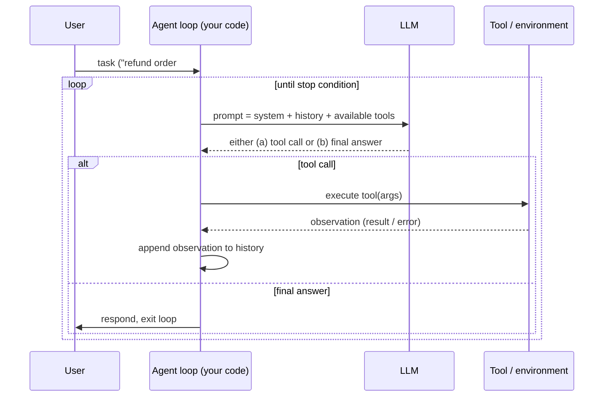
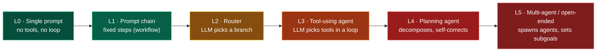
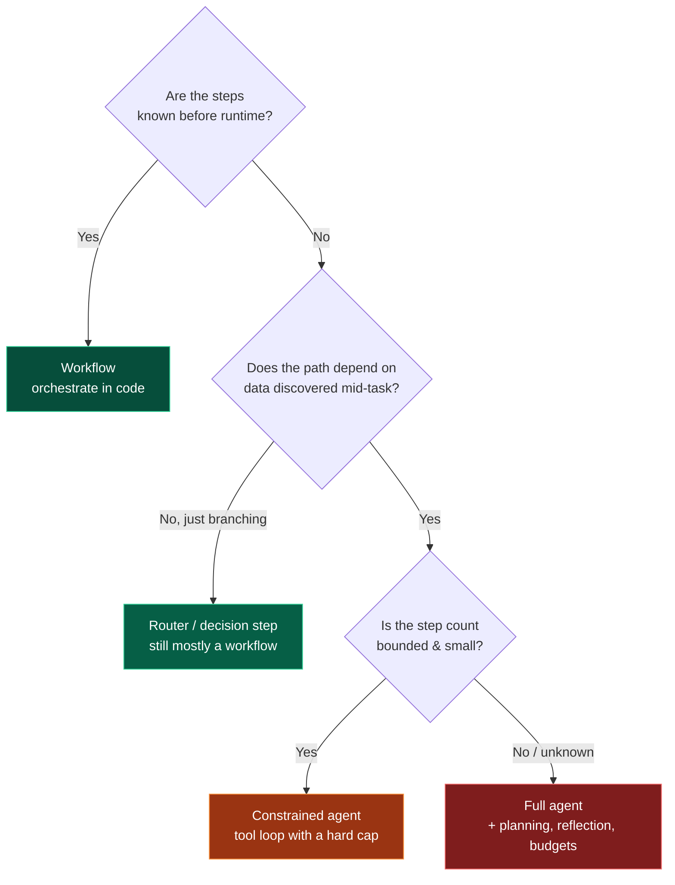

# 01 — Introduction

> By the end of this section you can place every later topic on a single map, and you can tell —
> for a given problem — whether you even *need* an agent.

**Prerequisites:** none (start here).
**You will be able to:**
- Define "agent" precisely and distinguish it from a workflow/pipeline.
- Reason about *autonomy levels* and pick the right one.
- Explain "why now" — what changed to make agents work.
- Avoid the single most expensive beginner mistake (building an agent when a workflow would do).

---

## 1. TL;DR

- An **agent** is *an LLM in a loop with tools, memory, and a stopping condition*, allowed to choose
  its next action. That's the whole idea; the other 25 sections make it reliable.
- **Agents ≠ workflows.** A workflow runs *your* predefined steps; an agent decides *its own* steps.
  Workflows are more predictable, cheaper, easier to test. **Default to a workflow; earn the agent.**
- The 2023–2026 unlock wasn't "smarter chatbots" — it was **reliable tool use + long context +
  cheaper inference**, which let LLMs *act*, not just *talk*.
- The hard problems are not "can the model do the task once?" but **reliability, safety,
  observability, latency, and cost** across thousands of runs. This guide is mostly about those five.
- Agentic systems fail in ways traditional software doesn't: **non-determinism, prompt injection,
  context rot, compounding error, silent degradation.** New failure modes need new engineering.

---

## 2. Concepts at three altitudes

### 🟢 Beginner — the mental model

You already know how to call an API. An LLM is an API that takes text and returns text. By itself it
can only *talk*. To make it *do* things, you give it:

1. **Tools** — functions it can ask you to run (search the web, query a DB, send an email).
2. **A loop** — after a tool runs, you feed the result back and ask "what next?"
3. **Memory** — so it remembers across steps and sessions.
4. **A stopping condition** — so it knows when the task is done (or when to give up).

That bundle — LLM + tools + loop + memory + stop — is an **agent**. Picture a capable new hire who
can read, reason, and use your internal tools, but who only "wakes up" when you give them a task and
whose entire short-term memory is whatever you hand them each time.

### 🟡 Intermediate — how it actually works

The loop, concretely:



Three things make this non-trivial in production:

- **The prompt is rebuilt every turn.** Each iteration you re-assemble system prompt + history +
  tool definitions + retrieved context. Context management ([§07](../07-Memory/)) is *the* recurring
  engineering problem.
- **The model's output is a proposal, not a command.** It *asks* to call a tool. Your code decides
  whether to allow it (guardrails, [§15](../15-Guardrails/)), executes it, and controls what comes back.
- **Errors compound.** A 95%-correct step, ten steps deep, is `0.95¹⁰ ≈ 60%` end-to-end. Reliability
  engineering ([§16](../16-Evaluation/), [§25](../25-Common-Failures/)) is not optional.

### 🔴 Expert — the trade-off surface

The expert framing isn't "how do I build an agent" — it's "**where on the autonomy spectrum should
this system sit, and what does that cost me?**"

Every step up in autonomy buys *flexibility* and pays in *predictability, testability, cost, and
attack surface*. The art is spending autonomy only where it earns its keep.



| Level | Predictability | Cost/latency | Test difficulty | Attack surface | Use when |
|---|---|---|---|---|---|
| L0–L1 (workflow) | High | Low | Low | Small | Steps are known in advance |
| L2 (router) | High | Low | Low | Small | A few known branches |
| L3 (tool agent) | Medium | Medium | Medium | Medium | Path depends on data discovered at runtime |
| L4 (planner) | Low | High | High | Large | Open-ended tasks, variable step count |
| L5 (multi-agent) | Lowest | Highest | Highest | Largest | Parallelizable sub-problems, scale beyond one context |

> [!IMPORTANT]
> **The expert default is to push *down* this ladder, not up.** Most "agent" projects that fail in
> production were L4/L5 problems that were actually L1/L2. More autonomy is a cost you justify, not a
> badge you earn. [§03](../03-Agent-Architecture/) and [§12](../12-Multi-Agent-Patterns/) give the
> explicit "when NOT to" criteria.

---

## 3. Agent vs. workflow — the decision that dominates everything

This is the most consequential early decision, so it gets its own treatment (expanded in
[§03](../03-Agent-Architecture/) and [§10](../10-Orchestration/)).



| | **Workflow** | **Agent** |
|---|---|---|
| Control flow | Code (you) | Model (it) |
| Predictability | High — same path each run | Low — path varies with input |
| Debuggability | Stack traces, breakpoints | Trajectory inspection ([§17](../17-Observability/)) |
| Cost | Bounded, estimable | Variable, must be capped |
| Best for | Known multi-step pipelines | Open-ended, data-dependent tasks |
| Example | "Summarize → translate → email" | "Investigate this alert and recommend action" |

> [!TIP]
> Anthropic's widely-cited guidance ("Building effective agents") lands here: **find the simplest
> solution, and only increase complexity when it demonstrably improves outcomes.** Many production
> "agents" are really workflows with one LLM decision step — and that's a feature, not a shortcoming.

---

## 4. Why now? (what actually changed)

Agents are an old idea (BDI agents, expert systems). Three changes made the LLM-based version *work*:

1. **Reliable structured tool calling** `[Established]` — models now emit valid, schema-constrained
   tool calls consistently enough to build on. Before ~2023 this was brittle. ([§05](../05-Tools-and-Function-Calling/))
2. **Long context + retrieval** — large context windows plus RAG ([§08](../08-RAG/)) let agents carry
   enough state to reason over real tasks. (With caveats — see *context rot* in [§02](../02-LLM-Fundamentals/).)
3. **Cost/latency collapse** — inference got cheap and fast enough that a *loop* (many calls per task)
   is economically viable, not just a single call. ([§21](../21-Cost-Optimization/))

A fourth, in 2024–2026: **standardization** — MCP ([§06](../06-MCP/)) for tools and A2A
([§13](../13-Agent-Communication/)) for agent interop turned bespoke integrations into protocols.

> [!NOTE]
> What did *not* change: LLMs are still **non-deterministic, ungrounded by default, and confidently
> wrong sometimes.** Agentic engineering is largely the discipline of building dependable systems on
> a probabilistic component — much like building reliable distributed systems on unreliable networks.

---

## 5. A concrete first example (so the abstractions land)

A minimal but *real-shaped* tool-using agent loop. This is intentionally framework-free so you see the
mechanics; [§03](../03-Agent-Architecture/) and [§11](../11-Single-Agent-Patterns/) rebuild it with
LangGraph and proper structure.

```python
from anthropic import Anthropic  # vendor SDK; OpenAI/others are analogous
client = Anthropic()

TOOLS = [{
    "name": "get_order_status",
    "description": "Look up an order's status and refund eligibility by order id.",
    "input_schema": {
        "type": "object",
        "properties": {"order_id": {"type": "string"}},
        "required": ["order_id"],
    },
}]

def get_order_status(order_id: str) -> dict:
    # Real impl hits your OMS. Returned dict becomes the model's observation.
    return {"order_id": order_id, "status": "delivered", "refund_eligible": True}

def run_agent(user_msg: str, max_steps: int = 6) -> str:
    messages = [{"role": "user", "content": user_msg}]
    for step in range(max_steps):                      # ← the stopping condition (hard cap)
        resp = client.messages.create(
            model="claude-sonnet-4-6",
            system="You are a support agent. Use tools to verify facts before acting. "
                   "Never promise a refund you haven't confirmed is eligible.",
            tools=TOOLS,
            messages=messages,
            max_tokens=1024,
        )
        if resp.stop_reason != "tool_use":             # model produced a final answer
            return "".join(b.text for b in resp.content if b.type == "text")

        messages.append({"role": "assistant", "content": resp.content})
        tool_results = []
        for block in resp.content:
            if block.type == "tool_use":
                # In production: validate args, check guardrails/permissions BEFORE executing.
                result = get_order_status(**block.input)
                tool_results.append({
                    "type": "tool_result",
                    "tool_use_id": block.id,
                    "content": str(result),
                })
        messages.append({"role": "user", "content": tool_results})
    raise RuntimeError("Agent exceeded step budget without finishing")  # ← failure is explicit
```

Notice what's already here in 30 lines: a **system prompt** (§04), **tools** (§05), the **loop** with
a **hard step cap** (the stopping condition), and an **explicit failure** path. Everything else in
this guide hardens, scales, secures, and observes this skeleton.

> [!WARNING]
> The comment `validate args, check guardrails BEFORE executing` is doing enormous work. A naive
> agent that executes whatever tool call the model emits — over data that may contain attacker text —
> is the canonical **prompt-injection-to-tool-abuse** vulnerability. See [§14](../14-Agent-Security/).

---

## 6. Anti-patterns ❌ → ✅

| ❌ Anti-pattern | Why it bites | ✅ Instead |
|---|---|---|
| "It's an AI project, so build an agent." | Pays L4/L5 costs for an L1 problem; flaky, expensive, hard to test. | Start with a workflow; add autonomy only where data-dependence demands it. |
| No step/cost budget on the loop | Runaway loops, surprise bills, latency cliffs. | Hard caps on steps, tokens, wall-clock, and \$ per task from day one ([§21](../21-Cost-Optimization/)). |
| "We'll add observability later." | You cannot debug a non-deterministic trajectory without traces. Later = never. | Tracing/eval are scaffolding, built *first* ([§16](../16-Evaluation/), [§17](../17-Observability/)). |
| Treating model output as trusted | Prompt injection, malformed args, hallucinated tool calls. | Validate every tool call; treat all model output as untrusted input to your systems ([§14](../14-Agent-Security/)). |
| Optimizing the prompt before measuring | You're tuning a thing you can't score. | Build an eval set first; let it tell you what to change ([§16](../16-Evaluation/)). |

---

## 7. Common failures (the ones that surprise traditional engineers)

| Symptom | Root cause | Where it's covered |
|---|---|---|
| "Works in the demo, flaky in prod" | Non-determinism + compounding error over many steps | [§16](../16-Evaluation/), [§25](../25-Common-Failures/) |
| Agent ignores instructions after a long conversation | Context rot / instructions buried mid-context | [§02](../02-LLM-Fundamentals/), [§07](../07-Memory/) |
| Agent did something destructive from a "helpful" web page | Indirect prompt injection via retrieved content | [§14](../14-Agent-Security/) |
| Costs 10× the estimate | Unbounded loops, no caching, oversized context | [§18](../18-Performance-Optimization/), [§21](../21-Cost-Optimization/) |
| Two agents loop forever talking to each other | No termination protocol / shared budget | [§13](../13-Agent-Communication/) |

---

## 8. The four implication lenses (preview)

Every section closes with these. For "should I build an agent at all":

- **Performance:** each autonomy level adds round-trips; an L4 task may be 10–50 LLM calls. Budget latency per step.
- **Security:** autonomy = capability = blast radius. An agent with tools is an *actor in your
  systems*; treat it with the same scrutiny as a service account ([§14](../14-Agent-Security/), [§22](../22-Enterprise-Patterns/)).
- **Scalability:** workflows scale like normal services; agents have *variable* per-task work, so you
  scale on a distribution, not a constant ([§19](../19-Scalability/)).
- **Cost:** the loop multiplies token spend. The cheapest agent is the one you didn't build (workflow);
  the second cheapest is the one with tight budgets and caching ([§21](../21-Cost-Optimization/)).

---

## 9. Decision framework — "do I need an agent?"

Answer in order; stop at the first "yes that fits":

1. **Can I enumerate the steps now?** → Workflow ([§10](../10-Orchestration/)). Done.
2. **Is it just choosing among a few known paths?** → LLM router + workflows. Done.
3. **Does the next step genuinely depend on data I'll only see at runtime, and is the step count
   small & bounded?** → **Constrained agent** (tool loop, hard cap, [§11](../11-Single-Agent-Patterns/)).
4. **Is the task open-ended with unknown depth, and is the value high enough to pay for planning,
   reflection, and heavy eval?** → **Full agent** ([§09](../09-Planning/), [§11](../11-Single-Agent-Patterns/)).
5. **Is it decomposable into parallel sub-problems, each needing its own context/specialization, and
   can I afford the coordination tax?** → **Multi-agent** ([§12](../12-Multi-Agent-Patterns/)) — and
   re-read [§12's "when NOT to"](../12-Multi-Agent-Patterns/) first.

---

## 10. Enterprise recommendations

- **Adopt a "minimum viable autonomy" principle** org-wide: teams must justify each step up the ladder.
- **Standardize the substrate, not the use case:** invest early in a shared platform for observability,
  eval, guardrails, identity, and tool/MCP registries ([§22](../22-Enterprise-Patterns/)) so every team
  doesn't reinvent the dangerous parts.
- **Treat agents as a new class of principal** in your security model — they authenticate, carry
  permissions, and act. Govern them like service accounts with audit trails, not like features.
- **Start with a high-value, low-blast-radius use case** (drafts a human approves) before anything
  that acts autonomously on production systems.

---

## 11. Interview-level questions

<details>
<summary><b>Q1.</b> A team says "we're building an autonomous multi-agent system for invoice
processing." What questions do you ask before approving the architecture?</summary>

Probe whether autonomy is justified: *Are the steps actually unknown at design time, or just
numerous?* Invoice processing is usually a **workflow** (extract → validate → match PO → route for
approval) with at most one or two LLM decision points. Ask for the eval set, the per-invoice cost/latency
budget, the failure/rollback story, the human-in-the-loop checkpoint for money-moving actions, and the
blast radius if an invoice contains adversarial text (indirect prompt injection). The likely correct
architecture is L1–L2, not L5. The "multi-agent" framing is a smell unless they can name the parallel,
independently-specialized sub-problems.
</details>

<details>
<summary><b>Q2.</b> Why is a 95%-reliable single step a problem, and what do you do about it?</summary>

Errors compound multiplicatively across a trajectory (`0.95¹⁰ ≈ 60%`). Mitigations: reduce step count
(simpler architecture), make steps verifiable (tools return checkable results), add reflection/self-
correction at key points, gate irreversible actions behind validation or humans, and — critically —
*measure* end-to-end task success with an eval set rather than per-step accuracy. You manage the
distribution, not a single happy path.
</details>

<details>
<summary><b>Q3.</b> Distinguish a workflow from an agent and give a real case where you'd refuse to
build the agent version.</summary>

Workflow = control flow in code on predefined paths; agent = control flow chosen by the model at
runtime. Refuse the agent where the task is fully enumerable and the cost of non-determinism is high —
e.g., a nightly financial reconciliation. You don't want a system that *sometimes takes a different
path* moving money. Use deterministic orchestration with LLM calls only for the genuinely fuzzy
sub-steps (e.g., matching a free-text memo to a vendor), each independently testable.
</details>

<details>
<summary><b>Q4.</b> What's "context rot" and why does it change how you design agents?</summary>

Quality degrades as used context grows, even below the hard token limit — buried instructions get
ignored, retrieval precision drops. It means "stuff everything into the prompt" is wrong: you design
*active context management* (summarize, retrieve just-in-time, keep the system prompt and current task
salient). It's why memory ([§07](../07-Memory/)) and RAG ([§08](../08-RAG/)) are architecture, not
add-ons. See [§02](../02-LLM-Fundamentals/).
</details>

---

### Sources
- Anthropic, *Building Effective Agents* (engineering blog) — the workflow-vs-agent framing and
  "simplest thing that works" principle. `[Established]`
- OpenAI, *A Practical Guide to Building Agents*. `[Established]`
- Foundational agent theory: Russell & Norvig, *AIMA* (agent definitions, rationality, environments).
- Compounding-error reasoning is arithmetic; reliability practices are covered with citations in
  [§16](../16-Evaluation/) and [§25](../25-Common-Failures/).

> Next: [§02 — LLM Fundamentals](../02-LLM-Fundamentals/) builds the substrate every agent runs on.
