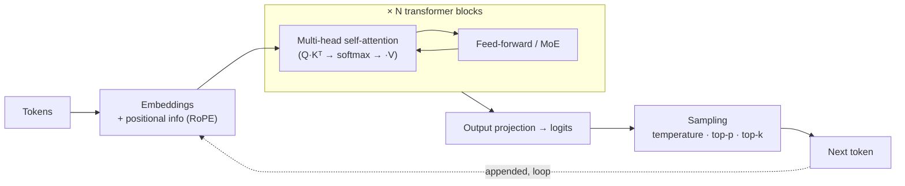
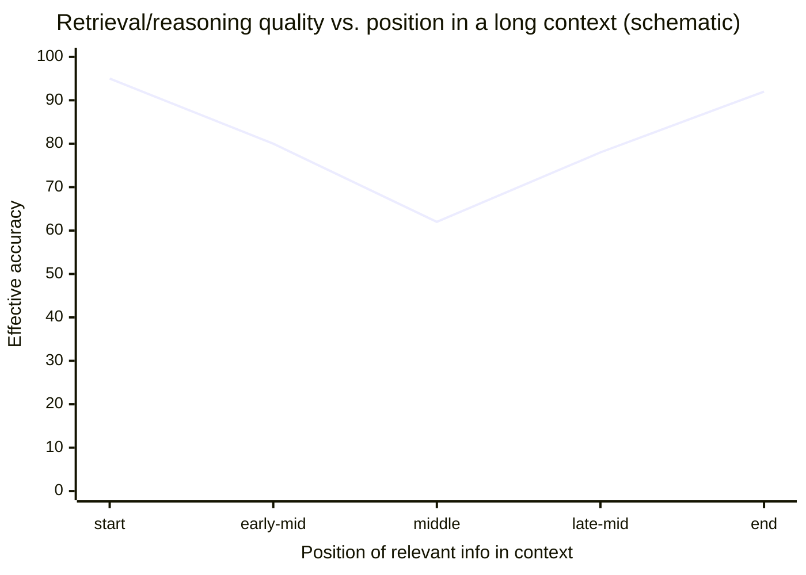
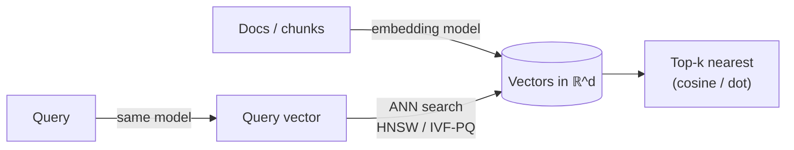
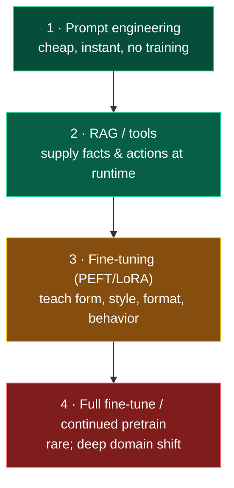
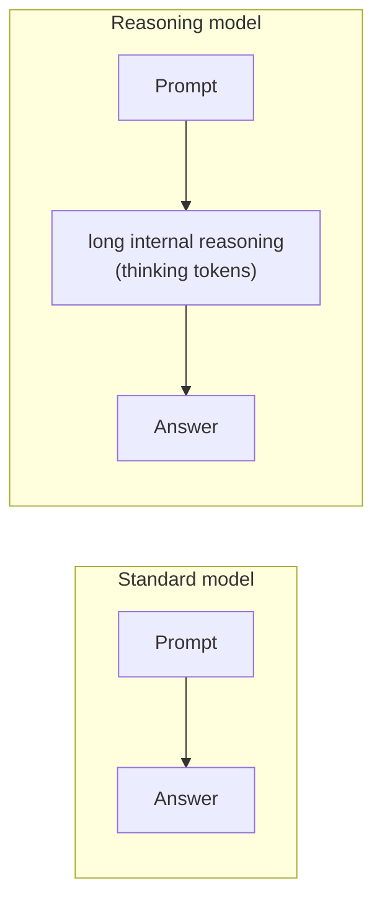
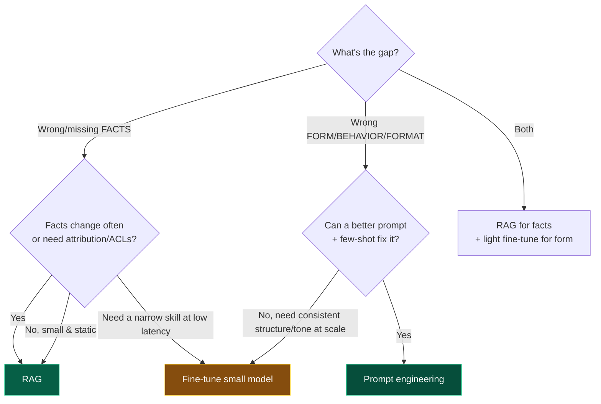

# 02 — LLM Fundamentals

> By the end of this section you understand the substrate every agent runs on well enough to reason
> about its cost, latency, failure modes, and limits — not just call its API.

**Prerequisites:** [§01](../01-Introduction/).
**You will be able to:**
- Explain tokens, attention, context, and inference precisely enough to debug a latency or cost problem.
- Reason about *why* long context degrades and design around it.
- Choose between fine-tuning, RAG, and prompting on principled grounds.
- Build a defensible model-selection / routing strategy.

> [!NOTE]
> This is a **flagship depth-reference** section. Skim the 🟢/🟡 altitudes if you've trained models;
> the 🔴 trade-off surface and selection framework are where the architectural value is.

---

## 1. TL;DR

- An LLM is a **transformer** trained to **predict the next token**. Everything it "knows" or "does"
  is emergent from that objective at scale. It is **not** a database and **not** deterministic.
- **Tokens** are the unit of everything: cost, context limits, and latency are all per-token. ~4 chars
  ≈ 1 token in English; code, JSON, and non-English text are *less* efficient.
- **Attention** lets every token weigh every other token. Compute scales **quadratically** with
  sequence length; the **KV cache** (memory) scales **linearly**. This dominates inference economics.
- **Context window** is both a hard limit and a soft quality cliff (**context rot** / "lost in the
  middle"): more context ≠ better answers past a point.
- **Inference has two phases** — *prefill* (process the prompt, compute-bound) and *decode* (emit
  tokens one-by-one, memory-bandwidth-bound). They have opposite optimization levers.
- **Adaptation ladder:** prompt → RAG → fine-tune, in that order of "try first." Fine-tuning teaches
  *form/behavior*, not fresh *facts*; RAG supplies *facts*. Confusing these wastes months.
- **Reasoning models** spend extra inference compute ("thinking") before answering — better on hard
  multi-step problems, worse on latency and cost. Match the model class to the task.

---

## 2. Concepts at three altitudes

### 🟢 Beginner — the mental model

An LLM has read an enormous amount of text and learned one skill extremely well: **given some text,
predict what comes next.** "The capital of France is ___" → "Paris." Chat, code, and reasoning are all
that same next-token prediction, dressed up. Crucially:

- It has **no memory** between calls unless you supply it (that's why agents re-send history).
- It has **no live knowledge** — only what was in its training data, frozen at a cutoff date. (RAG and
  tools fix this.)
- It is **probabilistic** — ask twice, you may get different wordings. This is a feature for
  creativity and a hazard for reliability.

### 🟡 Intermediate — how it actually works

**Tokenization.** Text is split into tokens by a learned vocabulary (usually byte-pair encoding, BPE).
"tokenization" might be `token` + `ization`. Why you care:

```python
# Token counts are not word counts. Measure, don't guess.
import tiktoken                                   # OpenAI tokenizer; vendors differ slightly
enc = tiktoken.get_encoding("o200k_base")
print(len(enc.encode("Hello, world!")))           # ~4 tokens
print(len(enc.encode('{"k": "v"}')))              # JSON wastes tokens on punctuation
# Anthropic exposes client.messages.count_tokens(...) for exact Claude counts.
```

> [!TIP]
> English ≈ 4 chars/token. **Code, JSON, and CJK/Indic languages are markedly less efficient** — a
> JSON payload can be 2–3× the tokens of the same data described in prose. This directly affects cost
> ([§21](../21-Cost-Optimization/)) and how much fits in context.

**The transformer, in one breath.** Tokens → embeddings (vectors) → stacked **attention** + feed-forward
layers → a probability distribution over the next token → sample one → append → repeat.

**Attention** is the core mechanism. For each token, the model computes a **Query**, and every token
exposes a **Key** and **Value**. A token "attends to" others by dot-producting its Query against their
Keys (how relevant?), softmax-normalizing, and taking a weighted sum of Values. *Multi-head* attention
does this in several subspaces at once. **Decoder-only** LLMs use **causal masking** — a token can
only attend to earlier tokens (you can't see the future you're predicting).



**Sampling controls** turn the probability distribution into a choice:
- **temperature** — flattens (high) or sharpens (low) the distribution. `0` ≈ greedy/most-likely.
- **top-p (nucleus)** — sample only from the smallest set of tokens whose cumulative probability ≥ p.
- **top-k** — sample only from the k most likely tokens.

```python
# Lower temperature for extraction/routing/tool-arg generation (you want stability).
# Higher for brainstorming/drafting. There is no universally "correct" value — it's task-dependent.
resp = client.messages.create(model="claude-sonnet-4-6", temperature=0.0,  # deterministic-ish
                              max_tokens=512, messages=[...])
```

> [!WARNING]
> `temperature=0` is **not** a guarantee of determinism. Floating-point non-associativity across
> hardware/batching, MoE routing, and provider-side changes mean identical inputs can still differ.
> Never build correctness on "temp 0 = same output." Build on validation and evals ([§16](../16-Evaluation/)).

### 🔴 Expert — the trade-off surface

**Inference is two different programs.** Knowing this is the key to all LLM performance work:

| Phase | What it does | Bottleneck | Scales with | Lever |
|---|---|---|---|---|
| **Prefill** | Process the entire prompt at once | **Compute** (GPU FLOPs) | prompt length (parallel) | Smaller prompts; **prompt caching** reuses prefill |
| **Decode** | Emit output tokens one at a time | **Memory bandwidth** (read KV cache + weights per token) | output length (sequential) | Fewer output tokens; batching; speculative decoding |

Implications you'll use constantly:
- **TTFT** (time-to-first-token) is dominated by prefill → by prompt size. **TPOT** (time-per-output-token)
  is dominated by decode → by output size and model size. Optimize the one that's hurting you ([§18](../18-Performance-Optimization/)).
- **Prompt caching** caches the KV state of a stable prefix (system prompt, tools, long context) so
  repeat calls skip re-prefilling it — large latency *and* cost wins for agents that re-send a big
  stable preamble every loop turn. `[Established]` ([§18](../18-Performance-Optimization/), [§21](../21-Cost-Optimization/)).
- **Output tokens cost more than input tokens** (they're generated sequentially and, with most vendors,
  priced higher). "Be concise" is a cost lever, not just style.

**Why long context degrades (context rot).** Two separate effects:
1. **Architectural cost:** attention is O(n²) in sequence length for compute and the KV cache is O(n)
   in memory. Long contexts are expensive and slow even when they fit.
2. **Quality cliff** `[Established]`: empirically, models retrieve and reason best over information at
   the **start and end** of the context and worst in the **middle** ("lost in the middle"). "Needle in
   a haystack" tests can look great while *multi-fact reasoning across* a long context quietly fails.



> [!IMPORTANT]
> The architectural takeaway: **context is a managed resource, not a dumping ground.** Keep the system
> prompt and the *current* task salient; retrieve facts just-in-time ([§08](../08-RAG/)); summarize or
> evict stale history ([§07](../07-Memory/)). This is why "memory" and "RAG" are core sections, not
> optional extras — they exist to *manage the context budget*.

**Mixture-of-Experts (MoE)** `[Established]`: many frontier models route each token through only a few
of many "expert" sub-networks, so *active* parameters per token ≪ total parameters. Effect: a model
can be large (capable) yet relatively cheap/fast to run, but with lumpier latency and bigger memory
footprint. You mostly see this as "big-model quality at mid-model speed."

---

## 3. Embeddings & vector search (the other model class)

Generation models predict tokens; **embedding models** map text → a fixed-length vector where
*semantic similarity ≈ geometric closeness*. They power RAG ([§08](../08-RAG/)), semantic caching
([§18](../18-Performance-Optimization/)), and long-term memory ([§07](../07-Memory/)).



```python
# Embeddings are just vectors; similarity is geometry. Cosine is the usual metric.
import numpy as np
def cosine(a: np.ndarray, b: np.ndarray) -> float:
    return float(a @ b / (np.linalg.norm(a) * np.linalg.norm(b)))
# At scale you never brute-force: an ANN index (HNSW, IVF-PQ) trades a little recall for huge speed.
```

Expert notes:
- **The query and corpus must use the *same* embedding model.** Mixing models = meaningless distances.
  Changing models later means **re-embedding the entire corpus** — a real migration cost ([§08](../08-RAG/)).
- **Dimensionality** trades recall vs. memory/speed. Some models support *Matryoshka* truncation
  (shorten the vector with graceful degradation) `[Emerging→Established]`.
- **Cosine vs. dot product** depends on whether vectors are normalized; match your index's metric to
  how the model was trained.

---

## 4. Adapting a model to your task — the ladder

The most common expensive mistake is reaching for fine-tuning to inject knowledge. Climb this ladder
**top-down**; only descend when the rung above is proven insufficient.



| Technique | Teaches the model… | Good for | Not good for | Cost |
|---|---|---|---|---|
| **Prompting** | (nothing — just instructs) | Behavior shaping, formats, few-shot | Large/volatile knowledge | ~0 |
| **RAG** | (nothing — supplies context) | **Fresh/proprietary facts**, citations, access control | Changing the model's *style* or skills | Low–med |
| **Fine-tune (LoRA/PEFT)** | Form, tone, structure, narrow skill, tool-calling format | Consistent output shape, domain phrasing, latency (smaller model matches bigger one on a narrow task) | Injecting large factual corpora; facts that change | Med |
| **Full FT / continued pretrain** | Deep new distribution | Genuinely new domain language (e.g., niche legal/medical) | Almost everything else (overkill) | High |

> [!IMPORTANT]
> **`[Established]` rule of thumb:** *RAG for what the model should **know**; fine-tuning for how it
> should **behave**.* If your "we need to fine-tune on our docs" goal is to answer questions about
> those docs, you almost certainly want **RAG** ([§08](../08-RAG/)) — it's cheaper, updatable without
> retraining, attributable, and access-controllable. Fine-tuning bakes facts in statically and they
> rot. The decision matrix is in [§20 of this section](#10-decision-framework).

**How models are aligned (so you know what you're buying).** Base models predict text; they're not
helpful or safe out of the box. Alignment pipeline:
1. **SFT** (supervised fine-tuning) on instruction/response pairs → "follows instructions."
2. **Preference optimization** → "helpful, harmless, honest":
   - **RLHF** (reward model + PPO) `[Established]` — humans rank outputs; a reward model learns the
     ranking; RL optimizes the policy against it.
   - **DPO** / direct preference methods `[Established]` — skip the separate reward model; optimize on
     preference pairs directly. Simpler, widely used.
   - **RLAIF / Constitutional AI** `[Established]` — use AI feedback against a written set of principles
     to scale alignment with less human labeling (Anthropic's approach).
3. **Reasoning RL** `[Established, 2024→]` — reward *correct multi-step reasoning*, producing models
   that generate long internal chains-of-thought ("thinking") before answering.

---

## 5. Reasoning models & test-time compute `[Established, evolving]`

A distinct model class (OpenAI o-series, Anthropic extended-thinking, Gemini "thinking", DeepSeek-R1,
and successors) trained to **spend more inference compute deliberating** before responding.



- **Win:** materially better on math, coding, planning, and multi-step logic. The agent's *planner*
  ([§09](../09-Planning/)) often benefits most.
- **Cost:** "thinking" tokens are real tokens — **higher latency and cost per call.** A reasoning model
  on a trivial task is waste.
- **Architectural pattern `[Established]`:** **route by difficulty** — cheap/fast model for the 80% easy
  path, reasoning model for the hard 20%. (Router shown in [§9 code](#7-code-production-grade-model-router).)
- **`[Contested]`:** whether to expose raw thinking to users (debuggability vs. confusion vs. leaking
  unsafe intermediate content). Default: log it ([§17](../17-Observability/)), don't surface it raw.

---

## 6. The model landscape & how to compare (2026-06)

> [!CAUTION]
> **Specific benchmark scores, prices, and context lengths rot in weeks.** This guide deliberately
> compares **families and characteristics**, and teaches you to *re-derive* the choice from current
> vendor docs + your own eval. Never ship a model choice you didn't validate on *your* eval set.

| Family | Access | Strengths (family-level, as of 2026-06) | Watch-outs | Typical fit |
|---|---|---|---|---|
| **Claude** (Anthropic) | API, AWS Bedrock, GCP Vertex | Strong agentic tool use, long-context handling, steerability, safety; prompt caching; extended thinking | Closed weights; per-token cost at top tier | Production agents, coding, tool-heavy workflows |
| **GPT** (OpenAI) | API, Azure | Broad ecosystem, strong general + reasoning (o-series), wide tooling/Responses API | Closed weights | General assistants, broad coverage |
| **Gemini** (Google) | API, Vertex | Very long context, strong multimodal, tight GCP integration | Closed weights | Multimodal, GCP-native, long-doc |
| **Open-weight** (Llama, Mistral/Mixtral, Qwen, DeepSeek, Gemma, etc.) | **Self-host** or hosted | Control, privacy/residency, no per-token API fee, fine-tune freely, no vendor lock-in | You own infra, scaling, safety, evals; ops burden | Data-residency, high volume, customization, edge |

**Hybrid architectures `[Established]`** — most mature platforms are **multi-model**, not loyal to one:
- **Tiered routing:** small model for classification/routing/extraction; mid model for most work;
  frontier/reasoning model for hard steps. (Big cost win — [§21](../21-Cost-Optimization/).)
- **Task specialization:** one family for coding, another for multimodal, a self-hosted model for
  PII-sensitive data that can't leave your VPC.
- **Fallback chains:** provider/region failover for availability ([§19](../19-Scalability/)).
- **Abstraction layer:** route through a gateway (LiteLLM, a cloud model gateway, or your own) so
  swapping models is config, not a rewrite. **Build this early** — model choice *will* change.

**Selection criteria that *don't* rot** (apply these, then check today's numbers):
1. **Capability on *your* eval** — not a public leaderboard ([§16](../16-Evaluation/)).
2. **Latency budget** — TTFT and TPOT against your UX SLA ([§18](../18-Performance-Optimization/)).
3. **Cost at *your* token profile** — input/output ratio, caching hit rate ([§21](../21-Cost-Optimization/)).
4. **Context length needed** — and whether the model is *good* at using it, not just accepts it.
5. **Modality** — text-only vs. vision/audio.
6. **Deployment & data constraints** — API vs. self-host; residency, privacy, air-gap ([§22](../22-Enterprise-Patterns/)).
7. **Tool-use / structured-output quality** — decisive for agents ([§05](../05-Tools-and-Function-Calling/)).
8. **Governance** — data-retention terms, IP indemnity, certifications.

---

## 7. Code: production-grade model router

A capability-tiered router with cost-aware fallback — the practical embodiment of "hybrid architecture."

```python
from enum import Enum
from pydantic import BaseModel
from anthropic import Anthropic, APIStatusError

class Tier(str, Enum):
    CHEAP = "claude-haiku-4-5-20251001"     # routing, classification, extraction
    STANDARD = "claude-sonnet-4-6"          # default workhorse
    REASONING = "claude-opus-4-8"           # hard multi-step / planning

class Task(BaseModel):
    prompt: str
    difficulty: float           # 0..1, e.g. from a cheap classifier or heuristics
    needs_reasoning: bool = False
    max_tokens: int = 1024

def pick_tier(t: Task) -> Tier:
    if t.needs_reasoning or t.difficulty > 0.75:
        return Tier.REASONING
    if t.difficulty < 0.25:
        return Tier.CHEAP
    return Tier.STANDARD

def run(task: Task, client: Anthropic) -> str:
    # Try the chosen tier, fall back UP on overload/errors for availability,
    # never silently fall back DOWN in capability without flagging it.
    order = {Tier.CHEAP: [Tier.CHEAP, Tier.STANDARD],
             Tier.STANDARD: [Tier.STANDARD, Tier.REASONING],
             Tier.REASONING: [Tier.REASONING]}[pick_tier(task)]
    last_err: Exception | None = None
    for tier in order:
        try:
            r = client.messages.create(model=tier.value, max_tokens=task.max_tokens,
                                       messages=[{"role": "user", "content": task.prompt}])
            return "".join(b.text for b in r.content if b.type == "text")
        except APIStatusError as e:
            if e.status_code in (429, 503, 529):     # overloaded / rate-limited → try next tier
                last_err = e
                continue
            raise
    raise RuntimeError(f"All tiers exhausted: {last_err}")
```

> [!TIP]
> In real systems, put this behind a **gateway** (LiteLLM / cloud model gateway) so the tier→model map,
> retries, budgets, and provider failover are centralized config, observable, and swappable without
> touching agent code. Model IDs above are illustrative — confirm current IDs in vendor docs.

---

## 8. Anti-patterns ❌ → ✅

| ❌ Anti-pattern | Why it bites | ✅ Instead |
|---|---|---|
| Fine-tune to "teach the model our docs" | Facts rot; not attributable; expensive; re-train on every change | **RAG** for facts; fine-tune only for *behavior/format* |
| Stuff the whole knowledge base into context | Context rot, latency, cost; quality *drops* | Retrieve just-in-time; manage the context budget ([§07](../07-Memory/), [§08](../08-RAG/)) |
| One frontier model for everything | 5–20× overspend; over-latency on trivial calls | Tiered routing; cheapest model that passes the eval |
| Hard-code a model ID across the codebase | Painful migrations; no failover | Route through a gateway/abstraction |
| Assume `temperature=0` ⇒ deterministic | Builds correctness on a false premise | Validate outputs; rely on evals, not determinism |
| Pick a model from a public leaderboard | Leaderboards ≠ your task/data | Evaluate on *your* eval set ([§16](../16-Evaluation/)) |
| Measure context in words/chars | Off by 2–3× on code/JSON; budget blowouts | Count tokens with the real tokenizer |

---

## 9. Common failures & troubleshooting

| Symptom | Likely root cause | Detection | Resolution |
|---|---|---|---|
| Answers degrade as conversation grows | Context rot / lost-in-the-middle | Eval accuracy vs. context length; trace token counts | Summarize/evict history; move key instructions to start & end; retrieve JIT |
| Surprise high bill | Output-heavy responses; no prompt caching; oversized context; frontier model on easy tasks | Cost-per-trace dashboards ([§17](../17-Observability/)) | Concise outputs; enable prompt caching; route by difficulty |
| High TTFT (slow to start) | Large prompt → long prefill | Measure TTFT vs. prompt tokens | Trim/cache prompt prefix; structured retrieval |
| High total latency on long answers | Decode-bound (long output, big model) | Measure TPOT × output tokens | Smaller model; cap `max_tokens`; stream to the user |
| RAG retrieval returns garbage after a model swap | Corpus embedded with a *different* model | Check embedding model version in index metadata | Re-embed corpus with the new model |
| Non-reproducible outputs break a test | Relying on determinism | Test flakiness | Assert on *properties/schema*, not exact strings ([§16](../16-Evaluation/)) |

---

## 10. Decision framework

**Prompt vs. RAG vs. fine-tune:**



**Which model tier:** cheapest model that passes your eval for that *step* — not the task. Different
steps in one agent legitimately use different tiers (classify with cheap, plan with reasoning, draft
with standard).

**API vs. self-host:** API by default (someone else runs the GPUs, safety, and uptime). Self-host when
data residency/privacy forbids egress, volume makes per-token economics lose to owned infra, you need a
model you can fine-tune freely, or you need air-gap/edge. Then you own scaling, safety, and evals — a
real platform commitment ([§19](../19-Scalability/), [§20](../20-Deployment/)).

---

## 11. Enterprise recommendations

- **Model gateway from day one.** Never let agent code import a model ID directly. Centralize routing,
  budgets, caching, failover, and audit there.
- **Multi-model by default.** Avoid single-vendor lock-in; keep a fallback family and (if residency
  matters) a self-hostable open-weight option qualified on your evals.
- **Token accounting is FinOps.** Track tokens-per-task as a first-class metric; alert on regressions
  ([§21](../21-Cost-Optimization/)).
- **A model change is a deploy.** Version model choices, gate them behind your eval suite, and roll out
  with canaries — model upgrades can silently regress *your* task even when "better" overall.
- **Data governance:** know each provider's retention/training terms; route PII-bearing prompts only to
  approved models/regions; prefer providers offering zero-retention and IP indemnity for production.

---

## 12. Interview-level questions

<details>
<summary><b>Q1.</b> A team wants to fine-tune a model on 50k internal support tickets so it can answer
customer questions. Good idea?</summary>

Usually **no** — that's a knowledge problem, and fine-tuning bakes facts in statically (they rot, aren't
attributable, can't be access-controlled, and require retraining to update). The right answer is **RAG**
over the tickets/knowledge base ([§08](../08-RAG/)). Fine-tuning *might* help **secondarily** to fix the
*tone/format* of answers or to make a small, cheap model match a big one on this narrow task — but only
after RAG handles the facts and prompting is exhausted. Ask: do they need fresh facts (RAG) or consistent
behavior (fine-tune)? Almost always the former.
</details>

<details>
<summary><b>Q2.</b> Your agent's p95 latency is too high. Walk me through diagnosis.</summary>

Split latency into **TTFT** and **TPOT × output tokens**. High TTFT ⇒ **prefill-bound** ⇒ prompt is too
big: trim history, retrieve JIT instead of stuffing context, and enable **prompt caching** on the stable
prefix. High TPOT/long outputs ⇒ **decode-bound** ⇒ use a smaller/faster model for that step, cap
`max_tokens`, and **stream** so perceived latency drops. Also check: are you making N sequential LLM
calls in the loop that could be parallelized or collapsed? Is a reasoning model being used where a
standard one would do? Measure with traces ([§17](../17-Observability/)) before changing anything.
</details>

<details>
<summary><b>Q3.</b> Why does giving the model *more* relevant context sometimes make answers worse?</summary>

**Context rot / lost-in-the-middle:** retrieval and reasoning quality is highest at the start/end of
context and degrades in the middle; more tokens also mean more distractors and higher cost/latency. A
"needle in a haystack" pass can hide failures on *multi-fact* reasoning. Design implication: curate and
*order* context (key instructions and most-relevant evidence at the edges), retrieve precisely rather
than broadly, and treat context as a budgeted resource — which is the whole point of [§07](../07-Memory/)
and [§08](../08-RAG/).
</details>

<details>
<summary><b>Q4.</b> Explain prefill vs. decode and why it changes your cost model.</summary>

Prefill processes the whole prompt in parallel (compute-bound) and sets TTFT; decode emits output tokens
one at a time (memory-bandwidth-bound) and sets TPOT. They scale with *input* and *output* size
respectively and respond to *different* levers. Cost-wise: output tokens are generated sequentially and
typically priced higher, so verbosity is expensive; large stable prompts are cheap to *re-use* via prompt
caching (skip re-prefill) but expensive to *re-send uncached*. This is why "concise outputs + cached
prefixes + right-sized model per step" is the core cost playbook ([§21](../21-Cost-Optimization/)).
</details>

<details>
<summary><b>Q5.</b> When would you self-host an open-weight model over a frontier API?</summary>

When (a) data residency/privacy/air-gap forbids sending data to a third party; (b) volume is high enough
that owned-GPU economics beat per-token pricing; (c) you need to fine-tune freely or pin a version
forever; or (d) you need edge/offline deployment. The trade: you now own GPU ops, autoscaling, safety
tuning, and your own evals — a platform commitment, not a config change. For most teams, API-first with a
qualified open-weight fallback is the pragmatic middle ground.
</details>

---

### Sources
- Vaswani et al., *Attention Is All You Need* (2017) — the transformer. `[Established]`
- Liu et al., *Lost in the Middle* (2023) — positional degradation in long context. `[Established]`
- Ouyang et al., *InstructGPT* (RLHF); Rafailov et al., *DPO*; Bai et al., *Constitutional AI / RLAIF*. `[Established]`
- Lewis et al., *Retrieval-Augmented Generation* (2020). `[Established]`
- Vendor docs (verify current specifics): Anthropic (tool use, prompt caching, extended thinking),
  OpenAI (Responses API, reasoning models), Google (Gemini long context). Numbers change — re-check.

> Next: [§03 — Agent Architecture](../03-Agent-Architecture/) assembles this substrate into the agent loop.
