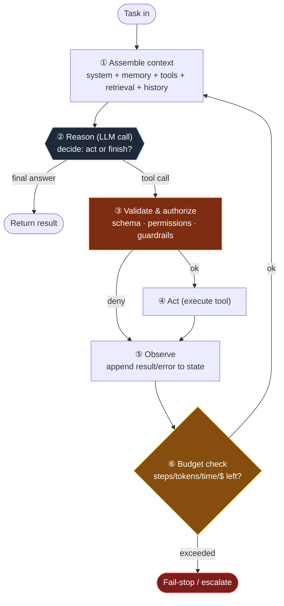
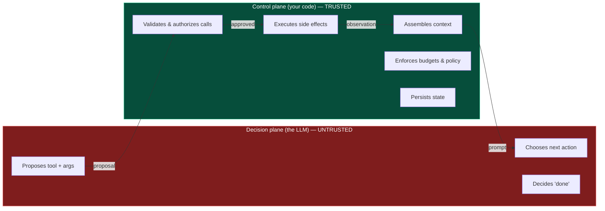
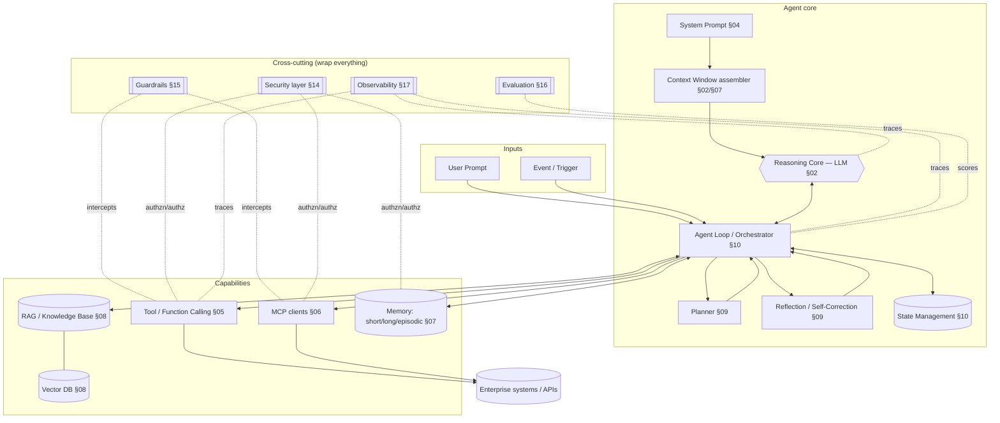
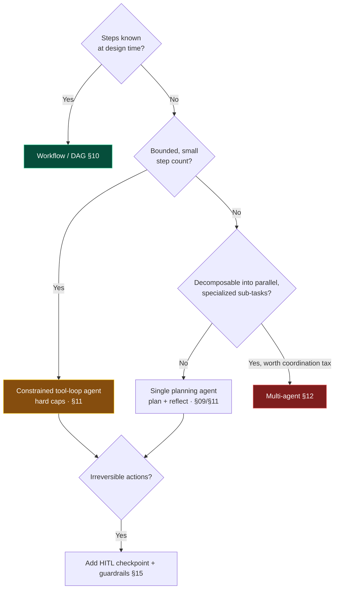

# 03 — Agent Architecture

> By the end of this section you can draw the anatomy of any agent, name every component and its
> failure modes, and implement a robust agent loop with budgets, state, and error handling.

**Prerequisites:** [§01](../01-Introduction/), [§02](../02-LLM-Fundamentals/).
**You will be able to:**
- Decompose any agent into its standard components and explain how they interact.
- Implement the agent loop as an explicit, debuggable state machine (not a `while True`).
- Reason about autonomy levels and the control-vs-flexibility trade.
- Place every other section of this guide on the agent's anatomy.

> [!NOTE]
> **Flagship section.** This is also where your "Components of an AI Agent" requirement lives:
> §4 below is the component-by-component anatomy (purpose · failure mode · where to go deep). Each
> component then gets a full dedicated section later in the guide.

---

## 1. TL;DR

- An agent = **reasoning core (LLM) + loop + tools + context/memory + stopping condition**, wrapped by
  **guardrails** and **observability**. Memorize the anatomy diagram in §3; everything hangs off it.
- The loop is **think → act → observe**, repeated. In production it must be a **state machine** with
  explicit budgets (steps, tokens, time, \$) and explicit failure/exit states — never an open `while`.
- **Decision-making is the LLM's job; control, validation, and side effects are your code's job.**
  Keeping that boundary crisp is the difference between a demo and a product.
- **Autonomy is a dial, not a switch.** Pick the lowest level that solves the problem ([§01](../01-Introduction/)).
- The architecture's hard parts are **context assembly** (what goes in the window each turn),
  **state management** (what persists), and **the act boundary** (where untrusted model output meets
  your real systems).

---

## 2. Concepts at three altitudes

### 🟢 Beginner — the mental model

An agent is a **control loop around an LLM**. Compare it to a REPL: read (assemble context), eval (ask
the model), print (do what it asked — call a tool), loop. The LLM is the "brain" that decides; your
code is the "body and nervous system" that senses (gathers context), acts (runs tools), and remembers
(state/memory). The brain never touches your database directly — it *asks*, and the body decides whether
and how to comply.

### 🟡 Intermediate — the agent loop as a cycle



The five things juniors forget, all visible above: **(③)** validation before acting, **(⑥)** budgets,
the explicit **fail-stop** state, the fact that context is **re-assembled every turn** (①), and that a
denied/failed tool call is just another **observation** (⑤) the model must handle — not a crash.

### 🔴 Expert — agent lifecycle & the control/decision boundary

Two lifecycles to hold in mind:

**Per-task lifecycle** (one request): `admit → plan? → loop(assemble→reason→act→observe) → verify →
respond → persist`. Each arrow is an interception point for policy, eval, and observability.

**Operational lifecycle** (the agent as a deployed service): `define → evaluate → deploy → observe →
improve` — a continuous loop where production traces feed your eval set, which gates the next version.
Agents are **never "done"**; they're operated. ([§16](../16-Evaluation/), [§17](../17-Observability/)).

The **control/decision boundary** is the load-bearing architectural idea:



> [!IMPORTANT]
> **Everything the model emits is untrusted input to your systems** — exactly like a request from the
> public internet. The model *proposes*; the control plane *disposes*. Blur this boundary and you get
> the canonical agent vulnerabilities (prompt-injection → tool-abuse, [§14](../14-Agent-Security/)). This
> single principle drives the design of tools ([§05](../05-Tools-and-Function-Calling/)), guardrails
> ([§15](../15-Guardrails/)), and security ([§14](../14-Agent-Security/)).

---

## 3. The anatomy of an agent (the master diagram)



Use this as the index to the whole guide: every box is a section.

---

## 4. Components of an AI agent — the anatomy table

For each component: **purpose · key design choice · headline production failure · where to master it.**
(Each row's full treatment — patterns, code, anti-patterns, deep failures — lives in the linked section.)

| Component | Purpose | Key design choice | Headline production failure | Deep dive |
|---|---|---|---|---|
| **System prompt** | Fix identity, constraints, output contract | Stable & cacheable vs. dynamic | Instruction conflict; injection override | [§04](../04-System-Prompts/) |
| **User prompt / input** | The task + untrusted data | Separate *instructions* from *data* | Treating input as trusted → injection | [§04](../04-System-Prompts/), [§14](../14-Agent-Security/) |
| **Context window** | The model's working surface each turn | What to include/evict/order | Context rot; token overflow | [§02](../02-LLM-Fundamentals/), [§07](../07-Memory/) |
| **Reasoning core (LLM)** | Decide next action; generate | Which tier per step | Hallucinated tool calls; wrong tier | [§02](../02-LLM-Fundamentals/) |
| **Tool calling** | Read/act on the world | Granularity, schema design | Malformed args; over-broad tools | [§05](../05-Tools-and-Function-Calling/) |
| **Function calling** | The mechanism behind tools | Schema-constrained outputs | Schema/JSON validity failures | [§05](../05-Tools-and-Function-Calling/) |
| **MCP** | Standardized tool/resource access | Local vs. remote; auth | Over-trusted server; token passthrough | [§06](../06-MCP/) |
| **RAG** | Ground answers in source-of-truth | Chunking, hybrid, re-rank | Bad retrieval → confident wrong answers | [§08](../08-RAG/) |
| **Knowledge base** | Curated authoritative corpus | Freshness, ACLs | Stale or unauthorized data | [§08](../08-RAG/), [§22](../22-Enterprise-Patterns/) |
| **Vector database** | ANN search over embeddings | Index, metric, metadata filters | Embedding-model drift; recall loss | [§08](../08-RAG/) |
| **Planner** | Decompose open-ended tasks | Plan-first vs. interleaved | Over-planning; brittle plans | [§09](../09-Planning/) |
| **Reflection** | Critique & retry | When/how often to reflect | Reflection loops; cost blowup | [§09](../09-Planning/), [§11](../11-Single-Agent-Patterns/) |
| **Self-correction** | Fix errors from observations | Verifier design | Confidently "fixing" correct work | [§09](../09-Planning/) |
| **Reasoning** | Multi-step inference | Standard vs. reasoning model | Latency/cost; over/under-thinking | [§02](../02-LLM-Fundamentals/), [§09](../09-Planning/) |
| **Evaluation** | Score quality offline+online | Trajectory vs. outcome metrics | "Works in demo," no eval set | [§16](../16-Evaluation/) |
| **Observability** | See inside the trajectory | What to trace; cost attribution | Can't debug non-determinism | [§17](../17-Observability/) |
| **Guardrails** | Enforce policy outside the LLM | Input/output/tool layers | Single-layer or LLM-only guards | [§15](../15-Guardrails/) |
| **Security layer** | Identity, authz, isolation | Per-agent principal, least privilege | Over-permissioned agent | [§14](../14-Agent-Security/), [§22](../22-Enterprise-Patterns/) |
| **Workflow engine / orchestrator** | Drive the loop & multi-step flow | Agent vs. workflow; durability | Lost state on crash; no resumption | [§10](../10-Orchestration/) |
| **State management** | Persist task & cross-session state | Where state lives; durability | State loss; race conditions | [§10](../10-Orchestration/), [§07](../07-Memory/) |

> [!TIP]
> A useful test of an architecture review: can the team point at each row and say *which component owns
> it, where its state lives, and how it fails*? Gaps in this table are where incidents come from.

---

## 5. Code: a robust agent loop as a state machine (LangGraph)

The `while True` loop in [§01](../01-Introduction/) is fine for teaching. Production agents are
**explicit state machines** so they're debuggable, resumable, and budget-bounded. LangGraph models the
agent as a graph of nodes over a typed state — this is the modern Python default.

```python
from typing import Annotated, Literal
from typing_extensions import TypedDict
from operator import add
from langgraph.graph import StateGraph, START, END

# ---- 1. Typed, durable state (this is your "what persists") -------------------
class AgentState(TypedDict):
    task: str
    messages: Annotated[list, add]      # reducer: appended, not overwritten
    steps: int
    budget_steps: int
    result: str | None

# ---- 2. Nodes: each is a pure-ish function State -> partial State --------------
def reason(state: AgentState) -> dict:
    # Call the LLM with assembled context. Returns either a tool request or a final answer.
    decision = call_llm(state["messages"], tools=TOOL_SCHEMAS)   # your wrapper around the SDK
    return {"messages": [decision], "steps": state["steps"] + 1}

def act(state: AgentState) -> dict:
    call = last_tool_call(state["messages"])
    # CONTROL PLANE: validate args + authorize BEFORE executing (the §14 boundary).
    if not authorize(call):
        return {"messages": [tool_error(call, "permission denied")]}
    try:
        observation = TOOL_REGISTRY[call.name](**call.args)
    except Exception as e:                       # a tool error is an observation, not a crash
        observation = tool_error(call, str(e))
    return {"messages": [observation]}

# ---- 3. Routing: the explicit transitions (incl. budget + fail-stop) ----------
def route(state: AgentState) -> Literal["act", "finish", "failstop"]:
    if state["steps"] >= state["budget_steps"]:
        return "failstop"                        # ← explicit exit, not silent infinite loop
    if has_tool_call(state["messages"]):
        return "act"
    return "finish"

def finish(state: AgentState) -> dict:
    return {"result": final_text(state["messages"])}

def failstop(state: AgentState) -> dict:
    return {"result": "ESCALATE: step budget exceeded without resolution"}

# ---- 4. Wire the graph --------------------------------------------------------
g = StateGraph(AgentState)
g.add_node("reason", reason); g.add_node("act", act)
g.add_node("finish", finish); g.add_node("failstop", failstop)
g.add_edge(START, "reason")
g.add_conditional_edges("reason", route, {"act": "act", "finish": "finish", "failstop": "failstop"})
g.add_edge("act", "reason")        # observe → reason again
g.add_edge("finish", END); g.add_edge("failstop", END)

# checkpointer = durability: state survives crashes & enables human-in-the-loop pause/resume.
agent = g.compile(checkpointer=my_checkpointer)
```

Why this shape wins over `while True`:
- **Durable & resumable** — a checkpointer persists state at each node, so a crash or a human-approval
  pause doesn't lose the trajectory ([§10](../10-Orchestration/)).
- **Observable** — each node is a span; the trace *is* the trajectory ([§17](../17-Observability/)).
- **Bounded** — the budget check is a first-class transition with an explicit `failstop` state.
- **Testable** — nodes are functions; you can unit-test `route` and `act` deterministically.

---

## 6. Design patterns (architectural)

| Pattern | What it is | When |
|---|---|---|
| **Tool loop (ReAct)** | Interleave reasoning and tool calls until done | Default single agent ([§11](../11-Single-Agent-Patterns/)) |
| **Plan-then-execute** | Make a plan up front, then run steps | Many known sub-steps; want to review the plan ([§09](../09-Planning/)) |
| **Router** | One LLM call picks a downstream handler | Few known branches; keep it a workflow ([§01](../01-Introduction/)) |
| **Reflect/verify** | Add a critic step on key outputs | High cost of error; verifiable outputs ([§09](../09-Planning/)) |
| **Human-in-the-loop checkpoint** | Pause for approval before irreversible acts | Money/comms/destructive actions ([§10](../10-Orchestration/), [§15](../15-Guardrails/)) |
| **Stateless worker + external state** | Agent process holds no state; all in store/checkpointer | Horizontal scale, resilience ([§19](../19-Scalability/)) |

---

## 7. Anti-patterns ❌ → ✅

| ❌ Anti-pattern | Why it bites | ✅ Instead |
|---|---|---|
| `while True:` agent loop | No budget, no resume, infinite loops, runaway cost | State machine with explicit budgets + fail-stop |
| Model output executed verbatim | Injection → tool abuse; malformed args crash you | Validate + authorize in the control plane |
| State held only in process memory | Crash = lost trajectory; can't scale horizontally | Externalize state (checkpointer/DB); stateless workers |
| One giant "do everything" tool | Hard to authorize, validate, observe | Small, single-purpose, least-privilege tools ([§05](../05-Tools-and-Function-Calling/)) |
| Bolt on observability after launch | Can't debug a non-deterministic trajectory | Trace from the first line of code |
| Reflection on every step "to be safe" | 2–3× cost/latency; diminishing returns | Reflect only at high-value checkpoints |
| Autonomy because it's cool | Pays L4/L5 cost for an L1 problem | Lowest autonomy that works ([§01](../01-Introduction/)) |

---

## 8. Common failures & troubleshooting

| Symptom | Root cause | Detection | Resolution |
|---|---|---|---|
| Agent loops forever / hits budget every time | No progress; tool results unhelpful; goal ambiguous | Step-count distribution per task ([§17](../17-Observability/)) | Tighten task spec; add progress check; better tools; reflection |
| Crash loses in-flight work | State in process memory | Incident on restart | Checkpointer + durable state ([§10](../10-Orchestration/)) |
| Agent "forgets" the instruction mid-task | Context rot; instruction buried | Eval over long trajectories | Re-inject key constraints; summarize history ([§07](../07-Memory/)) |
| Did something destructive | Acted on injected/retrieved instruction | Audit tool-call logs | Control-plane authz; HITL for irreversible acts ([§14](../14-Agent-Security/), [§15](../15-Guardrails/)) |
| Great in eval, flaky in prod | Eval set ≠ real distribution | Compare online vs. offline metrics | Mine prod traces into eval set ([§16](../16-Evaluation/)) |
| Tool errors crash the agent | Errors not modeled as observations | Exception traces | Catch → return error as a tool result the model can handle |

---

## 9. The four implication lenses

- **Performance:** every loop turn is ≥1 LLM round-trip; the dominant latency lever is **step count**.
  Parallelize independent tool calls; cache the stable prompt prefix ([§18](../18-Performance-Optimization/)).
- **Security:** the agent is a **principal** acting in your systems. Its blast radius = the union of its
  tools' permissions. Least privilege per tool; per-agent identity ([§14](../14-Agent-Security/), [§22](../22-Enterprise-Patterns/)).
- **Scalability:** per-task work is a *distribution* (variable steps). Scale stateless workers on a
  queue against p95 steps, not a constant ([§19](../19-Scalability/)).
- **Cost:** cost ≈ Σ over loop turns of (context tokens in + output tokens out) × tier price. The two
  biggest levers are **step count** and **context size per turn** ([§21](../21-Cost-Optimization/)).

---

## 10. Decision framework — choosing the architecture



---

## 11. Enterprise recommendations

- **Standardize the agent skeleton** as a platform primitive: state machine + checkpointer + budgets +
  tracing + guardrail hooks baked in, so teams inherit the safe defaults ([§22](../22-Enterprise-Patterns/)).
- **Mandate the control/decision boundary** in design review: untrusted model output never reaches a
  side effect without validation + authorization.
- **Every agent declares a budget** (steps/tokens/time/\$) and a **fail-stop/escalation path** before
  it ships.
- **State is durable and external** by default — enables resumption, HITL, and horizontal scale.
- **Treat agent versions like service deploys:** eval-gated, canaried, observable, rollback-ready.

---

## 12. Interview-level questions

<details>
<summary><b>Q1.</b> Walk me through the agent loop and where you'd put policy enforcement.</summary>

assemble-context → reason (LLM) → validate/authorize → act → observe → budget-check → repeat, with
explicit finish and fail-stop states. Policy enforcement lives in the **control plane**: input guardrails
at context assembly, **authorization + schema validation before `act`** (the critical one — untrusted
model output meets real systems here), output guardrails before responding, and budget enforcement at the
loop boundary. The key insight is that the model *proposes* and your code *disposes*; every side effect
passes through a trusted choke point. (See the control/decision boundary diagram, §2.)
</details>

<details>
<summary><b>Q2.</b> Why prefer a state-machine implementation over a simple while-loop, in production?</summary>

Durability/resumability (checkpoint state per node → survive crashes, support human-in-the-loop
pause/resume), observability (each node is a span; the trace is the trajectory), bounded execution
(budget as an explicit transition with a fail-stop state), and testability (nodes are pure-ish functions).
A `while True` gives you none of these and tends to grow implicit, untestable control flow. At scale you
also want stateless workers with externalized state for horizontal scaling — a state machine over an
external store gives you that for free.
</details>

<details>
<summary><b>Q3.</b> A stakeholder asks for a fully autonomous agent that can take any action in your
production systems. How do you respond architecturally?</summary>

Push back on blast radius. Autonomy = capability = risk. I'd (1) scope tools to least privilege with a
per-agent identity and audit trail; (2) classify actions by reversibility and require **human-in-the-loop
checkpoints** for irreversible/expensive ones; (3) put deterministic guardrails on tool calls
(allow-lists, rate/spend limits); (4) demand an eval set and online monitoring before granting any
write capability; and (5) start with "drafts a human approves" and earn autonomy with evidence. The
architecture should make the *safe* path the *default* path.
</details>

<details>
<summary><b>Q4.</b> Where does state live in your agent, and why does it matter?</summary>

Several kinds: per-turn context (ephemeral, re-assembled), per-task state (the trajectory — in a
checkpointer/DB so it's durable and resumable), and cross-session memory (a store — [§07](../07-Memory/)).
It matters because (a) durability enables crash recovery and HITL; (b) externalizing state makes workers
stateless → horizontally scalable; (c) it's where race conditions and consistency bugs live in
multi-agent/concurrent settings ([§13](../13-Agent-Communication/)). "Where does state live and how does
it fail?" is the question that separates a prototype from a system.
</details>

---

### Sources
- Anthropic, *Building Effective Agents* — agent vs. workflow, common patterns. `[Established]`
- Yao et al., *ReAct* (2022) — reason+act loop. `[Established]`
- LangGraph docs — state-machine agent orchestration & checkpointing. `[Established]`
- OWASP *Agentic AI — Threats & Mitigations* — the control/decision boundary as a security primitive. `[Established]`

> Next: [§04 — System Prompts](../04-System-Prompts/) hardens the highest-trust component, or jump to the
> flagship [§06 — MCP](../06-MCP/).
