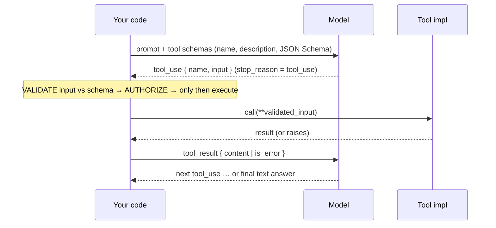
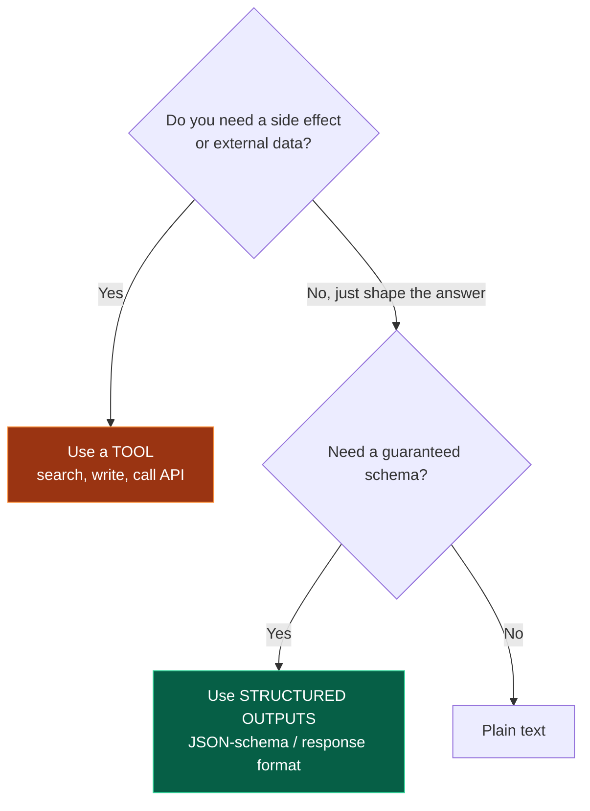
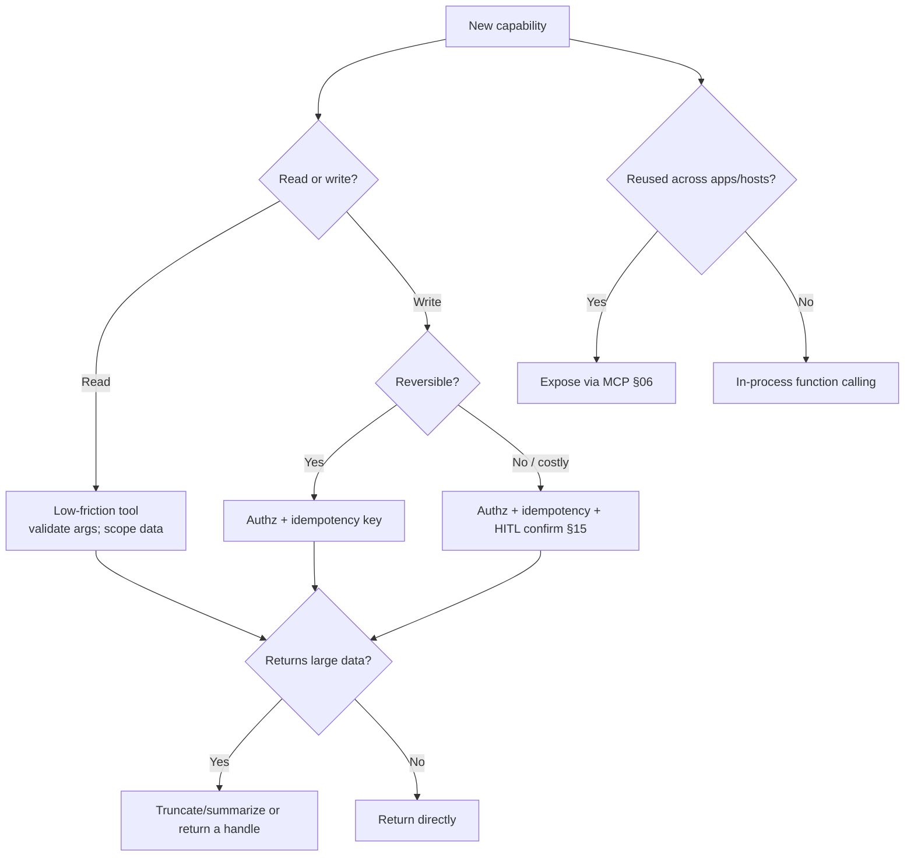

# 05 — Tools & Function Calling

> By the end of this section you can design tool interfaces the model uses correctly and an attacker
> can't abuse, implement a robust calling loop with parallelism and error handling, and choose between
> tools and structured outputs.

**Prerequisites:** [§03 Agent Architecture](../03-Agent-Architecture/), [§04 System Prompts](../04-System-Prompts/).
**You will be able to:**
- Explain the function-calling mechanism end-to-end and design good tool schemas.
- Implement parallel tool execution, error-as-observation, idempotency, and retries.
- Apply the validate-then-authorize boundary that stops injection→tool-abuse.
- Decide tool granularity and when to use structured outputs instead of a tool.

---

## 1. TL;DR

- **Function/tool calling** = you give the model JSON-schema tool definitions; it emits a structured
  *request* (name + args); your code executes it and returns the result; the model reads it and
  continues. **The model never executes anything — it asks.**
- **The tool description and schema ARE prompt engineering.** The model picks and fills tools from those
  strings. Vague descriptions → wrong tool, wrong args.
- **Validate args, then authorize, *before* any side effect.** This is the [§03](../03-Agent-Architecture/)
  control/decision boundary in code, and the difference between a tool and a vulnerability.
- **Tool errors are observations, not exceptions.** Catch them and return them so the model can adapt.
- **Granularity matters:** small, single-purpose, least-privilege tools beat mega-tools; but *too many*
  tools causes selection confusion. Curate.
- **Mutating tools must be idempotent or idempotency-keyed** — the model may retry or duplicate calls.
- **Tools vs. structured outputs:** tools = *do something / get data*; structured outputs = *shape the
  final answer*. Don't use a "tool" for what is really just formatting.

---

## 2. Concepts at three altitudes

### 🟢 Beginner — the mental model

Imagine giving a capable assistant a set of labeled buttons: `search(query)`, `get_weather(city)`,
`send_email(to, body)`. You describe what each button does. The assistant can't press them itself — it
hands you a slip saying "press `get_weather` with city=Paris." You press it, hand back the result, and
it continues. **Function calling is that slip-passing protocol**, formalized as JSON.

### 🟡 Intermediate — the mechanism and the loop



**A good tool definition** (the schema is the contract *and* the documentation the model reads):

```python
from pydantic import BaseModel, Field

class SearchOrdersArgs(BaseModel):
    customer_id: str = Field(description="Internal customer UUID, not email.")
    status: str | None = Field(default=None, description="Filter: open|shipped|delivered|cancelled")
    limit: int = Field(default=20, ge=1, le=100, description="Max rows to return.")

SEARCH_ORDERS_TOOL = {
    "name": "search_orders",
    # Description is model-facing docs: say WHAT it does, WHEN to use it, and constraints.
    "description": ("Search a customer's orders. Use to answer questions about order history or status. "
                    "Read-only. Requires the customer's internal UUID (get it from get_customer first "
                    "if you only have an email)."),
    "input_schema": SearchOrdersArgs.model_json_schema(),
}
```

**Controlling tool use** (`tool_choice`, names vary by vendor): `auto` (model decides), `any`/`required`
(must call some tool), a specific tool (force one), or `none` (text only). Use `required`/specific for
routers and extraction where you *know* a tool must run.

**Parallel tool calls** `[Established]`: modern models can emit *multiple* tool calls in one turn (e.g.,
look up three orders at once). Execute them concurrently and return all results together — a major
latency win when calls are independent.

### 🔴 Expert — the trade-off surface

- **Granularity is a Goldilocks problem.** Too coarse (`do_everything(command)`) → unauthorizable,
  unobservable, dangerous. Too fine / too many → the model struggles to *select* the right tool
  (selection accuracy degrades as the toolset grows). Curate to the smallest set that covers the job;
  group rarely-used tools behind a router or an MCP server discovered on demand ([§06](../06-MCP/)).
- **The schema is a security boundary, not just a hint.** Constrain types, enums, ranges, and formats so
  the *space of expressible calls* excludes dangerous ones. A `limit: int (1..100)` can't become
  `limit: 10_000_000`.
- **Idempotency is non-negotiable for mutations.** The model (or a retry, or a duplicate parallel call)
  may invoke `issue_refund` twice. Use idempotency keys / natural dedupe so a repeat is a no-op
  ([§19](../19-Scalability/)).
- **Errors are part of the interface.** A well-designed error result *teaches* the model how to recover
  ("error: customer_id must be a UUID; you passed an email — call get_customer first"). Cryptic errors
  cause flailing and wasted loop turns.
- **Tool results are untrusted input.** A tool that returns attacker-controlled content (a web page, a
  user-submitted field) is an *indirect injection* vector — the result re-enters the model's context
  ([§14](../14-Agent-Security/)). Treat results as data, sanitize/scope, and guardrail outputs.

---

## 3. Code: a robust tool-calling loop

The skeleton from [§01](../01-Introduction/), hardened: validation, authorization, concurrent execution,
error-as-observation.

```python
import asyncio, json
from pydantic import ValidationError

TOOL_REGISTRY = {        # name → (pydantic args model, impl, requires_authz)
    "search_orders": (SearchOrdersArgs, search_orders_impl, False),
    "issue_refund":  (IssueRefundArgs,  issue_refund_impl,  True),
}

async def execute_tool_call(call, principal) -> dict:
    args_model, impl, needs_authz = TOOL_REGISTRY.get(call.name, (None, None, None))
    if impl is None:
        return _result(call, error="unknown tool")                  # model hallucinated a tool
    try:
        args = args_model.model_validate(call.input)                # 1) VALIDATE (schema + ranges)
    except ValidationError as e:
        return _result(call, error=f"invalid arguments: {e}")       # teach the model to fix it
    if needs_authz and not authorize(principal, call.name, args):   # 2) AUTHORIZE before side effects
        return _result(call, error="permission denied")
    try:
        out = await impl(args)                                       # 3) EXECUTE
        return _result(call, content=out)
    except Exception as e:                                           # 4) ERROR → OBSERVATION (no crash)
        return _result(call, error=f"tool failed: {e}")

async def run_turn(resp, principal) -> list[dict]:
    calls = [b for b in resp.content if b.type == "tool_use"]
    # Independent calls run CONCURRENTLY — latency win.
    return await asyncio.gather(*(execute_tool_call(c, principal) for c in calls))

def _result(call, content=None, error=None) -> dict:
    return {"type": "tool_result", "tool_use_id": call.id,
            "content": json.dumps(content) if error is None else error,
            "is_error": error is not None}
```

> [!IMPORTANT]
> The numbered comments are the whole game: **validate → authorize → execute → error-as-observation.**
> Skipping (1) or (2) is how a prompt-injected "call `issue_refund(amount=999999)`" becomes a real
> refund. The control plane, not the model, decides what actually happens ([§03](../03-Agent-Architecture/), [§14](../14-Agent-Security/)).

---

## 4. Tools vs. structured outputs — don't confuse them



| | **Tool / function call** | **Structured output** |
|---|---|---|
| Purpose | *Act* or *fetch* | *Format the final answer* |
| Side effects | Yes (you execute) | No |
| Loop | Result returns to the model | Terminal |
| Example | `query_db`, `send_email` | Extract `{name, date, amount}` |

> [!TIP]
> A common smell: a "tool" named `format_response` that does nothing but return its own input. That's a
> **structured output**, not a tool — using the tool path adds a needless loop turn and confuses the
> control flow. (Conversely, extraction frameworks sometimes *implement* structured output via a
> single forced tool call — that's fine; it's an implementation detail, not a side-effecting tool.)

---

## 5. Design patterns

| Pattern | What | When |
|---|---|---|
| **Tool registry** | Central map: name → (schema, impl, authz, idempotency) | Always; single source of truth & enforcement |
| **Read/write split** | Read tools low-friction; write tools gated (authz + HITL) | Any agent with side effects |
| **Parameterized, not free-form** | `run_report(report_id, params)` not `run_sql(query)` | Anything touching data stores |
| **Router tool / lazy toolsets** | Expose a small core; load specialized tools on demand (MCP discovery) | Large tool catalogs ([§06](../06-MCP/)) |
| **Idempotency key on mutations** | Caller supplies/derives a key; repeat = no-op | All state-changing tools |
| **Confirmation tool / HITL** | A "propose then confirm" two-step for irreversible acts | Money, comms, deletion ([§15](../15-Guardrails/)) |
| **Result truncation/summarization** | Cap tool-result size fed back to the model | Tools returning large payloads (context budget) |

---

## 6. Anti-patterns ❌ → ✅

| ❌ Anti-pattern | Why it bites | ✅ Instead |
|---|---|---|
| `run_sql(query)` / `exec(code)` / `do_anything(cmd)` | Unauthorizable, injection-amplifying, huge blast radius | Narrow parameterized tools; sandbox if code-exec is truly needed |
| Execute model args without validation | Malformed args crash; injected args do harm | Schema-validate + authorize first |
| Tool error → raise → crash loop | One failure kills the whole task | Return error as a `tool_result` |
| Non-idempotent mutations | Retries/duplicates double-charge, double-send | Idempotency keys / natural dedupe |
| 50 fine-grained tools | Model picks wrong tool; selection accuracy drops | Curate; group/route; lazy-load via MCP |
| Returning a 50KB blob to the model | Context bloat, cost, rot | Truncate/summarize results; return handles/IDs |
| Cryptic error strings | Model flails, burns loop turns | Actionable errors that say how to fix |
| Trusting tool-result content | Indirect injection | Treat results as untrusted data; guardrail outputs ([§14](../14-Agent-Security/)) |

---

## 7. Common failures & troubleshooting

| Symptom | Root cause | Detection | Resolution |
|---|---|---|---|
| Model calls the wrong tool | Vague/overlapping descriptions; too many tools | Tool-selection eval; trace tool picks | Sharpen descriptions; reduce/disambiguate; route |
| Invalid arguments | Loose schema; ambiguous params | Validation-error rate | Tighten schema (enums/ranges/formats); better descriptions |
| Duplicate side effects (double refund) | Non-idempotent mutation + retry/duplicate call | Audit downstream effects | Idempotency keys; dedupe; single-call enforcement |
| Agent stuck retrying a failing tool | Unhelpful error message | Step-budget exhaustion ([§17](../17-Observability/)) | Actionable errors; cap retries; escalate |
| Latency from sequential tool calls | Independent calls run serially | Span timings | Execute independent calls concurrently |
| Did something it shouldn't | Missing authz at the boundary; injected instruction | Tool-call audit log | Enforce authorize() before side effects; least privilege |
| Context blows up after tool calls | Huge tool results fed back | Token-per-turn metric | Truncate/summarize; return references not payloads |

---

## 8. The four implication lenses

- **Performance:** parallelize independent calls; truncate results; the dominant latency cost is *extra
  loop turns* caused by bad tools/errors ([§18](../18-Performance-Optimization/)).
- **Security:** tools *are* the blast radius. Least privilege per tool, validate+authorize at the
  boundary, treat results as untrusted, HITL on irreversible acts ([§14](../14-Agent-Security/), [§15](../15-Guardrails/)).
- **Scalability:** idempotency + statelessness let tool execution scale and tolerate retries
  ([§19](../19-Scalability/)).
- **Cost:** large tool results and failed-retry loops are silent token sinks; cap and observe
  ([§21](../21-Cost-Optimization/)).

---

## 9. Decision framework — designing a tool



---

## 10. Enterprise recommendations

- **A governed tool registry** is platform infrastructure: every tool declares schema, owner,
  authorization policy, idempotency, data classification, and rate/spend limits — enforced centrally
  ([§22](../22-Enterprise-Patterns/)).
- **Mandate validate→authorize at the boundary** in code review; no tool executes unvalidated model args.
- **Default-deny writes:** read tools are easy to add; write/irreversible tools require authz + HITL +
  idempotency review.
- **Treat tool results as untrusted**; standardize sanitization and output guardrails ([§15](../15-Guardrails/)).
- **Observe per-tool** call volume, error rate, latency, and cost; alert on anomalies (a tool suddenly
  called 100× more may signal a loop or abuse).

---

## 11. Interview-level questions

<details>
<summary><b>Q1.</b> A teammate exposes a `run_sql(query: str)` tool "so the agent can answer any data
question." What's your review?</summary>

Reject it. It's a mega-tool with an unbounded action space: the model (or an injected instruction) can
read/modify anything, it's impossible to authorize meaningfully, and tool results may carry injected
content. Replace with **parameterized, least-privilege tools** (`get_customer`, `search_orders(status,
limit)`) backed by reviewed queries with row-level authorization tied to the end user. If genuinely
arbitrary querying is required, sandbox it: read-only replica, query allow-list/validator, hard row/time
limits, and run results through output guardrails — and even then prefer a curated semantic layer.
</details>

<details>
<summary><b>Q2.</b> Why must mutating tools be idempotent, and how do you achieve it?</summary>

Because the system may invoke a mutation more than once — the model can emit duplicate calls, the loop
may retry after a transient error, or parallel calls may overlap. Without idempotency you get
double-charges, double-sends, duplicate tickets. Achieve it with **idempotency keys** (caller derives a
stable key from the operation; the backend dedupes), natural dedupe (unique constraints), or
compare-and-set semantics. This is standard distributed-systems hygiene applied to the agent's
non-deterministic, retry-prone calling pattern ([§19](../19-Scalability/)).
</details>

<details>
<summary><b>Q3.</b> How should tool errors be handled, and why not just raise?</summary>

Return the error **as a tool_result** (with an error flag) so it re-enters the model's context as an
*observation* the model can reason about and recover from — ideally with an actionable message ("pass a
UUID, not an email; call get_customer first"). Raising crashes the loop and wastes the work so far. You
still cap retries and have an explicit fail-stop ([§03](../03-Agent-Architecture/)) so a persistently
failing tool escalates instead of looping forever. Good error design measurably reduces wasted loop turns
and cost.
</details>

<details>
<summary><b>Q4.</b> When do you expose a capability as an MCP server vs. plain function calling?</summary>

Plain function calling when the tool lives in one app and isn't reused — no protocol overhead. **MCP**
([§06](../06-MCP/)) when multiple AI hosts/teams should reuse it, you want runtime discovery, or you want
a consistent approval/observability UX and the ecosystem. Either way the *tool design principles* here
(narrow, validated, authorized, idempotent) apply — MCP changes *delivery/discovery*, not the need for a
safe interface.
</details>

---

### Sources
- Anthropic tool-use docs; OpenAI function-calling / structured-outputs docs (parallel calls,
  tool_choice, strict schemas). Verify current behavior per vendor. `[Established]`
- OWASP *Top 10 for LLM Applications* — LLM07/Excessive Agency; tool-result injection. `[Established]`
- Idempotency & retry patterns: standard distributed-systems practice (e.g., Stripe idempotency keys). `[Established]`

> Next: [§06 — MCP](../06-MCP/) (the protocol that delivers tools at scale), or [§07 — Memory](../07-Memory/).
