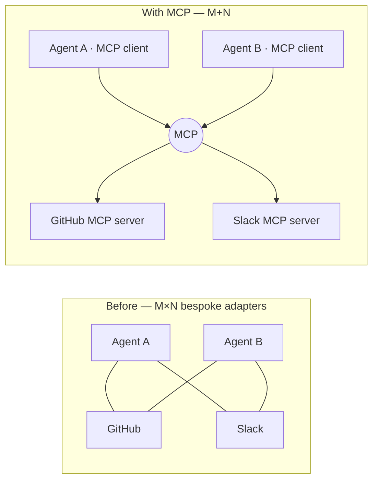
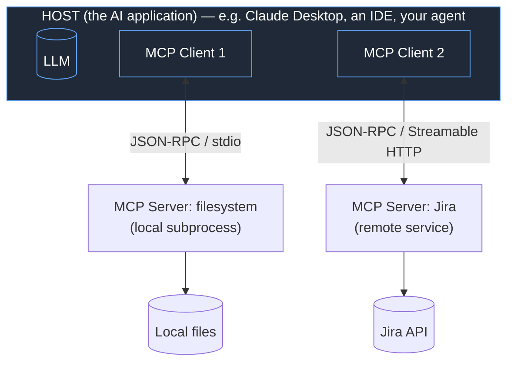
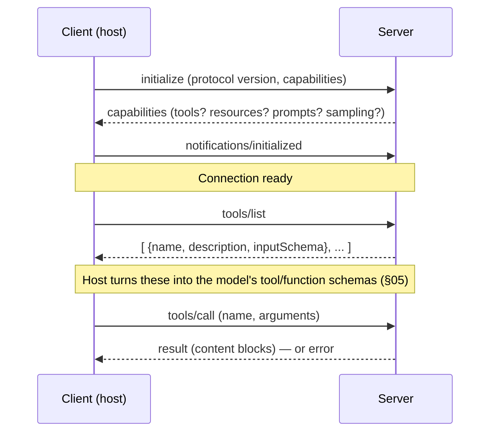
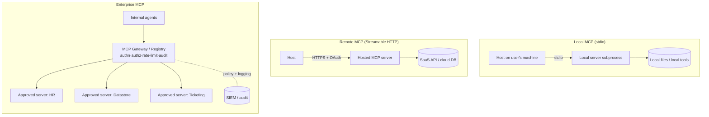
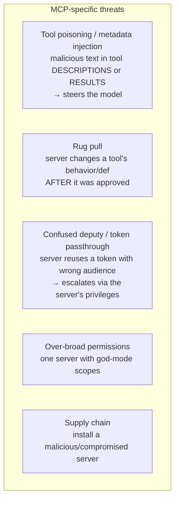
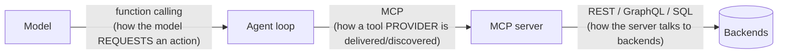
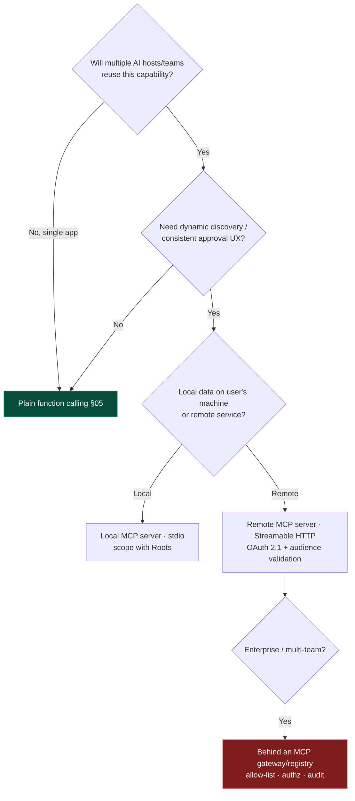

# 06 — MCP (Model Context Protocol)

> By the end of this section you can design, build, secure, and operate MCP servers and clients, and
> decide *when* MCP is the right integration layer vs. plain function calling, REST, or GraphQL.

**Prerequisites:** [§05 — Tools & Function Calling](../05-Tools-and-Function-Calling/) (MCP is a
*protocol* for delivering tools; understand tools first), [§03](../03-Agent-Architecture/).
**You will be able to:**
- Explain MCP's architecture (host/client/server), primitives, and transports precisely.
- Build a production MCP server in Python with auth and the security controls that matter.
- Defend MCP's threat model (tool poisoning, confused deputy, token passthrough, rug pulls).
- Choose MCP vs. function calling vs. REST/GraphQL on principled grounds.

> [!NOTE]
> **Flagship section.** MCP moves fast: this reflects the spec as of **2026-06** (revisions through
> mid-2025, incl. Streamable HTTP transport and the OAuth-based authorization framework). Pin the spec
> revision in your own systems and re-check [modelcontextprotocol.io](https://modelcontextprotocol.io).

---

## 1. TL;DR

- **MCP is an open protocol (Anthropic, late 2024) that standardizes how applications expose tools,
  data, and prompts to LLM apps.** The tagline — *"USB-C for AI"* — is accurate: one connector instead
  of N×M bespoke integrations.
- It is **JSON-RPC 2.0** over one of two standard **transports**: **stdio** (local subprocess) or
  **Streamable HTTP** (remote). The older HTTP+SSE transport is deprecated in favor of Streamable HTTP.
- Three **server primitives**: **Tools** (model-invoked actions), **Resources** (app-attached data),
  **Prompts** (user-invoked templates). Plus **client capabilities**: **Sampling**, **Roots**,
  **Elicitation**.
- **MCP ≠ function calling.** Function calling is *how the model asks to act*; MCP is *how a tool/data
  provider is delivered and discovered*. They compose: an MCP client turns MCP tools into the function
  schemas your model already understands.
- **Security is the hard part, not the wire format.** The headline risks are **prompt injection via
  tool metadata/results ("tool poisoning")**, the **confused-deputy / token-passthrough** anti-pattern,
  **rug-pull** servers, and **over-broad permissions**. Treat every MCP server as untrusted by default.

---

## 2. Concepts at three altitudes

### 🟢 Beginner — the mental model

Before MCP, every AI app integrated every tool by hand: your agent + GitHub, your agent + Slack, your
agent + Postgres — each a custom adapter. With M agents and N tools that's **M×N** integrations.

MCP makes it **M+N**: each tool provider writes **one MCP server**; each AI app has **one MCP client**;
they speak a common protocol. Plug any compliant client into any compliant server.



### 🟡 Intermediate — architecture, primitives, transports

**Three roles** (don't conflate host and client):



- **Host** — the LLM application the user interacts with; manages one or more clients and the model.
- **Client** — lives inside the host; maintains a **1:1 connection** to a server; handles the protocol.
- **Server** — exposes capabilities (tools/resources/prompts) over the protocol; wraps some underlying
  system (files, a SaaS API, a DB).

**The three server primitives** — and *who controls each* (this trichotomy is the heart of MCP design):

| Primitive | Controlled by | Analogy | Example |
|---|---|---|---|
| **Tools** | **Model** (the LLM decides to call) | POST endpoint / function | `create_issue`, `run_query` |
| **Resources** | **Application** (host decides what to attach) | GET / file | A file's contents, a DB schema, a wiki page |
| **Prompts** | **User** (explicitly invoked) | Slash command / template | "/summarize-pr", a guided workflow template |

**Client capabilities** the server can call back into (the protocol is bidirectional):
- **Sampling** — a server asks the *host's* LLM to generate something (so the server needs no API key of
  its own). Host stays in control and can require approval.
- **Roots** — the host tells the server which filesystem/URI boundaries it may operate within.
- **Elicitation** `[added 2025]` — a server requests structured input from the user mid-operation.

**Transports** (how bytes move):

| Transport | Use | How |
|---|---|---|
| **stdio** | Local servers (subprocess on the user's machine) | JSON-RPC over stdin/stdout; the host launches the server process |
| **Streamable HTTP** | Remote/hosted servers | Single HTTP endpoint; client POSTs JSON-RPC; server may stream responses via SSE on the same endpoint |

> [!NOTE]
> Streamable HTTP **replaced** the original "HTTP+SSE" two-endpoint transport (deprecated in the
> 2025-03-26 revision). New remote servers should implement Streamable HTTP. Some hosts also support
> the deprecated transport for back-compat.

**Lifecycle of a connection:**



### 🔴 Expert — what MCP actually buys you, and what it costs

**What it buys:**
- **Decoupling & reuse** — write a tool server once; every MCP-capable host uses it. Ecosystem
  network effects (a growing registry of servers).
- **Dynamic discovery** — clients call `tools/list` at runtime; tools can appear/change without
  redeploying the agent. (Also a *risk* — see rug pulls.)
- **Capability negotiation** — host and server agree on what's supported at `initialize`.
- **Uniform UX for approval & observability** — the host can render every tool call consistently and
  gate it behind one human-in-the-loop UI.

**What it costs / where the sharp edges are:**
- **A new trust boundary.** You're now executing capabilities described by a (possibly third-party)
  server, with descriptions that flow into your model's context. That's an injection surface (§ below).
- **Operational surface** — remote servers need the same SRE rigor as any service (auth, rate limits,
  multi-tenancy, observability) plus AI-specific concerns.
- **Versioning & discovery non-determinism** — runtime-discovered tools mean your agent's capability
  set isn't pinned at deploy time unless you make it so.
- **Latency** — an extra network hop for remote servers; matters in a tight agent loop ([§18](../18-Performance-Optimization/)).

---

## 3. Deployment topologies: local / remote / enterprise



| Topology | Transport | Auth | Key concern |
|---|---|---|---|
| **Local** | stdio | OS process trust | Supply chain (what is this server binary?); filesystem scope (Roots) |
| **Remote** | Streamable HTTP | **OAuth 2.1** (PKCE, resource indicators) | Token audience/scoping; multi-tenant isolation; DoS |
| **Enterprise** | HTTP via **gateway** | OAuth + central policy | Server allow-listing, identity propagation, audit, data residency ([§22](../22-Enterprise-Patterns/)) |

> [!IMPORTANT]
> **Enterprises should not let agents connect to arbitrary MCP servers.** Put a **gateway/registry** in
> front: a curated allow-list of vetted servers, centralized OAuth, per-tool authorization tied to the
> *end-user's* identity, rate/spend limits, and full audit to your SIEM. This is the MCP analog of an
> API gateway and is the single most important enterprise control.

---

## 4. Code: a production-shaped MCP server (Python)

Using the official `mcp` Python SDK (`FastMCP`). This is a real, minimal-but-safe server.

```python
# pip install "mcp[cli]"
from mcp.server.fastmcp import FastMCP
from pydantic import BaseModel, Field

mcp = FastMCP("orders-server")

class RefundResult(BaseModel):
    order_id: str
    refunded: bool
    amount_cents: int = Field(ge=0)

# --- Tools are MODEL-invoked. Keep them narrow, validated, least-privilege. ---
@mcp.tool()
def get_order(order_id: str) -> dict:
    """Look up an order's status and refund eligibility. Read-only."""
    return _oms.fetch(order_id)            # your order-management system

@mcp.tool()
def issue_refund(order_id: str, amount_cents: int) -> RefundResult:
    """Issue a refund. WRITE action — host should gate this behind human approval.

    SECURITY: authorize against the *calling end-user's* identity, not the server's
    own credentials, and enforce business limits (max refund) here in the trusted server.
    """
    _authorize(current_principal(), "refund", order_id)     # control-plane check (§14)
    if amount_cents > _max_refund_for(order_id):
        raise ValueError("amount exceeds policy limit")     # error → model sees it, can't override it
    r = _oms.refund(order_id, amount_cents)
    return RefundResult(order_id=order_id, refunded=True, amount_cents=amount_cents)

# --- Resources are APPLICATION-attached, addressable data (GET-like). ---
@mcp.resource("policy://refunds")
def refund_policy() -> str:
    """The current refund policy text (so answers are grounded in source-of-truth)."""
    return _kb.read("refund_policy.md")

# --- Prompts are USER-invoked templates (slash-command-like). ---
@mcp.prompt()
def triage_order(order_id: str) -> str:
    return f"Investigate order {order_id}: status, refund eligibility, and recommended action."

if __name__ == "__main__":
    mcp.run(transport="stdio")     # local; use streamable-http behind auth for remote
```

> [!CAUTION]
> The two comments doing the heavy lifting — **authorize against the end-user's identity** and
> **enforce limits in the trusted server** — are exactly where real MCP deployments get breached. The
> server is part of your **control plane**; never let the model's request bypass the checks by living
> only in the prompt. See §6.

A minimal **client** wiring an MCP server's tools into an agent loop:

```python
from mcp import ClientSession, StdioServerParameters
from mcp.client.stdio import stdio_client

async def load_mcp_tools():
    params = StdioServerParameters(command="python", args=["orders_server.py"])
    async with stdio_client(params) as (read, write):
        async with ClientSession(read, write) as session:
            await session.initialize()
            tools = await session.list_tools()           # dynamic discovery
            # Convert MCP tool schemas → the model's tool/function schema (§05),
            # then call session.call_tool(name, args) when the model requests it.
            return tools
# In practice, frameworks (LangChain/LangGraph MCP adapters, the Agents SDKs) do this glue for you.
```

---

## 5. Design patterns

| Pattern | What | When |
|---|---|---|
| **Thin server over an existing API** | MCP server wraps a REST/GraphQL backend, exposing a curated, agent-friendly tool subset | You have an API; want agents to use a safe slice of it |
| **Resource for grounding, tool for action** | Read-only facts as *resources*; state changes as *tools* | Keeps GET/POST semantics clean; eases authorization |
| **Sampling-based server** | Server delegates LLM generation back to the host | Server shouldn't hold its own model keys; host keeps control |
| **Gateway/registry** | Central broker for discovery, auth, policy, audit | Any enterprise with >1 team or >1 server ([§22](../22-Enterprise-Patterns/)) |
| **Capability scoping via Roots** | Host constrains filesystem/URI scope | Local servers touching the filesystem |
| **Human-in-the-loop on write tools** | Host requires approval before executing state-changing tools | Irreversible/expensive actions ([§15](../15-Guardrails/)) |

---

## 6. Security — the part that actually matters

MCP's threat model is the agent threat model ([§14](../14-Agent-Security/)) plus protocol-specific
surfaces. Treat **every server and every tool result as untrusted.**



| Threat | Mechanism | Mitigation `[Established]` |
|---|---|---|
| **Tool poisoning / indirect injection** | Attacker text in a tool *description* or *result* becomes instructions to the model | Treat tool I/O as untrusted; don't let descriptions carry privileged instructions; isolate/sanitize results; output guardrails ([§15](../15-Guardrails/)) |
| **Rug pull** | A server changes a tool def after the user approved it | Pin & hash tool definitions; re-prompt on change; vet servers in a registry |
| **Confused deputy / token passthrough** | MCP server forwards an OAuth token with the wrong audience to a downstream API | Server validates token **audience** (RFC 8707 resource indicators); never pass tokens through; mint properly-scoped tokens |
| **Over-broad permissions** | A server granted scopes far beyond its tools' needs | Least privilege per server/tool; scope OAuth tokens narrowly; bind to end-user identity |
| **Supply-chain / malicious server** | Installing an untrusted server (esp. local stdio) | Allow-list via registry; review source; sandbox; signed servers |
| **DoS / cost abuse** | Expensive tools called in a loop | Rate/spend limits at the gateway; budgets in the agent ([§19](../19-Scalability/), [§21](../21-Cost-Optimization/)) |

**Authorization model for remote MCP (OAuth 2.1)** `[Established, 2025 spec]`: the MCP server acts as an
**OAuth Resource Server**; a separate **Authorization Server** issues tokens; clients use **PKCE** and
**resource indicators** so tokens are bound to the intended audience. The two non-negotiables:
1. **The MCP server validates the token's audience** — a token minted for service A must not be accepted
   to act on service B (prevents confused-deputy).
2. **Authorization is tied to the *end user's* identity and scopes**, propagated through, not the
   server's own ambient credentials.

> [!CAUTION]
> The most common real-world MCP mistake: an internal server runs with broad service credentials and
> performs actions on behalf of *whoever asks*, because authz "lives in the prompt." That's a textbook
> confused deputy. **Authorization belongs in the trusted server, keyed to the caller's identity.**

---

## 7. Anti-patterns ❌ → ✅

| ❌ Anti-pattern | Why it bites | ✅ Instead |
|---|---|---|
| Trust tool descriptions/results as benign | Tool poisoning / indirect injection | Treat all server I/O as untrusted; guardrail outputs |
| Server holds god-mode credentials, acts for anyone | Confused deputy; massive blast radius | Per-user identity propagation; least-privilege scopes; audience validation |
| Pass the user's token straight through to downstreams | Token-passthrough escalation | Mint scoped tokens; validate audience (RFC 8707) |
| Let agents connect to any server on the internet | Supply chain + rug pulls | Enterprise registry/gateway allow-list |
| One mega-tool `do_anything(cmd)` | Unauthorizable, unobservable, dangerous | Narrow, single-purpose tools with schemas ([§05](../05-Tools-and-Function-Calling/)) |
| Use MCP for a single in-process function | Protocol overhead with no decoupling benefit | Just use plain function calling ([§05](../05-Tools-and-Function-Calling/)) |
| No human approval on write/irreversible tools | Injected instruction → real-world damage | HITL checkpoint on state-changing tools |

---

## 8. Common failures & troubleshooting

| Symptom | Root cause | Detection | Resolution |
|---|---|---|---|
| Agent suddenly does unintended actions | Indirect injection via a tool result/description | Audit tool I/O; trace which result preceded the action | Sanitize/isolate results; output guardrails; pin tool defs |
| "401/invalid audience" from downstream | Token passthrough / wrong audience | Auth logs | Mint correctly-scoped tokens; implement resource indicators |
| Tools vanish or change between runs | Dynamic discovery + server changed | Diff `tools/list` snapshots | Pin/version tool defs; alert on drift |
| Remote server falls over under load | No rate limiting / single instance | Latency & error-rate metrics | Gateway rate limits; scale + queue ([§19](../19-Scalability/)) |
| High agent latency after adding MCP | Extra network hop per tool call | Span timings ([§17](../17-Observability/)) | Co-locate; cache resources; batch where possible |
| Local server won't start | stdio handshake / version mismatch | Host logs; `initialize` failure | Match protocol versions; check command/args |

---

## 9. MCP vs. function calling vs. REST vs. GraphQL

These operate at **different layers** — the question is rarely "either/or."



| Dimension | **Function calling** | **MCP** | **REST** | **GraphQL** |
|---|---|---|---|---|
| Layer | Model ↔ your code | App ↔ tool provider | Service ↔ service | Service ↔ service |
| Consumer | The LLM | The AI host/client | Any HTTP client | Any GraphQL client |
| Standardized discovery | No (you define schemas) | **Yes** (`tools/list`) | OpenAPI (optional) | Schema/introspection |
| Built for LLM context | Yes (schemas in prompt) | Yes (designed for it) | No | No |
| Dynamic at runtime | Per-request | **Yes** | Static endpoints | Static schema |
| When to choose | In-process tools, one app | Reusable tools across many AI hosts; ecosystem | Classic service APIs | Flexible client-driven queries |

**The relationships, stated plainly:**
- **MCP uses function-calling semantics** under the hood — an MCP client converts discovered tools into
  the model's function/tool schemas. MCP doesn't replace function calling; it *feeds* it.
- **MCP servers usually call REST/GraphQL/SQL** internally. MCP is the *agent-facing* facade; REST/GraphQL
  remain the *service-facing* contracts.
- Use **plain function calling** when tools live in one app and aren't shared. Use **MCP** when you want
  reuse across hosts, dynamic discovery, a consistent approval/observability UX, or the ecosystem.

---

## 10. Decision framework — should I expose this via MCP?



---

## 11. Enterprise recommendations

- **Run an MCP gateway/registry.** Curate an allow-list of vetted servers; no direct agent-to-arbitrary-
  server connections. Centralize OAuth, per-user authorization, rate/spend limits, and audit to SIEM.
- **Identity propagation, not ambient credentials.** Every tool action is authorized against the
  end-user's identity and scopes; validate token audience everywhere (RFC 8707).
- **Pin and review.** Version and hash tool definitions; alert on drift (anti rug-pull). Code-review and
  sandbox third-party/local servers (supply chain).
- **HITL on writes.** Irreversible/expensive tools require human approval by default ([§15](../15-Guardrails/)).
- **Observe MCP like any service** *and* like an AI surface: latency/error SLOs **plus** full tool-I/O
  audit for injection forensics ([§17](../17-Observability/)).
- **Pin the spec revision** your platform supports; treat protocol upgrades as governed changes.

---

## 12. Interview-level questions

<details>
<summary><b>Q1.</b> Explain MCP to a senior engineer in two minutes, and say what it is *not*.</summary>

MCP is an open, JSON-RPC-2.0 protocol that standardizes how AI applications consume external
capabilities — **tools** (model-invoked actions), **resources** (app-attached data), and **prompts**
(user templates) — over **stdio** (local) or **Streamable HTTP** (remote). A *host* runs *clients*, each
with a 1:1 connection to a *server*; clients discover capabilities at runtime and convert tools into the
model's function schemas. It turns M×N bespoke integrations into M+N. It is **not** a replacement for
function calling (it *uses* it), and **not** a replacement for REST/GraphQL (servers call those
internally). It's the agent-facing facade and discovery/transport standard — a layer, not a backend.
</details>

<details>
<summary><b>Q2.</b> What's the "confused deputy" problem in MCP and how do you prevent it?</summary>

An MCP server holds privileges (or receives a token) and acts on behalf of callers without properly
binding the action to the *caller's* identity/scope — so a low-privilege user (or injected instruction)
gets the server to do high-privilege things. The classic instance is **token passthrough**: the server
forwards an OAuth token whose audience was meant for a different service. Prevention: the server is an
OAuth **resource server** that **validates token audience** (RFC 8707 resource indicators), never passes
tokens through, mints narrowly-scoped tokens for downstreams, and authorizes every action against the
propagated **end-user identity**, not its own ambient credentials.
</details>

<details>
<summary><b>Q3.</b> When would you NOT use MCP?</summary>

When tools live inside a single application and aren't reused across hosts — the protocol overhead (a
process/network hop, discovery, auth) buys you nothing over plain in-process function calling
([§05](../05-Tools-and-Function-Calling/)). Also reconsider MCP for ultra-low-latency inner loops where
an extra hop hurts, or where you can't yet meet the security bar (no gateway, no identity propagation) —
in that case fix the security model before exposing servers, don't ship an over-privileged one.
</details>

<details>
<summary><b>Q4.</b> A vendor's public MCP server would save your team weeks. What's your review checklist
before connecting production agents to it?</summary>

(1) **Trust & supply chain:** who runs it, source available, signed, change/rug-pull policy? (2) **Auth:**
OAuth 2.1, PKCE, audience-scoped tokens, end-user identity propagation — or does it use ambient creds?
(3) **Data flow:** what data leaves your boundary, residency/retention terms, PII handling
([§22](../22-Enterprise-Patterns/))? (4) **Blast radius:** what scopes/permissions does it need; can we
least-privilege it? (5) **Injection surface:** are tool descriptions/results sanitized; do we guardrail
outputs? (6) **Ops:** rate limits, SLOs, observability, audit export. Decision: put it **behind our
gateway** with an allow-list and HITL on writes, or don't connect it. Convenience never overrides the
trust boundary.
</details>

<details>
<summary><b>Q5.</b> Tools, resources, and prompts — why does MCP separate them, and who controls each?</summary>

They have different **control semantics and trust levels**. **Tools** are *model-controlled* (the LLM
decides to invoke; highest scrutiny — they cause actions). **Resources** are *application-controlled*
(the host attaches data for grounding; GET-like, no side effects). **Prompts** are *user-controlled*
(explicit templates/slash-commands). Separating them lets the host apply the right policy to each:
human-approval and authorization on tools, access control and freshness on resources, and discoverable
UX on prompts. Collapsing them (e.g., a "tool" that's really data, or a "resource" with side effects)
breaks the authorization model.
</details>

---

### Sources
- **Model Context Protocol** — official spec & docs, [modelcontextprotocol.io](https://modelcontextprotocol.io)
  (architecture, primitives, transports, authorization). Pin the revision. `[Established]`
- MCP spec revisions: 2024-11-05 (initial), 2025-03-26 (Streamable HTTP, auth framework), 2025-06-18
  (auth clarifications, elicitation, structured output). `[Established]`
- Anthropic announcement of MCP (2024). `[Established]`
- OWASP *Agentic AI — Threats & Mitigations*; community write-ups on tool poisoning, rug pulls,
  confused-deputy/token-passthrough. `[Established threat analysis]`
- RFC 8707 (Resource Indicators for OAuth 2.0); OAuth 2.1 draft. `[Established]`

> Next: [§07 — Memory](../07-Memory/) and [§08 — RAG](../08-RAG/) are the capabilities most often
> delivered *through* MCP. Or jump to the flagship [§12 — Multi-Agent Patterns](../12-Multi-Agent-Patterns/).
