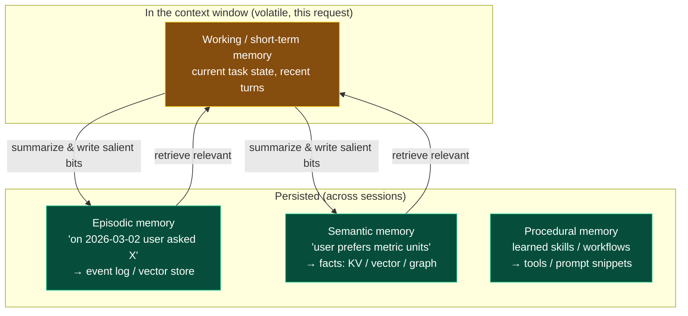
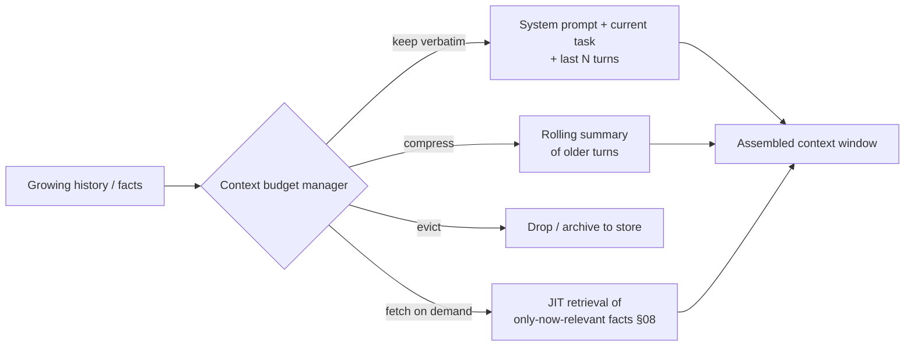
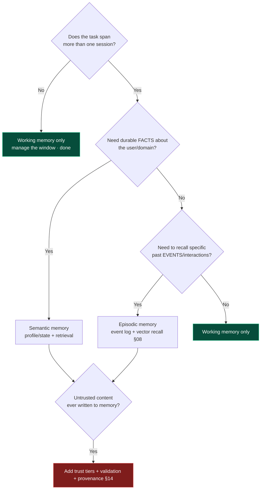

# 07 — Memory Systems

> By the end of this section you can choose the right memory types for an agent, manage the context
> budget so quality doesn't decay, and defend memory against poisoning and staleness.

**Prerequisites:** [§02](../02-LLM-Fundamentals/) (context window, context rot), [§03](../03-Agent-Architecture/).
**You will be able to:**
- Map a requirement to the right memory type(s) — and recognize when you need *less* memory than asked.
- Implement context management (summarization, eviction, JIT retrieval) that fights context rot.
- Set write policies that keep memory bounded, fresh, and trustworthy.
- Treat memory as an attack surface and defend it.

---

## 1. TL;DR

- **Memory ≠ "store everything."** It's *managing what's in the limited context window* plus *what
  persists across turns/sessions*. The scarce resource is the **context budget** ([§02](../02-LLM-Fundamentals/)).
- **Taxonomy:** *working/short-term* (in-context now), *long-term* (persisted), *episodic* (events that
  happened), *semantic* (distilled facts), *procedural* (how-to/skills). Most agents need far less than
  a full cognitive stack — start minimal.
- **Long-term memory is retrieval** ([§08 RAG](../08-RAG/)) over a store, plus a **write policy** for
  what to remember. The hard parts are *what to write*, *when to recall*, and *how to forget*.
- **Context management techniques:** summarization/compaction, eviction/windowing, just-in-time
  retrieval, and structured state. These keep long tasks coherent without overflowing or rotting.
- **Memory's failure modes are nasty:** context explosion, token overflow, **memory poisoning** (false
  data corrupts future behavior), and **stale memory** (acting on outdated facts). Provenance + TTL +
  validation are the defenses.

---

## 2. Concepts at three altitudes

### 🟢 Beginner — the mental model

An LLM has **no memory** of its own — each call starts blank. "Memory" is everything *you* choose to put
back into the prompt: the recent conversation, facts about the user, relevant documents. Think of the
agent as a brilliant colleague with **total amnesia between meetings**: you keep a notebook (storage),
and before each meeting you brief them with the relevant pages (retrieval). Good memory design is good
*briefing* — give them what's relevant, not the whole notebook.

### 🟡 Intermediate — the memory taxonomy and where each lives



| Type | Holds | Typical store | Recall trigger |
|---|---|---|---|
| **Working / short-term** | Current task, recent turns | The context window itself | Always present |
| **Long-term (umbrella)** | Anything across sessions | DB / vector / graph | Retrieval |
| **Episodic** | Specific past events | Event log + vector index | "What happened before?" |
| **Semantic** | Distilled facts/preferences | KV / vector / graph | "What do I know about X?" |
| **Procedural** | How to do tasks / skills | Tools, saved plans | Task type match |

**Storage options and trade-offs:**

| Store | Strength | Weakness | Use for |
|---|---|---|---|
| **In-context** | Zero latency, full fidelity | Tiny, costly, rots | Working memory |
| **Vector DB** | Semantic recall | Fuzzy, no exact joins | Episodic/semantic recall ([§08](../08-RAG/)) |
| **SQL / document** | Exact queries, structured | No semantic search | Profiles, structured facts |
| **KV store** | Fast exact lookup | No search | Per-user settings, flags |
| **Graph DB** | Relationships, multi-hop | Complexity | Entity/relation memory, Graph RAG ([§08](../08-RAG/)) |
| **Hybrid** | Best of each | More moving parts | Most production systems |

### 🔴 Expert — context management is the real discipline

The expert reframing: **memory engineering ≈ context-budget engineering.** Because of context rot
([§02](../02-LLM-Fundamentals/)), the goal is **maximum relevance per token**, not maximum recall.



Core techniques:
- **Summarization / compaction** `[Established]` — replace older turns with a running summary; recover
  detail via retrieval if needed. Watch *summary drift* (errors compound across re-summarization).
- **Eviction / windowing** — keep the last N turns verbatim; archive the rest to a store.
- **Just-in-time (JIT) retrieval** — don't preload everything; fetch the specific fact when the task
  needs it. Keeps the window lean and current.
- **Structured state over prose** — a typed task-state object (current goal, gathered facts, decisions)
  is denser and less rot-prone than a transcript ([§10](../10-Orchestration/)).

**Write-policy design (the under-discussed half):** *what* gets written to long-term memory, *when*, and
with what *provenance*. Writing everything → context explosion and a polluted store; writing nothing →
no learning. Good policy: write **salient, durable** facts (preferences, stable outcomes), tag with
**source + timestamp + confidence**, and dedupe/contradiction-check on write.

> [!IMPORTANT]
> **Default to *less* memory.** Many "we need long-term memory" requirements are solved by good
> retrieval ([§08](../08-RAG/)) + a small profile object. Persistent cross-session memory adds privacy,
> consistency, and poisoning surface — add it deliberately, not by default.

---

## 3. Code: a context-budget-aware memory manager

```python
from pydantic import BaseModel
from datetime import datetime

class MemoryItem(BaseModel):
    content: str
    source: str                 # provenance: who/what asserted this (trust tier)
    created_at: datetime
    confidence: float = 1.0

class ContextManager:
    def __init__(self, store, token_budget: int, keep_last: int = 6):
        self.store, self.budget, self.keep_last = store, token_budget, keep_last

    def assemble(self, system: str, history: list, task: str) -> list:
        recent = history[-self.keep_last:]                      # verbatim recent turns
        older = history[:-self.keep_last]
        parts = [system]
        if older:
            parts.append(self._summarize(older))                # compress, don't drop
        parts.append(self._retrieve_relevant(task))             # JIT recall (§08), filtered by trust+recency
        parts.extend(recent)
        parts.append(task)
        return self._trim_to_budget(parts)                      # hard ceiling — never overflow

    def _retrieve_relevant(self, task: str) -> str:
        hits = self.store.search(task, k=5)
        # Defenses: drop stale + low-trust memories BEFORE they enter context.
        fresh = [h for h in hits if self._is_fresh(h) and h.confidence >= 0.5]
        return "\n".join(f"[fact from {h.source} @ {h.created_at:%Y-%m-%d}] {h.content}" for h in fresh)

    def write(self, item: MemoryItem):
        if self._is_salient(item) and not self.store.contradicts(item):   # write policy + contradiction check
            self.store.upsert(item)                                       # dedupe via upsert
```

> [!TIP]
> Three production-critical bits people skip: **(1)** a hard **token-budget trim** so you never overflow;
> **(2)** filtering recalled memories by **trust + freshness** *before* they enter context (anti-poisoning,
> anti-staleness); **(3)** a **contradiction check on write** so new facts don't silently coexist with
> conflicting old ones.

---

## 4. Real problems & best-in-class solutions (2025+)

| Problem | What happens | Best-in-class mitigation `[Established]` |
|---|---|---|
| **Context explosion** | History/facts grow until cost/latency spike and quality rots | Summarization + eviction + JIT retrieval; cap working set; structured state |
| **Token overflow** | Request exceeds the window → hard error or truncation | Budget manager with hard trim; never assemble blindly |
| **Memory poisoning** `[threat]` | Attacker (or the agent) writes false/malicious "facts" that corrupt future runs | Provenance + trust tiers; validate on write; don't auto-promote tool/user content to durable memory; isolate untrusted sources ([§14](../14-Agent-Security/)) |
| **Stale memory** | Agent acts on outdated facts (old price, closed account) | TTL/expiry; recency weighting; re-verify critical facts via tools at use-time; contradiction detection |
| **Summary drift** | Re-summarizing summaries loses/garbles detail | Summarize from source where possible; keep key facts structured, not prose; periodic refresh from store |
| **Cross-session privacy bleed** | One user's memory surfaces for another (multi-tenant) | Strict tenant/user scoping on every read/write ([§22](../22-Enterprise-Patterns/)) |

---

## 5. Design patterns

| Pattern | What | When |
|---|---|---|
| **Rolling summary + recent verbatim** | Compress old turns, keep last N | Long conversations |
| **Profile/state object** | Small typed struct of durable facts | Per-user/session preferences & task state |
| **Retrieval-as-memory** | Long-term memory = vector store + JIT recall | Large, growing knowledge of past interactions |
| **Reflection-generated memory** | Agent periodically distills experiences into semantic memories | Agents meant to improve over time ([§09](../09-Planning/)) |
| **Trust-tiered memory** | Separate stores/tags for system vs. user vs. tool-derived facts | Anywhere untrusted input can be remembered ([§14](../14-Agent-Security/)) |
| **TTL / freshness policy** | Expire or down-weight by age; re-verify on use | Facts that change (prices, status) |

---

## 6. Anti-patterns ❌ → ✅

| ❌ Anti-pattern | Why it bites | ✅ Instead |
|---|---|---|
| Append everything to the prompt forever | Overflow, cost, context rot | Budget manager: summarize + evict + JIT retrieve |
| Persist all tool/user content as "memory" | Poisoning + pollution + privacy | Write policy: salient + provenance + validation |
| Preload all known facts every turn | Wastes budget, rots quality | JIT retrieval of only-now-relevant facts |
| Summarize summaries indefinitely | Drift, lost detail | Summarize from source; keep key facts structured |
| No freshness handling | Acts on stale data | TTL + recency weighting + re-verify critical facts |
| Shared memory across tenants | Data bleed | Strict per-tenant/user scoping |
| Treat recalled memory as trusted | Poisoning → corrupted behavior | Trust tiers; filter by source/confidence before use |

---

## 7. Common failures & troubleshooting

| Symptom | Root cause | Detection | Resolution |
|---|---|---|---|
| Quality drops as session grows | Context explosion / rot | Token-per-turn + accuracy vs. length | Summarize + evict; JIT retrieval; structured state |
| Request errors at high length | Token overflow | Pre-call token count | Hard budget trim before sending |
| Agent "remembers" something false | Memory poisoning | Provenance audit of recalled facts | Trust-tier filtering; validate writes; purge bad memories |
| Uses outdated info confidently | Stale memory | Compare memory vs. source-of-truth | TTL; re-verify via tool at use-time |
| Details garbled over time | Summary drift | Compare summary to source | Re-summarize from source; structure key facts |
| User A sees user B's data | Tenant scoping bug | Access audit | Enforce scope on every read/write |

---

## 8. The four implication lenses

- **Performance:** every remembered token is processed every turn; lean context = lower TTFT & cost.
  Summaries/retrieval add their own latency — balance ([§18](../18-Performance-Optimization/)).
- **Security:** persistent memory is a **write-able attack surface** — poisoning persists across sessions.
  Provenance, validation, and isolation of untrusted sources are mandatory ([§14](../14-Agent-Security/)).
- **Scalability:** memory stores must scale with users × history; partition by tenant; bound growth with
  eviction/TTL ([§19](../19-Scalability/)).
- **Cost:** uncontrolled memory is a top hidden cost (re-sending bloated context). Budget + caching the
  stable prefix ([§21](../21-Cost-Optimization/)).

---

## 9. Decision framework — what memory do I actually need?



---

## 10. Enterprise recommendations

- **Memory as a governed service:** centralized store with per-tenant isolation, provenance/trust tags,
  TTL policy, and audit — not ad-hoc per-agent stores ([§22](../22-Enterprise-Patterns/)).
- **Default minimal:** require justification for cross-session memory; prefer retrieval + small state
  objects until a clear need emerges.
- **Write governance:** explicit policy for what may be persisted (esp. PII), with validation and
  contradiction checks; never auto-persist raw untrusted input.
- **Freshness SLAs** on facts that change; re-verify critical facts via tools at decision time.
- **Right-to-be-forgotten / retention** built in (deletion, expiry) for compliance.

---

## 11. Interview-level questions

<details>
<summary><b>Q1.</b> A PM asks for "long-term memory so the agent learns about each user." How do you scope it?</summary>

Push for the minimum that delivers value. Often it's a small **semantic profile** (durable preferences,
key facts) plus **retrieval** over past interactions ([§08](../08-RAG/)) — not a full cognitive memory
stack. Define a **write policy** (what's salient enough to persist, with provenance + timestamp),
**freshness** (TTL / re-verify), **isolation** (strict per-user scoping), and **governance** (PII,
deletion). Crucially, persistent memory adds privacy and **poisoning** surface, so it's opt-in by need.
The failure mode of over-memory (rot, cost, stale/false facts) is worse than under-memory.
</details>

<details>
<summary><b>Q2.</b> What is memory poisoning and how do you defend against it?</summary>

An attacker — or the agent ingesting attacker-controlled content — writes false/malicious "facts" into
**long-term** memory that then corrupt future behavior across sessions (more dangerous than a one-shot
injection because it persists). Defenses: **provenance + trust tiers** on every memory; **validate on
write** and run **contradiction checks**; **never auto-promote** raw tool/user content to durable memory;
**filter recalled memories by source/confidence/freshness before** they enter context; isolate untrusted
sources; and support purging bad memories. It's the persistence dimension of the [§14](../14-Agent-Security/)
threat model.
</details>

<details>
<summary><b>Q3.</b> Your agent gets worse the longer a conversation runs. Diagnose.</summary>

Likely **context explosion → context rot**: history grew, key instructions/facts lost salience in the
middle, cost/latency rose. Diagnose via tokens-per-turn and accuracy-vs-length. Fixes: a **context-budget
manager** — keep the last N turns verbatim, **summarize** older turns (from source, to avoid drift),
**evict/archive** the rest, **re-assert** critical constraints late in context, and use **JIT retrieval**
plus a **structured state object** instead of a ballooning transcript ([§02](../02-LLM-Fundamentals/)).
</details>

<details>
<summary><b>Q4.</b> Episodic vs. semantic memory — when does the distinction matter in design?</summary>

Episodic = specific events ("user reported bug #42 on 2026-03-02"); semantic = distilled facts ("user is
on the Enterprise plan"). It matters because they have different *recall triggers, stores, and decay*.
Episodic suits an event log + vector recall for "what happened?" queries and audit; semantic suits a
KV/graph/profile for "what's true about X?" and benefits from de-duplication and contradiction handling.
Many systems also run a **reflection** step that distills episodic events into semantic facts over time
([§09](../09-Planning/)) — which is also exactly where you enforce write policy and provenance.
</details>

---

### Sources
- Anthropic, *effective context engineering* guidance — context as a managed budget, compaction. `[Established]`
- Park et al., *Generative Agents* (2023) — episodic/semantic/reflection memory architecture. `[Established research]`
- *Lost in the Middle* (Liu et al., 2023) — why lean, well-ordered context beats max recall. `[Established]`
- OWASP *Agentic AI Threats* — memory poisoning. `[Established]`

> Next: [§08 — RAG](../08-RAG/) — the retrieval machinery that powers long-term memory and grounding.
