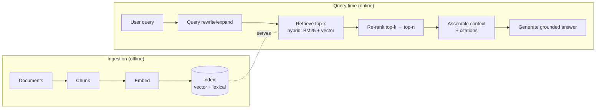
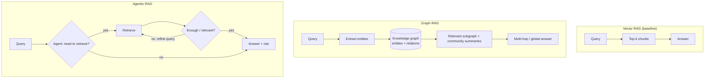
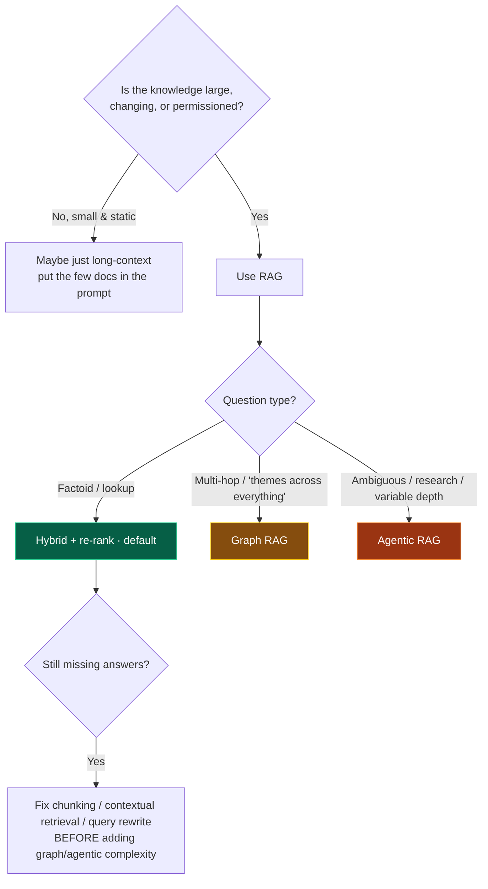

# 08 — RAG Architecture

> By the end of this section you can build a retrieval pipeline that grounds answers reliably, diagnose
> whether a failure is in *retrieval* or *generation*, and choose between vector, hybrid, Graph, and
> Agentic RAG on principled grounds.

**Prerequisites:** [§02](../02-LLM-Fundamentals/) (embeddings, vector search), [§07 Memory](../07-Memory/).
**You will be able to:**
- Implement the full pipeline: chunk → embed → index → retrieve → re-rank → assemble → generate.
- Use hybrid search + re-ranking to fix the most common retrieval failures.
- Decide when Graph RAG or Agentic RAG is worth the complexity.
- Measure retrieval and groundedness separately so you fix the right thing.

---

## 1. TL;DR

- **RAG injects retrieved, source-of-truth context into the prompt at inference time** to ground answers,
  cite sources, respect access control, and stay current — without retraining ([§02 ladder](../02-LLM-Fundamentals/#4-adapting-a-model-to-your-task--the-ladder)).
- **The pipeline:** chunk → embed → index → **retrieve** → **re-rank** → assemble context → generate. Each
  stage is a failure point; most "RAG is bad" complaints are **chunking or retrieval**, not the model.
- **Chunking is the highest-leverage decision.** Bad chunks dilute or split the answer; no re-ranker
  saves them.
- **Hybrid search (lexical BM25 + dense vectors, fused via RRF) + a re-ranker** is the `[Established]`
  strong default — it beats pure vector search on most corpora.
- **Graph RAG** wins on multi-hop and "global" questions; **Agentic RAG** lets the agent decide
  *whether/what/how-many-times* to retrieve. Both add cost/complexity — earn them.
- **Retrieval quality and generation groundedness are different metrics.** Measure both; a confident
  wrong answer with perfect retrieval is a *generation* problem (and vice-versa).

---

## 2. Concepts at three altitudes

### 🟢 Beginner — the mental model

The model only knows its training data (frozen, generic). RAG is **open-book exam**: before answering,
you look up the relevant pages from *your* documents and hand them to the model with the question. The
model then answers *from the provided pages* instead of from fuzzy memory. This is why RAG (a) keeps
answers current, (b) lets the model cite sources, and (c) works on your private data it never trained on.

### 🟡 Intermediate — the pipeline



**Stage by stage:**
- **Chunking** — split docs into retrieval units. Strategies: fixed-size, **recursive** (respect
  paragraph/sentence boundaries), **structure-aware** (headings, tables, code blocks), **semantic**
  (split on topic shifts), **parent/child** (retrieve small, return the parent for context). Tune size +
  overlap to your content.
- **Embedding** — chunk → vector with an embedding model ([§02](../02-LLM-Fundamentals/)). Same model for
  corpus and query; store the model version in index metadata.
- **Indexing** — ANN (HNSW, IVF-PQ) for vectors + an inverted index (BM25) for lexical; attach
  **metadata** (source, ACLs, timestamp) for filtering.
- **Retrieval** — fetch top-k candidates. **Hybrid** (lexical + dense) catches both keyword and semantic
  matches.
- **Re-ranking** — a precise cross-encoder/LLM re-scores the top-k and keeps the best top-n. Trades
  latency for precision.
- **Assembly** — order chunks (best at the edges, [§02 context rot](../02-LLM-Fundamentals/)), add
  citations, dedupe.
- **Generation** — prompt the model to answer **only from context** and cite; verify groundedness.

**Hybrid fusion with Reciprocal Rank Fusion (RRF)** — combine rankings without tuning score scales:

```python
def reciprocal_rank_fusion(rankings: list[list[str]], k: int = 60) -> list[str]:
    """rankings: each is an ordered list of doc_ids from one retriever (e.g., BM25, vector)."""
    scores: dict[str, float] = {}
    for ranking in rankings:
        for rank, doc_id in enumerate(ranking):
            scores[doc_id] = scores.get(doc_id, 0.0) + 1.0 / (k + rank + 1)   # rank-based, scale-free
    return sorted(scores, key=scores.get, reverse=True)
```

### 🔴 Expert — the trade-off surface

- **Chunking dominates.** If the answer is split across chunks or buried with noise, retrieval can't
  recover it and re-ranking can't fix it. Use structure-aware/parent-child chunking; **contextual
  retrieval** `[Established, 2024]` (prepend a short LLM-generated context blurb to each chunk before
  embedding) materially improves recall on ambiguous chunks.
- **Recall vs. precision vs. latency.** Bigger k → higher recall, more noise, higher cost, more rot.
  Re-ranking restores precision but adds a model call. The usual shape: retrieve a **wide** k cheaply,
  **re-rank** to a narrow n. Don't stuff all k into context.
- **Hybrid > pure vector** on most real corpora: dense search misses exact terms (error codes, names,
  SKUs); lexical misses paraphrase. Fuse them.
- **Embedding drift is a migration.** Changing the embedding model invalidates the whole index — you must
  **re-embed the corpus**. Version it.
- **RAG vs. long context** `[Contested→settling]`: "just put all docs in a long context" loses on cost,
  latency, freshness, access control, and context rot. RAG remains the production default for large/
  changing/permissioned corpora; long context complements it for a *few* highly-relevant docs.
- **The hallucination split:** retrieval found the right info but the model still answered wrong/made
  things up = a **generation/grounding** problem (fix with "answer only from context" prompting,
  citation enforcement, and groundedness verification). Retrieval missed = a **retrieval** problem.
  *Measure them separately* or you'll tune the wrong stage.

---

## 3. Advanced patterns: Graph RAG and Agentic RAG



| Pattern | What it adds | Best for | Cost |
|---|---|---|---|
| **Vector RAG** | Semantic top-k | Most factoid/lookup Q&A | Low |
| **Hybrid + re-rank** | Lexical + dense + precision | The strong default | Low–med |
| **Graph RAG** `[Emerging→Established]` | Entity/relation retrieval, **multi-hop**, "global" summary questions ("what are the themes across all docs?") | Connected data, multi-hop reasoning | High (graph build + extraction) |
| **Agentic RAG** `[Emerging]` | Agent decides *whether/what/how often* to retrieve; query refinement; multi-step | Complex/ambiguous queries, research | High (multiple LLM+retrieval turns) |

Other high-value techniques: **query rewriting/expansion** (fix terse/ambiguous queries),
**HyDE** (generate a hypothetical answer, embed *that* to retrieve), **multi-query** (retrieve for
several rephrasings and fuse), and **metadata pre-filtering** (ACLs, recency) *before* vector search.

---

## 4. Code: hybrid retrieval + re-rank, and an agentic RAG loop

```python
# --- Hybrid retrieve → fuse → re-rank (the strong default) ---
def hybrid_retrieve(query: str, k: int = 40, n: int = 6, *, acl) -> list[Chunk]:
    # 1) Pre-filter by metadata (access control + recency) BEFORE search — security & relevance.
    flt = {"acl": acl.visible_scopes(), "archived": False}
    bm25_ids  = lexical_index.search(query, k=k, filter=flt)      # exact terms, codes, names
    vec_ids   = vector_index.search(embed(query), k=k, filter=flt) # semantic / paraphrase
    fused_ids = reciprocal_rank_fusion([bm25_ids, vec_ids])[:k]   # scale-free fusion (RRF above)
    candidates = fetch_chunks(fused_ids)
    # 2) Re-rank the wide candidate set down to a precise few (cross-encoder or LLM).
    scored = reranker.score(query, [c.text for c in candidates])
    return [c for c, _ in sorted(zip(candidates, scored), key=lambda x: x[1], reverse=True)[:n]]

def answer_with_citations(query: str, chunks: list[Chunk], client) -> str:
    context = "\n\n".join(f"[{i}] (source: {c.source}) {c.text}" for i, c in enumerate(chunks))
    system = ("Answer ONLY using the provided context. Cite sources as [i]. "
              "If the context does not contain the answer, say so — do not speculate.")
    return client.generate(system=system, user=f"Context:\n{context}\n\nQuestion: {query}")

# --- Agentic RAG: let the agent decide to retrieve, judge sufficiency, and refine ---
def agentic_rag(query: str, client, max_rounds: int = 3, *, acl) -> str:
    gathered: list[Chunk] = []
    q = query
    for _ in range(max_rounds):                                   # bounded — no infinite retrieval
        gathered += hybrid_retrieve(q, acl=acl)
        verdict = client.judge(query, gathered)                   # {"sufficient": bool, "refined_query": str}
        if verdict["sufficient"]:
            break
        q = verdict["refined_query"]                              # refine and retrieve again
    return answer_with_citations(query, dedupe(gathered), client)
```

> [!TIP]
> Two routinely-missed essentials: **metadata/ACL pre-filtering before vector search** (otherwise a user
> can retrieve documents they shouldn't — a real data-leak vector), and **"answer only from context, say
> 'I don't know' otherwise"** prompting + citation, which is your first defense against confident
> hallucination.

---

## 5. Design patterns

| Pattern | What | When |
|---|---|---|
| **Hybrid + re-rank** | BM25 + vector → RRF → cross-encoder | Default for almost everything |
| **Parent/child chunking** | Embed small chunks, return their parent section | Precise match + enough surrounding context |
| **Contextual retrieval** | Prepend LLM-generated context to each chunk pre-embedding | Ambiguous chunks; recall problems |
| **Metadata pre-filter** | Filter by ACL/recency/type before search | Permissioned or time-sensitive corpora |
| **Query rewriting / HyDE / multi-query** | Improve the query before retrieving | Terse, ambiguous, or vocabulary-mismatched queries |
| **Graph RAG** | Retrieve over entities/relations + community summaries | Multi-hop, "global", connected data |
| **Agentic RAG** | Agent-controlled, multi-step, self-correcting retrieval | Complex research; variable retrieval need |
| **Citation enforcement + groundedness check** | Require + verify sources | Anywhere correctness matters |

---

## 6. Anti-patterns ❌ → ✅

| ❌ Anti-pattern | Why it bites | ✅ Instead |
|---|---|---|
| Fixed-size chunking ignoring structure | Splits answers; mixes topics | Structure-aware / recursive / parent-child |
| Pure vector search | Misses exact terms (codes, names) | Hybrid (BM25 + vector) + RRF |
| Stuff top-50 chunks into context | Noise, cost, context rot | Retrieve wide, **re-rank to a few** |
| No ACL filter before retrieval | Data leakage across permissions | Metadata pre-filter on every query |
| "RAG is broken" → swap the model | Usually retrieval/chunking, not the model | Measure retrieval vs. generation separately |
| Change embedding model, keep old index | Garbage distances | Re-embed corpus; version the model in metadata |
| No "I don't know" license | Confident hallucination on gaps | Answer-only-from-context + citation + groundedness check |
| Graph/Agentic RAG by default | Cost/complexity without need | Start hybrid+rerank; escalate when measured insufficient |

---

## 7. Common failures & troubleshooting

| Symptom | Root cause | Detection | Resolution |
|---|---|---|---|
| Right docs exist but aren't retrieved | Chunking / pure-vector / weak query | Recall@k on a labeled set | Structure-aware chunking; hybrid; query rewrite; contextual retrieval |
| Retrieved docs are right, answer is wrong/made-up | **Generation** grounding failure | Groundedness/faithfulness eval | Answer-only-from-context prompt; citation enforcement; verifier |
| Irrelevant top results | No re-ranking; noisy index | Precision@n; manual spot-check | Add re-ranker; tune k/n; metadata filters |
| Answers cite stale info | Index not refreshed; no recency filter | Freshness audit | Re-index pipeline; recency metadata filter/boost |
| User sees unauthorized content | No ACL pre-filter | Access audit | Metadata/ACL filter before search |
| Latency too high | Large k + re-ranking + multi-round | Stage timings ([§17](../17-Observability/)) | Cascade (cheap wide → rerank narrow); cache; async; cap agentic rounds |
| Quality cratered after a deploy | Embedding-model change without re-embed | Index metadata diff | Re-embed corpus with the new model |

---

## 8. The four implication lenses

- **Performance:** retrieval + re-ranking add latency; use cascades (cheap wide retrieval → precise
  narrow re-rank), caching, and bounded agentic rounds ([§18](../18-Performance-Optimization/)).
- **Security:** RAG is a **data-access path** — enforce ACLs *in retrieval*, and remember retrieved
  content is an **indirect-injection** vector that re-enters the prompt ([§14](../14-Agent-Security/)).
- **Scalability:** index size and query QPS scale with corpus and users; shard, replicate, and pre-filter
  to keep ANN fast ([§19](../19-Scalability/)).
- **Cost:** re-embedding, re-ranking calls, and large contexts cost real money; right-size k/n and cache
  embeddings & frequent queries ([§21](../21-Cost-Optimization/)).

---

## 9. Decision framework



**RAG vs. fine-tuning vs. prompting:** see the [§02 decision matrix](../02-LLM-Fundamentals/#10-decision-framework)
— RAG for *facts*, fine-tuning for *behavior*.

---

## 10. Enterprise recommendations

- **Treat the RAG pipeline as a product:** versioned chunking/embedding config, a re-indexing pipeline,
  and an **eval harness** (recall@k, nDCG for retrieval; faithfulness/groundedness for generation) gating
  changes ([§16](../16-Evaluation/)).
- **ACLs in retrieval, always.** Documents carry access metadata; every query filters by the requesting
  user's scope. RAG must not become a permission-bypass.
- **Hybrid + re-rank as the sanctioned default;** Graph/Agentic RAG as reviewed escalations with measured
  justification.
- **Freshness pipeline:** scheduled/event-driven re-indexing; recency metadata; re-verify volatile facts.
- **Embedding-model governance:** version in index metadata; treat a model change as a corpus migration.
- **Guardrail retrieved content** (indirect-injection defense) and **enforce citations** for auditability
  ([§14](../14-Agent-Security/), [§15](../15-Guardrails/)).

---

## 11. Interview-level questions

<details>
<summary><b>Q1.</b> Your RAG system gives confident but wrong answers. How do you diagnose and fix it?</summary>

First **split the failure**: is retrieval surfacing the right evidence or not? Measure **retrieval**
(recall@k / nDCG on a labeled set) separately from **generation** (groundedness/faithfulness — does the
answer follow from the retrieved context?). If retrieval misses → fix **chunking** (structure-aware,
parent/child, contextual retrieval), go **hybrid + re-rank**, add **query rewriting**. If retrieval is
good but the answer is wrong → it's a **grounding** problem: prompt to *answer only from context and say
"I don't know" otherwise*, enforce **citations**, and add a **groundedness verifier** ([§16](../16-Evaluation/)).
Swapping the LLM is usually the *last* lever, not the first.
</details>

<details>
<summary><b>Q2.</b> When is Graph RAG worth its complexity over hybrid vector RAG?</summary>

When questions are **multi-hop** (require chaining relationships across documents) or **global**
("summarize the main themes across the whole corpus") — things flat top-k retrieval handles poorly
because the answer isn't in any single chunk. Graph RAG builds an entity/relation graph (+ community
summaries) so you can traverse relationships and aggregate. The cost is real: entity/relation extraction,
graph construction and maintenance, and more complex retrieval. So: start with hybrid+rerank, prove it's
insufficient on your multi-hop/global queries, *then* adopt Graph RAG — often as a complement, routing by
query type.
</details>

<details>
<summary><b>Q3.</b> Why hybrid search instead of pure vector search?</summary>

Dense vector search captures **semantic similarity** but misses **exact tokens** — error codes, product
SKUs, proper names, rare terms — where embeddings blur distinctions. Lexical (BM25) nails exact matches
but misses paraphrase and synonyms. Real queries need both, so you run both and **fuse** the rankings
(RRF is scale-free and robust), then re-rank. On most production corpora hybrid+rerank measurably beats
either retriever alone — it's the `[Established]` strong default.
</details>

<details>
<summary><b>Q4.</b> How do you stop RAG from leaking documents a user shouldn't see?</summary>

Enforce access control **in the retrieval layer**, not after generation. Every document/chunk carries
**ACL metadata**; every query is **pre-filtered** by the requesting user's authorized scopes *before*
vector/lexical search runs, so unauthorized chunks never enter the candidate set or the context. Filtering
post-hoc (after the model has seen them) is too late — the content could already influence or leak into the
answer. This ties into treating retrieved content as untrusted and tenant isolation ([§14](../14-Agent-Security/), [§22](../22-Enterprise-Patterns/)).
</details>

---

### Sources
- Lewis et al., *Retrieval-Augmented Generation* (2020) — the foundational pattern. `[Established]`
- Anthropic, *Contextual Retrieval* (2024) — context-prepended chunks for recall. `[Established]`
- Microsoft Research, *GraphRAG* — graph-based retrieval for multi-hop/global questions. `[Emerging→Established]`
- Asai et al., *Self-RAG*; query-rewriting / HyDE literature. `[Emerging]`
- Cormack et al., *Reciprocal Rank Fusion* — scale-free rank fusion. `[Established]`

> Next: [§09 — Planning](../09-Planning/) (incl. Agentic RAG as a planning loop), or [§16 — Evaluation](../16-Evaluation/) (how to measure all of the above).
