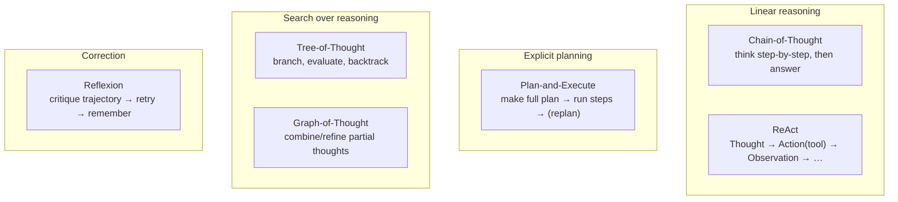
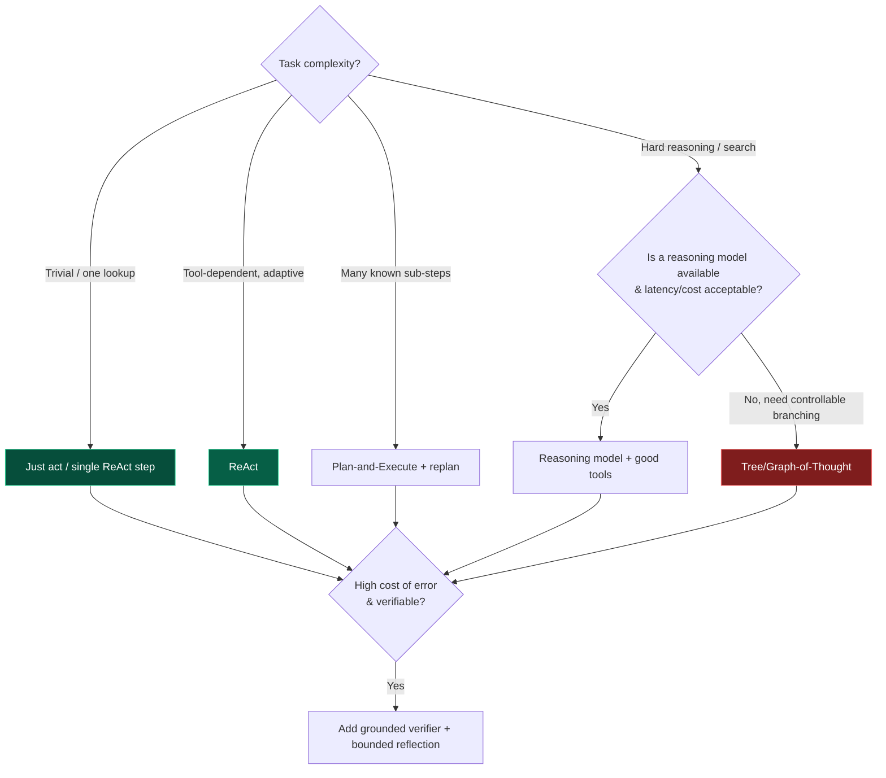

# 09 — Planning, Reasoning & Self-Correction

> By the end of this section you can choose the right reasoning/planning technique for a task, bound
> reflection so it helps instead of looping, and design verifiers that catch errors without "fixing"
> correct work.

**Prerequisites:** [§03](../03-Agent-Architecture/), [§02](../02-LLM-Fundamentals/) (reasoning models).
**You will be able to:**
- Match a task to CoT / ReAct / Plan-and-Execute / Tree-of-Thought instead of cargo-culting one.
- Implement bounded reflection and self-correction with real verifiers.
- Decide between a reasoning model and prompted reasoning on cost/latency grounds.
- Detect and recover from plan failure without thrashing.

---

## 1. TL;DR

- **Planning = deciding the steps; reasoning = the inference that picks each step; self-correction =
  fixing steps from feedback.** They're distinct levers, often combined.
- **Match technique to difficulty.** Simple tasks: just act (or single CoT). Tool-dependent: **ReAct**.
  Many known sub-steps you want to review: **Plan-and-Execute**. Wide search space with verifiable
  partial states: **Tree/Graph-of-Thought**. Most production tasks need *less* structure than the
  literature suggests.
- **Reasoning models vs. prompted reasoning:** a reasoning model ([§02](../02-LLM-Fundamentals/)) often
  beats elaborate prompt scaffolding on hard problems — at higher latency/cost. Don't hand-build ToT if
  a reasoning model + good tools suffices.
- **Reflection only pays when it's *grounded*.** Self-critique against a real signal (tests, a verifier,
  tool output) helps; self-critique against the model's own vibes loops and inflates cost.
- **Bound everything.** Reflection rounds, plan depth, replanning attempts — all need hard caps and an
  escape hatch, or you get reflection loops and runaway cost ([§03](../03-Agent-Architecture/)).

---

## 2. Concepts at three altitudes

### 🟢 Beginner — the mental model

Three skills a capable person uses on a hard task: **plan** (break it into steps), **reason** (think
through each step), and **check their work** (catch and fix mistakes). LLM agents do the same, and the
techniques below are just *structured ways to prompt the model to do them*. The catch: an LLM will
happily "plan" forever or "reflect" itself into changing a right answer to a wrong one — so the
engineering is mostly about **when to do it and when to stop**.

### 🟡 Intermediate — the techniques



| Technique | Idea | Best for | Cost |
|---|---|---|---|
| **Chain-of-Thought (CoT)** | Reason step-by-step before answering | Math/logic in one shot | Low |
| **ReAct** | Interleave reasoning + tool calls | Tool-dependent tasks (the default agent) | Low–med |
| **Plan-and-Execute** | Plan all steps up front, then execute | Many known sub-steps; reviewable plan; fewer LLM calls than ReAct per step | Med |
| **Least-to-most** | Decompose into easy→hard subproblems solved in order | Compositional problems | Med |
| **Tree-of-Thought (ToT)** | Explore multiple reasoning branches, evaluate, backtrack | Search problems with verifiable partial states (puzzles, planning) | High |
| **Graph-of-Thought (GoT)** | Combine/refine partial thoughts as a graph | Complex synthesis | High |
| **Reflexion** | Self-critique a failed attempt, retry, store the lesson | Verifiable tasks that benefit from retries (coding) | Med–high |

**Plan-and-Execute vs. ReAct** — a key practical choice:
- **ReAct** decides the next step *each turn* (flexible, adapts to observations, but an LLM call per step
  and can wander).
- **Plan-and-Execute** commits to a plan first (cheaper per step, reviewable, parallelizable), but a
  stale plan needs **replanning** when reality diverges.

### 🔴 Expert — the trade-off surface

- **Structure has diminishing returns and rising cost.** ToT/GoT can 10× the token cost. Before building
  elaborate search scaffolds, try **a reasoning model** ([§02](../02-LLM-Fundamentals/)) — it often
  internalizes the search, with simpler orchestration. Build ToT only when you need *controllable,
  inspectable* branching (e.g., enforce constraints between branches) or a non-reasoning model is fixed.
- **Reflection's value is conditional on a grounded signal.** `[Established/Contested]` Reflexion shines
  when there's an *external* verifier (unit tests pass/fail, a compiler, a tool result, a checker). Pure
  self-reflection ("are you sure?") yields inconsistent gains and can *degrade* correct answers — the
  model talks itself out of right answers. Rule: **reflect against evidence, not vibes.**
- **Plans are liabilities once reality diverges.** A rigid plan executed past its validity is worse than
  no plan. Design **replanning triggers** (a step failed, an observation contradicts an assumption) and
  cap replanning attempts to avoid thrash.
- **Verifier design is the hard part of self-correction.** A good verifier is *cheaper and more reliable*
  than the generator (tests, schema checks, a tool that confirms a fact, a narrow classifier). If your
  "verifier" is just the same model asked nicely, you've added cost without independence.

> [!IMPORTANT]
> The expert instinct: **reach for the simplest reasoning that passes your eval.** Most production
> agents are well-served by **ReAct + good tools + a grounded verifier on critical steps** + a reasoning
> model for the genuinely hard ones. Tree/Graph-of-Thought are specialist tools, not defaults.

---

## 3. Code: Plan-and-Execute with replanning, and a grounded Reflexion loop

```python
from pydantic import BaseModel

class Plan(BaseModel):
    steps: list[str]

class StepResult(BaseModel):
    step: str
    output: str
    ok: bool

def plan_and_execute(task: str, client, max_replans: int = 2) -> str:
    plan: Plan = client.make_plan(task)                 # decompose up front (reviewable, cacheable)
    results: list[StepResult] = []
    replans = 0
    i = 0
    while i < len(plan.steps):
        r = client.execute_step(plan.steps[i], context=results)
        results.append(r)
        if not r.ok:                                    # reality diverged → REPLAN (bounded)
            if replans >= max_replans:
                return f"FAILED at '{r.step}' after {replans} replans — escalate"
            plan = client.replan(task, done=results)    # adapt remaining steps to what we learned
            replans += 1
            i = 0 if plan.steps and plan.steps[0] not in [x.step for x in results] else i + 1
            continue
        i += 1
    return client.synthesize(task, results)

def reflexion(task: str, client, verify, max_attempts: int = 3) -> str:
    """verify(output) -> (passed: bool, feedback: str). MUST be a GROUNDED signal
    (tests, compiler, tool check) — not the same model's opinion."""
    feedback = ""
    for attempt in range(max_attempts):                 # bounded — no infinite reflection
        output = client.attempt(task, prior_feedback=feedback)
        passed, feedback = verify(output)               # external, independent verifier
        if passed:
            return output
        # store the lesson as episodic memory (§07) so future attempts improve
    return output  # return best effort + flag for human review
```

> [!TIP]
> The single most important line is `verify(...)` being a **grounded, independent** check. Swap it for
> "ask the model if it's happy" and Reflexion becomes an expensive way to make answers *worse*. For
> coding agents the verifier is the test suite; for extraction it's schema + spot rules; for facts it's a
> tool that re-checks the source.

---

## 4. Real examples

- **Coding agent (Reflexion):** generate code → run tests (grounded verifier) → on failure, feed the
  failing output back → retry. The test suite makes reflection reliable. `[Established]`
- **Research agent (Plan-and-Execute + Agentic RAG):** plan sub-questions, retrieve per sub-question
  ([§08](../08-RAG/)), replan if a thread dead-ends, synthesize.
- **Constraint puzzle (ToT):** branch on choices, prune branches that violate constraints, backtrack —
  a case where controllable search beats a single pass.
- **Simple lookup (no planning):** "what's the order status?" — a single ReAct step. Adding a planner
  here is pure overhead.

---

## 5. Design patterns

| Pattern | What | When |
|---|---|---|
| **ReAct + tools** | Interleave thought/action/observation | Default; tool-dependent tasks |
| **Plan-then-execute (+replan)** | Commit to a plan, execute, adapt on divergence | Many sub-steps; want review/parallelism |
| **Grounded reflection** | Critique against tests/verifier, retry, remember | Verifiable tasks with retry value |
| **Verifier/critic separation** | A distinct, cheaper, independent check | High-cost-of-error steps |
| **Reasoning-model offload** | Use a reasoning model instead of hand-built search | Hard reasoning where latency/cost allow |
| **Difficulty router** | Cheap path for easy, heavy reasoning for hard | Mixed workloads ([§02](../02-LLM-Fundamentals/#7-code-production-grade-model-router)) |

---

## 6. Anti-patterns ❌ → ✅

| ❌ Anti-pattern | Why it bites | ✅ Instead |
|---|---|---|
| Planner on every task "to be thorough" | Cost/latency for simple tasks; brittle plans | Plan only when steps are many/unknown; else ReAct |
| Reflection against the model's own opinion | Loops; degrades correct answers | Reflect against a grounded verifier |
| Unbounded reflection/replanning | Runaway cost, no termination | Hard caps + escalation |
| Hand-built ToT before trying a reasoning model | Huge token cost, complex code | Try reasoning model first; ToT only if you need controllable branching |
| Executing a stale plan to the end | Compounds errors | Replanning triggers on divergence |
| "Verifier" = same model, same prompt | No independence; rubber-stamps errors | Independent/cheaper verifier (tests/tool/classifier) |

---

## 7. Common failures & troubleshooting

| Symptom | Root cause | Detection | Resolution |
|---|---|---|---|
| Agent reflects forever / cost spikes | Unbounded or ungrounded reflection | Reflection-round metric | Cap rounds; require grounded signal; escalate |
| Correct answer changed to wrong after "review" | Self-reflection without evidence | A/B with vs. without reflection | Only reflect on verifier failure |
| Plan ignores what was discovered | No replanning | Compare plan vs. observations | Replanning triggers; adaptive plans |
| Over-engineered, slow on easy tasks | Heavy technique mismatched to difficulty | Latency/cost by task class | Difficulty router; simplest technique that passes eval |
| ToT explodes in cost | Branch factor × depth unbounded | Token-per-task | Prune aggressively; bound depth; or use reasoning model |

---

## 8. The four implication lenses

- **Performance:** more reasoning = more tokens/turns = more latency. ToT/GoT and reflection multiply
  calls; reasoning models add "thinking" latency ([§18](../18-Performance-Optimization/)).
- **Security:** a planner that incorporates untrusted content can be steered (plan injection); validate
  inputs and keep the act-boundary in the control plane ([§14](../14-Agent-Security/)).
- **Scalability:** plan steps can sometimes run in parallel; reflection/search are serial and bound
  throughput ([§19](../19-Scalability/)).
- **Cost:** reasoning techniques are the easiest place to 5–10× spend accidentally. Route by difficulty;
  cap rounds; prefer grounded verifiers over many self-critiques ([§21](../21-Cost-Optimization/)).

---

## 9. Decision framework



---

## 10. Enterprise recommendations

- **Standardize "simplest reasoning that passes eval."** Require teams to justify ToT/GoT/heavy reflection
  with eval evidence, not intuition.
- **Mandate bounds:** every reflection/replanning loop ships with hard caps + escalation ([§03](../03-Agent-Architecture/)).
- **Invest in verifiers** as reusable platform components (test runners, schema/groundedness checkers) —
  they're what makes self-correction reliable ([§16](../16-Evaluation/)).
- **Route by difficulty** to control reasoning-model spend ([§21](../21-Cost-Optimization/)).
- **Log reasoning traces** for debugging but treat raw chain-of-thought as sensitive ([§17](../17-Observability/)).

---

## 11. Interview-level questions

<details>
<summary><b>Q1.</b> When does adding reflection help, and when does it hurt?</summary>

It helps when the critique is **grounded in an independent signal** — failing tests, a compiler error, a
tool that re-checks a fact, a schema validator — and the task supports retries (coding, extraction). It
hurts when reflection is the model second-guessing itself without evidence: empirically that loops, wastes
tokens, and can flip *correct* answers to wrong ones. So: reflect on **verifier failure**, bound the
rounds, and store lessons as memory. "Are you sure?" is not a verifier.
</details>

<details>
<summary><b>Q2.</b> A team built Tree-of-Thought for a hard planning task and costs exploded. What's your advice?</summary>

First, check whether a **reasoning model** ([§02](../02-LLM-Fundamentals/)) solves it with simpler
orchestration — it often internalizes the search ToT does manually, at lower complexity. If they still
need ToT (e.g., they must *enforce constraints between branches* or are pinned to a non-reasoning model),
control the blow-up: bound **branch factor × depth**, prune aggressively with a cheap evaluator, and
cache shared prefixes. Most importantly, validate on the eval set that ToT actually beats ReAct + a
reasoning model for *their* task — often the elaborate scaffold isn't worth it.
</details>

<details>
<summary><b>Q3.</b> ReAct vs. Plan-and-Execute — how do you choose?</summary>

**ReAct** decides each step from the latest observation — flexible and adaptive, but an LLM call per step
and prone to wandering; best when the path genuinely depends on what you discover. **Plan-and-Execute**
commits to a plan up front — cheaper per step, reviewable (a human/guardrail can inspect the plan before
execution), and steps may parallelize; best when sub-steps are largely known. Its weakness is staleness,
so pair it with **replanning triggers** and a cap. Many real agents are hybrids: plan coarsely, execute
each step ReAct-style.
</details>

<details>
<summary><b>Q4.</b> What makes a good verifier for self-correction?</summary>

Independence, reliability, and cheapness relative to the generator. The best verifiers are **external and
deterministic** — unit tests, a compiler, a schema validator, a tool that confirms a fact against
source-of-truth, or a narrow trained classifier. They catch errors the generator can't see in itself and
don't share its blind spots. A verifier that is "the same model with the same context asked if it's
happy" lacks independence and tends to rubber-stamp — adding cost without catching errors. Verifier
quality, not generator cleverness, is usually the bottleneck for reliable self-correction.
</details>

---

### Sources
- Wei et al., *Chain-of-Thought* (2022); Yao et al., *ReAct* (2022); Yao et al., *Tree of Thoughts* (2023);
  Besta et al., *Graph of Thoughts* (2023). `[Established]`
- Shinn et al., *Reflexion* (2023) — verbal RL with grounded feedback. `[Established]`
- Huang et al. and others on the **limits of self-correction without external feedback**. `[Contested]`
- Reasoning models / test-time compute: see [§02](../02-LLM-Fundamentals/#5-reasoning-models--test-time-compute-established-evolving). `[Established]`

> Next: [§10 — Orchestration](../10-Orchestration/) — turning these patterns into durable, resumable flows.
