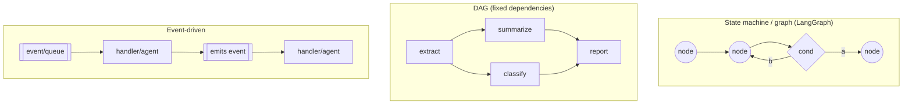
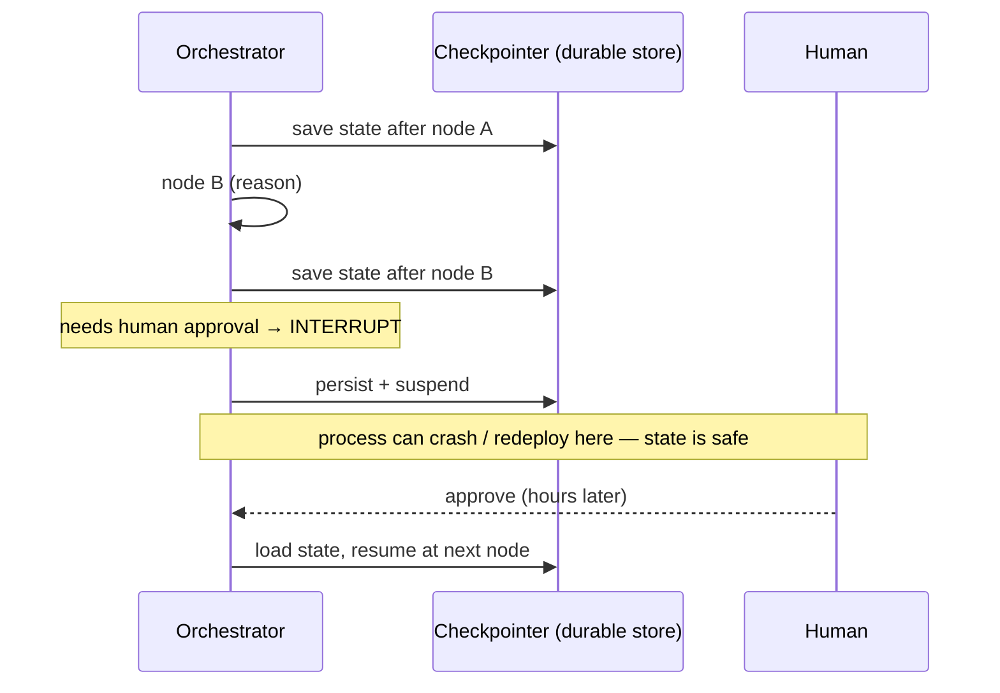
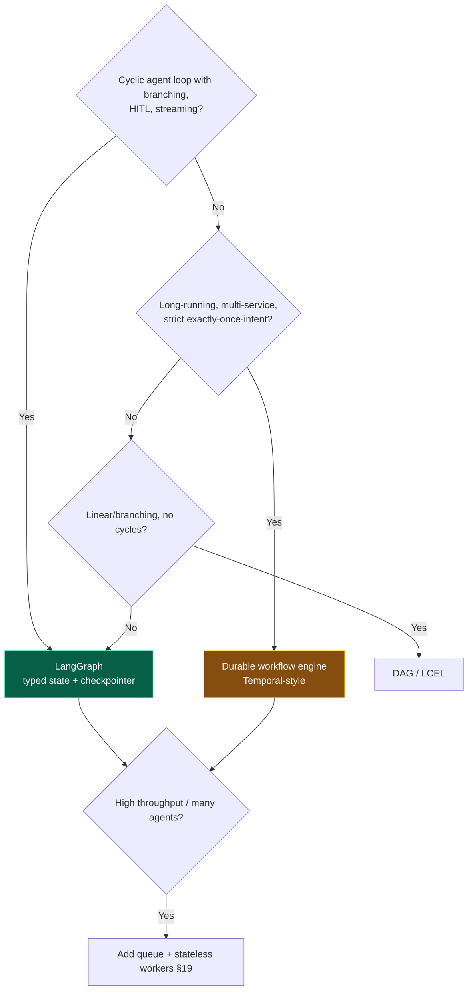

# 10 — Orchestration

> By the end of this section you can choose an orchestration model (graph / DAG / event-driven /
> durable workflow), make long-running agents crash-safe and resumable, and manage agent state without
> races.

**Prerequisites:** [§03 Agent Architecture](../03-Agent-Architecture/) (the loop as a state machine).
**You will be able to:**
- Pick between LangGraph, a durable workflow engine, and rolling your own — with reasons.
- Implement checkpointing, resumption, and human-in-the-loop pause/resume.
- Decide where agent state lives and how to avoid concurrency bugs.
- Map the workflow-vs-agent control decision ([§01](../01-Introduction/)) onto concrete infrastructure.

---

## 1. TL;DR

- **Orchestration is the control plane** that drives the agent loop, manages state, sequences steps, and
  handles failure/resumption. It's where "agent vs. workflow" ([§01](../01-Introduction/)) becomes code.
- **Model the agent as an explicit graph/state machine, not a `while` loop** — for durability,
  observability, testability, and budgets ([§03](../03-Agent-Architecture/)).
- **Durable execution is the production unlock:** checkpoint state at each step so a crash, a deploy, or
  a human-approval pause doesn't lose the trajectory. This is what makes long-running and HITL agents
  real.
- **State must be external and durable** for horizontal scale and resilience; processes are disposable.
- **Framework choice:** **LangGraph** for agent-native graphs with checkpointing; a **durable workflow
  engine** (e.g., Temporal) for long-running, multi-service, exactly-once-intent business processes;
  **roll-your-own** rarely (you'll reinvent checkpointing and resumption badly).
- **Concurrency is back:** shared state across parallel branches/agents needs reducers, single-writer
  discipline, or locks — classic distributed-systems hazards apply ([§13](../13-Agent-Communication/)).

---

## 2. Concepts at three altitudes

### 🟢 Beginner — the mental model

Orchestration is the **conductor**. The LLM, tools, memory, and retrieval are instruments; the
orchestrator decides who plays when, keeps the score (state), handles a musician dropping out (failure),
and can pause and resume the performance. Without it you have a pile of capable parts and no reliable way
to run them in order, recover from errors, or pick up where you left off.

### 🟡 Intermediate — the orchestration models



| Model | Control flow | Best for | Tooling |
|---|---|---|---|
| **State machine / graph** | Nodes + conditional edges (incl. cycles) | **Agents** (loops, branching, HITL) | LangGraph |
| **DAG** | Fixed dependency graph, no cycles | Deterministic multi-step **workflows** | Airflow/Prefect-style, LangChain LCEL |
| **Event-driven / actor** | React to messages/events | Async, decoupled, multi-agent at scale | Queues, actor frameworks ([§13](../13-Agent-Communication/), [§19](../19-Scalability/)) |
| **Durable workflow** | Code that survives crashes; replay-based | Long-running, multi-service, exactly-once-intent | Temporal, durable execution engines |

**Durable execution & checkpointing** — the production essential:



### 🔴 Expert — the trade-off surface

- **"Durable execution" means replay-safe.** Engines like Temporal achieve durability by **replaying**
  the workflow's history to reconstruct state, which requires steps to be **deterministic** and all
  side-effects to go through **activities** (idempotent, retried). LangGraph achieves it by
  **checkpointing** the typed state to a store after each node. Different mechanisms, same goal: survive
  failure without losing or duplicating work. Know which one you're using — they have different rules.
- **Exactly-once is exactly-once *intent*, not magic.** The orchestrator guarantees a step runs to a
  consistent conclusion despite retries; the *side effect* is only safe if the underlying tool is
  **idempotent** ([§05](../05-Tools-and-Function-Calling/)). Orchestration + idempotent tools = effective
  exactly-once.
- **State ownership and reducers.** When parallel branches/agents write the same state, you need a
  **reducer** (how to merge concurrent writes — append, last-write-wins, custom) or a **single-writer**
  rule. Get this wrong and you get lost updates and nondeterministic bugs that only appear under
  concurrency ([§13](../13-Agent-Communication/)).
- **HITL is a first-class control-flow construct,** not an afterthought. Durable interrupts let an agent
  *suspend* awaiting human approval and resume later — essential for irreversible actions ([§15](../15-Guardrails/)).
- **Don't roll your own durability.** Checkpointing, resumption, replay-determinism, and
  interrupt/resume are subtle. Teams that DIY usually ship a fragile `while` loop with state in memory
  and rediscover every distributed-systems lesson the hard way.

> [!IMPORTANT]
> Architectural rule: **stateless workers + durable external state.** The agent process holds nothing
> precious; all task state lives in the checkpointer/DB. This single choice gives you crash recovery,
> horizontal scale, and HITL for free ([§19](../19-Scalability/)).

---

## 3. Code: a durable graph with checkpointing + human-in-the-loop interrupt

```python
from typing import Annotated, Literal
from typing_extensions import TypedDict
from operator import add
from langgraph.graph import StateGraph, START, END
from langgraph.types import interrupt, Command

class State(TypedDict):
    task: str
    messages: Annotated[list, add]          # reducer: concurrent/successive writes APPEND, not clobber
    pending_action: dict | None

def reason(state: State) -> dict:
    decision = call_llm(state["messages"])
    return {"messages": [decision], "pending_action": extract_action(decision)}

def approve_if_irreversible(state: State) -> dict:
    action = state["pending_action"]
    if action and is_irreversible(action):
        # Durable interrupt: persist state and SUSPEND until a human responds.
        # The process can crash/redeploy here; the checkpointer holds the state.
        verdict = interrupt({"approve?": action})       # resumes with the human's input
        if not verdict["approved"]:
            return {"messages": [tool_denied(action)], "pending_action": None}
    return {}

def act(state: State) -> dict:
    return {"messages": [execute(state["pending_action"])], "pending_action": None}

def route(state: State) -> Literal["act", "end"]:
    return "act" if state["pending_action"] else "end"

g = StateGraph(State)
g.add_node("reason", reason); g.add_node("approve", approve_if_irreversible); g.add_node("act", act)
g.add_edge(START, "reason"); g.add_edge("reason", "approve")
g.add_conditional_edges("approve", route, {"act": "act", "end": END})
g.add_edge("act", "reason")                              # loop

# Checkpointer = durability + resumability. Use a persistent backend (Postgres/Redis) in prod.
app = g.compile(checkpointer=postgres_checkpointer)

# Each run is keyed by a thread_id so it can be resumed across processes/time.
config = {"configurable": {"thread_id": "task-4471"}}
app.invoke({"task": "refund order 4471", "messages": []}, config)
# ... later, possibly on a different machine, after human approval:
app.invoke(Command(resume={"approved": True}), config)  # picks up exactly where it suspended
```

> [!TIP]
> The `interrupt(...)` + `thread_id` pattern is the whole reason to use a real orchestrator: the agent
> can **pause for a human and resume hours later on a different machine** without losing state. Try to
> hand-build that on a `while` loop and you'll reinvent a checkpointer — badly.

---

## 4. Framework landscape & comparison

| Need | Use | Why |
|---|---|---|
| Agentic graphs: loops, branching, HITL, streaming, checkpointing | **LangGraph** | Agent-native; typed state + reducers + checkpointers + interrupts |
| Long-running, multi-service business processes, strict exactly-once-intent, retries/timeouts/sagas | **Durable workflow engine** (Temporal, etc.) | Battle-tested durability via replay; great for orchestrating *services* an agent triggers |
| Simple linear/branching LLM chains, no cycles | **LCEL / DAG tools** | Lightweight; deterministic |
| High-throughput async, many agents, decoupling | **Event/queue + workers** | Scales and isolates; pair with the above ([§19](../19-Scalability/)) |
| Bespoke needs the above can't meet | **Custom** (rarely) | Only when you've truly outgrown them — and you'll still need checkpointing |

> [!NOTE]
> These compose: a **durable workflow engine** can orchestrate the long-lived process and call a
> **LangGraph** agent for the reasoning-heavy steps; both sit behind a **queue** for scale. "Which
> framework" is often "which at which layer."

---

## 5. Design patterns

| Pattern | What | When |
|---|---|---|
| **State machine agent** | Typed state + nodes + conditional edges | Default agent structure ([§03](../03-Agent-Architecture/)) |
| **Checkpoint-per-step** | Persist state after each node | Any non-trivial/long task |
| **Durable interrupt (HITL)** | Suspend for approval, resume later | Irreversible/expensive actions |
| **Stateless worker + external state** | Process holds nothing; state in store | Horizontal scale, resilience ([§19](../19-Scalability/)) |
| **Reducer for parallel writes** | Define merge semantics for concurrent updates | Fan-out/parallel branches or agents |
| **Saga / compensation** | Undo steps on later failure | Multi-step side effects that need rollback |
| **Replay/time-travel debugging** | Re-run from a checkpoint | Debugging non-deterministic trajectories ([§17](../17-Observability/)) |

---

## 6. Anti-patterns ❌ → ✅

| ❌ Anti-pattern | Why it bites | ✅ Instead |
|---|---|---|
| `while True` with in-memory state | Crash = lost work; can't scale or resume | State machine + durable checkpointer |
| State in the agent process | No horizontal scale; lost on redeploy | External durable state; stateless workers |
| Roll-your-own durability | Subtle replay/resumption bugs | Use LangGraph/Temporal; don't reinvent |
| Parallel writes, no reducer | Lost updates, nondeterministic bugs | Reducers or single-writer discipline |
| HITL bolted on with polling/sleep | Fragile, wastes resources, loses state | Durable interrupt/resume |
| Non-deterministic steps in a replay engine | Breaks replay determinism | Side effects via idempotent activities/tools |
| One giant orchestration for everything | Unmaintainable; mixed concerns | Compose layers (workflow ↔ agent ↔ queue) |

---

## 7. Common failures & troubleshooting

| Symptom | Root cause | Detection | Resolution |
|---|---|---|---|
| Work lost on crash/deploy | In-memory state, no checkpoint | Incident on restart | Durable checkpointer; resume by thread_id |
| Can't resume after human approval | No durable interrupt | Stuck/abandoned tasks | `interrupt` + persisted state + resume |
| Duplicated side effects on retry | Non-idempotent step + retry/replay | Downstream audit | Idempotency keys; activities ([§05](../05-Tools-and-Function-Calling/)) |
| Nondeterministic bugs under load | Concurrent writes, no reducer | Hard-to-reproduce state corruption | Reducers/locks; single-writer |
| Replay engine errors / drift | Non-determinism in workflow code | Replay test failures | Move nondeterminism into activities |
| Orchestration is a black box | No tracing of node transitions | Can't debug | Trace each node as a span ([§17](../17-Observability/)) |

---

## 8. The four implication lenses

- **Performance:** checkpointing adds write latency per step (usually negligible vs. LLM calls); parallel
  branches cut wall-clock when steps are independent ([§18](../18-Performance-Optimization/)).
- **Security:** the orchestrator enforces the control plane — HITL gates, budgets, and the
  validate→authorize boundary live here ([§14](../14-Agent-Security/), [§15](../15-Guardrails/)).
- **Scalability:** stateless workers + durable state + queues = horizontal scale on a variable workload
  ([§19](../19-Scalability/)).
- **Cost:** durable retries can re-run expensive LLM steps — make steps cacheable/idempotent and cap
  retries ([§21](../21-Cost-Optimization/)).

---

## 9. Decision framework



---

## 10. Enterprise recommendations

- **Standardize on a durable orchestration substrate** (e.g., LangGraph for agents + a workflow engine
  for cross-service processes) with checkpointing, HITL interrupts, budgets, and tracing built in — a
  platform primitive teams inherit ([§22](../22-Enterprise-Patterns/)).
- **Mandate stateless workers + durable external state** so every agent is crash-safe and scalable by
  default.
- **HITL and budgets as orchestration features**, not per-team reinventions.
- **Idempotent side effects** required for any step that can be retried/replayed.
- **Trace node transitions** and support replay for debugging and incident response ([§17](../17-Observability/)).

---

## 11. Interview-level questions

<details>
<summary><b>Q1.</b> What does "durable execution" buy you, and how is it implemented?</summary>

It lets a long-running agent **survive crashes, deploys, and human-approval pauses without losing or
duplicating work** — pick up exactly where it stopped. Two common implementations: **checkpointing**
(persist the typed state after each node, as LangGraph does) and **replay** (reconstruct state by
re-running deterministic workflow history, as Temporal does — requiring side effects to live in
idempotent, retried activities). Both deliver crash-safety and resumability; replay additionally demands
determinism in the workflow body. It's the difference between a demo loop and a production system that
can wait hours for an approval mid-task.
</details>

<details>
<summary><b>Q2.</b> Where should agent state live and why?</summary>

In a **durable external store** (the checkpointer/DB), not the process. This makes workers **stateless**
— any worker can pick up any task, processes are disposable, and a crash/redeploy doesn't lose the
trajectory — which is the foundation for **horizontal scaling**, **resilience**, and **HITL pause/resume**
([§19](../19-Scalability/)). Process-local state ties a task to a machine and loses everything on restart.
The cost is per-step persistence latency, negligible next to LLM calls.
</details>

<details>
<summary><b>Q3.</b> Two parallel branches update the same state field. What can go wrong and how do you handle it?</summary>

Lost updates / nondeterministic corruption — a classic race. In a graph orchestrator you define a
**reducer** for that state key specifying how concurrent writes merge (append, last-write-wins, set-union,
custom merge), or you enforce **single-writer** discipline so only one branch owns the field. Without
explicit merge semantics, concurrent writes clobber each other unpredictably and you get bugs that only
surface under load. This is the same hazard as concurrent writes in any distributed system, surfaced
inside the agent ([§13](../13-Agent-Communication/)).
</details>

<details>
<summary><b>Q4.</b> When would you use a durable workflow engine (Temporal) vs. LangGraph?</summary>

LangGraph for the **agent's reasoning graph** — cyclic loops, conditional branching, streaming, HITL
interrupts, typed state with reducers. A durable workflow engine for **long-running, multi-service
business processes** that need strict exactly-once-intent, sophisticated retries/timeouts, sagas, and
orchestration of many *services* (some non-LLM). They're not mutually exclusive: a Temporal workflow can
own the long-lived process and durability while invoking a LangGraph agent for the LLM-heavy steps — pick
the right tool per layer rather than forcing one to do both.
</details>

---

### Sources
- LangGraph docs — state machines, reducers, checkpointers, `interrupt`/HITL, streaming. `[Established]`
- Temporal / durable-execution docs — replay determinism, activities, exactly-once-intent. `[Established]`
- The agent-vs-workflow framing: [§01](../01-Introduction/); Anthropic *Building Effective Agents*. `[Established]`

> Next: [§11 — Single-Agent Patterns](../11-Single-Agent-Patterns/) — composing all of the above into one agent.
