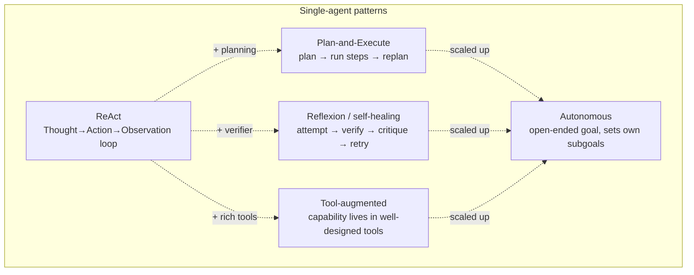
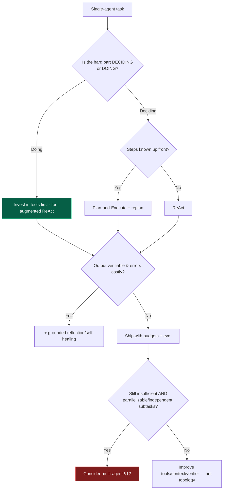

# 11 — Single-Agent Patterns

> By the end of this section you can pick and compose single-agent patterns, make one agent reliable
> enough for production, and know when "better tools" beats "a cleverer pattern" — before reaching for
> multi-agent.

**Prerequisites:** [§03 Agent Architecture](../03-Agent-Architecture/), [§05 Tools](../05-Tools-and-Function-Calling/), [§09 Planning](../09-Planning/).
**You will be able to:**
- Select among ReAct, Plan-and-Execute, Reflexion/self-healing, tool-augmented, and autonomous patterns.
- Compose them into one robust agent with budgets and verifiers.
- Recognize when a single agent is the right answer (it usually is) vs. multi-agent ([§12](../12-Multi-Agent-Patterns/)).

---

## 1. TL;DR

- **A single well-equipped agent is the right default** for the vast majority of tasks. Most reliability
  comes from **good tools + good context + a grounded verifier**, not exotic patterns ([§12](../12-Multi-Agent-Patterns/)).
- **The pattern catalog:** **ReAct** (reason+act loop — the default), **Plan-and-Execute** (plan first),
  **Reflexion / self-healing** (critique+retry on verifier failure), **tool-augmented** (power from
  tools), **autonomous** (open-ended goal pursuit — highest risk).
- These **compose**: a production agent is often ReAct + reflection on critical steps + a planner for
  complex tasks + hard budgets.
- **"Tool-augmented" is the highest-leverage and most underrated pattern.** Upgrading a tool (clearer
  schema, better error, the right capability) often fixes more than any prompt or reasoning trick.
- **Autonomy is a cost, not a goal** ([§01](../01-Introduction/)). The more open-ended the agent, the
  more you must invest in budgets, guardrails, eval, and HITL.

---

## 2. Concepts at three altitudes

### 🟢 Beginner — the mental model

A single agent is one LLM in a loop with tools ([§03](../03-Agent-Architecture/)). The "patterns" are
just *styles of running that loop*: react step-by-step, plan-then-do, or do-then-check-and-redo. You mix
them like a craftsperson mixes techniques — the task decides which you use, and most tasks need the
simple one done well.

### 🟡 Intermediate — the pattern catalog



| Pattern | Loop shape | Best for | Reliability | Cost | Debuggability |
|---|---|---|---|---|---|
| **ReAct** | think→act→observe | Tool-dependent, adaptive tasks (default) | Good with caps | Low–med | Good (clear trajectory) |
| **Plan-and-Execute** | plan→execute→replan | Many known sub-steps; reviewable plan | Good; plan can go stale | Med | Good (inspect plan) |
| **Reflexion / self-healing** | attempt→verify→retry | Verifiable tasks (coding, extraction) | High *with grounded verifier* | Med–high | Med |
| **Tool-augmented** | ReAct over rich tools | Anything where the hard part is *acting* | High | Low | Good |
| **Autonomous** | open-ended goal pursuit | Genuinely open tasks, high value | Lowest; needs heavy guardrails | High | Hard |

(The reasoning mechanics behind these — CoT, ToT, verifier design — are detailed in [§09](../09-Planning/).
This section is about *pattern selection and composition*.)

### 🔴 Expert — the trade-off surface

- **Reliability is mostly tools and context, not pattern.** Before adding planning/reflection/multi-agent,
  ask: *are the tools right, are the errors actionable, is the context clean?* A 95%→99% step-reliability
  jump from a better tool beats any orchestration trick ([§05](../05-Tools-and-Function-Calling/), [§01 compounding error](../01-Introduction/)).
- **Autonomy ↔ control trade is the master dial.** Each pattern up the autonomy ladder buys flexibility
  and pays in predictability, eval difficulty, cost, and attack surface ([§01](../01-Introduction/)).
  "Autonomous agent" is a euphemism for "I've accepted low predictability" — only worth it when the task
  truly demands it and you've funded the safety/eval work.
- **Compose, don't pick dogmatically.** Real agents blend patterns: plan coarsely (Plan-and-Execute),
  execute each step ReAct-style, reflect only on steps a verifier can check, all under hard budgets.
  Dogmatic "we're a ReAct shop" misses easy wins.
- **The "just add an agent loop" trap.** Wrapping a weak single-call solution in a loop doesn't fix
  quality; it amplifies cost and error. Fix the step first, then decide if a loop helps.

> [!IMPORTANT]
> Before escalating to multi-agent ([§12](../12-Multi-Agent-Patterns/)): **have you made a single agent
> genuinely good?** Most teams jump to multi-agent to paper over a single agent with bad tools, dirty
> context, or no verifier — paying 4–15× cost for problems multi-agent doesn't solve.

---

## 3. Code: a composed production single agent

ReAct loop + planner for complex tasks + grounded reflection on verifiable outputs + hard budgets.

```python
from dataclasses import dataclass

@dataclass
class Budgets:
    max_steps: int = 12
    max_reflections: int = 2

def production_agent(task: str, client, tools, verify=None, budgets=Budgets()) -> str:
    # Optionally plan first if the task is complex (else skip — don't over-plan §09).
    plan = client.make_plan(task) if client.is_complex(task) else None
    messages = [{"role": "user", "content": render(task, plan)}]
    reflections = 0

    for step in range(budgets.max_steps):                 # hard step budget (§03)
        resp = client.reason(messages, tools=tools)
        if resp.stop_reason != "tool_use":                # candidate final answer
            if verify and reflections < budgets.max_reflections:
                passed, feedback = verify(resp)           # GROUNDED verifier (§09) — not self-opinion
                if not passed:
                    messages.append(reflect_prompt(feedback))
                    reflections += 1
                    continue                              # self-heal: retry with feedback
            return final_text(resp)
        # tool-augmented: validate→authorize→execute→observe (§05)
        messages += run_tool_calls(resp, principal=current_principal())
    return "ESCALATE: step budget exhausted"              # explicit fail-stop, never silent loop
```

> [!TIP]
> This one function embodies the section: **tool-augmented ReAct** as the backbone, **optional planning**
> (only when complex), **grounded reflection** (only with a real verifier, bounded), and **hard
> budgets + fail-stop**. That's a production single agent — and it handles more real workloads than most
> multi-agent designs.

---

## 4. Real examples

- **Coding agent (tool-augmented ReAct + Reflexion):** tools = read/write files, run tests, search; the
  test suite is the verifier; reflect on test failures. The *tools and the verifier* carry the quality.
- **Support agent (ReAct + HITL):** look up account, propose resolution, gate refunds behind human
  approval ([§15](../15-Guardrails/)).
- **Data-analysis agent (Plan-and-Execute):** plan the analysis steps, execute queries, replan if a
  query reveals the data differs from assumptions.
- **Autonomous research (autonomous + budgets):** open-ended goal, sets sub-goals, retrieves and
  synthesizes — only viable with strict budgets, eval, and (often) HITL on conclusions.

---

## 5. Design patterns (selection cheatsheet)

| If… | Use | Add |
|---|---|---|
| Path depends on runtime observations | **ReAct** | Step budget |
| Steps largely known; want to review/parallelize | **Plan-and-Execute** | Replanning trigger |
| Output is verifiable and errors are costly | **Reflexion/self-healing** | Grounded verifier, bounded rounds |
| The hard part is *doing*, not *deciding* | **Tool-augmented** | Better tool design ([§05](../05-Tools-and-Function-Calling/)) |
| Genuinely open-ended, high value | **Autonomous** | Heavy guardrails, eval, HITL, cost caps |

---

## 6. Anti-patterns ❌ → ✅

| ❌ Anti-pattern | Why it bites | ✅ Instead |
|---|---|---|
| Jump to multi-agent to fix a flaky single agent | Pays 4–15× cost; doesn't fix bad tools/context | Fix tools, context, verifier first ([§12](../12-Multi-Agent-Patterns/)) |
| Loop-wrap a weak single-call solution | Amplifies cost and error | Fix the step quality first |
| "Autonomous" by default | Low predictability, big attack surface | Lowest autonomy that solves it ([§01](../01-Introduction/)) |
| Reflection on every output | Cost; can degrade correct answers | Reflect only on verifier failure, bounded ([§09](../09-Planning/)) |
| Over-planning simple tasks | Latency/cost overhead | Plan only when complex |
| No step budget / fail-stop | Infinite loops, runaway cost | Hard caps + explicit escalation |
| Neglecting tool quality | Most failures originate here | Invest in tool schemas/errors/capabilities |

---

## 7. Common failures & troubleshooting

| Symptom | Root cause | Detection | Resolution |
|---|---|---|---|
| Agent wanders, never finishes | ReAct with no progress; weak tools | Step distribution ([§17](../17-Observability/)) | Better tools/errors; progress checks; budget |
| Plan ignores reality | No replanning | Plan vs. observation diff | Replanning triggers ([§09](../09-Planning/)) |
| Reflection loops / cost spike | Ungrounded/unbounded reflection | Reflection count | Grounded verifier; cap rounds |
| Flaky end-to-end despite good single calls | Compounding error over steps | End-to-end eval ([§16](../16-Evaluation/)) | Reduce steps; verify; better tools |
| Autonomous agent does something unexpected | Insufficient guardrails for the autonomy level | Tool-call audit | Add guardrails/HITL; reduce autonomy ([§14](../14-Agent-Security/), [§15](../15-Guardrails/)) |

---

## 8. The four implication lenses

- **Performance:** step count dominates latency; tool-augmented designs reduce steps; reflection/planning
  add them ([§18](../18-Performance-Optimization/)).
- **Security:** higher autonomy = larger blast radius; tools define it; gate irreversible acts ([§14](../14-Agent-Security/), [§15](../15-Guardrails/)).
- **Scalability:** a single stateless agent scales cleanly on a queue; variable step count ⇒ scale on p95
  ([§19](../19-Scalability/)).
- **Cost:** the cheapest reliable agent is usually a tool-augmented ReAct with tight budgets — far cheaper
  than multi-agent ([§21](../21-Cost-Optimization/)).

---

## 9. Decision framework



---

## 10. Enterprise recommendations

- **Single-agent-first policy:** the sanctioned default; multi-agent requires passing the [§12](../12-Multi-Agent-Patterns/) gate.
- **Invest in shared, well-designed tools** as the highest-leverage reliability lever ([§05](../05-Tools-and-Function-Calling/), [§22](../22-Enterprise-Patterns/)).
- **Budgets + fail-stop + eval mandatory** before any autonomy; HITL for irreversible actions.
- **Reusable verifiers** (test runners, schema/groundedness checks) as platform components ([§16](../16-Evaluation/)).

---

## 11. Interview-level questions

<details>
<summary><b>Q1.</b> A single agent is flaky. The team wants to go multi-agent. What do you check first?</summary>

Whether the single agent is actually *good* yet. Most flakiness traces to **bad tools** (vague schemas,
cryptic errors, missing capabilities), **dirty/overgrown context** ([§07](../07-Memory/)), **no grounded
verifier**, or **too many steps** (compounding error). Fixing those is cheaper and more effective than
multi-agent, which adds 4–15× cost and coordination complexity without addressing any of them
([§12](../12-Multi-Agent-Patterns/)). Multi-agent is justified only when subtasks are genuinely
independent and parallelizable — not as a band-aid for a weak single agent.
</details>

<details>
<summary><b>Q2.</b> Why is "tool-augmented" called the most underrated pattern?</summary>

Because most agent failures are failures of *acting*, not *reasoning*, and the cheapest fix is a better
**tool** — a clearer schema, an actionable error message, the right granularity, or a missing capability.
Improving one tool can lift a step from 90% to 99% reliable, which compounds dramatically across a
trajectory ([§01](../01-Introduction/)). It's underrated because it's unglamorous: teams reach for new
prompts, reasoning tricks, or multi-agent before auditing whether the agent's *hands* are good. Audit the
tools first.
</details>

<details>
<summary><b>Q3.</b> When is an "autonomous" agent appropriate, and what must accompany it?</summary>

When the task is genuinely open-ended (unknown steps, variable depth) and high-value enough to justify low
predictability — e.g., autonomous research or investigation. It must come with **hard budgets**
(steps/tokens/time/\$ + fail-stop), **guardrails** and **HITL** on irreversible/high-impact actions,
**least-privilege tools**, strong **observability** (you can't debug what you can't trace), and a real
**eval** harness. Autonomy without these isn't "advanced," it's unbounded risk. The autonomy level should
be the minimum that solves the problem ([§01](../01-Introduction/)).
</details>

---

### Sources
- Yao et al., *ReAct*; Shinn et al., *Reflexion*; Wang et al. and others on Plan-and-Execute / autonomous
  agents. `[Established]` (mechanics detailed in [§09](../09-Planning/))
- Anthropic, *Building Effective Agents* — simplicity-first, tools as leverage. `[Established]`

> Next: [§12 — Multi-Agent Patterns](../12-Multi-Agent-Patterns/) (and its "when NOT to"), or [§13 — Agent Communication](../13-Agent-Communication/).
