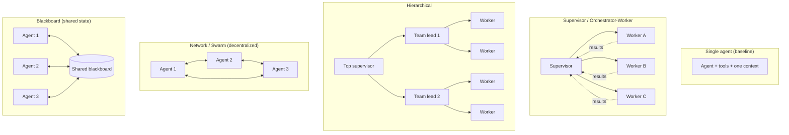
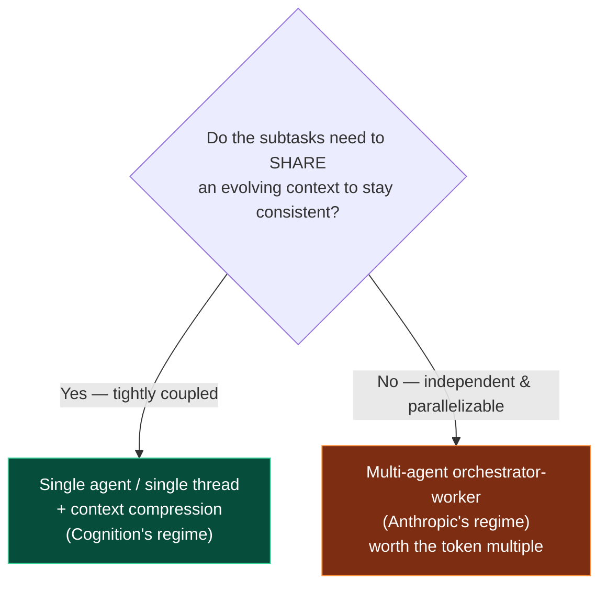
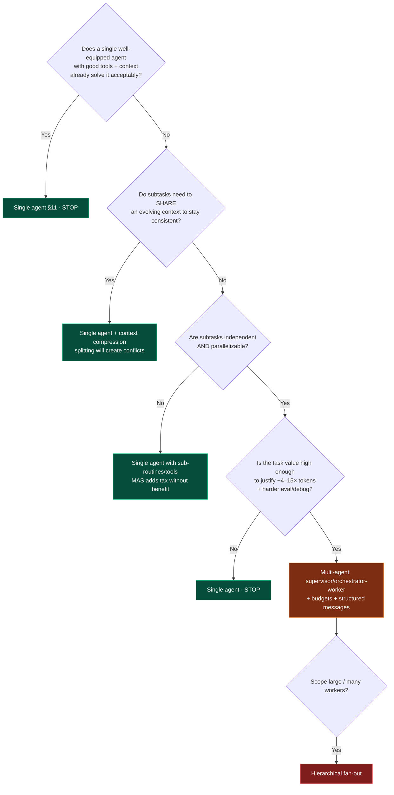

# 12 — Multi-Agent Patterns

> By the end of this section you can choose, design, and implement the right multi-agent topology —
> **and** make the harder, more valuable call: when *not* to build one at all.

**Prerequisites:** [§03](../03-Agent-Architecture/), [§11 — Single-Agent Patterns](../11-Single-Agent-Patterns/),
[§10 — Orchestration](../10-Orchestration/).
**You will be able to:**
- Name and diagram the canonical multi-agent topologies and the forces that select each.
- Quantify the costs (token multiplication, coordination tax, eval difficulty) honestly.
- Apply a rigorous "do I need multi-agent?" gate before committing.
- Implement a supervisor/worker system with bounded coordination in LangGraph.

> [!NOTE]
> **Flagship section.** Multi-agent is the most over-applied pattern in the field. This section is
> deliberately skeptical: the default answer is *"one well-equipped agent,"* and you must earn the
> jump. The "when NOT to" material (§3, §10) is the most important part — read it even if you skip the rest.

---

## 1. TL;DR

- A **multi-agent system (MAS)** = several agents, each with its **own context window, prompt, and
  tools**, coordinating to complete a task. The defining benefit is **separate contexts** (specialization
  + parallelism), not "more brains."
- **Default to a single agent.** MAS multiplies token cost (often **~4–15×** a single agent), adds a
  **coordination tax**, and makes evaluation/debugging much harder. Earn it; don't reach for it.
- **`[Contested]`** — serious practitioners disagree. One camp ("don't build multi-agent") argues
  coordination/context-sharing fragility usually outweighs benefits; another ships production MAS for
  **breadth-first, parallelizable** work. Both are right *for different workloads*. §3 reconciles them.
- **MAS earns its keep when:** the task **parallelizes** into independent subtasks, each needs a
  **distinct context/specialization**, the work **exceeds one context window**, or you need **fault/role
  isolation**. If none hold, it's overhead.
- **Topologies:** supervisor (orchestrator-worker) is the workhorse; hierarchical scales it; network and
  swarm trade control for flexibility; blackboard centralizes shared state. Pick by **who decides** and
  **how they communicate**.

---

## 2. Concepts at three altitudes

### 🟢 Beginner — the mental model

A single agent is one smart generalist working a task end-to-end in one notebook (context). A
multi-agent system is a **team**: a manager who breaks the work into pieces and specialists who each
work their piece in *their own* notebook, then report back. The team can move faster on parallel work
and each specialist can go deep — but now you pay for **meetings** (coordination), people can
**misunderstand each other** (communication errors), and it's harder to know **who did what** when
something goes wrong (debugging). Most "team" problems are actually "one good generalist" problems.

### 🟡 Intermediate — the canonical topologies

The two questions that classify every MAS: **who decides what happens next?** and **how do agents
communicate?**



| Topology | Who decides | Communication | Best for | Main risk |
|---|---|---|---|---|
| **Supervisor / Orchestrator-Worker** | Central supervisor | Star (via supervisor) | Most MAS; parallel subtasks with a coordinator | Supervisor becomes bottleneck / single point of failure |
| **Hierarchical** | Nested supervisors | Tree | Large scope; many workers; org-like decomposition | Latency depth; error propagation across layers |
| **Planner–Executor** | Planner makes plan; executors run steps | Plan → steps | Decomposable tasks where a plan is reviewable | Brittle plans; replanning cost ([§09](../09-Planning/)) |
| **Manager–Worker** | Manager assigns & integrates | Star + integration step | Map-reduce-style work (research, fan-out/fan-in) | Token multiplication; integration quality |
| **Network** | Any agent routes to any | Mesh (any-to-any) | Fluid, hard-to-pre-structure collaboration | Loops, deadlocks, emergent cost ([§13](../13-Agent-Communication/)) |
| **Swarm (handoff)** | Whichever agent holds control | Explicit handoffs | Routing among specialists (e.g., triage→billing→tech) | Lost context across handoffs; ping-pong |
| **Blackboard** | Agents react to shared state | Shared store (pub/sub) | Opportunistic problem-solving; many partial contributors | Consistency, race conditions, write contention |

### 🔴 Expert — the real economics and failure surface

**Why MAS is expensive (the honest accounting):**
- **Token multiplication.** Each agent re-establishes its own context (system prompt, tools, relevant
  history). A supervisor + N workers makes *many* LLM calls; published systems report **~4× (chat→single
  agent) and ~15× (single→multi-agent)** token usage for hard research tasks. That's the price of
  parallel breadth — only worth it when the task value is high. `[Established, Anthropic]`
- **Coordination tax.** Routing, hand-offs, result integration, and conflict resolution are *extra* LLM
  work that produces no direct user value.
- **Compounding + propagating error.** A worker's mistake can poison the supervisor's synthesis;
  reliability math from [§01](../01-Introduction/) applies *across* agents, not just steps.
- **Eval & debugging difficulty.** You now evaluate *trajectories across multiple agents* and a
  *coordination protocol*; non-determinism multiplies ([§16](../16-Evaluation/), [§17](../17-Observability/)).
- **New failure modes:** deadlocks, infinite hand-off loops, race conditions on shared state — covered
  in [§13](../13-Agent-Communication/).

**Where the cost is justified `[Established]`:** read-heavy, **parallelizable** work where subtasks are
**independent** and each benefits from a **fresh, focused context** — e.g., "research these 12 vendors
in parallel," "review this large diff across 6 dimensions simultaneously." The parallelism both speeds
wall-clock *and* sidesteps the single-context limits ([§02 context rot](../02-LLM-Fundamentals/)).

**Where it backfires `[Established]`:** tightly-coupled tasks needing **shared, evolving context**
(e.g., writing one coherent document, a stateful transaction). Splitting context across agents that
can't see each other's reasoning produces inconsistency that costs more to reconcile than it saved.
This is the core of the "don't build multi-agent" argument (§3).

---

## 3. The central debate — and how to reconcile it `[Contested]`

Two influential, *opposing* positions from production teams:

| Position | Argument | Strongest where |
|---|---|---|
| **"Don't build multi-agents (yet)."** (Cognition / Devin) | Agents that don't share full context make conflicting decisions; coordination is fragile; prefer a **single thread** with aggressive **context compression**, and only parallelize work that's genuinely read-only/independent. | Coding & tasks needing **one coherent, evolving context**; long-running stateful work. |
| **"Multi-agent works for the right shape."** (Anthropic research system) | An **orchestrator-worker** MAS beats single-agent on **breadth-first, parallelizable** research, accepting ~15× tokens because the task value is high and subtasks are independent. | **Parallel, independent** subtasks; breadth-first search; exceeds one context. |

**The reconciliation (this is the expert takeaway):** they're not actually contradicting — they're
describing **different workloads**. The decisive variable is **context coupling**:



> [!IMPORTANT]
> **Decision rule:** *Split into multiple agents only when subtasks are independent enough that they
> don't need to see each other's intermediate reasoning.* If they do, the coordination cost of keeping
> them consistent exceeds the benefit — use one agent with good context management. "Coherent output
> from one evolving context" ⇒ single. "Parallel breadth over independent slices" ⇒ multi.

---

## 4. Real examples

- **Deep research assistant** (orchestrator-worker): a lead agent decomposes a question into independent
  sub-questions, spawns a worker per sub-question (each with its own context + web tools), then
  synthesizes. Parallel, independent → MAS wins. `[Established pattern]`
- **Customer support (swarm/handoff):** a triage agent routes to billing / technical / account
  specialists via explicit handoffs, passing a structured summary. Specialization → swarm fits; watch
  context loss across handoffs.
- **Large code review** (supervisor fan-out): one agent per review dimension (security, performance,
  correctness, style) over the same diff, results merged. Independent dimensions → parallel fan-out.
- **Coding a feature** (single agent, *not* MAS): one coherent, evolving codebase context — splitting it
  across agents produces incompatible edits. This is the canonical "don't multi-agent" case.

---

## 5. Code: a bounded supervisor/worker system (LangGraph)

A supervisor that routes to specialized workers, with the **bounds that keep MAS from melting down**:
a hand-off cap, per-agent budgets, and structured (not free-form) inter-agent messages.

```python
from typing import Annotated, Literal
from typing_extensions import TypedDict
from operator import add
from pydantic import BaseModel
from langgraph.graph import StateGraph, START, END

class Handoff(BaseModel):                 # structured inter-agent message (not free text)
    to: Literal["research", "math", "finish"]
    instruction: str

class MASState(TypedDict):
    task: str
    messages: Annotated[list, add]
    handoffs: int                          # ← coordination budget
    max_handoffs: int
    result: str | None

def supervisor(state: MASState) -> dict:
    if state["handoffs"] >= state["max_handoffs"]:
        return {"messages": [{"role": "system", "content": "handoff budget exhausted"}],
                "result": "ESCALATE: coordination budget exceeded"}     # ← anti-infinite-loop
    decision: Handoff = route_with_llm(state)        # supervisor LLM emits a structured Handoff
    return {"messages": [decision.model_dump()], "handoffs": state["handoffs"] + 1}

def research_worker(state: MASState) -> dict:
    # Own context, own tools, own (small) step budget — isolation is the point.
    return {"messages": [run_worker("research", state, step_budget=6)]}

def math_worker(state: MASState) -> dict:
    return {"messages": [run_worker("math", state, step_budget=6)]}

def route(state: MASState) -> Literal["research", "math", "finish"]:
    if state.get("result"):                          # budget exhausted → exit
        return "finish"
    return last_handoff(state["messages"]).to

g = StateGraph(MASState)
for name, fn in [("supervisor", supervisor), ("research", research_worker), ("math", math_worker)]:
    g.add_node(name, fn)
g.add_node("finish", lambda s: {"result": synthesize(s["messages"])})
g.add_edge(START, "supervisor")
g.add_conditional_edges("supervisor", route,
                        {"research": "research", "math": "math", "finish": "finish"})
g.add_edge("research", "supervisor")     # workers report back to supervisor (star topology)
g.add_edge("math", "supervisor")
g.add_edge("finish", END)
mas = g.compile(checkpointer=my_checkpointer)
```

> [!TIP]
> Three things make this production-safe and are routinely omitted: **(1)** a **handoff/coordination
> budget** (prevents infinite supervisor↔worker ping-pong), **(2)** **structured messages** between
> agents (a Pydantic `Handoff`, not free text — free text invites drift and injection), and **(3)**
> **per-worker step budgets** so one worker can't burn the whole task. Parallel fan-out (workers running
> concurrently) is a config change on top of this when subtasks are independent.

---

## 6. Communication patterns (preview of [§13](../13-Agent-Communication/))

| Mechanism | How agents share | Pros | Cons |
|---|---|---|---|
| **Direct message / handoff** | Structured payload passed between agents | Simple, explicit | Context loss; ping-pong loops |
| **Shared state / blackboard** | Read/write a common store | Decoupled, opportunistic | Race conditions, consistency |
| **Message queue / event bus** | Async pub/sub | Scalable, resilient, decoupled | Eventual consistency; harder to reason about |
| **Supervisor-mediated** | All through a coordinator | Centralized control & audit | Bottleneck / SPOF |

Coordination hazards (deadlocks, infinite loops, race conditions) and their fixes (budgets, timeouts,
idempotency, termination protocols) are detailed in [§13](../13-Agent-Communication/).

---

## 7. Anti-patterns ❌ → ✅

| ❌ Anti-pattern | Why it bites | ✅ Instead |
|---|---|---|
| "Multi-agent" because it sounds advanced | Pays ~4–15× tokens + coordination tax for no benefit | Single agent with good tools/context until proven insufficient |
| Splitting tightly-coupled work across agents | Inconsistent decisions; expensive reconciliation | One agent + context compression ([§02](../02-LLM-Fundamentals/), [§07](../07-Memory/)) |
| Free-text inter-agent chatter | Drift, ambiguity, injection surface, token bloat | Structured messages (typed schemas) |
| No coordination budget | Infinite supervisor↔worker loops; runaway cost | Hard handoff cap + per-agent step/token budgets |
| One agent role per micro-task ("agent sprawl") | Combinatorial coordination; impossible to eval | Fewer, broader agents; merge roles that share context |
| Supervisor with no failure handling | One worker error poisons the whole synthesis | Validate worker outputs; isolate failures; partial-result handling |
| Evaluating only the final answer | Can't localize which agent/coordination step failed | Trajectory + per-agent eval ([§16](../16-Evaluation/)) |

---

## 8. Common failures & troubleshooting

| Symptom | Root cause | Detection | Resolution |
|---|---|---|---|
| Cost 10×+ expectations | Token multiplication across agents | Per-agent token attribution ([§17](../17-Observability/)) | Fewer agents; cheaper workers; cache shared prefix; reconsider if MAS is needed |
| Agents loop / never finish | No termination protocol; handoff ping-pong | Handoff-count distribution | Coordination budget; progress check; supervisor authority to finish |
| Inconsistent / contradictory output | Tightly-coupled work split across contexts | Diff worker outputs for conflicts | Collapse to single agent; or add a reconciliation/synthesis step with full context |
| One bad worker tanks the result | Error propagation through supervisor | Per-agent success metrics | Validate/verify worker outputs before synthesis; redundancy on critical subtasks |
| Lost context after a handoff | Handoff payload too thin | Compare pre/post-handoff state | Richer structured handoff summary; pass relevant context explicitly |
| Deadlock (agents waiting on each other) | Circular dependency in coordination | Stalled traces; timeouts firing | Timeouts; break cycles; supervisor-mediated topology ([§13](../13-Agent-Communication/)) |

---

## 9. The four implication lenses

- **Performance:** MAS can *reduce wall-clock* via parallelism on independent subtasks, but each agent
  adds round-trips. Net win only when parallelism dominates coordination overhead ([§18](../18-Performance-Optimization/)).
- **Security:** more agents and inter-agent messages = larger attack surface; injected content can
  propagate agent→agent. Authorize each agent independently (least privilege); treat inter-agent
  messages as untrusted ([§14](../14-Agent-Security/)).
- **Scalability:** workers are natural units to distribute across a queue/cluster; the supervisor can be
  a bottleneck — make it stateless over external state and consider hierarchical fan-out ([§19](../19-Scalability/)).
- **Cost:** the dominant lens. Model cost ≈ Σ over all agents of their loop cost. Budget per agent *and*
  per task; route workers to cheap tiers; cache the shared prompt prefix ([§21](../21-Cost-Optimization/)).

---

## 10. Decision framework — "do I need multi-agent?" (the gate)

Answer honestly; **default is single agent.**



**Topology selection once you've earned MAS:** start with **supervisor/orchestrator-worker** (simplest
control, easiest to audit). Go **hierarchical** only when one supervisor can't manage the worker count.
Use **swarm/handoff** for specialist routing. Use **blackboard** for opportunistic, many-contributor
problems. Avoid free **network** topologies unless you truly need any-to-any — they're the hardest to
keep bounded ([§13](../13-Agent-Communication/)).

---

## 11. Enterprise recommendations

- **Make single-agent the default and MAS an exception** that passes the §10 gate in design review.
  Require the team to name the *independent, parallelizable* subtasks before approving.
- **Standardize coordination primitives** on your platform: structured message schemas, mandatory
  coordination budgets, per-agent identity & least-privilege tools, and trajectory-level tracing
  ([§22](../22-Enterprise-Patterns/)).
- **Prefer supervisor/orchestrator-worker** as the sanctioned topology — it's auditable and bounded.
  Treat free networks/swarms as advanced, reviewed exceptions.
- **Budget at two levels** (per-agent and per-task) and attribute cost per agent for FinOps
  ([§21](../21-Cost-Optimization/)).
- **Evaluate the system, not just agents:** trajectory eval across the coordination protocol, plus
  per-agent component evals ([§16](../16-Evaluation/)).

---

## 12. Interview-level questions

<details>
<summary><b>Q1.</b> When is multi-agent the right architecture, and when is it a mistake?</summary>

Right when subtasks are **independent and parallelizable**, each benefits from its **own focused
context/specialization**, and the work **exceeds a single context window** — classic breadth-first
research or multi-dimensional review. The task value must justify the **~4–15× token cost** and harder
eval/debug. A mistake when work is **tightly coupled** and needs a shared, evolving context (e.g.,
writing one coherent artifact, a stateful transaction): splitting it produces conflicting decisions that
cost more to reconcile than the parallelism saved. The decisive question is **context coupling** — if
agents need to see each other's reasoning to stay consistent, use one agent.
</details>

<details>
<summary><b>Q2.</b> Two respected teams say opposite things — "don't build multi-agents" vs. "we built a
great one." Who's right?</summary>

Both, for **different workloads**. Cognition's "don't" targets tasks needing one coherent evolving
context (coding), where context-splitting causes conflicting actions and coordination is fragile; their
fix is single-thread + context compression. Anthropic's research system targets **parallel, independent**
subtasks (breadth-first research), where an orchestrator-worker MAS wins despite ~15× tokens. The
reconciliation is the **context-coupling rule**: coupled → single agent; independent & parallelizable →
multi-agent. The disagreement is about defaults and workloads, not a contradiction in principles.
</details>

<details>
<summary><b>Q3.</b> Your MAS occasionally runs forever and costs spike. Diagnose and fix.</summary>

Likely **handoff ping-pong** / no termination protocol and **token multiplication**. Diagnose with
per-agent trajectory traces and handoff-count distributions ([§17](../17-Observability/)). Fixes: a hard
**coordination budget** (max handoffs) with an explicit escalation/finish state; give the supervisor
clear authority and criteria to terminate; **structured** (typed) inter-agent messages to prevent drift;
**per-worker step/token budgets**; and route workers to cheaper model tiers with a cached shared prefix.
If contradictions also appear, the deeper fix may be that the task was tightly coupled and shouldn't be
multi-agent at all.
</details>

<details>
<summary><b>Q4.</b> Compare supervisor, hierarchical, swarm, and blackboard topologies.</summary>

**Supervisor/orchestrator-worker:** central coordinator routes to workers (star); simplest to control
and audit; supervisor is a bottleneck/SPOF. **Hierarchical:** supervisors of supervisors (tree); scales
to many workers; adds latency depth and cross-layer error propagation. **Swarm (handoff):** control
passes between specialist agents explicitly; great for routing (triage→specialist); risks context loss
and ping-pong. **Blackboard:** agents read/write shared state and act opportunistically; flexible for
many partial contributors; risks race conditions and consistency problems. Default to supervisor; escalate
to hierarchical for scale; use swarm for specialist routing; reserve blackboard/network for genuinely
opportunistic or any-to-any needs.
</details>

<details>
<summary><b>Q5.</b> Why are inter-agent messages a security concern, and how do you handle it?</summary>

Because content produced by one agent (possibly influenced by injected/retrieved data) becomes *input*
to another — indirect prompt injection can **propagate across agents**, and a free-text channel is an
easy vector. Handle it by treating every inter-agent message as **untrusted** (the same control/decision
boundary from [§03](../03-Agent-Architecture/)), using **structured schemas** rather than free text,
**authorizing each agent independently** with least-privilege tools, and applying output guardrails
([§15](../15-Guardrails/)) on messages that will trigger actions. Per-agent identity and audit make
propagation traceable ([§14](../14-Agent-Security/)).
</details>

---

### Sources
- Anthropic, *How we built our multi-agent research system* — orchestrator-worker, the ~15× token figure,
  when parallel breadth wins. `[Established]`
- Cognition, *Don't Build Multi-Agents* — the single-thread + context-compression argument. `[Contested/opposing]`
- LangGraph multi-agent docs — supervisor, hierarchical, network topologies & handoffs. `[Established]`
- OpenAI Agents SDK / "Swarm" — handoff-based routing pattern. `[Established]`
- Blackboard architecture: classic AI literature (Hearsay-II) — the original shared-state pattern.

> Next: [§13 — Agent Communication](../13-Agent-Communication/) details the coordination mechanisms and
> their failure modes (deadlocks, loops, races).
