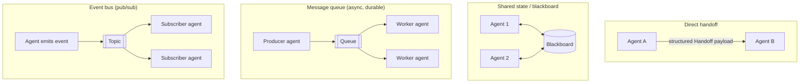
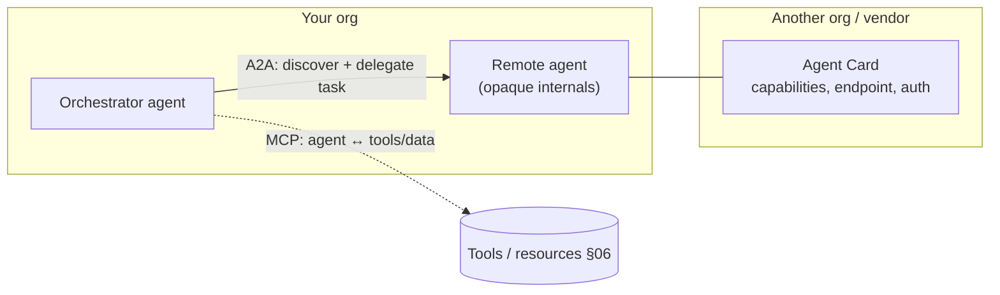
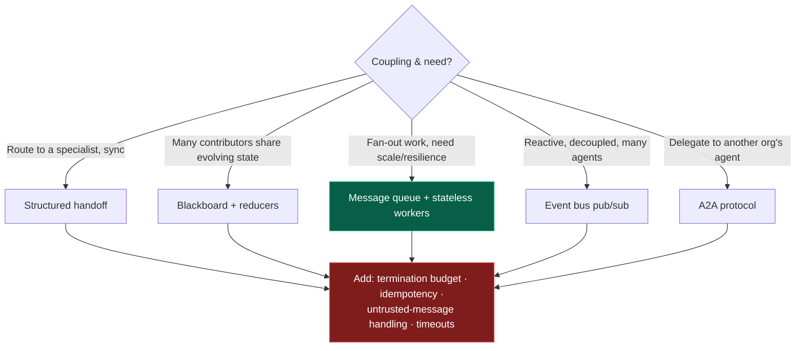

# 13 — Agent Communication

> By the end of this section you can choose how agents talk (shared state, queues, events, direct
> handoffs), use A2A for cross-org interop, and prevent the coordination hazards — deadlocks, infinite
> loops, races — that sink multi-agent systems.

**Prerequisites:** [§12 Multi-Agent](../12-Multi-Agent-Patterns/), [§10 Orchestration](../10-Orchestration/).
**You will be able to:**
- Pick the right communication mechanism for a coordination problem.
- Explain A2A, how it relates to MCP, and when cross-org agent interop matters.
- Apply distributed-systems discipline (idempotency, timeouts, backpressure) to agents.
- Design termination protocols that stop loops and deadlocks.

---

## 1. TL;DR

- **Agent communication is distributed systems with non-deterministic, verbose, expensive nodes.** Your
  existing instincts (idempotency, backpressure, ordering, timeouts) apply — plus new failure modes from
  the LLMs themselves.
- **Mechanisms:** direct **handoffs** (structured payload), **shared state / blackboard**, **message
  queues** (async, durable), **event buses** (pub/sub). Choose by coupling, scale, and durability needs.
- **Use structured messages, never free-text chatter.** Free text drifts, bloats tokens, and is an
  injection channel. A typed schema is the contract.
- **A2A (Agent-to-Agent)** is the emerging protocol for agents to **discover and delegate to one
  another across vendors/orgs**; it **complements MCP** (A2A = agent↔agent; MCP = agent↔tools/context).
- **The dangerous failures are coordination failures:** **deadlocks**, **infinite/ping-pong loops**,
  **race conditions**, and **injection propagation** (one agent's poisoned output steers another). All
  preventable with budgets, timeouts, single-writer/reducers, and untrusted-message handling.

---

## 2. Concepts at three altitudes

### 🟢 Beginner — the mental model

When you have more than one agent, they need to **talk** and **share work**. Like a team, they can talk
directly ("here, you handle billing"), post to a shared whiteboard everyone reads, or drop tasks in a
queue others pick up. Each style has trade-offs in speed, reliability, and how easily things go wrong
(two people editing the whiteboard at once; two people each waiting for the other to go first). The
engineering is making sure the conversation **ends**, stays **consistent**, and can't be **hijacked**.

### 🟡 Intermediate — the mechanisms



| Mechanism | Sync? | Durable? | Coupling | Best for | Main hazard |
|---|---|---|---|---|---|
| **Direct handoff** | Sync | No (unless persisted) | Tight | Routing to a specialist ([§12 swarm](../12-Multi-Agent-Patterns/)) | Context loss; ping-pong loops |
| **Shared state / blackboard** | Either | Via store | Medium | Opportunistic, many contributors | Race conditions, consistency |
| **Message queue** | Async | Yes | Loose | Fan-out work, resilience, scale | Eventual consistency; ordering |
| **Event bus (pub/sub)** | Async | Yes | Loosest | Reactive, decoupled, many agents | Hard to trace; event storms |

**Coordination protocols** (how a conversation is structured): request/reply, publish/subscribe,
**contract-net** (announce task → bids → award), auctions, supervisor-mediated ([§12](../12-Multi-Agent-Patterns/)).

### 🔴 Expert — the trade-off surface

- **It's distributed systems — bring the discipline.** Idempotent message handling (an agent may receive
  a message twice), **backpressure** (a fast producer + slow LLM consumers = unbounded queue growth and
  cost), **ordering** (do messages need to be ordered? usually you want them not to), and **timeouts**
  (an agent waiting on another must time out). Skipping these is why naive multi-agent systems wedge.
- **Termination is a protocol, not a hope.** Multi-agent conversations don't naturally end. You need a
  **coordination budget** (max messages/handoffs), explicit **done** criteria a coordinator enforces, and
  **deadlock detection** (cycles in the wait-for graph) or simply timeouts that break cycles ([§12](../12-Multi-Agent-Patterns/)).
- **Structured > free text, always.** Inter-agent messages should be **typed payloads** (schemas), not
  prose. Free text drifts (the "telephone game"), wastes tokens, and is a prime **injection-propagation**
  channel — a poisoned tool result in agent A becomes an instruction to agent B. Treat every inbound
  message as **untrusted** ([§14](../14-Agent-Security/)).
- **Shared state needs merge semantics.** Concurrent writers ⇒ reducers or single-writer ([§10](../10-Orchestration/)).
  Blackboards are flexible but make consistency *your* problem.

---

## 3. A2A and the agent-interop landscape `[Emerging]`

As agents proliferate across teams and vendors, they need a standard way to **find and delegate to each
other** — the agent-level analog of what MCP did for tools.



**A2A (Agent-to-Agent)** `[Emerging, 2025]` — originated at Google, now under open governance:
- **Agent Cards** — JSON metadata advertising an agent's capabilities, endpoint, and auth, enabling
  **discovery**.
- **Tasks** with a lifecycle (submitted → working → input-required → completed/failed), supporting
  **long-running** and async work with streaming updates.
- **Opaque agents** — you delegate to a remote agent without needing its internals/tools, preserving IP
  and security boundaries.
- Built on familiar web standards (HTTP, JSON-RPC, SSE) so it slots into existing infra.

| | **MCP** ([§06](../06-MCP/)) | **A2A** |
|---|---|---|
| Connects | Agent ↔ tools / data / context | Agent ↔ agent |
| Other party | A tool/resource server | Another (often opaque) agent |
| Question it answers | "What can I *use*?" | "Who can I *delegate to*?" |
| Relationship | **Complementary** — an agent uses MCP for tools *and* A2A to call peers |

> [!NOTE]
> Other emerging agent protocols exist (e.g., ACP, ANP). As of 2026-06 the space is **consolidating, not
> settled** — treat A2A as the front-runner for cross-org interop but pin versions and avoid betting an
> architecture on any single not-yet-final standard ([§26](../26-Future-Trends/)).

---

## 4. Code: durable, terminating queue-based agent communication

```python
import hashlib

class AgentMessage(BaseModel):                 # structured contract — NOT free text
    msg_id: str                                # for idempotency/dedup
    sender: str
    recipient: str
    task_id: str
    hops: int                                  # coordination budget counter
    payload: dict

MAX_HOPS = 8

async def handle_message(msg: AgentMessage, queue, store) -> None:
    # 1) Idempotency: an agent may receive the same message twice (retries, redelivery).
    if store.seen(msg.msg_id):
        return
    store.mark_seen(msg.msg_id)

    # 2) Termination protocol: bound the conversation length (anti infinite-loop / ping-pong).
    if msg.hops >= MAX_HOPS:
        await queue.send(escalation(msg, reason="hop budget exhausted"))
        return

    # 3) Treat inbound payload as UNTRUSTED (injection propagation defense §14).
    safe = sanitize_and_validate(msg.payload)

    result = await run_agent_step(msg.recipient, safe)

    # 4) Backpressure: bound outstanding work so a fast producer can't explode cost/queue.
    if result.needs_followup and await queue.depth(msg.recipient) < MAX_INFLIGHT:
        await queue.send(AgentMessage(
            msg_id=hashlib.sha256(f"{msg.task_id}:{msg.hops+1}".encode()).hexdigest(),
            sender=msg.recipient, recipient=result.next, task_id=msg.task_id,
            hops=msg.hops + 1, payload=result.payload))
```

> [!TIP]
> Four production-critical lines, all routinely omitted in demos: **idempotent dedup**, a **hop budget**
> (termination), **untrusted-payload handling** (injection propagation), and **backpressure**. These are
> the difference between a multi-agent system that scales and one that wedges or runs up a surprise bill.

---

## 5. Design patterns

| Pattern | What | When |
|---|---|---|
| **Supervisor-mediated** | All messages route through a coordinator | Default; auditable, controllable ([§12](../12-Multi-Agent-Patterns/)) |
| **Queue + stateless workers** | Async durable handoff, fan-out | Scale, resilience ([§19](../19-Scalability/)) |
| **Blackboard** | Shared store, agents react to changes | Opportunistic multi-contributor work |
| **Contract-net** | Announce → bid → award | Dynamic task allocation among capable agents |
| **Structured handoff** | Typed payload + context summary | Specialist routing (swarm) |
| **A2A delegation** | Discover + delegate to opaque remote agents | Cross-team/cross-vendor interop |
| **Termination budget** | Max hops/messages + coordinator "done" | Always, to prevent loops |

---

## 6. Anti-patterns ❌ → ✅

| ❌ Anti-pattern | Why it bites | ✅ Instead |
|---|---|---|
| Free-text agent chatter | Drift, token bloat, injection channel | Structured/typed messages |
| No termination protocol | Infinite/ping-pong loops, runaway cost | Hop/message budget + coordinator done-criteria |
| Trusting inbound agent messages | Injection propagates across agents | Treat as untrusted; validate/sanitize ([§14](../14-Agent-Security/)) |
| Non-idempotent message handling | Duplicate side effects on redelivery | Dedup by msg_id; idempotent handlers |
| Unbounded fan-out | Queue/cost explosion | Backpressure; in-flight limits |
| Shared state without merge rules | Races, lost updates | Reducers / single-writer ([§10](../10-Orchestration/)) |
| Circular wait dependencies | Deadlock | Timeouts; cycle detection; supervisor mediation |
| Free mesh (any-to-any) by default | Emergent loops, untraceable | Prefer supervisor/queue topologies |

---

## 7. Common failures & troubleshooting

| Symptom | Root cause | Detection | Resolution |
|---|---|---|---|
| Conversation never ends | No termination protocol | Hop/message distribution ([§17](../17-Observability/)) | Hop budget; coordinator done-criteria |
| Two agents wait on each other forever | Deadlock (circular dependency) | Stalled tasks; timeout fires | Timeouts; break cycles; supervisor mediation |
| Duplicate actions | Non-idempotent handler + redelivery | Downstream audit | Dedup by msg_id; idempotency keys ([§05](../05-Tools-and-Function-Calling/)) |
| Cost/queue explodes | Unbounded fan-out, no backpressure | Queue depth, token rate | In-flight limits; backpressure; rate limits |
| One agent corrupts others | Injection propagation via messages | Trace which message preceded the bad action | Untrusted-message handling; output guardrails ([§15](../15-Guardrails/)) |
| Inconsistent shared state | Concurrent writes, no reducer | Hard-to-reproduce corruption | Reducers / single-writer ([§10](../10-Orchestration/)) |

---

## 8. The four implication lenses

- **Performance:** async queues/events decouple and parallelize; synchronous handoff chains serialize
  latency. Each hop is ≥1 LLM call ([§18](../18-Performance-Optimization/)).
- **Security:** every inter-agent message is an **untrusted input**; injection propagates across the
  system. Authorize each agent independently; structured messages reduce the surface ([§14](../14-Agent-Security/)).
- **Scalability:** queues + stateless workers scale fan-out; mesh topologies and synchronous chains don't
  ([§19](../19-Scalability/)).
- **Cost:** loops and unbounded fan-out are the top cost risks; budgets and backpressure are mandatory
  ([§21](../21-Cost-Optimization/)).

---

## 9. Decision framework



---

## 10. Enterprise recommendations

- **Sanctioned topologies:** supervisor-mediated and queue-based by default; free mesh requires review
  ([§12](../12-Multi-Agent-Patterns/)).
- **Standardize a structured message schema** and a **termination/coordination budget** as platform
  primitives — no free-text inter-agent channels ([§22](../22-Enterprise-Patterns/)).
- **Treat inter-agent messages as untrusted**; per-agent identity, independent authorization, output
  guardrails ([§14](../14-Agent-Security/), [§15](../15-Guardrails/)).
- **Apply existing distributed-systems controls:** idempotency, backpressure, timeouts, dead-letter
  queues, full tracing across agent hops ([§17](../17-Observability/)).
- **A2A:** adopt behind a gateway with discovery governance and version pinning when cross-org interop is
  genuinely needed; don't bet the architecture on a not-yet-final standard.

---

## 11. Interview-level questions

<details>
<summary><b>Q1.</b> Your multi-agent system occasionally hangs or loops forever. Diagnose and fix.</summary>

Two classic coordination failures. **Deadlock:** agents in a circular wait (A waits for B, B waits for A)
— detect via stalled tasks / fired timeouts and a wait-for cycle; fix with **timeouts** that break the
cycle, **cycle detection**, or a **supervisor-mediated** topology that removes peer cycles. **Infinite/
ping-pong loop:** no termination protocol — agents hand off back and forth — detect via hop/message-count
distributions; fix with a **coordination budget** (max hops) and explicit **done-criteria** the
coordinator enforces, with escalation on exhaustion. Both are standard distributed-systems hazards; the
LLMs just make them more likely and more expensive ([§12](../12-Multi-Agent-Patterns/)).
</details>

<details>
<summary><b>Q2.</b> How do MCP and A2A relate?</summary>

They're **complementary layers**. **MCP** ([§06](../06-MCP/)) connects an agent to **tools, data, and
context** ("what can I *use*?"). **A2A** connects an agent to **other agents** ("who can I *delegate
to*?"), including opaque agents in other orgs — via **Agent Cards** for discovery and a task lifecycle for
(possibly long-running) delegation. A single agent commonly uses **both**: MCP to call its tools and A2A
to hand a subtask to a peer agent it discovered. Neither replaces the other.
</details>

<details>
<summary><b>Q3.</b> Why insist on structured messages between agents instead of natural language?</summary>

Three reasons. **Drift:** free text degrades like a game of telephone across hops, losing precision.
**Cost:** prose is token-heavy and re-processed each hop. **Security:** free text is a prime
**injection-propagation** channel — adversarial content in one agent's output becomes instructions to the
next; a typed schema with validated fields shrinks that surface and lets you treat messages as data, not
commands. Structured payloads also make the system **debuggable** (you can assert on fields) and
**idempotent** (stable IDs). Reserve natural language for the human-facing edges, not the inter-agent bus
([§14](../14-Agent-Security/)).
</details>

---

### Sources
- A2A (Agent2Agent) protocol — Agent Cards, task lifecycle, opaque-agent delegation (Google-originated,
  open governance, 2025). `[Emerging]`
- MCP vs. A2A positioning: [§06](../06-MCP/); modelcontextprotocol.io. `[Established/Emerging]`
- Distributed-systems fundamentals (idempotency, backpressure, deadlock detection) — standard practice. `[Established]`
- Blackboard systems (Hearsay-II); contract-net protocol (Smith, 1980) — classic MAS coordination. `[Established]`

> Next: Batch 3 — [§14 Security](../14-Agent-Security/), [§15 Guardrails](../15-Guardrails/),
> [§16 Evaluation](../16-Evaluation/), [§17 Observability](../17-Observability/).
