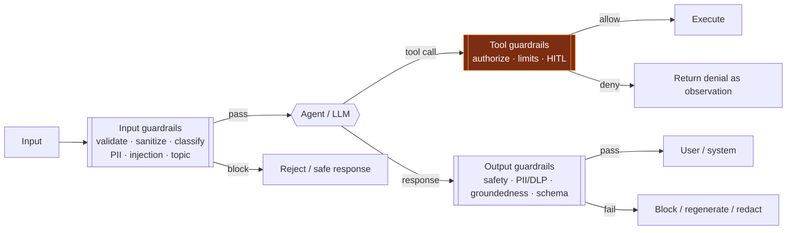
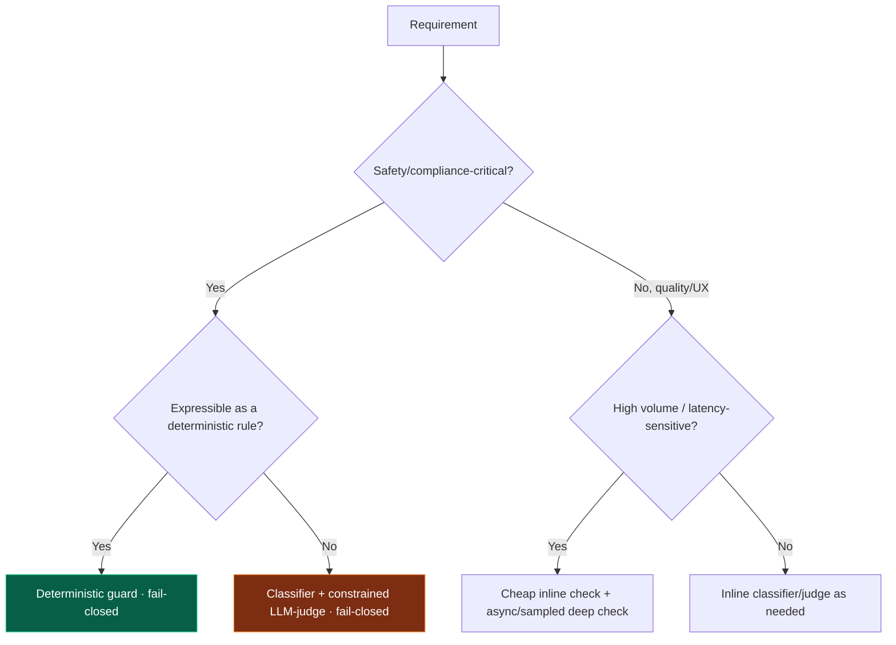

# 15 — Guardrails

> By the end of this section you can design layered guardrails (input/output/tool) that enforce policy
> the model can't be talked out of, choose deterministic vs. model-based checks, and add safety without
> wrecking latency or UX.

**Prerequisites:** [§14 Security](../14-Agent-Security/), [§03](../03-Agent-Architecture/) (control plane).
**You will be able to:**
- Place guardrails at the right layers and decide how many you need.
- Choose between rule-based, classifier, and LLM-judge guards — and combine them.
- Implement PII/safety/compliance checks with fail-open vs. fail-closed semantics.
- Balance guardrail latency/cost against risk.

---

## 1. TL;DR

- A **guardrail** is a check — *outside the LLM's discretion* — on **inputs**, **outputs**, or **tool
  calls**, enforcing safety/policy the model itself cannot override. It's the *enforcement* arm of
  [§14 security](../14-Agent-Security/).
- **Three layers:** **input** (validate/sanitize/classify before the model), **output** (validate before
  it reaches users/systems), **tool/action** (authorize before side effects). Defense-in-depth means
  *layering*, not picking one.
- **Implementation styles:** **deterministic** (regex/rules/schema — fast, reliable, narrow),
  **classifiers** (ML — broader, fast), **LLM-as-judge** (flexible, slower/costly), **policy engines**
  (OPA-style). Combine: cheap deterministic first, model-based for nuance.
- **Don't guard a model with only a model.** An LLM-only guard shares the LLM's blind spots and can be
  injected too. Anchor with deterministic checks where possible.
- **Fail-closed for safety-critical, fail-open for availability-tolerant** — a deliberate, documented
  choice per guardrail.
- **Guardrails cost latency and money.** Run cheap checks inline, expensive ones async/sampled where the
  risk profile allows.

---

## 2. Concepts at three altitudes

### 🟢 Beginner — the mental model

The LLM is a brilliant but unpredictable employee. Guardrails are the **company policies and checkpoints**
that don't depend on the employee's good judgment: a form that rejects bad input before it's processed, a
reviewer who checks output before it ships, and an approval step before money moves. Even if the employee
is confused or tricked, the checkpoints hold.

### 🟡 Intermediate — the three layers



| Layer | Checks | Examples |
|---|---|---|
| **Input** | Before the model sees it | PII detection/redaction, injection/jailbreak classifier, topic/scope limits, schema/length validation |
| **Tool/action** | Before a side effect | Authorization ([§14](../14-Agent-Security/)), allow-lists, rate/spend limits, HITL approval, idempotency |
| **Output** | Before it leaves | Toxicity/safety filter, PII/DLP, **groundedness/hallucination** check, format/schema validation, citation enforcement |

**Implementation styles:**

| Style | Speed | Coverage | Reliability | Use for |
|---|---|---|---|---|
| **Deterministic (rules/regex/schema)** | Fastest | Narrow | High (no FN drift) | PII patterns, format, allow-lists, limits |
| **Classifier (ML)** | Fast | Broad | Good, tunable | Toxicity, injection, topic, sentiment |
| **LLM-as-judge** | Slow | Broadest, nuanced | Variable; can be injected | Policy nuance, groundedness, complex compliance |
| **Policy engine (OPA/Rego)** | Fast | Rules-as-code | High | Authorization, compliance rules, governance |

### 🔴 Expert — the trade-off surface

- **Layering beats any single guard.** Indirect injection can defeat an input classifier; an output DLP
  check still catches the exfiltration attempt; a tool authz check still blocks the action. Each layer
  catches what others miss — that's defense-in-depth ([§14](../14-Agent-Security/)).
- **Deterministic-first, model-second.** Run cheap, reliable deterministic checks before expensive
  model-based ones (cost + latency + a hard floor of guarantees). Reserve LLM-judges for nuance they
  uniquely handle, and remember **the judge itself can be prompt-injected** — constrain it, give it only
  the content to classify, never tool access.
- **Fail-open vs. fail-closed is a risk decision.** If the guardrail service is down: **fail-closed**
  (block) for safety/compliance-critical paths (financial actions, medical advice); **fail-open** (allow,
  log, alert) where availability matters more than the marginal risk. Decide and document per guardrail;
  don't let it be an accident of a `try/except`.
- **False positives are a real cost.** Over-aggressive guards block legitimate use and train users to
  route around you. Tune thresholds against an eval set; provide escalation/appeal paths.
- **Guardrails are policy-as-code.** They must be versioned, tested, observable, and owned — a regressed
  guardrail is a security incident ([§16](../16-Evaluation/), [§22](../22-Enterprise-Patterns/)).

> [!IMPORTANT]
> Guardrails enforce what the model **must/▒must-not** do regardless of how it's prompted or injected.
> If a requirement is *safety- or compliance-critical*, it belongs in a guardrail (deterministic where
> possible), **not** in the system prompt ([§04](../04-System-Prompts/), [§14](../14-Agent-Security/)).

---

## 3. Code: a layered guardrail pipeline

```python
from enum import Enum

class Decision(str, Enum):
    ALLOW = "allow"; BLOCK = "block"; REDACT = "redact"; ESCALATE = "escalate"

class GuardResult(BaseModel):
    decision: Decision
    reason: str
    transformed: str | None = None      # e.g., PII-redacted text

# Order matters: cheap/deterministic first, expensive/model-based last (short-circuit on BLOCK).
def run_guardrails(text: str, guards: list, *, fail_closed: bool) -> GuardResult:
    current = text
    for guard in guards:
        try:
            r = guard(current)
        except Exception as e:
            audit("guard_error", guard.__name__, e)
            # Explicit, documented failure semantics — not an accidental try/except outcome.
            return GuardResult(decision=Decision.BLOCK if fail_closed else Decision.ALLOW,
                               reason=f"guard {guard.__name__} errored; fail_{'closed' if fail_closed else 'open'}")
        if r.decision is Decision.BLOCK:
            return r                                    # short-circuit
        if r.decision is Decision.REDACT and r.transformed is not None:
            current = r.transformed                     # carry the sanitized text forward
        if r.decision is Decision.ESCALATE:
            return r
    return GuardResult(decision=Decision.ALLOW, reason="all guards passed", transformed=current)

# Example wiring — deterministic PII + schema, then a classifier, then (only if needed) an LLM judge.
INPUT_GUARDS  = [pii_redactor, length_limiter, injection_classifier]            # fast → broad
OUTPUT_GUARDS = [schema_validator, pii_dlp, toxicity_classifier, groundedness_judge]  # judge last

def safe_respond(user_input: str, agent, client) -> str:
    gin = run_guardrails(user_input, INPUT_GUARDS, fail_closed=False)
    if gin.decision is Decision.BLOCK:
        return "I can't help with that request."
    draft = agent.run(gin.transformed or user_input)
    gout = run_guardrails(draft, OUTPUT_GUARDS, fail_closed=True)   # safety-critical → fail closed
    if gout.decision is Decision.BLOCK:
        return "I'm unable to provide a response to that."
    return gout.transformed or draft
```

> [!TIP]
> The **ordering** (deterministic → classifier → judge) and the **explicit fail-open/fail-closed per
> pipeline** are the production essentials. Input guards here fail *open* (availability) but block on
> high-confidence hits; output guards fail *closed* (safety). Tool/action guards live in the execution
> boundary from [§14](../14-Agent-Security/#4-code-a-least-privilege-contained-tool-execution-boundary).

---

## 4. Safety filters & compliance validation

| Category | What it checks | Typical implementation |
|---|---|---|
| **PII / DLP** | Detect & redact emails, SSNs, cards, secrets | Deterministic patterns + NER classifier |
| **Toxicity / harmful content** | Hate, harassment, self-harm, violence | Classifier / vendor safety API |
| **Jailbreak / injection** | Known + novel attack patterns | Classifier + heuristics + spotlighting ([§04](../04-System-Prompts/)) |
| **Topical / scope** | Stay within allowed domain | Classifier; allow/deny topic lists |
| **Groundedness / hallucination** | Is the answer supported by retrieved context? | LLM-judge / NLI model ([§08](../08-RAG/), [§16](../16-Evaluation/)) |
| **Compliance / regulated output** | Required disclaimers, prohibited claims, citations | Policy engine + deterministic rules + judge |
| **Format / schema** | Valid structured output | Schema validation ([§04](../04-System-Prompts/)) |

**Tooling landscape** `[Established]`: open-source frameworks (NeMo Guardrails, Guardrails AI), vendor
safety/moderation APIs, policy engines (OPA/Rego for authz & compliance rules), plus your own
deterministic checks. **Build vs. buy:** buy/adopt for common categories (toxicity, PII, moderation);
build for *your* domain policies and the deterministic core.

---

## 5. Design patterns

| Pattern | What | When |
|---|---|---|
| **Layered defense** | Input + tool + output guards together | Always |
| **Deterministic-first cascade** | Cheap rules → classifier → judge, short-circuit | Cost/latency control |
| **Fail-closed safety gate** | Block on guard failure for critical paths | Money, medical/legal, irreversible |
| **HITL approval** | Human signs off before high-impact action | Irreversible/expensive ([§10 interrupt](../10-Orchestration/)) |
| **Constrained judge** | LLM-judge with only the content, no tools | Nuanced policy checks (limit injection risk) |
| **Async/sampled deep checks** | Expensive analysis off the hot path | Low-risk, high-volume flows |
| **Policy-as-code** | Versioned, tested guardrail rules | Governance/compliance ([§22](../22-Enterprise-Patterns/)) |

---

## 6. Anti-patterns ❌ → ✅

| ❌ Anti-pattern | Why it bites | ✅ Instead |
|---|---|---|
| Single guardrail layer | One bypass = full failure | Layer input + tool + output |
| LLM-only guarding an LLM | Shared blind spots; injectable judge | Anchor with deterministic checks; constrain the judge |
| Implicit fail behavior (random try/except) | Unknown open/closed under failure | Explicit, documented fail-open/closed per guard |
| Guardrails only at output | Bad input already wasted a run; tool abuse slipped through | Guard all three layers |
| Over-blocking everything | Users route around; lost trust | Tune thresholds; escalation/appeal paths |
| Security rules in the prompt only | Injection bypasses | Enforce in guardrails ([§14](../14-Agent-Security/)) |
| Guardrails unversioned/untested | Silent regressions | Policy-as-code: version, eval-gate, monitor |
| Expensive judge on every call | Latency/cost blowup | Cascade; async/sample low-risk paths |

---

## 7. Common failures & troubleshooting

| Symptom | Root cause | Detection | Resolution |
|---|---|---|---|
| Harmful/policy-violating output shipped | Missing/weak output guard | Output audit; red-team ([§16](../16-Evaluation/)) | Add layered output guards; fail-closed on critical |
| Legitimate requests blocked | Over-aggressive guard / bad threshold | False-positive rate metric | Tune; add appeal/escalation; refine classifier |
| Guard service outage broke everything | Fail-closed everywhere | Availability incident | Right-size fail-open/closed per risk |
| Injection slipped past input guard | Novel attack; classifier gap | Incident trace | Defense-in-depth (tool+output caught it?); update classifier; spotlight |
| Latency spiked | Synchronous LLM-judge on hot path | Span timings ([§17](../17-Observability/)) | Cascade; async/sample; cache |
| Judge gave wrong verdicts | Ungrounded/injectable judge | Judge-vs-human calibration | Constrain judge; deterministic anchors; rubric tuning |

---

## 8. The four implication lenses

- **Performance:** guardrails add latency on the hot path; cascade cheap→expensive, run deep checks
  async/sampled where risk allows ([§18](../18-Performance-Optimization/)).
- **Security:** guardrails *are* the enforcement layer for [§14](../14-Agent-Security/); layering and
  fail-closed gates contain injection/abuse.
- **Scalability:** classifier/judge calls add load; budget and scale them like any service; sample where
  acceptable ([§19](../19-Scalability/)).
- **Cost:** model-based guards can rival the agent's own cost; deterministic-first + sampling control it
  ([§21](../21-Cost-Optimization/)).

---

## 9. Decision framework



---

## 10. Enterprise recommendations

- **A central guardrail service** as a platform primitive: shared PII/DLP, safety, injection, and
  groundedness checks, plus a policy engine for org compliance rules — consistent across teams
  ([§22](../22-Enterprise-Patterns/)).
- **Mandate layering + explicit fail semantics**; safety/compliance-critical paths fail closed and
  require HITL on irreversible actions.
- **Policy-as-code:** guardrails versioned, eval-gated, and monitored; a regression is an incident
  ([§16](../16-Evaluation/), [§17](../17-Observability/)).
- **Deterministic-first**, model-based for nuance; constrain judges (content-only, no tools).
- **Track false-positive/negative rates** and provide user escalation; over-blocking erodes adoption.

---

## 11. Interview-level questions

<details>
<summary><b>Q1.</b> Why isn't an LLM-based guardrail sufficient on its own?</summary>

Because it shares the failure modes of the thing it's guarding: it's probabilistic, can be **prompt-
injected** (especially if it sees attacker-controlled content), and has the same blind spots as the
generator. A clever payload that fools the agent can fool an LLM judge reading the same text. So you
**anchor** with deterministic checks (PII patterns, schema, allow-lists, limits) that give hard
guarantees, **layer** input/tool/output guards so a bypass at one layer is caught at another, and
**constrain** any LLM-judge (give it only the content to classify, no tools, a tight rubric). Model-based
guards add valuable nuance but are never the sole control ([§14](../14-Agent-Security/)).
</details>

<details>
<summary><b>Q2.</b> Fail-open or fail-closed for guardrails?</summary>

It depends on the path, and it must be a **deliberate, documented** choice per guardrail — not an
accident of error handling. **Fail-closed** (block when the guard is unavailable) for safety- and
compliance-critical flows: financial transactions, medical/legal advice, irreversible actions — better to
be unavailable than unsafe. **Fail-open** (allow, but log and alert) where availability outweighs the
marginal risk and other layers still apply — e.g., a non-critical toxicity check on a low-risk internal
tool. The key is that the behavior under guard failure is *designed*, tested, and owned.
</details>

<details>
<summary><b>Q3.</b> Design the guardrails for an agent that answers medical questions from a knowledge
base.</summary>

**Input:** PII redaction, injection classifier, scope check (refuse non-medical/emergency → direct to
emergency services). **Retrieval:** ACL + source-quality filtering ([§08](../08-RAG/)). **Output**
(fail-closed): **groundedness** check (answer must be supported by retrieved sources — block/regenerate if
not), prohibited-claims and required-disclaimer checks via a policy engine, citation enforcement,
PII/DLP. **Action:** HITL for anything beyond information (no autonomous prescriptions/orders).
**Cross-cutting:** constrained LLM-judge (content-only) for nuance, deterministic anchors for the
non-negotiables, full audit, and continuous red-teaming. The theme: deterministic guarantees for the
critical rules, fail-closed, human in the loop for action, grounded outputs only ([§14](../14-Agent-Security/), [§16](../16-Evaluation/)).
</details>

---

### Sources
- OWASP *Top 10 for LLM Apps* (output handling, injection) — guardrails as mitigation. `[Established]`
- NeMo Guardrails; Guardrails AI; vendor moderation/safety APIs; OPA/Rego for policy-as-code. `[Established]`
- Groundedness/NLI-based hallucination checks; see [§16 Evaluation](../16-Evaluation/). `[Established]`

> Next: [§16 — Evaluation](../16-Evaluation/) — how you know the guardrails (and everything else) actually work.
