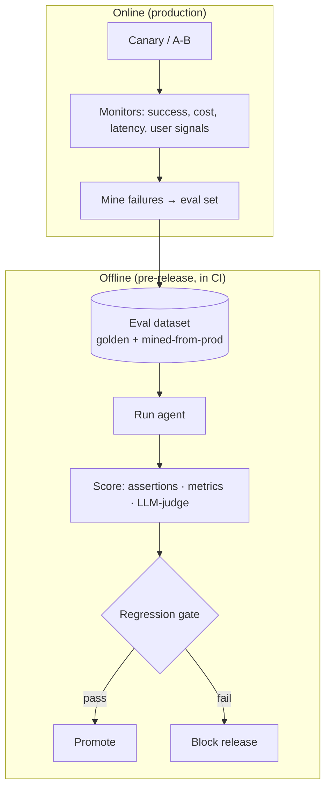
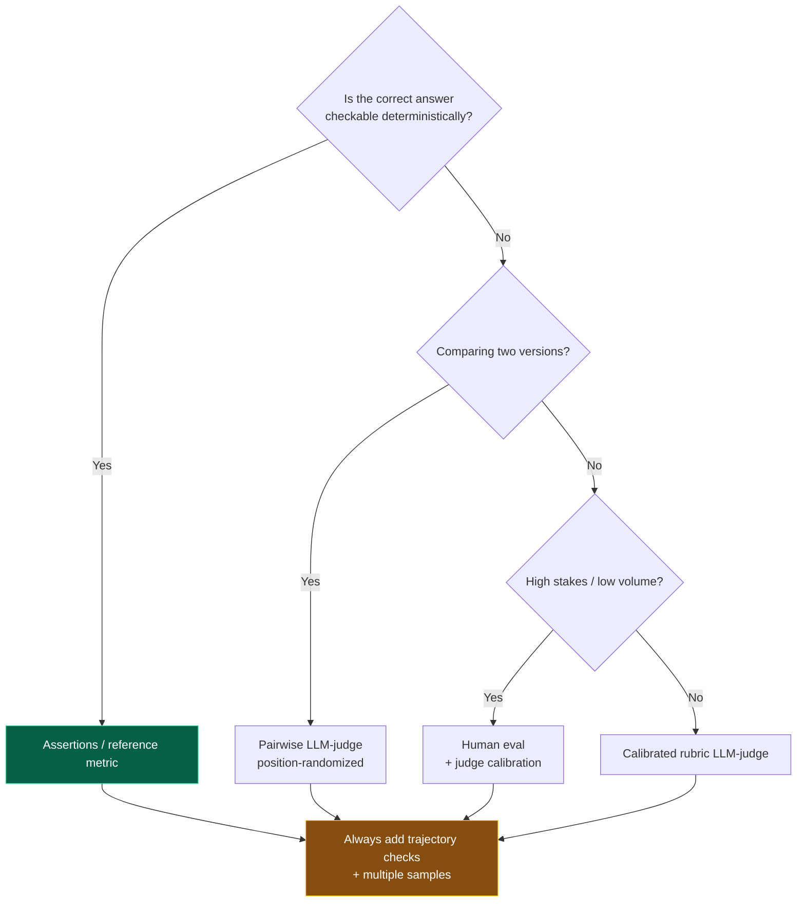

# 16 — Evaluation

> By the end of this section you can build an eval harness that gates releases for a non-deterministic
> system, use LLM-as-judge without fooling yourself, and evaluate *trajectories*, not just final answers.

**Prerequisites:** [§03 Agent Architecture](../03-Agent-Architecture/).
**You will be able to:**
- Stand up offline + online evaluation with regression gates.
- Design and calibrate LLM-as-judge scoring.
- Evaluate retrieval, tool use, guardrails, and multi-agent coordination separately.
- Treat production traces as the source of your eval set.

---

## 1. TL;DR

- **Eval is the foundation, not a phase.** You cannot improve — or safely ship — a probabilistic system
  you can't score. Build the eval set *before* optimizing the prompt/model ([§01](../01-Introduction/)).
- **Two regimes:** **offline** (a fixed dataset, run in CI, gates releases) and **online** (production
  A/B, canaries, monitors, user signals). You need both.
- **Outcome vs. trajectory:** score the **final result** *and* **how the agent got there** (steps, tool
  use, efficiency, safety). Agents fail in the *path*, not just the answer.
- **LLM-as-judge scales evaluation** but must be **calibrated against humans**, **rubric-driven**, and
  watched for bias (position, verbosity, self-preference). A miscalibrated judge is confidently wrong at
  scale.
- **Evaluate components separately:** retrieval (recall@k/nDCG), tool-calls (correct tool + args),
  guardrails (FP/FN), generation (groundedness) — so you fix the *right* stage ([§08](../08-RAG/)).
- **Production is the best eval set.** Continuously mine real traces ([§17](../17-Observability/)) into
  your dataset; offline sets rot relative to the live distribution.

---

## 2. Concepts at three altitudes

### 🟢 Beginner — the mental model

Because an LLM gives different outputs to the same input, you can't test it with `assert output ==
expected`. Instead you build a **graded exam**: a set of representative tasks with a way to *score* each
answer (sometimes exact, often "is this good?"). You run the exam every time you change the prompt, model,
or tools, and you only ship if the score didn't drop. The exam is the single most valuable artifact you
build — without it, you're tuning blind.

### 🟡 Intermediate — the evaluation stack



**What to measure:**

| Dimension | Examples | Method |
|---|---|---|
| **Outcome quality** | Correctness, helpfulness, faithfulness | Assertions, LLM-judge, human |
| **Trajectory** | Right tools, arg correctness, # steps, no loops | Trace analysis, rule + judge |
| **Task success** | Did it actually resolve the task end-to-end? | Outcome check / human / proxy signal |
| **Safety** | Injection resistance, policy compliance | Red-team set, guardrail metrics ([§14](../14-Agent-Security/), [§15](../15-Guardrails/)) |
| **Efficiency** | Tokens, cost, latency per task | Telemetry ([§17](../17-Observability/), [§21](../21-Cost-Optimization/)) |
| **Component** | Retrieval recall, tool accuracy | Labeled sub-task sets |

**Scoring methods, by reliability/cost:**
- **Deterministic assertions** — exact/regex/schema/contains; cheap, reliable, narrow. Use wherever the
  answer is checkable.
- **Reference-based metrics** — compare to a gold answer (exact match, F1; embedding similarity for fuzzy).
- **LLM-as-judge** — model scores against a rubric; flexible, scales, needs calibration.
- **Human eval** — gold standard, expensive; use to *calibrate* judges and for high-stakes spot checks.

### 🔴 Expert — the trade-off surface

- **Trajectory eval is what makes agent eval different.** Two agents can produce the same answer; one took
  3 clean steps, the other looped 14 times, called a destructive tool, and got lucky. Score the path:
  tool-selection accuracy, argument correctness, step count, redundant/looping behavior, and
  policy-respecting actions. Outcome-only eval hides the time bombs.
- **LLM-as-judge biases are real and measurable** `[Established]`: **position bias** (favoring the first
  option in pairwise), **verbosity bias** (longer ≈ better), **self-preference** (a model rating its own
  family higher). Mitigate: randomize/​swap positions, force rubric-based scoring with explicit criteria,
  use pairwise where possible, and **calibrate against a human-labeled set** (report judge-human agreement,
  e.g., Cohen's κ). An uncalibrated judge gives you precise, scalable, *wrong* numbers.
- **Offline-online gap is inevitable; close the loop.** Your offline set reflects yesterday's
  distribution. Production reveals new inputs and failure modes — **mine them continuously** into the
  dataset. Compare offline vs. online metrics; a divergence means your eval set is stale.
- **Goodhart's law applies.** Optimize a proxy metric and the agent games it (e.g., "judge likes confident
  tone" → confident hallucinations). Tie evals to *outcome/business* value, use multiple metrics, and
  refresh rubrics.
- **Eval is statistical.** Run multiple samples per case (non-determinism), report distributions/CIs, and
  size sets for the effect you need to detect. "It passed once" isn't a result.

> [!IMPORTANT]
> **Build the eval harness first.** It's the scaffolding that makes every other section measurable —
> prompt changes ([§04](../04-System-Prompts/)), model swaps ([§02](../02-LLM-Fundamentals/)), RAG tuning
> ([§08](../08-RAG/)), guardrails ([§15](../15-Guardrails/)). Teams that optimize before they can measure
> are doing astrology.

---

## 3. Code: an eval harness with assertions + calibrated LLM-judge + CI gate

```python
from pydantic import BaseModel
from statistics import mean

class Case(BaseModel):
    id: str
    input: str
    must_contain: list[str] = []          # deterministic assertions (cheap, reliable)
    forbid_tools: list[str] = []          # trajectory rule: never call these
    rubric: str | None = None             # for LLM-judge dimensions

class CaseResult(BaseModel):
    id: str; passed_assertions: bool; trajectory_ok: bool; judge_score: float

def evaluate_case(case: Case, agent, judge, samples: int = 3) -> CaseResult:
    runs = [agent.run(case.input) for _ in range(samples)]     # multiple samples: non-determinism
    # Deterministic + trajectory checks (hard gates)
    passed = all(all(s in r.text for s in case.must_contain) for r in runs)
    traj_ok = all(not (set(r.tools_called) & set(case.forbid_tools)) for r in runs)
    # LLM-judge (rubric-based, position-randomized) only where needed
    score = mean(judge.score(case.input, r.text, rubric=case.rubric) for r in runs) if case.rubric else 1.0
    return CaseResult(id=case.id, passed_assertions=passed, trajectory_ok=traj_ok, judge_score=score)

def ci_gate(cases, agent, judge, *, baseline: dict, min_judge: float = 0.8) -> bool:
    results = [evaluate_case(c, agent, judge) for c in cases]
    success = mean(r.passed_assertions and r.trajectory_ok for r in results)
    avg_judge = mean(r.judge_score for r in results)
    # Regression gate: block if we dropped vs. the committed baseline.
    regressed = success < baseline["success"] - 0.02 or avg_judge < min_judge
    log_eval(results, success=success, avg_judge=avg_judge)
    return not regressed       # CI fails the build on regression

# Calibrate the judge BEFORE trusting it: agreement with human labels on a held-out set.
def calibrate_judge(judge, human_labeled) -> float:
    agree = mean(judge.score(c.input, c.output, rubric=c.rubric).round() == c.human_label
                 for c in human_labeled)
    assert agree > 0.8, f"Judge agreement {agree:.2f} too low — fix rubric before using at scale"
    return agree
```

> [!TIP]
> The non-obvious essentials: **multiple samples per case** (non-determinism is the point), **trajectory
> rules** (`forbid_tools`) alongside outcome checks, a **regression gate against a committed baseline**
> (not an absolute threshold), and **judge calibration against humans before** you trust its numbers.

---

## 4. Component & specialized evals

| Component | Metric | Notes |
|---|---|---|
| **Retrieval** ([§08](../08-RAG/)) | recall@k, MRR, nDCG | On a labeled query→relevant-doc set; isolates retrieval from generation |
| **Generation grounding** | faithfulness/groundedness | NLI/judge: is every claim supported by context? |
| **Tool calling** ([§05](../05-Tools-and-Function-Calling/)) | tool-selection acc., arg-validity, exact-match | Did it pick the right tool with right args? |
| **Guardrails** ([§15](../15-Guardrails/)) | FP / FN rate, attack-block rate | Red-team set; tune thresholds |
| **Multi-agent** ([§12](../12-Multi-Agent-Patterns/)) | per-agent success, coordination efficiency, handoff count | Trajectory across agents; localize the weak link |
| **Safety** ([§14](../14-Agent-Security/)) | injection success rate, exfil attempts blocked | Adversarial suite; continuous |

---

## 5. Design patterns

| Pattern | What | When |
|---|---|---|
| **Golden set + regression gate** | Curated cases block CI on drop | Always |
| **Trace-mined dataset** | Real prod failures → eval cases | Continuous improvement |
| **Calibrated LLM-judge** | Rubric + human-agreement check | Scaling subjective scoring |
| **Pairwise comparison** | A vs. B preference (reduces some biases) | Comparing versions/models |
| **Canary / shadow eval** | New version on a slice / in parallel | Safe rollout ([§20](../20-Deployment/)) |
| **Online proxy metrics** | Implicit signals (resolution, retries, thumbs) | Production quality tracking |
| **Adversarial / red-team suite** | Injection & abuse cases | Security regression ([§14](../14-Agent-Security/)) |

---

## 6. Anti-patterns ❌ → ✅

| ❌ Anti-pattern | Why it bites | ✅ Instead |
|---|---|---|
| Optimize prompt/model before an eval set | Tuning blind; can't detect regressions | Build the eval set first |
| Outcome-only eval | Hides looping, wrong tools, unsafe paths | Add trajectory eval |
| Trust LLM-judge without calibration | Confident, scalable, wrong | Calibrate vs. humans; report agreement |
| Single sample per case | Non-determinism → flaky/false signal | Multiple samples; report distribution |
| Static eval set forever | Drifts from prod; misses new failures | Continuously mine prod traces |
| Exact-string asserts on free text | Brittle; fails on valid variation | Assert properties/schema; judge for quality |
| One global "quality" score | Can't localize failures | Per-component metrics |
| Gaming a proxy metric | Goodhart; e.g., confident hallucinations | Tie to outcomes; multiple metrics; refresh |

---

## 7. Common failures & troubleshooting

| Symptom | Root cause | Detection | Resolution |
|---|---|---|---|
| "Passed eval, fails in prod" | Eval set ≠ prod distribution | Offline vs. online metric gap | Mine prod into eval; expand coverage |
| Judge scores don't match reality | Uncalibrated/biased judge | Low human-agreement | Rubric tuning; randomize positions; recalibrate |
| Flaky eval results | Single sample; non-determinism | Variance across runs | Multiple samples; CIs; larger set |
| Regression shipped unnoticed | No gate / weak baseline | Post-hoc incident | CI regression gate vs. committed baseline |
| Can't tell which stage failed | Only end-to-end metric | — | Component evals (retrieval/tool/guard) |
| Metric improved, users unhappy | Goodharted proxy | Outcome vs. proxy divergence | Re-tie to outcomes; multi-metric |

---

## 8. The four implication lenses

- **Performance:** evals themselves cost time/compute; sample sizes and judge calls add up — parallelize,
  cache, sample ([§18](../18-Performance-Optimization/)).
- **Security:** the adversarial/red-team suite is a security control; injection-resistance must be a
  tracked, gated metric ([§14](../14-Agent-Security/)).
- **Scalability:** eval infra must scale with dataset size and release cadence; judge calls are load.
- **Cost:** LLM-judge and multi-sample eval can be a real line item; balance rigor vs. spend, sample
  low-risk cases ([§21](../21-Cost-Optimization/)).

---

## 9. Decision framework — how to score this output



---

## 10. Enterprise recommendations

- **Eval harness as platform infrastructure:** shared datasets, judges, metrics, and CI gates every team
  uses — so "ship only if eval passes" is enforced, not optional ([§22](../22-Enterprise-Patterns/)).
- **Regression gates in CI** against committed baselines for prompt/model/tool/guardrail changes; a model
  upgrade is a gated deploy ([§02](../02-LLM-Fundamentals/), [§20](../20-Deployment/)).
- **Closed loop:** production traces → labeled cases → eval set (with a human-in-the-loop labeling
  pipeline) ([§17](../17-Observability/)).
- **Calibrated judges, governed:** track judge-human agreement; version rubrics; watch for bias.
- **Adversarial suite mandatory** for any agent with tools/data access ([§14](../14-Agent-Security/)).

---

## 11. Interview-level questions

<details>
<summary><b>Q1.</b> How do you evaluate a non-deterministic agent, and why is it different from testing
normal software?</summary>

You can't assert exact equality, so you build a **graded eval set** scored by assertions (where checkable),
reference metrics, and **calibrated LLM-judges**, run with **multiple samples** per case and reported as
distributions — gated in CI against a committed baseline. The key difference from agents specifically is
**trajectory evaluation**: you score not just the final answer but the *path* (correct tools, valid args,
step count, no loops, policy-respecting actions), because agents fail in the path even when the answer
looks right. And because the live distribution drifts, you continuously **mine production traces** into
the dataset — the eval set is a living artifact, not a fixture.
</details>

<details>
<summary><b>Q2.</b> What are the failure modes of LLM-as-judge and how do you mitigate them?</summary>

**Position bias** (prefers the first option in pairwise), **verbosity bias** (longer looks better),
**self-preference** (rates its own model family higher), and general miscalibration. Mitigations:
**randomize/swap positions** and average; force **rubric-based scoring** with explicit criteria rather
than a vibe; prefer **pairwise** comparisons for version selection; constrain the judge (content-only, no
tools — it can be injected); and crucially **calibrate against human labels**, reporting agreement (e.g.,
Cohen's κ) and refusing to trust a judge below a threshold. Treat the judge as a measurement instrument
that must itself be validated.
</details>

<details>
<summary><b>Q3.</b> Your offline evals look great but users complain. What's happening and what do you do?</summary>

Classic **offline-online gap**: the eval set no longer reflects the production distribution (new inputs,
new failure modes), or you've **Goodharted** a proxy metric that diverges from real user value. Diagnose
by comparing offline scores to online signals (resolution rate, retries, thumbs, escalations) and by
sampling unhappy sessions. Fix by **mining production failures into the eval set**, expanding coverage,
re-tying metrics to **outcomes** rather than proxies, and adding the missing dimensions (often trajectory
or safety). Then re-baseline the regression gate. The eval set is only as good as its fidelity to reality
([§17](../17-Observability/)).
</details>

---

### Sources
- Zheng et al., *Judging LLM-as-a-Judge* (MT-Bench/Chatbot Arena) — judge biases & agreement. `[Established]`
- RAG eval: RAGAS / faithfulness & context-relevance metrics; IR metrics (recall@k, nDCG). `[Established]`
- Agent/trajectory eval guidance (LangSmith, vendor eval docs). `[Established]`
- Goodhart's law; standard ML eval practice (sampling, CIs). `[Established]`

> Next: [§17 — Observability](../17-Observability/) — the traces that feed these evals and let you debug.
