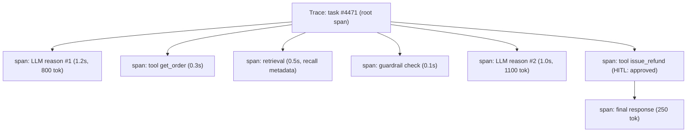
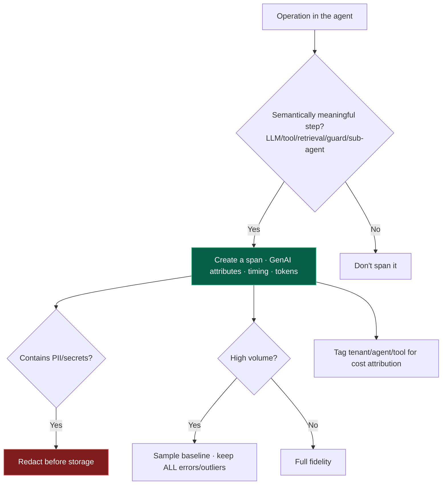

# 17 — Observability

> By the end of this section you can instrument an agent so its non-deterministic trajectory is fully
> debuggable, attribute cost per tenant/agent, and feed production traces back into evaluation.

**Prerequisites:** [§03 Agent Architecture](../03-Agent-Architecture/), [§16 Evaluation](../16-Evaluation/).
**You will be able to:**
- Instrument agents with traces/metrics/logs using OpenTelemetry GenAI conventions.
- Reconstruct and replay a trajectory to root-cause a failure.
- Attribute tokens/cost for FinOps and detect runaways.
- Close the loop: traces → eval dataset → improvement.

---

## 1. TL;DR

- **You cannot debug or improve a non-deterministic agent you can't observe.** Observability is
  scaffolding built *first*, alongside eval — not bolted on after an incident.
- **The trace IS the trajectory.** Model the agent as a tree of **spans** — one per LLM call, tool call,
  retrieval, guardrail, sub-agent — and the trace becomes the debuggable record of what the agent did and
  why.
- **Use OpenTelemetry's GenAI semantic conventions** `[Emerging→Established]` so spans are vendor-neutral
  and portable across tools, with standardized attributes (model, tokens, tool name, cost).
- **Three pillars, agent-flavored:** structured **logs** (prompts/completions/tool I/O, redacted),
  **metrics** (latency TTFT/TPOT, tokens, cost, success rate, step count), **traces** (the span tree).
- **Cost/token attribution is first-class** — per request, per tenant, per agent, per tool — for FinOps
  and runaway detection ([§21](../21-Cost-Optimization/)).
- **Close the loop:** capture traces → label failures → grow the eval set ([§16](../16-Evaluation/)).
  Observability without that loop is just dashboards.

---

## 2. Concepts at three altitudes

### 🟢 Beginner — the mental model

A normal bug you reproduce with a stack trace. An agent bug you often *can't* reproduce — same input,
different path. So instead of a stack trace, you record **everything the agent did**: each thought, each
tool call and its result, each retrieval, with timing and token counts. That record (a "trace") lets you
replay the session and see *exactly* where it went wrong — the agent equivalent of a flight recorder.

### 🟡 Intermediate — the trace as a trajectory



**The three pillars for agents:**

| Pillar | Captures | Agent-specific content |
|---|---|---|
| **Tracing** | Causal span tree per request | LLM calls, tool calls, retrievals, guardrails, sub-agents, handoffs |
| **Metrics** | Aggregates over time | TTFT/TPOT, tokens in/out, \$/request, success rate, **step count**, tool error rate, cache hit rate |
| **Logging** | Detailed records | Prompts, completions, tool args/results (**redacted** for PII/secrets) |

**OpenTelemetry GenAI semantic conventions** `[Emerging→Established]`: a standard schema for LLM/agent
spans — attributes like `gen_ai.system`, `gen_ai.request.model`, `gen_ai.usage.input_tokens`,
`gen_ai.usage.output_tokens`, and conventions for tool/agent spans. Using them means your telemetry works
across LangSmith, Langfuse, Phoenix, Datadog, Grafana, etc., instead of being locked to one vendor.

### 🔴 Expert — the trade-off surface

- **Span granularity is a design choice.** Too coarse (one span per request) and you can't localize
  failures; too fine and you drown in noise and overhead. The right unit is **one span per
  semantically-meaningful operation** (each LLM call, tool call, retrieval, guardrail, sub-agent) with
  rich attributes — enough to reconstruct the trajectory and the decision at each step.
- **Capture the inputs/outputs, redact the secrets.** The debugging value is in the actual prompts,
  completions, and tool I/O — but those contain PII, credentials, and customer data. Redaction/DLP at the
  observability boundary is mandatory, and sampling/retention policies must respect compliance
  ([§14](../14-Agent-Security/), [§22](../22-Enterprise-Patterns/)).
- **Replay is the superpower.** Persisting full trajectories (and orchestration checkpoints, [§10](../10-Orchestration/))
  lets you **re-run from any step**, diff two runs, and reproduce a "non-reproducible" bug deterministically
  by replaying the recorded tool results. This is how you debug what you can't re-trigger.
- **Cost attribution must be multi-dimensional.** Aggregate tokens/cost by **request, tenant, agent,
  tool, and feature**. Without per-tenant attribution you can't do FinOps, detect a runaway loop early, or
  price the product ([§21](../21-Cost-Optimization/)).
- **Sampling vs. completeness.** High-volume systems can't trace-and-store everything at full fidelity.
  Sample, but **always keep full traces for errors, slow outliers, and a representative baseline** —
  those are where the value is.

> [!IMPORTANT]
> Observability and evaluation are **one system with two faces**: traces are how you *debug today* and how
> you *build the eval set for tomorrow* ([§16](../16-Evaluation/)). Wire the loop — captured failures
> become labeled cases — or you'll keep re-discovering the same bugs.

---

## 3. Code: an OpenTelemetry-instrumented agent loop

```python
from opentelemetry import trace
tracer = trace.get_tracer("agent")

def traced_agent(task: str, agent, tenant_id: str) -> str:
    with tracer.start_as_current_span("agent.run") as root:
        root.set_attribute("agent.task_id", task_id(task))
        root.set_attribute("tenant.id", tenant_id)          # for per-tenant cost attribution
        total_tokens = 0
        for step in range(agent.max_steps):
            with tracer.start_as_current_span("gen_ai.chat") as s:   # GenAI semconv span
                resp = agent.reason(task)
                s.set_attribute("gen_ai.request.model", resp.model)
                s.set_attribute("gen_ai.usage.input_tokens", resp.usage.input)
                s.set_attribute("gen_ai.usage.output_tokens", resp.usage.output)
                s.set_attribute("gen_ai.response.finish_reason", resp.stop_reason)
                total_tokens += resp.usage.input + resp.usage.output
            if resp.stop_reason != "tool_use":
                root.set_attribute("agent.steps", step + 1)
                root.set_attribute("gen_ai.usage.total_tokens", total_tokens)
                emit_cost_metric(tenant_id, agent.name, total_tokens)   # → FinOps dashboards (§21)
                return agent.finalize(resp)
            for call in resp.tool_calls:
                with tracer.start_as_current_span("execute_tool") as ts:
                    ts.set_attribute("tool.name", call.name)
                    ts.set_attribute("tool.args", redact(call.args))    # REDACT secrets/PII
                    try:
                        result = agent.execute(call)
                        ts.set_attribute("tool.status", "ok")
                    except Exception as e:
                        ts.record_exception(e); ts.set_attribute("tool.status", "error")
                        result = error_observation(call, e)
                    agent.observe(result)
        root.set_attribute("agent.outcome", "budget_exceeded")
        return "ESCALATE"
```

> [!TIP]
> Three things make this *useful*, not just instrumented: **GenAI-convention attributes** (portable across
> tools), **tenant/agent tags on cost** (FinOps + runaway detection), and **redaction at the boundary**
> (you capture tool I/O for debugging without leaking secrets). Pair with the orchestrator's checkpoints
> ([§10](../10-Orchestration/)) to enable replay.

---

## 4. Tooling landscape & build-vs-buy

| Need | Options |
|---|---|
| **LLM/agent-native observability** | LangSmith, Langfuse, Arize Phoenix, Braintrust, etc. (traces, evals, prompt mgmt, replay) |
| **General APM/o11y** | Datadog, Grafana/Tempo, Honeycomb, New Relic — increasingly GenAI-aware via OTel |
| **Standard layer** | **OpenTelemetry GenAI semconv** — emit once, export anywhere |
| **Cost/FinOps** | Built into LLM-o11y tools or custom metrics → your metrics backend |

> [!NOTE]
> **Build vs. buy:** adopt OTel as the *standard* (avoid lock-in), then **buy** an LLM-native platform for
> trace UI, evals, and prompt management early (it pays for itself the first hard bug), and **build** only
> the custom dashboards/attribution your business needs. Don't roll your own tracing.

---

## 5. Design patterns

| Pattern | What | When |
|---|---|---|
| **Span-per-operation** | LLM/tool/retrieval/guardrail/sub-agent each a span | Always |
| **OTel GenAI semconv** | Standard attributes | Portability, multi-tool |
| **Full-fidelity on errors, sample the rest** | Keep all error/outlier traces, sample baseline | High volume |
| **Trajectory replay** | Re-run from a checkpoint with recorded results | Debugging non-determinism |
| **Multi-dim cost attribution** | tokens/\$ by tenant/agent/tool | FinOps, runaway detection ([§21](../21-Cost-Optimization/)) |
| **Trace → eval pipeline** | Failures become labeled eval cases | Continuous improvement ([§16](../16-Evaluation/)) |
| **Redaction at boundary** | Strip PII/secrets before storage | Compliance, security |

---

## 6. Anti-patterns ❌ → ✅

| ❌ Anti-pattern | Why it bites | ✅ Instead |
|---|---|---|
| Add observability after an incident | Can't debug the incident you have | Instrument from day one |
| One span per request | Can't localize where it failed | Span per meaningful operation |
| Log raw prompts with PII/secrets | Compliance breach; credential leak | Redact at the boundary |
| Vendor-locked telemetry | Hard to switch; siloed | OTel GenAI semconv |
| No cost attribution | Can't do FinOps or catch runaways | Tag tokens/\$ by tenant/agent/tool |
| Trace everything at full fidelity | Cost/overhead explosion | Sample; full fidelity for errors/outliers |
| Dashboards with no eval loop | Pretty graphs, no improvement | Feed traces into the eval set |
| Roll-your-own tracing | Reinvents OTel poorly | Use OTel + an LLM-native platform |

---

## 7. Common failures & troubleshooting

| Symptom | Root cause | Detection | Resolution |
|---|---|---|---|
| "Can't reproduce" the bug | No trajectory capture | — | Persist full traces + checkpoints; replay |
| Surprise bill, no idea where | No cost attribution | Cost-by-tenant/agent dashboard | Tag cost; alert on per-task token spikes |
| Slow but don't know which step | No per-span timing | Span latency breakdown | Span-per-operation; find the hot span |
| PII found in logs | No redaction | Log scanning | Redact at boundary; purge; policy |
| Telemetry siloed across tools | Vendor-specific formats | — | Standardize on OTel semconv |
| Same bug recurs | No trace→eval loop | Repeat incidents | Wire failures into eval set ([§16](../16-Evaluation/)) |
| Runaway loop caught late | No step-count metric/alert | Step-count distribution | Alert on step/token anomalies; budgets ([§03](../03-Agent-Architecture/)) |

---

## 8. The four implication lenses

- **Performance:** instrumentation adds small overhead; sampling controls it. Observability is how you
  *find* the perf problems in [§18](../18-Performance-Optimization/) (which span is slow).
- **Security:** traces contain sensitive data — redact, access-control, and set retention; audit logs are
  themselves a security control ([§14](../14-Agent-Security/)).
- **Scalability:** telemetry volume scales with traffic; sample and aggregate; don't let o11y become the
  bottleneck ([§19](../19-Scalability/)).
- **Cost:** observability has its own cost (storage/ingest), but it's how you *control* the much larger
  LLM cost via attribution and runaway detection ([§21](../21-Cost-Optimization/)).

---

## 9. Decision framework — what to capture



---

## 10. Enterprise recommendations

- **OTel GenAI semconv as the standard**, exported to your chosen platform(s) — portability and no
  lock-in ([§22](../22-Enterprise-Patterns/)).
- **Observability + eval as one platform capability**, with the trace→eval loop wired and a labeling
  pipeline ([§16](../16-Evaluation/)).
- **Mandatory redaction + retention policy** on captured prompts/tool I/O; access-controlled, auditable
  ([§14](../14-Agent-Security/)).
- **Per-tenant/agent/tool cost attribution** feeding FinOps dashboards and runaway alerts ([§21](../21-Cost-Optimization/)).
- **Replay capability** (traces + checkpoints) as a standard debugging tool, especially for incidents.

---

## 11. Interview-level questions

<details>
<summary><b>Q1.</b> How do you debug an agent failure you can't reproduce?</summary>

Capture the **full trajectory** as a trace — every LLM call (with prompt/completion/tokens), tool call
(args/result/status), retrieval (with recall metadata), and guardrail decision as spans — plus
orchestration **checkpoints** ([§10](../10-Orchestration/)). Then **replay**: re-run from a checkpoint
using the *recorded* tool results to reproduce the path deterministically, and **diff** against a good
run to localize the divergence. Non-determinism makes live reproduction unreliable, so you debug the
*recording*, not the live system. This is why full-fidelity traces on errors/outliers are non-negotiable,
and why observability is built first, not after the incident.
</details>

<details>
<summary><b>Q2.</b> Why standardize on OpenTelemetry GenAI conventions instead of a vendor SDK?</summary>

Portability and longevity. GenAI semconv defines a **vendor-neutral schema** for LLM/agent spans (model,
tokens, tool name, finish reason, etc.), so you instrument **once** and export to any backend — LangSmith,
Langfuse, Phoenix, Datadog, Grafana — and switch tools without re-instrumenting. A vendor SDK locks your
telemetry into one platform and silos it from the rest of your observability. You can still *use* a
vendor's rich UI — just feed it via OTel. It's the same logic as standardizing on OTel for microservices,
applied to agents.
</details>

<details>
<summary><b>Q3.</b> How do you attribute and control LLM cost in production?</summary>

Tag every LLM/tool span with **tenant, agent, tool, and feature**, and emit token/cost metrics
dimensioned by those. That gives per-tenant and per-agent cost dashboards (FinOps), unit economics
(cost-per-resolved-task), and — critically — **anomaly alerts** on per-task token spikes that catch
runaway loops *early* rather than on the monthly bill. Combine with budgets/fail-stops in the loop
([§03](../03-Agent-Architecture/)) so detection has teeth. Without attribution you can see *that* spend
rose but not *where*, so you can't act ([§21](../21-Cost-Optimization/)).
</details>

---

### Sources
- OpenTelemetry **GenAI semantic conventions** (LLM/agent spans & metrics). `[Emerging→Established]`
- LLM-observability platforms: LangSmith, Langfuse, Arize Phoenix, Braintrust (tracing, replay, evals). `[Established]`
- Three-pillars observability (logs/metrics/traces) — standard SRE practice applied to agents. `[Established]`

> Next: Batch 4 — [§18 Performance](../18-Performance-Optimization/), [§19 Scalability](../19-Scalability/),
> [§20 Deployment](../20-Deployment/), [§21 Cost](../21-Cost-Optimization/).
