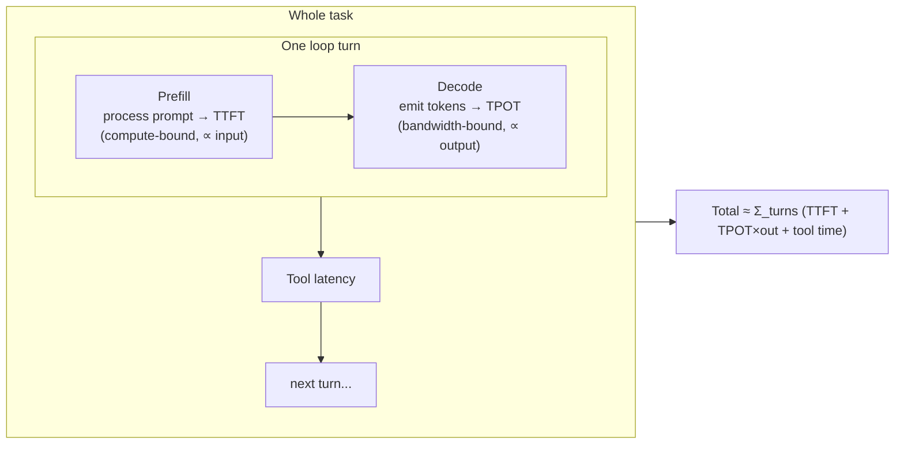
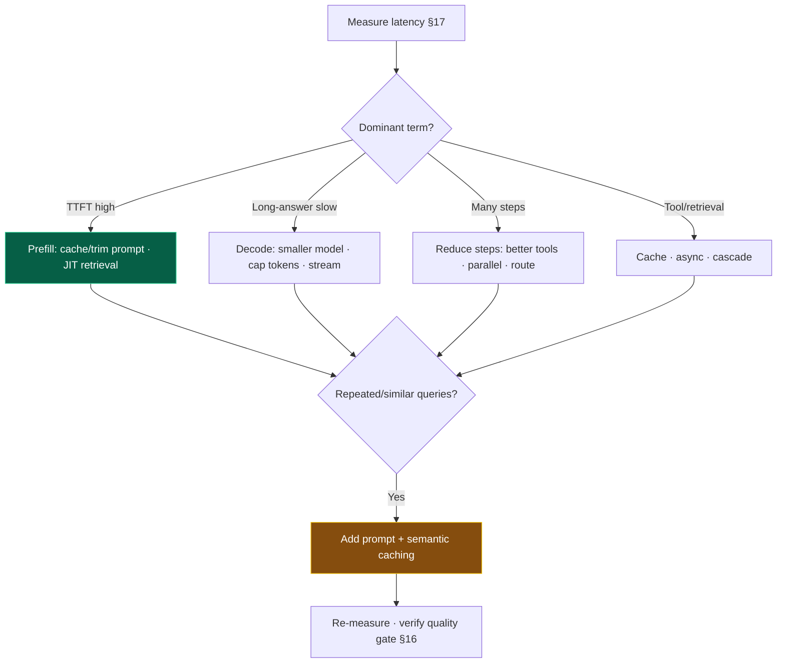

# 18 — Performance Optimization

> By the end of this section you can find whether an agent is slow because of prefill, decode,
> retrieval, or step count, and apply the right lever — caching, streaming, right-sizing, parallelism —
> measured against a budget.

**Prerequisites:** [§02 LLM Fundamentals](../02-LLM-Fundamentals/) (prefill/decode, KV cache), [§17 Observability](../17-Observability/).
**You will be able to:**
- Decompose agent latency and target the actual bottleneck.
- Apply prompt caching, semantic caching, and right-sizing correctly.
- Optimize retrieval and parallelize independent work.
- Benchmark on the distribution, not the mean.

---

## 1. TL;DR

- **Latency = TTFT + (TPOT × output tokens), summed over loop turns.** Diagnose *which* term hurts before
  optimizing — they have opposite levers ([§02](../02-LLM-Fundamentals/)).
- **High TTFT ⇒ prefill-bound ⇒ shrink/cache the prompt.** High TPOT/long outputs ⇒ decode-bound ⇒
  smaller model, fewer output tokens, streaming.
- **Step count is the dominant agent latency lever.** Each loop turn is ≥1 round-trip; fewer/parallel
  steps beats micro-optimizing any single call ([§03](../03-Agent-Architecture/)).
- **Prompt caching** (reuse KV state of a stable prefix) is the highest-ROI agent optimization — agents
  re-send a big stable preamble every turn. **Semantic caching** reuses responses for similar queries.
- **Streaming doesn't reduce latency — it reduces *perceived* latency.** Use it for UX; combine with real
  reductions.
- **Benchmark the distribution (p50/p95/p99), with realistic load and prompts.** Means lie; agents have
  fat tails (variable step counts).

---

## 2. Concepts at three altitudes

### 🟢 Beginner — the mental model

Two timers matter: how long until the agent *starts* answering (time-to-first-token, TTFT), and how fast
it *types* the rest (time-per-output-token, TPOT). A big question (long prompt) delays the start; a long
answer (or a big model) slows the typing. And because an agent *loops* — think, act, think again — total
time multiplies by the number of steps. Speeding up an agent is mostly: smaller prompts, shorter answers,
fewer steps, and reusing work you've done before (caching).

### 🟡 Intermediate — the latency anatomy



| Bottleneck | Symptom | Levers |
|---|---|---|
| **Prefill** | High TTFT, big prompts | Trim prompt; **prompt caching**; JIT retrieval; smaller context |
| **Decode** | Long answers slow; big model | Smaller model for the step; cap `max_tokens`; **stream**; concise prompting |
| **Step count** | Many loop turns | Better tools (fewer steps); parallel tool calls; collapse steps |
| **Tool/retrieval** | Slow external calls | Cache; async; parallelize; cascade retrieval ([§08](../08-RAG/)) |
| **Network/queueing** | Overhead per call | Co-locate; connection reuse; batch ([§19](../19-Scalability/)) |

**Caching — three kinds, don't confuse them:**

| Cache | Reuses | Hit when | Win |
|---|---|---|---|
| **Prompt caching** | KV state of a stable **prefix** | Same prefix (system+tools+context) re-sent | Skips re-prefill → big TTFT + cost cut |
| **Semantic caching** | A prior **response** | New query is *semantically similar* to a past one | Skips the whole call |
| **Exact-match caching** | A prior response | Identical request | Skips the whole call |

### 🔴 Expert — the trade-off surface

- **Prompt caching is *the* agent optimization.** Agents re-send a large, mostly-stable preamble (system
  prompt, tool defs, long context) on every loop turn. Caching that prefix turns each turn's prefill from
  "process 10k tokens" into "process the new 200." Design prompts as **stable prefix + dynamic suffix**
  ([§04](../04-System-Prompts/)) to maximize hit rate. This is both latency and cost ([§21](../21-Cost-Optimization/)).
- **Semantic caching has a correctness/precision trade.** Returning a cached answer for a "similar"
  query risks serving a subtly-wrong response. Tune the similarity threshold conservatively, scope caches
  per user/tenant (avoid leakage), and invalidate on data changes. Great for FAQs/repetitive queries;
  dangerous for high-variance, high-stakes ones.
- **Parallelize independent work.** Independent tool calls in one turn ([§05](../05-Tools-and-Function-Calling/)),
  independent sub-agents ([§12](../12-Multi-Agent-Patterns/)), and wide-then-narrow retrieval cascades
  ([§08](../08-RAG/)) all cut wall-clock. The dependency graph, not the call count, sets the floor.
- **Right-size per step, not per task.** The latency-sensitive classify/route step uses a fast small
  model; the hard reasoning step uses the big one ([§02 router](../02-LLM-Fundamentals/#7-code-production-grade-model-router)).
- **Speculative decoding** (provider-side) `[Established]`: a small draft model proposes tokens a big
  model verifies in parallel, speeding decode with identical output. You rarely control it directly, but
  it's why some endpoints are faster — factor it into model/endpoint choice.
- **Benchmark honestly.** Use **realistic prompts and load**, report **p50/p95/p99** (agents have fat
  tails from variable step counts), warm vs. cold cache, and measure end-to-end *task* latency, not just
  single-call latency. Optimizing the mean while p99 melts is a common self-deception.

> [!IMPORTANT]
> Order of operations: **measure → find the dominant term → apply its lever → re-measure.** The most
> common waste is optimizing decode (smaller model) when the problem was prefill (huge cached-able
> prompt), or micro-tuning a call when the real cost was 12 loop steps. Observability ([§17](../17-Observability/))
> tells you which.

---

## 3. Code: semantic cache + parallel tool execution

```python
# --- Semantic cache: return a prior answer if a new query is close enough (scoped per tenant) ---
class SemanticCache:
    def __init__(self, vector_store, threshold: float = 0.95):    # conservative threshold
        self.store, self.threshold = vector_store, threshold

    def get(self, query: str, tenant: str) -> str | None:
        hit = self.store.nearest(embed(query), filter={"tenant": tenant})  # tenant scope = no leakage
        return hit.answer if hit and hit.score >= self.threshold else None

    def put(self, query: str, answer: str, tenant: str, ttl: int):
        self.store.upsert(embed(query), answer=answer, tenant=tenant, ttl=ttl)  # TTL = freshness

def cached_answer(query: str, tenant: str, agent, cache: SemanticCache) -> str:
    if (a := cache.get(query, tenant)) is not None:
        return a                                   # skip the whole LLM call
    a = agent.run(query)
    if agent.is_cacheable(a):                       # don't cache volatile/personalized answers
        cache.put(query, a, tenant, ttl=3600)
    return a

# --- Parallel independent tool calls (latency win) — see §05 for the full secure loop ---
import asyncio
async def run_tools_parallel(calls, ctx):
    return await asyncio.gather(*(secure_execute(c, ctx) for c in calls))   # concurrent, not serial
```

> [!TIP]
> Two caveats that bite: **scope semantic caches per tenant/user** (a shared cache leaks one user's answer
> to another — a security bug, not just a perf detail), and **never cache volatile/personalized
> responses** (or you serve stale/wrong data). For prompt caching, the lever is *prompt structure* (stable
> prefix), usually enabled with a flag on the API call — confirm current vendor semantics.

---

## 4. Optimization playbook by symptom

| Symptom (from [§17](../17-Observability/) traces) | Likely cause | Apply |
|---|---|---|
| High TTFT | Prefill-bound (big prompt) | Trim prompt; prompt caching; JIT retrieval; move dynamic content out of cached prefix |
| Slow long answers | Decode-bound | Smaller model for step; cap `max_tokens`; stream; concise prompt |
| Many loop turns | Step count | Better tools; parallel calls; collapse/route steps; reduce reflection ([§09](../09-Planning/)) |
| Retrieval slow | Wide k + re-rank synchronous | Cascade (cheap wide → precise narrow); cache embeddings; async ([§08](../08-RAG/)) |
| Repeated similar queries | No caching | Prompt + semantic + exact caching |
| Fat p99 | Variable step count / outliers | Budgets; timeouts; route hard cases; investigate outlier traces |

---

## 5. Design patterns

| Pattern | What | When |
|---|---|---|
| **Stable-prefix prompt + prompt caching** | Cache the big static preamble | Every multi-turn agent |
| **Semantic/exact cache** | Skip calls for repeated/similar queries | FAQ, repetitive, cacheable answers |
| **Tiered model routing** | Fast model for easy steps | Mixed difficulty ([§02](../02-LLM-Fundamentals/)) |
| **Parallel fan-out** | Concurrent independent calls/agents | Independent subtasks |
| **Retrieval cascade** | Cheap wide → precise narrow re-rank | RAG latency ([§08](../08-RAG/)) |
| **Streaming** | Emit tokens as generated | Interactive UX (perceived latency) |
| **Budget + timeout** | Cap steps/time/tokens | Control tail latency & cost |

---

## 6. Anti-patterns ❌ → ✅

| ❌ Anti-pattern | Why it bites | ✅ Instead |
|---|---|---|
| Optimize without measuring | Fix the wrong term | Trace → find dominant bottleneck → act |
| Dynamic data in cached prefix | Kills prompt-cache hit rate | Stable prefix + dynamic suffix |
| Shared semantic cache across tenants | Data leakage; wrong answers | Per-tenant scope + TTL + cacheability check |
| Frontier model for every step | Slow + costly on easy steps | Right-size per step |
| Serial independent tool calls | Wasted wall-clock | Parallelize |
| Stuff huge context "for safety" | Prefill latency + rot | JIT retrieval; trim |
| Benchmark the mean only | Hides p99 melt | Report p50/p95/p99 under real load |
| Streaming as the only "fix" | Hides, doesn't reduce, latency | Combine with real reductions |

---

## 7. Common failures & troubleshooting

| Symptom | Root cause | Detection | Resolution |
|---|---|---|---|
| Slow to start | Prefill-bound | TTFT vs. prompt tokens | Cache/trim prefix; JIT retrieval |
| Slow overall on long replies | Decode-bound | TPOT × output | Smaller model; cap tokens; stream |
| p99 spikes | Variable steps / outliers | Step-count & latency distributions | Budgets/timeouts; route hard cases |
| Cache never hits | Unstable prefix / over-strict semantic threshold | Cache-hit metrics | Stabilize prefix; tune threshold |
| Fast in dev, slow in prod | Cold cache, real load, bigger prompts | Realistic benchmark | Warm caches; benchmark like prod |
| Got faster but answers degraded | Over-aggressive caching/right-sizing | Eval regression ([§16](../16-Evaluation/)) | Tune threshold; verify quality gate |

---

## 8. The four implication lenses

- **Performance:** *this is the lens.* The discipline: measure, target the dominant term, re-measure.
- **Security:** caches are a leakage surface — scope per tenant; perf tricks must not bypass guardrails
  ([§14](../14-Agent-Security/)).
- **Scalability:** per-request latency interacts with concurrency; caching and right-sizing also raise
  throughput and cut cost ([§19](../19-Scalability/)).
- **Cost:** every latency lever here (caching, fewer tokens, smaller models, fewer steps) is *also* a
  cost lever — same playbook, two payoffs ([§21](../21-Cost-Optimization/)).

---

## 9. Decision framework



---

## 10. Enterprise recommendations

- **Latency SLOs per agent**, measured p50/p95/p99 end-to-end, tracked in observability ([§17](../17-Observability/)).
- **Prompt caching by default** via the model gateway; enforce stable-prefix prompt structure as a
  standard ([§02](../02-LLM-Fundamentals/), [§21](../21-Cost-Optimization/)).
- **Tenant-scoped caches** with TTL and cacheability rules; caching changes go through the eval gate.
- **Right-sizing as policy:** cheapest model per step that passes eval.
- **Benchmark harness** with realistic load/prompts as part of CI for latency regressions.

---

## 11. Interview-level questions

<details>
<summary><b>Q1.</b> An agent's p95 latency is too high. Walk me through it.</summary>

Decompose with traces ([§17](../17-Observability/)): is it **TTFT** (prefill, ∝ prompt size), **decode**
(TPOT × output, ∝ model/output size), **step count** (loop turns), or **tool/retrieval**? High TTFT →
trim and **prompt-cache** the stable prefix, retrieve JIT. Decode-bound → smaller model for that step, cap
`max_tokens`, stream. Many steps (often the real culprit) → better tools to need fewer steps, parallelize
independent calls, reduce reflection. Slow retrieval → cascade + cache + async. Because p95 (not mean) is
the target, also check **step-count variance** and investigate outlier traces — fat tails come from
runaway loops, which budgets/timeouts cap. Then re-measure and confirm no **quality** regression
([§16](../16-Evaluation/)).
</details>

<details>
<summary><b>Q2.</b> Why is prompt caching especially valuable for agents, and how do you maximize hit rate?</summary>

Because the agent re-sends a large, mostly-static preamble — system prompt, tool definitions, long
context — on **every** loop turn; without caching each turn re-prefills all of it. Prompt caching reuses
the KV state of that stable prefix, so each turn only prefills the *new* tokens — a large TTFT and cost
win that compounds over steps. Maximize hit rate by structuring the prompt as a **stable, cacheable prefix
+ dynamic suffix**: keep identity/tools/constraints/long-context constant, and put per-turn dynamic data
(latest observation, timestamps) at the end. Moving any dynamic value into the prefix invalidates the
cache — a frequent, costly mistake ([§04](../04-System-Prompts/)).
</details>

<details>
<summary><b>Q3.</b> What's the risk with semantic caching and when do you use it?</summary>

It returns a stored answer when a *new* query is merely *similar* — so a too-loose threshold serves a
subtly-wrong or stale response, and a **shared** cache can leak one user's answer to another. Use it for
**repetitive, low-variance, non-personalized** queries (FAQs, common lookups) with a **conservative
similarity threshold**, **per-tenant/user scoping**, **TTL/invalidation** on data changes, and a
**cacheability check** so volatile/personalized answers are never cached. Avoid it for high-stakes or
highly personalized responses. Always gate cache changes behind your eval suite — a perf win that drops
quality is a regression ([§16](../16-Evaluation/)).
</details>

---

### Sources
- Anthropic prompt-caching docs; OpenAI prompt caching — KV reuse of stable prefixes. `[Established]`
- Prefill/decode & speculative decoding: inference-systems literature (vLLM, etc.). `[Established]`
- Semantic caching (e.g., GPTCache) patterns. `[Established]`
- Performance shares levers with [§21 Cost](../21-Cost-Optimization/); diagnose via [§17](../17-Observability/).

> Next: [§19 — Scalability](../19-Scalability/) — turning single-request speed into many-request throughput.
