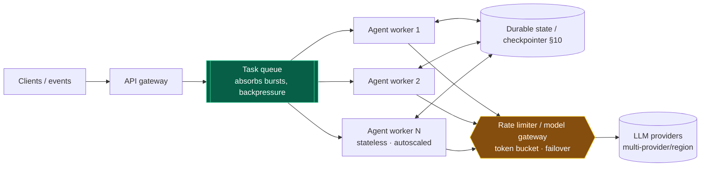
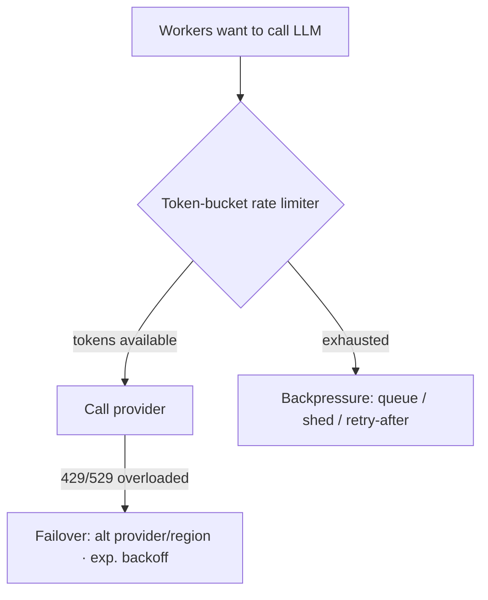
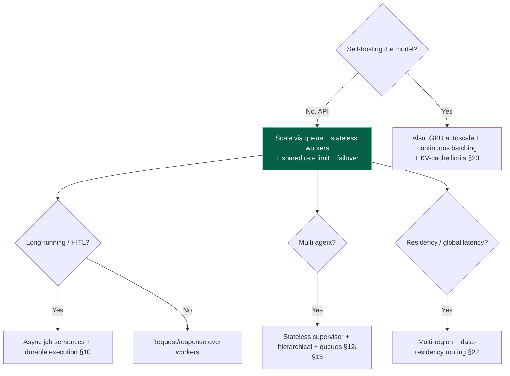

# 19 — Scalability

> By the end of this section you can scale agents whose per-task work is *variable*, stay within
> provider quotas under load, and find the bottlenecks (often the supervisor or the queue) in a
> multi-agent system.

**Prerequisites:** [§03](../03-Agent-Architecture/), [§10 Orchestration](../10-Orchestration/), [§18 Performance](../18-Performance-Optimization/).
**You will be able to:**
- Scale agents horizontally with stateless workers + durable state + queues.
- Apply rate limiting/backpressure to respect provider quotas without dropping work.
- Reason about multi-region and data-residency constraints.
- Provision against the *distribution* of per-task work (p95/p99), not the mean.

---

## 1. TL;DR

- **Agents scale like distributed systems with a twist: per-task work is *variable*** (an agent may take
  2 steps or 40). Provision against the **distribution** (p95/p99 steps), not a constant.
- **The core pattern: stateless workers + durable external state + a queue.** Processes are disposable;
  state lives in the checkpointer/DB ([§10](../10-Orchestration/)); a queue decouples intake from
  execution and absorbs bursts.
- **Your throughput ceiling is usually the provider's rate limit, not your CPUs.** LLM calls are the
  bottleneck — manage with **rate limiting (token bucket), backpressure, and multi-provider failover**.
- **Vertical scaling barely applies** (you're calling an API, not crunching locally) *unless you
  self-host inference* — then it's GPU memory, batching, and KV-cache limits.
- **Multi-region** is driven by latency *and* **data residency** ([§22](../22-Enterprise-Patterns/)) as
  much as availability.
- **In multi-agent systems, the supervisor and shared state are the bottlenecks/SPOFs** — make the
  supervisor stateless and fan out hierarchically ([§12](../12-Multi-Agent-Patterns/)).

---

## 2. Concepts at three altitudes

### 🟢 Beginner — the mental model

Scaling a normal web service: add servers behind a load balancer; each request is quick and similar. An
agent is different in two ways: one "request" can spawn *many* LLM calls over seconds-to-minutes (so a
server handles far fewer concurrent agents than concurrent web requests), and the slow part is an
*external* API with its own limits. So you (a) put incoming tasks in a **queue**, (b) run a pool of
**workers** that pull and process them, keeping their state in a **shared database** so any worker can
handle any task, and (c) carefully **rate-limit** your calls to the LLM provider so you don't get
throttled.

### 🟡 Intermediate — the scaling architecture



| Axis | What | Applies to agents? |
|---|---|---|
| **Vertical** (bigger box) | More CPU/RAM per instance | Rarely — you're I/O-bound on the API (matters for self-hosted inference) |
| **Horizontal** (more boxes) | More stateless workers | **Primary** lever |
| **Queue-based** | Decouple intake from processing | **Essential** — absorbs bursts, enables backpressure |
| **Distributed agents** | Workers across nodes/regions | For scale + residency + availability |
| **Clustering/sharding** | Partition work/state by key | Large multi-agent / multi-tenant |

**Concurrency control & quotas** — the agent-specific crux:



### 🔴 Expert — the trade-off surface

- **Provision on the distribution, not the mean.** If mean = 5 steps but p99 = 40, sizing for the mean
  starves the tail and blows latency SLOs. Size worker pools and timeouts against **p95/p99 step counts
  and durations**, and use **budgets** ([§03](../03-Agent-Architecture/)) to cap the tail so one runaway
  task can't hog a worker for minutes.
- **The bottleneck is the provider rate limit.** Model providers cap requests/tokens per minute. Naive
  scaling just converts "add workers" into "more 429s." You need a **central token-bucket** at the model
  gateway (shared across workers), **backpressure** (queue depth limits, shed or delay rather than hammer),
  **exponential backoff + jitter**, and **multi-provider/region failover** for both quota and availability
  ([§02 router](../02-LLM-Fundamentals/#7-code-production-grade-model-router)).
- **Stateless workers are non-negotiable for elasticity.** State in the process ties a task to a machine
  and breaks autoscaling and recovery. Externalize to a durable checkpointer ([§10](../10-Orchestration/))
  so workers scale to zero and back, and crashed tasks resume elsewhere.
- **Multi-agent scaling: mind the supervisor.** A central supervisor ([§12](../12-Multi-Agent-Patterns/))
  is a bottleneck and SPOF. Make it stateless over shared state, fan out **hierarchically**, and put
  inter-agent communication on **queues/event buses** ([§13](../13-Agent-Communication/)) so workers scale
  independently. Shared blackboard state needs partitioning to avoid write contention.
- **Self-hosted inference is a different game.** If you run the models, scaling means GPU autoscaling
  (slow, expensive), **continuous batching** (vLLM-style) to raise throughput, and **KV-cache memory** as
  the hard limit on concurrency × context length. This is a serious platform commitment ([§02](../02-LLM-Fundamentals/), [§20](../20-Deployment/)).
- **Long-running & async.** Agents that take minutes (or pause for HITL) don't fit request/response.
  Use async job semantics: submit → poll/callback, with durable execution so a worker restart doesn't
  lose the task ([§10](../10-Orchestration/), [§20](../20-Deployment/)).

> [!IMPORTANT]
> The mental shift from web-scale: **you are not CPU-bound, you are quota- and latency-bound on an
> external dependency, with highly variable per-task work.** Scaling = queue + stateless workers +
> rate-limited, failover-capable provider access + budgets on the tail.

---

## 3. Code: queue-based worker pool with shared rate limiting

```python
import asyncio

class TokenBucket:
    """Shared across workers (e.g., backed by Redis) so the FLEET respects the provider quota."""
    def __init__(self, rate_per_sec: float, burst: int):
        self.rate, self.capacity = rate_per_sec, burst
        self.tokens, self.ts = burst, now()
    async def acquire(self, cost: int = 1):
        while True:
            self._refill()
            if self.tokens >= cost:
                self.tokens -= cost; return
            await asyncio.sleep((cost - self.tokens) / self.rate)   # backpressure, not hammer

async def worker(queue, limiter: TokenBucket, state_store):
    while True:
        task = await queue.pull(visibility_timeout=300)      # at-least-once; handler must be idempotent
        if task is None:
            await asyncio.sleep(0.5); continue
        try:
            st = state_store.load(task.id) or new_state(task)  # stateless worker: state is EXTERNAL
            while not st.done and st.steps < st.budget_steps:   # tail control: hard budget
                await limiter.acquire(cost=estimate_tokens(st)) # respect provider quota
                st = await step_with_failover(st)               # provider/region failover on 429/529
                state_store.checkpoint(task.id, st)             # durable: survives worker crash
            await queue.ack(task)
        except TransientError:
            await queue.nack(task)                              # redelivered → idempotency matters (§13)

# Autoscale worker count on QUEUE DEPTH and provider headroom — not CPU.
def desired_workers(queue_depth: int, p95_task_seconds: float, slo_seconds: float) -> int:
    return min(max_workers, ceil(queue_depth * p95_task_seconds / slo_seconds))
```

> [!TIP]
> The fleet-wide essentials demos miss: a **shared** rate limiter (per-worker limiters still collectively
> exceed the provider quota), **idempotent** handlers (queues are at-least-once → redelivery), **external
> state + checkpointing** (so workers are disposable), **budgets** to cap the tail, and autoscaling on
> **queue depth**, not CPU.

---

## 4. Design patterns

| Pattern | What | When |
|---|---|---|
| **Queue + stateless workers** | Decouple intake; horizontal scale | Default for any real load |
| **Shared token bucket** | Fleet-wide provider-quota compliance | Always (multi-worker) |
| **Backpressure** | Bound queue depth; shed/delay over hammer | Bursty load |
| **Multi-provider/region failover** | Reroute on quota/outage | Availability + quota headroom |
| **Budgets on the tail** | Cap steps/tokens/time per task | Control p99, protect workers ([§03](../03-Agent-Architecture/)) |
| **Hierarchical fan-out** | Avoid single-supervisor bottleneck | Large multi-agent ([§12](../12-Multi-Agent-Patterns/)) |
| **Sharding/partitioning** | Split state/work by tenant/key | Multi-tenant scale, reduce contention |
| **Async job semantics** | Submit→poll/callback for long tasks | Long-running / HITL agents ([§10](../10-Orchestration/)) |

---

## 5. Anti-patterns ❌ → ✅

| ❌ Anti-pattern | Why it bites | ✅ Instead |
|---|---|---|
| Per-worker rate limiters | Fleet collectively exceeds quota → 429 storms | Shared/global token bucket |
| State in the worker process | Can't autoscale; lost on crash | External durable state; stateless workers |
| Scale on CPU utilization | CPU is idle (I/O-bound); wrong signal | Scale on queue depth + provider headroom |
| Size for the mean step count | Tail starves; SLO breaches | Provision on p95/p99 + budgets |
| Add workers to fix throttling | More workers = more throttling | Rate limit + backpressure + failover |
| Single supervisor for many agents | Bottleneck + SPOF | Stateless supervisor; hierarchical fan-out |
| Sync request/response for minute-long agents | Timeouts; tied-up connections | Async submit→poll/callback |
| Unbounded fan-out / queue growth | Cost & memory explosion | Backpressure; in-flight caps ([§13](../13-Agent-Communication/)) |

---

## 6. Common failures & troubleshooting

| Symptom | Root cause | Detection | Resolution |
|---|---|---|---|
| Throttled (429/529) under load | Exceeding provider quota | Provider error rate | Shared rate limit; backpressure; failover; request quota increase |
| Tasks lost on deploy/crash | In-process state | Incident on restart | External checkpointer; resume ([§10](../10-Orchestration/)) |
| Latency SLO breached at peak | Sized for mean; tail starves | p95/p99 vs. mean | Provision on distribution; budgets; autoscale on queue depth |
| Duplicate processing | At-least-once queue + non-idempotent handler | Downstream dupes | Idempotency keys ([§05](../05-Tools-and-Function-Calling/), [§13](../13-Agent-Communication/)) |
| Multi-agent system stalls at scale | Supervisor bottleneck / shared-state contention | Supervisor latency; lock waits | Stateless supervisor; hierarchical; partition state |
| Queue grows unbounded | No backpressure; producers > consumers | Queue depth trend | Backpressure; shed load; scale consumers; cap fan-out |
| Self-hosted OOM at high concurrency | KV-cache memory exhausted | GPU memory metrics | Limit concurrency×context; batching; more GPUs ([§20](../20-Deployment/)) |

---

## 7. The four implication lenses

- **Performance:** scalability and per-request latency interact — caching/right-sizing ([§18](../18-Performance-Optimization/))
  raise throughput too; budgets cap the tail that wrecks p99.
- **Security:** multi-tenant scale demands isolation (state, cache, rate limits per tenant) to prevent
  cross-tenant bleed and noisy-neighbor abuse ([§14](../14-Agent-Security/), [§22](../22-Enterprise-Patterns/)).
- **Scalability:** *this is the lens.*
- **Cost:** scaling multiplies token spend; per-tenant budgets, quotas, and attribution keep growth
  economic ([§21](../21-Cost-Optimization/)).

---

## 8. Decision framework



---

## 9. Enterprise recommendations

- **Standard scaling substrate:** queue + stateless workers + durable state + a **central model gateway**
  doing shared rate limiting, failover, and quota management ([§22](../22-Enterprise-Patterns/)).
- **Provision and alert on the distribution** (p95/p99 steps/latency); enforce per-task **budgets** to
  cap the tail ([§03](../03-Agent-Architecture/)).
- **Multi-provider/multi-region** for availability, quota headroom, and **data residency**; route by
  policy.
- **Per-tenant isolation & quotas** (rate, concurrency, cost) to prevent noisy-neighbor and contain blast
  radius.
- **Capacity planning around provider quotas** — negotiate limits, design failover, and treat quota as a
  first-class dependency.

---

## 10. Interview-level questions

<details>
<summary><b>Q1.</b> How is scaling an agent different from scaling a stateless web service?</summary>

Two big differences. **Variable, long per-task work:** one agent task can be many LLM calls over
seconds-to-minutes, so a host handles far fewer concurrent agents than web requests, and you must
provision against the **distribution** (p95/p99 steps), not the mean, with **budgets** to cap the tail.
**The bottleneck is an external dependency with quotas:** you're I/O-bound on the LLM provider's rate
limits, not CPU-bound — so adding workers without a **shared rate limiter + backpressure + failover** just
produces 429 storms. The architecture is queue + stateless workers + durable external state + rate-limited,
failover-capable provider access — and you autoscale on **queue depth**, not CPU.
</details>

<details>
<summary><b>Q2.</b> Why must workers be stateless, and where does the state go?</summary>

Stateless workers can be added/removed freely (elastic autoscaling), and a crash or redeploy doesn't lose
work — any worker resumes any task. State goes to a **durable external store / checkpointer**
([§10](../10-Orchestration/)): the task trajectory, the agent's working state, and orchestration
checkpoints. Process-local state ties a task to one machine, breaks autoscaling, and loses everything on
restart. Combined with an at-least-once queue, statelessness also requires **idempotent** handling so
redelivered tasks don't double-execute side effects ([§05](../05-Tools-and-Function-Calling/)).
</details>

<details>
<summary><b>Q3.</b> Your multi-agent system scales fine to 10 concurrent tasks but collapses at 100. What
do you investigate?</summary>

Likely the **supervisor** is a bottleneck/SPOF and/or **shared state contention**. Check supervisor
latency and lock-wait metrics. Fixes: make the supervisor **stateless over external state** so you can run
many; fan out **hierarchically** so no single coordinator handles all workers; move inter-agent comms onto
**queues/event buses** ([§13](../13-Agent-Communication/)) so workers scale independently; and **partition
shared state** (e.g., per task/tenant) to remove write contention. Also verify you're not hitting the
**provider rate limit** at 100× and that **budgets** cap runaway tasks from monopolizing workers. The
collapse point usually reveals a centralization you can decentralize ([§12](../12-Multi-Agent-Patterns/)).
</details>

---

### Sources
- Distributed-systems scaling: queues, stateless workers, backpressure, token-bucket rate limiting — standard practice. `[Established]`
- Provider rate-limit handling (429/529, backoff, failover) — vendor docs. `[Established]`
- Self-hosted inference scaling: vLLM (continuous batching), KV-cache memory constraints. `[Established]`
- Durable execution for long-running/async agents: [§10](../10-Orchestration/). `[Established]`

> Next: [§20 — Deployment](../20-Deployment/) — where these workers actually run.
