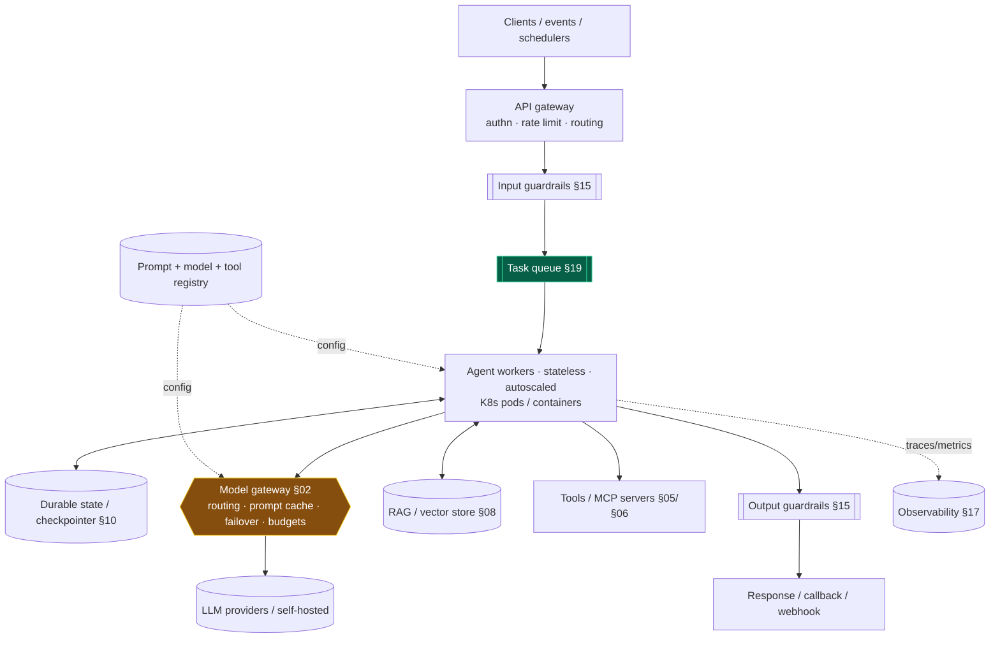
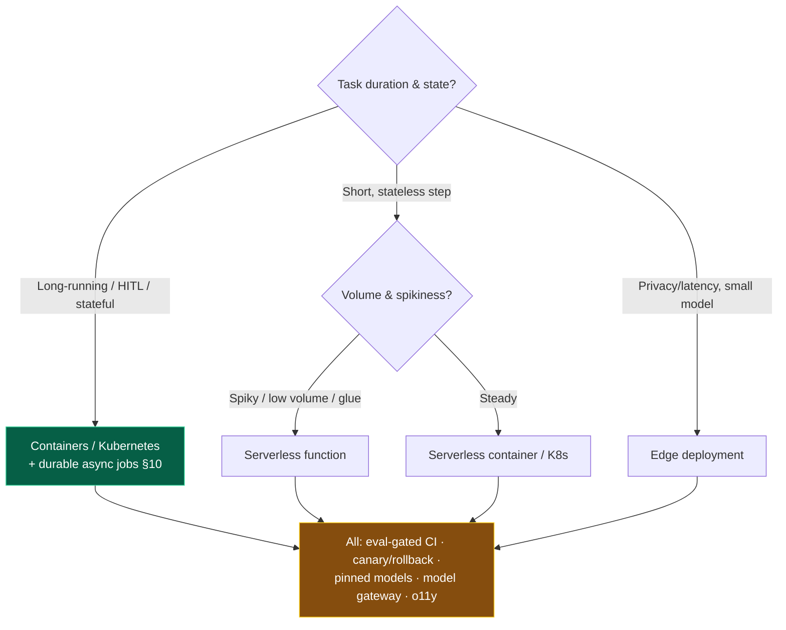

# 20 — Deployment

> By the end of this section you can pick a deployment target for long-running, bursty, stateful agents,
> lay out a production topology end-to-end, and roll out model/prompt changes safely for a
> non-deterministic system.

**Prerequisites:** [§03](../03-Agent-Architecture/), [§19 Scalability](../19-Scalability/), [§16 Evaluation](../16-Evaluation/), [§17 Observability](../17-Observability/).
**You will be able to:**
- Choose between serverless, Kubernetes, VMs, and edge for agent workloads.
- Draw a production agent deployment topology and justify each component.
- Implement eval-gated, canary/shadow rollouts with model-version pinning and rollback.
- Manage prompts, config, and secrets as governed artifacts.

---

## 1. TL;DR

- **The deployment tension is long-running + stateful + bursty vs. typical infra assumptions.** Agents
  can run minutes, pause for humans, and spike — which breaks naive serverless and request/response.
- **Reference topology:** gateway → queue → **stateless agent workers** → durable state + **model
  gateway** + observability + guardrails. (This is [§19](../19-Scalability/)'s scaling shape, deployed.)
- **Target choice:** **Kubernetes/containers** for long-running stateful workers; **serverless** only for
  short, stateless steps (mind timeouts) or as glue; **VMs** for simplicity/self-host; **edge** for
  privacy/latency with small models.
- **A model or prompt change is a deploy** — gate it behind your eval suite, roll out via **canary/shadow**,
  **pin model versions**, and keep **rollback** one switch away. Model upgrades can silently regress *your*
  task even when "better" overall ([§02](../02-LLM-Fundamentals/)).
- **Prompts, model config, and tool/MCP registries are versioned artifacts** in a registry, not strings
  edited in prod.
- **Long-running/HITL agents need durable execution** ([§10](../10-Orchestration/)) and async job
  semantics — not a synchronous HTTP handler.

---

## 2. Concepts at three altitudes

### 🟢 Beginner — the mental model

Deploying an agent isn't like deploying a stateless API where each request finishes in milliseconds. An
agent task can take a while, hold state, and even *pause* waiting for a human to approve something. So you
typically don't make the user "hold the line" — you accept the task, put it on a **queue**, let
background **workers** chew on it (saving progress so nothing is lost if a worker restarts), and notify
when done. And because the "code" includes a probabilistic model, you roll out changes carefully: test on
a slice first, keep the old version ready, and never let an unreviewed model upgrade hit everyone at once.

### 🟡 Intermediate — the reference topology



**Deployment targets compared:**

| Target | Fit for agents | Watch-outs |
|---|---|---|
| **Local / dev** | Prototyping, stdio MCP ([§06](../06-MCP/)) | Not production; no scale/resilience |
| **VM / container on a VM** | Simple long-running workers | Manual scaling/ops |
| **Kubernetes** | **Long-running stateful workers, autoscaling, multi-agent** | Operational complexity; right-size HPA on queue depth ([§19](../19-Scalability/)) |
| **Serverless (functions)** | Short, stateless steps; event glue; spiky low-volume | **Execution timeouts** kill long agents; cold starts; statelessness |
| **Serverless containers** (Cloud Run/Fargate) | Middle ground: scale-to-zero + longer runtimes | Per-request timeout caps; check max duration |
| **Edge** | Privacy/latency with small/local models | Tiny models; limited tools; sync constraints |

> [!WARNING]
> The classic mistake: deploying a multi-minute or HITL agent on a **request/response serverless
> function** and hitting the execution-time limit mid-task. For long-running agents use **durable
> execution + async jobs** ([§10](../10-Orchestration/)) on containers/K8s (or a durable-workflow service),
> reserving serverless for short, bounded steps.

### 🔴 Expert — the trade-off surface

- **Release strategy for probabilistic systems is the differentiator.** You can't unit-test your way to
  confidence. The pipeline is: **eval gate in CI** ([§16](../16-Evaluation/)) → **shadow** (run new
  version in parallel, compare, no user impact) → **canary** (small % of live traffic, watch metrics) →
  progressive rollout → **instant rollback**. Every prompt, model, tool, and guardrail change goes through
  it.
- **Pin model versions; treat auto-upgrades as risk.** Providers update models; a "better" model can
  regress *your* specific task or change output formats. **Pin** explicit versions, qualify upgrades on
  your eval set, and roll them out as canaries — never let a silent upstream change hit prod.
- **Separate the deploy of code, prompts, and models.** They change on different cadences. Prompts and
  model selection live in a **registry/config** (versioned, eval-gated, rolled out independently of code)
  so a prompt tweak isn't a full code deploy and a model swap is a config change behind the gateway
  ([§02](../02-LLM-Fundamentals/)).
- **Stateful but disposable.** Workers hold no durable state (it's externalized, [§10](../10-Orchestration/))
  so they're rolling-upgrade-safe and autoscale cleanly — but in-flight tasks must **resume** across pod
  restarts via checkpoints.
- **Secrets and egress.** Provider keys and tool credentials go in a secret manager (never in
  prompts/images/logs, [§14](../14-Agent-Security/)); workers run with **egress controls** so a hijacked
  agent can't phone home.
- **Self-hosted inference is its own deployment.** GPU node pools, model servers (vLLM/TGI), autoscaling
  latency, and KV-cache memory limits ([§19](../19-Scalability/)) — a distinct, heavier operational track.

> [!IMPORTANT]
> The deployment unit of thought is **"what changes, how often, and how do I roll it back?"** Code,
> prompts, models, tools, and guardrails are *five independently-versioned, independently-rollback-able*
> things — each eval-gated. Conflating them into one deploy is how a "small prompt fix" takes down prod
> with no fast undo.

---

## 3. Code: an eval-gated, canary deployment flow (sketch)

```python
# CI: block the release if evals regress vs. the committed baseline (§16).
def ci_release_gate(candidate) -> bool:
    return ci_gate(EVAL_SET, candidate.agent, JUDGE, baseline=load_baseline())

# Progressive rollout controlled by config (no code deploy to change %).
class Rollout(BaseModel):
    version: str
    model: str                      # PINNED model version, not "latest"
    canary_pct: float               # 0..100 of traffic to the candidate

def route_request(req, rollout: Rollout, stable: Rollout) -> Rollout:
    # Deterministic bucketing by a stable key so a user sticks to one version.
    return rollout if bucket(req.user_id) < rollout.canary_pct else stable

def on_canary_metrics(metrics):
    # Auto-rollback if the canary regresses on quality/cost/latency/error (§17).
    if metrics.error_rate > THRESHOLD or metrics.quality < baseline_quality():
        set_canary_pct(0)           # instant rollback: flip traffic back to stable
        alert("canary rolled back", metrics)
    elif metrics.healthy_for(duration="2h"):
        bump_canary_pct()           # progressive promotion
```

> [!TIP]
> The non-negotiables: **pin the model version** (never `*-latest` in prod), **shadow/canary** before
> full rollout, **auto-rollback on metric regression**, and drive rollout % from **config** so promoting
> or rolling back is a flag flip, not a redeploy. Prompts/models live in a registry so they roll out
> independently of code.

---

## 4. Design patterns

| Pattern | What | When |
|---|---|---|
| **Gateway → queue → stateless workers** | The reference agent topology | Production default ([§19](../19-Scalability/)) |
| **Model gateway** | Central routing/caching/failover/budgets/pinning | Always ([§02](../02-LLM-Fundamentals/)) |
| **Eval-gated CI** | Block deploys on eval regression | Every prompt/model/tool change ([§16](../16-Evaluation/)) |
| **Shadow + canary + rollback** | De-risk probabilistic changes | All releases |
| **Config-driven rollout** | %/version in config, not code | Fast promote/rollback |
| **Prompt/model/tool registry** | Versioned artifacts | Governance, independent rollout |
| **Durable async jobs** | Submit→poll/callback + checkpoints | Long-running / HITL agents ([§10](../10-Orchestration/)) |
| **Secret manager + egress control** | Keys out of code; bounded network | Security baseline ([§14](../14-Agent-Security/)) |

---

## 5. Anti-patterns ❌ → ✅

| ❌ Anti-pattern | Why it bites | ✅ Instead |
|---|---|---|
| Long agent on a request/response serverless fn | Hits execution timeout mid-task | Durable async jobs on containers/K8s |
| `model="...-latest"` in prod | Silent upstream regressions | Pin versions; qualify upgrades via eval+canary |
| Prompt/model change = full code deploy | Slow, risky, no independent rollback | Registry + config-driven rollout |
| Ship model change without eval gate | Silent quality regression | Eval-gated CI + canary |
| No rollback path | Stuck with a bad release | Config flip to stable; keep N-1 ready |
| Secrets in image/prompt/logs | Credential exposure | Secret manager; redaction ([§14](../14-Agent-Security/)) |
| State in the worker | Lost on rolling upgrade | Externalize + checkpoint ([§10](../10-Orchestration/)) |
| Big-bang rollout to 100% | Blast radius of a bad change | Shadow → canary → progressive |

---

## 6. Common failures & troubleshooting

| Symptom | Root cause | Detection | Resolution |
|---|---|---|---|
| Agent times out mid-task | Serverless duration limit | Truncated runs at the cap | Async durable jobs; containers/K8s |
| Quality dropped after no code change | Provider auto-upgraded the model | Eval/online metric dip ([§16](../16-Evaluation/)) | Pin versions; re-qualify; rollback |
| Can't roll back fast | Coupled code/prompt/model deploy | Slow incident recovery | Config-driven rollout; registry; keep N-1 |
| In-flight tasks lost on deploy | Worker state not externalized | Tasks vanish on rollout | Checkpointer + resume ([§10](../10-Orchestration/)) |
| Cold-start latency spikes | Serverless cold starts | TTFT outliers | Min instances / containers; warmers |
| Secret leaked | Key in image/log | Secret scan | Secret manager; rotate; redact |
| Canary looked fine, full rollout broke | Canary slice unrepresentative | Post-rollout regression | Larger/representative canary; shadow first |

---

## 7. The four implication lenses

- **Performance:** topology choices affect latency (cold starts, hops); the model gateway centralizes
  prompt caching ([§18](../18-Performance-Optimization/)).
- **Security:** deployment is where secrets, egress control, network policy, and tenant isolation are
  enforced ([§14](../14-Agent-Security/), [§22](../22-Enterprise-Patterns/)).
- **Scalability:** this section deploys [§19](../19-Scalability/)'s scaling architecture; K8s HPA on queue
  depth, not CPU.
- **Cost:** the model gateway enforces budgets and caching at deploy; right-size compute and scale-to-zero
  where possible ([§21](../21-Cost-Optimization/)).

---

## 8. Decision framework — pick the target



---

## 9. Enterprise recommendations

- **Standard deployment substrate** (gateway → queue → stateless workers → durable state → model gateway
  → guardrails → o11y) offered as a paved road so teams inherit safe defaults ([§22](../22-Enterprise-Patterns/)).
- **Everything eval-gated and canaried;** **pin model versions** and qualify upgrades — a model change is
  a governed deploy ([§02](../02-LLM-Fundamentals/), [§16](../16-Evaluation/)).
- **Registry for prompts/models/tools** with versioning, approvals, and independent rollout/rollback.
- **Secrets in a manager; egress controls; network policy; tenant isolation** as deployment-time
  guarantees ([§14](../14-Agent-Security/)).
- **Durable async** for long-running/HITL agents; never rely on synchronous handlers for multi-minute work.

---

## 10. Interview-level questions

<details>
<summary><b>Q1.</b> Why can't you just deploy an agent as a standard serverless HTTP function?</summary>

Because agents are often **long-running** (many LLM calls over seconds-to-minutes), can **pause for human
approval**, and are **stateful** — which collides with serverless **execution-time limits**, statelessness,
and cold starts. A multi-minute agent will hit the function timeout mid-task. The right shape is **accept
→ queue → background stateless workers** with **durable execution/checkpointing** ([§10](../10-Orchestration/))
and **async** completion (poll/callback/webhook). Serverless is fine for **short, bounded steps** or event
glue, but the long-running agent body belongs on containers/K8s or a durable-workflow service
([§19](../19-Scalability/)).
</details>

<details>
<summary><b>Q2.</b> How do you safely roll out a model upgrade?</summary>

Treat it as a **governed deploy, not a config typo**. (1) **Pin** explicit model versions — never
`*-latest`. (2) Run the candidate through the **eval gate** in CI against the committed baseline
([§16](../16-Evaluation/)) — model upgrades can regress *your* task or change output format even when
"better" overall. (3) **Shadow** it (run in parallel, compare, no user impact), then **canary** (small %
of live traffic) while watching quality/cost/latency/error metrics ([§17](../17-Observability/)). (4)
Progressively promote with **auto-rollback** on regression, driven by **config** so rollback is a flag
flip. Keeping model selection in the **gateway/registry** makes the whole thing a config change, not a
code redeploy.
</details>

<details>
<summary><b>Q3.</b> What do you keep in a registry vs. deploy with code, and why?</summary>

**Prompts, model selection/versions, tool/MCP definitions, and guardrail policies** belong in versioned
**registries/config**, separate from application code. They change on different cadences (a prompt tweak
shouldn't require a code deploy; a model swap should be a gateway config change), need **independent
rollout/rollback** and approvals, and benefit from being **eval-gated** individually. Coupling them into
the code deploy makes every small change a full release with one shared rollback — so a minor prompt fix
risks the whole app and can't be reverted independently. Separation gives you fine-grained, fast,
auditable control over the parts of an agent that change most ([§02](../02-LLM-Fundamentals/), [§04](../04-System-Prompts/)).
</details>

---

### Sources
- Reference agent topology synthesizes [§19](../19-Scalability/) + [§10](../10-Orchestration/) + [§17](../17-Observability/). `[Established practice]`
- Progressive delivery (shadow/canary/rollback), version pinning — standard release engineering applied to LLMs. `[Established]`
- Serverless duration limits & durable execution for long-running work — cloud + Temporal docs. `[Established]`
- Self-hosted inference serving (vLLM/TGI) — see [§19](../19-Scalability/). `[Established]`

> Next: [§21 — Cost Optimization](../21-Cost-Optimization/) — keeping all this economical.
