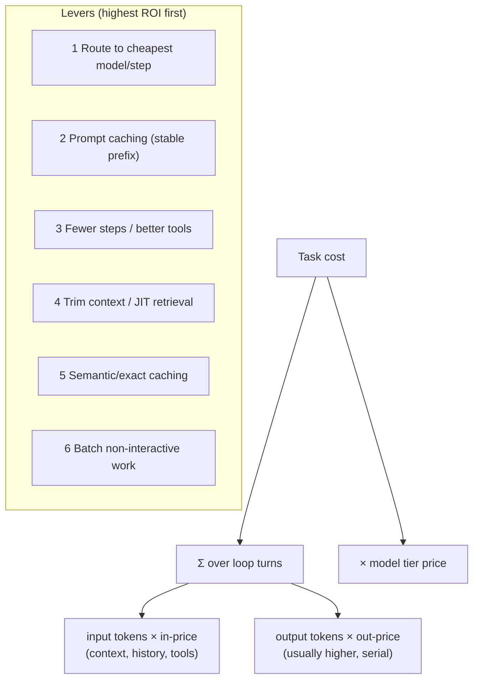
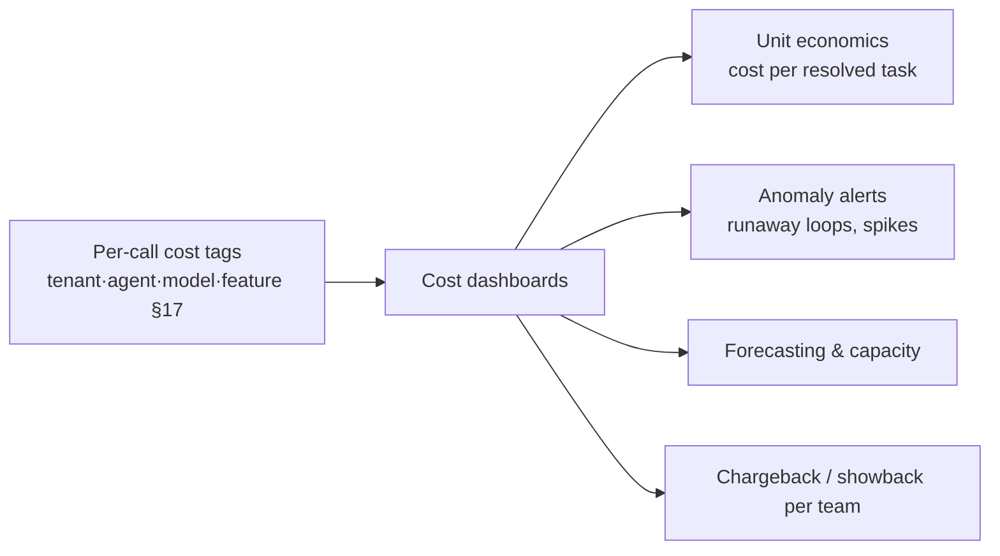
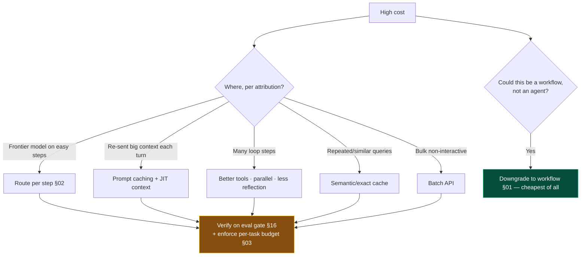

# 21 — Cost Optimization

> By the end of this section you can find where an agent's spend actually goes, apply the highest-leverage
> cuts (routing, caching, fewer steps), enforce budgets that prevent runaways, and build per-task unit
> economics.

**Prerequisites:** [§02 LLM Fundamentals](../02-LLM-Fundamentals/) (token economics), [§17 Observability](../17-Observability/), [§18 Performance](../18-Performance-Optimization/).
**You will be able to:**
- Decompose agent cost and target the biggest line item.
- Apply model routing, prompt/semantic caching, and context control with known ROI.
- Enforce per-task/per-tenant budgets and circuit breakers.
- Build FinOps: attribution, unit economics, forecasting, chargeback.

---

## 1. TL;DR

- **Cost ≈ Σ over loop turns of (input tokens × in-price + output tokens × out-price), per model tier.**
  The biggest agent multipliers are **step count** and **context size per turn**, not the per-token price.
- **Output tokens usually cost more than input** and are generated serially — verbosity is a real cost
  lever, not just style ([§02](../02-LLM-Fundamentals/)).
- **The top cuts, in order:** (1) **route to the cheapest model per step** that passes eval; (2) **prompt
  caching** for the stable prefix; (3) **fewer steps / better tools**; (4) **trim context / JIT
  retrieval**; (5) **semantic/exact caching**; (6) **batch** non-interactive work.
- **The cheapest agent is the workflow you didn't make an agent** ([§01](../01-Introduction/)); the
  second cheapest has **tight budgets + caching + right-sized models**.
- **Budgets and circuit breakers are mandatory** — unbounded loops are the #1 cost-runaway. Cap
  steps/tokens/\$ per task with a fail-stop ([§03](../03-Agent-Architecture/)).
- **FinOps for agents:** attribute cost per tenant/agent/feature ([§17](../17-Observability/)), compute
  **cost-per-resolved-task** (the real unit economic), forecast, and alert on anomalies.

---

## 2. Concepts at three altitudes

### 🟢 Beginner — the mental model

You pay per **token** — both what you send (input) and what the model writes back (output), with output
usually pricier. An agent *loops*, re-sending its context each turn, so a single "task" can cost many
calls' worth of tokens. The ways to spend less are intuitive: use a cheaper model when the step is easy,
don't re-send the same big preamble uncached, don't make the model write more than needed, take fewer
steps, and don't run an expensive agent when a simple script would do.

### 🟡 Intermediate — the cost anatomy & levers



| Lever | Mechanism | Typical impact | Section |
|---|---|---|---|
| **Model routing/tiering** | Cheap model for easy steps, reasoning model only for hard | Often the **biggest** single cut (5–20× on routed steps) | [§02](../02-LLM-Fundamentals/#7-code-production-grade-model-router) |
| **Prompt caching** | Reuse KV of stable prefix; cached input billed much less | Large on multi-turn agents (re-sent preamble) | [§18](../18-Performance-Optimization/) |
| **Fewer steps** | Better tools, parallelism, less reflection | Cuts the loop multiplier | [§05](../05-Tools-and-Function-Calling/), [§09](../09-Planning/) |
| **Context control** | JIT retrieval, summarize, trim history | Lowers per-turn input cost | [§07](../07-Memory/), [§08](../08-RAG/) |
| **Semantic/exact cache** | Skip calls for repeated/similar queries | High on repetitive workloads | [§18](../18-Performance-Optimization/) |
| **Batch API** | Async bulk at a discount | Big for non-interactive jobs | vendor batch APIs |
| **Concise outputs** | Lower `max_tokens`, terse formats | Cuts the pricier output side | [§04](../04-System-Prompts/) |

### 🔴 Expert — the trade-off surface

- **Routing is the highest-leverage lever, applied *per step* not per task.** A single agent legitimately
  uses a cheap model to classify/route/extract, a mid model for most work, and a reasoning model only for
  the genuinely hard step. Most overspend is a frontier model doing trivial work ([§02](../02-LLM-Fundamentals/)).
- **Prompt caching ROI is structural.** Because agents re-send a big stable preamble every loop turn, the
  cached portion is billed at a steep discount and skips re-prefill. Designing prompts as **stable prefix
  + dynamic suffix** ([§04](../04-System-Prompts/)) is simultaneously a cost and latency win — measure
  hit rate and protect it (dynamic data in the prefix silently kills it).
- **Context is a recurring cost, paid every turn.** A bloated context isn't a one-time cost — it's
  multiplied across every loop iteration. JIT retrieval and summarization ([§07](../07-Memory/)) cut the
  *recurring* bill, not just one call.
- **Budgets convert tail risk into a known cap.** Without per-task budgets, a single looping or
  adversarial task can cost 100× the norm. Hard caps on steps/tokens/\$ + a circuit breaker make the
  worst case bounded and turn cost from a tail risk into a line item ([§03](../03-Agent-Architecture/)).
- **The real unit economic is cost-per-*resolved*-task**, not cost-per-call. An agent that's cheap per
  call but fails and retries (or escalates to a human) may be expensive per *outcome*. Optimize the
  outcome economics, which sometimes means spending *more* per call (better model/verifier) to resolve
  more tasks autonomously.
- **Don't pursue savings that drop quality** — every cut goes through the eval gate ([§16](../16-Evaluation/)).
  A cheaper model that fails more tasks can raise total cost (retries + human handoff).

> [!IMPORTANT]
> Cost optimization is **performance optimization's twin** ([§18](../18-Performance-Optimization/)): fewer
> tokens, smaller models, fewer steps, more caching all cut *both* latency and dollars. Optimize once,
> win twice — and gate on quality so you don't trade away the thing you're paying for.

---

## 3. Code: budget enforcement + cost attribution

```python
class CostBudget(BaseModel):
    max_usd: float
    max_steps: int
    spent_usd: float = 0.0
    steps: int = 0

# Prices come from the model gateway config (they change — never hardcode in app logic §02).
def step_cost(usage, model, prices) -> float:
    p = prices[model]
    cached = getattr(usage, "cached_input", 0)
    return ((usage.input - cached) * p.input + cached * p.cached_input + usage.output * p.output) / 1e6

def guarded_step(state, agent, budget: CostBudget, prices, tenant: str) -> "State":
    if budget.spent_usd >= budget.max_usd or budget.steps >= budget.max_steps:
        raise BudgetExceeded(f"task cap hit: ${budget.spent_usd:.2f}/{budget.steps} steps")  # circuit breaker → fail-stop (§03)
    resp = agent.step(state)
    cost = step_cost(resp.usage, resp.model, prices)
    budget.spent_usd += cost; budget.steps += 1
    emit_cost(tenant=tenant, agent=agent.name, model=resp.model, usd=cost)   # attribution → FinOps (§17)
    return agent.apply(state, resp)

# Unit economics: the metric that actually matters.
def cost_per_resolved_task(total_usd: float, resolved: int, escalated_to_human: int,
                           human_cost_per_task: float) -> float:
    return (total_usd + escalated_to_human * human_cost_per_task) / max(resolved, 1)
    # A "cheaper" model that escalates more can raise THIS number — optimize the outcome, not the call.
```

> [!TIP]
> Three things make this real: a **per-task circuit breaker** (bounds the worst case), **cost attribution
> tags** (tenant/agent/model → FinOps + anomaly alerts), and measuring **cost-per-resolved-task** including
> human-escalation cost — the number that tells you whether a cheaper model is actually cheaper. Prices live
> in gateway config, never hardcoded (they change).

---

## 4. FinOps for agents



- **Attribution** ([§17](../17-Observability/)): every call tagged by tenant/agent/model/feature — you
  can't cut what you can't see.
- **Unit economics:** cost-per-resolved-task (incl. retries + human escalation) is the product-level
  number; per-token price is an input to it.
- **Anomaly alerts:** per-task token/cost spikes catch runaway loops *early*, not on the invoice.
- **Forecasting & quotas:** project spend from traffic; set per-tenant **quotas/budgets** to bound it.
- **Chargeback/showback:** attribute spend to teams/products to drive accountability ([§22](../22-Enterprise-Patterns/)).

---

## 5. Design patterns

| Pattern | What | When |
|---|---|---|
| **Per-step model routing** | Cheapest model that passes eval, per step | Always — biggest lever |
| **Stable-prefix prompt caching** | Cache the big static preamble | Every multi-turn agent |
| **Per-task budget + circuit breaker** | Hard \$/step/token cap + fail-stop | Always |
| **Per-tenant quota** | Bound spend per customer | Multi-tenant |
| **JIT context** | Retrieve/summarize instead of accumulate | Long tasks ([§07](../07-Memory/), [§08](../08-RAG/)) |
| **Semantic/exact cache** | Skip repeated/similar calls | Repetitive workloads |
| **Batch API** | Bulk async at a discount | Non-interactive jobs |
| **Cost-per-resolved-task tracking** | Outcome unit economics | Product decisions |

---

## 6. Anti-patterns ❌ → ✅

| ❌ Anti-pattern | Why it bites | ✅ Instead |
|---|---|---|
| One frontier model for everything | 5–20× overspend on easy steps | Route per step |
| No prompt caching | Re-prefill the big preamble every turn | Stable prefix + caching |
| Unbounded loops | Single task can cost 100× | Budgets + circuit breaker ([§03](../03-Agent-Architecture/)) |
| Optimize per-token price only | Misses step-count & context multipliers | Optimize tokens × steps × tier |
| Cheapest model regardless of quality | More failures/retries/escalations → higher *outcome* cost | Cost-per-resolved-task; eval gate |
| No cost attribution | Can't find or cut spend; can't bill | Tag per tenant/agent/feature ([§17](../17-Observability/)) |
| Verbose outputs/formats | Output is the pricier side | Concise prompts; cap `max_tokens` |
| Interactive calls for bulk jobs | Miss batch discounts | Batch API for non-interactive |

---

## 7. Common failures & troubleshooting

| Symptom | Root cause | Detection | Resolution |
|---|---|---|---|
| Bill 10× forecast | Unbounded loops; no caching; frontier-everywhere | Cost-by-agent dashboard ([§17](../17-Observability/)) | Budgets; routing; caching |
| Spend grew, no feature change | Provider price/model change; cache regressed | Cost trend + cache-hit metric | Verify pinned model; restore prefix stability |
| Cheaper model, higher total cost | More retries/escalations | Cost-per-resolved-task | Right-size to outcome; re-add capability |
| Can't tell where spend goes | No attribution | — | Tag per tenant/agent/model/feature |
| One tenant dominates cost | No quotas | Per-tenant cost | Per-tenant budgets/quotas; chargeback |
| Runaway caught on invoice | No per-task alerts | Monthly surprise | Per-task token/cost anomaly alerts |

---

## 8. The four implication lenses

- **Performance:** the same levers (routing, caching, fewer tokens/steps) cut latency too — optimize once,
  win twice ([§18](../18-Performance-Optimization/)).
- **Security:** budgets/quotas also cap **cost-based DoS** (an attacker driving expensive loops); attribution
  aids abuse detection ([§14](../14-Agent-Security/)).
- **Scalability:** cost scales with traffic × steps × tier; quotas and budgets keep growth economic
  ([§19](../19-Scalability/)).
- **Cost:** *this is the lens.* Gate every cut on quality ([§16](../16-Evaluation/)).

---

## 9. Decision framework



---

## 10. Enterprise recommendations

- **Model gateway enforces cost controls centrally:** routing, prompt caching, per-task/tenant budgets,
  pinned models, and attribution — not per-team reinvention ([§02](../02-LLM-Fundamentals/), [§22](../22-Enterprise-Patterns/)).
- **Budgets + circuit breakers mandatory** on every agent; per-tenant quotas for multi-tenant products.
- **FinOps practice:** cost attribution, cost-per-resolved-task dashboards, anomaly alerts, forecasting,
  and chargeback/showback ([§17](../17-Observability/)).
- **Every cost optimization is eval-gated** — never trade quality blindly ([§16](../16-Evaluation/)).
- **Prefer the workflow** where autonomy isn't needed — the cheapest agent is the one you didn't build
  ([§01](../01-Introduction/)).

---

## 11. Interview-level questions

<details>
<summary><b>Q1.</b> Your agent's cost is 10× forecast. Walk me through cutting it.</summary>

First **attribute** ([§17](../17-Observability/)): cost by agent/model/step/tenant tells you *where*. Then
apply levers in ROI order: **route per step** (frontier model on trivial steps is the usual culprit —
5–20× cut), enable **prompt caching** on the stable prefix (agents re-send a big preamble every turn),
reduce **step count** (better tools, parallelism, less reflection), **trim/JIT the context** (it's billed
every turn), add **semantic/exact caching** for repeats, and **batch** non-interactive work. Install
**per-task budgets + a circuit breaker** to bound runaway loops (often the spike source). Validate each
change on the **eval gate** — a cheaper model that fails more can raise *cost-per-resolved-task*. And ask
the meta-question: does this even need to be an agent, or would a **workflow** be cheaper ([§01](../01-Introduction/))?
</details>

<details>
<summary><b>Q2.</b> Why is "cost per resolved task" a better metric than "cost per API call"?</summary>

Because it captures the **outcome economics**, which is what the business pays for. An agent can be cheap
per call yet expensive per *resolution* if it fails, retries, and escalates to a human — the human handoff
often dwarfs token cost. Conversely, spending *more* per call (a better model or a verifier) can lower
cost-per-resolved-task by resolving more tasks autonomously. Optimizing per-call cost in isolation can
**increase** total cost by pushing failures downstream. So you measure (token cost + escalation cost) /
resolved tasks and optimize *that*, gating on quality ([§16](../16-Evaluation/)).
</details>

<details>
<summary><b>Q3.</b> How do prompt caching and model routing each save money, and which first?</summary>

**Model routing** sends each *step* to the cheapest model that passes eval — a cheap model classifies/
routes/extracts, a reasoning model handles only the hard step; this is usually the **biggest** cut because
frontier-everywhere is the common waste. **Prompt caching** reuses the KV state of the agent's large,
stable prefix (system prompt, tools, context) that's re-sent every loop turn, billing it at a steep
discount and skipping re-prefill — structurally large for multi-turn agents. Do **routing first** (biggest
lever, low effort), then **caching** (requires stable-prefix prompt design, [§04](../04-System-Prompts/)) —
and protect the cache hit rate (dynamic data in the prefix silently kills it). Both are also latency wins
([§18](../18-Performance-Optimization/)).
</details>

---

### Sources
- Token economics, prompt caching, batch APIs — vendor pricing/docs (verify current numbers; they change). `[Established]`
- Model routing/tiering for cost: [§02](../02-LLM-Fundamentals/). `[Established]`
- FinOps principles (attribution, unit economics, showback/chargeback) applied to LLM spend. `[Established]`
- Cost shares levers with [§18 Performance](../18-Performance-Optimization/); attribution from [§17](../17-Observability/).

> Next: Batch 5 — [§22 Enterprise](../22-Enterprise-Patterns/), [§23 Case Studies](../23-Real-World-Case-Studies/),
> [§24 Blueprints](../24-AI-Architecture-Blueprints/), [§25 Failures](../25-Common-Failures/), [§26 Future](../26-Future-Trends/).
