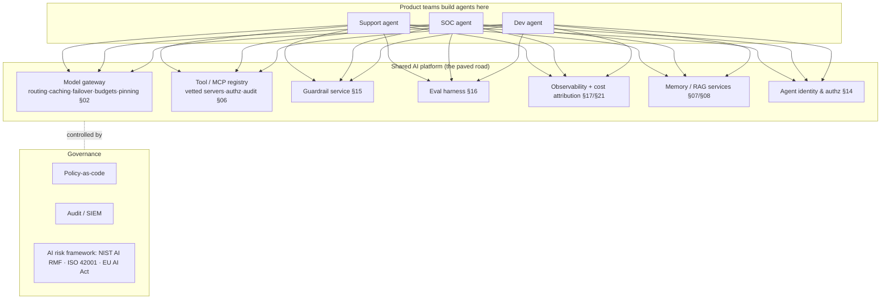
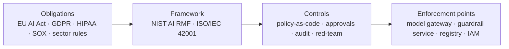
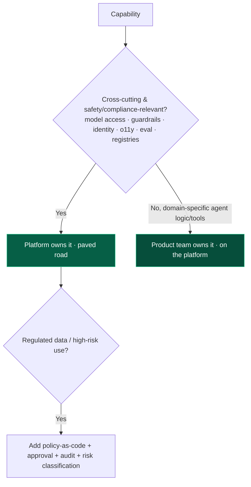

# 22 — Enterprise Patterns

> By the end of this section you can decide what belongs in a shared AI platform vs. each product team,
> govern agents as first-class principals across an org, and meet residency/compliance without grinding
> delivery to a halt.

**Prerequisites:** [§14 Security](../14-Agent-Security/), [§17 Observability](../17-Observability/), [§20 Deployment](../20-Deployment/).
**You will be able to:**
- Design the platform substrate (gateway, registries, shared services) teams build on.
- Govern agent identity, multi-tenancy, and least privilege at org scale.
- Apply governance/compliance frameworks (NIST AI RMF, ISO 42001, EU AI Act) pragmatically.
- Make build-vs-buy and org-structure calls (platform team vs. embedded).

---

## 1. TL;DR

- **Standardize the substrate, not the use case.** The dangerous, cross-cutting parts — model access,
  tool/MCP registry, guardrails, eval, observability, identity — belong in a **shared platform** so every
  team inherits safe defaults instead of reinventing (and mis-implementing) them.
- **Agents are first-class principals** in IAM: each authenticates, carries least-privilege scopes (often
  **on-behalf-of** a user), and is fully audited ([§14](../14-Agent-Security/)).
- **Multi-tenancy is isolation across every layer:** data, context/memory, RAG, caches, rate limits, and
  cost — no cross-tenant bleed, no noisy neighbor.
- **Governance = policy-as-code + lifecycle controls:** model/data governance, approval workflows, audit,
  and an **AI risk framework** (NIST AI RMF, ISO/IEC 42001) mapped to your obligations (EU AI Act, sector
  regs).
- **Org model matters:** a **platform/Center-of-Excellence** owns the paved road; product teams build on
  it. Avoid both "every team DIYs" and "one central team is the bottleneck."
- **The paved road wins by being the easy path** — make the secure, observed, eval-gated way the
  lowest-friction way, or teams route around it.

---

## 2. Concepts at three altitudes

### 🟢 Beginner — the mental model

In a big company, you don't want twenty teams each writing their own login system, their own logging, and
their own security — you give them a **shared platform** with those built in. Agentic AI is the same: the
risky parts (talking to LLM providers, running tools, enforcing safety, tracking cost, proving compliance)
should be a **paved road** every team drives on. Their job becomes "build the agent's logic"; the
platform handles "do it safely, observably, and within the rules."

### 🟡 Intermediate — the AI platform substrate

| Platform capability | Why centralize it | Section |
|---|---|---|
| **Model gateway** | Consistent routing, caching, failover, budgets, version pinning; one place to govern provider access | [§02](../02-LLM-Fundamentals/), [§21](../21-Cost-Optimization/) |
| **Tool / MCP registry** | Vetted, allow-listed tools/servers; central authz & audit; anti rug-pull | [§06](../06-MCP/) |
| **Guardrail service** | Shared safety/PII/injection/compliance checks; consistent enforcement | [§15](../15-Guardrails/) |
| **Eval harness** | "Ship only if eval passes" enforced org-wide | [§16](../16-Evaluation/) |
| **Observability + FinOps** | Uniform tracing, cost attribution, anomaly detection | [§17](../17-Observability/), [§21](../21-Cost-Optimization/) |
| **Memory/RAG services** | Tenant-isolated, governed knowledge & memory | [§07](../07-Memory/), [§08](../08-RAG/) |
| **Agent identity & authz** | Agents as principals; least privilege; audit | [§14](../14-Agent-Security/) |

### 🔴 Expert — the trade-off surface

- **Agents as principals reshapes IAM.** An agent acts in your systems, so it needs an **identity**, a
  **least-privilege** scope set, and ideally acts **on-behalf-of** a user (propagating the user's scopes,
  not ambient service power — the confused-deputy defense, [§06](../06-MCP/)/[§14](../14-Agent-Security/)).
  Credentials are **short-lived and scoped**; every action is **audited**. This is a genuine extension of
  your IAM model, not a feature flag.
- **Multi-tenant isolation is per-layer and easy to get wrong.** Data (row-level + ACLs in RAG,
  [§08](../08-RAG/)), **memory** (per-tenant scoping, [§07](../07-Memory/)), **caches** (semantic-cache
  leakage, [§18](../18-Performance-Optimization/)), **rate limits/quotas** (noisy neighbor), and **cost**
  (per-tenant budgets, [§21](../21-Cost-Optimization/)) all need tenant boundaries. A single missing
  boundary is a data-bleed incident.
- **Governance as code, not committees.** Encode policies (which models for which data classes, residency
  routing, required guardrails, approval thresholds) as **policy-as-code** enforced at the gateway/
  guardrail layer — so compliance is *automatic and auditable*, not a slide deck. Map controls to a
  recognized framework (**NIST AI RMF**, **ISO/IEC 42001**) and your regulatory obligations (**EU AI Act**
  risk tiers, sector rules like HIPAA/GDPR/SOX).
- **Data residency & sovereignty** drive architecture: route prompts containing regulated data only to
  approved models/regions (sometimes **self-hosted** open-weight models in-VPC, [§02](../02-LLM-Fundamentals/)),
  with retention/zero-retention terms vetted per provider.
- **The platform must be the *easy* path.** A paved road that's slower or more restrictive than DIY gets
  bypassed, recreating shadow-AI risk. Invest in DX: good SDKs, sane defaults, fast onboarding. Governance
  that adds friction without enabling speed fails in practice.
- **Org structure: platform/CoE + embedded experts.** A central platform team owns the substrate and
  standards; embedded engineers in product teams build agents on it. Pure-central = bottleneck;
  pure-decentralized = inconsistent and unsafe. The CoE also runs shared red-teaming and the model/tool
  vetting process.

> [!IMPORTANT]
> The enterprise thesis: **the agent's *logic* is the product team's differentiator; everything around it
> — safety, identity, observability, cost, compliance — is undifferentiated heavy lifting that belongs in
> a shared, governed platform.** Get that split right and you scale agents across the org safely; get it
> wrong and every team relearns the same incidents.

---

## 3. Governance & compliance map

| Concern | Pragmatic control |
|---|---|
| **Which model for which data** | Policy-as-code at the gateway; residency/PII routing ([§02](../02-LLM-Fundamentals/)) |
| **High-risk use cases (EU AI Act)** | Risk classification; human oversight; documentation; logging |
| **Data protection (GDPR/HIPAA)** | Tenant isolation, retention/deletion, DLP guardrails, provider terms |
| **Auditability (SOX/regulated)** | Full trace + tool-call audit to SIEM ([§17](../17-Observability/)) |
| **Model lifecycle** | Versioning, eval-gated promotion, pinning, rollback ([§20](../20-Deployment/)) |
| **Accountability** | AI inventory/registry; named owners; ISO 42001 management system |

---

## 4. Design patterns

| Pattern | What | When |
|---|---|---|
| **Paved-road platform** | Shared gateway/registries/services with safe defaults | Any org with >1 agent team |
| **Agent identity (on-behalf-of)** | Per-agent principal, user-scoped authz | All production agents |
| **Per-tenant isolation everywhere** | Data/memory/cache/quota/cost boundaries | Multi-tenant products |
| **Policy-as-code** | Governance enforced at gateway/guardrail | Regulated/multi-team |
| **AI inventory/registry** | Catalog of agents, owners, risk class, data access | Governance & audit |
| **Model/tool vetting pipeline** | Central approval + red-team before use | Provider/MCP onboarding ([§06](../06-MCP/)) |
| **Platform + embedded org** | CoE owns road; teams build on it | Scaling across the org |

---

## 5. Anti-patterns ❌ → ✅

| ❌ Anti-pattern | Why it bites | ✅ Instead |
|---|---|---|
| Every team builds its own gateway/guardrails/o11y | Inconsistent, unsafe, duplicated incidents | Shared paved-road platform |
| Agents share one broad service account | Confused deputy; no attribution; huge blast radius | Per-agent identity; on-behalf-of; least privilege |
| Tenant isolation only at the DB | Bleed via memory/cache/quota | Isolation at every layer |
| Governance as docs/committees | Not enforced; bypassed | Policy-as-code at enforcement points |
| Platform slower than DIY | Teams route around it → shadow AI | Make the safe path the easy path (DX) |
| One central team builds all agents | Bottleneck; no domain fit | Platform + embedded experts |
| Send regulated data to any model/region | Residency/compliance breach | Policy-based routing; approved models; self-host where needed |
| No AI inventory | Can't govern/audit what you can't see | Registry of agents + owners + risk class |

---

## 6. Common failures & troubleshooting

| Symptom | Root cause | Detection | Resolution |
|---|---|---|---|
| Cross-tenant data leak | Missing isolation in a layer (memory/cache/RAG) | Access/audit review | Enforce per-tenant boundaries everywhere ([§07](../07-Memory/), [§08](../08-RAG/), [§18](../18-Performance-Optimization/)) |
| Shadow AI / teams bypass platform | Platform too restrictive/slow | Usage gaps; rogue deployments | Improve DX; sane defaults; fast onboarding |
| Compliance finding (residency/retention) | No policy-as-code; ad-hoc routing | Audit | Gateway policy routing; provider term vetting |
| Can't trace who/what did an action | No agent identity/audit | Incident investigation | Per-agent identity; full audit to SIEM ([§17](../17-Observability/)) |
| Inconsistent safety across teams | No shared guardrail service | Red-team variance | Centralize guardrails ([§15](../15-Guardrails/)) |
| Surprise concentrated spend | No per-tenant budgets/chargeback | Cost attribution | Per-tenant quotas; showback ([§21](../21-Cost-Optimization/)) |

---

## 7. The four implication lenses

- **Performance:** a shared gateway centralizes caching/routing (perf win) but adds a hop — co-locate and
  keep it lean ([§18](../18-Performance-Optimization/)).
- **Security:** *the heart of this section* — identity, least privilege, isolation, audit, policy-as-code
  ([§14](../14-Agent-Security/)).
- **Scalability:** platform services must scale for all teams; multi-tenant quotas prevent noisy neighbors
  ([§19](../19-Scalability/)).
- **Cost:** central budgets, attribution, and chargeback make org-wide spend governable ([§21](../21-Cost-Optimization/)).

---

## 8. Decision framework — platform vs. product team

---

## 9. Enterprise recommendations

- **Build the paved road first:** model gateway, tool/MCP registry, guardrail service, eval harness,
  observability/FinOps, agent identity — with great DX so it's the easy path.
- **Agents as principals:** per-agent identity, on-behalf-of authorization, least privilege, short-lived
  scoped credentials, full audit to SIEM.
- **Isolation at every layer** for multi-tenancy; per-tenant quotas and cost attribution.
- **Policy-as-code** mapped to NIST AI RMF / ISO 42001 and your obligations (EU AI Act tiers, GDPR/HIPAA/
  SOX); maintain an **AI inventory** with owners and risk classes.
- **Platform/CoE + embedded model**; central red-teaming and model/tool vetting.

---

## 10. Interview-level questions

<b>Q1.</b> What belongs in a central AI platform vs. each product team?

The **platform** owns the cross-cutting, safety/compliance-relevant, undifferentiated heavy lifting: model
gateway (routing, caching, failover, budgets, version pinning), tool/MCP registry (vetting, authz, audit),
guardrail service, eval harness, observability + cost attribution, memory/RAG services, and agent identity/
authz. **Product teams** own the **domain-specific agent logic and tools** — the actual differentiator —
built *on* that platform. The principle: centralize what's dangerous to get wrong and wasteful to
duplicate; decentralize what needs domain expertise. And the platform must be the **easy** path (great DX),
or teams build shadow AI around it, recreating the very risks it exists to prevent.

<b>Q2.</b> How does treating agents as "principals" change your security/IAM model?

An agent isn't a passive feature — it authenticates, holds permissions, and *acts* in your systems, so it
needs a place in IAM like a service account but more carefully scoped. Each agent gets an **identity**, a
**least-privilege** scope set, and ideally acts **on-behalf-of** a user (propagating *that user's* scopes
rather than wielding broad ambient credentials — the confused-deputy defense, [§06](../06-MCP/)).
Credentials are **short-lived and scoped**, and **every action is audited** to SIEM. This lets you reason
about and bound **blast radius** ([§14](../14-Agent-Security/)), attribute actions, and revoke precisely —
which a shared god-mode service account makes impossible.

<b>Q3.</b> How do you handle compliance (residency, high-risk use) without killing velocity?

**Policy-as-code** enforced at the **gateway and guardrail** layers: encode which models/regions handle
which data classes (residency routing), which guardrails are mandatory, and what requires human approval —
so compliance is *automatic and auditable* rather than a manual gate per project. Map controls to a
recognized framework (**NIST AI RMF**, **ISO/IEC 42001**) and your obligations (EU AI Act risk tiers,
GDPR/HIPAA). Maintain an **AI inventory** with owners and risk classes. Velocity is preserved because the
**paved road is pre-approved**: teams building on the platform are compliant by construction, and only
novel/high-risk uses need bespoke review. Friction lives in the platform once, not in every project.

---

### Sources
- NIST AI Risk Management Framework; ISO/IEC 42001 (AI management systems); EU AI Act (risk tiers). `[Established]`
- Platform-engineering / paved-road practice applied to AI (CoE + embedded). `[Established]`
- Agent identity, least privilege, tenant isolation: [§14](../14-Agent-Security/), [§06](../06-MCP/). `[Established]`

> Next: [§23 — Real-World Case Studies](../23-Real-World-Case-Studies/) — these patterns in the wild.
