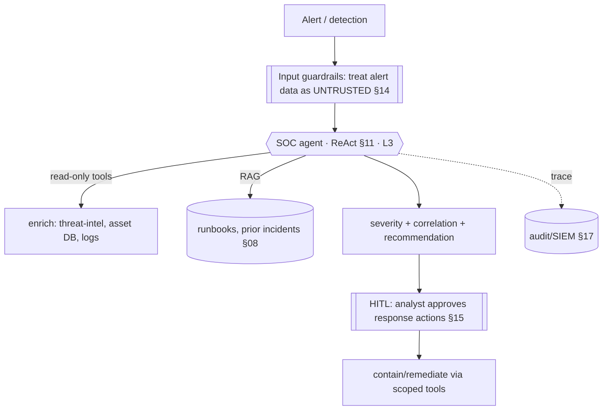
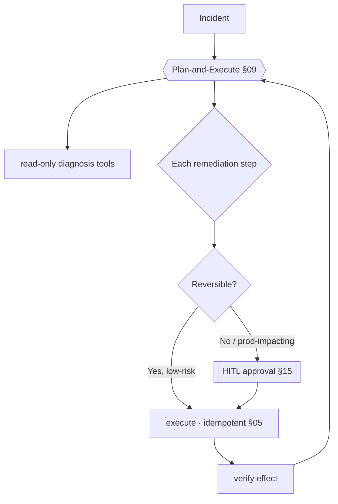
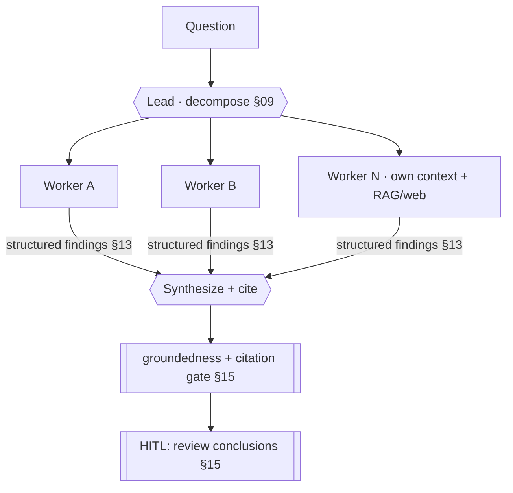
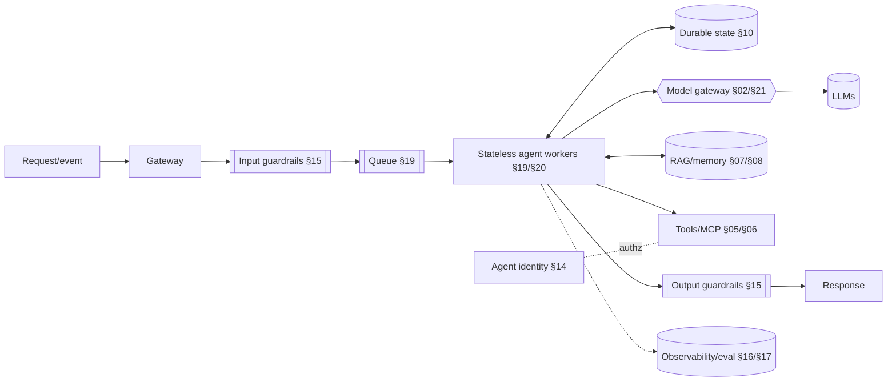

# 24 — AI Architecture Blueprints

> By the end of this section you have vetted, defensible starting architectures for the most common
> enterprise agent types — each with its autonomy justification, security posture, and what to watch in
> production.

**Prerequisites:** most of the guide (these *compose* it).
**You will be able to:**
- Lift a reference design for your use case and defend it in architecture review.
- Justify the autonomy level and blast-radius controls for each agent type.
- Know the scaling/cost shape and the top production risks per blueprint.

> [!NOTE]
> Each blueprint states **why this autonomy level**, **what the blast radius is**, and **what breaks**,
> applying the frameworks from [§01](../01-Introduction/), [§03](../03-Agent-Architecture/), [§12](../12-Multi-Agent-Patterns/).
> They're starting points — adapt to your constraints, and gate every choice on your own evals ([§16](../16-Evaluation/)).

---

## 1. TL;DR — the blueprint selector

| Blueprint | Autonomy ([§01](../01-Introduction/)) | Topology | HITL on | Dominant risk |
|---|---|---|---|---|
| **SOC Analyst** | L3 (read-heavy) | Single agent + tools | Response actions | Indirect injection via alert data |
| **Security Copilot** | L2–L3 (assistive) | Single agent + RAG | (advisory) | Hallucinated guidance; data leakage |
| **Incident Response** | L3 + gated | Plan-execute + HITL | Every destructive step | Wrong action on prod |
| **Customer Support** | L2 (workflow+agent) | Router → workflow/agent | Money-moving actions | Injection → unauthorized refund |
| **Knowledge Assistant** | L1–L2 (RAG) | RAG pipeline | — | Bad retrieval; ACL leakage |
| **Software Dev Agent** | L3–L4 | Single agent + tools + tests | Merge/deploy | Context overflow; destructive edits |
| **Autonomous Research** | L4–L5 | Orchestrator-worker | Conclusions (often) | Token cost; unbounded loops |

**Common backbone for all** (the [§20](../20-Deployment/) topology): gateway → input guardrails → agent
on stateless workers + model gateway + durable state + tools/MCP + RAG/memory → output guardrails →
observability/eval. Differences below are in **autonomy, tools, and where HITL sits.**

---

## 2. SOC Analyst Agent

**Goal.** Triage security alerts: enrich, correlate, assess, recommend (and, when approved, act).

- **Autonomy: L3, read-heavy.** Investigation is read-only (safe to automate); **response is gated**
  behind analyst approval — high blast radius.
- **Security posture:** alert content is **attacker-controlled** (indirect injection vector) → treat as
  untrusted, least-privilege read tools, **HITL on any containment/remediation**, full audit to SIEM.
- **Scaling/cost:** alert volume is bursty → queue + workers ([§19](../19-Scalability/)); route enrichment
  to cheap models, reasoning model for correlation ([§21](../21-Cost-Optimization/)).
- **Watch:** injection via alert fields; alert fatigue if recommendations are low-precision (eval on a
  labeled alert set, [§16](../16-Evaluation/)).

---

## 3. Security Copilot

**Goal.** Assist analysts/engineers with security questions over SIEM, threat intel, and internal docs.

- **Autonomy: L2–L3, assistive.** Primarily answers and drafts; actions (if any) are gated.
- **Architecture:** RAG over security knowledge + read tools to live systems; **citations + groundedness
  guardrail** mandatory (wrong security guidance is dangerous, [§15](../15-Guardrails/)).
- **Security:** strict **ACLs** (analysts see only authorized data, [§08](../08-RAG/)/[§14](../14-Agent-Security/));
  output **DLP** to prevent leaking sensitive findings.
- **Watch:** hallucinated guidance → groundedness gate; data leakage → ACLs + DLP; over-trust → keep it
  advisory, human decides.

---

## 4. Incident Response Agent

**Goal.** Execute runbooks during incidents (diagnose, propose, and on approval, remediate).

- **Autonomy: L3 with hard gates.** Diagnosis automated; **every destructive/prod-impacting action needs
  approval** (durable HITL interrupt, [§10](../10-Orchestration/)).
- **Security/safety:** least-privilege scoped tools, **idempotent** actions (no double-execution),
  **saga/compensation** for rollback ([§10](../10-Orchestration/)), full audit.
- **Watch:** wrong action on prod (the catastrophic risk) → reversibility classification + HITL; stale
  runbook → keep runbooks in RAG, version them.

---

## 5. Customer Support Agent

**Goal.** Resolve common issues, escalate the rest. (Full walkthrough in [§23](../23-Real-World-Case-Studies/#4-case-study--customer-support-automation-composite).)

- **Autonomy: L2.** Router → **workflow** for known intents + **constrained agent** for fuzzy ones; **HITL
  on money-moving actions**.
- **Security:** customer input is untrusted (injection) → authz + HITL bound it; **idempotent** refunds.
- **Scaling/cost:** high volume → aggressive **prompt caching** + cheap models for routing; per-tenant
  quotas ([§21](../21-Cost-Optimization/)).
- **Watch:** injection → unauthorized refund (contained by authz+HITL); hallucinated policy (groundedness
  guard); over-escalation (tune router).

---

## 6. Knowledge Assistant

**Goal.** Answer questions over a large, permissioned, changing corpus. (RAG details in [§08](../08-RAG/), case in [§23](../23-Real-World-Case-Studies/#5-case-study--rag-knowledge-assistant-at-scale-composite).)

- **Autonomy: L1–L2.** A RAG pipeline with at most light agentic retrieval — not an autonomous agent.
- **Architecture:** **ACL pre-filter → hybrid retrieve → re-rank → answer-only-from-context + cite →
  groundedness gate**; freshness/re-index pipeline.
- **Security:** **ACLs in retrieval** (the leakage control); tenant isolation; DLP.
- **Watch:** chunking/retrieval quality (measure separately, [§16](../16-Evaluation/)); embedding drift on
  model swap; stale index.

---

## 7. Software Development Agent

**Goal.** Implement features/fixes with file ops, search, and tests. (Pattern in [§23](../23-Real-World-Case-Studies/#2-case-study--coding-agent-documented-pattern).)

- **Autonomy: L3–L4, single agent.** Tool-augmented ReAct + **tests as verifier** + Reflexion; **HITL on
  merge/deploy**. *Single* agent (coupled context — not multi-agent, [§12](../12-Multi-Agent-Patterns/)).
- **Security:** sandboxed execution, scoped repo access, **no autonomous deploy** without approval, egress
  controls ([§14](../14-Agent-Security/)).
- **Scaling/cost:** long-running → durable async ([§10](../10-Orchestration/)/[§20](../20-Deployment/));
  context mgmt for big repos ([§07](../07-Memory/)); reasoning model for hard steps only.
- **Watch:** context overflow on large repos; reflection loops on ambiguous failures; destructive edits
  (HITL review).

---

## 8. Autonomous Research Agent

**Goal.** Open-ended investigation producing a synthesized, cited report. (Case in [§23](../23-Real-World-Case-Studies/#3-case-study--deep-research-assistant-documented).)

- **Autonomy: L4–L5, orchestrator-worker.** Justified by **parallel, independent** subtasks
  ([§12](../12-Multi-Agent-Patterns/)) — the one blueprint where multi-agent is the right default.
- **Cost/safety:** **coordination + per-task budgets** (the ~15× token reality, [§21](../21-Cost-Optimization/)),
  cheap worker models + cached shared prefix, **HITL on conclusions** for high-stakes use.
- **Watch:** token-cost blowup; unbounded loops (budgets + fail-stop, [§03](../03-Agent-Architecture/));
  ungrounded synthesis (citation/groundedness gate).

---

## 9. The reusable backbone (all blueprints share this)

The blueprints differ in **(a) autonomy level, (b) the specific tools/RAG, and (c) where HITL sits** —
everything else is the common, governed substrate from [§22 Enterprise](../22-Enterprise-Patterns/).

---

## 10. Implementation checklist (per blueprint)

- [ ] **Autonomy justified** at the lowest level that works ([§01](../01-Introduction/)); multi-agent only via the [§12 gate](../12-Multi-Agent-Patterns/).
- [ ] **Blast radius mapped:** least-privilege tools, per-agent identity, egress controls ([§14](../14-Agent-Security/)).
- [ ] **HITL on irreversible/high-impact actions** ([§15](../15-Guardrails/)).
- [ ] **Untrusted-input handling** for any ingested content (injection, [§14](../14-Agent-Security/)).
- [ ] **Eval set + regression gate** before launch ([§16](../16-Evaluation/)).
- [ ] **Budgets + fail-stop + cost attribution** ([§03](../03-Agent-Architecture/), [§21](../21-Cost-Optimization/)).
- [ ] **Observability + replay** from day one ([§17](../17-Observability/)).
- [ ] **Durable state**, stateless workers, async if long-running ([§10](../10-Orchestration/), [§20](../20-Deployment/)).

---

## 11. Enterprise recommendations

- **Treat blueprints as paved-road templates** on the shared platform ([§22](../22-Enterprise-Patterns/))
  so teams start safe and customize the differentiator (their logic/tools).
- **Default low autonomy**; the autonomous-research blueprint is the deliberate exception (parallel-
  independent work) — apply its budgets and HITL.
- **HITL placement is a design decision** tied to action reversibility; document it per blueprint.
- **Gate every blueprint instance on its own eval set** — reference designs are starting points, not
  proof of fitness.

---

## 12. Interview-level questions

<b>Q1.</b> Design a SOC analyst agent. What autonomy and controls?

**Read-heavy L3 single agent**: automate **investigation** (enrich alerts, correlate, pull logs,
retrieve runbooks via RAG) because it's read-only and safe, but **gate every response/containment action
behind analyst approval** (HITL) since blast radius is high. Critically, **alert data is attacker-
controlled** → treat it as untrusted input (indirect-injection defense, [§14](../14-Agent-Security/)),
use least-privilege read tools, and audit everything to SIEM. Scale on a queue for bursty alert volume,
route enrichment to cheap models and correlation to a reasoning model, and eval on a labeled alert set to
keep recommendation precision high (or you cause alert fatigue). The agent makes analysts faster; it
doesn't act autonomously on production security controls.

<b>Q2.</b> Which of these blueprints should be multi-agent, and which single-agent — and why?

Only the **autonomous research agent** is multi-agent by default, because its work is **parallel and
independent** (sub-questions with their own contexts) — the regime where orchestrator-worker wins despite
~15× tokens ([§12](../12-Multi-Agent-Patterns/)). The **coding/dev agent** is explicitly **single-agent**
(tightly-coupled, evolving codebase context — splitting causes conflicting edits). SOC, incident response,
support, security copilot, and knowledge assistant are **single-agent or workflow** because their work is
either sequential/gated or a retrieval pipeline, not parallel-independent. The decision is always **context
coupling**, not the impressiveness of the use case.

---

### Sources
- Blueprints compose patterns from across this guide; autonomy/coupling decisions per [§01](../01-Introduction/), [§12](../12-Multi-Agent-Patterns/).
- Documented analogues: Anthropic multi-agent research (research blueprint), coding-agent patterns; vendor
  security-copilot/SOC product architectures (verify current specifics). `[Documented/Composite]`

> Next: [§25 — Common Failures](../25-Common-Failures/) — what breaks in these blueprints and how to fix it.
