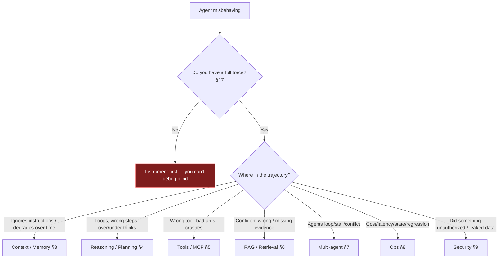
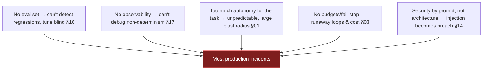

# 25 — Common Failures (the failure catalog)

> The on-call companion: a cross-cutting catalog of how agents break, organized by component, each entry
> as **symptom → root cause → detection → fix**. When something's wrong in production, start here.

**Prerequisites:** broad — references most components.
**Pairs with:** [§16 Evaluation](../16-Evaluation/), [§17 Observability](../17-Observability/), [§14 Security](../14-Agent-Security/).
**You will be able to:**
- Systematically localize an agent failure to its component.
- Recognize the canonical incident patterns and their detection signals.
- Apply the proven fix, with a pointer to the deep treatment.

---

## 1. TL;DR

- **Agents fail in ways traditional software doesn't:** non-determinism, compounding error, context rot,
  injection, silent quality regression, runaway cost/loops. Normal debugging instincts under-serve you.
- **You cannot debug what you didn't trace.** Most "un-debuggable" incidents are really
  "un-instrumented" — [§17 observability](../17-Observability/) is the prerequisite for this whole section.
- **Localize before you fix:** is it **input/context**, **reasoning/planning**, **tools/MCP**,
  **retrieval**, **multi-agent coordination**, **ops** (cost/latency/state), or **security**? The triage
  flowchart (§2) routes you.
- **The fix is usually structural, not a prompt tweak:** budgets, verifiers, least privilege, better
  tools, context management, eval gates. Prompt edits without those just move the symptom.
- **Feed every incident back into the eval set** ([§16](../16-Evaluation/)) — a fixed-but-untested
  failure recurs.

---

## 2. Triage — localize the failure first

---

## 3. Context & memory failures

| Symptom | Root cause | Detection | Fix | Deep dive |
|---|---|---|---|---|
| Quality degrades as conversation/task grows | **Context rot** / lost-in-the-middle | Accuracy vs. context-length; tokens-per-turn | Summarize + evict; JIT retrieval; key info at edges | [§02](../02-LLM-Fundamentals/), [§07](../07-Memory/) |
| Agent "forgets" an instruction mid-task | Instruction buried; drift | Eval over long trajectories | Re-assert constraints late in context; structured state | [§04](../04-System-Prompts/), [§07](../07-Memory/) |
| Request errors at high length | **Token overflow** | Pre-call token count | Hard budget trim before sending | [§07](../07-Memory/) |
| Agent acts on outdated facts | **Stale memory** | Memory vs. source-of-truth diff | TTL/recency weighting; re-verify critical facts at use | [§07](../07-Memory/) |
| Persisted false "facts" corrupt behavior across sessions | **Memory poisoning** | Provenance audit | Validate on write; trust tiers; don't auto-persist untrusted input; purge | [§07](../07-Memory/), [§14](../14-Agent-Security/) |
| Details garbled over time | **Summary drift** (summarizing summaries) | Summary vs. source | Summarize from source; keep key facts structured | [§07](../07-Memory/) |

---

## 4. Reasoning & planning failures

| Symptom | Root cause | Detection | Fix | Deep dive |
|---|---|---|---|---|
| Agent loops, never finishes | No progress; weak tools; ambiguous goal | Step-count distribution | Step budget + fail-stop; better tools; progress check | [§03](../03-Agent-Architecture/), [§11](../11-Single-Agent-Patterns/) |
| Reflects forever / cost spikes | Ungrounded or unbounded reflection | Reflection-round metric | Reflect only on grounded verifier failure; cap rounds | [§09](../09-Planning/) |
| Correct answer changed to wrong after "review" | Self-reflection without evidence | A/B with vs. without reflection | Require a verifier signal before revising | [§09](../09-Planning/) |
| Plan ignores what was discovered | No replanning trigger | Plan vs. observation diff | Replanning on divergence (bounded) | [§09](../09-Planning/) |
| Over-engineered, slow on easy tasks | Heavy technique mismatched to difficulty | Latency/cost by task class | Difficulty router; simplest technique that passes eval | [§02](../02-LLM-Fundamentals/), [§09](../09-Planning/) |
| Flaky end-to-end despite good single calls | **Compounding error** over steps | End-to-end eval vs. per-step | Fewer steps; verifiers; better tools | [§01](../01-Introduction/), [§16](../16-Evaluation/) |

---

## 5. Tool & MCP failures

| Symptom | Root cause | Detection | Fix | Deep dive |
|---|---|---|---|---|
| Calls the wrong tool | Vague/overlapping descriptions; too many tools | Tool-selection eval | Sharpen descriptions; reduce/disambiguate; route | [§05](../05-Tools-and-Function-Calling/) |
| Invalid arguments | Loose schema; ambiguous params | Validation-error rate | Tighten schema (enums/ranges); better descriptions | [§05](../05-Tools-and-Function-Calling/) |
| Tool error crashes the loop | Errors raised, not returned | Exception traces | Catch → return as tool_result observation | [§05](../05-Tools-and-Function-Calling/) |
| Duplicate side effects (double refund) | Non-idempotent mutation + retry/duplicate call | Downstream audit | Idempotency keys; dedupe | [§05](../05-Tools-and-Function-Calling/), [§13](../13-Agent-Communication/) |
| Stuck retrying a failing tool | Unhelpful error message | Step-budget exhaustion | Actionable errors; cap retries; escalate | [§05](../05-Tools-and-Function-Calling/) |
| Context blows up after tool calls | Huge tool results fed back | Token-per-turn | Truncate/summarize; return handles not payloads | [§05](../05-Tools-and-Function-Calling/) |
| Agent did unintended action after a tool result | **Tool poisoning** / indirect injection via result | Audit which result preceded action | Treat results as untrusted; output guardrails; pin tool defs | [§06](../06-MCP/), [§14](../14-Agent-Security/) |
| Downstream 401 "invalid audience" | **Token passthrough** / confused deputy | Auth logs | Audience-scoped tokens (RFC 8707); no passthrough | [§06](../06-MCP/) |
| Tools change between runs | Dynamic discovery + server changed (**rug pull**) | Diff `tools/list` snapshots | Pin/version/hash tool defs; alert on drift | [§06](../06-MCP/) |

---

## 6. RAG & retrieval failures

| Symptom | Root cause | Detection | Fix | Deep dive |
|---|---|---|---|---|
| Right docs exist but aren't retrieved | Bad chunking; pure-vector; weak query | recall@k on labeled set | Structure-aware chunking; hybrid+rerank; query rewrite | [§08](../08-RAG/) |
| Retrieved docs right, answer wrong/made-up | **Generation grounding** failure | Groundedness/faithfulness eval | Answer-only-from-context; citations; verifier | [§08](../08-RAG/), [§16](../16-Evaluation/) |
| Irrelevant top results | No re-ranking; noisy index | precision@n | Add re-ranker; tune k/n; metadata filters | [§08](../08-RAG/) |
| Quality cratered after a deploy | **Embedding-model change** w/o re-embed | Index metadata diff | Re-embed corpus; version model in metadata | [§02](../02-LLM-Fundamentals/), [§08](../08-RAG/) |
| User sees unauthorized content | No **ACL pre-filter** | Access audit | ACL filter before retrieval | [§08](../08-RAG/), [§14](../14-Agent-Security/) |
| Answers cite stale info | Index not refreshed; no recency filter | Freshness audit | Re-index pipeline; recency boost/filter | [§08](../08-RAG/) |

---

## 7. Multi-agent & communication failures

| Symptom | Root cause | Detection | Fix | Deep dive |
|---|---|---|---|---|
| Conversation never ends / ping-pong | No termination protocol | Hop/message distribution | Coordination budget + coordinator done-criteria | [§12](../12-Multi-Agent-Patterns/), [§13](../13-Agent-Communication/) |
| Agents wait on each other forever | **Deadlock** (circular dependency) | Stalled tasks; timeouts fire | Timeouts; cycle detection; supervisor mediation | [§13](../13-Agent-Communication/) |
| Contradictory / inconsistent output | Tightly-coupled work split across agents | Diff worker outputs for conflicts | Collapse to single agent; or reconcile with full context | [§12](../12-Multi-Agent-Patterns/) |
| One bad worker tanks the result | Error propagation through supervisor | Per-agent success metrics | Validate worker outputs before synthesis; redundancy | [§12](../12-Multi-Agent-Patterns/) |
| Cost 10×+ expectations | **Token multiplication** across agents | Per-agent token attribution | Fewer/cheaper agents; cache shared prefix; reconsider MAS | [§12](../12-Multi-Agent-Patterns/), [§21](../21-Cost-Optimization/) |
| One agent corrupts others | **Injection propagation** via messages | Trace triggering message | Untrusted-message handling; structured schemas; per-agent authz | [§13](../13-Agent-Communication/), [§14](../14-Agent-Security/) |
| Inconsistent shared state | Concurrent writes, no reducer | Hard-to-reproduce corruption | Reducers / single-writer | [§10](../10-Orchestration/), [§13](../13-Agent-Communication/) |

---

## 8. Operational failures (cost, latency, state, regression)

| Symptom | Root cause | Detection | Fix | Deep dive |
|---|---|---|---|---|
| Surprise 10× bill | Unbounded loops; no caching; frontier-everywhere | Cost-by-agent dashboard | Budgets + circuit breaker; routing; caching | [§21](../21-Cost-Optimization/) |
| Runaway caught on the invoice | No per-task cost alerts | Monthly surprise | Per-task token/cost anomaly alerts | [§17](../17-Observability/), [§21](../21-Cost-Optimization/) |
| High TTFT | Prefill-bound (big prompt) | TTFT vs. prompt tokens | Cache/trim prefix; JIT retrieval | [§18](../18-Performance-Optimization/) |
| High total latency on long replies | Decode-bound | TPOT × output | Smaller model; cap tokens; stream | [§18](../18-Performance-Optimization/) |
| p99 latency spikes | Variable step count / outliers | Step-count & latency distributions | Budgets/timeouts; route hard cases | [§18](../18-Performance-Optimization/), [§19](../19-Scalability/) |
| Throttled (429/529) under load | Exceeding provider quota | Provider error rate | Shared rate limit; backpressure; failover | [§19](../19-Scalability/) |
| Work lost on crash/deploy | In-memory state | Incident on restart | Durable checkpointer; stateless workers | [§10](../10-Orchestration/), [§19](../19-Scalability/) |
| **Quality silently dropped, no code change** | Provider auto-upgraded the model | Eval/online metric dip | Pin versions; re-qualify; rollback | [§02](../02-LLM-Fundamentals/), [§20](../20-Deployment/) |
| "Passed eval, fails in prod" | Eval set ≠ prod distribution | Offline vs. online gap | Mine prod into eval set | [§16](../16-Evaluation/) |
| Can't reproduce the bug | No trajectory capture | — | Full traces + checkpoints; replay | [§17](../17-Observability/) |

---

## 9. Security failures

| Symptom | Root cause | Detection | Fix | Deep dive |
|---|---|---|---|---|
| Agent performed an unauthorized action | Indirect injection + over-permission | Tool-call audit; trace triggering content | Least privilege; authz per call; HITL; quarantine input | [§14](../14-Agent-Security/) |
| Sensitive data in a response/log | Exfiltration; no DLP; unredacted logs | Output/log scanning | Output DLP guardrails; egress control; log redaction | [§14](../14-Agent-Security/), [§15](../15-Guardrails/), [§17](../17-Observability/) |
| Cross-tenant data leak | Missing ACLs / isolation | Access audit | ACL pre-filter; tenant isolation everywhere | [§08](../08-RAG/), [§22](../22-Enterprise-Patterns/) |
| Agent reached an unexpected host | No egress allow-list | Network logs | Domain allow-list; block by default | [§14](../14-Agent-Security/) |
| Downstream SQL/HTML broke or exploited | Improper output handling | Injection tests on sinks | Parameterize/encode/validate model output | [§05](../05-Tools-and-Function-Calling/), [§14](../14-Agent-Security/) |
| Harmful/policy-violating output shipped | Missing/weak output guard | Output audit; red-team | Layered output guards; fail-closed on critical | [§15](../15-Guardrails/) |
| Injection bypassed the input guard | Novel attack; LLM-only guard | Incident trace | Defense-in-depth; deterministic anchors; update classifier | [§15](../15-Guardrails/) |

---

## 10. The meta-failures (root causes behind many incidents)

> [!IMPORTANT]
> If you see repeated, varied incidents, suspect a **meta-failure** above rather than chasing each
> symptom. The durable fixes — eval harness, observability, right-sized autonomy, budgets, architectural
> security — prevent whole *classes* of the failures cataloged in §3–§9.

---

## 11. Enterprise recommendations

- **Blameless post-mortems → eval cases.** Every incident becomes a regression test ([§16](../16-Evaluation/));
  a fix without a test recurs.
- **Maintain this catalog internally**, extended with your own incidents and detection queries/runbooks.
- **Pre-mortem new agents** against §10's meta-failures before launch (eval? observability? autonomy
  right-sized? budgets? architectural security?).
- **Alerting on the leading indicators:** step-count, cost-per-task, tool-error rate, guardrail
  block-rate, offline-vs-online metric gap ([§17](../17-Observability/)).

---

## 12. Interview-level questions

<b>Q1.</b> An agent "works in the demo but is flaky in production." Walk me through diagnosis.

First confirm you have **traces** ([§17](../17-Observability/)) — you can't debug non-determinism blind.
Then localize: is it **compounding error** over many steps (end-to-end success ≪ per-step accuracy →
reduce steps, add verifiers, improve tools), **context rot** on longer real inputs (degrades with length →
context management), an **eval-prod distribution gap** (offline good, online bad → mine prod into the eval
set), or **silent model drift** (quality dropped with no code change → pin versions)? Each has a distinct
signal. The frequent root cause is a **missing eval set** — the demo wasn't measured, so "flaky" was
always there, just unquantified. Build the eval, find the failing dimension, apply the structural fix, and
add a regression test ([§16](../16-Evaluation/)).

<b>Q2.</b> Costs suddenly spiked 10×. How do you find and stop it?

Check **cost attribution** ([§17](../17-Observability/)) by agent/model/step/tenant to localize. Top
suspects: an **unbounded/looping** task (step-count anomaly → install/verify budgets + fail-stop,
[§03](../03-Agent-Architecture/)), **prompt-cache regression** (dynamic data leaked into the stable prefix
→ restore prefix stability, [§18](../18-Performance-Optimization/)), a **frontier model** used where a
cheap one suffices (→ per-step routing, [§02](../02-LLM-Fundamentals/)), or a **provider price/model
change**. Stop the bleeding with the per-task **circuit breaker**, then fix the structural cause and add a
**per-task cost anomaly alert** so the next one is caught in minutes, not on the invoice
([§21](../21-Cost-Optimization/)).

<b>Q3.</b> The same bug keeps coming back after you "fix" it. Why, and what's the fix to the fix?

Because the fix wasn't captured as a **regression test** in the eval set — so a later prompt/model/tool
change silently reintroduces it ([§16](../16-Evaluation/)). For non-deterministic systems, "I changed the
prompt and it worked once" is not a fix. The fix-to-the-fix: add the failing case (ideally mined from the
real incident trace, [§17](../17-Observability/)) to the eval set with an assertion/judge that catches it,
gate CI on it, and verify across multiple samples. Recurring bugs are usually a **process** gap (no
eval-gated loop), not a code gap — which is one of the §10 meta-failures.

---

### Sources
- Aggregates the failure tables from every section; deep treatments linked inline.
- Reliability/compounding-error reasoning: [§01](../01-Introduction/); eval & observability discipline:
  [§16](../16-Evaluation/), [§17](../17-Observability/). `[Established]`
- Security failures map to OWASP LLM Top 10 / Agentic AI Threats: [§14](../14-Agent-Security/). `[Established]`

> Next: [§26 — Future of Agentic AI](../26-Future-Trends/) — what's coming, labeled by maturity.
