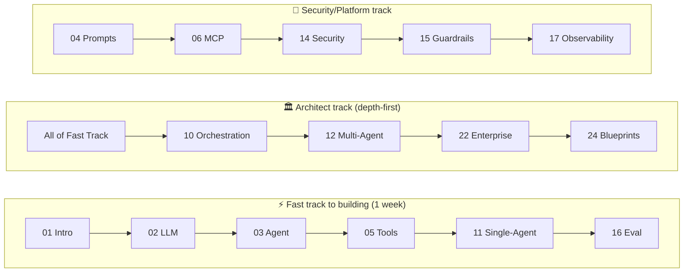
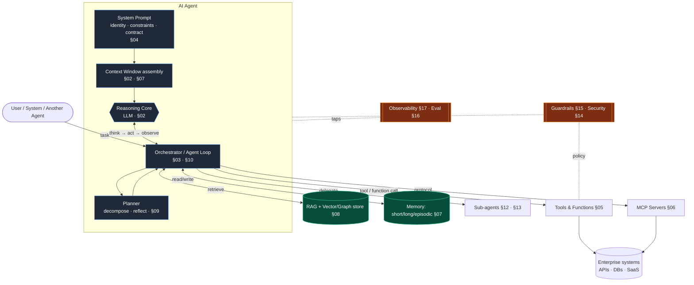

# The Agentic AI Architect's Field Manual

> A production-grade curriculum that takes a senior software engineer from Agentic AI
> fundamentals to expert-level AI Architect — capable of designing, building, securing,
> scaling, and operating enterprise multi-agent systems.

**Audience:** Senior+ engineers (8+ yrs) fluent in distributed systems, cloud, DevOps, and security.
This guide assumes you know what a message queue, a circuit breaker, idempotency, and a p99 latency
budget are. It does **not** assume you know what a "context window," "ReAct loop," or "MCP server" is.
We bridge from the former to the latter.

**Code stack:** Python + the modern agent stack (LangGraph / LangChain, Pydantic, FastAPI) plus
first-party vendor SDKs (Anthropic, OpenAI). Patterns are framework-agnostic; the code is concrete.

**Last reviewed:** 2026-06. Model landscape and protocol versions move fast — see
[§Versioning & Recency](#versioning--recency) for how we date claims.

---

## How to read this guide

Every section is self-contained and follows the **same 12-part template** (see
[_meta/SECTION-TEMPLATE.md](_meta/SECTION-TEMPLATE.md)). Within each topic you will find three
explanation altitudes — read the one that matches your current need:

| Altitude | For | What you get |
|---|---|---|
| 🟢 **Beginner** | First exposure | Plain-language mental model, the "why it exists" |
| 🟡 **Intermediate** | Building with it | How it actually works, the moving parts, code |
| 🔴 **Expert** | Architecting it | Trade-offs, failure modes, scale/cost/security implications, decision frameworks |

> [!NOTE]
> **Callout legend** used throughout:
> `[!NOTE]` context · `[!TIP]` battle-tested practice · `[!WARNING]` common failure ·
> `[!CAUTION]` security/data-loss risk · `[!IMPORTANT]` non-negotiable in production.

Facts vs. emerging practice are labeled inline:
**`[Established]`** = proven in production at scale · **`[Emerging]`** = promising, not yet standard ·
**`[Contested]`** = practitioners disagree; we give both sides.

---

## The curriculum map

The 26 sections form four arcs. You can read linearly, or jump by the learning paths below.

### Arc I — Foundations (the substrate)
| # | Section | One-line |
|---|---|---|
| 01 | [Introduction](01-Introduction/) | Mental models, the agent-vs-pipeline distinction, glossary |
| 02 | [LLM Fundamentals](02-LLM-Fundamentals/) | Tokens, attention, context, embeddings, inference, fine-tuning, model selection |
| 03 | [Agent Architecture](03-Agent-Architecture/) | The agent loop, autonomy levels, anatomy of an agent |
| 04 | [System Prompts](04-System-Prompts/) | Identity, constraints, output contracts, injection-resistant design |
| 05 | [Tools & Function Calling](05-Tools-and-Function-Calling/) | Tool schemas, the calling loop, parallel tools, error handling |

### Arc II — Capabilities (what makes agents useful)
| # | Section | One-line |
|---|---|---|
| 06 | [MCP](06-MCP/) | Model Context Protocol: architecture, transports, security, vs REST/GraphQL |
| 07 | [Memory](07-Memory/) | Short/long/episodic/semantic/working memory; compression; poisoning |
| 08 | [RAG](08-RAG/) | Chunking → embedding → retrieval → re-ranking; hybrid, Graph, Agentic RAG |
| 09 | [Planning](09-Planning/) | Decomposition, ReAct, Plan-and-Execute, Tree/Graph of Thought, reflection |
| 10 | [Orchestration](10-Orchestration/) | LangGraph, state machines, DAGs, event-driven, durable execution |

### Arc III — Composition (single → multi-agent systems)
| # | Section | One-line |
|---|---|---|
| 11 | [Single-Agent Patterns](11-Single-Agent-Patterns/) | ReAct, Plan-Execute, Reflexion, self-healing, tool-augmented |
| 12 | [Multi-Agent Patterns](12-Multi-Agent-Patterns/) | Supervisor, hierarchical, swarm, blackboard; when NOT to |
| 13 | [Agent Communication](13-Agent-Communication/) | Shared memory, queues, event buses, A2A; deadlocks & loops |

### Arc IV — Production (making it real, safe, and affordable)
| # | Section | One-line |
|---|---|---|
| 14 | [Agent Security](14-Agent-Security/) | Prompt injection, tool abuse, hijacking, memory poisoning, exfiltration |
| 15 | [Guardrails](15-Guardrails/) | Input/output/tool guardrails, safety filters, compliance validation |
| 16 | [Evaluation](16-Evaluation/) | Offline/online eval, LLM-as-judge, trajectory eval, regression gates |
| 17 | [Observability](17-Observability/) | Tracing (OTel/GenAI), metrics, replay, cost attribution |
| 18 | [Performance Optimization](18-Performance-Optimization/) | Latency budgets, caching, prompt/context optimization, speculative decoding |
| 19 | [Scalability](19-Scalability/) | Horizontal/distributed agents, queues, multi-region, concurrency control |
| 20 | [Deployment](20-Deployment/) | Local, cloud, Kubernetes, serverless, edge; release strategies |
| 21 | [Cost Optimization](21-Cost-Optimization/) | Token economics, model routing, caching ROI, FinOps for agents |
| 22 | [Enterprise Patterns](22-Enterprise-Patterns/) | Tenancy, governance, identity, data residency, platform design |
| 23 | [Real-World Case Studies](23-Real-World-Case-Studies/) | Annotated end-to-end systems with the reasoning |
| 24 | [AI Architecture Blueprints](24-AI-Architecture-Blueprints/) | Reference designs: SOC analyst, support, incident response, dev agent, etc. |
| 25 | [Common Failures](25-Common-Failures/) | A failure catalog: symptom → root cause → detection → fix |
| 26 | [Future Trends](26-Future-Trends/) | A2A protocols, agent OSes, cognitive architectures, self-improvement |

---

## Learning paths

You don't have to read 01→26. Pick a path:



| Path | Read these in order | You'll be able to… |
|---|---|---|
| ⚡ **Fast track to building** | 01 → 02 → 03 → 05 → 11 → 16 | Ship a single production agent with tools + evals |
| 🧠 **Knowledge & retrieval** | 02 → 07 → 08 → 09 | Build a grounded RAG/agentic-retrieval system |
| 🏛️ **Architect** | Fast track → 10 → 12 → 13 → 22 → 24 | Design multi-agent platforms and defend the design |
| 🔐 **Security & platform** | 04 → 06 → 14 → 15 → 17 → 22 | Own the safety, identity, and governance layers |
| 💰 **Run it economically** | 17 → 18 → 19 → 20 → 21 | Operate at scale within a latency & cost budget |

---

## Mental model in one diagram

The whole field, compressed. Every section deepens one box here.



> [!TIP]
> If you remember one thing: **an agent is an LLM in a loop with tools, memory, and a stopping
> condition.** Everything else in this repo is about making that loop *reliable, safe, observable,
> fast, and cheap* at enterprise scale. The hard part was never the loop — it's the five adjectives.

---

## Versioning & recency

The model and protocol landscape changes monthly. To keep this guide trustworthy:

- **Capabilities** (e.g., "supports parallel tool calls") are stated as of **2026-06** and tagged
  `[Established]` / `[Emerging]` / `[Contested]`.
- **We avoid hard numbers that rot** (exact context lengths, per-token prices). Where a number is
  load-bearing, we show *how to look it up* and reason about it, not just the value.
- **Protocol versions** are pinned: MCP spec revision, A2A version, OpenTelemetry GenAI semconv
  status are each named in their sections.
- Anything dated will say so. When in doubt, **verify against the vendor's current docs** before a
  production decision — this guide teaches the reasoning, not a snapshot of prices.

---

## Conventions

- **Diagrams:** [Mermaid](https://mermaid.js.org/) (renders natively on GitHub/most viewers).
  Source-heavy diagrams also exported under [_assets/diagrams/](_assets/diagrams/).
- **Code:** Python 3.11+, type-hinted, Pydantic models for I/O contracts. Snippets are
  *illustrative-but-runnable* — they show real APIs, omit only boilerplate (imports/keys) where noted.
- **Anti-patterns** are shown as ❌ with the ✅ correction beside them.
- **Interview questions** at the end of each section are the kind a staff/principal panel actually asks.

---

## Progress tracker

- [x] Repository scaffold (26 sections)
- [x] Master index + conventions + section template + glossary
- [x] **Flagship sections** (full-depth reference): [02 LLM](02-LLM-Fundamentals/) · [03 Agent](03-Agent-Architecture/) · [06 MCP](06-MCP/) · [12 Multi-Agent](12-Multi-Agent-Patterns/)
- [x] [01 Introduction](01-Introduction/) (full depth)
- [x] Scope-locked **stubs** for all remaining sections (navigable; prerequisites + scope defined)
- [ ] Foundations arc to full depth (04, 05)
- [ ] Capabilities arc to full depth (07, 08, 09, 10)
- [ ] Composition arc to full depth (11, 13)
- [ ] Production arc to full depth (14–22)
- [ ] Applied arc to full depth (23, 24, 25, 26)

> **Status (2026-06): Phase 1 complete.** 01 + four flagship sections are full-depth; the other 20 are
> scope-locked stubs (every link resolves; each states its scope, prerequisites, and cross-links). The
> flagships set the quality bar; the remaining 20 get expanded to that bar next. A 🟢/🟡/🔴 altitude tag,
> Mermaid diagrams, production Python, anti-patterns, failure tables, the four implication lenses,
> decision frameworks, and interview Q&A are present in every full-depth section.

---

## Repository layout

```text
.
├── README.md                  ← you are here (master index)
├── _meta/
│   ├── SECTION-TEMPLATE.md     ← the 12-part template every section follows
│   └── GLOSSARY.md             ← canonical term definitions (single source of truth)
├── _assets/diagrams/           ← exported diagram sources
├── 01-Introduction/ … 26-Future-Trends/
│       └── README.md           ← each section's content
```

## Sources & further reading

Each section cites primary sources inline. Anchor references used across the guide:

- **Model Context Protocol** — [modelcontextprotocol.io](https://modelcontextprotocol.io) (spec, SDKs)
- **Anthropic** — "Building effective agents" engineering post; Claude docs (tool use, prompt caching)
- **OpenAI** — function calling / Responses API docs; "A practical guide to building agents"
- **LangGraph / LangChain** — orchestration docs and conceptual guides
- **OpenTelemetry GenAI** — semantic conventions for LLM/agent spans
- **OWASP** — "Top 10 for LLM Applications" and "Agentic AI Threats & Mitigations"
- **Google** — Agent-to-Agent (A2A) protocol spec
- Academic: *Attention Is All You Need*; ReAct; Reflexion; Toolformer; RAG (Lewis et al.); Self-RAG

> Citations point to the *kind* of source and its canonical home. Always confirm against the live
> docs for production decisions — versions move.
