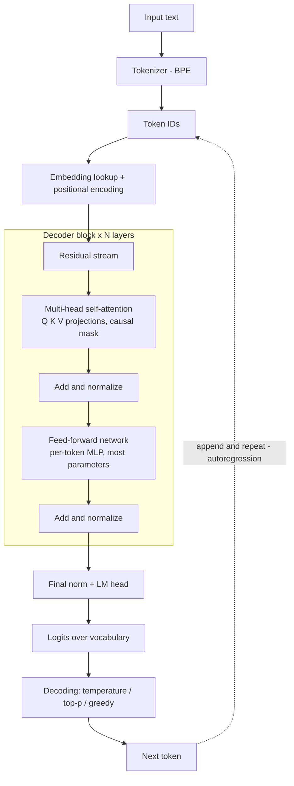
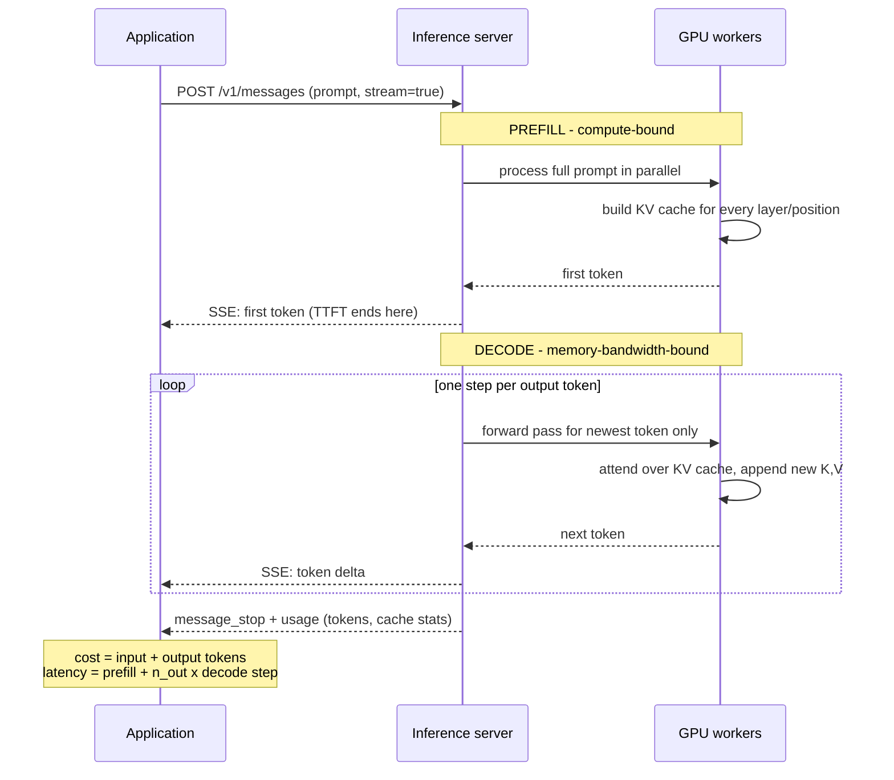
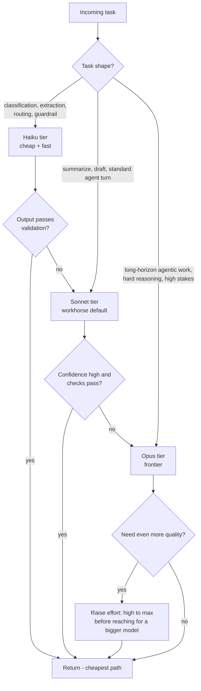

# Module 01 — LLM Fundamentals

> **Audience:** Senior engineers (8+ years) transitioning into Agentic AI Architecture.
> **Goal:** Build a mechanical, first-principles understanding of how large language models work — deep enough to make architecture decisions about latency, cost, context, and model selection, not just call an API.
> **Position in curriculum:** This is the foundation for [Module 02 — Agent Fundamentals](02-agent-fundamentals.md) and [Module 03 — Agent Components](03-agent-components.md). Everything an agent does — planning, tool calling, reflection — is ultimately a forward pass through the machinery described here.

---

## Table of Contents

1. [What It Is](#what-it-is)
2. [Why It Exists](#why-it-exists)
3. [Internal Architecture](#internal-architecture)
4. [How It Works](#how-it-works)
5. [Real-World Use Cases](#real-world-use-cases)
6. [Production Implementation](#production-implementation)
7. [Code Examples](#code-examples)
8. [Architecture Diagrams](#architecture-diagrams)
9. [Best Practices](#best-practices)
10. [Common Mistakes](#common-mistakes)
11. [Failure Modes](#failure-modes)
12. [Security Considerations](#security-considerations)
13. [Performance Considerations](#performance-considerations)
14. [Scalability Considerations](#scalability-considerations)
15. [Cost Considerations](#cost-considerations)
16. [Enterprise Recommendations](#enterprise-recommendations)
17. [When to Use / When Not to Use](#when-to-use--when-not-to-use)
18. [Trade-offs & Architectural Decisions](#trade-offs--architectural-decisions)
19. [Key Takeaways](#key-takeaways)

---

## What It Is

A **large language model (LLM)** is an autoregressive next-token predictor built on the Transformer architecture. That single sentence carries three load-bearing concepts:

### Autoregressive

The model produces output one token at a time. Each generated token is appended to the input and the model runs again to produce the next token. There is no plan, no buffer, no lookahead at the level of the mechanism — every apparent multi-step "plan" the model produces is an emergent property of conditioning on its own previous output. This is why output length directly drives latency and cost, and why streaming is the natural delivery mode.

### Next-token prediction

The model emits a probability distribution over its entire vocabulary (~30k–200k tokens) at every step. A decoding strategy (greedy, sampling, temperature-scaled sampling) selects one token from that distribution. The model is not retrieving facts from a database — it is computing the statistically most plausible continuation given everything in its context window and everything baked into its weights during training. This is the root cause of hallucination: a plausible continuation is not necessarily a true one.

### Transformer

The neural architecture introduced in *Attention Is All You Need* (2017). Its defining property is **self-attention**: every token can directly attend to every other token in the context, in parallel, rather than information being squeezed through a sequential bottleneck as in RNNs. This parallelism is what made trillion-token training runs computationally feasible, and the direct token-to-token attention is what gives LLMs their long-range coherence.

Modern production models — the Claude family (Opus, Sonnet, Haiku tiers), GPT-series, Llama, etc. — are decoder-only Transformers trained in stages: large-scale pretraining, supervised fine-tuning, and preference optimization (RLHF / DPO / RLAIF), with newer models adding **reasoning training** that teaches the model to spend variable test-time compute thinking before answering.

---

## Why It Exists

Understanding why each piece exists prevents cargo-cult architecture decisions later.

### Why Transformers replaced RNNs

RNNs (LSTM/GRU) processed text sequentially: token *t* could only be computed after token *t-1*. Two fatal problems:

1. **No training parallelism.** Sequence length = number of sequential steps. You cannot saturate a GPU cluster with a fundamentally serial computation. Transformers compute attention for all positions simultaneously during training, turning the problem into giant matrix multiplications — exactly what accelerators are built for.
2. **Information bottleneck.** An RNN compresses everything it has seen into a fixed-size hidden state. By token 2,000, information from token 5 has been overwritten many times. Attention gives token 2,000 a *direct, learned* connection to token 5.

### Why tokenization exists

Neural networks operate on vectors of fixed dimensionality, not strings. You need a finite vocabulary. Character-level vocabularies are tiny but produce extremely long sequences (and attention cost scales quadratically with sequence length — see below). Word-level vocabularies explode in size and cannot handle novel words. **Subword tokenization (BPE — Byte Pair Encoding)** is the engineering compromise: common words become single tokens, rare words decompose into recognizable fragments, and nothing is ever out-of-vocabulary because the base alphabet is bytes.

### Why fine-tuning and RLHF exist

A pretrained model is a document-completion engine, not an assistant. Ask it a question and it may continue with *more questions*, because that is a plausible document continuation. Instruction tuning and preference optimization exist to bend the raw distribution toward "helpful, honest, harmless assistant behavior" — they don't add knowledge so much as reshape *which* continuations the model prefers.

### Why reasoning models exist

For a fixed model, accuracy on hard problems improves when the model generates intermediate reasoning before the final answer — it gets more forward passes, i.e., more compute, per problem. Reasoning training (extended/adaptive thinking) institutionalizes this: instead of scaling only train-time compute (bigger model), you scale **test-time compute** (more thinking tokens on hard inputs, fewer on easy ones). This is the second scaling axis the industry is now exploiting, and it changes your latency/cost model fundamentally.

---

## Internal Architecture

### The decoder-only Transformer stack

A production LLM is a stack of *N* identical blocks (N ≈ 30–120+). Each block contains:

1. **Multi-head self-attention** — tokens exchange information.
2. **Feed-forward network (FFN/MLP)** — per-token nonlinear transformation; ~⅔ of the parameters live here. The FFN is where much of the model's "knowledge" is stored, in the sense that factual associations are largely encoded in these weights.
3. **Residual connections + normalization** — each sublayer adds its output to a running "residual stream," which is the best mental model for information flow: every layer reads from and writes incremental updates to a shared per-token vector.

Before the stack: an **embedding layer** maps token IDs to vectors. After the stack: an **unembedding / LM head** projects the final vector back to vocabulary-sized logits.

### Self-attention: the math intuition

For each token, the model computes three vectors via learned projection matrices:

- **Query (Q)** — "what am I looking for?"
- **Key (K)** — "what do I contain / advertise?"
- **Value (V)** — "what information do I contribute if attended to?"

Attention for a token is computed as:

```text
Attention(Q, K, V) = softmax( Q · Kᵀ / √d_k ) · V
```

Walk through what each piece does:

- `Q · Kᵀ` — dot product of this token's query against **every** prior token's key. High dot product = high relevance. This is a learned, content-based addressing scheme: "the" before a noun learns to emit a query that matches keys of nouns.
- `/ √d_k` — scaling. Dot products of high-dimensional vectors have variance proportional to dimension; without scaling, softmax saturates and gradients vanish. A pure numerical-stability fix that matters enormously in practice.
- `softmax(...)` — converts relevance scores into a probability distribution (attention weights summing to 1).
- `· V` — a weighted average of value vectors. The token's updated representation is literally a mixture of information from the tokens it attended to.

**Causal masking:** in a decoder-only model, position *t* may only attend to positions ≤ *t*. Future positions are masked to −∞ before the softmax. This is what makes the model trainable on next-token prediction across all positions in parallel.

**Complexity:** the Q·Kᵀ matrix is *n × n* for sequence length *n* — attention is **O(n²)** in compute and memory. This single fact explains why context windows are expensive, why long-context pricing exists, and why the industry invests in attention variants (grouped-query attention, sliding-window attention, sparse attention).

### Multi-head attention

Instead of one attention computation over the full vector dimension *d*, the model runs *h* independent attention "heads," each over a *d/h*-dimensional slice, then concatenates and re-projects the results.

Why: a single softmax produces **one** weighting per token — one relationship type. Real language needs many simultaneous relationships: syntactic dependency, coreference ("it" → its antecedent), positional patterns, copying behavior. Each head learns its own Q/K/V projections and therefore its own notion of relevance. Interpretability research has identified individual heads doing recognizable jobs — previous-token heads, induction heads (which implement "if you saw `A B` earlier and you see `A` now, predict `B`" — the mechanism behind in-context learning), and name-mover heads.

Architect's takeaway: multi-head attention is parallel, specialized information routing. When a model "follows instructions from 80k tokens ago," specific heads are doing the long-range retrieval.

### The KV cache

During generation, token *t+1* needs attention over all previous tokens — which requires their K and V vectors. Recomputing them every step would make generation O(n²) per token. Instead, inference engines **cache the K and V tensors** for every processed token in every layer.

Consequences you must design around:

- **Memory cost is real:** KV cache size = `2 × layers × heads × head_dim × seq_len × bytes_per_value`. For a large model at 100k+ context, the cache for a *single request* can run into tens of GB — often exceeding the weights' share of GPU memory at high batch sizes. KV cache memory, not compute, is frequently the binding constraint on serving throughput.
- **Prompt caching is KV-cache reuse.** When a provider offers cached input tokens at ~10% of normal price (as the Anthropic API does), it is literally persisting and reusing the computed KV tensors for a stable prompt prefix. This is why caching is *prefix-based* and why any byte change in the prefix invalidates everything after it — the KV tensors at position *i* depend on all tokens ≤ *i*.
- **Grouped-Query Attention (GQA)** — sharing one K/V set across groups of query heads — exists primarily to shrink this cache, trading a small quality cost for large serving wins.

### Tokenization: BPE mechanics and token economics

**BPE (Byte Pair Encoding)** builds a vocabulary by starting from raw bytes and repeatedly merging the most frequent adjacent pair into a new token, for ~30k–200k merges. The result:

- `" the"` → 1 token. `"transformer"` → maybe 1–2 tokens. `"Kubernetes"` → 2–3 tokens.
- Whitespace is usually attached to the following word; capitalization changes tokenization (`"Hello"` ≠ `" hello"` ≠ `"HELLO"`).
- Numbers and code tokenize inefficiently and inconsistently — `"12345"` may split as `"123"`,`"45"`. This is one reason raw arithmetic is unreliable and why agents should delegate math to tools.
- Non-English text and unusual formats (base64, dense JSON, deeply indented code) consume far more tokens per unit of meaning.

**Token economics — why architects must care:**

1. **You are billed per token, asymmetrically.** Output tokens typically cost ~5× input tokens (e.g., Claude Sonnet 4.6: $3 / 1M input vs $15 / 1M output). Verbose outputs are the silent budget killer.
2. **Latency is token-denominated.** Time-to-first-token tracks input length (prefill); total time tracks output length (decode).
3. **Tokenizers differ between models.** Never reuse token counts across model families — and even across generations of the same family (newer Anthropic models use a different tokenizer than older ones). Count with the provider's counting endpoint (`count_tokens`), not with another vendor's tokenizer library.
4. **English ≈ 4 characters ≈ 0.75 words per token** is a planning heuristic only; code and JSON skew heavily.

### Embeddings

An embedding is a dense vector representing a token (or, for embedding models, a whole text) in a high-dimensional space where geometric proximity ≈ semantic similarity.

- **Inside the LLM:** the input embedding matrix maps token IDs to vectors; positional information is injected (modern models use RoPE — rotary position embeddings — which encode *relative* position directly into Q/K dot products, which is also what enables context-window extension techniques).
- **Outside the LLM:** dedicated embedding models produce a single vector per document/chunk. These power semantic search and RAG: embed the corpus, embed the query, retrieve nearest neighbors by cosine similarity. Embedding-based retrieval is a *separate model and a separate architectural component* from the generator LLM — covered when you build knowledge sources in [Module 03 — Agent Components](03-agent-components.md).

Key intuition: embeddings are lossy semantic compression. Two texts with the same "meaning shape" land near each other even with zero lexical overlap — and conversely, negation ("approved" vs "not approved") often barely moves the vector, which is a classic RAG failure source.

### Context windows and degradation

The **context window** is the maximum number of tokens (input + output) the model can attend over — 200k to 1M+ tokens for current frontier models (Claude Sonnet 4.6 and Opus-tier models support 1M; Haiku 4.5 supports 200k).

A bigger window is *capacity*, not *uniform competence*:

- **Lost in the middle:** empirically, models retrieve information best from the **beginning and end** of the context; recall sags for material buried in the middle (Liu et al., "Lost in the Middle"). Design consequence: put instructions and the most decision-critical material at the edges; never assume "it's in context, therefore it's used."
- **Effective context < advertised context:** reasoning quality over the full window degrades before hard limits are hit, especially for multi-hop tasks that must *combine* several mid-context facts.
- **Distraction and dilution:** irrelevant context actively hurts. An agent that dumps 50 raw tool outputs into context performs worse than one that summarizes and prunes. This motivates context engineering — compaction, context editing, and memory systems ([Module 06 — Memory Systems](06-memory-systems.md)).
- **Cost scales linearly, attention quadratically:** you pay per input token on every call, and the provider pays O(n²) attention compute — which is why some providers price long-context requests at a premium.

---

## How It Works

### Training pipeline (how the model got its behavior)

```text
Pretraining  →  Supervised Fine-Tuning (SFT)  →  Preference Optimization (RLHF / DPO / RLAIF)  →  Reasoning training
```

**1. Pretraining.** Next-token prediction over trillions of tokens of web text, code, and books. Produces a *base model*: vast knowledge and capability, no assistant behavior, no safety profile. Months on thousands of accelerators; this is where the knowledge cutoff comes from.

**2. Supervised fine-tuning.** Train on curated (instruction → high-quality response) pairs. Teaches format and the assistant persona. Cheap relative to pretraining; data quality dominates data quantity.

**3. Preference optimization.**

- **RLHF (Reinforcement Learning from Human Feedback):** humans rank candidate responses; a *reward model* is trained to predict those rankings; the LLM is then optimized (classically with PPO) to maximize reward, with a KL-divergence penalty tethering it to the SFT model so it doesn't reward-hack into degenerate outputs. Powerful but operationally heavy: four models in flight (policy, reference, reward, value), notorious training instability.
- **DPO (Direct Preference Optimization):** a reformulation showing the same objective can be optimized *directly* on preference pairs with a simple classification-style loss — no reward model, no RL loop. Far simpler and more stable; the default for most open-model alignment work. Trade-off: it's bound to its static preference dataset, whereas RLHF's reward model can score novel on-policy outputs.
- **RLAIF / Constitutional AI:** replace human raters with an AI rater guided by an explicit set of principles (a "constitution"). The model critiques and revises its own outputs against the principles; preference labels are generated at scale by AI. This is Anthropic's signature approach — it makes alignment criteria *auditable* (the constitution is a document, not a latent property of ten thousand rater judgments) and scales feedback far beyond human labeling throughput.

**4. Reasoning training.** Models are trained — largely with RL on verifiable problems (math, code, agentic tasks) — to produce long internal chains of thought, evaluate intermediate steps, backtrack, and self-correct before answering. Externally this surfaces as *extended/adaptive thinking*: the model emits thinking tokens (billed, variable in number) before its answer. The architectural shift: **answer quality becomes a knob you turn at request time** (thinking effort), not a fixed property of the model.

### Customization spectrum (what you can do to a model)

| Technique | What changes | Data needed | Cost | When |
|---|---|---|---|---|
| Prompt engineering | Nothing (context only) | Examples in prompt | Per-request tokens | Always first |
| RAG / retrieval | Nothing (context only) | A corpus + embeddings | Infra + tokens | Fresh/private knowledge |
| **Full fine-tuning** | All weights | 10k–1M+ examples | Very high (GPU fleet, weeks) | Deep domain/style shifts; you own serving |
| **LoRA** | Small low-rank adapter matrices (~0.1–1% of params) | 1k–100k examples | Low–moderate | Format/style/task specialization |
| **QLoRA** | LoRA on a 4-bit quantized base | Same as LoRA | Lowest (single-GPU feasible) | Budget-constrained tuning of large open models |

**LoRA (Low-Rank Adaptation)** intuition: the weight *update* needed for a narrow task has low intrinsic rank, so instead of updating a `d×d` matrix W, freeze W and learn `ΔW = B·A` where B is `d×r` and A is `r×d` with rank r ≈ 8–64. You train ~0.5% of parameters, keep the base model frozen (no catastrophic forgetting of the rest), and can hot-swap adapters per tenant on one base model — a major multi-tenant serving pattern. **QLoRA** additionally quantizes the frozen base to 4-bit (NF4) during training, cutting memory ~4× so a 70B model is tunable on a single high-memory GPU, at a small quality cost.

**Architect's rule of thumb:** fine-tuning teaches *form and behavior*, retrieval teaches *facts*. Fine-tuning on your wiki will not make the model reliably recall your wiki; RAG will. Fine-tuning *will* make it consistently emit your JSON schema, your tone, your classification taxonomy. Exhaust prompting and RAG before any tuning — frontier hosted models with good prompts beat tuned smaller models for most enterprise tasks, with zero MLOps burden.

### Inference (what happens on every API call)

Inference has two phases with totally different performance characters:

**Prefill (compute-bound).** The entire prompt is processed in one parallel pass — big matrix multiplications that saturate GPU compute — populating the KV cache. Cost scales with prompt length (quadratic attention term included). Prefill time ≈ **time-to-first-token (TTFT)**.

**Decode (memory-bandwidth-bound).** Tokens generate one at a time. Each step does relatively little math but must stream the *entire model weights* (and the KV cache) through GPU memory. Decode speed is governed by memory bandwidth, not FLOPs. Decode time ≈ tokens × per-token latency ≈ **the bulk of total latency**.

This asymmetry drives the serving techniques you'll see referenced in every provider's docs:

- **Continuous batching.** Since decode underutilizes compute, servers batch many concurrent requests, inserting and retiring sequences every step rather than waiting for whole batches to finish. Multiplies throughput several-fold; it is why providers can price tokens as cheaply as they do, and why *batch APIs* (50% discount, async completion) exist — your latency-insensitive jobs become batching filler.
- **Speculative decoding.** A small "draft" model proposes k tokens cheaply; the big model verifies all k in **one parallel forward pass** (parallel verification is cheap — it's prefill-shaped work). Accepted tokens are kept; the first rejection falls back to the big model's choice. Output distribution is *provably identical* to the big model alone — pure latency optimization, typically 2–3× decode speedup when the draft model predicts well (boilerplate code, common prose).
- **Quantization.** Store weights at lower precision — FP16/BF16 → INT8 → INT4. Because decode is bandwidth-bound, halving the bytes per weight directly increases decode speed *and* halves memory. Quality loss is small at 8-bit, noticeable-but-often-acceptable at 4-bit, and worst on long-tail reasoning. Mostly a self-hosting concern (GPTQ, AWQ, llama.cpp GGUF); hosted APIs handle it invisibly.

### Decoding controls

`temperature` scales logits before sampling (0 → near-greedy, 1 → full distribution); `top_p` (nucleus) truncates the candidate set to the smallest set with cumulative probability p. Two cautions: temperature 0 still does **not** guarantee bitwise determinism on production serving stacks (batching nondeterminism, floating-point reduction order), and the newest reasoning-first models (e.g., Anthropic's Opus 4.7+) **remove sampling parameters entirely** — steering is done via prompting and the `effort` parameter instead. Don't build architecture that depends on sampling knobs existing.

### Reasoning models and test-time compute

With adaptive thinking (the current Anthropic API shape: `thinking={"type": "adaptive"}` plus `output_config={"effort": "low" | "medium" | "high" | "max"}`), the model itself decides when and how much to think; effort scales the depth. Architectural consequences:

- **Latency variance explodes.** P50 might be 3s; P99 on a hard input might be minutes. Timeouts, streaming, and progress UX must assume this.
- **Cost becomes input-dependent.** Thinking tokens are billed output tokens; identical prompt templates can differ 10× in cost depending on input difficulty.
- **Effort is a routing dimension.** The same model at `low` vs `high` effort behaves like two different cost/quality tiers — sweep effort levels on your evals before reaching for a bigger model.
- **Thinking is for the model, not the user.** Treat thinking output (summaries) as observability data, not product surface.

---

## Real-World Use Cases

Mapped to which fundamental dominates the design:

| Use case | Dominant fundamentals | Architectural note |
|---|---|---|
| **Code assistants / coding agents** | Long context, KV/prompt caching, reasoning effort | Repo context is huge and stable → caching is the economic foundation; effort `high`/`max` for hard refactors |
| **Document intelligence** (contracts, claims, 10-Ks) | Context degradation, tokenization of PDFs/tables | Chunk + targeted extraction beats whole-doc stuffing; mind lost-in-the-middle for clause retrieval |
| **Customer support automation** | Model tiers, RAG, preference-tuned behavior | Haiku-tier for triage/classification, Sonnet-tier for resolution; escalate hard cases up-tier |
| **Bulk enrichment / classification pipelines** | Batch API economics, small models, structured output | Haiku + batch (50% off) + strict JSON schemas; throughput, not latency |
| **Conversational analytics ("ask your data")** | Tool use over raw generation | The model writes SQL/code; it must *not* do arithmetic in its head — tokenization makes that unreliable |
| **Research / deep-analysis agents** | Test-time compute, context management | Opus-tier, high effort, compaction for long sessions; minutes-long turns are normal |
| **Real-time voice / interactive UX** | TTFT, decode speed, speculative decoding | Haiku-tier or low-effort Sonnet; every fundamental here is a latency fundamental |

---

## Production Implementation

### Model selection: capability tiers

Every major provider ships a tiered family. Using the Claude family as the canonical example (pricing per 1M tokens, current generation):

| Tier | Model | Context | Input / Output $ | Character | Use for |
|---|---|---|---|---|---|
| Frontier reasoning | Claude Opus tier (e.g., `claude-opus-4-8`) | 1M | $5 / $25 | Deepest reasoning, long-horizon agentic work | Hard multi-step agents, complex code migration, research synthesis |
| Balanced workhorse | Claude Sonnet tier (`claude-sonnet-4-6`) | 1M | $3 / $15 | Near-frontier quality, faster/cheaper | Default for most production agents and assistants |
| Fast/cheap | Claude Haiku tier (`claude-haiku-4-5`) | 200K | $1 / $5 | Lowest latency and cost | Classification, routing, extraction, guardrails, subagents |

(Above Opus sits a max-capability tier — e.g., Claude Fable 5 at $10/$50 — for the hardest long-horizon work; treat it as a deliberate opt-in, not a default.)

### The latency / cost / capability triangle

You can optimize two of three:

- **Capability + low latency** → costs more (top tier, possibly paying for unneeded headroom; or burning engineering effort on caching).
- **Capability + low cost** → slower (batch APIs, high-effort reasoning that takes minutes, queued processing).
- **Low latency + low cost** → less capable (small tier; acceptable for narrow, well-specified tasks).

The production answer is almost never one point in the triangle — it's a **routing policy** across points:

1. **Default to the workhorse tier** (Sonnet-class) and measure.
2. **Route down** aggressively: any subtask that is classification-shaped, extraction-shaped, or summarization-shaped goes to Haiku-class. In multi-agent systems, orchestrate with a strong model and run subagents on cheap models.
3. **Route up** deliberately: escalate to Opus-class on detected complexity, low confidence, or high business stakes — ideally automatically (e.g., retry on the bigger model when the small model's output fails validation).
4. **Sweep effort before sweeping models** on reasoning-capable tiers: `effort: low → high` on one model is often a better lever than hopping tiers.

### Operational checklist for any LLM integration

- **Streaming by default** for anything user-facing or long-output (also avoids SDK timeout ceilings on large `max_tokens`).
- **Retries with exponential backoff** on 429/5xx/529 (official SDKs do this; configure `max_retries`, honor `retry-after`).
- **Prompt caching designed in, not bolted on:** stable system prompt and tool definitions first, volatile content last; verify with `usage.cache_read_input_tokens`.
- **Token accounting on every response:** log `input_tokens`, `output_tokens`, cache fields, model ID, latency — this is your cost observability substrate.
- **Evals before model/prompt changes:** a frozen golden set + automated grading. Model upgrades are *behavior* changes; treat them like dependency major-version bumps.
- **Pin model IDs explicitly** and manage upgrades through your eval gate.

---

## Code Examples

### 1. Production-grade completion call: streaming, typed errors, usage accounting

```python
"""Minimal production wrapper around the Anthropic Messages API."""
from dataclasses import dataclass, field

import anthropic

# Pricing per 1M tokens (keep in config, not code, in real systems)
PRICING = {
    "claude-opus-4-8":   {"in": 5.00, "out": 25.00, "cache_read": 0.50},
    "claude-sonnet-4-6": {"in": 3.00, "out": 15.00, "cache_read": 0.30},
    "claude-haiku-4-5":  {"in": 1.00, "out": 5.00,  "cache_read": 0.10},
}


@dataclass
class CompletionResult:
    text: str
    model: str
    input_tokens: int
    output_tokens: int
    cache_read_tokens: int
    stop_reason: str
    cost_usd: float = field(init=False)

    def __post_init__(self) -> None:
        p = PRICING[self.model]
        self.cost_usd = (
            (self.input_tokens - self.cache_read_tokens) / 1e6 * p["in"]
            + self.cache_read_tokens / 1e6 * p["cache_read"]
            + self.output_tokens / 1e6 * p["out"]
        )


class LLMClient:
    def __init__(self, model: str = "claude-sonnet-4-6") -> None:
        self.client = anthropic.Anthropic(max_retries=3)  # SDK retries 429/5xx
        self.model = model

    def complete(self, system: str, user: str, max_tokens: int = 16000) -> CompletionResult:
        try:
            # Stream + get_final_message: timeout-safe for long outputs.
            with self.client.messages.stream(
                model=self.model,
                max_tokens=max_tokens,
                system=[{
                    "type": "text",
                    "text": system,  # stable prefix → cacheable
                    "cache_control": {"type": "ephemeral"},
                }],
                messages=[{"role": "user", "content": user}],
            ) as stream:
                msg = stream.get_final_message()
        except anthropic.RateLimitError as e:
            retry_after = e.response.headers.get("retry-after", "unknown")
            raise RuntimeError(f"Rate limited; retry after {retry_after}s") from e
        except anthropic.APIStatusError as e:
            # 529 overloaded, 5xx — retried by SDK; surfaced if exhausted
            raise RuntimeError(f"API error {e.status_code}: {e.message}") from e
        except anthropic.APIConnectionError as e:
            raise RuntimeError("Network failure reaching the API") from e

        if msg.stop_reason == "refusal":
            raise RuntimeError("Model refused the request — do not retry verbatim")
        if msg.stop_reason == "max_tokens":
            # Truncated output: a correctness bug, not a cosmetic one.
            raise RuntimeError("Output truncated at max_tokens; raise the cap")

        text = "".join(b.text for b in msg.content if b.type == "text")
        return CompletionResult(
            text=text,
            model=self.model,
            input_tokens=msg.usage.input_tokens,
            output_tokens=msg.usage.output_tokens,
            cache_read_tokens=msg.usage.cache_read_input_tokens or 0,
            stop_reason=msg.stop_reason,
        )


if __name__ == "__main__":
    result = LLMClient().complete(
        system="You are a precise technical summarizer. Answer in <=3 sentences.",
        user="Explain why decode is memory-bandwidth-bound.",
    )
    print(result.text)
    print(f"[{result.model}] {result.input_tokens}in/{result.output_tokens}out "
          f"cache={result.cache_read_tokens} → ${result.cost_usd:.5f}")
```

### 2. Token economics: pre-flight counting and budget enforcement

```python
"""Count tokens with the provider's endpoint (never tiktoken for Claude),
enforce a context budget, and estimate cost before sending."""
from dataclasses import dataclass

import anthropic

client = anthropic.Anthropic()


@dataclass
class Budget:
    max_input_tokens: int = 150_000     # leave headroom below the window
    max_request_usd: float = 0.25


def preflight(model: str, system: str, user_content: str, budget: Budget) -> int:
    count = client.messages.count_tokens(
        model=model,
        system=system,
        messages=[{"role": "user", "content": user_content}],
    )
    n = count.input_tokens

    if n > budget.max_input_tokens:
        raise ValueError(
            f"Prompt is {n} tokens (> {budget.max_input_tokens}). "
            "Chunk, summarize, or retrieve selectively — do not silently truncate."
        )

    est_input_cost = n / 1e6 * PRICING[model]["in"]
    # Assume worst-case output for budgeting; refine with historical ratios.
    est_output_cost = 8_000 / 1e6 * PRICING[model]["out"]
    if est_input_cost + est_output_cost > budget.max_request_usd:
        raise ValueError(
            f"Estimated ${est_input_cost + est_output_cost:.3f} exceeds "
            f"${budget.max_request_usd} per-request budget — route down a tier?"
        )
    return n


# Token counts are MODEL-SPECIFIC: the same text yields different counts on
# different models/tokenizers. Re-baseline when you change models.
tokens = preflight("claude-sonnet-4-6", "You are a contract analyst.", "..." , Budget())
```

### 3. Tier router with validation-driven escalation

```python
"""Route by task class; escalate up-tier when the cheap model's output
fails validation. This one pattern captures most of the cost/quality win."""
import json
from enum import Enum

import anthropic

client = anthropic.Anthropic(max_retries=3)


class TaskClass(str, Enum):
    CLASSIFY = "classify"     # label-shaped → Haiku
    TRANSFORM = "transform"   # summarize/extract/rewrite → Haiku or Sonnet
    REASON = "reason"         # multi-step analysis → Sonnet
    HARD = "hard"             # long-horizon, high stakes → Opus

ROUTE = {
    TaskClass.CLASSIFY:  ("claude-haiku-4-5",  256),
    TaskClass.TRANSFORM: ("claude-haiku-4-5",  4_000),
    TaskClass.REASON:    ("claude-sonnet-4-6", 16_000),
    TaskClass.HARD:      ("claude-opus-4-8",   32_000),
}
ESCALATION = {
    "claude-haiku-4-5": "claude-sonnet-4-6",
    "claude-sonnet-4-6": "claude-opus-4-8",
}


def call(model: str, max_tokens: int, system: str, user: str) -> str:
    with client.messages.stream(
        model=model, max_tokens=max_tokens, system=system,
        messages=[{"role": "user", "content": user}],
    ) as stream:
        msg = stream.get_final_message()
    return "".join(b.text for b in msg.content if b.type == "text")


def routed_json_task(task: TaskClass, system: str, user: str,
                     required_keys: set[str]) -> dict:
    model, max_tokens = ROUTE[task]
    attempts = [model]
    if model in ESCALATION:
        attempts.append(ESCALATION[model])  # one rung up on failure

    last_error = None
    for m in attempts:
        raw = call(m, max_tokens, system, user)
        try:
            data = json.loads(raw)
            missing = required_keys - data.keys()
            if missing:
                raise ValueError(f"missing keys: {missing}")
            return data  # cheap model succeeded → cheap price paid
        except (json.JSONDecodeError, ValueError) as e:
            last_error = e
            continue  # escalate: pay more only when needed
    raise RuntimeError(f"All tiers failed validation: {last_error}")


result = routed_json_task(
    TaskClass.CLASSIFY,
    system='Classify the ticket. Respond ONLY with JSON: {"category": str, "urgency": "low"|"med"|"high"}',
    user="Production database is down, all checkout requests failing.",
    required_keys={"category", "urgency"},
)
```

### 4. Adaptive thinking: dialing test-time compute

```python
"""Reasoning effort as a request-time quality/cost knob (Claude 4.6+ API shape)."""
import anthropic

client = anthropic.Anthropic()

def solve(problem: str, effort: str = "high") -> str:
    with client.messages.stream(
        model="claude-sonnet-4-6",
        max_tokens=32_000,                      # thinking tokens need headroom
        thinking={"type": "adaptive"},          # model decides when/how much to think
        output_config={"effort": effort},       # low | medium | high | max
        messages=[{"role": "user", "content": problem}],
    ) as stream:
        msg = stream.get_final_message()

    # Thinking blocks (if surfaced) precede text blocks. Treat them as
    # observability, not product output.
    return "".join(b.text for b in msg.content if b.type == "text")

# Same model, two cost/latency/quality operating points:
quick = solve("Estimate rough monthly cost: 2M requests, 3k in/800 out tokens, Sonnet tier.", effort="low")
deep  = solve("Design a sharding strategy for a 40TB multi-tenant Postgres fleet; justify trade-offs.", effort="high")
```

---

## Architecture Diagrams

### Transformer forward pass (one decoder block, conceptual)



### Inference lifecycle: prefill vs decode with KV cache



### Model selection / routing policy



---

## Best Practices

1. **Design prompts as cacheable artifacts.** Stable system prompt and tool definitions first; volatile data (timestamps, user input) after the last cache breakpoint. A single interpolated `datetime.now()` in the system prompt silently zeroes your cache hit rate.
2. **Stream everything user-facing.** TTFT is the perceived latency; total decode time is hidden behind progressive rendering.
3. **Budget tokens like memory.** Per-request input/output budgets, enforced pre-flight with the provider's `count_tokens`. Alert on cost-per-task drift, not just aggregate spend.
4. **Place critical content at context edges.** Instructions up top, the question and key data at the end; assume mid-context recall is the weakest.
5. **Constrain outputs structurally.** Structured-output / JSON-schema features beat "respond in JSON please" — and always parse with a real JSON parser; never regex the serialized output.
6. **Treat model upgrades as breaking changes.** Frozen eval set, automated grading, side-by-side comparison before flipping the model ID.
7. **Sweep effort before model size** on reasoning tiers; sweep both before considering fine-tuning.
8. **Use batch APIs for everything async.** 50% discount for tolerating hours-scale completion is the easiest cost win in the stack.
9. **Let tools do arithmetic and lookups.** Tokenization makes mental math unreliable; weights make facts stale. The model orchestrates; tools compute.
10. **Log the full usage object on every call.** It is simultaneously your cost ledger, cache-health monitor, and capacity-planning dataset.

## Common Mistakes

| Mistake | Why it's wrong | Fix |
|---|---|---|
| Counting Claude tokens with `tiktoken` | Different tokenizer; 15–20%+ error, worse on code | Use the provider's `count_tokens` endpoint |
| Assuming temperature 0 ⇒ deterministic | Serving-stack nondeterminism persists; newest models drop sampling params entirely | Design for semantic, not bitwise, stability; validate outputs |
| Stuffing the whole corpus into a 1M window | Cost scales linearly, attention quality degrades mid-context | Retrieve selectively; summarize; cache the stable part |
| Treating thinking tokens as free | They're billed output tokens; cost varies per input difficulty | Monitor usage; tune effort per route |
| One model for all workloads | Pays Opus prices for Haiku-shaped work | Tier routing + validation-driven escalation |
| Fine-tuning to inject facts | Tuning shapes behavior, not reliable recall; facts go stale | RAG for facts, tuning for form |
| Ignoring `stop_reason` | `max_tokens` truncation and `refusal` parsed as normal answers | Branch on `stop_reason` before reading content |
| Editing the system prompt mid-conversation | Invalidates the entire prompt-cache prefix | Append context later in messages; keep the prefix frozen |
| Retrying refusals verbatim | Same input → same refusal; burns money | Branch to fallback flow / human review |
| Benchmarking once, deciding forever | Models, prices, and your traffic all drift | Continuous evals wired into CI and routing |

## Failure Modes

| Failure | Symptom | Root Cause | Detection | Mitigation |
|---|---|---|---|---|
| Hallucination | Confident, plausible, false output | Next-token plausibility ≠ truth; no grounding | Fact-check evals; citation-required prompts; self-consistency sampling | RAG with citations; tool-based verification; "say I don't know" instructions; human review on high-stakes paths |
| Lost-in-the-middle | Model ignores facts that are demonstrably in context | Attention recall sags mid-context | Needle-in-haystack tests at your real context lengths | Put critical info at edges; retrieve + rerank instead of stuffing; summarize long histories |
| Context overflow | 400 errors, or silent history truncation | Conversation/tool outputs exceed window | Token count telemetry per request; alert near limit | Compaction, context editing, sliding window + memory ([Module 06](06-memory-systems.md)) |
| Output truncation | JSON cut off mid-object; tasks half-finished | `max_tokens` too low; long thinking eating budget | `stop_reason == "max_tokens"` | Raise cap + stream; validate-and-retry; tighten requested output |
| Cache miss storm | Cost spikes; TTFT regresses | Prefix invalidated: timestamp/UUID in system prompt, reordered tools, model switch | `cache_read_input_tokens == 0` across repeated calls | Freeze prefix; deterministic serialization; audit silent invalidators |
| Rate limiting / overload | 429 / 529 bursts, queue backup | Traffic spikes past TPM/RPM tier; provider incident | Error-rate dashboards; `retry-after` headers | Backoff + jitter (SDK), request queuing, tier-down fallback model, batch deferral |
| Latency blowup on reasoning routes | P99 in minutes | High-effort thinking on hard inputs | Per-route latency histograms split by effort | Streaming + progress UX; effort caps per route; async job pattern for heavy work |
| Prompt drift regressions | Quality drops after "harmless" prompt edit | Prompts are programs; no test coverage | Golden-set evals run on every prompt change | Version prompts; eval gate in CI; staged rollout |
| Model-upgrade regression | Behavior shifts after provider model bump | New training run = new behavior distribution | Pinned model IDs; canary evals on new IDs | Explicit pinning; migration checklist + side-by-side eval before cutover |
| Refusal false positives | Legitimate requests declined | Safety classifiers on adjacent-domain content | `stop_reason == "refusal"` rate per route | Fallback-model retry pattern; prompt rewording; escalation to human |

## Security Considerations

- **Prompt injection is the defining LLM threat.** Any text the model reads — user input, retrieved documents, tool outputs, web pages — is potential instruction. The model cannot reliably distinguish data from commands. Defenses are architectural, not prompt-level: privilege separation (the model's tools define the blast radius), output validation, and human gates on irreversible actions. Treated fully in [Module 02](02-agent-fundamentals.md) and [Module 03](03-agent-components.md).
- **Data exfiltration via outputs.** A model with secrets in context can be induced to leak them (e.g., encoded into a URL it asks a tool to fetch). Never place credentials in prompts; scan/deny-list outbound tool arguments.
- **Training-data and retention concerns.** Know your provider's retention policy and contractual training exclusions; some models have minimum-retention requirements that conflict with zero-data-retention postures — check before committing an architecture.
- **PII handling.** Prompts and outputs are data flows under GDPR/CCPA/HIPAA like any other; apply redaction/pseudonymization before the API boundary where required.
- **Model output is untrusted input** to downstream systems: SQL it writes gets parameterized review, code it writes runs in sandboxes, HTML it writes gets sanitized. Treat the LLM as a clever, unvetted contractor.
- **Membership/extraction attacks** matter mostly for self-hosted fine-tuned models: a model tuned on sensitive data can regurgitate it. Differential scrubbing of tuning sets is mandatory.

## Performance Considerations

- **TTFT ≈ prefill ≈ f(input length, cache hits).** Cut input tokens and maximize cache reuse to improve perceived latency. A cached 50k-token prefix can cut TTFT severalfold.
- **Total latency ≈ output tokens × decode step.** The cheapest latency optimization is *asking for less output* (terse formats, no restating, bullet constraints).
- **Decode speed differs by tier** — Haiku-class decodes substantially faster than Opus-class. For latency-critical paths, tier choice is a latency choice, not just a cost choice.
- **Speculative decoding and quantization** are provider/self-host levers, not request levers — but they explain why measured tokens/sec varies by load and model.
- **Parallelize independent calls.** Fan out subtasks concurrently (async clients); LLM calls are I/O-bound from the application's perspective.
- **Beware P99 on reasoning routes:** plan timeouts in minutes, not seconds, when effort is high; use heartbeat/progress streaming to keep UX honest.

## Scalability Considerations

- **Rate limits are the scaling unit:** requests/min and tokens/min per org/tier. Scaling = managing token *throughput*, which means caching (cached tokens often count favorably), output discipline, and tier spreading.
- **Queue at the boundary.** A request queue with priority classes (interactive > background) absorbs bursts and lets you enforce per-tenant fairness; spillover goes to batch.
- **Multi-model fallback** for availability: same-family tier-down (Sonnet → Haiku) on 529/overload keeps degraded service alive; cross-provider fallback adds prompt-portability cost — adopt deliberately.
- **Stateless app tier.** Conversation state lives in your store, not in provider sessions; any worker can serve any turn. (State management patterns: [Module 03](03-agent-components.md).)
- **Self-hosting scales differently:** you manage GPU fleets, continuous batching (vLLM-class servers), KV-cache memory as the binding constraint, and quantization trade-offs. Break-even vs hosted APIs requires sustained, high, predictable utilization — most enterprises never cross it.
- **Cost scales superlinearly with conversation length** if you resend full history each turn (the API is stateless): n turns ≈ O(n²) total input tokens. Compaction/summarization turns this back toward linear.

## Cost Considerations

- **Know the unit economics cold:** cost = (input − cached) × in_price + cached × ~0.1 × in_price + output × out_price. Output is ~5× input per token; thinking tokens are output tokens.
- **The big four levers, in typical ROI order:**
  1. **Prompt caching** — up to ~90% off the repeated prefix; requires prefix discipline.
  2. **Tier routing** — Haiku-class is ~5× cheaper than Sonnet-class, ~15–25× cheaper than Opus-class; route by task shape.
  3. **Batch API** — 50% off anything that can wait.
  4. **Output discipline** — terse formats, structured outputs, no boilerplate restating.
- **Fine-tuning economics:** training cost is minor; the real costs are data curation, eval infrastructure, and owning regression risk forever. Only positive-ROI when per-token savings at volume exceed that operational burden.
- **Self-host vs API:** APIs win below sustained multi-GPU utilization; self-hosting wins only with high constant load, strict data-residency needs, or heavily customized models — and it converts a variable cost into capacity planning plus an MLOps team.
- **Instrument cost per business transaction** (per ticket resolved, per document processed), not per API call — that's the number finance and product can act on.

## Enterprise Recommendations

1. **Stand up an LLM gateway** (internal proxy): central auth, per-team budgets and rate limits, logging/audit, model-ID indirection, fallback routing. Every later module assumes this layer exists.
2. **Evals are infrastructure, not a project.** Golden datasets per use case, automated grading (including LLM-as-judge with spot-checked calibration), wired into CI for prompt and model changes.
3. **Standardize on a tiered model portfolio** (one frontier, one workhorse, one fast/cheap) and publish internal routing guidance; resist per-team model sprawl.
4. **Adopt a prompt registry:** versioned, reviewed, eval-gated prompts. Prompts are production code with worse test coverage by default — fix the default.
5. **Contract review for AI specifics:** data retention, training-use exclusions, regional processing, SLA terms, deprecation notice periods for model versions.
6. **Plan model lifecycle:** providers deprecate models on ~12–24 month cycles. Migration playbooks ([the provider's migration guides]) and eval gates make bumps routine instead of fire drills.
7. **Build token-level FinOps early:** tagging by team/feature, anomaly alerts on cost-per-task, monthly tier-mix reviews.
8. **Train engineers on the mental model in this module** — the recurring failure pattern in enterprises is teams treating the LLM as a deterministic microservice and being blindsided by every property described above.

## When to Use / When Not to Use

### Use an LLM when

- The task is **language-native**: summarization, extraction from messy text, drafting, translation, classification with nuance, conversational interfaces.
- Inputs are **unstructured or variable** and writing exhaustive rules is intractable.
- **Approximate correctness is acceptable** or verifiable: a human reviews, a test suite checks, a validator gates.
- You need **judgment over fuzzy criteria** at scale (triage, routing, relevance ranking).
- It's the **reasoning/orchestration core of an agent** that acts through verified tools.

### Don't use an LLM when

- **Deterministic logic already solves it** — parsing well-formed data, arithmetic, date math, business rules. Cheaper, faster, correct by construction.
- **Exact correctness is non-negotiable and unverifiable** — the model cannot promise truth, only plausibility.
- **A lookup answers it** — database queries and search don't hallucinate.
- **Latency budget is single-digit milliseconds** — network + prefill alone blows it.
- **Unit economics fail** — token cost per transaction exceeds the transaction's value at scale.
- **Regulatory explainability requires step-by-step justification** that a stochastic model can't legally provide (credit denials in some regimes, etc.) — use interpretable models with LLMs as drafting assistants, not deciders.

## Trade-offs & Architectural Decisions

| Decision | Option A | Option B | The real trade-off |
|---|---|---|---|
| Model size | Frontier (Opus-class) | Small (Haiku-class) | Quality ceiling vs 15–25× cost and large latency gap; routing usually beats either extreme |
| Test-time compute | High effort thinking | Low/no thinking | Accuracy on hard inputs vs latency variance and per-request cost; effort is per-route, not global |
| Context strategy | Stuff the big window | Retrieve selectively | Simplicity + recall-by-presence vs cost, mid-context degradation, and distraction; hybrid (retrieve + cache stable prefix) wins |
| Knowledge strategy | RAG | Fine-tuning | Freshness, citations, instant updates vs lower per-call tokens and stylistic consistency; RAG for facts, tuning for form |
| Hosting | Provider API | Self-host open weights | Zero MLOps + frontier quality vs data control, customization, and (only at high utilization) cost |
| Output control | Structured outputs / schemas | Free text + parsing | Reliability and machine-readability vs flexibility for genuinely open-ended generation |
| Cost optimization | Caching + routing + batch | Single-model simplicity | Engineering effort and complexity vs 2–10× cost reduction at scale; complexity pays only at volume |
| Determinism | Validate semantically | Chase bitwise reproducibility | The latter is unavailable on modern serving stacks; build idempotent, validated pipelines instead |
| Vendor strategy | Single provider, deep integration | Multi-provider abstraction | Best feature velocity + caching depth vs portability; prompts and tool formats do not port cleanly — abstraction has real quality costs |

## Key Takeaways

- An LLM is an **autoregressive next-token predictor**; every capability and every failure mode (hallucination, verbosity cost, sequential latency) follows from that mechanism.
- **Self-attention** is learned content-based addressing — Q·Kᵀ relevance, softmax weighting, value mixing — and it is **O(n²)**, which is why context is the most expensive resource you manage.
- **Multi-head attention** = parallel specialized relationship-tracking; induction heads are the mechanism behind in-context learning.
- The **KV cache** makes generation feasible and is the physical basis of prompt caching; prefix discipline in your prompts is a direct economic lever (~90% input savings).
- **Prefill is compute-bound (→ TTFT), decode is memory-bandwidth-bound (→ total latency)**; batching, speculative decoding, and quantization all exist to attack the decode bottleneck.
- **Tokens are the currency**: budget them, count them with the provider's counter, exploit the input/output price asymmetry, and remember tokenizers differ across models.
- **Big context ≠ uniform attention**: lost-in-the-middle is real; put critical content at the edges and curate context instead of stuffing it.
- **Fine-tuning teaches form, retrieval teaches facts**; LoRA/QLoRA make tuning cheap, but prompting + RAG on a frontier model is the right default.
- **RLHF/DPO/RLAIF** shape behavior from preferences; Constitutional AI makes the criteria auditable. Alignment is trained, not prompted.
- **Reasoning models turn quality into a request-time knob** (adaptive thinking + effort); design for minutes-scale P99 and input-dependent cost on those routes.
- **Model selection is a routing policy, not a choice**: default to the workhorse tier, route down by task shape, escalate on validation failure, and sweep effort before model size.
- Treat models, prompts, and providers as **versioned dependencies with eval gates** — behavior drift is the steady state, not the exception.

## Further Study

- *Attention Is All You Need* — Vaswani et al. (the Transformer)
- *Language Models are Few-Shot Learners* (GPT-3 — in-context learning, scaling)
- *Training language models to follow instructions with human feedback* (InstructGPT — RLHF)
- *Constitutional AI: Harmlessness from AI Feedback* — Anthropic (RLAIF)
- *Direct Preference Optimization: Your Language Model is Secretly a Reward Model* (DPO)
- *LoRA: Low-Rank Adaptation of Large Language Models* / *QLoRA: Efficient Finetuning of Quantized LLMs*
- *Lost in the Middle: How Language Models Use Long Contexts* — Liu et al.
- *Fast Inference from Transformers via Speculative Decoding* — Leviathan et al.
- *Efficient Memory Management for Large Language Model Serving with PagedAttention* (vLLM)
- *Scaling Laws for Neural Language Models* — Kaplan et al.; *Training Compute-Optimal Large Language Models* (Chinchilla)
- *Chain-of-Thought Prompting Elicits Reasoning in Large Language Models* — Wei et al.
- *In-context Learning and Induction Heads* — Anthropic interpretability
- Anthropic documentation: Models overview, Prompt caching, Extended/adaptive thinking, Token counting, Batch processing

---

*Next: [Module 02 — Agent Fundamentals](02-agent-fundamentals.md) — what turns a model into an agent.*
