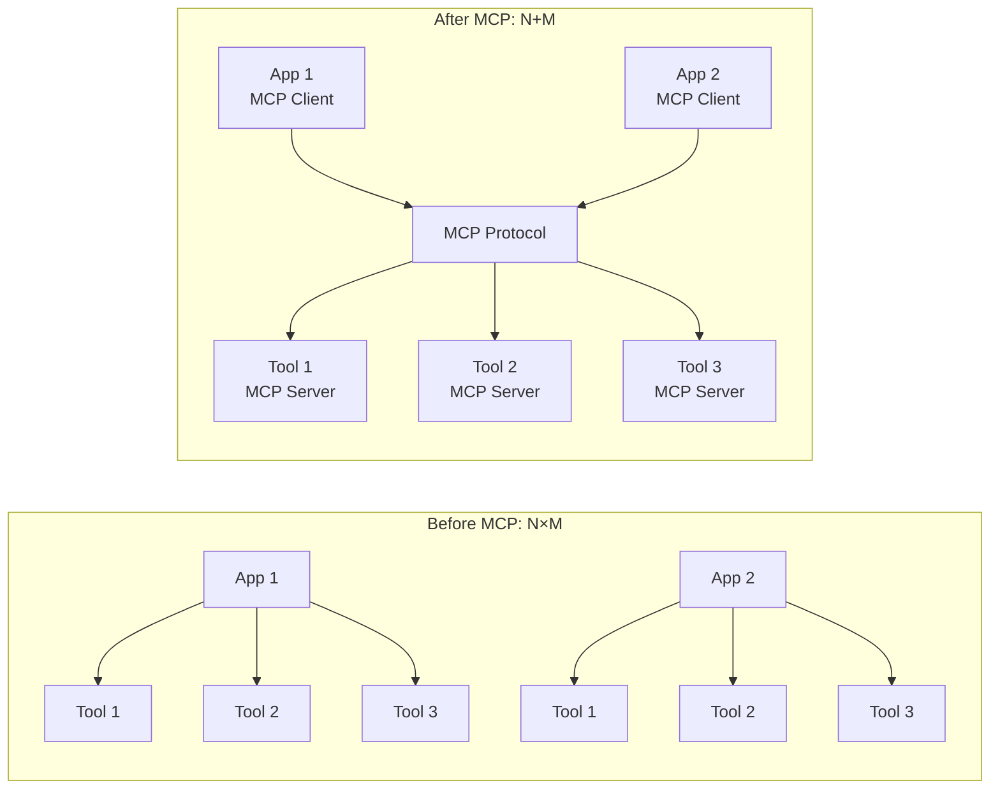
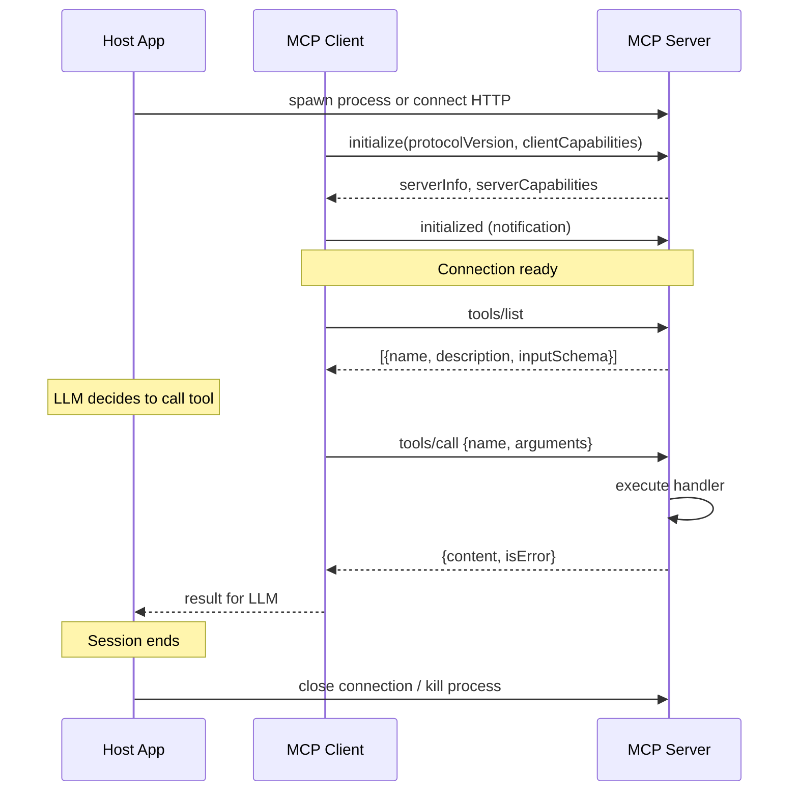
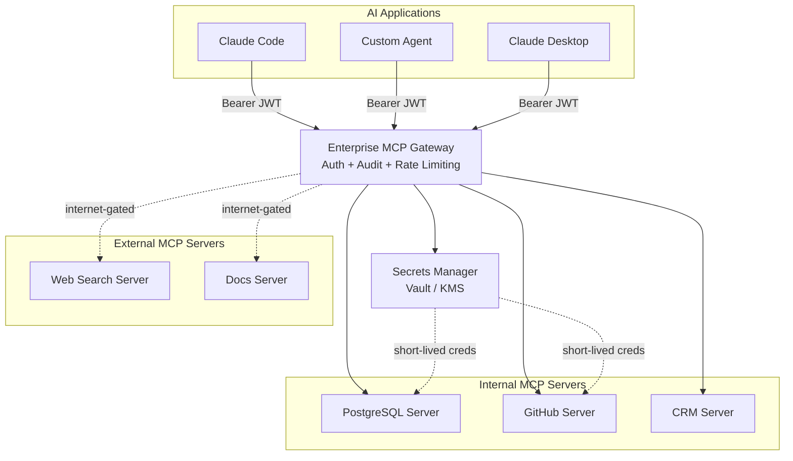

# Module 05 — Model Context Protocol (MCP)

> **Phase 2 — Core Agent Engineering** | Prerequisites: [Module 03 — Agent Components](03-agent-components.md)

MCP solves the N×M integration problem: N AI applications needing to connect to M tools and data sources. Without a standard, every AI app writes its own connectors for every tool — N×M custom integrations. MCP defines one protocol, so each AI app needs one MCP client and each tool needs one MCP server.

---

## Table of Contents
1. [What It Is](#what-it-is)
2. [Why It Exists](#why-it-exists)
3. [Internal Architecture](#internal-architecture)
4. [How It Works](#how-it-works)
5. [Real-World Use Cases](#real-world-use-cases)
6. [Production Implementation](#production-implementation)
7. [Code Examples](#code-examples)
8. [Architecture Diagrams](#architecture-diagrams)
9. [Best Practices](#best-practices)
10. [Common Mistakes](#common-mistakes)
11. [Failure Modes](#failure-modes)
12. [Security Considerations](#security-considerations)
13. [Performance Considerations](#performance-considerations)
14. [Scalability Considerations](#scalability-considerations)
15. [Cost Considerations](#cost-considerations)
16. [Enterprise Recommendations](#enterprise-recommendations)
17. [When to Use / When Not to Use](#when-to-use--when-not-to-use)
18. [Trade-offs & Architectural Decisions](#trade-offs--architectural-decisions)
19. [Key Takeaways](#key-takeaways)

---

## What It Is

**Model Context Protocol (MCP)** is an open protocol for connecting AI applications (hosts) to data sources, tools, and services (servers) through a standardized JSON-RPC interface. Introduced by Anthropic in November 2024, it provides:

- A **wire protocol** (JSON-RPC 2.0 over stdio or HTTP/SSE)
- Three **primitive types**: Tools (actions), Resources (data), Prompts (templates)
- A **capability negotiation** mechanism so clients and servers advertise what they support
- A **security boundary**: the server runs with its own permissions; the LLM never directly executes code

Think of it as the USB standard for AI tools — instead of every device needing custom drivers, one standard port connects everything.

---

## Why It Exists

### The N×M Problem

Before MCP, every team building an AI assistant had to:
- Write a Slack connector, a GitHub connector, a Postgres connector, ...
- Each connector was custom per-application
- A GitHub connector for Claude Code was incompatible with one for Claude Desktop was incompatible with one for a custom LangChain agent

With N=50 AI applications and M=100 tools, you need 5,000 custom integrations.

With MCP: N AI apps each need one MCP client. M tools each need one MCP server. Total: N+M = 150.

### Context as First-Class Concern

MCP's name reflects the insight that the bottleneck in LLM applications is not the model — it's providing the *right context* to the model at the right time. MCP formalizes the mechanisms by which context (data + capabilities) reaches the model.

---

## Internal Architecture

### Roles

| Role | Description | Examples |
|------|-------------|---------|
| **Host** | The AI application process; manages MCP client connections | Claude Desktop, Claude Code, custom apps |
| **Client** | Lives inside the host; maintains a 1:1 connection to one MCP server | One client per server |
| **Server** | Exposes tools, resources, and prompts; runs in a separate process with its own permissions | GitHub MCP server, Postgres MCP server |

### Primitives

| Primitive | Direction | Description |
|-----------|-----------|-------------|
| **Tools** | Server → Client → LLM | Functions the LLM can call; model-controlled |
| **Resources** | Server → Client | Data the application can read; application-controlled |
| **Prompts** | Server → Client | Reusable prompt templates; user-controlled |

The distinction between Tools and Resources is about who decides to use them: the LLM decides to call a tool; the application decides to load a resource.

### Transport Layers

| Transport | Description | Use Case |
|-----------|-------------|---------|
| **stdio** | Server is a child process; communication over stdin/stdout | Local tools (filesystem, CLI) |
| **Streamable HTTP** | Server is an HTTP service; SSE for server→client streaming | Remote tools, cloud services, multi-tenant |

---

## How It Works

### Connection Lifecycle

```
1. Host spawns or connects to MCP server
2. Client sends: initialize(protocolVersion, capabilities)
3. Server responds: serverInfo, capabilities
4. Client sends: initialized (notification)
5. [Connection is now ready]
6. Client sends: tools/list
7. Server responds: [{name, description, inputSchema}, ...]
8. [LLM decides to call a tool]
9. Client sends: tools/call {name, arguments}
10. Server executes, responds: {content: [...], isError: false}
11. Client returns result to LLM
```

### JSON-RPC Message Examples

**tools/list request:**
```json
{"jsonrpc": "2.0", "id": 1, "method": "tools/list"}
```

**tools/list response:**
```json
{
  "jsonrpc": "2.0", "id": 1,
  "result": {
    "tools": [{
      "name": "read_file",
      "description": "Read the contents of a file at a given path",
      "inputSchema": {
        "type": "object",
        "properties": {
          "path": {"type": "string", "description": "Absolute file path"}
        },
        "required": ["path"]
      }
    }]
  }
}
```

**tools/call request:**
```json
{
  "jsonrpc": "2.0", "id": 2,
  "method": "tools/call",
  "params": {"name": "read_file", "arguments": {"path": "/etc/hosts"}}
}
```

**tools/call response:**
```json
{
  "jsonrpc": "2.0", "id": 2,
  "result": {
    "content": [{"type": "text", "text": "127.0.0.1 localhost\n..."}],
    "isError": false
  }
}
```

### Sampling (Server-Initiated LLM Calls)

Servers can request the host to run an LLM call on their behalf via `sampling/createMessage`. This enables servers that need AI reasoning without having their own LLM connection. The host maintains control over which models are used and what context is passed — servers cannot directly access the main conversation.

---

## Real-World Use Cases

- **Claude Code** uses MCP to connect to filesystem, terminal, and IDE tools
- **Enterprise ChatBot** uses MCP servers for CRM, ticketing, and internal KB
- **Security Copilot** uses MCP to connect to SIEM, threat intel feeds, and asset inventory
- **Coding Agent** uses MCP to connect to GitHub, package registries, and CI systems
- **Research Agent** uses MCP to connect to web search, arxiv, and internal document stores

---

## Production Implementation

### Building an MCP Server with FastMCP

```python
# github_mcp_server.py
# Install: pip install mcp httpx

from mcp.server.fastmcp import FastMCP
import httpx
import os

mcp = FastMCP("github-tools")

GITHUB_TOKEN = os.environ["GITHUB_TOKEN"]
HEADERS = {
    "Authorization": f"Bearer {GITHUB_TOKEN}",
    "Accept": "application/vnd.github.v3+json",
}

@mcp.tool()
async def list_pull_requests(
    owner: str,
    repo: str,
    state: str = "open"
) -> str:
    """
    List pull requests for a GitHub repository.
    state: 'open', 'closed', or 'all'
    """
    async with httpx.AsyncClient() as client:
        response = await client.get(
            f"https://api.github.com/repos/{owner}/{repo}/pulls",
            headers=HEADERS,
            params={"state": state, "per_page": 20},
        )
        response.raise_for_status()
        prs = response.json()
        return "\n".join(
            f"#{pr['number']}: {pr['title']} ({pr['user']['login']})"
            for pr in prs
        )

@mcp.tool()
async def get_file_contents(
    owner: str,
    repo: str,
    path: str,
    ref: str = "main"
) -> str:
    """
    Read a file from a GitHub repository.
    Returns the decoded file contents as text.
    """
    import base64
    async with httpx.AsyncClient() as client:
        response = await client.get(
            f"https://api.github.com/repos/{owner}/{repo}/contents/{path}",
            headers=HEADERS,
            params={"ref": ref},
        )
        response.raise_for_status()
        data = response.json()
        if data.get("encoding") == "base64":
            return base64.b64decode(data["content"]).decode("utf-8")
        return data.get("content", "")

@mcp.tool()
async def create_issue_comment(
    owner: str,
    repo: str,
    issue_number: int,
    body: str
) -> str:
    """
    Post a comment on a GitHub issue or pull request.
    Requires write permission to the repository.
    """
    async with httpx.AsyncClient() as client:
        response = await client.post(
            f"https://api.github.com/repos/{owner}/{repo}/issues/{issue_number}/comments",
            headers=HEADERS,
            json={"body": body},
        )
        response.raise_for_status()
        return f"Comment posted: {response.json()['html_url']}"

@mcp.resource("github://repos/{owner}/{repo}/readme")
async def get_readme(owner: str, repo: str) -> str:
    """Expose the repository README as a resource."""
    import base64
    async with httpx.AsyncClient() as client:
        response = await client.get(
            f"https://api.github.com/repos/{owner}/{repo}/readme",
            headers=HEADERS,
        )
        response.raise_for_status()
        data = response.json()
        return base64.b64decode(data["content"]).decode("utf-8")

if __name__ == "__main__":
    mcp.run(transport="stdio")
```

### Enterprise MCP Gateway Pattern

For enterprise deployments, a gateway sits between AI applications and MCP servers, providing centralized auth, logging, and rate limiting:

```python
# enterprise_mcp_gateway.py
# Proxies MCP connections with auth, audit logging, and rate limiting.

from fastapi import FastAPI, HTTPException, Header, Request
from fastapi.responses import StreamingResponse
import httpx
import json
import time
import logging
from typing import Optional

logger = logging.getLogger(__name__)
app = FastAPI(title="MCP Gateway")

# Server registry: server_name -> upstream_url
SERVER_REGISTRY = {
    "github": "http://github-mcp-server:8080",
    "postgres": "http://postgres-mcp-server:8080",
    "slack": "http://slack-mcp-server:8080",
}

# Permissions: agent_type -> allowed_servers
PERMISSIONS = {
    "support-agent": {"postgres"},
    "coding-agent": {"github", "postgres"},
    "research-agent": {"github"},
}

async def verify_agent_token(token: str) -> dict:
    """Verify JWT token and return {agent_type, agent_id, tenant_id}."""
    # In production: validate JWT against your identity provider
    if token == "test-token":
        return {"agent_type": "coding-agent", "agent_id": "agent-1", "tenant_id": "tenant-1"}
    raise HTTPException(status_code=401, detail="Invalid token")

@app.post("/mcp/{server_name}")
async def proxy_mcp_request(
    server_name: str,
    request: Request,
    authorization: Optional[str] = Header(None),
):
    if not authorization or not authorization.startswith("Bearer "):
        raise HTTPException(status_code=401, detail="Missing token")

    token = authorization.removeprefix("Bearer ")
    agent_ctx = await verify_agent_token(token)

    # Check permissions
    allowed = PERMISSIONS.get(agent_ctx["agent_type"], set())
    if server_name not in allowed:
        logger.warning("Permission denied: %s cannot access %s", agent_ctx["agent_type"], server_name)
        raise HTTPException(status_code=403, detail=f"Agent type '{agent_ctx['agent_type']}' cannot access '{server_name}'")

    upstream = SERVER_REGISTRY.get(server_name)
    if not upstream:
        raise HTTPException(status_code=404, detail=f"Unknown server: {server_name}")

    body = await request.json()

    # Audit log before forwarding
    logger.info("MCP call | agent=%s | server=%s | method=%s",
                agent_ctx["agent_id"], server_name, body.get("method"))

    # Forward to upstream MCP server
    async with httpx.AsyncClient(timeout=30.0) as client:
        resp = await client.post(upstream, json=body)

    # Audit log response
    logger.info("MCP result | agent=%s | server=%s | status=%d",
                agent_ctx["agent_id"], server_name, resp.status_code)

    return resp.json()
```

### MCP Client in Python

```python
# Using the MCP SDK's client programmatically
import asyncio
from mcp import ClientSession, StdioServerParameters
from mcp.client.stdio import stdio_client

async def use_mcp_server():
    """Connect to a local MCP server and call its tools."""
    server_params = StdioServerParameters(
        command="python",
        args=["github_mcp_server.py"],
        env={"GITHUB_TOKEN": "ghp_..."},
    )

    async with stdio_client(server_params) as (read, write):
        async with ClientSession(read, write) as session:
            # Initialize
            await session.initialize()

            # Discover tools
            tools_result = await session.list_tools()
            print("Available tools:", [t.name for t in tools_result.tools])

            # Call a tool
            result = await session.call_tool(
                "list_pull_requests",
                arguments={"owner": "anthropics", "repo": "anthropic-sdk-python"}
            )
            print("Tool result:", result.content[0].text)

asyncio.run(use_mcp_server())
```

---

## Architecture Diagrams

### MCP N×M Problem Solved



### MCP Connection Lifecycle



### Enterprise MCP Architecture



---

## Best Practices

1. **One server per concern.** A "database server" that exposes both read and write operations is risky. Create a "database-read server" and "database-write server" separately. Grant AI agents only the read server unless writes are required.
2. **Short-lived credentials.** MCP servers should obtain credentials from a secrets manager (Vault, AWS Secrets Manager) at startup or per-request, not embed them in config files.
3. **Validate tool inputs server-side.** The MCP server receives inputs from the AI app. Even if the client validated against the JSON schema, validate again server-side. The JSON schema in `inputSchema` is documentation for the LLM; server-side validation is defense.
4. **Use the enterprise gateway pattern for multi-tenant.** A gateway provides centralized auth, per-agent permission enforcement, rate limiting, and audit logging. Never let AI apps connect directly to production MCP servers.
5. **Log all tool calls with structured context.** Log: agent_id, tenant_id, tool_name, input_args_hash (not the args themselves if PII-sensitive), duration_ms, is_error.
6. **Set timeouts on every tool handler.** A hanging tool blocks the agent loop. Default timeout: 30s for fast tools, 120s for slow operations.
7. **Describe tools precisely for the LLM.** The `description` field in the tool schema is what the LLM reads. Ambiguous descriptions cause wrong tool selection. Include: what the tool does, what it returns, when to use it, and any preconditions.

---

## Common Mistakes

| Mistake | Impact | Fix |
|---------|--------|-----|
| Embedding credentials in server process env without rotation | Credential leak has long blast radius | Use short-lived creds from Vault; rotate every 15 minutes |
| No input validation server-side | Malicious inputs bypass LLM-level filtering | Validate all inputs with Pydantic or equivalent before executing |
| Single MCP server for all tools | One compromised server = access to all tools | Separate servers by trust level and scope |
| No timeout on tool handlers | Hanging handler blocks agent indefinitely | Wrap all handlers in `asyncio.wait_for(..., timeout=30)` |
| Returning raw stack traces as errors | Leaks internal system details to LLM (and potentially to users) | Return sanitized error messages; log full details server-side |
| Not versioning tool schemas | Tool schema changes break running agents | Version schemas (v1, v2); maintain backwards compatibility |
| Ignoring MCP protocol version negotiation | Client/server incompatibility | Always check `protocolVersion` in `initialize`; reject unsupported versions gracefully |

---

## Failure Modes

| Failure | Symptom | Root Cause | Detection | Mitigation |
|---------|---------|-----------|-----------|------------|
| Server crash mid-session | Tool call returns connection error | Server process dies (OOM, bug) | Health check endpoint; alert on process exit | Supervisor process (systemd/k8s); auto-restart |
| Tool poisoning | Agent takes unexpected actions | Malicious server returns instructions in tool descriptions | Audit tool descriptions at connection time; compare to baseline | Allowlist of approved MCP servers; server signing |
| Auth token passthrough | Agent's token used to call unauthorized tools | Gateway passes token to upstream without re-checking permissions | Audit logs show cross-server calls | Gateway re-checks permissions per tool call, not just per connection |
| Resource explosion | Agent loops calling expensive tools repeatedly | No per-agent tool call budget | Count tool calls per task; alert on high call rate | Per-task tool call budget; kill switch at N calls |
| Transport hang | Tool call never returns | stdio server blocked; HTTP connection dropped | Per-call timeout | timeout + kill/reconnect |
| Schema drift | LLM generates wrong tool arguments | Tool schema updated without notifying clients | Schema version mismatch error in tool call | Version tool schemas; reject incompatible calls |

---

## Security Considerations

### Confused Deputy Attack
An MCP server acts as a deputy for the AI application. If the server has permissions the AI application should not have (e.g., write access to a database the AI should only read), and a malicious prompt tricks the AI into calling the server, the server executes the write with its own credentials. Mitigation: design server permissions at the level the AI should have, not the level the integration requires.

### Tool Poisoning / Rug Pulls
A malicious MCP server can:
1. Return legitimate tool descriptions during connection negotiation
2. Later return instructions embedded in tool results that redirect the agent's behavior
3. Change tool descriptions between `tools/list` calls (rug pull)

Defenses:
- Cache tool descriptions at connection time; alert if they change
- Never embed tool result content directly into the system prompt slot
- Use the enterprise gateway to verify server identity (TLS certificate pinning, signed manifests)

### Indirect Prompt Injection via Resources
MCP resources (files, database rows, web pages) may contain text crafted to look like instructions. When the agent reads a resource and uses its content in subsequent LLM context, that content can contain injection payloads.

Defenses:
- Wrap all resource content in explicit data delimiters
- Validate that the agent's subsequent tool calls don't deviate from the task goal

### OAuth 2.1 for Remote MCP Servers
For remote HTTP-based MCP servers, use OAuth 2.1 with PKCE:
- AI application (client) implements PKCE flow
- MCP server validates bearer tokens on every request
- Use resource indicators (RFC 8707) to prevent token redirect attacks
- Tokens must be scoped to the specific MCP server (audience restriction)

---

## Performance Considerations

- **Connection pooling.** Keep MCP connections alive across agent turns rather than creating a new connection per tool call. Stdio server spawn time is ~200-500ms.
- **Tool schema caching.** Call `tools/list` once at connection time and cache. Only refresh if the server signals a `tools/list_changed` notification.
- **Async tool execution.** When multiple tool calls are independent, dispatch them concurrently via the MCP client.
- **Result size limits.** MCP tools can return large content. The MCP server should paginate or truncate large results before returning. Set a max content size in your gateway (e.g., 50KB per tool result).

---

## Scalability Considerations

- **Stateless HTTP MCP servers** scale horizontally. Each request is independent.
- **Stdio MCP servers** are one-process-per-client. For multi-agent deployments, each agent runner spawns its own server process. This scales with agent count but consumes OS resources.
- **Gateway fan-out.** A single AI application may need 10+ MCP servers. The gateway handles connection management; the AI app has one connection to the gateway.
- **Per-tenant isolation.** In multi-tenant SaaS, each tenant's MCP connections should have separate credentials and separate rate limits.

---

## Cost Considerations

MCP itself has no token cost — it's a transport protocol. Cost comes from:
- **Tool result size.** Large tool results (10K+ tokens) are the primary cost driver. Optimize servers to return concise, structured results.
- **Number of tool calls.** Each tool call adds a round trip. An agent calling 20 tools in 10 turns vs 5 tools in 10 turns has 4× the tool latency.
- **Server hosting.** For HTTP MCP servers, compute cost for the server processes themselves.

---

## Enterprise Recommendations

1. **Maintain an internal MCP server catalog.** Document every approved server: owner, capabilities, authorization requirements, SLA, security review status.
2. **Require security review for new MCP servers.** Before any MCP server is made available to AI agents, review its tool permissions, input validation, credential handling, and audit logging.
3. **Enforce MCP through the gateway.** Never allow direct connections to production MCP servers from AI applications.
4. **Classify tools by risk.** Read-only tools (low risk), write tools (medium risk), external-communication tools (high risk), financial/irreversible tools (requires explicit approval).
5. **Audit MCP calls.** Log every tools/call with: timestamp, agent_id, tenant_id, server_name, tool_name, argument summary, result summary, latency. Retain for 90 days minimum.

---

## When to Use / When Not to Use

**Use MCP when:**
- You are building an AI application that needs to connect to multiple tools or data sources
- You want to reuse tools across multiple AI applications
- You need standardized auth, logging, and permission enforcement for AI tool access
- Your organization is adopting an AI platform and needs governance over tool access

**Don't use MCP when:**
- You have a single AI application with one or two simple, static tool integrations — direct Python function calls are simpler
- You're building a proof-of-concept and governance overhead isn't justified yet
- Your tools are pure compute with no external I/O (no need for a protocol)

---

## Trade-offs & Architectural Decisions

### stdio vs HTTP transport
- **stdio**: simpler, no port management, process isolation, works offline — best for local tools
- **HTTP/SSE**: scales independently, deployable as microservice, supports multi-tenant — best for enterprise
- Most production systems use stdio for local development and HTTP for production

### Build your own MCP server vs use existing?
- **Existing servers**: faster to get started; may not match your exact data shape or permissions model
- **Build**: full control over schema, permissions, result format; upfront cost
- Rule: use existing servers for well-known standard tools (GitHub, Slack); build custom for internal systems

### Single large server vs many small servers?
- **Large**: fewer connections, simpler gateway config
- **Small**: better isolation, easier to grant least-privilege access, independent scaling
- Rule: one server per security boundary or ownership domain

---

## Key Takeaways

- MCP solves the N×M integration problem by standardizing the protocol between AI apps and tools.
- Three primitives: Tools (LLM-controlled), Resources (app-controlled), Prompts (user-controlled).
- Two transports: stdio (local) and HTTP/SSE (remote/cloud).
- The enterprise gateway pattern is essential for production: centralized auth, per-agent permissions, audit logging.
- Security: confused deputy, tool poisoning, and injection via resources are the main attack vectors.
- Validate tool inputs server-side regardless of client-side schema enforcement.
- Short-lived credentials from a secrets manager — never embed in config.
- MCP is a protocol layer; cost comes from tool result sizes and call frequency, not from MCP itself.

## Further Study

- Model Context Protocol specification (spec.modelcontextprotocol.io)
- MCP Python SDK (mcp) — FastMCP server builder
- OAuth 2.1 RFC draft and PKCE specification
- RFC 8707: Resource Indicators for OAuth 2.0
- OWASP LLM Top 10 — Tool Abuse section
- Anthropic's MCP introduction blog post
- A2A Protocol (Google) — complementary agent communication standard
