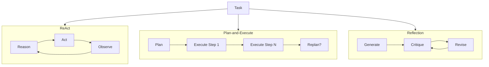
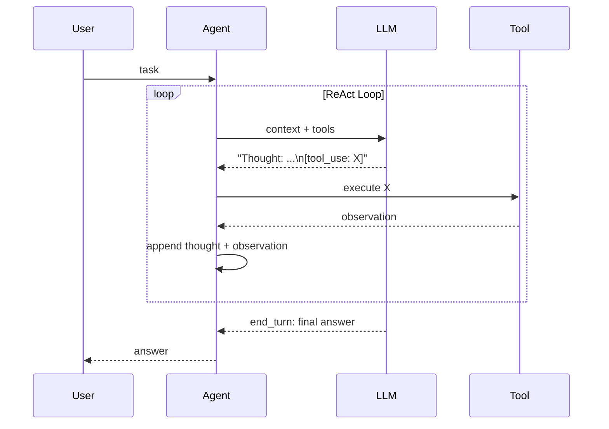
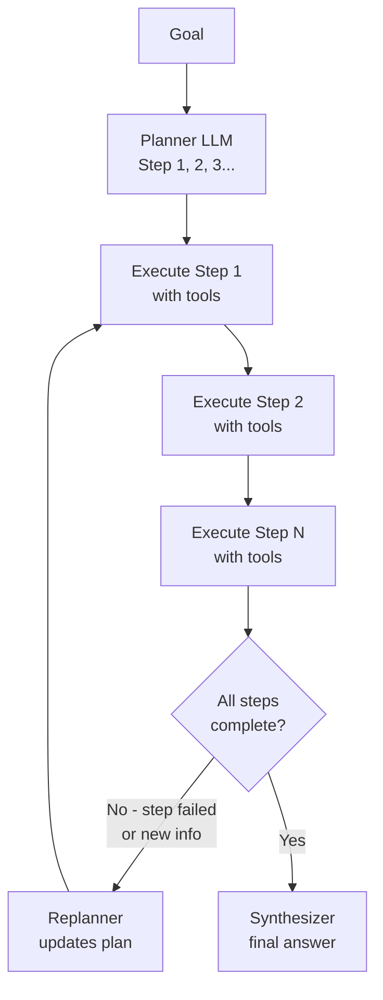
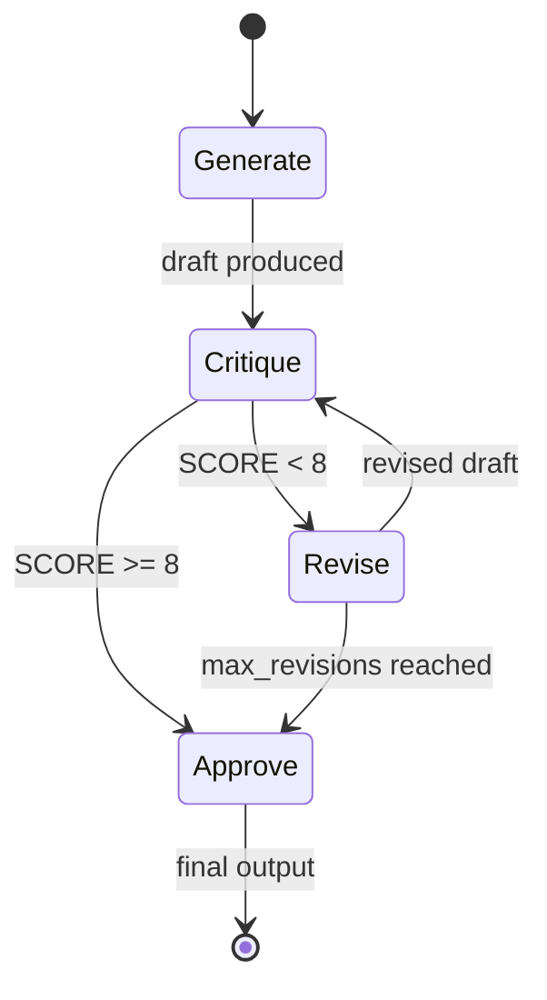

# Module 08 — Agent Design Patterns

> **Phase 2 — Core Agent Engineering** | Prerequisites: [Module 02 — Agent Fundamentals](02-agent-fundamentals.md), [Module 07 — RAG](07-rag.md)

Patterns are recurring solutions to recurring problems. Six agent design patterns cover ~95% of real-world agent architectures. Knowing when to apply each — and when not to — separates architects from developers.

---

## Table of Contents
1. [What It Is](#what-it-is)
2. [Why It Exists](#why-it-exists)
3. [Internal Architecture](#internal-architecture)
4. [How It Works](#how-it-works)
5. [Real-World Use Cases](#real-world-use-cases)
6. [Production Implementation](#production-implementation)
7. [Code Examples](#code-examples)
8. [Architecture Diagrams](#architecture-diagrams)
9. [Best Practices](#best-practices)
10. [Common Mistakes](#common-mistakes)
11. [Failure Modes](#failure-modes)
12. [Security Considerations](#security-considerations)
13. [Performance Considerations](#performance-considerations)
14. [Scalability Considerations](#scalability-considerations)
15. [Cost Considerations](#cost-considerations)
16. [Enterprise Recommendations](#enterprise-recommendations)
17. [When to Use / When Not to Use](#when-to-use--when-not-to-use)
18. [Trade-offs & Architectural Decisions](#trade-offs--architectural-decisions)
19. [Key Takeaways](#key-takeaways)

---

## What It Is

Agent design patterns are named architectural structures that govern how an agent (or multiple agents) organizes its reasoning and actions. Each pattern makes different trade-offs between:

- **Latency** (how many LLM calls before an answer)
- **Cost** (total token spend per task)
- **Reliability** (failure rate on complex tasks)
- **Controllability** (can you inspect and override mid-execution)

| Pattern | Core Idea | Best For |
|---------|-----------|---------|
| **ReAct** | Interleave reasoning traces and tool calls | General-purpose; most versatile |
| **Plan-and-Execute** | Plan first, then execute step-by-step | Long, structured tasks |
| **Reflection** | Generator + critic loop | Quality-critical output |
| **Tree of Thoughts** | Explore multiple reasoning branches | Hard problems; exploratory search |
| **Self-Healing** | Detect and recover from errors automatically | Unreliable environments |
| **Router** | Route task to the best specialist | Multi-capability systems |

---

## Why It Exists

Without patterns, every agent is a snowflake. Patterns provide:
- **Shared vocabulary** for design reviews
- **Proven structures** with known failure modes
- **Decision criteria** to choose between approaches
- **Composability** — patterns stack and nest

---

## Internal Architecture

### Pattern Comparison



---

## How It Works

### Pattern 1 — ReAct

ReAct (Reason + Act) interleaves reasoning traces with tool calls. Before each tool call, the model writes a brief thought explaining *why* it's calling the tool. After observing the result, it writes another thought before deciding the next action.

**Why the "thought" matters:** The written reasoning forces the model to commit to an interpretation before acting. Without it, the model can generate tool calls that are internally inconsistent.

```
Thought: I need to find the current stock price of AAPL. I'll use the stock_lookup tool.
Action: stock_lookup({"symbol": "AAPL"})
Observation: {"price": 182.35, "change": "+1.2%"}
Thought: I have the price. The user also asked about P/E ratio, which I don't have yet.
Action: fundamentals_lookup({"symbol": "AAPL"})
Observation: {"pe_ratio": 28.5, "eps": 6.43}
Thought: I now have all the information needed to answer.
Answer: AAPL is trading at $182.35 (+1.2%) with a P/E ratio of 28.5.
```

### Pattern 2 — Plan-and-Execute

A planning step runs first to produce an explicit numbered plan. The execution phase works through the plan, calling tools for each step. If a step fails or produces unexpected results, a replanning step can revise the remaining plan.

**When to use:** Tasks where the decomposition is knowable upfront (data processing pipelines, multi-step research, incident response runbooks).

**When NOT to use:** Tasks where each step reveals new information that changes the plan. ReAct handles these better because it adapts on every step.

### Pattern 3 — Reflection (Generator + Critic)

Two LLM calls: a **generator** produces a draft; a **critic** evaluates it against criteria and produces feedback; the generator revises. The loop continues until the critic is satisfied or a max-revision limit is hit.

**Why two calls instead of one with self-critique?** Using a separate critic call (often a different prompt or model) reduces confirmation bias. An LLM critiquing its own output in the same context tends to agree with itself.

### Pattern 4 — Tree of Thoughts

Instead of one reasoning path, the agent explores multiple reasoning branches in parallel (or sequentially), evaluates them, and pursues the most promising. Useful when:
- Multiple valid approaches exist and the best is unknown upfront
- The search space is wide (e.g., mathematical problem-solving, strategic planning)

**Cost warning:** ToT multiplies LLM calls by the branching factor. Use judiciously.

### Pattern 5 — Self-Healing Agent

The agent wraps all tool executions in a recovery layer that:
1. Classifies errors (transient vs permanent vs logical)
2. Applies the appropriate recovery strategy (retry, fallback, replan, escalate)
3. Tracks error history to avoid repeat failures

### Pattern 6 — Router

A lightweight LLM call (or a classifier) routes the task to the most appropriate specialized agent or tool. The router doesn't execute the task — it delegates.

---

## Real-World Use Cases

- **ReAct**: customer support agent, research assistant, coding helper — any open-ended task
- **Plan-and-Execute**: incident response (execute a runbook), data migration, multi-step report generation
- **Reflection**: content generation, code review, document drafting where quality matters
- **Tree of Thoughts**: security threat modeling, architectural decision making, complex math
- **Self-Healing**: production automation agents operating in flaky environments (APIs, filesystems)
- **Router**: multi-persona chatbot, tiered support system, domain-specific assistant fleet

---

## Production Implementation

### ReAct from Scratch

```python
import anthropic
import json

client = anthropic.Anthropic()

REACT_SYSTEM = """You are a helpful assistant that uses tools to answer questions.

Before each tool call, write a brief thought explaining your reasoning.
Use this format:
Thought: [your reasoning]
Then use the tool.

When you have enough information, provide a final answer."""

def react_agent(
    task: str,
    tools: list[dict],
    tool_handlers: dict,
    max_turns: int = 15,
) -> str:
    messages = [{"role": "user", "content": task}]
    
    for turn in range(max_turns):
        response = client.messages.create(
            model="claude-sonnet-4-6",
            max_tokens=2048,
            system=REACT_SYSTEM,
            tools=tools,
            messages=messages,
        )
        
        messages.append({"role": "assistant", "content": response.content})
        
        if response.stop_reason == "end_turn":
            for block in response.content:
                if hasattr(block, "text"):
                    return block.text
        
        if response.stop_reason == "tool_use":
            tool_results = []
            for block in response.content:
                if block.type != "tool_use":
                    continue
                handler = tool_handlers.get(block.name)
                if handler:
                    try:
                        result = handler(**block.input)
                        is_error = False
                    except Exception as e:
                        result = f"Error: {e}"
                        is_error = True
                else:
                    result = f"Unknown tool: {block.name}"
                    is_error = True
                
                tool_results.append({
                    "type": "tool_result",
                    "tool_use_id": block.id,
                    "content": str(result)[:4000],
                    "is_error": is_error,
                })
            messages.append({"role": "user", "content": tool_results})
    
    return "Task incomplete: turn budget exhausted"
```

### Plan-and-Execute Agent

```python
from dataclasses import dataclass

@dataclass
class ExecutionPlan:
    steps: list[str]
    current_step: int = 0
    completed_results: list[str] = None
    
    def __post_init__(self):
        if self.completed_results is None:
            self.completed_results = []
    
    @property
    def current(self) -> str | None:
        if self.current_step < len(self.steps):
            return self.steps[self.current_step]
        return None
    
    @property
    def is_complete(self) -> bool:
        return self.current_step >= len(self.steps)

PLANNER_SYSTEM = """You are a task planner. Given a goal, produce a numbered list of specific, executable steps.
Each step should be concrete and achievable with the available tools.
Output only the numbered list, one step per line."""

EXECUTOR_SYSTEM = """You are a task executor. Complete the given step using the available tools.
Be concise — focus on completing this specific step, not the entire task."""

def plan_and_execute(
    goal: str,
    tools: list[dict],
    tool_handlers: dict,
    max_replan: int = 2,
) -> str:
    # Planning phase
    plan_response = client.messages.create(
        model="claude-sonnet-4-6",
        max_tokens=1000,
        system=PLANNER_SYSTEM,
        messages=[{"role": "user", "content": f"Goal: {goal}\n\nAvailable tools: {[t['name'] for t in tools]}"}],
    )
    
    plan_text = plan_response.content[0].text
    steps = [line.strip() for line in plan_text.split('\n')
             if line.strip() and line.strip()[0].isdigit()]
    plan = ExecutionPlan(steps=steps)
    
    # Execution phase
    replans = 0
    while not plan.is_complete:
        step = plan.current
        context = f"Goal: {goal}\n\nStep to complete: {step}"
        if plan.completed_results:
            context += f"\n\nPrevious results:\n" + \
                      "\n".join(f"Step {i+1}: {r}" for i, r in enumerate(plan.completed_results))
        
        # Execute one step with the executor
        messages = [{"role": "user", "content": context}]
        result = "Step incomplete"
        
        for _ in range(5):  # inner loop for one step
            resp = client.messages.create(
                model="claude-sonnet-4-6",
                max_tokens=1024,
                system=EXECUTOR_SYSTEM,
                tools=tools,
                messages=messages,
            )
            messages.append({"role": "assistant", "content": resp.content})
            
            if resp.stop_reason == "end_turn":
                for block in resp.content:
                    if hasattr(block, "text"):
                        result = block.text
                break
            
            if resp.stop_reason == "tool_use":
                tool_results = []
                for block in resp.content:
                    if block.type != "tool_use":
                        continue
                    handler = tool_handlers.get(block.name)
                    r = handler(**block.input) if handler else "Unknown tool"
                    tool_results.append({
                        "type": "tool_result",
                        "tool_use_id": block.id,
                        "content": str(r)[:2000],
                        "is_error": handler is None,
                    })
                messages.append({"role": "user", "content": tool_results})
        
        plan.completed_results.append(result)
        plan.current_step += 1
    
    # Synthesize final answer
    synthesis_prompt = (
        f"Goal: {goal}\n\nCompleted steps and results:\n" +
        "\n".join(f"Step {i+1} ({plan.steps[i]}): {r}"
                  for i, r in enumerate(plan.completed_results)) +
        "\n\nSynthesize a final answer from these results."
    )
    final = client.messages.create(
        model="claude-sonnet-4-6",
        max_tokens=2000,
        messages=[{"role": "user", "content": synthesis_prompt}],
    )
    return final.content[0].text


### Reflection Pattern

```python
def reflection_agent(
    task: str,
    criteria: str,
    max_revisions: int = 3,
) -> tuple[str, list[str]]:
    """
    Generator + critic loop.
    Returns (final_output, revision_history).
    """
    GENERATOR_SYSTEM = "You are an expert writer. Produce high-quality output for the given task."
    CRITIC_SYSTEM = f"""You are a critic. Evaluate the given output against these criteria:
{criteria}

Respond with:
SCORE: [1-10]
ISSUES: [list specific problems]
APPROVED: [YES/NO]
FEEDBACK: [actionable suggestions for improvement]"""

    revision_history = []
    
    # Initial generation
    gen_resp = client.messages.create(
        model="claude-sonnet-4-6",
        max_tokens=2000,
        system=GENERATOR_SYSTEM,
        messages=[{"role": "user", "content": task}],
    )
    current_output = gen_resp.content[0].text
    revision_history.append(current_output)
    
    for revision in range(max_revisions):
        # Critique
        critic_resp = client.messages.create(
            model="claude-sonnet-4-6",
            max_tokens=1000,
            system=CRITIC_SYSTEM,
            messages=[{"role": "user", "content": f"Task: {task}\n\nOutput to evaluate:\n{current_output}"}],
        )
        critique = critic_resp.content[0].text
        
        if "APPROVED: YES" in critique:
            break
        
        # Revise
        revise_resp = client.messages.create(
            model="claude-sonnet-4-6",
            max_tokens=2000,
            system=GENERATOR_SYSTEM,
            messages=[
                {"role": "user", "content": task},
                {"role": "assistant", "content": current_output},
                {"role": "user", "content": f"Please revise based on this feedback:\n{critique}"},
            ],
        )
        current_output = revise_resp.content[0].text
        revision_history.append(current_output)
    
    return current_output, revision_history


### Self-Healing Tool Executor

```python
import time
from enum import Enum

class ErrorClass(Enum):
    TRANSIENT = "transient"   # retry with backoff
    RATE_LIMIT = "rate_limit"  # retry after delay
    LOGICAL = "logical"        # change approach
    PERMANENT = "permanent"    # escalate

def classify_error(error_msg: str) -> ErrorClass:
    msg = error_msg.lower()
    if any(w in msg for w in ["timeout", "connection", "temporarily"]):
        return ErrorClass.TRANSIENT
    if any(w in msg for w in ["rate limit", "429", "too many requests"]):
        return ErrorClass.RATE_LIMIT
    if any(w in msg for w in ["not found", "does not exist", "invalid"]):
        return ErrorClass.LOGICAL
    return ErrorClass.PERMANENT

def self_healing_execute(
    tool_name: str,
    tool_args: dict,
    handler,
    max_retries: int = 3,
    fallback_handler=None,
) -> tuple[str, bool]:
    """
    Execute a tool with self-healing recovery.
    Returns (result, is_error).
    """
    for attempt in range(max_retries):
        try:
            result = handler(**tool_args)
            return str(result), False
        except Exception as e:
            error_class = classify_error(str(e))
            
            if error_class == ErrorClass.TRANSIENT:
                backoff = 0.5 * (2 ** attempt)
                time.sleep(backoff)
                continue
            
            elif error_class == ErrorClass.RATE_LIMIT:
                time.sleep(60)  # Wait 1 minute
                continue
            
            elif error_class == ErrorClass.LOGICAL:
                if fallback_handler:
                    try:
                        result = fallback_handler(**tool_args)
                        return str(result), False
                    except Exception as fe:
                        return f"Logical error (fallback also failed): {fe}", True
                return f"Logical error: {e}", True
            
            else:  # PERMANENT
                return f"Permanent error: {e}", True
    
    return f"Exhausted {max_retries} retries for {tool_name}", True
```

---

## Architecture Diagrams

### ReAct Loop



### Plan-and-Execute



### Reflection Loop



---

## Best Practices

1. **Default to ReAct.** It handles the widest range of tasks with predictable cost. Start here and only switch patterns when ReAct demonstrably fails.
2. **Use Plan-and-Execute for parallelizable tasks.** Once you have an explicit plan, independent steps can be executed in parallel — not possible with ReAct's sequential loop.
3. **Separate the critic from the generator.** For Reflection, using the same model in a new context (or a different model) as the critic produces more useful feedback than asking the model to self-critique in the same context window.
4. **Cap Tree of Thoughts depth and breadth early.** A depth-3, branching-factor-3 ToT = 27 LLM calls. Profile cost before deploying.
5. **Log all self-healing decisions.** When a self-healing agent changes strategy, log what error was observed and what recovery was applied. This is debugging gold for production issues.
6. **Make error classification explicit.** Don't let the LLM decide whether to retry a tool error — classify errors in code and apply deterministic recovery strategies.

---

## Common Mistakes

| Mistake | Impact | Fix |
|---------|--------|-----|
| Using Plan-and-Execute for adaptive tasks | Plan becomes stale; agent fails on unexpected results | Use ReAct for tasks where each step informs the next |
| Reflection with same model in same context | Critic agrees with generator; no improvement | Use a separate critic context or model |
| ToT without depth limit | Cost explosion | Hard limit on depth + branching factor |
| Self-healing that always retries | Permanent errors wasted retries + cost | Classify errors; only retry transient ones |
| No max_revisions in Reflection loop | Infinite critique loop | Hard cap; accept result after N revisions |
| Router with too many specialist options | Router itself becomes unreliable | Keep <10 specialist routes; use capability descriptions, not tool lists |

---

## Failure Modes

| Failure | Symptom | Root Cause | Detection | Mitigation |
|---------|---------|-----------|-----------|------------|
| ReAct thought-action mismatch | Agent calls tool inconsistent with its reasoning | Long context buries earlier thoughts | Detect when tool call doesn't match most recent thought | Inject goal reminder every N turns |
| Planner produces unexecutable steps | Execution fails on step 1 | Planner doesn't know tool capabilities | Planner receives tool schemas in its prompt | Test planner output against tool registry schema |
| Reflection degradation | Later revisions are worse than earlier ones | Critic over-corrects | Track score trend; alert on regression | Accept best-scored revision, not the last one |
| Self-healing amplification | Single transient error triggers cascade | Error classification too broad | Alert on retry count exceeding threshold | Circuit breaker: max retries per tool per task |
| Router misclassification | Task sent to wrong specialist | Router prompt not calibrated | Measure router accuracy on a test set | Eval-gate router before deployment |

---

## Security Considerations

- **Self-healing must not retry dangerous operations.** A self-healing agent that retries `delete_record` on timeout could delete twice. Non-idempotent operations must never be auto-retried.
- **Reflection critic must not have access to external systems.** The critic's job is to evaluate, not to act. Give it no tools.
- **Plan-and-Execute with replan: validate replanned steps.** A malicious tool result could trigger a replan that includes harmful steps. Validate replanned steps against a policy.

---

## Performance Considerations

| Pattern | LLM Calls (typical task) | Latency | When It's Worth It |
|---------|--------------------------|---------|-------------------|
| ReAct | N (turns) | N × LLM latency | Default; always reasonable |
| Plan-and-Execute | 1 (plan) + N (steps) | Sequential unless parallelized | Tasks with parallelizable steps |
| Reflection (3 revisions) | 1 + 3×2 = 7 | 7× single call | Quality-critical, async-friendly |
| Tree of Thoughts (3×3) | ~13 | High | Hard problems, offline |
| Self-Healing | N + retries | Adds retry latency | Flaky environments |

---

## Scalability Considerations

- **Plan-and-Execute enables parallelism.** With an explicit plan, independent steps can run as parallel sub-agents — the primary scalability advantage of this pattern.
- **Reflection is naturally parallelizable.** Multiple critics can evaluate the same draft simultaneously; combine their feedback before revision.
- **Self-healing agents need distributed state.** Error counts and circuit breaker state must be shared across agent instances if you're running horizontally scaled workers.

---

## Cost Considerations

Pattern cost ranking (low to high): ReAct < Plan-and-Execute (simple task) < Self-Healing < Reflection < Tree of Thoughts.

The biggest cost driver in Reflection and ToT is the additional LLM calls. Use cheap, fast models for the critic/evaluator role:
- Generator: Sonnet or Opus (quality matters)
- Critic: Haiku (evaluating is easier than generating)
- Router: Haiku (classification task)

---

## Enterprise Recommendations

1. **Standardize on ReAct for general agents.** Operators can understand and debug a ReAct trace more easily than a Plan-and-Execute tree.
2. **Use Reflection for regulated output.** Any agent producing output that has legal/compliance/brand consequences should have a Reflection step with explicit criteria.
3. **Self-Healing is mandatory for production automation.** Tools in production fail. An agent without self-healing will require constant human intervention.
4. **Log pattern selection.** If you use a Router, log which pattern was selected and why. This enables post-hoc analysis of misrouting.

---

## When to Use / When Not to Use

| Pattern | Use When | Avoid When |
|---------|----------|-----------|
| ReAct | General purpose; each step depends on previous | Parallel execution needed |
| Plan-and-Execute | Steps are knowable upfront; parallelism desired | Highly adaptive tasks |
| Reflection | Output quality is critical; human-review-equivalent needed | Latency-sensitive path |
| Tree of Thoughts | Open-ended hard problems; solution space wide | Cost-sensitive; real-time |
| Self-Healing | Unreliable tools; production automation | Simple scripts where errors should halt |
| Router | Multiple distinct task types; specialist quality needed | <3 task types (use if/else instead) |

---

## Trade-offs & Architectural Decisions

### ReAct vs Plan-and-Execute
- **ReAct** adapts to each new observation — better for tasks where each step reveals new information
- **Plan-and-Execute** can parallelize independent steps — better for structured tasks with known decomposition
- Hybrid: use Plan-and-Execute with a ReAct executor for each step

### Reflection: same model vs different model for critic?
- **Same model**: cheaper, no extra infrastructure
- **Different model**: more independent evaluation; use a stronger model as critic even if generator is cheaper
- Rule: different context at minimum (new messages array); different model for highest-stakes output

---

## Key Takeaways

- Six patterns cover ~95% of agent use cases: ReAct, Plan-and-Execute, Reflection, Tree of Thoughts, Self-Healing, Router.
- ReAct is the default — use it unless you have a specific reason not to.
- Plan-and-Execute unlocks parallelism; use it when steps are independent and knowable upfront.
- Reflection requires a genuine critic, not self-critique in the same context.
- Tree of Thoughts is expensive — profile cost before deploying.
- Self-Healing is mandatory for production automation. Non-idempotent tools must never be auto-retried.
- Error classification (transient vs logical vs permanent) must happen in code, not in the LLM.
- Pattern selection is an architectural decision with cost, latency, and reliability trade-offs.

## Further Study

- ReAct: Synergizing Reasoning and Acting in Language Models (Yao et al.)
- Tree of Thoughts: Deliberate Problem Solving with Large Language Models (Yao et al.)
- Reflexion: Language Agents with Verbal Reinforcement Learning (Shinn et al.)
- Self-Refine: Iterative Refinement with Self-Feedback (Madaan et al.)
- Plan-and-Solve Prompting (Wang et al.)
- Anthropic's agent patterns documentation
