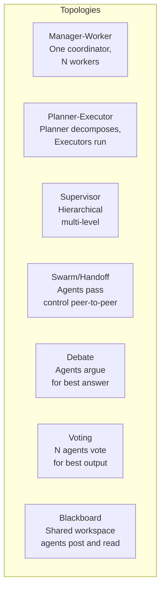
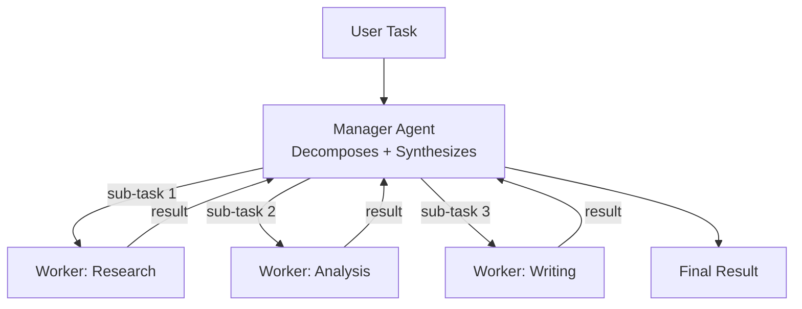
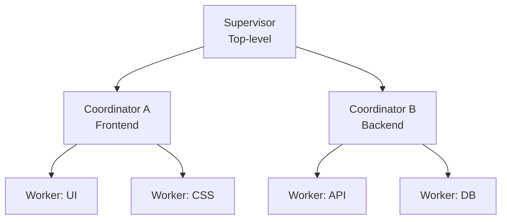
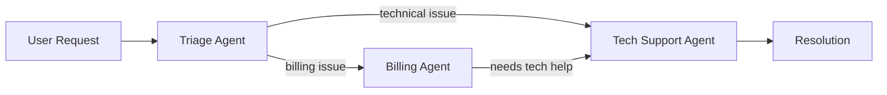
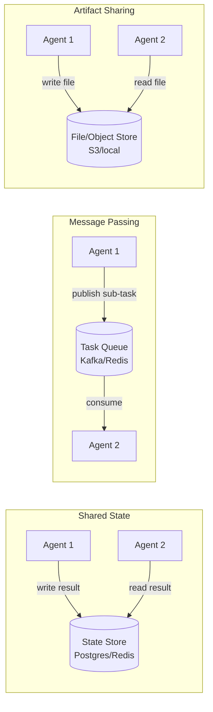
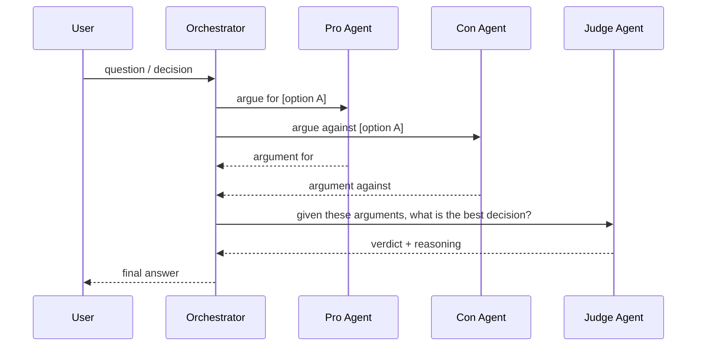

# Module 09 — Multi-Agent Systems

> **Phase 3 — Multi-Agent & Orchestration** | Prerequisites: [Module 08 — Agent Design Patterns](08-agent-design-patterns.md)

Multi-agent systems multiply capability but also multiply cost, complexity, and failure surface. The decision to go multi-agent is one of the highest-impact architectural decisions you'll make — and it's frequently made for the wrong reasons.

---

## Table of Contents
1. [What It Is](#what-it-is)
2. [Why It Exists](#why-it-exists)
3. [Internal Architecture](#internal-architecture)
4. [How It Works](#how-it-works)
5. [Real-World Use Cases](#real-world-use-cases)
6. [Production Implementation](#production-implementation)
7. [Code Examples](#code-examples)
8. [Architecture Diagrams](#architecture-diagrams)
9. [Best Practices](#best-practices)
10. [Common Mistakes](#common-mistakes)
11. [Failure Modes](#failure-modes)
12. [Security Considerations](#security-considerations)
13. [Performance Considerations](#performance-considerations)
14. [Scalability Considerations](#scalability-considerations)
15. [Cost Considerations](#cost-considerations)
16. [Enterprise Recommendations](#enterprise-recommendations)
17. [When to Use / When Not to Use](#when-to-use--when-not-to-use)
18. [Trade-offs & Architectural Decisions](#trade-offs--architectural-decisions)
19. [Key Takeaways](#key-takeaways)

---

## What It Is

A multi-agent system is two or more AI agents that collaborate to complete a task — either by dividing work (specialization), running in parallel (throughput), or checking each other's work (verification).

**Three valid reasons to go multi-agent:**
1. **Context isolation** — each agent has a focused context; agents can't cross-contaminate each other's working memory
2. **Specialization** — different agents have different system prompts, tools, and knowledge for different domains
3. **Parallelism** — independent sub-tasks run simultaneously, reducing wall-clock time

**Three invalid reasons to go multi-agent:**
1. "It feels more powerful" — a single well-prompted agent is often better than two poorly-coordinated ones
2. "To break up a large task" — long tasks need context management, not extra agents
3. "Because multi-agent demos look impressive" — cost and coordination overhead are real

---

## Why It Exists

Single agents hit fundamental limits:
- **Context window pressure** — a single agent processing 50 source documents, 20 tool results, and a long history will run out of context
- **Specialization ceiling** — one system prompt optimized for everything is optimized for nothing
- **Sequential bottleneck** — tasks with parallel sub-tasks are rate-limited by the single agent's sequential loop

Multi-agent systems address these limits — at the cost of coordination complexity, communication overhead, and compounding error rates.

---

## Internal Architecture

### Seven Multi-Agent Topologies



---

## How It Works

### Topology 1 — Manager-Worker

One manager agent receives the task, decomposes it, dispatches sub-tasks to specialized workers, and synthesizes their results.



**When to use:** Tasks that decompose cleanly into parallel independent sub-tasks. The manager must be able to synthesize partial results into a coherent whole.

**Failure risk:** The manager becomes a bottleneck and a single point of failure. If the manager's synthesis is poor, all worker effort is wasted.

### Topology 2 — Planner-Executor

A planner agent creates an explicit plan (no tool calls — pure reasoning). One or more executor agents execute each step. The planner can replan based on executor results.

**Key distinction from Manager-Worker:** The planner *only plans*; it has no tools. This keeps its context clean and its reasoning uncontaminated by tool output noise.

### Topology 3 — Supervisor (Hierarchical)

A hierarchy of manager agents. The top-level supervisor handles the full task and delegates to mid-level coordinators, who in turn delegate to workers. Used in very large tasks (e.g., write a full software product).



**Warning:** Every additional level adds communication overhead, error compounding, and latency. Use only when the task genuinely requires it.

### Topology 4 — Swarm / Handoff

Agents pass control to each other via explicit handoff. No central coordinator — each agent decides who to hand off to next based on the current state of the task.



**Best for:** Customer service flows where the category of request determines the next handler.
**Risk:** Circular handoffs (A hands off to B who hands off back to A) must be detected and broken.

### Topology 5 — Debate

Multiple agents argue for different answers. A judge agent evaluates the arguments and picks the winner. Produces higher-quality answers on opinion/analysis tasks where one model tends to agree with itself.

**Use case:** Security threat assessment, architectural decision evaluation, code review quality.

### Topology 6 — Voting / Ensemble

N agents independently solve the same task. Their answers are aggregated via majority vote, score-weighting, or a synthesis agent. Reduces variance; improves reliability on ambiguous tasks.

**Cost:** N× the single-agent cost. Justified only when reliability improvement > cost increase.

### Topology 7 — Blackboard

Agents asynchronously post to and read from a shared workspace (the "blackboard"). Agents subscribe to new entries and contribute their specialization. No central coordinator — the blackboard mediates coordination.

**Use case:** Long-running tasks where multiple agents contribute asynchronously (e.g., a 24-hour research task with web-crawlers, analyzers, and summarizers running concurrently).

---

## Real-World Use Cases

- **Research synthesis**: Planner-Executor with parallel research workers + synthesis agent
- **Software development**: Supervisor with sub-teams (design, implementation, testing, review)
- **Security investigation**: Swarm (triage → enrichment → analysis → response)
- **Content production**: Manager-Worker (outline → research → write → edit → publish)
- **Decision support**: Debate (pro-agent vs con-agent vs judge)
- **Quality-critical output**: Voting (3 agents generate, 1 synthesizes best)

---

## Production Implementation

### Parallel Worker Pattern with asyncio

```python
import asyncio
import anthropic

client = anthropic.Anthropic()

async def run_worker(
    worker_id: str,
    system_prompt: str,
    task: str,
    tools: list[dict],
    tool_handlers: dict,
    max_turns: int = 10,
) -> dict:
    """Run a single worker agent and return its result."""
    messages = [{"role": "user", "content": task}]
    
    for _ in range(max_turns):
        # Note: use asyncio.to_thread for sync Anthropic client
        response = await asyncio.to_thread(
            client.messages.create,
            model="claude-sonnet-4-6",
            max_tokens=2048,
            system=system_prompt,
            tools=tools,
            messages=messages,
        )
        messages.append({"role": "assistant", "content": response.content})
        
        if response.stop_reason == "end_turn":
            text = next((b.text for b in response.content if hasattr(b, "text")), "")
            return {"worker_id": worker_id, "result": text, "status": "success"}
        
        if response.stop_reason == "tool_use":
            tool_results = []
            for block in response.content:
                if block.type != "tool_use":
                    continue
                handler = tool_handlers.get(block.name)
                try:
                    result = await asyncio.to_thread(handler, **block.input) if handler else "Unknown tool"
                    is_error = handler is None
                except Exception as e:
                    result = str(e); is_error = True
                
                tool_results.append({
                    "type": "tool_result",
                    "tool_use_id": block.id,
                    "content": str(result)[:3000],
                    "is_error": is_error,
                })
            messages.append({"role": "user", "content": tool_results})
    
    return {"worker_id": worker_id, "result": "Turn budget exhausted", "status": "failed"}


async def manager_worker_pipeline(
    task: str,
    worker_configs: list[dict],
    tools: list[dict],
    tool_handlers: dict,
) -> str:
    """
    Manager decomposes task, workers run in parallel, manager synthesizes.
    worker_configs: [{"id": "research", "system": "...", "sub_task": "..."}]
    """
    # Run all workers in parallel
    worker_tasks = [
        run_worker(
            worker_id=wc["id"],
            system_prompt=wc["system"],
            task=wc["sub_task"],
            tools=tools,
            tool_handlers=tool_handlers,
        )
        for wc in worker_configs
    ]
    
    results = await asyncio.gather(*worker_tasks)
    
    # Synthesize with manager
    results_text = "\n\n".join(
        f"### {r['worker_id']} result:\n{r['result']}"
        for r in results
        if r["status"] == "success"
    )
    
    synthesis_messages = [{
        "role": "user",
        "content": f"Original task: {task}\n\nWorker results:\n{results_text}\n\nSynthesize a final comprehensive answer."
    }]
    
    synth_resp = await asyncio.to_thread(
        client.messages.create,
        model="claude-sonnet-4-6",
        max_tokens=3000,
        messages=synthesis_messages,
    )
    return synth_resp.content[0].text


### Swarm with Handoff

```python
from dataclasses import dataclass
from typing import Callable

@dataclass
class AgentDef:
    name: str
    system_prompt: str
    tools: list[dict]
    tool_handlers: dict
    handoff_agents: list[str]  # names of agents this agent can hand off to

# Special tool for handoff
HANDOFF_TOOL = {
    "name": "handoff_to_agent",
    "description": "Hand off the conversation to a specialized agent.",
    "input_schema": {
        "type": "object",
        "properties": {
            "agent_name": {"type": "string", "description": "Name of agent to hand off to"},
            "reason": {"type": "string", "description": "Why this agent is better suited"},
            "context": {"type": "string", "description": "Summary of what's been done so far"},
        },
        "required": ["agent_name", "reason", "context"]
    }
}

class SwarmOrchestrator:
    def __init__(self, agents: dict[str, AgentDef], entry_agent: str):
        self.agents = agents
        self.entry_agent = entry_agent
        self.max_handoffs = 5

    def run(self, user_message: str) -> str:
        current_agent_name = self.entry_agent
        messages = [{"role": "user", "content": user_message}]
        handoff_count = 0

        while handoff_count <= self.max_handoffs:
            agent = self.agents[current_agent_name]
            tools = agent.tools + [HANDOFF_TOOL]

            # Build tool handlers including handoff detection
            handoff_result = {"target": None, "context": ""}
            
            def make_handoff_handler(hr):
                def handler(agent_name: str, reason: str, context: str) -> str:
                    if agent_name not in self.agents:
                        return f"Unknown agent: {agent_name}"
                    hr["target"] = agent_name
                    hr["context"] = context
                    return f"Handing off to {agent_name}: {reason}"
                return handler
            
            local_handlers = dict(agent.tool_handlers)
            local_handlers["handoff_to_agent"] = make_handoff_handler(handoff_result)

            # Run agent turn
            for _ in range(10):
                resp = client.messages.create(
                    model="claude-sonnet-4-6",
                    max_tokens=1024,
                    system=agent.system_prompt,
                    tools=tools,
                    messages=messages,
                )
                messages.append({"role": "assistant", "content": resp.content})

                if resp.stop_reason == "end_turn":
                    text = next((b.text for b in resp.content if hasattr(b, "text")), "")
                    if not handoff_result["target"]:
                        return text  # Final answer
                    break

                if resp.stop_reason == "tool_use":
                    tool_results = []
                    for block in resp.content:
                        if block.type != "tool_use":
                            continue
                        handler = local_handlers.get(block.name)
                        try:
                            r = handler(**block.input) if handler else "Unknown tool"
                            is_error = handler is None
                        except Exception as e:
                            r = str(e); is_error = True
                        tool_results.append({
                            "type": "tool_result",
                            "tool_use_id": block.id,
                            "content": str(r)[:2000],
                            "is_error": is_error,
                        })
                    messages.append({"role": "user", "content": tool_results})

            if handoff_result["target"]:
                # Inject context summary for new agent
                messages.append({
                    "role": "user",
                    "content": f"[Context from previous agent: {handoff_result['context']}]\n\nPlease continue helping the user."
                })
                current_agent_name = handoff_result["target"]
                handoff_result["target"] = None
                handoff_count += 1
            else:
                break

        return "Maximum handoffs reached without resolution"
```

---

## Architecture Diagrams

### Communication Mechanisms



### Debate Topology



---

## Best Practices

1. **Prefer a single agent until it demonstrably fails.** Every new agent adds coordination overhead, latency, and cost. The burden of proof is on multi-agent.
2. **Isolate agents' contexts completely.** Workers should not share conversation history with each other — only with their manager. Cross-contamination via shared context is the most common source of multi-agent bugs.
3. **Artifact passing, not message passing.** Instead of passing large blobs of text between agents, have agents write to a shared artifact store and pass identifiers. This keeps inter-agent messages small and the artifact store auditable.
4. **Define interfaces between agents explicitly.** What schema does the manager pass to a worker? What schema does the worker return? Treat these like API contracts. Version them.
5. **Detect and break circular handoffs.** Track visited agents; refuse to hand off to an agent already in the current chain.
6. **Cap the hierarchy depth.** Each level of management adds 1 LLM call of latency per step. >3 levels is almost never justified.
7. **Budget cost per agent type, not just total.** In a 5-agent system, one runaway worker can consume all budget while others wait.

---

## Common Mistakes

| Mistake | Impact | Fix |
|---------|--------|-----|
| Sharing full conversation history between all agents | Context contamination; exponential token growth | Each agent gets only its relevant subset |
| No inter-agent schema contract | Synthesis fails because worker output doesn't match expected format | Define and validate JSON schema for inter-agent messages |
| Unlimited handoffs | Circular loops; never terminates | Max handoff counter; visited-agent detection |
| Debate with identical prompts | Agents agree with each other (no real debate) | Explicitly assign roles: one agent is Devil's Advocate |
| Voting on non-deterministic output | Different agents produce incomparable outputs | Define a scoring rubric; use structured output for all candidates |
| No worker timeout | One slow worker blocks the entire pipeline | Parallel workers with per-worker timeout; proceed with partial results |

---

## Failure Modes

| Failure | Symptom | Root Cause | Detection | Mitigation |
|---------|---------|-----------|-----------|------------|
| Manager context overflow | Manager fails mid-synthesis | Worker results fill manager's context | Monitor manager input_tokens | Workers return summaries, not full outputs |
| Error compounding | Final result wrong even though each step seemed right | Errors accumulate through layers; no inter-layer verification | Add a verification step after each layer | Verification agent checks partial results |
| Handoff loop | Task never terminates; cost spikes | Circular handoff chain | Track visited agents; alert if revisit | Visited-agent set; refuse circular handoff |
| Worker divergence | Workers produce contradictory results | Different tools, data sources, or context | Compare worker outputs before synthesis | Reconciliation step in manager |
| Synthesis failure | Manager produces incoherent final answer | Too many partial results to synthesize coherently | Evaluate synthesis quality with a critic | Limit max workers to what manager can synthesize |
| Information loss | Final answer missing key details from workers | Manager summarizes too aggressively | Compare final answer to each worker's key facts | Structured worker output with required fields |

---

## Security Considerations

### Agent Isolation
In a multi-agent system, a compromised worker (via injection attack) must not be able to affect other agents or the manager. Enforce:
- Workers have no access to each other's contexts
- Workers cannot directly call the manager's tools — they can only return a result
- Manager validates worker outputs before using them

### Confused Deputy in Manager
The manager acts as a deputy for the user. If the manager blindly forwards worker requests to sensitive tools without re-validating authorization, a malicious worker result could trigger unauthorized actions. The manager must validate every tool call it makes, regardless of what a worker suggested.

### Information Flow Control
In a Blackboard system, agents can post information that other agents read. If one agent is compromised, its posts can inject malicious content into other agents' context. Treat all blackboard entries as untrusted input — validate before use.

---

## Performance Considerations

- **Parallelize independent workers.** The main performance gain from multi-agent is parallel execution. Workers that run sequentially defeat the purpose.
- **The synthesis step is the bottleneck.** A manager synthesizing 10 worker results must fit all of them in its context simultaneously. Design workers to return compact, structured results.
- **Use cheaper models for simple workers.** If a worker's job is to extract entities from a document (simple NLP), use a smaller/cheaper model. Reserve large models for reasoning-heavy tasks.

---

## Scalability Considerations

- **Stateless workers scale horizontally.** A worker that takes a task, runs it, and returns a result can be scaled to any number of instances without coordination.
- **The manager is the scaling bottleneck.** All worker results flow through the manager. For high-throughput systems, use a queue-based fan-out where the "manager" is a batch job, not a single agent.
- **Use a task queue for durable work.** Workers pull tasks from a queue (Kafka, SQS). If a worker fails, the task is requeued. No manager polling required.

---

## Cost Considerations

Multi-agent cost = Σ(agent costs) + coordination overhead.

Example: 5-agent research system
- 1 manager agent: 10K input × 3 turns = 30K tokens in
- 4 workers × 8K avg input × 5 turns = 160K tokens in
- Total input tokens: ~190K
- At $3/MTok: ~$0.57 per task

vs. single agent: ~40K input tokens = ~$0.12 per task.

**Multi-agent costs 5× more here.** Justify it by: parallel execution (wall-clock time), higher quality (Voting/Debate), context isolation (better worker focus), or specialization that a single agent can't achieve.

---

## Enterprise Recommendations

1. **Build a multi-agent framework first, agent implementations second.** The framework handles orchestration, cost tracking, timeout management, and error recovery. Agents plug into it.
2. **Define agent contracts (input/output schemas) as the API specification.** Different teams can own different agents as long as contracts are stable.
3. **Cost attribution per agent type.** Track cost at the agent level, not just the task level. This reveals which agents are expensive and worth optimizing.
4. **Human-in-the-loop at the manager level.** For high-stakes multi-agent tasks, add a checkpoint after the manager produces its plan but before workers execute. A human can review and modify the plan.
5. **Replay capability.** If a multi-agent task fails, you need to replay from a checkpoint — not restart all workers from scratch. Store all agent inputs/outputs to an append-only log.

---

## When to Use / When Not to Use

**Use multi-agent when:**
- Sub-tasks are independent and can run in parallel (throughput)
- Sub-tasks require meaningfully different capabilities, tools, or system prompts (specialization)
- Task context is too large for one agent (isolation)
- High-stakes decisions benefit from debate/verification (quality)

**Use single agent when:**
- Task is sequential with each step depending on the previous (no parallelism benefit)
- Adding coordination overhead would exceed the value gained
- Debugging needs to be simple (multi-agent failures are hard to trace)
- Latency is critical (every agent hop adds latency)

---

## Trade-offs & Architectural Decisions

### Centralized manager vs peer-to-peer swarm?
- **Manager**: predictable control flow, easier to debug, single point of failure
- **Swarm**: resilient, flexible routing, harder to debug
- Rule: use manager for structured tasks, swarm for service-oriented flows (support routing, triage)

### How many workers?
- More workers = more parallelism, but more synthesis complexity and context pressure on the manager
- Rule of thumb: start with 3-5 workers; the manager's synthesis quality degrades with >8 worker results

---

## Key Takeaways

- Three valid reasons for multi-agent: context isolation, specialization, parallelism. All others are suspect.
- Seven topologies: Manager-Worker, Planner-Executor, Supervisor, Swarm, Debate, Voting, Blackboard.
- Prefer single agent until it demonstrably fails. Burden of proof is on multi-agent.
- Inter-agent message schemas are API contracts. Version and validate them.
- Workers must return compact, structured results — not raw tool outputs.
- Parallel workers are the primary performance benefit. Sequential multi-agent buys nothing.
- Multi-agent costs scale linearly with the number of agents. Justify the cost with measurable quality/throughput gains.
- Circular handoffs must be detected and broken in code, not in prompts.
- A compromised worker must not be able to affect other agents or trigger unauthorized manager actions.

## Further Study

- Anthropic's multi-agent guidance (agent network patterns documentation)
- LangGraph multi-agent tutorials
- AutoGen (Microsoft) — multi-agent conversation framework
- CrewAI — role-based multi-agent orchestration
- Cognitive Architectures for Language Agents (CoALA) — multi-agent section
- The Design of Everyday Things (Norman) — applied to agent interfaces/handoffs
