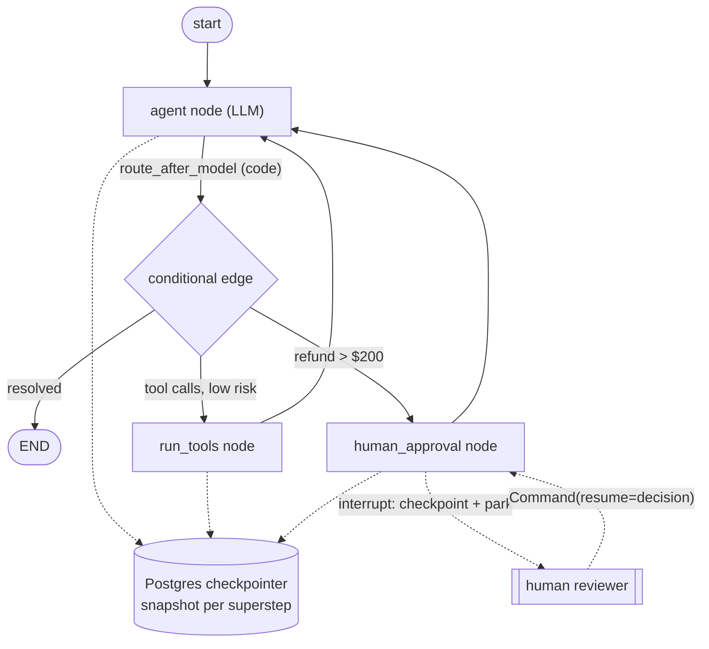
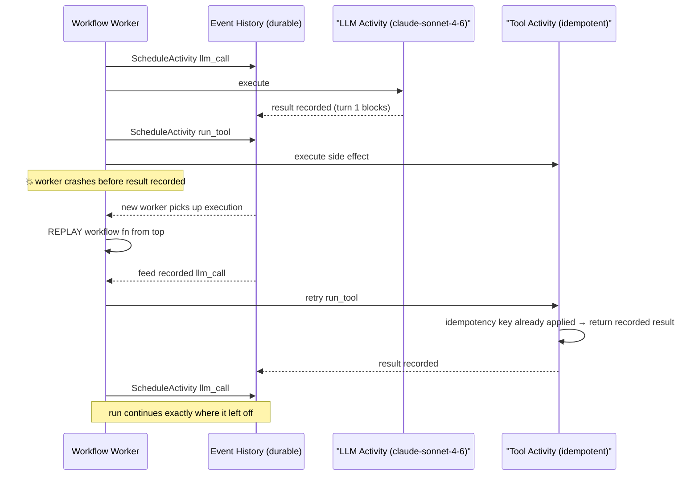
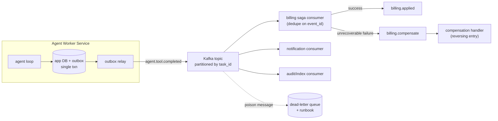

# Module 10 — Orchestration

> **Theme:** Determinism where possible, LLM autonomy only where needed. Orchestration is the discipline of deciding *which parts of an agentic system the model controls and which parts your code controls* — and making the whole thing survivable in production.

Agentic systems fail in production not because the model is weak, but because the *plumbing around the model* is weak: state evaporates on process restart, half-completed tool calls get re-executed, a 40-step workflow dies at step 39 with no way to resume, and nobody can answer "what was the agent doing when it crashed?" Orchestration is the layer that answers those questions. This module covers graph-based orchestration (LangGraph), state machines, DAG engines, durable workflow engines (Temporal-style), and event-driven architectures — and, critically, how to choose among them.

Related modules: [Module 09 — Multi-Agent Systems](09-multi-agent-systems.md) (what you orchestrate), [Module 11 — Security & Guardrails](11-security-guardrails.md) (gating what the orchestrator allows), [Module 12 — Evaluation & Observability](12-evaluation-observability.md) (observing what the orchestrator runs), [Module 15 — Deployment & Operations](15-deployment-operations.md) (running it).

---

## Table of Contents

1. [What It Is](#what-it-is)
2. [Why It Exists](#why-it-exists)
3. [Internal Architecture](#internal-architecture)
4. [How It Works](#how-it-works)
5. [Real-World Use Cases](#real-world-use-cases)
6. [Production Implementation](#production-implementation)
7. [Code Examples](#code-examples)
8. [Architecture Diagrams](#architecture-diagrams)
9. [Best Practices](#best-practices)
10. [Common Mistakes](#common-mistakes)
11. [Failure Modes](#failure-modes)
12. [Security Considerations](#security-considerations)
13. [Performance Considerations](#performance-considerations)
14. [Scalability Considerations](#scalability-considerations)
15. [Cost Considerations](#cost-considerations)
16. [Enterprise Recommendations](#enterprise-recommendations)
17. [When to Use / When Not to Use](#when-to-use--when-not-to-use)
18. [Trade-offs & Architectural Decisions](#trade-offs--architectural-decisions)
19. [Key Takeaways](#key-takeaways)
20. [Further Study](#further-study)

---

## What It Is

Orchestration is the control plane of an agentic system. It is the code (or engine) that decides:

- **Sequencing** — which step runs next, and under what conditions.
- **State** — what the system remembers between steps, and where that state lives.
- **Failure semantics** — what happens when a step fails: retry, compensate, escalate, abort.
- **Boundaries of autonomy** — which decisions the LLM makes (route, plan, choose a tool) versus which decisions are hardcoded (approval gates, ordering constraints, budget limits).
- **Lifecycle** — how a long-running task pauses, resumes, times out, and terminates.

### The spectrum of orchestration

There is a spectrum from fully deterministic to fully autonomous, and a principal engineer's job is to place each piece of the system at the correct point on it:

| Style | Who decides the next step | Examples | Failure semantics |
|---|---|---|---|
| **Pipeline / chain** | Code, fixed order | ETL chain, prompt chain | Retry the step |
| **DAG** | Code, declared dependencies | Airflow, Dagster, Step Functions | Retry node, resume from failed node |
| **State machine** | Code, explicit transitions | AWS Step Functions, XState-style FSMs | Transition to error state |
| **Graph with LLM-routed edges** | Code defines edges; LLM picks among them | LangGraph conditional edges | Checkpoint + resume |
| **Agentic loop** | LLM, within a tool budget | model + tool-use loop (`while stop_reason == "tool_use"`) | Bound iterations, escalate |
| **Multi-agent autonomous** | LLMs delegating to LLMs | Orchestrator/worker swarms ([Module 09](09-multi-agent-systems.md)) | Hardest; needs all of the above |

The cardinal rule: **autonomy is a cost, not a feature.** Every decision delegated to the model adds nondeterminism, latency, token spend, and a new failure surface. Delegate to the model only the decisions that genuinely require judgment over unstructured input; keep everything else in code, where it is testable, replayable, and free.

### What orchestration is *not*

- It is not prompt engineering. A great prompt inside a fragile loop is still a fragile system.
- It is not a framework choice. LangGraph, Temporal, and Kafka solve *different layers*; mature systems often use two of them together.
- It is not optional for "simple" agents. The moment an agent runs longer than one HTTP request timeout, or touches a non-idempotent side effect, you have an orchestration problem whether you've named it or not.

---

## Why It Exists

### LLM calls are unreliable; side effects are unforgiving

A single agent step is a composition of unreliable operations: an LLM call (rate limits, overloads, refusals, nondeterministic output), a tool call (network failures, partial writes), and state mutation. Multiply by 30–200 steps for a real task and the probability that *every* step succeeds on the first try approaches zero. Without orchestration, the standard failure pattern is: step 27 fails → the process crashes or the loop aborts → the entire run is lost → the retry re-executes steps 1–26, including the email that was already sent and the refund that was already issued.

Orchestration exists to convert that into: step 27 fails → state is checkpointed at step 26 → retry resumes at step 27 → side effects from 1–26 are not repeated because they are recorded as complete.

### Determinism is cheaper, faster, and testable

Every branch the LLM controls is a branch you cannot unit-test exhaustively, cannot guarantee under replay, and pay tokens for. Code-controlled branches cost nothing and never hallucinate. The mature architecture pattern is a **deterministic skeleton with autonomous muscles**: code defines the workflow shape (ingest → plan → execute → verify → report), and the LLM operates *inside* well-bounded nodes of that shape. Anthropic's own guidance ("Building Effective Agents") makes the same point: use workflows when the path is knowable, and reserve open-ended agent loops for tasks that genuinely cannot be specified in advance.

### Long-running tasks outlive processes

An agent doing a deep migration, an overnight research run, or a multi-day approval flow will outlive: the HTTP request that started it, the pod it runs on, the deploy that ships mid-run, and possibly the engineer's on-call shift. Orchestration provides the persistence and resumption machinery (checkpointers, event-sourced histories, durable timers) that lets a logical task survive physical infrastructure churn.

### Humans are part of the loop

Approval gates, escalation, "the agent is unsure — ask the user" — these all require the workflow to *pause indefinitely* without holding a thread, a connection, or a container. That is fundamentally an orchestration capability (interrupts + persistence), not a prompting capability.

---

## Internal Architecture

This section dissects the internals of the three dominant orchestration substrates: graph engines (LangGraph), durable workflow engines (Temporal-style), and event-driven backbones (Kafka).

### LangGraph internals: Pregel-style supersteps over channels

LangGraph is not "a chain with branches." Internally it is a **message-passing graph runtime** modeled on Google's Pregel / the Bulk Synchronous Parallel model:

1. **State schema** — you declare a typed state (a `TypedDict` / Pydantic model). Each key is backed by a **channel**. A channel has a *reducer*: the default reducer is last-write-wins; an annotated reducer like `add_messages` *appends* instead of overwriting. Reducers are what make concurrent node writes well-defined.
2. **Nodes** — plain functions `state -> partial_state_update`. A node never mutates state; it returns a delta that the runtime applies through the channel reducers. This functional discipline is what makes checkpointing and replay possible.
3. **Edges** — static edges (`A -> B`) or conditional edges (a routing function inspects state and returns the next node name). When the routing function consults an LLM output stored in state, you get "LLM-routed" control flow — but the *set of possible routes* is still declared in code. This is the key containment property.
4. **Supersteps** — execution proceeds in rounds. In each superstep, all nodes whose input channels were updated in the previous round run (potentially in parallel); their writes are merged via reducers; then the next superstep begins. The graph halts when no channels are updated or a terminal node is reached.
5. **Checkpointer** — after every superstep, the runtime serializes the full channel state plus metadata (`thread_id`, `checkpoint_id`, pending writes) to a pluggable backend (in-memory, SQLite, Postgres, Redis). This gives you: resume-after-crash, time-travel (fork from any historical checkpoint), and human-in-the-loop pauses for free.
6. **Interrupts** — `interrupt()` inside a node (or `interrupt_before=[node]` at compile time) raises a special signal; the runtime checkpoints and returns control to the caller with the interrupt payload. Resumption supplies a `Command(resume=value)` that is delivered to the interrupted node. Because the pause is *just a checkpoint*, it can last milliseconds or weeks.

### Durable workflow engines: event sourcing + deterministic replay

Temporal (and its conceptual siblings: Cadence, Azure Durable Functions, AWS Step Functions in spirit, Restate, Inngest) implement **durable execution**. The mechanics matter because they constrain how you write agent code on top:

1. **Workflow vs. activity split.** *Workflow code* is orchestration logic and must be deterministic — no `random()`, no `now()`, no direct I/O. *Activities* are the side-effecting calls (LLM call, tool execution, DB write) and may be arbitrarily flaky.
2. **Event history.** Every command the workflow issues (schedule activity X, start timer, signal received) and every result is appended to a persisted, ordered event history.
3. **Replay.** When a worker crashes, a new worker reconstructs the workflow's in-memory state by *re-executing the workflow function from the top*, feeding it recorded results from history instead of re-running activities. This is why determinism is mandatory: replayed code must issue the exact same command sequence, or the engine throws a nondeterminism error.
4. **Idempotent activities.** The engine guarantees at-least-once activity execution, so an activity may run twice (worker died after executing but before recording the result). Activities that touch external systems must therefore be idempotent — usually via an idempotency key derived from `workflow_id + activity_id + attempt-independent token`.
5. **Durable timers and signals.** `sleep(30 days)` is an event in history, not a held thread. Signals (external events) are also history events, which is how approval gates work: the workflow awaits a signal and consumes zero compute while waiting.

**Why agents need this.** An agent loop *is* a workflow: nondeterministic results (LLM outputs) produced by retryable side-effecting calls (activities), composed by control logic that must survive crashes. The crucial trick: the LLM call goes in an *activity*, so its nondeterministic output is recorded in history and replay never re-calls the model. The loop logic stays deterministic given recorded outputs.

### Event-driven backbones: Kafka, sagas, and the outbox

For agent *fleets* — many concurrent tasks, multiple services, fan-out processing — point-to-point orchestration gives way to an event-driven architecture:

- **Topics as stage boundaries.** `tasks.requested` → `tasks.planned` → `tool.calls` → `tool.results` → `tasks.completed`. Each stage is a consumer group that can scale independently; partition keys (e.g., `task_id`) preserve per-task ordering.
- **Sagas** replace distributed transactions. A multi-service agentic operation (provision account → configure → notify) is a sequence of local transactions, each emitting an event; failures trigger *compensating actions* (deprovision, rollback config) rather than a global rollback. Two styles: *choreography* (services react to each other's events — simple, but the flow is invisible) and *orchestration* (a saga coordinator — often itself a durable workflow — explicitly drives steps and compensations).
- **Transactional outbox.** The classic dual-write hazard: a service writes "tool call completed" to its DB and then crashes before publishing the event (or vice versa). The outbox pattern writes the event into an `outbox` table *in the same DB transaction* as the state change; a relay (CDC/Debezium or a poller) publishes from the outbox to Kafka. Exactly one source of truth, at-least-once publication, no lost or phantom events. For agent systems this matters acutely because the "event" is often "an irreversible side effect happened" — losing it means the orchestrator retries the side effect.

---

## How It Works

### Anatomy of an orchestrated agent run

A production agent run through a graph + checkpointer looks like this, end to end:

1. **Admission.** A request arrives (API call, Kafka event, cron). The orchestrator creates a *thread* (LangGraph) or *workflow execution* (Temporal) with a stable ID. This ID is the unit of resumption, audit, and cost attribution.
2. **Deterministic pre-processing.** Input validation, tenant resolution, policy lookup, prompt assembly — all code, no model.
3. **Planning node (LLM).** The model produces a plan or selects a route. The output is validated against a schema before it is allowed to influence control flow (see [Module 11](11-security-guardrails.md) for why unvalidated model output steering control flow is an injection vector).
4. **Execution supersteps.** Tool-calling loop or per-plan-step nodes. After each superstep, state is checkpointed. Each tool call is wrapped: timeout, retry policy, idempotency key, result-size truncation.
5. **Gates.** Before irreversible actions, either a code-level policy check (always) or a human interrupt (for high-risk actions). The run parks at a checkpoint until resolution.
6. **Verification node.** A deterministic check (tests pass? schema valid? budget respected?) or an LLM critic — but the *gate decision* threshold lives in code.
7. **Completion.** Terminal state written, completion event emitted (through the outbox if other services must react), artifacts persisted, trace closed.

### Checkpointing & resumability in practice

Checkpointing is only as useful as your answers to four questions:

- **Granularity** — per superstep (LangGraph default) is right for most agents. Coarser (per phase) loses too much work on crash; finer (per token) is pointless.
- **What's in the snapshot** — the *full* conversational state, including tool results, must be serializable. Large artifacts (files, datasets) should be stored by reference (object-store URL in state), not by value, or your checkpoint table becomes your largest database.
- **Side-effect ledger** — checkpoints capture *state*, not *effects*. You must additionally record which external effects have already happened (idempotency keys, outbox rows), or resume will repeat them. This is the single most common resumability bug.
- **Schema evolution** — a deploy mid-run means new code resumes old checkpoints. Version your state schema and write upcasters, exactly as you would for event-sourced aggregates.

### Long-running tasks and timeouts

Layer your timeouts; a single global timeout is always wrong:

| Layer | Typical budget | On expiry |
|---|---|---|
| Single LLM call | 1–10 min (streaming; long-horizon models can legitimately run for minutes) | Retry with backoff; SDKs retry 429/5xx automatically |
| Single tool call | seconds–minutes, per tool | Retry if idempotent; else mark failed and let the model react |
| Node / activity | start-to-close timeout (Temporal: `start_to_close_timeout`) | Engine-driven retry per policy |
| Heartbeat | for long activities, periodic heartbeat | Detect zombie workers; reassign work |
| Whole run | hours–days, business-defined | Escalate to human; checkpoint preserved for manual resume |
| Iteration/budget cap | max supersteps (`recursion_limit`), max tokens, max cost | Hard stop — this is your runaway-agent fuse |

A long-running agent should *also* emit progress events so operators can distinguish "working hard" from "wedged" — see [Module 12 — Evaluation & Observability](12-evaluation-observability.md).

---

## Real-World Use Cases

### 1. Customer-support resolution agent (graph + interrupts)

Intake → classify (LLM) → retrieve account context (code) → propose resolution (LLM) → **policy gate**: refunds above $200 interrupt for human approval → execute via billing API (idempotent activity) → draft reply (LLM) → send. LangGraph fits perfectly: conditional edges for classification routes, `interrupt()` at the approval gate, Postgres checkpointer so an approval that takes 6 hours costs nothing while parked.

### 2. Overnight codebase migration (durable workflow)

A 6-hour run across 1,400 files: plan (LLM) → fan out per-package workers → per-file edit/test loop → integration verification → PR creation. Temporal-style durability is the right substrate: worker pods get rescheduled by Kubernetes mid-run and the workflow replays without losing position; each file's edit is an idempotent activity; the final `git push` happens exactly once because its completion is in history.

### 3. Document-processing pipeline at scale (event-driven + small workflows)

50k documents/day: ingestion emits `doc.received` to Kafka → extraction consumers (LLM-powered, stateless) → validation → enrichment → indexing. Per-document logic is a short deterministic chain; Kafka provides scale-out, backpressure, and replayable history. A saga handles the cross-system commit (index + billing + notification) with outbox-published events.

### 4. Financial operations agent (state machine + saga)

Reconciliation agent that can post adjusting entries. The workflow is an explicit state machine (`DRAFT → VALIDATED → PENDING_APPROVAL → POSTED → NOTIFIED`) because auditors must be able to enumerate every possible path. The LLM only ever *proposes* transitions; code validates them. Posting + downstream notifications run as an orchestrated saga with compensations (reversing entry) rather than distributed transactions.

### 5. Deep-research agent (agent loop inside a workflow)

Open-ended research is the legitimate home of high autonomy: the model plans, searches, reads, and re-plans. But even here the *outer* shell is orchestrated: a durable workflow owns the budget (max tokens, max wall-clock), checkpoints after each research phase, and interrupts to ask the user when the plan changes materially.

---

## Production Implementation

### Reference stack

A pragmatic, widely deployed combination:

- **LangGraph** (or an equivalent in-process graph runtime) for the *intra-task* control flow: nodes, conditional edges, interrupts, per-superstep checkpoints into **Postgres**.
- **Temporal** (or Step Functions / Restate) for *inter-task* and *long-horizon* durability when runs span hours/days or coordinate multiple services. A common pattern: each Temporal activity runs one LangGraph phase to completion.
- **Kafka + outbox** when multiple services produce/consume agent events, or throughput demands horizontal consumer scaling.

Small systems can collapse this to LangGraph + Postgres alone. Do not introduce Temporal or Kafka until a concrete requirement (multi-day runs, cross-service sagas, >10⁴ tasks/day) demands them.

### Orchestrator selection criteria

| Criterion | LangGraph (graph runtime) | Temporal-style (durable engine) | Kafka (event-driven) | DAG engine (Airflow/Dagster) |
|---|---|---|---|---|
| Cyclic flows / agent loops | Native | Native (loops in workflow code) | Awkward (loop via topics) | Poor — DAGs are acyclic by definition |
| Human-in-the-loop pause | Native interrupts | Native signals/timers | Manual (park + resume topic) | Poor |
| Crash-proof multi-day runs | Good (checkpointer) | Best in class (replay) | Good (offsets + state stores) | Per-task retries only |
| Exactly-once side effects | Your job (idempotency keys) | Strong support (history + idempotent activities) | Outbox + idempotent consumers | Your job |
| Horizontal fan-out | Limited (in-process) | Good (task queues) | Best in class | Good |
| LLM-routed branching | Native | Easy (branch on activity result) | Hard to see/govern | Hard |
| Operational burden | Low (library + your DB) | Medium–high (cluster or cloud) | Medium–high | Medium |
| Debuggability of one run | Good (checkpoint history) | Excellent (full event history) | Hard (distributed traces needed) | Good per-DAG-run |
| Scheduled/batch ETL semantics | No | Possible | Possible | Best in class |

**Decision shortcuts:**

- Single-service agent, minutes-long runs, needs HITL → **LangGraph + Postgres checkpointer**.
- Runs measured in hours/days, irreversible side effects, "must never lose a run" → **durable engine**, with the agent loop inside it.
- Many services reacting to agent lifecycle events, high throughput → **Kafka backbone**, workflows as consumers.
- Nightly batch evals, data refreshes feeding the agent → **DAG engine** (and only for that).

### Operational checklist

- [ ] Every run has a stable `thread_id`/`workflow_id` propagated into traces, logs, and cost records.
- [ ] Checkpointer backed by a real database with retention policy and PITR backups.
- [ ] Every non-idempotent tool wrapped with an idempotency key; keys persisted with the run.
- [ ] `recursion_limit` / iteration cap + token budget + cost ceiling enforced *in code*.
- [ ] Interrupt/approval flows tested for the "approver responds 3 days later, after a deploy" case (state schema versioning).
- [ ] Replay determinism CI test for durable workflows (Temporal's replayer against recorded histories).
- [ ] Dead-letter queue + manual-intervention runbook for poison tasks.

---

## Code Examples

### 1. LangGraph: stateful agent with checkpointer, conditional edges, and a human-in-the-loop interrupt

A support-resolution agent: the model decides whether to call tools; refunds over a threshold pause the graph for human approval; state survives process restarts via the Postgres checkpointer.

```python
"""Support agent: LangGraph StateGraph + Postgres checkpointing + HITL interrupt."""
import json
import operator
from typing import Annotated, TypedDict

import anthropic
from langgraph.graph import StateGraph, START, END
from langgraph.checkpoint.postgres import PostgresSaver
from langgraph.types import interrupt, Command

client = anthropic.Anthropic()  # reads ANTHROPIC_API_KEY from the environment

TOOLS = [
    {
        "name": "lookup_order",
        "description": "Fetch order details by order id. Read-only.",
        "input_schema": {
            "type": "object",
            "properties": {"order_id": {"type": "string"}},
            "required": ["order_id"],
        },
    },
    {
        "name": "issue_refund",
        "description": "Issue a refund for an order. Irreversible.",
        "input_schema": {
            "type": "object",
            "properties": {
                "order_id": {"type": "string"},
                "amount_usd": {"type": "number"},
            },
            "required": ["order_id", "amount_usd"],
        },
    },
]

APPROVAL_THRESHOLD_USD = 200.0


class AgentState(TypedDict):
    # operator.add reducer: concurrent/sequential writes append, never clobber.
    messages: Annotated[list, operator.add]
    pending_refund: dict | None
    resolved: bool


def call_model(state: AgentState) -> dict:
    """LLM node: returns a state *delta*; the runtime merges it via reducers."""
    response = client.messages.create(
        model="claude-sonnet-4-6",
        max_tokens=2048,
        system=(
            "You are a support resolution agent. Use tools to investigate. "
            "Never promise a refund before issue_refund succeeds."
        ),
        tools=TOOLS,
        messages=state["messages"],
    )
    # Serialize content blocks so the checkpoint is JSON-safe.
    content = [b.model_dump() for b in response.content]
    return {
        "messages": [{"role": "assistant", "content": content}],
        "resolved": response.stop_reason == "end_turn",
    }


def route_after_model(state: AgentState) -> str:
    """Code-owned routing. The LLM proposed; code decides what is allowed."""
    if state["resolved"]:
        return END
    last = state["messages"][-1]["content"]
    for block in last:
        if block.get("type") == "tool_use" and block["name"] == "issue_refund":
            if block["input"].get("amount_usd", 0) > APPROVAL_THRESHOLD_USD:
                return "human_approval"          # gate: irreversible + large
    return "run_tools"


def human_approval(state: AgentState) -> dict:
    """Checkpoint + park. Resumes when Command(resume=...) is supplied —
    seconds or days later, on any worker, after any deploy."""
    refund_block = next(
        b for b in state["messages"][-1]["content"]
        if b.get("type") == "tool_use" and b["name"] == "issue_refund"
    )
    decision = interrupt({
        "action": "approve_refund",
        "order_id": refund_block["input"]["order_id"],
        "amount_usd": refund_block["input"]["amount_usd"],
    })
    if decision["approved"]:
        return {"pending_refund": refund_block["input"]}
    # Denied: surface to the model as a tool error so it can adapt.
    return {"messages": [{
        "role": "user",
        "content": [{
            "type": "tool_result",
            "tool_use_id": refund_block["id"],
            "content": f"DENIED by reviewer: {decision.get('reason', 'n/a')}",
            "is_error": True,
        }],
    }], "pending_refund": None}


def run_tools(state: AgentState) -> dict:
    """Execute every tool_use block; return tool_results as one user turn."""
    results = []
    for block in state["messages"][-1]["content"]:
        if block.get("type") != "tool_use":
            continue
        # Idempotency key: thread-stable, derived from the tool_use id.
        out = execute_tool(block["name"], block["input"], idem_key=block["id"])
        results.append({
            "type": "tool_result",
            "tool_use_id": block["id"],
            "content": json.dumps(out),
        })
    return {"messages": [{"role": "user", "content": results}]}


def execute_tool(name: str, args: dict, idem_key: str) -> dict:
    if name == "lookup_order":
        return {"order_id": args["order_id"], "total_usd": 312.50, "status": "delivered"}
    if name == "issue_refund":
        # Real impl: INSERT idem_key ... ON CONFLICT DO NOTHING; only call
        # the payment provider if the insert won. Replays become no-ops.
        return {"refund_id": f"rf_{idem_key[:8]}", "status": "issued"}
    return {"error": f"unknown tool {name}"}


# --- Wire the graph -----------------------------------------------------
builder = StateGraph(AgentState)
builder.add_node("agent", call_model)
builder.add_node("run_tools", run_tools)
builder.add_node("human_approval", human_approval)
builder.add_edge(START, "agent")
builder.add_conditional_edges("agent", route_after_model,
                              ["run_tools", "human_approval", END])
builder.add_edge("run_tools", "agent")
builder.add_edge("human_approval", "agent")

with PostgresSaver.from_conn_string("postgresql://app@db:5432/agents") as saver:
    saver.setup()
    graph = builder.compile(checkpointer=saver)

    config = {"configurable": {"thread_id": "ticket-48213"},
              "recursion_limit": 40}  # runaway-loop fuse

    # First invocation runs until END or until it parks on the interrupt.
    result = graph.invoke(
        {"messages": [{"role": "user",
                       "content": "Order ord_991 arrived broken. I want a refund."}],
         "pending_refund": None, "resolved": False},
        config,
    )

    # ... hours later, possibly a different process entirely:
    state = graph.get_state(config)
    if state.interrupts:
        print("awaiting approval:", state.interrupts[0].value)
        result = graph.invoke(Command(resume={"approved": True}), config)
```

The load-bearing details: nodes return *deltas*; routing is a code function over state (the LLM never directly names a node); the interrupt is just a checkpoint, so the pause is free; and `issue_refund` is idempotent so a crash between execution and checkpoint cannot double-refund.

### 2. Temporal-style durable agent loop: replay-safe, idempotent activities

The agent loop lives in deterministic workflow code; *every* nondeterministic or side-effecting operation — including the LLM call — is an activity whose result is recorded in history. A crashed worker replays to the exact same position without re-calling the model or re-running tools.

```python
"""Durable agent loop on Temporal. Workflow = deterministic; activities = effects."""
from datetime import timedelta
from dataclasses import dataclass

from temporalio import workflow, activity
from temporalio.common import RetryPolicy

with workflow.unsafe.imports_passed_through():
    import anthropic  # imported for activities only; never called in workflow code


@dataclass
class LLMTurn:
    content_blocks: list      # serialized blocks from the response
    stop_reason: str


@activity.defn
async def llm_call(messages: list, tools: list) -> LLMTurn:
    """Nondeterminism quarantined here. Recorded once in history;
    replay feeds the recorded result back instead of re-calling the API."""
    client = anthropic.Anthropic()
    resp = client.messages.create(
        model="claude-sonnet-4-6",
        max_tokens=4096,
        tools=tools,
        messages=messages,
    )
    return LLMTurn(
        content_blocks=[b.model_dump() for b in resp.content],
        stop_reason=resp.stop_reason,
    )


@activity.defn
async def run_tool(name: str, args: dict, idempotency_key: str) -> str:
    """At-least-once execution => must be idempotent. The key is stable across
    retries AND across workflow replays (derived from tool_use id)."""
    if await effect_already_applied(idempotency_key):   # ledger check
        return await fetch_recorded_result(idempotency_key)
    result = await dispatch(name, args)                 # the real side effect
    await record_effect(idempotency_key, result)        # same txn as the effect
    return result


@workflow.defn
class AgentTaskWorkflow:
    """Deterministic shell. No I/O, no clocks, no randomness in this class —
    only workflow.* primitives and activity results."""

    def __init__(self) -> None:
        self._approval: bool | None = None

    @workflow.signal
    def approve(self, approved: bool) -> None:   # human gate, via signal
        self._approval = approved

    @workflow.run
    async def run(self, task: str, tools: list, max_turns: int = 30) -> str:
        messages = [{"role": "user", "content": task}]
        retry = RetryPolicy(maximum_attempts=5, backoff_coefficient=2.0)

        for turn_index in range(max_turns):              # bounded loop: the fuse
            turn: LLMTurn = await workflow.execute_activity(
                llm_call, args=[messages, tools],
                start_to_close_timeout=timedelta(minutes=10),
                retry_policy=retry,
            )
            messages.append({"role": "assistant", "content": turn.content_blocks})

            if turn.stop_reason != "tool_use":
                return _final_text(turn.content_blocks)   # done

            tool_results = []
            for block in turn.content_blocks:
                if block["type"] != "tool_use":
                    continue
                if block["name"] == "deploy_to_production":
                    # Durable human gate: park (cost-free) until signal or 24h.
                    self._approval = None
                    approved_in_time = await workflow.wait_condition(
                        lambda: self._approval is not None,
                        timeout=timedelta(hours=24),
                    )
                    if not approved_in_time or not self._approval:
                        return "ABORTED: deployment not approved within 24h"

                result = await workflow.execute_activity(
                    run_tool,
                    args=[block["name"], block["input"], block["id"]],
                    start_to_close_timeout=timedelta(minutes=5),
                    heartbeat_timeout=timedelta(seconds=30),  # zombie detection
                    retry_policy=retry,
                )
                tool_results.append({
                    "type": "tool_result",
                    "tool_use_id": block["id"],
                    "content": result,
                })
            messages.append({"role": "user", "content": tool_results})

        return "STOPPED: max_turns budget exhausted"      # never loop forever


def _final_text(blocks: list) -> str:
    return next((b["text"] for b in blocks if b["type"] == "text"), "")
```

### 3. Event-driven backbone: transactional outbox + idempotent saga consumer

The glue for multi-service agent pipelines. The worker records a completed tool effect and its event *atomically*; a relay publishes to Kafka; downstream consumers dedupe.

```python
"""Outbox pattern + idempotent consumer for agent lifecycle events."""
import json
import uuid
from datetime import datetime, timezone

import psycopg
from confluent_kafka import Consumer, Producer


# --- Producer side: state change + event in ONE transaction ---------------
def complete_tool_call(conn: psycopg.Connection, task_id: str,
                       tool_use_id: str, result: dict) -> None:
    with conn.transaction():
        conn.execute(
            "UPDATE agent_tasks SET last_tool_result = %s, updated_at = now() "
            "WHERE task_id = %s",
            (json.dumps(result), task_id),
        )
        conn.execute(
            "INSERT INTO outbox (event_id, aggregate_id, topic, payload, created_at) "
            "VALUES (%s, %s, %s, %s, %s)",
            (
                str(uuid.uuid4()),
                task_id,                       # partition key: per-task ordering
                "agent.tool.completed",
                json.dumps({"task_id": task_id, "tool_use_id": tool_use_id,
                            "result": result}),
                datetime.now(timezone.utc),
            ),
        )
    # If we crash anywhere above: either both rows exist or neither does.
    # The relay (Debezium / poller) drains outbox -> Kafka, then marks published.


def outbox_relay(conn: psycopg.Connection, producer: Producer) -> None:
    rows = conn.execute(
        "SELECT event_id, aggregate_id, topic, payload FROM outbox "
        "WHERE published_at IS NULL ORDER BY created_at LIMIT 100 "
        "FOR UPDATE SKIP LOCKED"               # safe concurrent relays
    ).fetchall()
    for event_id, agg_id, topic, payload in rows:
        producer.produce(topic, key=agg_id.encode(), value=payload.encode(),
                         headers={"event_id": event_id})
    producer.flush()
    conn.execute(
        "UPDATE outbox SET published_at = now() WHERE event_id = ANY(%s)",
        ([r[0] for r in rows],),
    )
    conn.commit()
    # At-least-once: a crash between flush and UPDATE re-publishes.
    # Consumers MUST dedupe on event_id — never assume exactly-once delivery.


# --- Consumer side: saga step with dedupe + compensation ------------------
def billing_saga_consumer() -> None:
    consumer = Consumer({
        "bootstrap.servers": "kafka:9092",
        "group.id": "billing-saga",
        "enable.auto.commit": False,           # commit only after processing
        "auto.offset.reset": "earliest",
    })
    consumer.subscribe(["agent.tool.completed"])
    with psycopg.connect("postgresql://app@db:5432/billing") as conn:
        while True:
            msg = consumer.poll(1.0)
            if msg is None or msg.error():
                continue
            event_id = dict(msg.headers() or {}).get("event_id", b"").decode()
            event = json.loads(msg.value())
            with conn.transaction():
                inserted = conn.execute(
                    "INSERT INTO processed_events (event_id) VALUES (%s) "
                    "ON CONFLICT DO NOTHING RETURNING event_id",
                    (event_id,),
                ).fetchone()
                if inserted:                    # first time we've seen it
                    try:
                        apply_billing_step(conn, event)
                    except UnrecoverableBillingError:
                        # Saga compensation: emit the compensating event
                        # (refund / reversal) through THIS service's outbox.
                        enqueue_compensation(conn, event)
            consumer.commit(msg)                # offset advances only on success
```

---

## Architecture Diagrams

### 1. LangGraph support agent — nodes, conditional routing, HITL gate



### 2. Durable execution — crash, replay, resume without repeating effects



### 3. Event-driven agent pipeline — outbox, Kafka stages, saga compensation



---

## Best Practices

### Design

- **Push decisions into code until it hurts.** Start with a workflow; introduce an LLM-routed edge only where a rule cannot express the decision. Review every conditional edge in design review with the question: "could a regex/classifier/lookup do this?"
- **One node, one responsibility.** Nodes that "call the model and run the tools and update three state keys" are unreplayable and untestable. Small nodes make checkpoints meaningful.
- **Declare the full route set statically.** The model chooses *among* declared edges; it never names arbitrary targets. This is both a correctness and a security property.
- **Make state JSON-serializable and small.** Big artifacts go to object storage; state holds references. Budget your checkpoint size like you budget your context window.

### Reliability

- **Idempotency keys on every effectful tool, no exceptions.** Derive from stable identifiers (`tool_use.id`), persist in the same transaction as the effect.
- **Bound everything:** iteration caps, per-node timeouts, token budgets, cost ceilings. An unbounded agent loop is an unbounded invoice.
- **Treat resume as the common path, not the exception.** Chaos-test: kill workers mid-run weekly; a run that can't survive that can't survive a deploy.
- **Version state schemas** and ship upcasters with every change; old checkpoints will resume on new code.

### Operations

- **Propagate one correlation ID** (thread/workflow ID) through prompts metadata, traces, logs, outbox events, and cost records.
- **Expose run state to operators**: current node, last checkpoint time, pending interrupts, budget consumed. "Where is run X stuck?" should be a dashboard query, not an archaeology project.
- **Keep DLQs and write the runbook before the first poison message,** not after.

---

## Common Mistakes

1. **Agent-as-a-while-loop in a request handler.** The run dies with the HTTP connection; retries duplicate side effects. Any agent that outlives a request needs a checkpointer or a workflow engine.
2. **Checkpointing state but not effects.** Resume replays the last superstep and re-sends the email. State snapshots and effect ledgers are two different mechanisms; you need both.
3. **LLM calls inside Temporal workflow code.** Breaks replay determinism — the second execution gets a different completion and the history diverges. The model call is always an activity.
4. **Letting the model name graph nodes / construct routing strings.** Now untrusted output drives control flow (see [Module 11](11-security-guardrails.md)). Routes are an enum validated in code.
5. **Using a DAG engine for an agent loop.** Agents are cyclic (act → observe → act); DAGs are acyclic. Teams end up encoding loops as "re-trigger the DAG," losing state each cycle.
6. **In-memory checkpointer in production.** Works in the demo; first pod eviction loses every active conversation. The checkpointer backend is a tier-1 production dependency.
7. **One global timeout.** Either too short for legit long turns or too long to catch wedged tools. Layer timeouts per call/node/run.
8. **Assuming Kafka gives exactly-once end-to-end.** Without an outbox on the producer side and dedupe on the consumer side, you have at-most-once or at-least-once with duplicates — both fatal for irreversible actions.
9. **Unbounded fan-out in multi-agent orchestration.** A planner that spawns workers that spawn workers is a fork bomb with an API bill. Cap delegation depth and width in code ([Module 09](09-multi-agent-systems.md)).
10. **No budget fuse.** A model stuck re-trying a failing tool can burn six figures of tokens overnight. Iteration + cost caps are non-negotiable.

---

## Failure Modes

| Failure | Symptom | Root Cause | Detection | Mitigation |
|---|---|---|---|---|
| Duplicate side effects on retry | Customer refunded twice; two PRs opened | Effectful tool retried without idempotency key; resume replays last superstep | Reconciliation jobs; duplicate-detection alerts on effect ledger | Idempotency keys persisted transactionally with the effect; outbox + consumer dedupe |
| Lost run on crash/deploy | Multi-hour run vanishes; user restarts from scratch | In-memory state; no checkpointer; agent loop tied to request lifecycle | Run-completion rate vs. start rate; orphaned-thread metric | Durable checkpointer / workflow engine; resume tests in CI; drain hooks on deploy |
| Infinite agent loop | Token spend spikes; run never terminates | Model oscillates between tools; no iteration cap; failing tool retried by the model forever | Cost-per-run alert; superstep-count histogram p99 | `recursion_limit`, token/cost budget, circuit breaker on repeated identical tool calls |
| Nondeterministic replay (durable engines) | Workflow fails with nondeterminism error after deploy | Clock/random/IO or LLM call placed in workflow code; code change altered command order | Replayer test against recorded histories in CI | Quarantine nondeterminism in activities; versioned workflow changes (patching API) |
| Stuck at human gate forever | Runs accumulate in `PENDING_APPROVAL`; SLA breach | Interrupt raised but no notification routed; approver never paged | Age-of-oldest-pending-interrupt metric | Gate timeout + escalation path; notification as part of the interrupt, not an afterthought |
| Checkpoint schema mismatch | Resume throws deserialization errors after deploy | State schema changed without versioning/upcasters | Canary resume of sampled old checkpoints post-deploy | Versioned schemas, upcasters, backward-compat window |
| Poison event wedges a partition | Consumer lag grows on one partition; one tenant frozen | Malformed/oversized event crashes consumer; auto-retry loops on same offset | Per-partition lag alerts; crash-loop detection | DLQ after N attempts; skip-and-record; per-tenant partition isolation |
| Dual-write event loss | Downstream services never hear about a completed action | DB write succeeded, Kafka publish failed (or vice versa) | Outbox-vs-published audit; downstream reconciliation | Transactional outbox with CDC relay; never publish directly from app code |
| Zombie activity | Work appears in-flight for hours; resources held | Worker died mid-activity without heartbeat; engine waits for start-to-close | Heartbeat-timeout alerts; in-flight-age dashboards | Heartbeats on long activities; sane start-to-close timeouts; reassignment |
| Checkpoint table bloat | DB storage explodes; checkpoint writes slow down | Full artifacts stored by value in state; no retention policy | Table-size growth alerts; checkpoint write latency | Store references not blobs; TTL/archival policy on completed threads |

---

## Security Considerations

Orchestration is a security *control point* — often the only place where you can enforce policy regardless of what the model says. Full treatment in [Module 11 — Security & Guardrails](11-security-guardrails.md); the orchestration-specific essentials:

- **Gates live in the orchestrator, not the prompt.** "Always ask before deploying" as a prompt instruction is a suggestion; an `interrupt_before=["deploy"]` or a workflow signal-wait is a guarantee. Any control that matters must be unreachable by token generation.
- **Validate model output before it touches control flow.** Routing decisions, tool arguments, and plan structures are untrusted input. Schema-validate (and range-check) before acting; a prompt-injected model that "decides" to route to `exfiltrate_data` should hit a route whitelist, not a string dispatch.
- **Checkpoints are sensitive data.** They contain full conversation state: customer PII, tool results, possibly secrets that leaked into context. Encrypt at rest, restrict access, apply retention, and include them in DSAR/erasure scope (GDPR).
- **Event topics are an exfiltration surface.** Anything published to Kafka fans out to every consumer with read ACLs. Minimize payloads (IDs over content), enforce per-topic ACLs, and treat the audit topic as the *only* place full content lands.
- **Workflow IDs and signals need authZ.** A signal endpoint that resumes any workflow by ID lets an attacker approve their own refund. Authenticate and authorize resume/approve operations against the run's tenant and the approver's role.
- **Replay is an audit gift.** Durable histories and checkpoint chains give you a forensic, step-by-step record of exactly what the agent saw and did — design retention with compliance (SOC 2 evidence, incident forensics) in mind.

---

## Performance Considerations

- **Checkpoint overhead is real but bounded.** A Postgres checkpoint per superstep adds single-digit milliseconds — noise next to a multi-second LLM call. It becomes a problem only when state is bloated (store references, not blobs) or the DB is overloaded (give the checkpointer its own pool).
- **Parallelize the graph, not just the tools.** Independent nodes in the same superstep run concurrently in LangGraph; independent activities can be scheduled in parallel in Temporal. Fan out retrieval/analysis branches; the LLM calls dominate, so concurrency here is nearly free latency reduction.
- **Cache the stable prompt prefix.** Orchestrated agents re-send system prompt + tool definitions + growing history every turn; prompt caching cuts that cost ~90% on reads. The orchestrator must keep the prefix byte-stable (no timestamps in the system prompt; deterministic tool ordering).
- **Watch superstep serialization.** Pregel-style execution barriers mean the slowest node in a superstep gates the round. Split a slow node into async fire + later join rather than letting it serialize the world.
- **Long-poll vs. event-push for resumption.** Polling `get_state` for thousands of parked threads burns DB cycles; prefer event-driven resumption (signal → resume) at scale.
- **Mind history growth in durable engines.** Temporal histories have practical size limits; very long agent loops should use continue-as-new (carrying compacted state) rather than appending tens of thousands of events to one execution — the workflow analog of context compaction.

---

## Scalability Considerations

- **Scale unit = the run, not the service.** Partition by `thread_id`/`workflow_id`/`task_id`. LangGraph scales by running many threads across stateless workers sharing a checkpointer; Temporal scales via task queues and worker pools; Kafka scales via partitions. All three preserve per-run ordering while parallelizing across runs.
- **The checkpointer DB is the first bottleneck** for graph runtimes: thousands of concurrent threads × a write per superstep. Mitigate with connection pooling, partitioned tables, TTL-based archival, and (at the high end) a purpose-built store (Redis for hot state + Postgres for durable history).
- **Backpressure must be explicit.** Admission control at the front (queue depth, per-tenant concurrency limits) beats discovering your limits via provider 429s. Map provider rate limits to a token-bucket the orchestrator consults before scheduling LLM activities.
- **Hot partitions from big tenants.** Keying everything by `tenant_id` sends your largest customer to one Kafka partition / one task queue. Key by `task_id` for distribution; aggregate per-tenant only where ordering truly requires it.
- **Multi-region:** checkpoint stores and event logs replicate asynchronously; design runs to be region-sticky and fail over by *restarting from the last replicated checkpoint*, accepting bounded re-execution (which your idempotency layer absorbs).
- **Cold-start of parked runs:** 100k parked threads with a daily resume wave (e.g., batch approvals) is a thundering herd. Stagger resumption; treat resume throughput as a capacity dimension.

---

## Cost Considerations

- **Tokens dominate; orchestrate to spend fewer.** Deterministic routing instead of an LLM router on every hop saves a full model call per step. A classifier-on-haiku or a regex doing triage in front of a sonnet-class agent is routinely a 10x cost reduction on easy traffic.
- **Checkpoint + resume converts failures from "pay again" to "pay once."** Without resumability, every crash re-bills the entire run. For long runs, durability *is* a cost feature.
- **Budgets are an orchestrator responsibility.** Per-run token/cost ceilings, per-tenant daily caps, and kill switches belong in the control plane. Attribute cost per run/tenant/node — instrumentation details in [Module 12](12-evaluation-observability.md).
- **Prompt caching interacts with orchestration design.** Stable prefixes, append-only histories, and tool-set stability across turns are orchestrator choices that determine your cache hit rate.
- **Infrastructure costs are second-order but nonzero:** Temporal clusters (or cloud per-action pricing), Kafka brokers, and checkpoint storage. A reasonable heuristic: if your monthly model spend is < $5k, your orchestration infra should be a library + your existing Postgres, not a new distributed system.
- **Interrupts are free; polling is not.** A parked run costs storage only. Architectures that "wait" by looping an LLM call ("check if the human replied") are burning tokens to emulate what a checkpoint gives you for free.

---

## Enterprise Recommendations

1. **Standardize on one graph runtime and one durable engine org-wide.** Heterogeneous orchestration (every team hand-rolls loops) is how you get unauditable agents. A paved road — e.g., LangGraph for intra-task flow, Temporal for cross-service/long-horizon, both pre-wired with checkpointing, tracing, and budget enforcement — turns governance into defaults.
2. **Mandate the four invariants** in architecture review: durable state, idempotent effects, bounded loops, code-owned gates. Any agent design lacking one of these does not ship.
3. **Build the approval-gate service once.** HITL interrupts need UI, notification routing, RBAC, audit, and SLA escalation. Centralize it; every agent team consumes it.
4. **Treat checkpoints and histories as regulated data.** Classify, encrypt, set retention, and wire into eDiscovery/DSAR processes from day one — retrofitting this across 40 agent teams is brutal.
5. **Run a replay/resume conformance suite in CI** for every agent: kill-and-resume tests, old-checkpoint upcasting tests, and (for durable engines) history replay tests.
6. **Stage autonomy.** Roll out new agents as workflows with the model in advisory mode → LLM-routed branches with gates → wider autonomy, gated on eval metrics ([Module 12](12-evaluation-observability.md)) at each stage.
7. **Capacity-plan the control plane** (checkpointer DB, task queues, Kafka) with the same rigor as the model quota; it fails less gracefully.

---

## When to Use / When Not to Use

### Use heavyweight orchestration (graph + checkpointer, or durable engine) when:

- Runs exceed ~1 minute or one request lifecycle, or must survive deploys.
- Any tool performs an irreversible or costly side effect.
- Humans approve, edit, or steer mid-run.
- Multiple services must react to agent lifecycle events.
- You need audit-grade reconstruction of "what did the agent do and why."
- Throughput requires parallel fan-out with per-task ordering.

### Don't use it when:

- A single LLM call (or a 2–3 step linear chain) solves the task — classification, extraction, summarization. A `messages.create()` call with structured output needs no graph.
- The task is read-only, idempotent, and cheap to redo — retry-from-scratch is simpler than resume, and simpler wins.
- You're prototyping the *capability* (does the model handle this at all?). Validate viability with a bare tool loop first; orchestrate once the capability is proven and heading to production.
- The "workflow" is actually batch data engineering — use your existing DAG/ETL stack; don't make an agent framework do Airflow's job.

The honest decision function: **expected cost of a lost/duplicated run × frequency** vs. **engineering and operational cost of the orchestration layer**. Below the line, stay simple; above it, durability is the cheapest insurance you'll ever buy.

---

## Trade-offs & Architectural Decisions

### Decision 1: Workflow vs. agent (determinism vs. autonomy)

- **Workflow:** predictable, testable, cheap, auditable — but brittle to input variety; every new case is a code change.
- **Agent loop:** handles the long tail of unanticipated inputs — but nondeterministic, costlier, harder to bound.
- **Resolution:** default to workflow; carve out agentic nodes for the genuinely open-ended subproblems. Re-review quarterly: as models improve, some workflow scaffolding becomes unnecessary; as traffic patterns stabilize, some agentic nodes can be hardened into code.

### Decision 2: Library checkpointing (LangGraph) vs. engine durability (Temporal)

- **Library + DB:** minimal ops, full control, runs in your process — but *you* own retry semantics, worker liveness, schedule-to-start fairness, and cross-service coordination.
- **Engine:** replay-grade durability, timers, signals, task routing solved — but a new infrastructure tier, the determinism discipline, and a learning curve.
- **Resolution:** library-level durability for single-service, sub-hour runs; engine when runs span hours/days, cross services, or carry "never lose, never duplicate" requirements. Hybrid (engine activities running graph phases) is a legitimate end-state, not an anti-pattern.

### Decision 3: Choreography vs. orchestration for sagas

- **Choreography:** loose coupling, no central coordinator to scale — but the flow exists only in everyone's heads; debugging is distributed-systems archaeology.
- **Orchestration:** the flow is explicit, observable, and changeable in one place — but the coordinator is a coupling point.
- **Resolution:** for agentic systems, where explainability is already scarce, prefer explicit orchestration for any saga longer than two steps.

### Decision 4: Exactly-once illusion vs. at-least-once + idempotency

True exactly-once across arbitrary external systems does not exist. You choose between pretending (and being burned) or designing for at-least-once with idempotency keys, dedupe tables, and compensations. Choose the latter, always; the cost is a key column and a discipline, the payoff is correctness under every failure you haven't imagined yet.

### Decision 5: Where the agent loop terminates

Caps (iterations, tokens, cost, wall-clock) trade completed-task rate against blast-radius. Set them from data: p99 of successful runs × safety factor, revisited as evals evolve — not folklore numbers copied from a tutorial.

---

## Key Takeaways

- Orchestration decides **who controls each decision**: code for everything specifiable, the model only for judgment over unstructured input. Autonomy is a cost to be budgeted, not a default.
- **LangGraph = Pregel for agents:** typed state channels with reducers, nodes returning deltas, code-owned conditional edges, checkpoints every superstep — which makes pause, resume, time-travel, and HITL interrupts structural rather than bolted-on.
- **Durable execution (Temporal-style)** quarantines nondeterminism in activities and replays workflow code from event history; the LLM call is always an activity, and replayed runs never re-bill the model.
- **At-least-once is the law of distributed systems**; idempotency keys persisted transactionally with effects — plus the outbox pattern for event publication — are how agents stay correct under it.
- **Checkpoint state and effect ledgers are different things**; resumability requires both, and the most common production bug is having only the first.
- **Human-in-the-loop is an orchestration primitive** (interrupt/signal + checkpoint), not a prompt instruction — gates that matter must be unreachable by token generation.
- **Bound everything:** iteration caps, layered timeouts, token and cost budgets. An unbounded loop is an unbounded invoice and an unbounded blast radius.
- **Choose substrates by failure semantics, not fashion:** graph runtime for intra-task flow with HITL; durable engine for multi-day, never-lose runs; Kafka for fan-out and cross-service reaction; DAG engines only for genuinely acyclic batch work.
- **Checkpoints, histories, and event topics are sensitive, regulated data** — encrypt, scope, retain, and audit them like the customer data they contain.
- **Design for resume as the common path.** Kill workers in CI; a run that survives chaos testing survives deploys, evictions, and 3 a.m. incidents.

---

## Further Study

- Anthropic — *Building Effective Agents* (workflows vs. agents)
- LangGraph documentation — Pregel runtime, checkpointers, interrupts, time-travel
- Temporal documentation — durable execution, determinism constraints, versioning/patching
- *Designing Data-Intensive Applications* (Kleppmann) — logs, exactly-once, consistency
- Microservices.io — Saga pattern, Transactional Outbox pattern
- Pregel: *A System for Large-Scale Graph Processing* (Malewicz et al.)
- AWS Step Functions developer guide — state machine semantics
- Restate and Inngest documentation — lightweight durable execution
- Debezium documentation — CDC-based outbox relays
- Kafka: *The Definitive Guide* — partitions, consumer groups, delivery semantics
