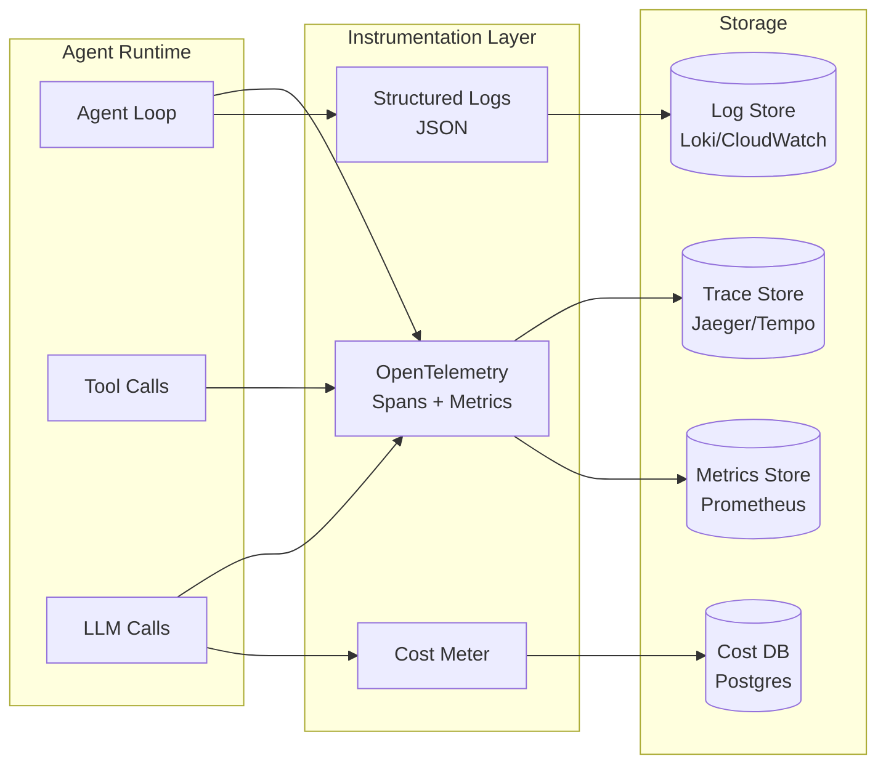
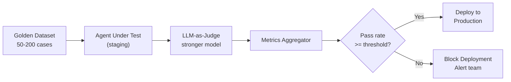
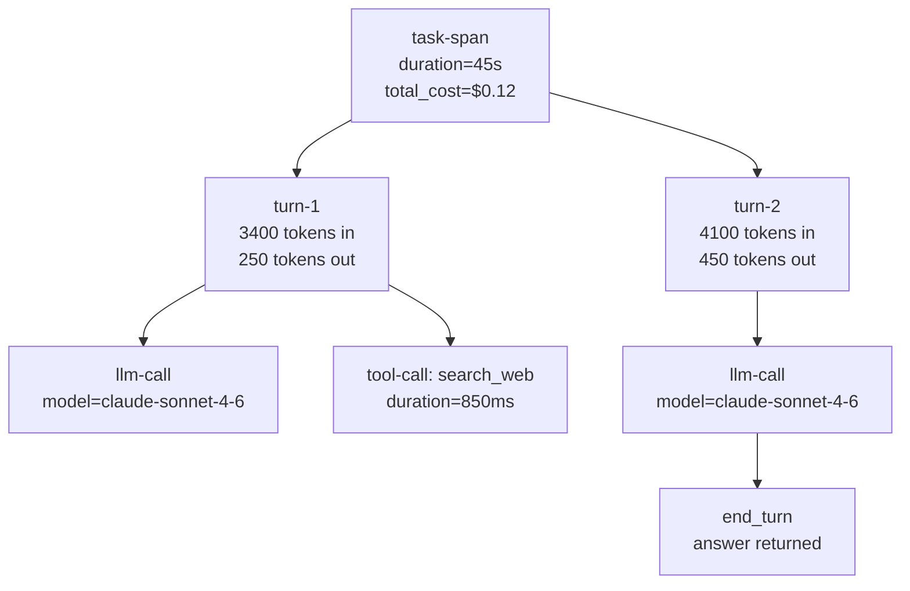

# Module 12 — Evaluation & Observability

> **Phase 3 — Multi-Agent & Orchestration** | Prerequisites: [Module 09 — Multi-Agent Systems](09-multi-agent-systems.md)

You cannot operate a system you cannot measure. For agents, this is uniquely hard: the output is natural language, the ground truth is ambiguous, and failures are often silent. This module builds the measurement stack from scratch.

---

## Table of Contents
1. [What It Is](#what-it-is)
2. [Why It Exists](#why-it-exists)
3. [Internal Architecture](#internal-architecture)
4. [How It Works](#how-it-works)
5. [Real-World Use Cases](#real-world-use-cases)
6. [Production Implementation](#production-implementation)
7. [Code Examples](#code-examples)
8. [Architecture Diagrams](#architecture-diagrams)
9. [Best Practices](#best-practices)
10. [Common Mistakes](#common-mistakes)
11. [Failure Modes](#failure-modes)
12. [Security Considerations](#security-considerations)
13. [Performance Considerations](#performance-considerations)
14. [Scalability Considerations](#scalability-considerations)
15. [Cost Considerations](#cost-considerations)
16. [Enterprise Recommendations](#enterprise-recommendations)
17. [When to Use / When Not to Use](#when-to-use--when-not-to-use)
18. [Trade-offs & Architectural Decisions](#trade-offs--architectural-decisions)
19. [Key Takeaways](#key-takeaways)

---

## What It Is

Agent evaluation and observability is the set of practices for:

- **Evaluating** correctness: does the agent produce good outputs? (offline eval + online monitoring)
- **Observing** behavior: what is the agent actually doing? (traces, logs, metrics)
- **Debugging** failures: why did the agent fail, and which turn caused it? (replay, time-travel)
- **Controlling** costs: how much does each task cost, and who pays? (cost attribution)

These are distinct but complementary concerns. Observability tells you *what happened*. Evaluation tells you *how good it was*.

---

## Why It Exists

Without eval and observability:
- You deploy prompt changes and don't know if they made things better or worse
- Production failures are reported by users, not caught by monitoring
- Debugging requires reproducing the issue (often impossible without turn logs)
- Cost surprises arrive at the end of the month
- You can't compare two agent versions objectively

The core challenge: LLM outputs are stochastic, multi-dimensional, and naturally language — there's no `assert result == expected`. Evaluation is fundamentally probabilistic and requires either human judgment or an LLM-as-judge, both of which introduce their own biases.

---

## Internal Architecture

### Observability Stack



---

## How It Works

### Metrics to Track

| Metric | Definition | Why It Matters |
|--------|-----------|---------------|
| Task success rate | % tasks that produce valid output | Primary KPI |
| pass@k | Probability any of k attempts succeeds | Reliability under retry |
| Tool call accuracy | % tool calls with correct name + args | Diagnostic: tool use quality |
| Turn efficiency | Avg turns per completed task | Cost proxy |
| Latency p50/p95/p99 | Turn + task latency distribution | User experience |
| Cost per task | $ of input + output tokens per task | FinOps |
| Faithfulness | Cited claims supported by retrieved context | RAG-specific quality |
| Hallucination rate | Claims in output not in context/knowledge | Reliability |
| Refusal rate | % tasks refused or escalated | Coverage |
| Token growth rate | Input tokens per turn, trending | Context efficiency |

### Offline Evaluation Framework

Offline eval runs against a curated golden dataset before deployment:

1. **Golden dataset**: 50-200 hand-crafted (task, expected_output) pairs covering happy path, edge cases, adversarial inputs, unanswerable questions
2. **Deterministic checks**: For structured output, check exact match, schema validity, required fields
3. **LLM-as-judge**: For free-form text, an LLM grades the answer against a rubric
4. **Pairwise comparison**: Compare agent-v2 vs agent-v1 directly ("which answer is better?")

### LLM-as-Judge

Using an LLM to evaluate LLM output is the best available tool for quality assessment at scale, but it has known biases:
- **Verbosity bias**: longer answers rated higher, independent of quality
- **Self-preference**: a model tends to rate its own outputs higher
- **Position bias**: first option in a pairwise comparison rated higher
- **Calibration drift**: grades inflate over time as few-shot examples skew the judge

Mitigations:
- Use a different, stronger model as the judge (not the same model being evaluated)
- Randomize position in pairwise comparisons
- Use structured rubric scoring (not "rate 1-10" but "does it address all sub-questions? Y/N")
- Calibrate against human labels on a sample

### OpenTelemetry Instrumentation

The GenAI semantic conventions define standard span attributes for LLM calls:
- `gen_ai.system`: "anthropic"
- `gen_ai.request.model`: "claude-sonnet-4-6"
- `gen_ai.usage.input_tokens`: 1234
- `gen_ai.usage.output_tokens`: 456

For agents, trace the full tree: task span → turn spans → LLM call spans + tool call spans.

---

## Real-World Use Cases

- **Pre-deployment**: Eval suite gates promotion from staging to production; regression test on every prompt change
- **Production monitoring**: Track task success rate; alert when it drops >5% week-over-week
- **Cost management**: Daily cost-per-agent-type dashboard; alert on any agent type exceeding $X/day
- **Debugging**: Replay a failing task turn-by-turn in a dev environment to find the root cause
- **A/B testing**: 10% of traffic to agent-v2, 90% to agent-v1; compare success rates after 1000 tasks

---

## Production Implementation

### Structured Agent Logger

```python
import time
import json
import uuid
import logging
from dataclasses import dataclass, field, asdict
from typing import Any

logger = logging.getLogger("agent.trace")

@dataclass
class TurnRecord:
    turn_id: str = field(default_factory=lambda: str(uuid.uuid4()))
    task_id: str = ""
    turn_number: int = 0
    input_tokens: int = 0
    output_tokens: int = 0
    cost_usd: float = 0.0
    stop_reason: str = ""
    tool_calls: list[dict] = field(default_factory=list)
    duration_ms: float = 0.0
    timestamp: float = field(default_factory=time.time)

@dataclass
class TaskRecord:
    task_id: str = field(default_factory=lambda: str(uuid.uuid4()))
    tenant_id: str = ""
    agent_type: str = ""
    goal_hash: str = ""  # hash of goal, not the goal itself (PII protection)
    status: str = "running"
    turns: list[TurnRecord] = field(default_factory=list)
    total_cost_usd: float = 0.0
    total_input_tokens: int = 0
    total_output_tokens: int = 0
    started_at: float = field(default_factory=time.time)
    finished_at: float | None = None
    success: bool | None = None
    error: str | None = None

class AgentObserver:
    def __init__(self, store=None):
        self.store = store  # e.g., a Postgres connection for production

    def start_task(self, task_id: str, tenant_id: str, agent_type: str, goal: str) -> TaskRecord:
        import hashlib
        record = TaskRecord(
            task_id=task_id,
            tenant_id=tenant_id,
            agent_type=agent_type,
            goal_hash=hashlib.sha256(goal.encode()).hexdigest()[:16],
        )
        logger.info("task_start", extra={"task_id": task_id, "tenant": tenant_id, "agent": agent_type})
        return record

    def record_turn(self, record: TaskRecord, response, tool_calls: list[dict], duration_ms: float):
        turn = TurnRecord(
            task_id=record.task_id,
            turn_number=len(record.turns) + 1,
            input_tokens=response.usage.input_tokens,
            output_tokens=response.usage.output_tokens,
            cost_usd=(response.usage.input_tokens * 3 + response.usage.output_tokens * 15) / 1_000_000,
            stop_reason=response.stop_reason,
            tool_calls=[{"name": tc.get("name"), "is_error": tc.get("is_error", False)}
                       for tc in tool_calls],
            duration_ms=duration_ms,
        )
        record.turns.append(turn)
        record.total_cost_usd += turn.cost_usd
        record.total_input_tokens += turn.input_tokens
        record.total_output_tokens += turn.output_tokens

        logger.info("turn_complete", extra={
            "task_id": record.task_id,
            "turn": turn.turn_number,
            "tokens_in": turn.input_tokens,
            "tokens_out": turn.output_tokens,
            "cost": f"${turn.cost_usd:.5f}",
            "tool_calls": len(turn.tool_calls),
            "stop_reason": turn.stop_reason,
        })

    def finish_task(self, record: TaskRecord, success: bool, error: str | None = None):
        record.finished_at = time.time()
        record.success = success
        record.error = error
        record.status = "succeeded" if success else "failed"
        duration_s = record.finished_at - record.started_at

        logger.info("task_finish", extra={
            "task_id": record.task_id,
            "success": success,
            "total_cost": f"${record.total_cost_usd:.4f}",
            "total_turns": len(record.turns),
            "duration_s": f"{duration_s:.1f}",
        })

        if self.store:
            self.store.save(asdict(record))
```

### LLM-as-Judge Eval Harness

```python
import json
from dataclasses import dataclass

@dataclass
class EvalCase:
    case_id: str
    task: str
    expected_criteria: list[str]  # What a good answer must satisfy
    context: str = ""  # Retrieved context, if applicable

@dataclass
class EvalResult:
    case_id: str
    agent_output: str
    scores: dict[str, int]  # criterion -> 0 or 1
    overall_score: float
    judge_reasoning: str
    passed: bool

JUDGE_SYSTEM = """You are an expert evaluator. Score the given AI assistant's answer against criteria.
For each criterion, score 1 (met) or 0 (not met). Be strict.
Respond ONLY with valid JSON."""

def run_llm_judge(
    case: EvalCase,
    agent_output: str,
    client,
) -> EvalResult:
    criteria_list = "\n".join(f"{i+1}. {c}" for i, c in enumerate(case.expected_criteria))
    criteria_keys = {f"criterion_{i+1}": c for i, c in enumerate(case.expected_criteria)}

    schema = {
        "type": "object",
        "properties": {
            **{k: {"type": "integer", "enum": [0, 1], "description": v}
               for k, v in criteria_keys.items()},
            "reasoning": {"type": "string"},
        },
        "required": list(criteria_keys.keys()) + ["reasoning"],
    }

    judge_prompt = f"""Task: {case.task}

{"Context: " + case.context if case.context else ""}

Agent Answer:
{agent_output}

Criteria to evaluate:
{criteria_list}

Score each criterion 0 or 1. Return JSON matching this schema: {json.dumps(schema, indent=2)}"""

    resp = client.messages.create(
        model="claude-sonnet-4-6",
        max_tokens=500,
        system=JUDGE_SYSTEM,
        messages=[{"role": "user", "content": judge_prompt}],
    )

    try:
        result = json.loads(resp.content[0].text)
        scores = {k: result[k] for k in criteria_keys}
        overall = sum(scores.values()) / len(scores) if scores else 0.0
        return EvalResult(
            case_id=case.case_id,
            agent_output=agent_output,
            scores=scores,
            overall_score=overall,
            judge_reasoning=result.get("reasoning", ""),
            passed=overall >= 0.8,
        )
    except (json.JSONDecodeError, KeyError) as e:
        return EvalResult(
            case_id=case.case_id,
            agent_output=agent_output,
            scores={},
            overall_score=0.0,
            judge_reasoning=f"Judge parse error: {e}",
            passed=False,
        )


def run_eval_suite(
    cases: list[EvalCase],
    run_agent,  # callable(task) -> str
    client,
    pass_threshold: float = 0.8,
) -> dict:
    results = []
    for case in cases:
        output = run_agent(case.task)
        result = run_llm_judge(case, output, client)
        results.append(result)

    pass_rate = sum(1 for r in results if r.passed) / len(results)
    avg_score = sum(r.overall_score for r in results) / len(results)

    return {
        "pass_rate": pass_rate,
        "average_score": avg_score,
        "passed": pass_rate >= pass_threshold,
        "cases": len(results),
        "failures": [r.case_id for r in results if not r.passed],
    }
```

### OTel Span Instrumentation

```python
from opentelemetry import trace
from opentelemetry.trace import Status, StatusCode
from opentelemetry.semconv._incubating.attributes import gen_ai_attributes

tracer = trace.get_tracer("agent.runner")

def instrumented_llm_call(client, model: str, system: str, messages: list, tools: list):
    """Wrap an Anthropic API call with OpenTelemetry spans."""
    with tracer.start_as_current_span("gen_ai.chat") as span:
        span.set_attribute("gen_ai.system", "anthropic")
        span.set_attribute("gen_ai.request.model", model)
        span.set_attribute("gen_ai.operation.name", "chat")

        try:
            response = client.messages.create(
                model=model,
                max_tokens=4096,
                system=system,
                tools=tools,
                messages=messages,
            )
            span.set_attribute("gen_ai.usage.input_tokens", response.usage.input_tokens)
            span.set_attribute("gen_ai.usage.output_tokens", response.usage.output_tokens)
            span.set_attribute("gen_ai.response.stop_reason", response.stop_reason)
            span.set_status(Status(StatusCode.OK))
            return response
        except Exception as e:
            span.set_status(Status(StatusCode.ERROR, str(e)))
            span.record_exception(e)
            raise


def instrumented_tool_call(tracer, tool_name: str, args: dict, handler):
    """Wrap a tool execution with its own span, nested under the parent."""
    with tracer.start_as_current_span(f"tool.{tool_name}") as span:
        span.set_attribute("tool.name", tool_name)
        span.set_attribute("tool.args_keys", str(list(args.keys())))
        try:
            result = handler(**args)
            span.set_attribute("tool.success", True)
            return result, False
        except Exception as e:
            span.set_attribute("tool.success", False)
            span.set_attribute("tool.error", str(e)[:200])
            span.record_exception(e)
            return str(e), True
```

---

## Architecture Diagrams

### Eval Pipeline



### Trace Tree for Multi-Agent



---

## Best Practices

1. **Build your golden dataset before writing the agent.** Define what correct looks like first. If you can't write a golden dataset, you don't know what you're building.
2. **Separate deterministic checks from LLM-as-judge.** Deterministic checks (schema validity, citation format, required fields present) are fast and free. Run them first; only LLM-judge for nuanced quality.
3. **Track metrics over time, not just snapshots.** A single eval run tells you the current state. Trending tells you if you're improving or regressing. Set up time-series dashboards for your key metrics.
4. **Include adversarial cases in your golden dataset.** Injection attempts, unanswerable questions, misleading context. A pass rate measured only on easy cases is not a useful signal.
5. **Never use the same model as both agent and judge.** The agent's own model has self-preference bias. Use a different model (preferably stronger) as the judge.
6. **Log the full turn, not just the answer.** The answer alone is insufficient for debugging. Log: system prompt hash, input messages array, response content, tool calls and results, all together.
7. **Alert on metric regression, not absolute thresholds.** A 5% week-over-week drop in pass rate is more meaningful than an absolute 80% pass rate threshold.

---

## Common Mistakes

| Mistake | Impact | Fix |
|---------|--------|-----|
| Only evaluating happy path cases | High pass rate but fails on real inputs | Include edge cases, adversarial inputs, unanswerable questions |
| LLM judge and agent are the same model | Self-preference inflates scores | Use a different, preferably stronger, model as judge |
| Logging only the final answer | Impossible to debug failures | Log every turn with full context |
| No cost attribution | Monthly surprise bill | Cost tracking from day 1; per-task, per-agent-type |
| Eval only before deployment | Regressions in production go undetected | Continuous online eval via sampling + user feedback |
| No baseline | Can't tell if changes help | Establish a baseline pass rate on day 1; compare all changes against it |

---

## Failure Modes

| Failure | Symptom | Root Cause | Detection | Mitigation |
|---------|---------|-----------|-----------|------------|
| Eval score inflation | High pass rate, bad production feedback | Easy golden dataset; judge calibration drift | Shadow eval on real production tasks | Include harder cases; human-calibrate judge |
| Silent regression | Production quality drops without alert | No continuous eval | Sample 5% of production tasks for eval | Automated sampling eval pipeline |
| Trace data too large | Tracing storage costs explode | Logging every token in context | Sample traces at 10-20% for non-error tasks | Error traces: 100%; success traces: 10% sampling |
| Cost attribution wrong | Teams can't reconcile charges | Task cost spread across multiple agents without attribution | Trace tree with per-span cost | Tag all LLM calls with task_id + agent_type |
| Judge inconsistency | Same output gets different scores | Judge is stochastic | Run judge N=3 times; use majority | Multi-run judge with temperature=0 for consistency |

---

## Security Considerations

- **Never log PII in traces.** Goal descriptions, user inputs, and tool results may contain PII. Hash or redact before writing to trace store.
- **Eval datasets can contain injection payloads.** If your eval tests injection defenses, the test cases themselves contain adversarial content. Store them separately; don't include in training data pipelines.
- **Cost data is sensitive.** Per-tenant cost data reveals usage patterns. Store in a separately access-controlled database.

---

## Performance Considerations

- **Async logging.** Write traces and logs to a queue (Kafka, async buffer) — never block the agent turn on I/O.
- **Sampling production traces.** Full tracing for 100% of tasks is expensive. Sample 10-20% for success, 100% for failures and high-cost tasks.
- **Batch eval runs.** Use the Anthropic Batch API for large eval suites. 50% cost discount, and eval correctness doesn't require streaming.

---

## Scalability Considerations

- **Centralized trace store.** All agent runners ship traces to one store (Jaeger, Grafana Tempo). Querying across tasks requires a single backend.
- **Per-tenant cost accounting.** Instrument every LLM call with `tenant_id` and `agent_type`. Cost attribution queries must be O(1) per tenant, not a full-table scan.
- **Eval parallelization.** Run golden dataset cases in parallel against the agent under test. 100-case eval should take minutes, not hours.

---

## Cost Considerations

| Eval cost driver | Estimate | Optimization |
|-----------------|---------|-------------|
| Agent running eval cases | N cases × task cost | Batch API (50% off); parallelize |
| LLM-as-judge | N cases × ~500 tokens × judge cost | Use Haiku for simple criteria; Sonnet for complex |
| Production trace storage | ~1KB per turn × turns per day | Sample 10%; compress; TTL after 30 days |

---

## Enterprise Recommendations

1. **Eval is a deployment gate, not an afterthought.** No agent version goes to production without a passing eval run. Encode this in CI/CD.
2. **Maintain a living golden dataset.** Add new cases when production failures are discovered. The golden dataset is the agent's specification.
3. **Cost dashboard by agent type and tenant.** Enable FinOps decisions (which agents are worth their cost?) and billing (charge-back to tenant).
4. **User feedback loop.** For customer-facing agents, collect explicit thumbs up/down on answers. Use negative feedback to grow the golden dataset.
5. **Eval environment parity.** The staging eval environment must use the same models, tools, and data as production. Eval in a degraded environment produces meaningless scores.

---

## When to Use / When Not to Use

Evaluation and observability are not optional — use them for all production agents. The question is depth:

| Agent Tier | Eval Depth | Observability |
|------------|-----------|---------------|
| Internal tool | 20-case golden set; manual review | Basic logging + cost tracking |
| Customer-facing | 100+ cases; automated eval gate; online sampling | Full OTel tracing; metrics dashboards; cost attribution |
| High-stakes | 200+ cases; red-team set; human review layer | Full tracing; anomaly detection; compliance audit log |

---

## Trade-offs & Architectural Decisions

### How many golden dataset cases?
- Too few (<20): not statistically meaningful; one bad case skews results
- Too many (>500): expensive to evaluate; slow CI; diminishing returns
- Sweet spot: 50-150 cases, covering: happy path (40%), edge cases (30%), adversarial (20%), unanswerable (10%)

### LLM-as-judge model choice?
- Same model as agent: cheap, biased
- Stronger model: better calibration, more expensive
- Separate evaluation model class (e.g., use Opus to judge Sonnet agents): best quality, 3-5× the judge cost
- Rule: use stronger model for high-stakes agents; Haiku for rapid iteration evals

---

## Key Takeaways

- You can't operate what you can't measure. Eval and observability are the engineering foundation, not a nice-to-have.
- Build the golden dataset before writing the agent — it's the specification.
- LLM-as-judge is the best available tool for quality evaluation at scale, but has known biases. Mitigate with rubric scoring, different model, position randomization.
- Trace the full turn tree, not just LLM calls — tool calls, latency, and cost per step are essential for debugging.
- Log asynchronously; never block the agent turn on I/O.
- Cost attribution belongs in the trace: task_id + agent_type + tenant_id on every LLM call.
- Continuous online eval (sampling production tasks) is required to detect regressions between deployments.
- Eval is a deployment gate. Encode it in CI/CD.

## Further Study

- RAGAS: Automated Evaluation of Retrieval Augmented Generation
- G-Eval: NLG Evaluation using GPT-4 with Better Human Alignment
- OpenTelemetry GenAI Semantic Conventions (semantic-conventions specification)
- SWE-bench: Can Language Models Resolve Real-World GitHub Issues?
- Tau-bench: Tool Agent User Simulation Benchmark
- Weights & Biases (W&B) and Braintrust — agent evaluation platforms
- Langfuse — open-source LLM observability
