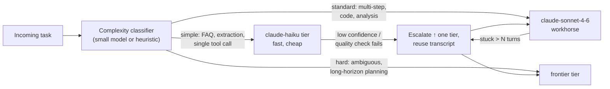
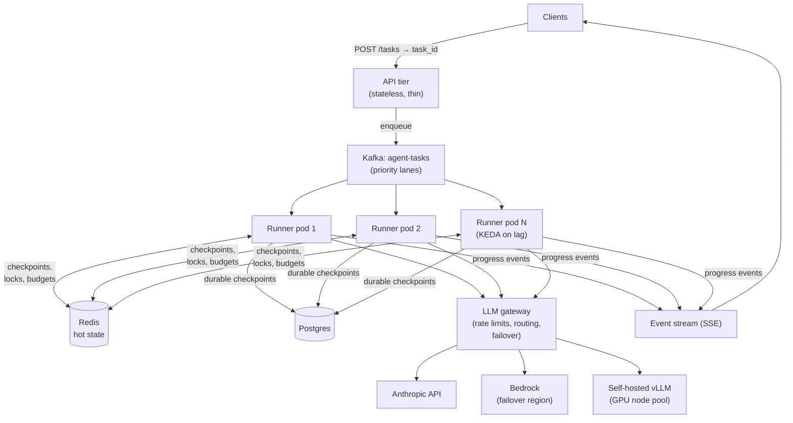
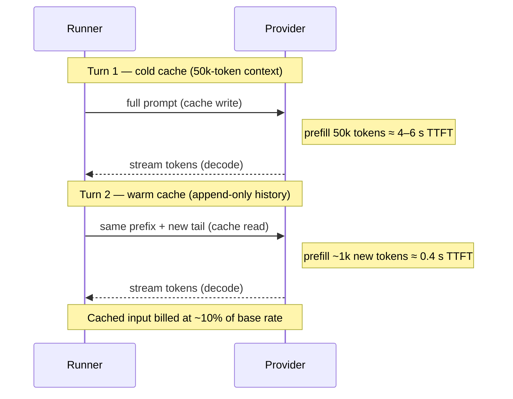
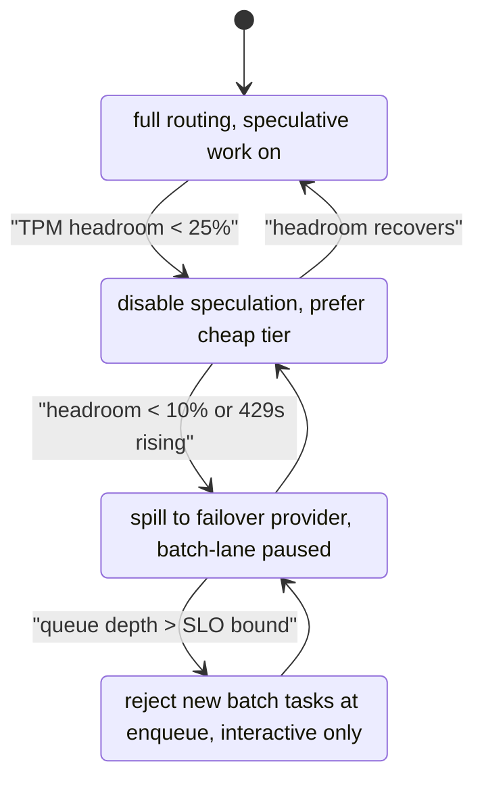

# Module 13 — Performance & Scalability

> **Audience:** Senior engineers (8+ years) architecting production agent systems.
> **Prerequisites:** [Module 12 — Evaluation & Observability](12-evaluation-observability.md), familiarity with LLM API mechanics, Kubernetes fundamentals.
> **Related:** [Module 14 — AI Infrastructure](14-ai-infrastructure.md), [Module 16 — Cost Optimization](16-cost-optimization.md)

Agent systems break the performance intuitions you built on stateless microservices. A single user request fans out into an unbounded loop of model calls, tool invocations, and sub-agent spawns — each with tail latencies measured in seconds, not milliseconds. This module dissects where time goes in an agent turn, then builds up the full toolbox: caching at four layers, model routing, parallelism, streaming, horizontal scaling of stateless runners, distributed state, Kubernetes patterns for long-running work, provider rate-limit management, and load testing that actually reflects agentic traffic.

## Table of Contents

1. [What It Is](#what-it-is)
2. [Why It Exists](#why-it-exists)
3. [Internal Architecture](#internal-architecture)
4. [How It Works](#how-it-works)
5. [Real-World Use Cases](#real-world-use-cases)
6. [Production Implementation](#production-implementation)
7. [Code Examples](#code-examples)
8. [Architecture Diagrams](#architecture-diagrams)
9. [Best Practices](#best-practices)
10. [Common Mistakes](#common-mistakes)
11. [Failure Modes](#failure-modes)
12. [Security Considerations](#security-considerations)
13. [Performance Considerations](#performance-considerations)
14. [Scalability Considerations](#scalability-considerations)
15. [Cost Considerations](#cost-considerations)
16. [Enterprise Recommendations](#enterprise-recommendations)
17. [When to Use / When Not to Use](#when-to-use--when-not-to-use)
18. [Trade-offs & Architectural Decisions](#trade-offs--architectural-decisions)
19. [Key Takeaways](#key-takeaways)

---

## What It Is

Performance and scalability engineering for agents is the discipline of controlling **latency, throughput, and concurrency** in systems whose unit of work is a *loop* rather than a *call*. It spans four altitudes:

- **Turn-level:** time-to-first-token (TTFT), decode rate, prompt-cache hit rate for a single model call.
- **Task-level:** loop count, tool latency, parallelism across tool calls and sub-agents.
- **Service-level:** horizontal scaling of agent runners, state externalization, backpressure via queues.
- **Fleet-level:** provider rate limits, regional failover, GPU capacity for self-hosted models.

The defining property: **agent latency is multiplicative, not additive in the usual sense.** A 10-turn agent task with 3 s mean turn latency and 800 ms mean tool latency is a 38-second operation before you've done anything wrong. Every optimization either reduces per-turn cost or reduces the number of turns — and the second lever is usually bigger.

## Why It Exists

Three structural facts force this discipline into existence:

1. **LLM inference is slow and priced per token.** A frontier model decodes at perhaps 50–150 tokens/second. An agent that re-reads a growing transcript every turn pays quadratic-ish prompt costs and linearly growing TTFT unless caching intervenes. Classical "add an index" or "add a CDN" fixes do not apply.

2. **Agents are long-running, stateful workloads on infrastructure designed for short, stateless ones.** A Kubernetes pod handling a 6-minute agent task cannot be drained in the default 30-second grace period. An HTTP load balancer with a 60-second idle timeout kills streaming connections. Autoscaling on CPU is meaningless when the pod is 95% idle, awaiting model responses.

3. **You don't own the bottleneck.** Your throughput ceiling is your providers' rate limits (requests/min, input-tokens/min, output-tokens/min) — quotas you negotiate, not provision. Scalability work for agents is substantially *quota arbitrage*: routing, batching, caching, and degrading gracefully across multiple providers and tiers.

Without deliberate engineering, agent systems exhibit a characteristic production pathology: fine at low traffic, then a sudden cliff when a provider rate limit saturates, queues back up, retries amplify load, and p99 latency goes from 20 seconds to 5 minutes in under a minute.

## Internal Architecture

### Latency Anatomy of an Agent Turn

Decompose a single turn precisely, because each component has a different fix:

| Component | Typical Range | Dominated By | Primary Lever |
|---|---|---|---|
| Network + queueing to provider | 20–200 ms | Region, provider load | Regional endpoints, provider selection |
| **TTFT (prefill)** | 200 ms – 8 s | Prompt length × cache misses | **Prompt caching**, context pruning |
| **Decode (output tokens)** | 1–30 s | Output length × tokens/sec | Shorter outputs, smaller models, streaming UX |
| Tool dispatch + execution | 50 ms – 60 s | The tool itself | Tool-result caching, parallel calls, timeouts |
| Orchestrator overhead | 1–50 ms | Serialization, state I/O | Usually negligible — measure before optimizing |

And the task-level equation:

```
task_latency ≈ Σ over turns [ TTFT(context_i) + decode(output_i) + max(parallel tool latencies_i) ]
task_latency ≈ N_turns × (TTFT_avg + decode_avg + tool_avg)   # serial tools
```

**The two highest-leverage numbers in that equation are `N_turns` and the cache-hit-adjusted `TTFT_avg`.** Halving loop count halves everything. A prompt-cache hit can cut TTFT on a 50k-token context from ~5 s to ~500 ms.

### The Four Caching Layers

| Layer | What's cached | Hit condition | Typical hit rate | Saves |
|---|---|---|---|---|
| **Prompt cache** (provider-side) | KV-cache of prompt prefix | Exact prefix match, TTL ~5 min (refreshed on use) | 70–95% within a session | TTFT + ~90% of input cost on cached tokens |
| **Semantic cache** | Full responses, keyed by embedding similarity | Query similarity ≥ threshold | 5–40% (workload-dependent) | Entire model call |
| **Embedding cache** | Embedding vectors, keyed by content hash | Exact text match | High for repeated corpora | Embedding API calls |
| **Tool-result cache** | Tool outputs, keyed by (tool, canonical args) | Exact or normalized arg match, per-tool TTL | 20–60% for read-only tools | Tool latency + tokens to re-process |

**Prompt caching mechanics** deserve precision because they dictate prompt design. Providers cache the computed KV-state of a prompt *prefix*. With Anthropic's API you place `cache_control` breakpoints; everything before a breakpoint is cacheable. The cache key is the exact token sequence — one changed character at position 0 invalidates everything after it. This forces **cache-friendly prompt ordering**:

```
[static system prompt]          ← cache breakpoint 1 (never changes)
[tool definitions]              ← cache breakpoint 2 (changes per deploy)
[long reference docs / RAG that's stable per-session]  ← breakpoint 3
[conversation history]          ← grows append-only → prefix stays valid
[current user message / latest tool results]           ← volatile tail
```

Rules that fall out of this:
- **Never** put timestamps, request IDs, or user names at the top of the system prompt. A `Current time: 14:32:07` header is a 100%-cache-miss generator.
- Append-only conversation structure preserves the cached prefix across turns; mid-history edits (summarizing turn 3, deleting turn 5) invalidate from the edit point onward. Compact at deliberate moments, accepting one cold turn.
- Order tool definitions deterministically (sorted by name). A dict with unstable iteration order silently destroys your cache hit rate.
- Cache writes cost a premium (~25% over base input on Anthropic); reads cost ~10% of base. Break-even is roughly two reads — almost always worth it for multi-turn agents.

### Model Routing

A complexity-tiered fleet beats a single frontier model on both latency and cost:



Two viable classifier designs:
1. **Heuristic-first:** route on observable features (input length, presence of code, tool count requested, customer tier). Zero latency, explainable, ~80% as good.
2. **Small-model classifier:** a fast model emits `{tier, confidence}` in <300 ms. Better on ambiguous traffic; adds a call to every request — cache its outputs.

**Escalation is the safety net that makes small-model-first safe.** The small model attempts the task; an outcome check (schema validation, self-reported confidence, eval-style judge, or "stuck" detection — same tool called 3× with same args) triggers escalation. Crucially, the escalated model receives the *transcript so far*, so the cheap attempt's work (tool results already fetched) isn't wasted.

### Parallel Execution

Three independent parallelism axes:

1. **Parallel tool calls within a turn.** Modern models emit multiple tool calls in one response. Your executor must run them concurrently (`asyncio.gather`), not serially. This alone often cuts task latency 30–50% on research/retrieval-heavy agents. Prompt for it explicitly: "When tool calls are independent, issue them together."
2. **Parallel sub-agents.** An orchestrator decomposes a task and fans out to isolated sub-agents, each with its own (small) context. Latency becomes `max(branches)` instead of `sum(branches)`, and each branch's context stays short — compounding the TTFT win. See [Module 9 — Multi-Agent Systems](09-multi-agent-systems.md).
3. **Speculative work.** Start probable next steps before they're confirmed: prefetch the top-3 retrieval candidates while the model is still deciding; warm the prompt cache for a likely follow-up; speculatively run the cheap-model attempt while the classifier deliberates. Discard losers. You trade compute for latency — meter it.

### Streaming

Streaming doesn't reduce total latency; it transforms *perceived* latency. Stream model tokens to the client as they decode; stream **progress events** (tool started / tool finished / turn N of M) during the opaque tool-execution phases. For a 40-second agent task, the difference between a spinner and a live narration is the difference between "broken" and "working hard." Server-side: use SSE or WebSockets, send heartbeats every ~15 s to survive LB idle timeouts, and design resumability (client reconnects with a cursor; events replayed from the externalized event log).

## How It Works

### Horizontal Scaling of Stateless Agent Runners

The cardinal rule: **the agent runner process holds zero durable state.** Every piece of task state — transcript, scratchpad, tool outputs, loop counter, budget consumed — lives in an external store (Redis for hot state, Postgres for checkpoints; see [Module 14 — AI Infrastructure](14-ai-infrastructure.md)). The runner is a pure function: `(task_id, checkpoint) → (next checkpoint | result)`.

This buys you:
- **Any-replica resumability.** A runner crash mid-task loses at most one turn of work; another replica picks up from the last checkpoint.
- **Trivial autoscaling.** Replicas are interchangeable; scale on queue depth.
- **Graceful drain.** A terminating pod finishes its current *turn*, checkpoints, and releases the task back to the queue — it doesn't need to finish the whole task.

### Sticky Sessions vs Shared State

| Approach | Mechanics | Pros | Cons | Use when |
|---|---|---|---|---|
| **Sticky sessions** | LB pins a session to a replica; state in process memory | Lowest latency, simplest code | Crash loses state; drain is hard; hot replicas; resists autoscaling | Prototypes; sub-second interactive turn loops |
| **Shared state** (recommended) | State in Redis/Postgres; any replica serves any turn | Crash-safe, autoscalable, drainable | +5–20 ms/turn for state I/O; serialization discipline; needs locking | Production, anything long-running |
| **Hybrid** | Soft affinity for cache locality + externalized source of truth | Fast common path, safe failure path | Most complex | High-scale latency-sensitive systems |

The state I/O penalty (single-digit ms against multi-second turns) is noise. Choose shared state; add soft affinity only if profiling proves you need it.

### Queues for Backpressure

Synchronous request → agent loop → response collapses under load: clients time out, retries pile on, provider limits saturate. Production shape:

```
client → API (enqueue, return task_id) → queue (Kafka / SQS) → runner pool → event stream / poll endpoint
```

The queue absorbs bursts, exposes a clean autoscaling signal (depth/lag), enables priority lanes (interactive vs batch), and provides a natural admission-control point — reject or shed at enqueue time when depth exceeds SLO-compatible levels, rather than failing mysteriously mid-task.

### Kubernetes Patterns

- **Autoscale on queue depth, not CPU.** Agent runners idle on network waits; CPU-based HPA will scale *down* under heavy load. Use KEDA with a Kafka-lag or Redis-list trigger (example below), or HPA on a custom `pending_tasks / replica` metric.
- **Pod sizing:** runners are I/O-bound — small CPU (0.5–1 core), moderate memory (512 Mi–2 Gi), high per-pod async concurrency (50–200 in-flight tasks per process if state is externalized). Size *concurrency per pod* against provider rate-limit shares, not hardware.
- **GPU node pools (self-hosted models only):** separate node pool, taints + tolerations so only inference servers (vLLM/TGI) schedule there; runners stay on cheap CPU nodes and call inference over the network. Bin-pack models to GPU memory; use MIG/fractional GPUs for small models. Autoscale on tokens-in-flight or KV-cache utilization, never CPU.
- **Graceful drain for long tasks:** set `terminationGracePeriodSeconds` to your p99 *turn* time plus checkpoint time (e.g., 120–300 s, not the default 30). A `preStop` hook flips the runner to "lame-duck": stop pulling new tasks, finish in-flight turns, checkpoint, release. PodDisruptionBudgets prevent simultaneous mass drains during node upgrades.

### Rate-Limit Management Across Providers

Treat provider quotas as a first-class scheduled resource:

1. **Centralize** all model traffic through a gateway (see [Module 14 — AI Infrastructure](14-ai-infrastructure.md)) — per-runner client-side limiting can't see fleet-wide consumption.
2. **Track all three dimensions:** RPM, input-TPM, output-TPM. Agents with fat contexts exhaust input-TPM long before RPM.
3. **Budget-aware admission:** before dispatching a turn, estimate its token cost; acquire from a distributed token bucket (Redis); queue or downgrade-route if unavailable.
4. **Honor `retry-after`** headers; on 429, retry with jittered exponential backoff *and* feed back into admission control (shrink the bucket) so you stop hammering.
5. **Spill across providers/regions:** same model family via second region or Bedrock/Vertex; or downshift a tier under pressure. Define the degradation ladder *before* the incident.

### Load Testing Agents

Conventional load tests (constant RPS of identical requests) are useless here. Requirements:

- **Replay realistic task distributions** harvested from production traces — loop-count and token distributions are heavy-tailed and dominate system behavior.
- **Mock providers with calibrated latency**, including TTFT vs decode phases, jitter, and injected 429s/500s — you're load-testing *your* orchestration, queues, and state layer, not paying to load-test Anthropic.
- **Test the cliffs:** ramp until a simulated provider quota saturates and verify queues absorb, shedding engages, and p99 degrades smoothly rather than discontinuously.
- **Measure task-level SLOs** (task p50/p95/p99, abandonment, escalation rate under pressure), not just request-level.
- Run a small-scale **live-provider soak** separately to validate real rate-limit behavior and cache hit rates.

## Real-World Use Cases

- **Customer-support agent fleet (10k conversations/day):** small-model-first routing answers ~60% of contacts on the fast tier; prompt caching across multi-turn conversations cuts input cost ~80%; KEDA scales runners on Redis queue depth between business-hours peaks and overnight troughs. (Cost math in [Module 16 — Cost Optimization](16-cost-optimization.md).)
- **Code-review agent on monorepo CI:** bursty traffic (merge trains), 5–40 file reviews fanned out as parallel sub-agents, results reduced by an orchestrator. Queue-based backpressure prevents CI stampedes from blowing provider quotas; tool-result cache deduplicates re-reviews of unchanged files.
- **Research/RAG agent:** parallel tool calls fetch 6 sources concurrently (latency = max, not sum); semantic cache serves repeated organizational questions ("what's our parental leave policy") at p50 < 200 ms.
- **Self-hosted inference for compliance:** vLLM on a tainted GPU pool serving an open-weights model for PII-bearing steps, frontier API for the rest — the router picks per-step based on data classification.

## Production Implementation

A reference rollout order that front-loads the highest-leverage work:

1. **Instrument first.** Per-turn spans for TTFT, decode, tool latency; per-task loop count, total tokens, cache hit rate. You cannot optimize what [Module 12 — Evaluation & Observability](12-evaluation-observability.md) hasn't measured.
2. **Prompt-cache hygiene.** Reorder prompts static-first, fix nondeterministic serialization, add cache breakpoints. Often a one-day change worth 50–80% of input spend and seconds of TTFT.
3. **Parallel tool execution.** Switch the executor to `asyncio.gather`; prompt the model to batch independent calls.
4. **Externalize state + queue.** Redis checkpoints, Kafka/SQS ingestion, lame-duck drain. This is the prerequisite for everything Kubernetes-shaped.
5. **Model routing with escalation.** Start heuristic, graduate to classifier, always with an escalation path and an eval suite guarding quality (eval gates from [Module 15 — Deployment & Operations](15-deployment-operations.md)).
6. **KEDA autoscaling + load test.** Scale on queue depth; replay production traces against mocked providers; verify the degradation ladder.
7. **Semantic + tool-result caches.** Last, because they need traffic data to tune thresholds and TTLs safely.

## Code Examples

### 1. Model Router with Tiered Escalation

```python
"""Complexity-routed agent execution with automatic escalation."""
import anthropic
from dataclasses import dataclass, field

client = anthropic.Anthropic()

TIERS = ["claude-haiku-4-5", "claude-sonnet-4-6", "claude-opus-4-6"]

@dataclass
class TurnBudget:
    max_turns: int = 12
    stuck_window: int = 3          # identical tool calls in a row → stuck
    recent_calls: list = field(default_factory=list)

    def record(self, tool_name: str, args_hash: str) -> None:
        self.recent_calls.append((tool_name, args_hash))
        self.recent_calls = self.recent_calls[-self.stuck_window:]

    @property
    def is_stuck(self) -> bool:
        rc = self.recent_calls
        return len(rc) == self.stuck_window and len(set(rc)) == 1


def classify_tier(task: str) -> int:
    """Cheap heuristic pass; fall through to a small-model classifier."""
    if len(task) < 400 and not any(k in task.lower() for k in ("debug", "refactor", "analyze")):
        return 0
    resp = client.messages.create(
        model="claude-haiku-4-5",
        max_tokens=8,
        system=("Classify task complexity. Reply with exactly one word: "
                "SIMPLE, STANDARD, or HARD."),
        messages=[{"role": "user", "content": task[:2000]}],
    )
    return {"SIMPLE": 0, "STANDARD": 1, "HARD": 2}.get(
        resp.content[0].text.strip().upper(), 1)


async def run_task(task: str, tools: list[dict], execute_tool) -> str:
    tier = classify_tier(task)
    messages = [{"role": "user", "content": task}]

    while tier < len(TIERS):
        budget = TurnBudget()
        for _ in range(budget.max_turns):
            resp = client.messages.create(
                model=TIERS[tier],
                max_tokens=4096,
                tools=tools,
                messages=messages,   # transcript carries over on escalation
            )
            messages.append({"role": "assistant", "content": resp.content})

            if resp.stop_reason != "tool_use":
                return resp.content[0].text

            tool_uses = [b for b in resp.content if b.type == "tool_use"]
            results = await asyncio.gather(  # parallel tool execution
                *(execute_tool(t.name, t.input) for t in tool_uses))
            for t, r in zip(tool_uses, results):
                budget.record(t.name, hash_args(t.input))
            messages.append({"role": "user", "content": [
                {"type": "tool_result", "tool_use_id": t.id, "content": r}
                for t, r in zip(tool_uses, results)]})

            if budget.is_stuck:
                break  # escalate with transcript intact — work is preserved

        tier += 1
        messages.append({"role": "user", "content":
            "A more capable model is taking over. Review the transcript, "
            "diagnose why progress stalled, and complete the task."})

    raise RuntimeError("Task failed at all tiers")
```

### 2. Semantic Cache with Staleness and Safety Guards

```python
"""Embedding-similarity response cache. Sits in front of the agent for
read-only, non-personalized queries ONLY — never cache across users
without including the permission scope in the key."""
import hashlib, json, time
import numpy as np
import redis

r = redis.Redis(decode_responses=False)

SIM_THRESHOLD = 0.94      # tune on labeled near-duplicate pairs; start strict
TTL_SECONDS   = 3600
NAMESPACE_FMT = "semcache:{tenant}:{scope_hash}"   # tenant + permission scope

def _scope_hash(user_permissions: list[str]) -> str:
    return hashlib.sha256(json.dumps(sorted(user_permissions)).encode()).hexdigest()[:12]

def embed(text: str) -> np.ndarray:
    key = b"emb:" + hashlib.sha256(text.encode()).digest()
    if (hit := r.get(key)) is not None:                 # embedding cache layer
        return np.frombuffer(hit, dtype=np.float32)
    vec = embedding_model.encode(text).astype(np.float32)
    vec /= np.linalg.norm(vec)
    r.set(key, vec.tobytes(), ex=86400)
    return vec

def lookup(query: str, tenant: str, perms: list[str]) -> str | None:
    ns = NAMESPACE_FMT.format(tenant=tenant, scope_hash=_scope_hash(perms))
    qv = embed(query)
    entries = r.hgetall(ns + ":index")                  # small N; use a vector
    best_sim, best_key = 0.0, None                      # index past ~10k entries
    for key, packed in entries.items():
        vec = np.frombuffer(packed, dtype=np.float32)
        if (sim := float(qv @ vec)) > best_sim:
            best_sim, best_key = sim, key
    if best_sim >= SIM_THRESHOLD and best_key:
        if (payload := r.get(ns + ":val:" + best_key.decode())):
            record_metric("semcache.hit", similarity=best_sim)
            return payload.decode()
    record_metric("semcache.miss", best_similarity=best_sim)
    return None

def store(query: str, response: str, tenant: str, perms: list[str]) -> None:
    if contains_volatile_content(response):   # dates, balances, ticket status…
        return                                # never cache time-sensitive answers
    ns = NAMESPACE_FMT.format(tenant=tenant, scope_hash=_scope_hash(perms))
    key = hashlib.sha256(query.encode()).hexdigest()[:16]
    pipe = r.pipeline()
    pipe.hset(ns + ":index", key, embed(query).tobytes())
    pipe.set(ns + ":val:" + key, response, ex=TTL_SECONDS)
    pipe.expire(ns + ":index", TTL_SECONDS * 2)
    pipe.execute()
```

### 3. Cache-Friendly Prompt Assembly (Anthropic prompt caching)

```python
"""Prompt ordering that maximizes provider-side prefix-cache hits."""
def build_request(system_core: str, tool_defs: list[dict],
                  session_docs: str, history: list[dict]) -> dict:
    return {
        "model": "claude-sonnet-4-6",
        "max_tokens": 4096,
        "system": [
            # Layer 1: immutable across ALL sessions — highest reuse.
            {"type": "text", "text": system_core,
             "cache_control": {"type": "ephemeral"}},
            # Layer 2: stable per-session reference material.
            {"type": "text", "text": session_docs,
             "cache_control": {"type": "ephemeral"}},
        ],
        # Deterministic ordering — unstable dict order breaks the prefix.
        "tools": sorted(tool_defs, key=lambda t: t["name"]),
        # Append-only history keeps the cached prefix valid every turn.
        # Volatile data (current time, request id) goes in the FINAL user
        # message only — never in the system prompt.
        "messages": history,
    }
```

### 4. KEDA ScaledObject + Graceful Drain for Agent Runners

```yaml
# keda-agent-runners.yaml
apiVersion: keda.sh/v1alpha1
kind: ScaledObject
metadata:
  name: agent-runner-scaler
spec:
  scaleTargetRef:
    name: agent-runner
  minReplicaCount: 3
  maxReplicaCount: 60
  cooldownPeriod: 300            # long tasks: scale down slowly
  triggers:
    - type: kafka
      metadata:
        bootstrapServers: kafka.infra:9092
        consumerGroup: agent-runners
        topic: agent-tasks
        lagThreshold: "20"       # target ~20 pending tasks per replica
    - type: prometheus            # guardrail: provider quota headroom
      metadata:
        serverAddress: http://prometheus.monitoring:9090
        query: provider_tpm_headroom_ratio{provider="anthropic"}
        threshold: "0.15"        # stop scaling out when headroom < 15%
---
apiVersion: apps/v1
kind: Deployment
metadata:
  name: agent-runner
spec:
  template:
    spec:
      terminationGracePeriodSeconds: 300   # p99 turn time + checkpoint, NOT 30
      containers:
        - name: runner
          image: registry.internal/agent-runner:1.14.2
          resources:
            requests: { cpu: "500m", memory: "1Gi" }   # I/O-bound: small CPU,
            limits:   { cpu: "1",    memory: "2Gi" }   # high async concurrency
          lifecycle:
            preStop:
              exec:   # flip to lame-duck: stop pulling, finish turn, checkpoint
                command: ["sh", "-c", "kill -TERM 1 && sleep 280"]
          env:
            - name: MAX_CONCURRENT_TASKS
              value: "100"        # sized against provider TPM share, not CPU
```

## Architecture Diagrams

### End-to-End Scalable Agent Platform



### Anatomy of a Cached vs Uncached Turn



### Degradation Ladder Under Provider Pressure



## Best Practices

- **Optimize loop count before per-turn latency.** Better tool design (one rich tool call instead of four chatty ones), clearer instructions, and structured outputs cut turns; nothing else compounds as hard.
- **Make prompt assembly deterministic and static-first.** Treat a cache-hit-rate dashboard as a tier-1 SLO panel; alert when it drops after a deploy.
- **Parallelize by default; serialize by exception.** Tool executor runs independent calls concurrently; document which tools are unsafe to parallelize (writes, ordering-sensitive) and enforce in the executor, not in hope.
- **Set tool timeouts and per-task wall-clock budgets.** A hung tool should fail fast and return an error the model can react to, not stall the loop.
- **Scale on queue depth with a quota-headroom guardrail.** More pods don't help when the provider is the bottleneck — they just convert queue wait into 429 storms.
- **Design lame-duck mode on day one.** Finishing the current turn + checkpointing is the unit of graceful shutdown.
- **Keep interactive and batch traffic in separate lanes** with separate quota budgets, so a batch backfill can never starve live users.
- **Load test the failure modes,** not just the happy path: provider brownout, 429 storms, cache flush, one slow tool.

## Common Mistakes

1. **Timestamp at the top of the system prompt** → 0% prompt-cache hit rate. The single most common silent money/latency leak.
2. **Autoscaling runners on CPU.** I/O-bound runners show 5% CPU at max load; HPA scales you *down* during your worst traffic.
3. **Serial tool execution** because the first tutorial loop everyone copies is serial. Free 30–50% latency left on the table.
4. **Semantic cache without permission scoping** — user A's answer (containing their data) served to user B. Key must include tenant + permission scope.
5. **`terminationGracePeriodSeconds: 30`** on pods running 5-minute tasks. Every deploy kills in-flight work and replays half-finished side effects.
6. **Client-side rate limiting per replica** (limit ÷ N replicas, hardcoded). Breaks the moment autoscaling changes N. Centralize in the gateway.
7. **Retry storms:** retrying 429s immediately, without jitter or admission feedback, turning a brownout into an outage.
8. **Load testing with constant identical requests** — uniform prompts hit caches unrealistically and miss the heavy-tail loop-count behavior that actually sizes your system.
9. **Routing to the cheap model with no escalation path** — quality silently degrades and nobody notices until CSAT drops; pair routing with eval monitoring.

## Failure Modes

| Failure | Symptom | Root Cause | Detection | Mitigation |
|---|---|---|---|---|
| Cache-hit collapse | TTFT and input cost jump 5–10× after a deploy | Prompt reorder / nondeterministic serialization broke prefix match | Cache-hit-rate dashboard, cost-per-task alert | Deterministic assembly; cache-hit assertion in CI evals |
| Retry storm | 429s spike, then total provider lockout | Aggressive retries amplify load past quota | 429 rate + retry-amplification metric | Jittered backoff, admission-control feedback, circuit breaker |
| Runaway loop | Single task burns 100× median tokens, hogs quota | Model stuck repeating a failing tool call | Per-task turn/token budget alarms | Hard turn caps, stuck detection, escalate or kill |
| Queue death spiral | Latency grows unboundedly; clients retry; depth explodes | No admission control; enqueue rate > drain rate | Queue depth + age-of-oldest-task alerts | Shed at enqueue, priority lanes, scale-out within quota headroom |
| Drain kill | Tasks vanish or duplicate side effects after deploys | Grace period < task duration; no checkpoint/release | Task-restart-rate by pod lifecycle event | Lame-duck preStop, long grace, idempotent tools, checkpointing |
| Stale semantic cache | Users get outdated answers (old price, old policy) | TTL too long; volatile content cached | Spot-check evals on cached responses | Volatility classifier before store; event-driven invalidation |
| Provider brownout | p99 TTFT 10×, sporadic 529/timeouts | Upstream incident | Provider-latency SLO probes (synthetic canary tasks) | Gateway failover, degradation ladder, queue absorption |
| Hot-shard state store | All runners stall on Redis at scale | Single Redis instance / hot key (global lock) | Redis op latency, key-level hotspot metrics | Cluster mode, per-task keys, shard budgets |
| Escalation loop | Tasks ping-pong between tiers, cost doubles | Escalation criteria fire on both directions | Tier-transition counters per task | One-way escalation ratchet within a task |

## Security Considerations

- **Caches are data stores** and inherit every data-handling rule: semantic and tool-result caches must be keyed by tenant and permission scope, encrypted at rest, and included in deletion/retention workflows (a GDPR erasure request includes cached responses derived from the user's data).
- **Speculative execution can leak:** prefetching documents the user *might* ask about must still run through the user's authorization context, not a privileged service account.
- **Queues carry sensitive payloads** — transcripts, tool args with credentials-adjacent data. Encrypt in transit and at rest; redact secrets before enqueue; restrict consumer-group ACLs.
- **Routing decisions are security decisions** when tiers differ in deployment boundary (frontier API vs self-hosted). The router must respect data-classification labels: PII-bearing steps pinned to the compliant tier even under load pressure — degradation ladders must never "spill" restricted data to a non-approved provider.
- **Load-test environments** must use synthetic data; replaying production traces verbatim copies real user content into a lower-trust environment.

## Performance Considerations

This module *is* performance, so meta-level guidance: maintain a per-component latency budget and review it like an error budget. A practical starting allocation for an interactive agent (p50 task ≤ 15 s):

| Component | Budget (p50) | Watch metric |
|---|---|---|
| Queue wait | < 500 ms | age-of-oldest-message |
| TTFT (cached) | < 800 ms | cache hit rate ≥ 80% |
| Decode per turn | < 3 s | output tokens/turn |
| Tools per turn | < 2 s | per-tool p95, parallelism ratio |
| Turns per task | ≤ 4 median | loop-count histogram |

Profile before optimizing: in most real systems the ranked wins are (1) loop-count reduction, (2) prompt caching, (3) parallel tools, (4) routing, (5) everything else. Orchestrator code optimization is almost never on the list.

## Scalability Considerations

- **Vertical limit is the provider quota,** not your cluster. Capacity planning = Σ(negotiated TPM across providers/regions) ÷ avg tokens-per-task = max tasks/minute. Do this arithmetic before promising SLAs.
- **Scale-out math:** pods = target concurrent tasks ÷ per-pod concurrency, with per-pod concurrency bounded by (pod's quota share ÷ avg tokens-per-turn-minute), memory for in-flight transcripts, and connection pool sizes.
- **State layer scales next:** Redis cluster-mode with per-task keys (no global hot keys); Postgres checkpointing partitioned by time; Kafka partitions ≥ max runner count for consumer parallelism.
- **Multi-region:** run active-active runner pools per region with regional provider endpoints; tasks are region-sticky (state locality) but the queue tier can rebalance new tasks toward healthy regions.
- **Self-hosted models scale differently:** throughput is GPU-bound and batch-sensitive; vLLM continuous batching means latency *improves* utilization trade-offs up to a saturation knee — find the knee with load tests and autoscale on KV-cache utilization (~85% target).

## Cost Considerations

Every technique here has a cost shadow — covered in depth in [Module 16 — Cost Optimization](16-cost-optimization.md), but the couplings worth naming now: prompt caching is simultaneously the biggest latency *and* cost lever (cached reads ~90% cheaper); model routing converts latency wins into 5–20× unit-cost wins; speculative execution and sub-agent fan-out *spend* money to buy latency — meter speculation discard rates and cap fan-out; over-provisioned `minReplicaCount` on GPU pools is the classic infra bill surprise. Track **cost-per-completed-task** next to latency on the same dashboard so trade-offs are visible in one place.

## Enterprise Recommendations

1. **Stand up the gateway before the second agent ships.** Fleet-wide rate limiting, routing, and failover get exponentially harder to retrofit.
2. **Negotiate provider quotas with the same rigor as cloud commitments** — quota is your capacity ceiling; get burst terms and a second region in writing.
3. **Define task-level SLOs** (p95 task latency, task success rate) per product surface, with the degradation ladder pre-agreed by product — "batch pauses before interactive degrades" is a business decision, not an on-call improvisation.
4. **Make cache-hit rate, loop count, and tokens-per-task first-class KPIs** reviewed in ops reviews, with regression alerts wired to deploys.
5. **Run quarterly game days:** provider brownout, region failover, cache flush, queue flood. The degradation ladder only works if it's rehearsed.
6. **Separate quota budgets by business priority** (interactive / batch / internal-experimentation) at the gateway, so an engineer's backfill script cannot brown out production.

## When to Use / When Not to Use

**Invest heavily in this module's machinery when:**
- Traffic exceeds ~1k agent tasks/day or any single provider quota is >30% utilized at peak.
- Tasks are long-running (>30 s) — drain, checkpointing, and queues become correctness issues, not optimizations.
- Latency is user-facing (support, copilots) — routing, caching, and streaming directly move product metrics.
- Multi-tenant or regulated — scoped caches and tier-pinning are mandatory anyway.

**Keep it simple when:**
- Prototyping or <100 tasks/day: a single stateless service, prompt-cache hygiene, parallel tools, and provider-default retries are enough. Don't build KEDA pipelines for a demo.
- Batch-only workloads with no latency SLO: use provider batch APIs (50% discount) and skip most of the latency machinery entirely.
- Single-step LLM calls (no loop): this is conventional API serving; standard web-service playbooks apply.

## Trade-offs & Architectural Decisions

| Decision | Option A | Option B | Guidance |
|---|---|---|---|
| Session state | Sticky in-memory (fast, fragile) | Externalized shared (resilient, +ms) | Externalize; the ms penalty is noise against multi-second turns |
| Routing | Single frontier model (simple, consistent) | Tiered fleet + escalation (cheap, fast, complex) | Tier once traffic makes the eval+routing maintenance pay for itself |
| Semantic cache | Aggressive threshold (high hit rate, wrong-answer risk) | Strict threshold (safe, fewer hits) | Start at ≥0.94 similarity, loosen only with eval evidence |
| Parallel sub-agents | Latency = max(branches), cost = sum | Serial: cheap, slow | Parallelize user-facing; serialize batch |
| Speculation | Buys latency with discarded compute | None: cheapest | Only with discard-rate metering and a kill switch |
| Autoscale signal | Queue depth (matches workload) | CPU (matches nothing) | Queue depth + quota-headroom guardrail, always |
| Self-host vs API | Control, data residency, capacity ownership | Elasticity, frontier quality, zero ops | Self-host only for compliance-pinned or extremely high-volume narrow tasks |

The meta-trade-off: **every layer of performance machinery is also a new failure surface.** A semantic cache can serve wrong answers; a router can misroute; speculation can leak. Add layers in the order of measured pain, each with its own kill switch and dashboard.

## Key Takeaways

- Agent latency = turns × (TTFT + decode + tool time); **loop count is the highest-leverage variable** in the whole system.
- Prompt caching is the rare double win — major latency *and* ~90% input-cost reduction — but only with static-first, append-only, deterministic prompt assembly.
- Four cache layers, four different keys: prefix (exact), semantic (similarity + permission scope), embedding (content hash), tool result (canonical args + TTL).
- Small-model-first routing is safe only with a measured escalation path that carries the transcript forward.
- Parallel tool calls and parallel sub-agents turn sums into maxes; speculation buys latency with metered, discardable compute.
- Streaming fixes *perceived* latency; narrate tool progress, not just tokens.
- Runners must be stateless: externalized checkpoints make crash recovery, autoscaling, and graceful drain the same mechanism.
- Autoscale on queue depth with a provider-quota-headroom guardrail — never on CPU, and never past the quota ceiling.
- `terminationGracePeriodSeconds` must exceed p99 *turn* time; lame-duck drain finishes the turn, checkpoints, and releases.
- Your real capacity ceiling is negotiated provider quota; manage it centrally, spill deliberately, and pre-write the degradation ladder.
- Load test with production-shaped task distributions and injected provider failures; verify graceful cliffs, not just throughput numbers.
- Every performance layer is a failure surface — ship each with a dashboard and a kill switch.

## Further Study

- vLLM continuous batching and PagedAttention internals
- KEDA scalers and scaling-modifier composition
- Anthropic prompt caching documentation and pricing mechanics
- Little's Law and queueing theory for capacity planning
- The Tail at Scale (Dean & Barroso)
- Kubernetes pod lifecycle, PodDisruptionBudgets, and graceful termination
- Token-bucket and GCRA rate-limiting algorithms
- LiteLLM gateway routing and fallback configuration
- Site Reliability Engineering (load shedding and cascading-failure chapters)
