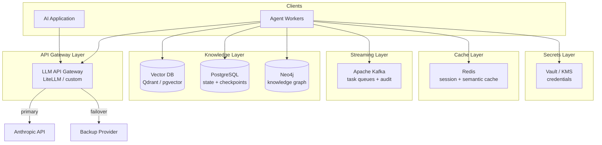
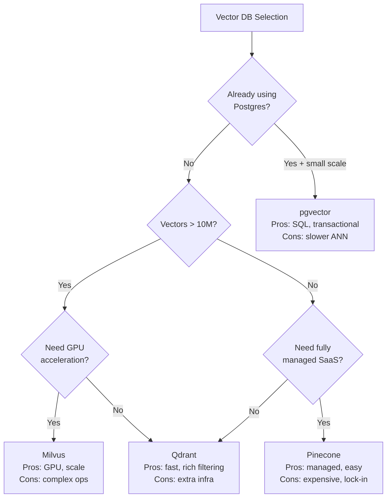

# Module 14 — AI Infrastructure

> **Phase 4 — Production Platform Engineering** | Prerequisites: [Module 13 — Performance & Scalability](13-performance-scalability.md)

Every capability in the previous modules depends on infrastructure. This module describes the reference stack for a production enterprise agent platform — from API gateways to vector databases to secrets management — and the selection criteria for each component.

---

## Table of Contents
1. [What It Is](#what-it-is)
2. [Why It Exists](#why-it-exists)
3. [Internal Architecture](#internal-architecture)
4. [How It Works](#how-it-works)
5. [Real-World Use Cases](#real-world-use-cases)
6. [Production Implementation](#production-implementation)
7. [Code Examples](#code-examples)
8. [Architecture Diagrams](#architecture-diagrams)
9. [Best Practices](#best-practices)
10. [Common Mistakes](#common-mistakes)
11. [Failure Modes](#failure-modes)
12. [Security Considerations](#security-considerations)
13. [Performance Considerations](#performance-considerations)
14. [Scalability Considerations](#scalability-considerations)
15. [Cost Considerations](#cost-considerations)
16. [Enterprise Recommendations](#enterprise-recommendations)
17. [When to Use / When Not to Use](#when-to-use--when-not-to-use)
18. [Trade-offs & Architectural Decisions](#trade-offs--architectural-decisions)
19. [Key Takeaways](#key-takeaways)

---

## What It Is

The AI infrastructure stack is the set of purpose-built components that support agent workloads at scale:

| Layer | Component | Purpose |
|-------|-----------|---------|
| Gateway | LLM API Gateway | Routing, failover, cost control, key management |
| Knowledge | Vector Database | Semantic search for RAG and memory |
| Streaming | Apache Kafka | Agent event queues, audit log, replay |
| Cache/Session | Redis | Working memory, semantic cache, rate limiting |
| Persistence | PostgreSQL | Agent state checkpoints, transactional workflows |
| Graph | Neo4j | Knowledge graphs, Graph RAG |
| Secrets | Vault / Cloud KMS | Credential management for tool access |

---

## Why It Exists

General-purpose infrastructure (bare databases, raw HTTP clients) doesn't handle the specific needs of agent workloads:
- LLM APIs have unique rate limits, cost structures, and failover requirements
- Vector search requires approximate nearest neighbor (ANN) indexes — not available in standard SQL
- Agent state needs transactional checkpointing with replay semantics — not just key-value storage
- Multi-tenant agents need strict data isolation and per-tenant cost accounting
- Secrets need short-lived credential rotation so a compromised agent doesn't expose long-lived keys

---

## Internal Architecture

### Reference Stack



---

## How It Works

### LLM API Gateway

The gateway is the single entry point for all LLM calls. It provides:

1. **Provider routing**: route different model tiers to different providers (Claude Sonnet for main reasoning, Claude Haiku for guardrails)
2. **Failover**: if the primary provider returns a 529 or times out, retry against a fallback
3. **Rate limiting**: enforce per-tenant and per-agent-type rate limits
4. **Cost tracking**: count tokens per request; attribute to tenant + agent type
5. **Key virtualization**: applications use virtual keys managed by the gateway; real provider keys never leave the gateway

### Vector Database Selection

| Database | Strengths | Weaknesses | Best For |
|----------|-----------|------------|---------|
| **pgvector** | Postgres-native; transactional; SQL filtering | Slower ANN than dedicated DBs; limited index types | Simple RAG; co-location with relational data |
| **Qdrant** | Fast HNSW; rich payload filtering; cloud + local | Extra infra to manage | Production RAG; high-throughput semantic search |
| **Pinecone** | Fully managed; serverless option | Vendor lock-in; costly at scale | Quick start; teams without DB ops capability |
| **Milvus** | GPU-accelerated; highly scalable | Complex ops | Large-scale enterprise; >100M vectors |
| **Weaviate** | Multi-modal; GraphQL API | Less standard than others | Multi-modal search; graph-vector hybrid |

**Key selection factors:**
- Do you need metadata filtering? (all modern DBs support it; check filter + ANN joint performance)
- How many vectors? (<1M: pgvector fine; >10M: dedicated DB)
- Multi-tenancy? (Qdrant: collections or payload filter; Pinecone: namespaces; pgvector: row-level security)
- GPU acceleration needed? (only Milvus offers native GPU indexing)

### Index Trade-offs: HNSW vs IVF

| Index | Build Time | Query Speed | Memory | Best For |
|-------|-----------|-------------|--------|---------|
| **HNSW** | Slow | Fast | High | Production; query latency critical |
| **IVF (IVF_FLAT)** | Fast | Medium | Low | Large corpora; memory-constrained |
| **IVF_PQ** | Medium | Medium | Very low | Huge corpora; approximate recall ok |
| **Flat** | None | Very slow | None | <100K vectors; exact recall required |

### Kafka for Agent Workloads

Kafka provides:
- **Task queue**: agent jobs published to a topic; workers consume and process
- **Audit log**: every tool call published to an append-only topic; consumers do compliance and analytics
- **Replay**: failed tasks can be reprocessed by replaying from offset
- **Event streaming**: agent state transitions published as events; downstream systems react

Key Kafka design decisions for agents:
- **Partitioning**: partition by `tenant_id` for ordered processing per tenant
- **Retention**: audit log: 90 days; task queue: 7 days
- **Consumer groups**: each agent worker type has its own consumer group
- **Dead letter queue**: failed tasks after N retries go to a DLQ for human investigation

### Redis for Agents

```
Working memory cache: HSET agent:{task_id}:state fields ...
                       EXPIRE agent:{task_id}:state 86400

Semantic cache: HSET sem_cache:{hash(query)} result "..."
                EXPIRE sem_cache:{hash} 3600

Rate limiting: INCR rate:{tenant_id}:{minute_bucket}
               EXPIRE rate:{tenant_id}:{minute_bucket} 60

Distributed lock: SET lock:{task_id} {worker_id} NX EX 30
```

### PostgreSQL for Agent State

The transactional guarantee of PostgreSQL is essential for durable agent checkpointing. Key schema patterns:

- `agent_tasks`: task record with status, metadata, cost
- `agent_turns`: one row per turn with serialized messages, token counts
- `agent_artifacts`: task outputs, intermediate results
- Outbox pattern for reliable event publication to Kafka

---

## Real-World Use Cases

- **Enterprise agent platform**: gateway (cost control), Qdrant (RAG), Kafka (audit), Redis (session), Postgres (checkpoints), Vault (tool credentials)
- **High-throughput classification pipeline**: pgvector (embedded in Postgres; avoid extra infra), Redis (result cache), Postgres (results storage)
- **Graph RAG deployment**: Neo4j (entity graph), pgvector or Qdrant (dense search), hybrid retrieval combining both

---

## Production Implementation

### LiteLLM-Style Gateway Config

```python
# gateway_config.py
# LiteLLM proxy-compatible configuration

GATEWAY_CONFIG = {
    "model_list": [
        {
            "model_name": "reasoning",          # Virtual model name used by apps
            "litellm_params": {
                "model": "anthropic/claude-sonnet-4-6",
                "api_key": "os.environ/ANTHROPIC_API_KEY",
            },
        },
        {
            "model_name": "reasoning",          # Same virtual name = automatic failover
            "litellm_params": {
                "model": "openai/gpt-4o",       # Fallback provider
                "api_key": "os.environ/OPENAI_API_KEY",
            },
        },
        {
            "model_name": "fast",
            "litellm_params": {
                "model": "anthropic/claude-haiku-4-5-20251001",
                "api_key": "os.environ/ANTHROPIC_API_KEY",
            },
        },
    ],
    "router_settings": {
        "routing_strategy": "latency-based-routing",
        "enable_pre_call_checks": True,
    },
    "general_settings": {
        "master_key": "os.environ/GATEWAY_MASTER_KEY",
        "database_url": "os.environ/POSTGRES_URL",   # For spend tracking
    },
}

# Per-tenant virtual key creation (via LiteLLM admin API)
def create_tenant_key(tenant_id: str, monthly_budget_usd: float) -> str:
    """Create a rate-limited virtual key for a tenant."""
    import httpx
    resp = httpx.post(
        "http://gateway:4000/key/generate",
        headers={"Authorization": f"Bearer {GATEWAY_CONFIG['general_settings']['master_key']}"},
        json={
            "key_alias": f"tenant-{tenant_id}",
            "team_id": tenant_id,
            "max_budget": monthly_budget_usd,
            "budget_duration": "30d",
            "metadata": {"tenant_id": tenant_id},
        },
    )
    return resp.json()["key"]
```

### PostgreSQL Agent State Schema

```sql
-- Agent state management schema

CREATE TABLE agent_tasks (
    task_id      UUID PRIMARY KEY DEFAULT gen_random_uuid(),
    tenant_id    TEXT NOT NULL,
    agent_type   TEXT NOT NULL,
    status       TEXT NOT NULL DEFAULT 'created',  -- created/running/paused/succeeded/failed
    goal_hash    TEXT NOT NULL,  -- SHA256 of goal (no PII stored)
    started_at   TIMESTAMPTZ NOT NULL DEFAULT NOW(),
    finished_at  TIMESTAMPTZ,
    total_cost_usd NUMERIC(10,6) DEFAULT 0,
    total_input_tokens INTEGER DEFAULT 0,
    total_output_tokens INTEGER DEFAULT 0,
    error_message TEXT,
    metadata     JSONB DEFAULT '{}'
);

CREATE INDEX idx_tasks_tenant ON agent_tasks(tenant_id, status);
CREATE INDEX idx_tasks_started ON agent_tasks(started_at DESC);

CREATE TABLE agent_turns (
    turn_id      UUID PRIMARY KEY DEFAULT gen_random_uuid(),
    task_id      UUID NOT NULL REFERENCES agent_tasks(task_id) ON DELETE CASCADE,
    turn_number  INTEGER NOT NULL,
    messages     JSONB NOT NULL,  -- Full messages array for this turn
    response     JSONB NOT NULL,  -- LLM response
    input_tokens INTEGER NOT NULL,
    output_tokens INTEGER NOT NULL,
    cost_usd     NUMERIC(10,6) NOT NULL,
    stop_reason  TEXT NOT NULL,
    created_at   TIMESTAMPTZ NOT NULL DEFAULT NOW(),
    UNIQUE (task_id, turn_number)
);

CREATE INDEX idx_turns_task ON agent_turns(task_id, turn_number);

-- Outbox for reliable Kafka publishing (transactional outbox pattern)
CREATE TABLE agent_events_outbox (
    event_id     UUID PRIMARY KEY DEFAULT gen_random_uuid(),
    topic        TEXT NOT NULL,
    partition_key TEXT NOT NULL,  -- usually tenant_id
    payload      JSONB NOT NULL,
    created_at   TIMESTAMPTZ NOT NULL DEFAULT NOW(),
    published    BOOLEAN NOT NULL DEFAULT FALSE,
    published_at TIMESTAMPTZ
);

CREATE INDEX idx_outbox_unpublished ON agent_events_outbox(published) WHERE NOT published;
```

### Qdrant Multi-Tenant Setup

```python
from qdrant_client import QdrantClient
from qdrant_client.models import (
    Distance, VectorParams, HnswConfigDiff,
    Filter, FieldCondition, MatchValue
)

client = QdrantClient(url="http://qdrant:6333", api_key="your-api-key")

def create_collection_for_tenant(tenant_id: str):
    """Create a dedicated collection per tenant for complete isolation."""
    collection_name = f"knowledge_{tenant_id}"
    client.recreate_collection(
        collection_name=collection_name,
        vectors_config=VectorParams(
            size=1536,  # text-embedding-3-small dimensions
            distance=Distance.COSINE,
        ),
        hnsw_config=HnswConfigDiff(
            m=16,             # Connections per layer — higher = better recall, more memory
            ef_construct=100, # Build-time parameter — higher = better quality index
        ),
        # For high-throughput: use quantization to reduce memory
        # quantization_config=ScalarQuantization(scalar=ScalarQuantizationConfig(type=ScalarType.INT8))
    )
    return collection_name

def search_knowledge(
    tenant_id: str,
    query_vector: list[float],
    top_k: int = 10,
    filter_tags: list[str] | None = None,
) -> list[dict]:
    """Multi-tenant-safe search — always filters by tenant."""
    collection_name = f"knowledge_{tenant_id}"

    search_filter = None
    if filter_tags:
        from qdrant_client.models import MatchAny
        search_filter = Filter(
            must=[FieldCondition(key="tags", match=MatchAny(any=filter_tags))]
        )

    results = client.search(
        collection_name=collection_name,
        query_vector=query_vector,
        query_filter=search_filter,
        limit=top_k,
        with_payload=True,
    )
    return [{"score": r.score, **r.payload} for r in results]
```

### Vault Secret Rotation for Tool Credentials

```python
import hvac
import os
import time

class VaultSecretManager:
    """
    Short-lived credential manager using HashiCorp Vault.
    Credentials are fetched on-demand and cached briefly.
    """
    def __init__(self, vault_url: str = "http://vault:8200"):
        self.client = hvac.Client(
            url=vault_url,
            token=os.environ["VAULT_TOKEN"],
        )
        self._cache: dict[str, tuple[str, float]] = {}  # key -> (value, expires_at)
        self.CACHE_TTL = 300  # 5 minutes

    def get_secret(self, path: str, key: str) -> str:
        """Retrieve a secret from Vault with short-lived caching."""
        cache_key = f"{path}:{key}"
        cached = self._cache.get(cache_key)
        if cached and time.time() < cached[1]:
            return cached[0]

        secret = self.client.secrets.kv.v2.read_secret_version(path=path)
        value = secret["data"]["data"][key]
        self._cache[cache_key] = (value, time.time() + self.CACHE_TTL)
        return value

    def get_dynamic_db_creds(self, role: str) -> dict:
        """
        Fetch dynamically-generated, short-lived database credentials.
        Vault creates a unique user with a TTL, then deletes it.
        """
        creds = self.client.secrets.database.generate_credentials(name=role)
        return {
            "username": creds["data"]["username"],
            "password": creds["data"]["password"],
            "lease_id": creds["lease_id"],
            "lease_duration": creds["lease_duration"],
        }
```

---

## Architecture Diagrams

### Vector DB Selection Decision Tree



---

## Best Practices

1. **Use a gateway for all LLM calls.** Provider outages are inevitable. A gateway gives you failover, cost tracking, and key rotation without changing application code.
2. **Never store API keys in application config.** Use Vault or cloud KMS. Keys rotate; applications should fetch on demand.
3. **Separate vector collections by tenant, not by filter.** Payload filtering is fast but doesn't provide isolation guarantees. A coding bug in a filter = cross-tenant leakage. Separate collections guarantee isolation.
4. **Design Kafka topics around data ownership, not event types.** `agent-tasks` (one topic, all types) vs `agent-task-created`, `agent-task-completed` (many topics). The latter makes consumers cleaner but proliferates topics.
5. **PostgreSQL for transactional state; Redis for hot/ephemeral state.** Don't use Postgres for per-turn caching (too many writes); don't use Redis for checkpoints (data loss on restart without persistence).
6. **HNSW for query latency; IVF for memory efficiency.** Choose based on your constraint. At >10M vectors, HNSW memory cost becomes significant.

---

## Common Mistakes

| Mistake | Impact | Fix |
|---------|--------|-----|
| Sharing one vector collection for all tenants with payload filter | Cross-tenant leak risk; single bug = disaster | Separate collections per tenant |
| LLM API keys in environment variables on shared servers | All tenants share the same key + rate limit | Vault-issued per-tenant virtual keys via gateway |
| No connection pooling for Postgres | Too many connections under load | PgBouncer connection pooler; max_pool_size=20 per worker |
| Kafka retention too long | Storage cost explosion | Task queue: 7 days; audit log: 90 days |
| Redis without persistence | Working memory lost on Redis restart | Enable Redis RDB snapshots for session data |
| Using pgvector for >5M vectors with HNSW | Memory exhaustion on Postgres server | Migrate to Qdrant or Milvus at that scale |

---

## Failure Modes

| Failure | Symptom | Root Cause | Detection | Mitigation |
|---------|---------|-----------|-----------|------------|
| Vector DB OOM | Query timeouts; index build fails | HNSW index too large for RAM | Monitor RSS memory; alert > 80% | Scale up; switch to IVF_PQ for memory savings |
| LLM provider outage | All agents blocked | Single provider dependency | Provider status webhook; health check | Gateway with automatic failover |
| Kafka consumer lag | Tasks stall in queue | Workers can't keep up with producers | Monitor consumer_lag metric; alert > 10K | Scale consumer workers; increase partitions |
| Redis eviction | Cache misses spike | maxmemory reached; LRU eviction | Monitor evicted_keys rate | Increase memory; use allkeys-lru carefully |
| Vault token expired | Agent workers can't fetch secrets | Token not renewed | Alert on 401 from Vault | Token renewal automation; AppRole auth |
| PG connection exhaustion | Agents get "too many connections" errors | Connection pool exhausted | Monitor pg_stat_activity | PgBouncer; reduce max connections per worker |

---

## Security Considerations

- **Vault AppRole authentication.** Agent workers authenticate to Vault using AppRole (role_id + secret_id), not static tokens. The secret_id can be rotated frequently.
- **Network segmentation.** Vector DB, Kafka, Redis, and Postgres should not be directly accessible from the internet. Agent workers in a private subnet; external traffic terminates at the LLM gateway.
- **Encryption at rest and in transit.** All databases: TLS connections + encryption at rest. Kafka: TLS + SASL auth. Redis: TLS + AUTH password.
- **Qdrant API key management.** Use Qdrant's API key authentication. Assign separate read-only and read-write keys; grant agents only what they need.

---

## Performance Considerations

- **Connection pooling everywhere.** PgBouncer for Postgres; redis-py connection pool; Qdrant client connection reuse.
- **Batch operations over loops.** Qdrant `upload_points` batch vs individual upserts. Kafka producer batching. Postgres multi-row INSERT.
- **Pre-warm caches.** On agent worker startup, pre-load frequently needed tool results, document embeddings, or user profiles into Redis.

---

## Scalability Considerations

- **Kafka partitions determine max parallelism.** You can have more consumers than partitions, but extras sit idle. Plan partition count based on peak concurrent agents.
- **Qdrant horizontal scaling.** Run multiple Qdrant nodes in a cluster with sharding. Shard by collection name (tenant) for co-located queries.
- **Postgres read replicas.** Agent turn reads (for resume) from replicas; writes (checkpoints) to primary.

---

## Cost Considerations

| Component | Cost Driver | Optimization |
|-----------|------------|-------------|
| LLM API | Token volume | Gateway caching; model routing to cheaper tiers |
| Vector DB | Storage + compute | IVF_PQ quantization saves 4-8× memory; prune stale vectors |
| Kafka | Storage (retention) | Set retention.ms per topic; compact old topics |
| Redis | Memory | TTL on all keys; eviction policy |
| Postgres | Storage + IOPS | Partition turn tables by date; archive old tasks |

---

## Enterprise Recommendations

1. **LLM gateway before direct API access.** The gateway provides the visibility (cost, latency, errors) and control (rate limits, failover) that direct API calls cannot.
2. **Infrastructure as code for the full stack.** Terraform/Pulumi for all components. Reproducible environments catch configuration drift.
3. **Multi-region for disaster recovery.** Kafka (MirrorMaker 2), Qdrant (cross-region replication), Postgres (logical replication) — test failover quarterly.
4. **Observability first.** Instrument every component with Prometheus metrics before deploying agents on top. You can't debug agent issues without infrastructure visibility.

---

## When to Use / When Not to Use

**pgvector**: Small-to-medium RAG (<5M vectors), co-located with existing Postgres, team already knows SQL.
**Qdrant**: Production RAG with filtering, >1M vectors, need rich query capabilities.
**Pinecone**: Prototyping or teams without DB ops capacity; accept vendor lock-in and cost.
**Kafka**: Any agent workload with audit requirements, retry needs, or >100 concurrent tasks/day.
**Redis**: All agents with session state; semantic cache for repetitive queries.
**Vault**: Any production agent that makes tool calls requiring API credentials.

---

## Trade-offs & Architectural Decisions

### pgvector vs dedicated vector DB?
- **pgvector**: one less infra component; transactional consistency with relational data; slower at scale
- **Dedicated**: purpose-built performance; more complex stack; better at scale
- Tipping point: ~2-5M vectors, high concurrent query load, or need for advanced filtering

### Kafka vs Redis Streams for task queue?
- **Kafka**: durable, replayable, multi-consumer groups, better at scale — but complex ops
- **Redis Streams**: simpler, built-in if you have Redis, but less durable by default
- Choose Kafka for audit/compliance needs or >1K tasks/day; Redis Streams for simpler setups

---

## Key Takeaways

- The AI infrastructure stack is: API Gateway + Vector DB + Kafka + Redis + Postgres + Vault.
- Every production agent platform needs all six; the questions are about which specific tools.
- LLM API gateway is mandatory — direct API calls have no failover, cost tracking, or key management.
- Vector DB selection depends on scale, filtering complexity, and ops capacity.
- Separate vector collections per tenant — payload filter alone is insufficient for data isolation.
- Vault for secrets — no credentials in config files, no credentials through the LLM.
- Connection pooling for every database — agents create many short-lived connections.

## Further Study

- Qdrant documentation: HNSW parameters, payload filtering, multi-tenancy
- LiteLLM documentation: proxy configuration, virtual keys, cost tracking
- HashiCorp Vault: AppRole auth, dynamic database secrets
- Apache Kafka: The Definitive Guide (partitioning, consumer groups, retention)
- pgvector GitHub: index types and performance benchmarks
- Milvus documentation: GPU indexing, large-scale deployment
