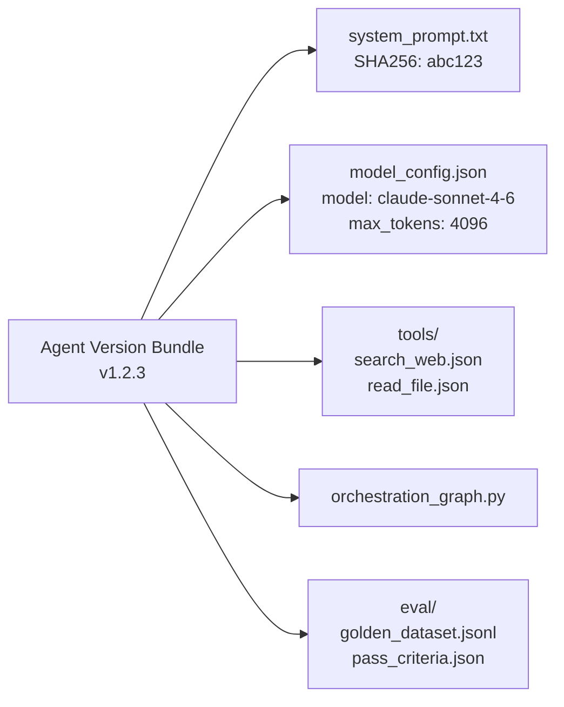
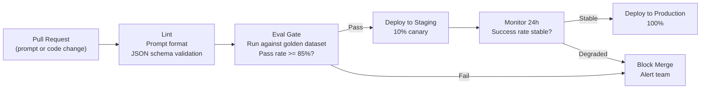
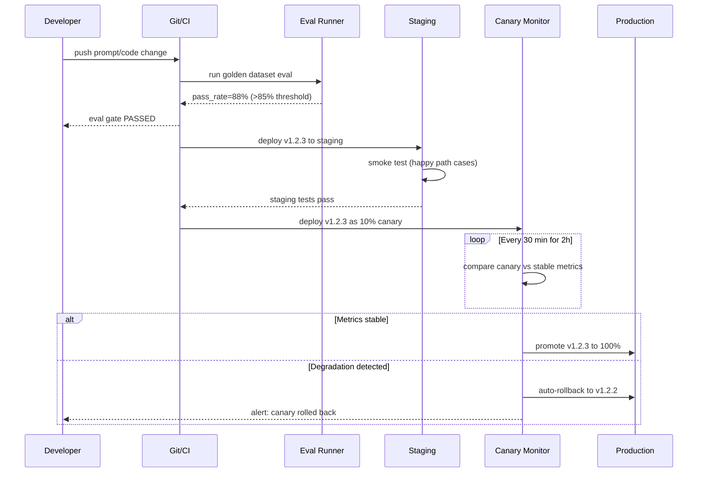

# Module 15 — Deployment & Operations

> **Phase 4 — Production Platform Engineering** | Prerequisites: [Module 14 — AI Infrastructure](14-ai-infrastructure.md), [Module 12 — Evaluation & Observability](12-evaluation-observability.md)

Deploying an agent is not the same as deploying an API. The deployable unit includes a prompt, a model version, tool schemas, and an orchestration graph — and any one of these can silently break behavior. This module covers the full lifecycle from CI/CD to incident response.

---

## Table of Contents
1. [What It Is](#what-it-is)
2. [Why It Exists](#why-it-exists)
3. [Internal Architecture](#internal-architecture)
4. [How It Works](#how-it-works)
5. [Real-World Use Cases](#real-world-use-cases)
6. [Production Implementation](#production-implementation)
7. [Code Examples](#code-examples)
8. [Architecture Diagrams](#architecture-diagrams)
9. [Best Practices](#best-practices)
10. [Common Mistakes](#common-mistakes)
11. [Failure Modes](#failure-modes)
12. [Security Considerations](#security-considerations)
13. [Performance Considerations](#performance-considerations)
14. [Scalability Considerations](#scalability-considerations)
15. [Cost Considerations](#cost-considerations)
16. [Enterprise Recommendations](#enterprise-recommendations)
17. [When to Use / When Not to Use](#when-to-use--when-not-to-use)
18. [Trade-offs & Architectural Decisions](#trade-offs--architectural-decisions)
19. [Key Takeaways](#key-takeaways)

---

## What It Is

Agent deployment is the process of versioning, testing, staging, releasing, and operating agent configurations in production. The key insight that separates it from traditional software deployment: **prompt changes have the same impact as code changes** but are often not treated with the same rigor.

The deployable artifact for an agent is a **version bundle** containing:
- System prompt (text, versioned)
- Model identifier (e.g., `claude-sonnet-4-6` — pinned, not "latest")
- Tool schemas (JSON, versioned)
- Orchestration graph (if using LangGraph or similar)
- Eval suite (golden dataset + pass criteria)

All five must be versioned together and deployed atomically.

---

## Why It Exists

Agents fail in production due to:
1. **Uncontrolled prompt changes** — a developer edits the system prompt "just to clarify one thing" and behavior changes globally
2. **Model deprecations** — the model you're on gets deprecated; behavior changes without warning when the provider auto-migrates
3. **Tool schema drift** — an API you call changes its response format; the agent still uses the old tool schema
4. **No rollback path** — production is broken, but there's no way to go back because the previous version wasn't preserved
5. **Lack of canary** — 100% of traffic goes to a new agent version; a bug affects all users

---

## Internal Architecture

### Version Bundle



### CI/CD Pipeline



---

## How It Works

### What Gets Versioned

Every component that can affect agent behavior must be versioned:

| Component | Version Method | Change Trigger |
|-----------|---------------|---------------|
| System prompt | Git SHA + semantic version | Any text edit |
| Model ID | Pinned string in config | Model deprecation, intentional upgrade |
| Tool schemas | JSON files in Git | Tool API changes |
| Tool handlers | Code + Git SHA | Business logic changes |
| Orchestration graph | Code + Git SHA | Workflow changes |
| Eval suite | Git SHA | Adding/removing eval cases |

Never use `"latest"` or unpinned model names in production. Providers deprecate models; the migration is your problem to manage deliberately.

### Canary Releases

Canary releases send a small percentage of traffic (5-20%) to a new agent version while the majority runs the stable version. This requires:

1. **Traffic splitting** at the request router level (not the agent level)
2. **Version tagging** on all traces and metrics
3. **Automated comparison**: new version vs old version on the same metric set
4. **Automated rollback**: if success rate drops >X%, roll back automatically

### Shadow Deployment

Shadow mode runs the new agent version in parallel with the current version, without returning results to users. Used for:
- Major architecture changes (validating before exposing to users)
- Performance benchmarking
- Cost comparison

The shadow agent processes every request and logs its output for comparison, but the user receives only the current (stable) version's output.

### Model Deprecation Management

Models are deprecated on schedules outside your control. Defense:

1. **Pin model IDs** — never use aliases that auto-forward to new versions
2. **Monitor deprecation notices** — subscribe to provider changelog
3. **Eval new versions before migration** — run your full eval suite against the new model before migrating
4. **Version bundle migration** — deprecation triggers a new version bundle with the updated model ID; deploy via normal canary process

---

## Real-World Use Cases

- **SaaS product**: Agent version bundles managed like microservice deployments; canary on 5% of enterprise tenants first
- **Internal tool**: Simplified: staging env + eval gate; no traffic splitting required
- **Regulated industry**: Formal change management: eval report, security review, compliance sign-off before any prompt change can go to production
- **Research team**: Rapid iteration with weekly eval runs; no canary required but eval gates enforced

---

## Production Implementation

### Version Bundle Manager

```python
import json
import hashlib
from pathlib import Path
from dataclasses import dataclass

@dataclass
class AgentVersionBundle:
    version: str          # semver: major.minor.patch
    system_prompt: str
    model_id: str
    max_tokens: int
    tools: list[dict]     # Tool schemas
    created_at: float
    eval_pass_rate: float  # Last eval run pass rate

    @property
    def bundle_hash(self) -> str:
        content = json.dumps({
            "prompt": self.system_prompt,
            "model": self.model_id,
            "tools": self.tools,
        }, sort_keys=True)
        return hashlib.sha256(content.encode()).hexdigest()[:12]

    def save(self, path: str):
        bundle_dir = Path(path) / f"v{self.version}"
        bundle_dir.mkdir(parents=True, exist_ok=True)
        (bundle_dir / "system_prompt.txt").write_text(self.system_prompt)
        (bundle_dir / "config.json").write_text(json.dumps({
            "version": self.version,
            "model_id": self.model_id,
            "max_tokens": self.max_tokens,
            "bundle_hash": self.bundle_hash,
            "eval_pass_rate": self.eval_pass_rate,
            "created_at": self.created_at,
        }, indent=2))
        (bundle_dir / "tools.json").write_text(json.dumps(self.tools, indent=2))

    @classmethod
    def load(cls, path: str, version: str) -> "AgentVersionBundle":
        bundle_dir = Path(path) / f"v{version}"
        system_prompt = (bundle_dir / "system_prompt.txt").read_text()
        config = json.loads((bundle_dir / "config.json").read_text())
        tools = json.loads((bundle_dir / "tools.json").read_text())
        return cls(
            version=version,
            system_prompt=system_prompt,
            model_id=config["model_id"],
            max_tokens=config["max_tokens"],
            tools=tools,
            created_at=config["created_at"],
            eval_pass_rate=config["eval_pass_rate"],
        )


class VersionRouter:
    """
    Routes agent requests to different version bundles.
    Supports canary (percentage-based) routing.
    """
    def __init__(self):
        self.routes: list[dict] = []  # [{"version": "1.2.3", "weight": 90}, ...]

    def set_canary(self, stable_version: str, canary_version: str, canary_pct: int = 10):
        self.routes = [
            {"version": stable_version, "weight": 100 - canary_pct},
            {"version": canary_version, "weight": canary_pct},
        ]

    def promote_canary(self, version: str):
        self.routes = [{"version": version, "weight": 100}]

    def rollback(self, version: str):
        self.routes = [{"version": version, "weight": 100}]

    def get_version(self, request_id: str) -> str:
        """Consistent hashing to ensure same request always hits same version."""
        import hashlib
        hash_val = int(hashlib.md5(request_id.encode()).hexdigest()[:8], 16) % 100
        cumulative = 0
        for route in self.routes:
            cumulative += route["weight"]
            if hash_val < cumulative:
                return route["version"]
        return self.routes[-1]["version"]
```

### GitHub Actions Eval Gate

```yaml
# .github/workflows/eval-gate.yml
name: Agent Eval Gate

on:
  pull_request:
    paths:
      - "agents/**"
      - "prompts/**"
      - "tools/**"

jobs:
  eval:
    runs-on: ubuntu-latest
    steps:
      - uses: actions/checkout@v4

      - name: Set up Python
        uses: actions/setup-python@v4
        with:
          python-version: "3.11"

      - name: Install dependencies
        run: pip install anthropic pytest

      - name: Run eval suite
        env:
          ANTHROPIC_API_KEY: ${{ secrets.ANTHROPIC_API_KEY }}
        run: |
          python scripts/run_eval.py \
            --agent-path agents/support_agent/ \
            --eval-path eval/golden_dataset.jsonl \
            --pass-threshold 0.85 \
            --output eval_results.json

      - name: Upload eval results
        uses: actions/upload-artifact@v4
        with:
          name: eval-results
          path: eval_results.json

      - name: Check eval gate
        run: |
          python -c "
          import json, sys
          results = json.load(open('eval_results.json'))
          pass_rate = results['pass_rate']
          print(f'Pass rate: {pass_rate:.1%}')
          if pass_rate < 0.85:
              print(f'FAIL: Required 85%, got {pass_rate:.1%}')
              sys.exit(1)
          print('PASS: Eval gate cleared')
          "
```

### Automated Canary Monitor and Rollback

```python
import time
from dataclasses import dataclass

@dataclass
class CanaryMetrics:
    version: str
    success_rate: float
    avg_cost_usd: float
    avg_latency_ms: float
    sample_size: int

class CanaryController:
    """
    Monitors canary deployment and auto-rolls back on degradation.
    In production: reads metrics from Prometheus/Datadog, not computed inline.
    """

    def __init__(
        self,
        router: VersionRouter,
        stable_version: str,
        canary_version: str,
        rollback_threshold: float = 0.05,  # Roll back if success_rate drops > 5%
        min_sample_size: int = 50,
        evaluation_window_hours: int = 2,
    ):
        self.router = router
        self.stable_version = stable_version
        self.canary_version = canary_version
        self.rollback_threshold = rollback_threshold
        self.min_sample_size = min_sample_size
        self.evaluation_window_hours = evaluation_window_hours

    def get_metrics(self, version: str) -> CanaryMetrics:
        """In production: query Prometheus or your metrics store."""
        # Stub — replace with real metrics query
        return CanaryMetrics(
            version=version,
            success_rate=0.91,  # Example: 91% success rate
            avg_cost_usd=0.045,
            avg_latency_ms=4500,
            sample_size=120,
        )

    def evaluate(self) -> str:
        """
        Compare canary vs stable. Returns: 'promote', 'rollback', or 'wait'.
        """
        stable = self.get_metrics(self.stable_version)
        canary = self.get_metrics(self.canary_version)

        if canary.sample_size < self.min_sample_size:
            return "wait"

        success_delta = canary.success_rate - stable.success_rate
        if success_delta < -self.rollback_threshold:
            self.router.rollback(self.stable_version)
            return "rollback"

        # Canary has been running stably for the evaluation window
        self.router.promote_canary(self.canary_version)
        return "promote"
```

---

## Architecture Diagrams

### Full Deployment Pipeline



---

## Best Practices

1. **Treat prompts as code.** Every system prompt change goes through the same PR review + eval gate as a code change. No "quick tweaks" directly in production.
2. **Pin model IDs always.** Use `claude-sonnet-4-6` not `claude-sonnet`. Test every model upgrade through your eval suite before promoting.
3. **Build for rollback from day one.** Store every version bundle; test the rollback path monthly. If you can't roll back in 5 minutes, you can't operate in production.
4. **Eval gate is a deployment gate, not a suggestion.** If the eval gate fails, the deployment is blocked. No exceptions, no manual overrides without documented justification.
5. **Shadow deploy major changes first.** Before a major architecture change (new orchestration graph, new memory system) goes to canary, run it in shadow for 24 hours.
6. **Document every production prompt change.** Record: what changed, why, the eval before/after, who approved it. This is your audit trail for regulated industries.

---

## Common Mistakes

| Mistake | Impact | Fix |
|---------|--------|-----|
| Using "latest" model alias | Behavior changes on provider's schedule, not yours | Pin specific model IDs; upgrade deliberately |
| No eval gate | Regressions slip into production undetected | Eval gate in CI; block on fail |
| 100% canary (no gradual rollout) | Bug affects all users before detection | Start at 5-10%; auto-promote on stability |
| No rollback procedure | Production incident takes hours to resolve | Test rollback monthly; document the procedure |
| Prompt version not tracked | Can't determine what changed when behavior changed | Git history for prompts; semantic versioning |
| Separate versioning of prompt and code | Deployed combination is ambiguous | Version bundle bundles all components atomically |

---

## Failure Modes

| Failure | Symptom | Root Cause | Detection | Mitigation |
|---------|---------|-----------|-----------|------------|
| Model deprecation | Behavior changes unexpectedly | Provider auto-migrated to new model | Monitor model IDs used in production; alert on unrecognized model | Pin model IDs; subscribe to provider deprecation notices |
| Eval pass rate inflation | Regressions slip through | Golden dataset too easy; judge calibration drift | Shadow eval on production samples | Regularly add hard cases; human-calibrate judge |
| Canary false positive | Good version auto-rolled back | Too aggressive rollback threshold | Track rollback decisions; review manually | Tune threshold; require minimum sample size |
| Deployment config drift | Staging and production behave differently | Manual changes to production not reflected in code | Compare deployed config hash to repo hash | Config-as-code; alert on hash mismatch |
| Tool schema drift | Agent generates wrong arguments | External API changed; tool schema not updated | Schema validation at dispatch time; fail loudly | Subscribe to API changelogs; automated schema validation |

---

## Security Considerations

- **Prompt confidentiality.** System prompts often contain business logic. Store in a secrets manager or encrypted at rest. Restrict access to the prompt store.
- **Change approval process.** In regulated industries, all prompt changes require documented approval before deployment. Automate the approval workflow to prevent bypasses.
- **Eval dataset security.** Golden datasets may contain sensitive data (real customer questions, PII). Encrypt and restrict access.
- **Audit trail.** All deployments: who deployed what version when. Immutable audit log in append-only storage.

---

## Performance Considerations

- **Eval runs in parallel.** A 100-case eval suite should run all cases simultaneously (using asyncio or a thread pool), not sequentially. This reduces eval time from hours to minutes.
- **Batch API for evals.** Use the Anthropic Batch API for eval runs — 50% cost discount, and eval doesn't require real-time responses.
- **Canary monitoring interval.** Check canary metrics every 30 minutes. More frequent checks increase false positive rate.

---

## Scalability Considerations

- **Multi-version agent runners.** Each version runs as its own container/pod. Traffic routing at the load balancer / API gateway level. N versions can run simultaneously.
- **Version bundle storage.** Store all version bundles in object storage (S3/GCS). Bundles are small (prompts + schemas + eval datasets = <10MB each). Keep all versions for rollback.

---

## Cost Considerations

- **Eval cost.** 100-case eval × average agent task cost. Budget eval runs as infrastructure cost. Batch API reduces this by 50%.
- **Canary cost.** Shadow deployment doubles compute cost during the shadow period. Limit shadow deployment to high-stakes changes.
- **Multi-version running cost.** During canary, two versions handle 100% of traffic. No extra compute cost — traffic is just split.

---

## Enterprise Recommendations

1. **Change management board for AI systems.** In regulated industries (finance, healthcare), prompt changes require a change management process: request → impact assessment → review → approval → deployment window.
2. **Break-glass procedure.** In an emergency (agent causing active harm), you need to disable the agent in <5 minutes without a full deployment cycle. Build a kill switch.
3. **SLA commitment per agent type.** Define availability SLAs (99.5% uptime?) and enforce them with monitoring and alerting.
4. **A/B testing program.** Beyond canary (quality-focused), run formal A/B tests to measure business impact of agent changes (e.g., resolution rate, customer satisfaction).

---

## When to Use / When Not to Use

**Canary releases**: any customer-facing agent change; any change to a critical internal agent.
**Shadow deployment**: major architecture changes; new integrations; new model versions.
**Full eval gate**: always — for any change to system prompt, model, tools, or orchestration.
**Simplified deployment** (no canary, just eval gate): internal tools, low-traffic agents, early-stage products.

---

## Trade-offs & Architectural Decisions

### How to handle model deprecations?
- **Wait for provider migration**: risky — new model behavior may differ; no testing time
- **Proactive migration on your schedule**: test new model vs old on your eval suite; migrate when quality is equal or better
- Always choose proactive migration. Build it into your quarterly engineering calendar.

### Separate staging vs integration testing?
- **Separate**: staging uses production-like infrastructure; integration uses mocks — catches real integration bugs
- **Integrated**: simpler; but mocks hide real issues
- Rule: always a real staging environment for AI agents; mock-based tests are insufficient because LLM behavior in staging ≠ LLM behavior against mocks

---

## Key Takeaways

- The deployable unit is a version bundle: prompt + model ID + tools + orchestration + eval suite. All must version together.
- Pin model IDs. Never use `latest`. Every model upgrade is a deployment.
- Eval gate in CI is non-negotiable. Blocked deployments protect production.
- Canary releases catch behavioral regressions before they affect all users.
- Rollback must work in <5 minutes and must be tested monthly.
- Treat prompts as code: Git-tracked, PR-reviewed, eval-gated.
- Model deprecations happen on provider schedules. Manage them deliberately, not reactively.
- Shadow deployment before canary for major architectural changes.

## Further Study

- "Continuous Delivery" (Humble & Farley) — applied to AI deployments
- Feature flag systems (LaunchDarkly, Unleash) — for traffic splitting
- Anthropic model deprecation timeline documentation
- LangSmith and Braintrust — prompt versioning and deployment tooling
- Blue-green deployment pattern — applied to agent version bundles
- DORA metrics — applied to AI system deployments
