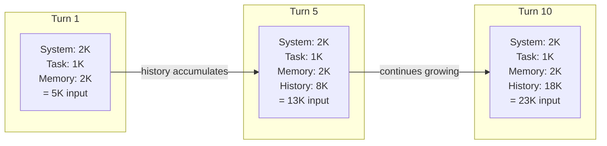
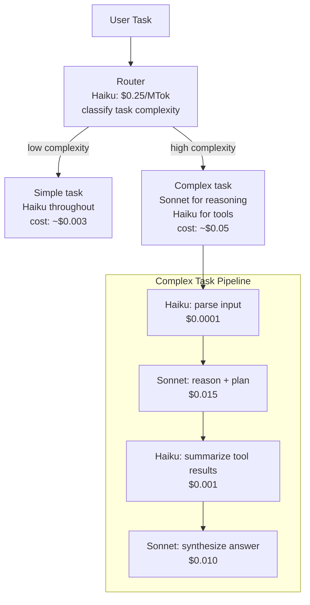

# Module 16 — Cost Optimization

> **Phase 4 — Production Platform Engineering** | Prerequisites: [Module 13 — Performance & Scalability](13-performance-scalability.md), [Module 14 — AI Infrastructure](14-ai-infrastructure.md)

Token cost in an agent grows superlinearly with loop count. A task that costs $0.01 on turn 1 may cost $0.15 by turn 10 — not because you're calling the API more, but because the context fills with history. Understanding and controlling this curve is the primary cost-engineering challenge in agentic AI.

---

## Table of Contents
1. [What It Is](#what-it-is)
2. [Why It Exists](#why-it-exists)
3. [Internal Architecture](#internal-architecture)
4. [How It Works](#how-it-works)
5. [Real-World Use Cases](#real-world-use-cases)
6. [Production Implementation](#production-implementation)
7. [Code Examples](#code-examples)
8. [Architecture Diagrams](#architecture-diagrams)
9. [Best Practices](#best-practices)
10. [Common Mistakes](#common-mistakes)
11. [Failure Modes](#failure-modes)
12. [Security Considerations](#security-considerations)
13. [Performance Considerations](#performance-considerations)
14. [Scalability Considerations](#scalability-considerations)
15. [Cost Considerations](#cost-considerations)
16. [Enterprise Recommendations](#enterprise-recommendations)
17. [When to Use / When Not to Use](#when-to-use--when-not-to-use)
18. [Trade-offs & Architectural Decisions](#trade-offs--architectural-decisions)
19. [Key Takeaways](#key-takeaways)

---

## What It Is

Cost optimization for AI agents is the practice of minimizing token spend while maintaining quality. Unlike traditional compute cost optimization (CPUs, memory), LLM cost is primarily a function of token volume — and token volume is primarily driven by context size × number of turns.

**The cost equation of an agent task:**

```
cost = Σ(turns) of:
  input_price × (system_prompt_tokens + history_tokens_t + task_tokens + memory_tokens + tool_result_tokens)
  + output_price × output_tokens_t
```

Note: `history_tokens_t` grows every turn. If you add 500 tokens of new content per turn (tool calls + results + agent reasoning), by turn 10 you're paying for ~5000 tokens of history on every LLM call — even though the first 4500 tokens are re-sent from previous turns.

---

## Why It Exists

At small scale, LLM cost is negligible. At production scale:
- 1000 agent tasks/day × $0.10/task = $3,000/month
- If context grows uncontrolled: $0.10 → $0.50/task easily = $15,000/month
- At 100,000 tasks/day: this is $150,000/month difference

Token cost optimization is infrastructure engineering. It compounds — every percentage improvement applies to every task forever.

---

## Internal Architecture

### Cost Growth Model



The system prompt is constant and cache-friendly. History is the cost driver — it grows by `~output_tokens + tool_results_size` per turn.

---

## How It Works

### Token Economics

| Component | Price Shape | Optimization Lever |
|-----------|------------|-------------------|
| **Input tokens** | $/MTok (e.g., $3/MTok for Sonnet) | Reduce context size; prompt caching |
| **Output tokens** | $/MTok (3-5× input price) | Reduce generation verbosity; structured output |
| **Cache reads** | ~10% of input price | Keep system prompt stable; cache tools schemas |
| **Cache writes** | ~25% of input price (one-time) | Write cache early; reuse across tasks |
| **Reasoning tokens** | Charged as output (often 2-4× normal output) | Use reasoning models only when needed |
| **Batch API** | 50% discount on input+output | Use for evals, offline tasks |

### Prompt Caching

Anthropic's prompt caching reduces re-billing for repeated prefix content:
- The system prompt, few-shot examples, tool schemas — these are identical across all requests for the same agent type
- Cache the first N tokens (the "prompt prefix") and only pay cache read rate (~10% of input price) on subsequent hits
- Cache TTL: 5 minutes by default (extended if hit)
- **Critical**: the cached prefix must be *identical* byte-for-byte. One character difference breaks the cache

```python
# Prompt-cache-optimized message construction
def build_cached_messages(system_prompt: str, task: str, history: list[dict]) -> tuple[str, list]:
    # The system prompt is cached — keep it STABLE
    # Tool schemas, if large, should be FIRST in the conversation, not in system prompt,
    # so they can also be cached

    # Large stable content → first user message (cacheable after first call)
    # Dynamic content → last user message (not cached)

    messages = [
        {
            "role": "user",
            "content": [
                {
                    "type": "text",
                    "text": task,
                    "cache_control": {"type": "ephemeral"}  # Don't cache dynamic content
                }
            ]
        }
    ] + history

    return system_prompt, messages
```

### Context Engineering

Context engineering is the practice of minimizing token spend in the context window while preserving quality. Techniques:

1. **Tool result truncation** — a web search that returns 10,000 characters should return the most relevant 1,000
2. **History compression** — summarize older turns instead of carrying them verbatim
3. **Sub-agent isolation** — long research tasks spawn sub-agents with focused contexts; only the result is returned to the parent
4. **Structured note-taking** — instead of carrying full tool output history, the agent maintains a structured scratchpad of key facts discovered

### Model Right-Sizing

Not every step in an agent pipeline requires the most capable model:

| Task Type | Recommended Tier | Why |
|-----------|-----------------|-----|
| Main reasoning, planning | Sonnet / Opus | Quality matters |
| Tool result parsing, extraction | Haiku | Simple NLP; cheap |
| Guardrail classification | Haiku | Binary classification |
| Routing / classification | Haiku | Simple decision |
| Summarization of tool results | Haiku | Summarization is easy |
| Final answer synthesis | Sonnet | Quality matters |

A hybrid pipeline using Haiku for 60% of calls and Sonnet for 40% can reduce cost by 40-60% vs all-Sonnet.

---

## Real-World Use Cases

### Worked Cost Model: Support Agent at 10,000 Conversations/Day

**Setup:**
- Agent type: customer support
- Average turns per conversation: 4
- System prompt: 2,000 tokens
- Average task description: 500 tokens
- Memory retrieval: 1,500 tokens
- Average output per turn: 300 tokens
- Average tool result per turn: 1,000 tokens
- Model: Claude Sonnet ($3/MTok input, $15/MTok output)

**Per-turn token calculation:**

| Turn | Input Tokens | Output Tokens |
|------|-------------|--------------|
| 1 | 2K (sys) + 0.5K (task) + 1.5K (mem) = 4K | 0.3K |
| 2 | 4K + 1.3K (turn1) = 5.3K | 0.3K |
| 3 | 5.3K + 1.3K = 6.6K | 0.3K |
| 4 | 6.6K + 1.3K = 7.9K | 0.3K |
| **Total** | **23.8K** | **1.2K** |

**Cost per conversation:**
- Input: 23,800 × $3/1,000,000 = $0.0714
- Output: 1,200 × $15/1,000,000 = $0.018
- **Total: ~$0.089 per conversation**

**With prompt caching** (2K system prompt cached after first hit):
- Cache save: 2K × 4 turns × $3/MTok × 0.9 (90% discount) = $0.0216 saved
- New total: ~$0.067 per conversation (25% reduction)

**At 10,000 conversations/day:**
- Without optimization: $890/day = **$26,700/month**
- With prompt caching: $670/day = **$20,100/month**
- With history compression (reduce history 40%): ~$500/day = **$15,000/month**
- With model routing (Haiku for tool parsing): ~$350/day = **$10,500/month**

**Each optimization layer compounds.** Total savings from naive → optimized: 60% cost reduction.

---

## Production Implementation

### Token Budget Middleware

```python
from dataclasses import dataclass
import anthropic

@dataclass
class TokenBudget:
    max_input_per_turn: int = 100_000
    max_output_per_turn: int = 4_096
    max_total_cost_usd: float = 1.0
    warn_at_fraction: float = 0.75
    input_price_per_mtok: float = 3.0   # Sonnet pricing
    output_price_per_mtok: float = 15.0

class CostTrackingClient:
    """
    Wraps the Anthropic client with cost tracking and budget enforcement.
    """
    def __init__(self, budget: TokenBudget):
        self.client = anthropic.Anthropic()
        self.budget = budget
        self.total_cost_usd = 0.0
        self.total_input_tokens = 0
        self.total_output_tokens = 0

    @property
    def cost_fraction(self) -> float:
        return self.total_cost_usd / self.budget.max_total_cost_usd

    def create(self, **kwargs) -> anthropic.types.Message:
        if self.cost_fraction >= 1.0:
            raise RuntimeError(
                f"Cost budget exceeded: ${self.total_cost_usd:.4f} / ${self.budget.max_total_cost_usd}"
            )

        if self.cost_fraction >= self.budget.warn_at_fraction:
            import logging
            logging.warning("Cost at %.0f%% of budget ($%.4f)",
                           self.cost_fraction * 100, self.total_cost_usd)

        response = self.client.messages.create(**kwargs)

        input_tok = response.usage.input_tokens
        output_tok = response.usage.output_tokens
        turn_cost = (input_tok * self.budget.input_price_per_mtok +
                     output_tok * self.budget.output_price_per_mtok) / 1_000_000

        self.total_input_tokens += input_tok
        self.total_output_tokens += output_tok
        self.total_cost_usd += turn_cost

        return response

    def summary(self) -> dict:
        return {
            "total_input_tokens": self.total_input_tokens,
            "total_output_tokens": self.total_output_tokens,
            "total_cost_usd": self.total_cost_usd,
            "budget_fraction": self.cost_fraction,
        }


### Tool Result Compressor

```python
def compress_tool_result(
    tool_name: str,
    result: str,
    max_tokens: int = 2000,
    client: anthropic.Anthropic = None,
) -> str:
    """
    Compress large tool results before adding to context.
    Uses Haiku (cheap) for summarization.
    """
    # Estimate token count (~4 chars per token)
    estimated_tokens = len(result) // 4
    if estimated_tokens <= max_tokens:
        return result  # No compression needed

    # Use cheap model for summarization
    if client is None:
        client = anthropic.Anthropic()

    summary_resp = client.messages.create(
        model="claude-haiku-4-5-20251001",  # Cheapest model for this task
        max_tokens=max_tokens,
        messages=[{
            "role": "user",
            "content": (
                f"Summarize the following {tool_name} result concisely. "
                f"Preserve all specific numbers, names, URLs, and key facts. "
                f"Target: {max_tokens} tokens.\n\n{result[:20000]}"  # Cap at 20K chars for summarizer
            )
        }]
    )
    return f"[Summarized from {len(result)} chars]\n{summary_resp.content[0].text}"


### Semantic Cache

```python
import hashlib
import time
import json
import redis as redis_lib
from typing import Optional

class SemanticCache:
    """
    Cache LLM responses for semantically similar queries.
    Exact-match cache via hash (fast + cheap).
    For semantic similarity matching, extend with vector search.
    """
    def __init__(self, redis_url: str = "redis://localhost:6379", ttl: int = 3600):
        self.redis = redis_lib.from_url(redis_url, decode_responses=True)
        self.ttl = ttl

    def _cache_key(self, model: str, messages: list, system: str = "") -> str:
        content = json.dumps({"model": model, "messages": messages, "system": system},
                             sort_keys=True)
        return f"sem_cache:{hashlib.sha256(content.encode()).hexdigest()}"

    def get(self, model: str, messages: list, system: str = "") -> Optional[str]:
        key = self._cache_key(model, messages, system)
        return self.redis.get(key)

    def set(self, model: str, messages: list, response_text: str, system: str = ""):
        key = self._cache_key(model, messages, system)
        self.redis.setex(key, self.ttl, response_text)

    def cached_create(self, client: anthropic.Anthropic, **kwargs) -> tuple[str, bool]:
        """Returns (response_text, was_cached)."""
        model = kwargs.get("model", "")
        messages = kwargs.get("messages", [])
        system = kwargs.get("system", "")

        cached = self.get(model, messages, system)
        if cached:
            return cached, True

        response = client.messages.create(**kwargs)
        text = next((b.text for b in response.content if hasattr(b, "text")), "")
        self.set(model, messages, text, system)
        return text, False


### Per-Tenant Cost Attribution

```python
from collections import defaultdict

class TenantCostTracker:
    """
    Tracks LLM costs per tenant and per agent type.
    In production: write to Postgres for persistence.
    """
    def __init__(self):
        self._costs: dict[str, dict[str, float]] = defaultdict(lambda: defaultdict(float))
        self._tokens: dict[str, dict[str, int]] = defaultdict(lambda: defaultdict(int))

    def record(
        self,
        tenant_id: str,
        agent_type: str,
        input_tokens: int,
        output_tokens: int,
        input_price_mtok: float = 3.0,
        output_price_mtok: float = 15.0,
    ):
        cost = (input_tokens * input_price_mtok + output_tokens * output_price_mtok) / 1_000_000
        self._costs[tenant_id][agent_type] += cost
        self._tokens[tenant_id][agent_type] += input_tokens + output_tokens

    def get_tenant_cost(self, tenant_id: str) -> dict:
        return dict(self._costs[tenant_id])

    def get_report(self) -> list[dict]:
        rows = []
        for tenant_id, agents in self._costs.items():
            for agent_type, cost in agents.items():
                rows.append({
                    "tenant_id": tenant_id,
                    "agent_type": agent_type,
                    "cost_usd": round(cost, 4),
                    "total_tokens": self._tokens[tenant_id][agent_type],
                })
        return sorted(rows, key=lambda r: r["cost_usd"], reverse=True)
```

---

## Architecture Diagrams

### Cost Flow in a Multi-Model Pipeline



---

## Best Practices

1. **Compress tool results at the tool boundary.** Before appending any tool result to context, truncate or summarize it. 10KB tool results are the primary driver of context growth.
2. **Cache the system prompt.** Keep the system prompt byte-for-byte identical across all requests for the same agent type. The first request writes the cache; all subsequent requests pay 10% of input cost.
3. **Use Haiku for non-reasoning tasks.** Routing, extraction, classification, summarization of tool results — these don't need Sonnet-level capability. Haiku is 12× cheaper.
4. **Track cost per turn, not just per task.** A task that starts cheap but grows expensive mid-execution should be caught at the turn level before the budget is exhausted.
5. **Set per-task cost budgets in code.** Not as a monitoring alert (that's reactive) — as a hard limit that terminates the task gracefully before overspend.
6. **Use the Batch API for offline work.** Evals, document indexing, summarization pipelines — any work that doesn't need real-time response gets 50% off with the Batch API.
7. **Sub-agents for long tasks.** Instead of one agent accumulating 50K context over 20 turns, spawn sub-agents with 5-turn focused contexts. Only the result propagates to the parent.

---

## Common Mistakes

| Mistake | Impact | Fix |
|---------|--------|-----|
| Appending raw tool output to context | Context grows 10-50× faster than needed | Compress tool results before appending |
| No history compression | Cost grows linearly with turns | Summarize after every K turns; discard originals |
| All-Sonnet pipeline | 12× more expensive than needed | Route to Haiku for non-reasoning steps |
| No per-task cost limit | Single runaway task can exhaust monthly budget | Hard cost limit per task; alert at 75% |
| No cost attribution | Can't identify expensive agents or tenants | Tag every LLM call with tenant_id + agent_type |
| Ignoring cache miss rate | High cache miss rate = full cost, no savings | Monitor cache hit rate; alert below 50% |
| Not using Batch API for offline work | Pay real-time price for work that doesn't need it | Route non-interactive tasks to Batch API |

---

## Failure Modes

| Failure | Symptom | Root Cause | Detection | Mitigation |
|---------|---------|-----------|-----------|------------|
| Cost spike | Monthly bill 5× projection | One agent type with runaway loops | Per-agent-type daily cost alert | Per-task hard limit; loop detection |
| Cache thrashing | Cache hit rate <10% | System prompt varies per request | Log cache hit rate; inspect prompt | Stabilize system prompt; move dynamic content to user message |
| Budget allocation error | One tenant consumes all budget | No per-tenant limits | Per-tenant cost alert | Gateway-enforced per-tenant monthly limits |
| Haiku quality miss | Cheap path produces bad output | Routing threshold too aggressive | Monitor quality per model tier | A/B test routing thresholds; eval per tier |
| Context compression loss | Agent loses critical context after compression | Summarization discards key facts | Compare task quality before/after compression | Include key facts in scratchpad before compression |

---

## Security Considerations

- Cost budget enforcement prevents denial-of-wallet attacks where a malicious user (or injection attack) deliberately causes agent loops to exhaust budget.
- Per-tenant limits prevent one compromised tenant from affecting others.
- Cost attribution data reveals usage patterns — store with restricted access.

---

## Performance Considerations

Cost optimization and latency optimization are often aligned:
- Smaller context → cheaper AND faster (prefill latency proportional to input tokens)
- Model routing to Haiku → cheaper AND faster (Haiku is 3-4× faster than Sonnet)
- Prompt caching → cheaper AND faster (cached tokens don't re-process)

The main conflict: history compression adds an LLM call (latency + cost) to reduce future context cost. Only compress when the future savings exceed the immediate compression cost.

---

## Scalability Considerations

At 1M tasks/day, cost optimization is a core engineering function, not a nice-to-have. Build:
- Real-time cost dashboards with per-agent-type and per-tenant breakdowns
- Automated cost anomaly detection (3σ above baseline = alert)
- Cost quotas enforced at the API gateway level (not in application code)
- Monthly FinOps review: which agents cost the most? What do they return?

---

## Cost Considerations

This entire module is a cost consideration. Summary table:

| Technique | Potential Savings | Complexity |
|-----------|-----------------|-----------|
| Prompt caching | 10-40% | Low |
| Tool result compression | 20-60% | Medium |
| History compression | 15-40% | Medium |
| Model routing (Haiku for cheap steps) | 30-60% | Medium |
| Sub-agent isolation | 20-50% | High |
| Batch API for offline work | 50% | Low |
| Semantic caching | 5-30% (task-dependent) | Medium |

---

## Enterprise Recommendations

1. **FinOps team involvement from day one.** LLM cost behaves differently from compute cost. FinOps teams need training on token economics and context growth patterns.
2. **Cost reporting in the product metrics dashboard.** Cost per active user, cost per task type, cost trend week-over-week — these belong alongside product KPIs.
3. **Per-agent-type cost budgets approved by finance.** Each agent deployment has an approved monthly budget. Exceeding 80% triggers a review; exceeding 100% triggers auto-pause.
4. **Chargeback to business units.** In large organizations, the AI platform team should charge back LLM costs to the business units that own each agent. This creates accountability.

---

## When to Use / When Not to Use

**Always:**
- Per-task cost limits
- Prompt caching (zero downside if system prompt is stable)
- Cost attribution per tenant + agent type

**When task volume > 1K/day:**
- Tool result compression
- History compression
- Model routing

**When task volume > 10K/day:**
- Semantic caching
- Sub-agent isolation for long tasks
- Dedicated FinOps monitoring

---

## Trade-offs & Architectural Decisions

### History compression: when?
- **Every N turns**: predictable overhead; may compress when not needed
- **When context exceeds threshold**: responsive to actual usage; slightly more complex
- Rule: compress when `input_tokens > 60%` of context window; keep last 6 turns always

### Sub-agent isolation: always?
- **Always**: cleanest context management; overhead of spawning sub-agents
- **Only for long tasks**: lower overhead; some tasks become long unexpectedly
- Rule: use for tasks expected to exceed 10 turns; use auto-spawn when turns > 8

---

## Key Takeaways

- Agent cost grows superlinearly because history accumulates every turn. This is the primary cost driver, not the number of tasks.
- Prompt caching is the highest-ROI optimization: keep the system prompt stable, pay 10% for repeated hits.
- Tool result compression is the second highest: truncate/summarize before appending — this directly attacks history growth.
- Model routing to Haiku for non-reasoning steps can cut cost 40-60% with no quality impact on those steps.
- Per-task cost budgets must be enforced in code, not just monitored.
- Cost attribution (per tenant, per agent type) is the foundation for all FinOps decisions.
- The Batch API gives 50% off for any work that isn't real-time. Use it for evals and offline pipelines.
- Sub-agent context isolation is the architectural approach for long tasks; it prevents runaway context growth at the design level.

## Further Study

- Anthropic prompt caching documentation
- Anthropic Batch API documentation
- Token counting API (`client.messages.count_tokens`)
- FinOps Foundation: Cloud Cost Management principles (applied to AI)
- "The Economics of AI" (various practitioners)
- LiteLLM cost tracking and budget enforcement
