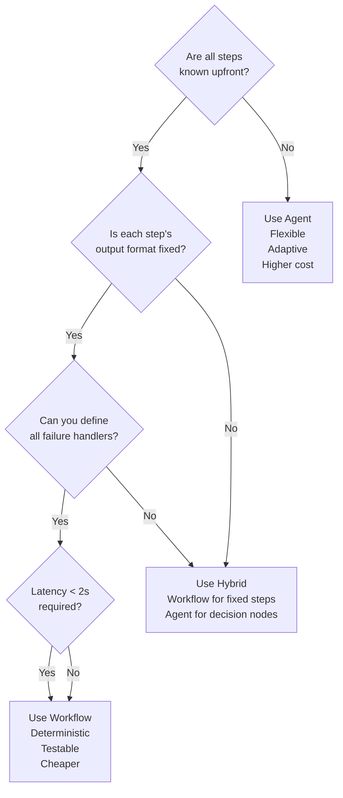
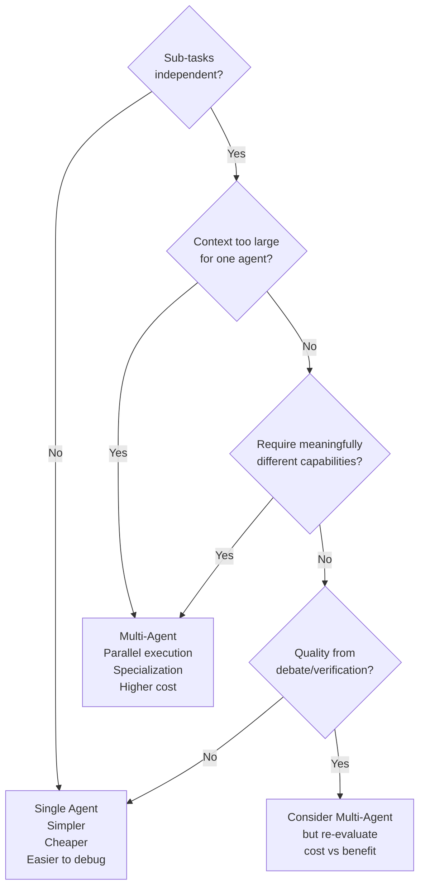
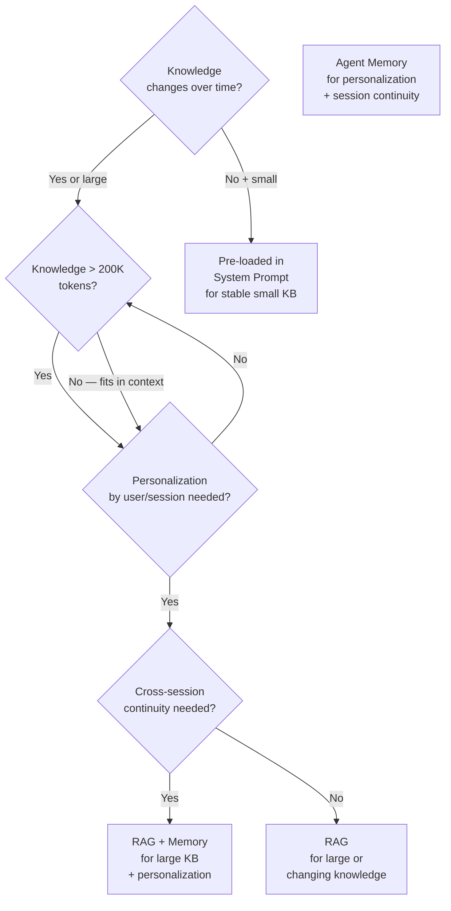
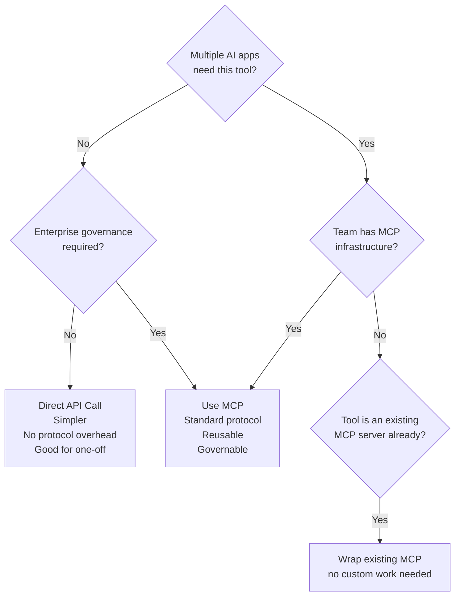
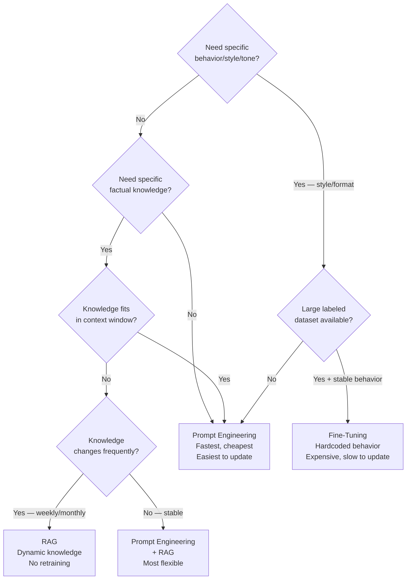
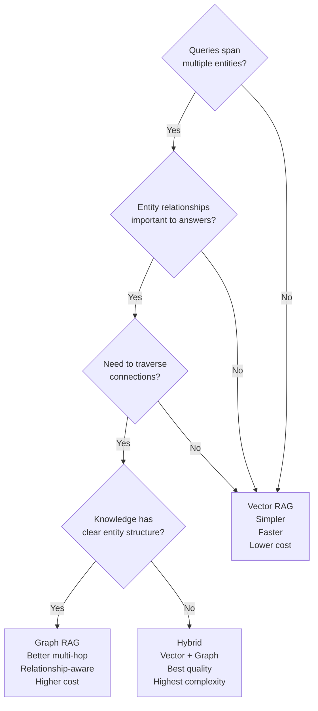
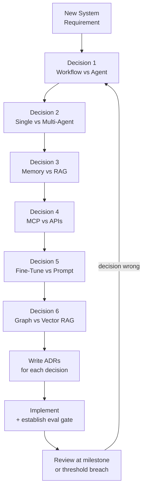

# Module 18 — Architecture Decision Frameworks

> **Phase 5 — Architect Level** | Prerequisites: All previous modules

Six decisions come up on every agentic AI engagement. Getting them wrong locks you into the wrong architecture for months. This module gives you a decision tree, comparison table, worked example, and escape hatch for each.

---

## Table of Contents
1. [What It Is](#what-it-is)
2. [Why It Exists](#why-it-exists)
3. [Internal Architecture](#internal-architecture)
4. [How It Works](#how-it-works)
5. [Real-World Use Cases](#real-world-use-cases)
6. [Production Implementation](#production-implementation)
7. [Code Examples](#code-examples)
8. [Architecture Diagrams](#architecture-diagrams)
9. [Best Practices](#best-practices)
10. [Common Mistakes](#common-mistakes)
11. [Failure Modes](#failure-modes)
12. [Security Considerations](#security-considerations)
13. [Performance Considerations](#performance-considerations)
14. [Scalability Considerations](#scalability-considerations)
15. [Cost Considerations](#cost-considerations)
16. [Enterprise Recommendations](#enterprise-recommendations)
17. [When to Use / When Not to Use](#when-to-use--when-not-to-use)
18. [Trade-offs & Architectural Decisions](#trade-offs--architectural-decisions)
19. [Key Takeaways](#key-takeaways)

---

## What It Is

Architecture decision frameworks are structured criteria for choosing between competing approaches. Each framework covers:
1. **The question** — what decision are you making?
2. **Decision criteria** — what factors matter?
3. **Decision tree** — systematic path to a recommendation
4. **Comparison table** — trade-offs side-by-side
5. **Default recommendation** — where to start
6. **Worked example** — applied to a real scenario

---

## Why It Exists

Without a framework, architectural decisions are made by:
- Whoever advocates loudest
- Whichever technology was used last time
- Marketing claims ("just use agents for everything")

Frameworks force the decision to be made against explicit criteria. They also produce documentation (ADRs) that explains the reasoning to future architects.

---

## Internal Architecture

Six frameworks, each a decision node in the architecture of an agentic system:

```
System Design Request
        │
        ▼
[1] Workflow vs Agent
        │
        ▼
[2] Single Agent vs Multi-Agent
        │
        ▼
[3] Memory vs RAG (vs Both)
        │
        ▼
[4] MCP vs Direct APIs
        │
        ▼
[5] Fine-Tuning vs Prompt Engineering (vs RAG)
        │
        ▼
[6] Graph RAG vs Vector RAG
```

---

## How It Works

### Framework 1 — Workflow vs Agent

**The question:** Should this task be implemented as a deterministic workflow or an LLM-driven agent?

**Decision criteria:**

| Criterion | → Workflow | → Agent |
|-----------|-----------|---------|
| Steps known upfront? | Yes | No |
| Steps depend on prior results? | Fixed dependencies | Dynamic dependencies |
| Failure handling | Pre-defined | Must reason about |
| Latency requirement | Tight (<2s) | Flexible |
| Cost predictability | Required | Optional |
| Test coverage | Full coverage possible | Probabilistic |
| Audit requirements | Deterministic trace | Best-effort trace |

**Decision tree:**



**Default recommendation:** Start with a workflow. Identify the specific decision points that genuinely require LLM judgment and make only those points agents.

**Worked example:** "Process invoice → extract fields → validate → route to approver"
- Extract fields: the format varies → Agent step (or structured extraction)
- Validate against rules: deterministic → Workflow step
- Route to approver: depends on extracted amount + approver org chart → Agent step
- **Decision: hybrid** — workflow skeleton with two agent decision nodes

---

### Framework 2 — Single Agent vs Multi-Agent

**The question:** Should this use one agent or multiple collaborating agents?



**Comparison table:**

| Dimension | Single Agent | Multi-Agent |
|-----------|-------------|-------------|
| Cost | 1× | 3-10× |
| Latency | Sequential | Parallel (for independent sub-tasks) |
| Debugging | One trace to follow | Multiple traces to correlate |
| Error propagation | Contained | Can compound across agents |
| Coordination | None | Required; adds complexity |
| Context isolation | One shared context | Separate focused contexts |
| Specialization | One system prompt | Multiple specialized prompts |

**Default recommendation:** Single agent. The burden of proof is on multi-agent.

---

### Framework 3 — Memory vs RAG (vs Both)

**The question:** How should the agent access knowledge beyond its training data?



**Key distinction:**
- **RAG**: agent queries a knowledge base to answer the current question (lookup)
- **Memory**: agent carries context *about the user or prior interactions* across sessions (personalization)
- **System prompt**: for stable, small (<5K tokens), rarely-changing knowledge that applies to all users

**When both:** an enterprise support agent needs RAG (product docs change weekly) + episodic memory (user called about this issue last week).

---

### Framework 4 — MCP vs Direct APIs

**The question:** Should tool integrations use MCP or direct API calls?



**When MCP wins:** enterprise platform with multiple AI apps, need for governance, existing MCP ecosystem.
**When direct API wins:** single app, one or two tools, POC/prototype stage, tools are trivial.

---

### Framework 5 — Fine-Tuning vs Prompt Engineering (vs RAG)

**The question:** How do I give the agent knowledge or behavior it doesn't have out of the box?



**Comparison table:**

| Approach | Update Speed | Cost | Quality | When |
|----------|-------------|------|---------|------|
| System prompt engineering | Minutes | Low | High (flexible) | Always try first |
| Few-shot in prompt | Minutes | Low | High for shown patterns | Style, format tasks |
| RAG | Real-time index | Medium | High for retrieval quality | Large/changing knowledge |
| Fine-tuning | Days/weeks + $ | Very high | Can exceed prompting | Stable behavior; large dataset; latency |

**Default recommendation:** Prompt engineering first. Add RAG when knowledge exceeds context. Fine-tune only when prompting consistently fails and you have >1000 labeled examples.

---

### Framework 6 — Graph RAG vs Vector RAG

**The question:** What retrieval architecture should my knowledge system use?



**When Graph RAG wins:**
- "What companies are suppliers to ACME Corp's top customers?" (multi-hop: company → customer → supplier)
- "What vulnerabilities affect systems that depend on library X?" (graph traversal)
- "Who worked with both Alice and Bob on security projects?" (relationship query)

**When Vector RAG wins:**
- "What does our return policy say?" (single-chunk retrieval)
- "Find the most relevant documentation for this error message" (semantic similarity)
- Most support, search, and summarization tasks

---

## Real-World Use Cases

**Enterprise chatbot project:**
1. Workflow vs Agent → Hybrid: FAQ handling = workflow; escalation decisions = agent
2. Single vs Multi-Agent → Single agent (queries are short, no parallelism benefit)
3. Memory vs RAG → Both: RAG for product KB, episodic memory for user preferences
4. MCP vs APIs → MCP for CRM + ticketing (governed platform); direct API for simple KB search
5. Fine-tune vs Prompt → System prompt engineering; RAG for KB
6. Graph vs Vector RAG → Vector RAG (queries are similarity-based, not relationship-based)

---

## Production Implementation

### ADR Template for AI Systems

```markdown
# ADR-[NUMBER]: [DECISION TITLE]

**Status:** [Proposed | Accepted | Deprecated | Superseded]
**Date:** YYYY-MM-DD
**Deciders:** [Names/roles]
**Supersedes:** ADR-[N] (if applicable)

## Context

[2-3 sentences: what is the problem, what constraints exist, why does this decision need to be made now]

## Decision Criteria

| Criterion | Weight | Why It Matters |
|-----------|--------|---------------|
| [e.g., Latency] | High | [SLA requirement] |
| [e.g., Cost] | Medium | [Budget constraint] |
| [e.g., Operability] | High | [Team skill set] |

## Options Considered

### Option A: [Name]
- **Description:** [2-3 sentences]
- **Pros:** [bullet list]
- **Cons:** [bullet list]
- **Est. Cost:** [rough numbers]

### Option B: [Name]
- [same structure]

## Decision

We choose **Option [X]** because [primary reason tied to criteria].

## Consequences

**Positive:**
- [expected benefits]

**Negative (accepted trade-offs):**
- [trade-offs we're accepting]

**Risks:**
- [risk 1] — mitigated by [mitigation]

## Escape Hatch

If [condition] occurs, we would migrate to [alternative] by [approach].
Expected migration cost: [rough estimate].

## Eval Gate

This decision is correct if: [measurable criterion by date].
Review this ADR in: [N weeks/months].
```

### Worked ADR: Memory vs RAG Decision

```python
# This code represents a hybrid memory+RAG integration
# resulting from ADR-003: Use RAG for product knowledge + episodic memory for user context

import anthropic
from typing import Optional

def build_context_with_decision(
    user_id: str,
    query: str,
    rag_retriever,      # from Module 07 RAG setup
    memory_manager,     # from Module 06 memory setup
    token_budget: int = 8000,
) -> str:
    """
    Implements the ADR-003 decision: hybrid RAG + episodic memory.
    - RAG: product knowledge (semantic search over docs)
    - Memory: user preferences and past interactions
    """

    # Allocate budget: 60% RAG (domain knowledge), 40% episodic (user context)
    rag_budget = int(token_budget * 0.6)
    mem_budget = int(token_budget * 0.4)

    # Retrieve product knowledge via RAG
    rag_results = rag_retriever.retrieve(query, max_tokens=rag_budget)
    rag_context = "\n\n".join(
        f"[Source: {r.source}]\n{r.content}" for r in rag_results
    )

    # Retrieve user episodic memory
    episodic_results = memory_manager.retrieve(
        query=query,
        tenant_id="default",
        memory_types=["episodic"],
        token_budget=mem_budget,
    )
    user_context = "\n".join(m.content for m in episodic_results)

    # Combine with clear separation
    context_parts = []
    if rag_context:
        context_parts.append(f"<product_knowledge>\n{rag_context}\n</product_knowledge>")
    if user_context:
        context_parts.append(f"<user_history>\n{user_context}\n</user_history>")

    return "\n\n".join(context_parts)
```

---

## Architecture Diagrams

### Decision Framework Stack



---

## Best Practices

1. **Make decisions explicitly and document them in ADRs.** An undocumented decision is just implicit assumptions waiting to cause confusion.
2. **Start with the simplest option.** Workflow before agent. Single agent before multi-agent. Prompt engineering before fine-tuning. You can always escalate; it's hard to simplify.
3. **Define the escape hatch before committing.** Every ADR should state: under what conditions would we reverse this, and how expensive would that be?
4. **Set a review date.** A decision made today may be wrong in 6 months. Schedule a review when conditions change or metrics cross a threshold.
5. **Decisions compound.** A wrong decision at layer 1 (workflow vs agent) affects everything below it. Make the high-level decisions carefully; be quick on the low-level ones.

---

## Common Mistakes

| Mistake | Impact | Fix |
|---------|--------|-----|
| Using agents for everything | Cost, complexity, fragility | Apply the Workflow vs Agent decision tree; most tasks should be workflows |
| Fine-tuning as the first resort | Slow, expensive, brittle | Try prompt engineering + RAG before considering fine-tuning |
| Multi-agent without measuring single-agent quality first | Baseline unknown; can't justify the overhead | Establish single-agent baseline before adding agents |
| MCP everywhere including prototypes | Protocol overhead before value is proven | Use direct calls in prototypes; graduate to MCP when scaling |
| Graph RAG for all use cases | Operational complexity, higher latency | Vector RAG is sufficient for 80% of cases |

---

## Failure Modes

| Failure | Symptom | Root Cause | Detection | Mitigation |
|---------|---------|-----------|-----------|------------|
| Wrong pattern chosen | System works but costs 10× more than needed | No decision framework applied | Cost per task analysis vs alternatives | Apply frameworks retrospectively; plan migration |
| Decision not revisited | Architecture built for 2024 assumptions fails in 2026 | No ADR review scheduled | Architectural degradation (quality drop, cost rise) | ADR review dates; alert on metric drift |
| Undocumented decision | New team member re-decides differently | No ADR | Architecture diverges in unexpected ways | ADR requirement in engineering guidelines |

---

## Security Considerations

- **Fine-tuning data security**: fine-tuning datasets often contain sensitive examples (customer emails, support tickets). Ensure training data is anonymized and the fine-tuning process complies with data governance policies.
- **Graph RAG authorization**: in a graph database, path traversal can surface data that direct vector search would not (e.g., traversing from "public" entity to "confidential" entity via a relationship). Enforce access control at both the node and edge level in the graph DB.

---

## Performance Considerations

- **Workflow vs Agent latency**: a deterministic workflow with 5 API calls takes ~2-3 seconds. An agent doing the same 5 steps takes 10-20 seconds due to LLM overhead. Use workflow when latency matters.
- **Fine-tuning vs prompting latency**: a fine-tuned smaller model (e.g., fine-tuned Haiku) can outperform prompted Sonnet at 10× lower cost and 3× lower latency on specific tasks.

---

## Scalability Considerations

- **Workflow scales better than agents** for predictable workloads. Workflows are deterministic; you can calculate exact resource requirements. Agents are stochastic; resource requirements vary.
- **RAG scales better than memory** for domain knowledge. A RAG index can serve millions of queries without growing the per-request context. Memory grows with the user base.

---

## Cost Considerations

| Architecture Choice | Relative Cost |
|--------------------|-----------:|
| Workflow (same task) | 1× |
| Single Agent | 3-5× |
| Multi-Agent | 10-30× |
| Prompt Engineering | 1× |
| RAG (+ retrieval) | 1.5× |
| Fine-Tuning (upfront) | 100-1000× once, then 0.5-0.8× inference |
| Vector RAG | 1.5× |
| Graph RAG | 2-4× |

---

## Enterprise Recommendations

1. **Require ADRs for all new AI system architectures.** Standardize the template; store in the project repo alongside the code.
2. **Architecture review for new agent deployments.** Each new agent goes through a structured review using these frameworks before development begins.
3. **Establish a decision registry.** Maintain a searchable index of all AI architecture decisions across the organization. New projects can learn from previous decisions.
4. **Run periodic architecture fitness reviews.** Every 6 months, review existing AI systems against current patterns. Technology moves fast; last year's architecture may be costly and brittle today.

---

## When to Use / When Not to Use

**Use these frameworks when:**
- Starting a new AI system or agent deployment
- Evaluating whether an existing system needs refactoring
- Conducting architecture reviews of other teams' designs
- Onboarding new engineers to AI platform decisions

**Skip the full framework for:**
- PoCs and prototypes (decide fast, validate fast)
- Low-stakes internal tools with easy replacement cost

---

## Trade-offs & Architectural Decisions

The meta-level trade-off across all frameworks: **simplicity vs capability**. Every step up the capability ladder (workflow → agent, single → multi-agent, prompting → fine-tuning, vector → graph RAG) adds capability but increases cost, complexity, and failure surface. The right architecture is the simplest one that meets the requirements — not the most capable one you can build.

---

## Key Takeaways

- Six decisions define the architecture of any agentic AI system. Making them explicitly with criteria beats intuition.
- Default to the simpler option: workflow, single agent, prompt engineering, vector RAG.
- Escalate only when the simpler option demonstrably fails, not when a more complex one "might" work better.
- Document every decision in an ADR with an escape hatch and a review date.
- Fine-tuning is the last resort: 1000+ labeled examples, stable behavior requirements, and prompt engineering has genuinely failed.
- Graph RAG is for multi-hop relationship queries, not general retrieval.
- Workflow vs Agent is the most impactful decision — most production tasks are workflows, not agents.

## Further Study

- "Architecture Decision Records" (ThoughtWorks Technology Radar)
- "Designing Data-Intensive Applications" (Kleppmann) — decision frameworks for infrastructure
- Microsoft GraphRAG paper and GitHub repository
- Anthropic's "When to use agents vs workflows" documentation
- RAG vs Fine-Tuning vs Prompting comparison (various practitioners on arXiv)
- ADR tooling: adr-tools, Log4brains
