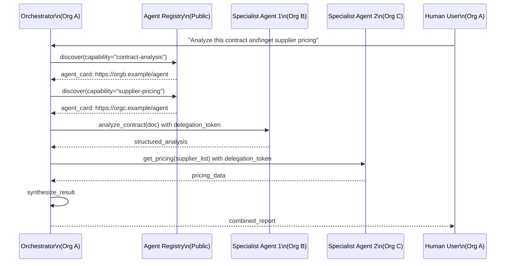
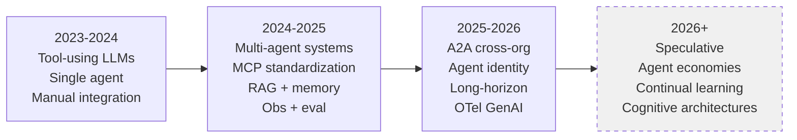

# Module 20 — Future of Agentic AI

> **Phase 5 — Architect Level** | Final module in the learning path

The field moves fast enough that any specific claim here may be outdated in 6 months. This module does two things: (1) describes what is shipping today that you must understand, and (2) identifies what is speculative — emerging patterns where the architecture is not yet settled. Distinguishing the two is itself a core architect skill.

---

## Table of Contents
1. [What It Is](#what-it-is)
2. [Why It Exists](#why-it-exists)
3. [Internal Architecture](#internal-architecture)
4. [How It Works](#how-it-works)
5. [Real-World Use Cases](#real-world-use-cases)
6. [Production Implementation](#production-implementation)
7. [Code Examples](#code-examples)
8. [Architecture Diagrams](#architecture-diagrams)
9. [Best Practices](#best-practices)
10. [Common Mistakes](#common-mistakes)
11. [Failure Modes](#failure-modes)
12. [Security Considerations](#security-considerations)
13. [Performance Considerations](#performance-considerations)
14. [Scalability Considerations](#scalability-considerations)
15. [Cost Considerations](#cost-considerations)
16. [Enterprise Recommendations](#enterprise-recommendations)
17. [When to Use / When Not to Use](#when-to-use--when-not-to-use)
18. [Trade-offs & Architectural Decisions](#trade-offs--architectural-decisions)
19. [Key Takeaways](#key-takeaways)

---

## What It Is

The future of agentic AI has two layers:
1. **Near-term (shipping now or in 2025-2026)**: Agent-to-agent protocols, agent identity/delegation, improved orchestration, better memory, stronger eval
2. **Medium-term (speculative, architecturally uncertain)**: Autonomous organizations, continual learning agents, world models, cognitive architectures at scale

Good architects design for the near-term while keeping the architecture flexible enough to adopt the medium-term.

---

## Why It Exists

The current state of agentic AI (2025-2026) is analogous to the early web (1995-1998): the fundamental primitives work, but the standardization, security model, and operational patterns are still being established. Architects who understand what's coming can design systems that survive the next version of standards.

---

## Internal Architecture

### Technology Maturity Map

```mermaid
flowchart LR
    subgraph Shipping["Shipping Today"]
        MCP["MCP v1.x\nTool protocol"]
        A2A_PROTO["A2A Protocol v0.x\nAgent coordination"]
        RAG_ADV["Advanced RAG\nGraph RAG, agentic RAG"]
        REASON["Reasoning models\nExtended thinking"]
    end

    subgraph Emerging["Emerging 2025-2026"]
        AGENT_ID["Agent Identity\nDelegated authority"]
        REG["Agent Registries\nDiscovery standards"]
        OBS_STD["Agent Observability\nOTel GenAI v1.0"]
        LONG_HOR["Long-horizon agents\nWeeks-long tasks"]
    end

    subgraph Speculative["Speculative / Research"]
        AUT_ORG["Autonomous Organizations\nAgent economies"]
        CONT_LEARN["Continual Learning\nOnline adaptation"]
        WORLD_MDL["World Models\nSelf-supervised planning"]
        COG_ARCH["Cognitive Architectures\nMemory-centric designs"]
    end

    Shipping --> Emerging --> Speculative
```



---

## How It Works

### Agent-to-Agent Protocols (A2A) — Shipping

Google's A2A Protocol (released 2025) defines how agents from different organizations and platforms discover each other and collaborate on tasks. Key components:

**Agent Cards:** A standardized JSON document that describes what an agent can do, how to invoke it, what it costs, and what credentials are required.

```json
{
  "schemaVersion": "1.0",
  "name": "DocumentAnalyzer",
  "version": "2.1.0",
  "description": "Analyzes legal and financial documents, extracting key clauses and flagging risks",
  "provider": {
    "organization": "LexCorp AI",
    "contact": "ai-platform@lexcorp.example"
  },
  "capabilities": {
    "streaming": true,
    "pushNotifications": false,
    "stateTransitionHistory": true
  },
  "skills": [
    {
      "id": "analyze-contract",
      "name": "Contract Analysis",
      "description": "Extracts parties, obligations, risk clauses, and red flags from contracts",
      "inputModes": ["application/pdf", "text/plain"],
      "outputModes": ["application/json"],
      "examples": [
        {
          "input": "ACME Corp Services Agreement dated 2024-01-01...",
          "output": "{\"parties\": [...], \"red_flags\": [...]}"
        }
      ]
    }
  ],
  "authentication": {
    "schemes": ["bearer"]
  },
  "defaultInputMode": "application/json",
  "defaultOutputMode": "application/json"
}
```

A2A enables: an orchestrator agent discovering specialist agents at runtime, federating tasks across organizational boundaries, and composing multi-organization workflows without tight coupling.

### Agent Identity and Delegated Authority — Emerging

Today, agents authenticate to systems using service account credentials. The emerging pattern is treating agents as first-class principals with their own identity:

**The problem:** When Agent A (owned by Organization X) invokes Agent B (owned by Organization Y) to access Resource R (at Organization Z), whose authorization is used? Today: usually service account credentials that carry too-broad permissions.

**The emerging solution:** OAuth 2.0 on behalf of agent principals, with delegation chains:
- User authorizes Agent A to act on their behalf
- Agent A can delegate (with scope reduction) to Agent B
- The delegation chain is cryptographically verifiable
- At the final resource, the original user's authorization + the delegation chain is validated

This is still being standardized (IETF discussions, no finalized RFC as of early 2026), but the direction is clear: agents need cryptographic identity, not shared passwords.

### Autonomous Organizations — Speculative

The concept: organizations where agents handle the majority of operational decision-making, with humans setting goals and reviewing outcomes rather than managing day-to-day operations.

**What would this require (that we don't have today):**
- Long-horizon reliability: agents that work for days or weeks without human intervention
- Robust error recovery: self-healing from novel failures, not just known failure modes
- Goal alignment verification: confidence that agents are pursuing intended goals
- Governance mechanisms: how do you audit, override, and roll back agent decisions at organizational scale?

**Current state:** Long-horizon agents exist but require close monitoring. The reliability and governance mechanisms are not yet mature enough for "autonomous organization" in the full sense.

### Cognitive Architectures — Research

Cognitive architectures combine all memory systems (working, episodic, semantic, procedural) with reasoning, planning, and learning in a unified framework. The CoALA framework (Sumers et al., 2023) is the most systematic attempt to describe this.

**What's novel in 2025-2026:** Memory-centric designs where the agent's primary persistent structure is a rich, interconnected memory graph (not just a vector store), with inference at retrieval time (not just similarity search). This approaches the structure of human long-term memory more closely.

**Current gaps:** Memory conflict resolution (what to do when two memories contradict), memory importance decay (old memories reducing in weight without being deleted), and memory-driven planning (using memories to inform future action selection, not just context).

---

## Real-World Use Cases

### Shipping Today
- **Cross-org agent federation** (A2A): a procurement agent at Company A discovers and invokes a supplier catalog agent at Company B to get real-time pricing
- **Agent observability** (OTel GenAI conventions): unified trace view across an agent system, from the orchestrator through all sub-agents and tool calls

### Emerging 2025-2026
- **Long-horizon coding agents**: agents that work on a software project for days, context-managing across thousands of files and multiple sessions
- **Regulatory compliance agents**: agents that monitor regulatory changes, assess impact on the organization, and prepare response plans — running continuously as a background process

### Speculative
- **Agent economies**: markets where AI agents bid for tasks, allocate compute resources, and negotiate data access — without human intermediaries
- **Self-improving agents**: agents that run eval suites on themselves, identify failure patterns, and propose prompt/architecture improvements

---

## Production Implementation

### A2A Client Integration

```python
# Integrating with a remote A2A agent
import httpx
import json
from typing import AsyncGenerator

class A2AClient:
    """
    Client for the Agent-to-Agent (A2A) protocol.
    Discovers agents via agent cards and invokes them.
    """

    def __init__(self, base_url: str, auth_token: str):
        self.base_url = base_url.rstrip("/")
        self.auth_token = auth_token

    async def get_agent_card(self) -> dict:
        """Fetch the agent's capability description."""
        async with httpx.AsyncClient() as client:
            resp = await client.get(
                f"{self.base_url}/.well-known/agent.json",
                headers={"Authorization": f"Bearer {self.auth_token}"},
            )
            resp.raise_for_status()
            return resp.json()

    async def send_task(self, skill_id: str, input_data: dict) -> dict:
        """Submit a task to the remote agent and wait for completion."""
        task_payload = {
            "id": f"task-{__import__('uuid').uuid4()}",
            "message": {
                "role": "user",
                "parts": [{"type": "data", "data": input_data}]
            }
        }
        async with httpx.AsyncClient(timeout=120) as client:
            resp = await client.post(
                f"{self.base_url}/tasks/send",
                json=task_payload,
                headers={
                    "Authorization": f"Bearer {self.auth_token}",
                    "X-Skill-Id": skill_id,
                },
            )
            resp.raise_for_status()
            return resp.json()

    async def stream_task(
        self,
        skill_id: str,
        input_data: dict,
    ) -> AsyncGenerator[str, None]:
        """Stream a task response using SSE."""
        task_payload = {
            "id": f"task-{__import__('uuid').uuid4()}",
            "message": {
                "role": "user",
                "parts": [{"type": "data", "data": input_data}]
            }
        }
        async with httpx.AsyncClient(timeout=300) as client:
            async with client.stream(
                "POST",
                f"{self.base_url}/tasks/sendSubscribe",
                json=task_payload,
                headers={
                    "Authorization": f"Bearer {self.auth_token}",
                    "Accept": "text/event-stream",
                    "X-Skill-Id": skill_id,
                },
            ) as resp:
                async for line in resp.aiter_lines():
                    if line.startswith("data: "):
                        data = json.loads(line[6:])
                        if "result" in data:
                            yield data["result"].get("text", "")


# Usage example:
async def analyze_contract_via_a2a(contract_text: str) -> dict:
    """
    Use a remote specialized document analysis agent via A2A.
    """
    client = A2AClient(
        base_url="https://agents.lexcorp.example",
        auth_token="Bearer eyJhbGci...",
    )

    # Discover capabilities
    agent_card = await client.get_agent_card()
    skill = next(
        (s for s in agent_card["skills"] if s["id"] == "analyze-contract"),
        None
    )
    if not skill:
        raise ValueError("Remote agent does not support contract analysis")

    result = await client.send_task(
        skill_id="analyze-contract",
        input_data={"text": contract_text, "output_format": "structured_json"},
    )
    return result
```

### Agent Identity Token (Emerging Pattern)

```python
import jwt
import time

def create_agent_delegation_token(
    agent_id: str,
    parent_user_id: str,
    delegated_scopes: list[str],
    resource_audience: str,
    signing_key: str,
    ttl_seconds: int = 3600,
) -> str:
    """
    Create a JWT token representing agent delegation.
    The token says: "User X delegated these scopes to Agent Y, for Resource Z."
    
    Note: This pattern is emerging (not finalized RFC as of early 2026).
    """
    now = int(time.time())
    payload = {
        "iss": f"agent-platform.example",
        "sub": agent_id,              # The agent is the subject
        "act": {"sub": parent_user_id},  # RFC 8693: "act" = the actor (the user delegating)
        "aud": resource_audience,     # The resource this token is for
        "scope": " ".join(delegated_scopes),
        "iat": now,
        "exp": now + ttl_seconds,
        "jti": str(__import__('uuid').uuid4()),
    }
    return jwt.encode(payload, signing_key, algorithm="RS256")
```

---

## Architecture Diagrams

### A2A Multi-Organization Agent Pipeline



### Evolution of Agent Architectures



---

## Best Practices

1. **Track standards separately from implementations.** MCP, A2A, OTel GenAI — these are evolving standards. Your implementation should be separated from the standard so you can update the adapter without changing business logic.
2. **Design for agent identity from day one.** Even if you're not implementing OAuth agent delegation today, ensure your agent invocation code passes a caller identity (service name, agent type, user context) so you can add proper authorization later without a redesign.
3. **Build on stable primitives.** The fundamentals (LLM inference, context management, tool use, eval) are stable. Emerging features (A2A, agent identity, long-horizon) build on top. Master the fundamentals before adopting emerging patterns.
4. **Be a skeptical adopter of speculative patterns.** "Autonomous organizations" make good conference talks but are not production-ready. Evaluate by asking: does this have production deployments at scale? What are the known failure modes?

---

## Common Mistakes

| Mistake | Impact | Fix |
|---------|--------|-----|
| Treating speculative as current | Wasted engineering on unstable patterns | Distinguish "shipping" from "research" explicitly |
| Adopting A2A before internal agent patterns are mature | Protocol overhead amplifies internal complexity | Get single-org agents right first; A2A adds cross-org |
| Ignoring model capability improvements | Prompting patterns built for old models become obsolete | Re-evaluate architecture every 6 months against current model capabilities |
| Building for hypothetical future requirements | Over-engineered, hard to operate | Build for current requirements; design extension points |

---

## Failure Modes

| Failure | Symptom | Root Cause | Detection | Mitigation |
|---------|---------|-----------|-----------|------------|
| Standards incompatibility | A2A agents can't communicate | Protocol version mismatch | Version negotiation errors | Pin protocol versions; test compatibility |
| Delegation chain too long | Authorization fails | Too many delegation hops; token too large | Auth errors with oversized tokens | Limit delegation depth to 2-3 hops |
| Agent identity confusion | Actions attributed to wrong principal | No clear delegation model | Audit log shows wrong actor | Explicit delegation tokens per action |
| Speculative pattern in production | System is unreliable; team can't debug | Immature pattern adopted too early | High incident rate; no community knowledge | Roll back to stable pattern |

---

## Security Considerations

### A2A Security Model
Cross-organization agent invocation creates new threat surfaces:
- **Agent impersonation**: A malicious actor serves a fake agent card at a compromised URL. Mitigation: pin known agent URLs; verify TLS certificate; sign agent cards.
- **Scope creep in delegation**: An agent receives delegated authority and passes it (with full scope) to another agent. Mitigation: delegation must always *reduce* scope, never preserve or expand it.
- **Token theft**: A bearer token intercepted in transit grants full delegated access. Mitigation: TLS everywhere; short-lived tokens (1 hour max); audience binding.

### Long-horizon Agent Security
An agent running for days accumulates decisions and takes actions over a long period. Security implications:
- Goal drift is harder to detect in long-horizon agents
- Compromised memory (poisoning) can persist across a long task
- Human oversight becomes harder as the decision chain grows longer

Mitigation: mandatory human checkpoints at fixed intervals (e.g., every 24 hours or at defined milestones), regardless of whether the agent thinks it needs one.

---

## Performance Considerations

- **A2A adds network latency.** Each cross-organization agent call adds round-trip time. Design agent handoffs to be coarse-grained (large sub-tasks, not individual tool calls) to amortize this overhead.
- **Long-horizon agents need efficient context management.** A task running for days cannot carry a growing conversation history. Memory compression, sub-agent isolation, and scratchpad patterns are essential.
- **Agent registries need caching.** Discovering agents at runtime via a registry adds latency. Cache agent cards locally with a TTL (e.g., 1 hour).

---

## Scalability Considerations

- **A2A enables horizontal specialization.** Instead of one multi-purpose agent that scales vertically (more capable model), A2A enables a network of specialized agents that scales horizontally (more specialist agents).
- **Agent registries must be highly available.** In a world where agents discover other agents at runtime, the registry is critical infrastructure. It needs the same availability SLA as DNS.

---

## Cost Considerations

- **A2A introduces external billing.** When your agent invokes a third-party specialist agent via A2A, you're paying an external service. Model this as a tool cost in your task cost equation.
- **Long-horizon agents accumulate costs.** A task running for 3 days may cost $50-500 depending on loop frequency and context size. Long-horizon tasks need explicit cost budgets with daily or milestone-based limits.
- **Autonomous operation is cheaper in steady state but expensive in failures.** An autonomous agent that fails without detection can waste significant budget. Monitoring costs go up; operational labor costs go down.

---

## Enterprise Recommendations

1. **Participate in standards bodies.** MCP, A2A, and OTel GenAI are community-driven. An enterprise's requirements are best addressed by participating in the standards process, not by waiting for finalized RFCs.
2. **Build an internal agent platform, not bespoke agents.** The platform handles the evolving standards (MCP upgrades, A2A, identity) centrally. Individual agent implementations don't need to track every protocol change.
3. **Invest in agent observability now.** OTel GenAI conventions are stable enough to adopt. The teams that have observability infrastructure built before the ecosystem matures will be much better positioned.
4. **Design governance for long-horizon agents.** What decisions can a long-horizon agent make autonomously? What requires human review? Define this policy before deploying long-horizon agents.

---

## When to Use / When Not to Use

**Use A2A today if:**
- You need to invoke specialist agents from external organizations
- You're building an internal agent marketplace and want standard discovery

**Wait on A2A if:**
- Your agents don't cross organizational boundaries
- You have simpler internal integration needs

**Use OTel GenAI conventions now:**
- They're stable enough; early adoption improves future compatibility

**Defer speculative patterns (autonomous organizations, continual learning, world models):**
- No production-grade implementations at enterprise scale yet
- Failure modes not well-documented
- Tooling for operation and debugging doesn't exist

---

## Trade-offs & Architectural Decisions

### Build on emerging vs proven standards?
- **Proven** (MCP v1, OTel GenAI): lower risk; smaller ecosystem now but growing
- **Emerging** (A2A v0.x, agent identity drafts): early adopter advantages; protocol instability risk
- Rule: adopt emerging standards only if you can afford to refactor when v1.0 breaks compatibility with v0.x

### Invest in long-horizon agents now?
- **Yes**: competitive advantage; solving real problems (overnight coding, continuous monitoring)
- **Risk**: reliability and cost management for long-horizon tasks are unsolved
- Approach: pilot long-horizon agents on low-blast-radius tasks; build reliability infrastructure before expanding to critical paths

---

## Key Takeaways

- A2A (Agent-to-Agent Protocol) is shipping in 2025 and enables cross-organization agent discovery and invocation. Build adapters for it.
- Agent identity (delegated authority, first-class agent principals) is the emerging security model. Design with it in mind even if you're not implementing it yet.
- OTel GenAI semantic conventions are stable enough to adopt today. Observability built now will benefit from the full ecosystem.
- Autonomous organizations and continual learning are speculative — promising research directions, not production-ready patterns.
- The fundamentals (agent loop, memory, RAG, eval, security) remain constant regardless of how the ecosystem evolves. Mastery of fundamentals is the most durable investment.
- Distinguish "shipping" from "emerging" from "speculative." Design for shipping; design extension points for emerging; evaluate speculative with healthy skepticism.
- Standards move faster in AI than in traditional infrastructure. Plan for protocol migrations.
- Your long-horizon contribution as an architect: design platforms that can absorb new standards without full rewrites, and govern agent behavior without becoming a bottleneck.

## Further Study

- A2A Protocol specification (Google, GitHub: google-a2a/a2a-spec)
- MCP specification evolution (spec.modelcontextprotocol.io)
- OpenTelemetry GenAI Semantic Conventions (semantic-conventions/docs/gen-ai)
- Cognitive Architectures for Language Agents (CoALA) — Sumers et al.
- MemGPT: Towards LLMs as Operating Systems — long-term memory model
- Generative Agents: Interactive Simulacra of Human Behavior — Park et al.
- "Agents" (Anthropic research blog series)
- RFC 8693: OAuth 2.0 Token Exchange — delegation patterns
- IETF drafts on agent identity and delegated authority (2025-2026)
