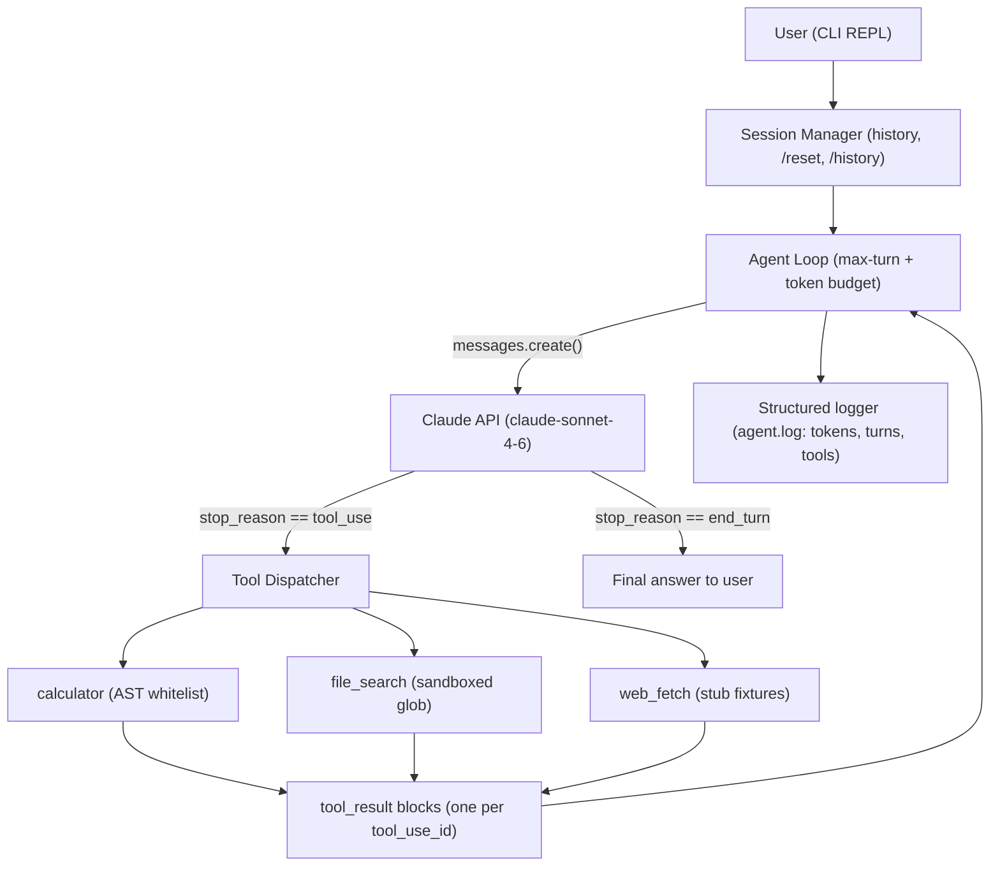

# Project 1: Single Tool-Using Agent

> **Phase:** Foundations → Core Agent Engineering bridge
> **Estimated effort:** 12–20 hours
> **Prerequisites:** [Module 01 – LLM Fundamentals](../modules/01-llm-fundamentals.md), [Module 03 – Structured Outputs & Tool Use](../modules/03-structured-outputs-and-tool-use.md), [Module 05 – Agent Loops](../modules/05-agent-loops.md)

---

## Objective

Build a command-line agent **from scratch — no framework** (no LangChain, no CrewAI, no Agent SDK helpers). You will implement the raw agent loop against the Anthropic Messages API, define three tools with proper JSON Schemas, manage conversation state, and enforce a max-turn budget so the agent can never loop forever.

The point of this project is to internalize what every framework hides: the loop is just *call model → inspect stop_reason → execute tools → append results → repeat*. An architect who has built this by hand can debug any framework; one who hasn't is at the mercy of abstractions.

## Skills Exercised

| Skill | Module |
|---|---|
| Token economics, context window mechanics | [01-llm-fundamentals](../modules/01-llm-fundamentals.md) |
| Prompt design for tool selection | [02-prompt-engineering](../modules/02-prompt-engineering.md) |
| Tool schemas, structured outputs, `stop_reason` handling | [03-structured-outputs-and-tool-use](../modules/03-structured-outputs-and-tool-use.md) |
| The agent loop, turn budgets, termination conditions | [05-agent-loops](../modules/05-agent-loops.md) |
| Conversation state management | [06-memory-and-state](../modules/06-memory-and-state.md) |
| Basic failure handling and retries | [12-evaluation-and-testing](../modules/12-evaluation-and-testing.md) |

## Requirements

### Functional

1. **CLI REPL**: `python agent.py` starts an interactive session; each user message kicks off one agent run.
2. **Three tools**, each with a complete JSON Schema (`description`, per-property descriptions, `required` array):
   - `calculator(expression: str)` — safely evaluate arithmetic (no `eval` on raw input; use an AST whitelist).
   - `file_search(pattern: str, directory: str)` — glob-style search under a sandboxed root directory only.
   - `web_fetch(url: str)` — a **stub** that returns canned content from a local fixtures dict (teaches the interface without network nondeterminism).
3. **Agent loop**: loop until `stop_reason == "end_turn"`, executing all `tool_use` blocks per turn and returning one `tool_result` per `tool_use_id`.
4. **Conversation state**: full message history persists across user turns within a session; `/reset` clears it; `/history` prints a turn-by-turn summary.
5. **Max-turn budget**: configurable (default 10 model calls per user request). On exhaustion, the agent must return a graceful "budget exhausted" summary of what it did so far — not a stack trace.
6. **Tool error contract**: tool failures are returned as `tool_result` with `is_error: true` and an actionable message, so the model can self-correct.

### Non-Functional

- **No frameworks.** Only `anthropic` SDK + stdlib.
- **Deterministic tool layer**: tools must be unit-testable without any API call.
- **Observability**: every model call logs turn number, input/output token counts, stop_reason, and tool calls made (structured JSON lines to `agent.log`).
- **Safety**: `file_search` must reject path traversal (`..`, absolute paths outside the sandbox). Calculator must reject anything that isn't pure arithmetic.
- **Cost guard**: abort the session if cumulative input+output tokens exceed a configurable ceiling (default 200K).

## Suggested Architecture



## Milestones

### M1 — Single-shot tool call (acceptance criteria)
- [ ] One `messages.create` call with the calculator tool defined; "what is 17 * 43?" produces a `tool_use` block.
- [ ] You execute it, return the `tool_result`, and the follow-up call yields the right answer in plain text.
- [ ] Tool input is read from `block.input` (parsed object), never by string-matching serialized JSON.

### M2 — The full loop (acceptance criteria)
- [ ] `while` loop terminates on `end_turn`; handles multiple `tool_use` blocks in one assistant turn (all results in a single user message).
- [ ] A prompt requiring two sequential tool calls ("find files matching *.md then count them times 3") completes in ≤ 4 model calls.
- [ ] Assistant `response.content` is appended to history **before** tool results (order matters — the API rejects orphaned `tool_result` blocks).

### M3 — Three tools + error contract (acceptance criteria)
- [ ] All three tools registered; model picks the right one ≥ 9/10 times on a 10-prompt smoke set you write.
- [ ] `calculator("import os")` returns `is_error: true` with a helpful message; the model recovers and apologizes rather than crashing.
- [ ] `file_search("../../etc", "passwd")` is rejected by the sandbox check.

### M4 — State, budgets, logging (acceptance criteria)
- [ ] Multi-turn conversation works ("remember the result"; "now double it").
- [ ] Turn budget of 3 with a task needing 5 turns produces the graceful summary, not an exception.
- [ ] `agent.log` contains one JSON line per model call with `turn`, `input_tokens`, `output_tokens`, `stop_reason`, `tools_called`.

### M5 — Hardening + tests (acceptance criteria)
- [ ] Unit tests for all three tools (no API calls) and for the sandbox/AST validators.
- [ ] One integration test with a mocked client that simulates a 2-turn tool exchange.
- [ ] `RateLimitError` and 5xx are retried by SDK config (`max_retries`); other 4xx fail fast with a clear message.

## Starter Code

```python
"""
Project 1: Single Tool-Using Agent (no framework).
Run: ANTHROPIC_API_KEY=... python agent.py
"""
from __future__ import annotations

import ast
import glob
import json
import operator
import os
import sys
import time
from dataclasses import dataclass, field
from typing import Any, Callable

import anthropic

MODEL = "claude-sonnet-4-6"
MAX_TURNS_PER_REQUEST = 10
SESSION_TOKEN_CEILING = 200_000
SANDBOX_ROOT = os.path.abspath("./sandbox")

SYSTEM_PROMPT = """You are a precise CLI assistant with tools.
Use tools when they help; answer directly when they don't.
If a tool returns an error, adjust your input and retry at most once,
then explain the failure to the user. Never invent tool results."""

# ---------------------------------------------------------------- tools ----

_ALLOWED_OPS = {
    ast.Add: operator.add, ast.Sub: operator.sub, ast.Mult: operator.mul,
    ast.Div: operator.truediv, ast.Pow: operator.pow, ast.USub: operator.neg,
    ast.Mod: operator.mod,
}

def calculator(expression: str) -> str:
    """Safely evaluate arithmetic via an AST whitelist (never eval())."""
    def _eval(node: ast.AST) -> float:
        if isinstance(node, ast.Expression):
            return _eval(node.body)
        if isinstance(node, ast.Constant) and isinstance(node.value, (int, float)):
            return node.value
        if isinstance(node, ast.BinOp) and type(node.op) in _ALLOWED_OPS:
            return _ALLOWED_OPS[type(node.op)](_eval(node.left), _eval(node.right))
        if isinstance(node, ast.UnaryOp) and type(node.op) in _ALLOWED_OPS:
            return _ALLOWED_OPS[type(node.op)](_eval(node.operand))
        raise ValueError(f"Disallowed expression element: {ast.dump(node)}")
    tree = ast.parse(expression, mode="eval")
    return str(_eval(tree))

def file_search(pattern: str, directory: str = ".") -> str:
    """Glob search confined to SANDBOX_ROOT. Rejects traversal."""
    target = os.path.abspath(os.path.join(SANDBOX_ROOT, directory))
    if not target.startswith(SANDBOX_ROOT):
        raise PermissionError(f"directory escapes sandbox: {directory!r}")
    matches = glob.glob(os.path.join(target, "**", pattern), recursive=True)
    rel = [os.path.relpath(m, SANDBOX_ROOT) for m in matches[:50]]
    return json.dumps({"count": len(matches), "matches": rel})

_WEB_FIXTURES = {
    "https://example.com/pricing": "Plan A: $10/mo. Plan B: $25/mo. Enterprise: contact sales.",
    "https://example.com/docs": "Quickstart: install the CLI, run `init`, then `deploy`.",
}

def web_fetch(url: str) -> str:
    """STUB: returns canned content. TODO(M5+): real HTTP with allowlist + timeout."""
    if url not in _WEB_FIXTURES:
        raise LookupError(f"fixture not found for {url!r}; available: {list(_WEB_FIXTURES)}")
    return _WEB_FIXTURES[url]

TOOL_IMPLS: dict[str, Callable[..., str]] = {
    "calculator": calculator,
    "file_search": file_search,
    "web_fetch": web_fetch,
}

TOOL_DEFS: list[dict[str, Any]] = [
    {
        "name": "calculator",
        "description": "Evaluate a pure arithmetic expression (+ - * / % ** and parentheses). "
                       "Call this for ANY math beyond trivial mental arithmetic.",
        "input_schema": {
            "type": "object",
            "properties": {
                "expression": {"type": "string", "description": "e.g. '(17*43)+2**5'"}
            },
            "required": ["expression"],
        },
    },
    {
        "name": "file_search",
        "description": "Search for files by glob pattern inside the sandbox directory. "
                       "Call this when the user asks about local files.",
        "input_schema": {
            "type": "object",
            "properties": {
                "pattern": {"type": "string", "description": "Glob, e.g. '*.md'"},
                "directory": {"type": "string", "description": "Relative dir inside sandbox; default '.'"},
            },
            "required": ["pattern"],
        },
    },
    {
        "name": "web_fetch",
        "description": "Fetch the text content of a URL. Call this when the user references a web page.",
        "input_schema": {
            "type": "object",
            "properties": {"url": {"type": "string", "description": "Absolute URL"}},
            "required": ["url"],
        },
    },
]

# ------------------------------------------------------------- the loop ----

@dataclass
class Session:
    messages: list[dict[str, Any]] = field(default_factory=list)
    total_tokens: int = 0

def log_event(**kw: Any) -> None:
    with open("agent.log", "a") as f:
        f.write(json.dumps({"ts": time.time(), **kw}) + "\n")

def execute_tool(name: str, tool_input: dict[str, Any]) -> tuple[str, bool]:
    """Returns (content, is_error). Never raises into the loop."""
    try:
        fn = TOOL_IMPLS[name]
        return fn(**tool_input), False
    except Exception as exc:  # noqa: BLE001 — the model needs the message
        return f"Error: {type(exc).__name__}: {exc}", True

def run_agent(client: anthropic.Anthropic, session: Session, user_input: str) -> str:
    session.messages.append({"role": "user", "content": user_input})
    for turn in range(1, MAX_TURNS_PER_REQUEST + 1):
        response = client.messages.create(
            model=MODEL,
            max_tokens=4096,
            system=SYSTEM_PROMPT,
            tools=TOOL_DEFS,
            messages=session.messages,
        )
        usage = response.usage
        session.total_tokens += usage.input_tokens + usage.output_tokens
        log_event(turn=turn, stop_reason=response.stop_reason,
                  input_tokens=usage.input_tokens, output_tokens=usage.output_tokens,
                  tools_called=[b.name for b in response.content if b.type == "tool_use"])

        if session.total_tokens > SESSION_TOKEN_CEILING:
            return "[cost guard] Session token ceiling reached. Run /reset to continue."

        # CRITICAL ORDER: append the assistant turn before tool results.
        session.messages.append({"role": "assistant", "content": response.content})

        if response.stop_reason == "end_turn":
            return next((b.text for b in response.content if b.type == "text"), "")

        if response.stop_reason == "tool_use":
            results = []
            for block in response.content:
                if block.type == "tool_use":
                    content, is_error = execute_tool(block.name, block.input)
                    results.append({
                        "type": "tool_result",
                        "tool_use_id": block.id,
                        "content": content,
                        "is_error": is_error,
                    })
            session.messages.append({"role": "user", "content": results})
            continue

        # max_tokens / refusal / anything else
        return f"[stopped: {response.stop_reason}] partial output returned."

    # TODO(M4): instead of bailing, make one final budget-free summarization call
    # asking the model to summarize progress so far.
    return "[budget exhausted] I used my full turn budget. Here is what I completed so far..."

def main() -> None:
    os.makedirs(SANDBOX_ROOT, exist_ok=True)
    client = anthropic.Anthropic()  # reads ANTHROPIC_API_KEY
    session = Session()
    print("agent ready. /reset, /history, /quit")
    while True:
        try:
            user_input = input("you> ").strip()
        except (EOFError, KeyboardInterrupt):
            break
        if not user_input:
            continue
        if user_input == "/quit":
            break
        if user_input == "/reset":
            session = Session(); print("[history cleared]"); continue
        if user_input == "/history":
            for i, m in enumerate(session.messages):
                kind = m["content"] if isinstance(m["content"], str) else f"<{len(m['content'])} blocks>"
                print(f"  {i:02d} {m['role']:9s} {str(kind)[:80]}")
            continue
        print("agent>", run_agent(client, session, user_input))

if __name__ == "__main__":
    main()
```

## Stretch Goals

1. **Streaming output** — switch the final-answer call to `client.messages.stream(...)` and print tokens as they arrive.
2. **Parallel-safe tools** — execute multiple `tool_use` blocks concurrently with `concurrent.futures` (tools are read-only, so this is safe); measure latency improvement.
3. **Prompt caching** — add `cache_control` to the system prompt and verify `cache_read_input_tokens > 0` from turn 2 onward.
4. **Tool-choice experiments** — force a tool with `tool_choice={"type": "tool", "name": ...}` and observe how it changes behavior on ambiguous prompts.
5. **Real `web_fetch`** — replace the stub with `httpx` + a domain allowlist, 5s timeout, response-size cap, and HTML-to-text stripping.
6. **Self-correction eval** — build a 20-case eval set where the first tool call is engineered to fail; measure recovery rate.

## Grading Rubric

| Criterion | Novice | Competent | Expert |
|---|---|---|---|
| Agent loop correctness | Works for single tool call; breaks on multi-tool turns or orphans `tool_result`s | Handles multi-tool turns, correct message ordering, terminates reliably | Also handles `max_tokens`/`refusal`/unknown stop reasons, budget-exhaustion summary call, and parallel tool execution |
| Tool design | Schemas missing descriptions; model frequently picks wrong tool | Complete schemas with when-to-use guidance; ≥90% correct selection on smoke set | Schemas tuned through measured iteration; error messages designed to enable model self-correction |
| Safety | `eval()` on raw input or unsandboxed file access | AST whitelist + path-traversal rejection implemented | Adversarial tests written for both (injection strings, symlinks, unicode paths) and passing |
| State & budgets | History grows unbounded; no budgets | Turn budget + token ceiling enforced; `/reset` works | Budgets degrade gracefully (summary, not crash); per-request and per-session budgets separated |
| Observability | print() debugging only | Structured JSON log with tokens, turns, stop reasons | Log includes latency per call, cumulative cost in dollars, and a `/stats` command renders them |
| Testing | Manual testing only | Unit tests for tools and validators, no API needed | Plus mocked-client integration test of a full 2-turn exchange and a recorded smoke-eval script |

## Common Pitfalls

- **Appending only text to history.** You must append the full `response.content` (including `tool_use` blocks) as the assistant turn, otherwise the API rejects your `tool_result` (unknown `tool_use_id`).
- **One `tool_result` missing.** Every `tool_use` block needs exactly one matching `tool_result` in the *next* user message — even on failure (`is_error: true`).
- **Letting tool exceptions kill the loop.** Catch everything at the dispatcher boundary; convert to error results. The model is often able to fix its own bad input.
- **`eval()` "just for now."** It always survives into the demo. Use the AST whitelist from day one.
- **No termination guarantee.** A model that keeps calling tools + no turn budget = an infinite money pump. The budget is a requirement, not a stretch goal.
- **String-matching `block.input`.** It's already a parsed dict — JSON escaping differences across model versions will break string matching.
- **Testing only the happy path.** The interesting behavior of an agent is what it does on the 10% of weird turns; build your smoke set around those.
