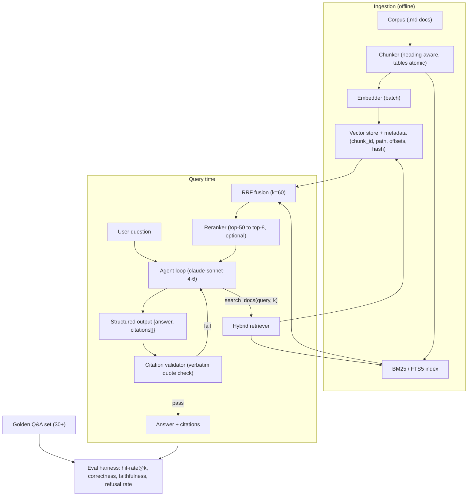

# Project 2: RAG Knowledge Agent

> **Phase:** Core Agent Engineering
> **Estimated effort:** 20–30 hours
> **Prerequisites:** Project 1, [Module 04 – RAG Fundamentals](../modules/04-rag-fundamentals.md), [Module 08 – Agentic RAG](../modules/08-agentic-rag.md)

---

## Objective

Build a question-answering agent over a real documentation corpus (pick one: a product's docs export, a set of internal runbooks, or ~200 Markdown files from an OSS project). The system must implement **hybrid retrieval** (BM25 + dense embeddings fused with Reciprocal Rank Fusion), an optional **reranking** stage, and expose retrieval **as a tool** so the agent decides when and how often to search (agentic RAG, not single-shot RAG). Answers must carry **enforced citations**, and the whole system must be measurable via an **eval harness** with a golden Q&A set and automated faithfulness scoring.

This project teaches the difference between "RAG demo" and "RAG system": the demo is the first 20%; retrieval quality measurement, citation enforcement, and regression detection are the other 80%.

## Skills Exercised

| Skill | Module |
|---|---|
| Chunking, embeddings, vector + lexical search | [04-rag-fundamentals](../modules/04-rag-fundamentals.md) |
| Context-window budgeting for retrieved content | [01-llm-fundamentals](../modules/01-llm-fundamentals.md) |
| Retrieval-as-a-tool, multi-hop query decomposition | [08-agentic-rag](../modules/08-agentic-rag.md) |
| Tool design & structured outputs for citations | [03-structured-outputs-and-tool-use](../modules/03-structured-outputs-and-tool-use.md) |
| Golden sets, LLM-as-judge, faithfulness metrics | [12-evaluation-and-testing](../modules/12-evaluation-and-testing.md) |
| Cost engineering (embedding + rerank costs) | [15-cost-engineering](../modules/15-cost-engineering.md) |

## Requirements

### Functional

1. **Ingestion pipeline** (`ingest.py`): walk the corpus → chunk (heading-aware, 400–800 tokens, 10–15% overlap; tables and code blocks kept atomic) → embed → store. Persist chunk metadata: source path, heading trail, char offsets, content hash.
2. **Hybrid retrieval**: BM25 index (e.g., `rank_bm25` or SQLite FTS5) + dense index (any local store: FAISS, Chroma, or plain numpy). Fuse with **RRF**: `score(d) = Σ 1/(k + rank_i(d))`, k=60.
3. **Rerank**: take top-50 fused candidates → rerank to top-8 (cross-encoder, or an LLM-rater using claude-haiku scoring relevance 0–3). Reranker must be optional via flag so you can A/B its effect.
4. **Agentic retrieval**: retrieval is a tool (`search_docs(query, k)`); the agent may call it multiple times, reformulate queries, and decompose multi-hop questions. Max 5 retrieval calls per question.
5. **Citation enforcement**: final answers are produced as structured output `{answer, citations: [{chunk_id, quote}]}`. A post-hoc validator checks every `quote` is a verbatim (whitespace-normalized) substring of the cited chunk; answers failing validation get one repair retry, then are flagged.
6. **Eval harness** (`eval.py`): runs a golden set of ≥ 30 Q&A pairs (you author them from the corpus: 20 answerable single-hop, 5 multi-hop, 5 *unanswerable* — the correct behavior is to say so). Reports retrieval hit-rate@k, answer correctness (LLM-judge vs gold), faithfulness (claims supported by cited chunks), and unanswerable-refusal rate.

### Non-Functional

- **Reproducible ingest**: re-running ingest on an unchanged corpus is a no-op (content hashes); changed files re-embed only their chunks.
- **Latency budget**: p50 end-to-end ≤ 15s for single-hop questions (document where time goes).
- **Cost tracking**: log embedding tokens, rerank calls, and generation tokens per question; print $/question in eval output.
- **No silent truncation**: if retrieved context exceeds the prompt budget, drop whole lowest-ranked chunks and log it — never cut a chunk mid-way.
- **Config in one place**: chunk size, k values, RRF constant, rerank on/off — all flags/env, no magic numbers scattered in code.

## Suggested Architecture



## Milestones

### M1 — Ingest + lexical baseline (acceptance criteria)
- [ ] Corpus ingested; chunk count and token histogram printed; tables/code blocks verified unsplit (spot check 5).
- [ ] BM25-only `search(query)` returns sensible top-5 for 10 hand-written queries.
- [ ] Re-running ingest is a no-op (hash check) and completes in < 5s.

### M2 — Hybrid + RRF (acceptance criteria)
- [ ] Dense index built; `search` runs both retrievers and fuses with RRF.
- [ ] On your 10 queries, hybrid hit-rate@5 ≥ both BM25-only and dense-only (record the table — this comparison *is* the deliverable).

### M3 — Rerank + single-shot RAG (acceptance criteria)
- [ ] Reranker narrows 50 → 8; measured Δ in hit-rate@8 with rerank on vs off.
- [ ] A single-shot pipeline (retrieve once → answer) works end-to-end with citations in the prompt.

### M4 — Agentic RAG (acceptance criteria)
- [ ] Retrieval is a tool; the agent answers a multi-hop question ("what changed between X and Y?") using ≥ 2 distinct search calls with different queries.
- [ ] Retrieval-call cap enforced; agent answers "not found in the docs" for an out-of-corpus question instead of hallucinating.

### M5 — Citation enforcement (acceptance criteria)
- [ ] Structured output schema enforced via `output_config.format`; validator rejects fabricated quotes.
- [ ] Repair retry fixes ≥ half of validation failures; remainder flagged in output.

### M6 — Eval harness (acceptance criteria)
- [ ] 30+ golden Q&A authored and versioned in `golden/qa.jsonl`.
- [ ] `python eval.py` prints: retrieval hit-rate@8, correctness %, faithfulness %, unanswerable-refusal %, $/question, p50/p95 latency.
- [ ] One deliberate regression (e.g., chunk size 4000) demonstrably tanks a metric — proving the harness detects regressions.

## Starter Code

```python
"""
Project 2: RAG Knowledge Agent — core skeleton.
Files to split out later: ingest.py, retrieve.py, agent.py, eval.py
"""
from __future__ import annotations

import hashlib
import json
import math
import re
from collections import defaultdict
from dataclasses import dataclass
from typing import Any

import anthropic

MODEL = "claude-sonnet-4-6"
RERANK_MODEL = "claude-haiku-4-5"   # cheap relevance rater
RRF_K = 60
FUSE_TOP = 50
FINAL_K = 8
MAX_SEARCH_CALLS = 5

# ------------------------------------------------------------- chunking ----

@dataclass
class Chunk:
    chunk_id: str
    source: str
    heading_trail: str
    text: str

def chunk_markdown(source: str, text: str,
                   target_tokens: int = 600, overlap_ratio: float = 0.12) -> list[Chunk]:
    """Heading-aware chunker. TODO:
       - split on heading boundaries first, then pack sections to ~target_tokens
       - keep fenced code blocks and tables atomic (never split inside ``` or | rows)
       - carry the heading trail (H1 > H2 > H3) into each chunk's metadata AND text
    """
    chunks: list[Chunk] = []
    sections = re.split(r"(?m)^(?=#{1,3} )", text)
    for sec in sections:
        if not sec.strip():
            continue
        heading = sec.splitlines()[0].lstrip("# ").strip()
        cid = hashlib.sha1(f"{source}:{heading}:{sec[:64]}".encode()).hexdigest()[:12]
        chunks.append(Chunk(cid, source, heading, sec.strip()))
        # TODO: pack/split sections to the token target with overlap
    return chunks

# ------------------------------------------------------ hybrid retrieval ----

class HybridRetriever:
    def __init__(self, chunks: list[Chunk]):
        self.chunks = {c.chunk_id: c for c in chunks}
        self.bm25 = self._build_bm25(chunks)      # TODO: rank_bm25 / FTS5
        self.dense = self._build_dense(chunks)    # TODO: embed + store vectors

    def _build_bm25(self, chunks): ...
    def _build_dense(self, chunks): ...

    def bm25_rank(self, query: str, n: int) -> list[str]:
        """Return chunk_ids best-first. TODO."""
        raise NotImplementedError

    def dense_rank(self, query: str, n: int) -> list[str]:
        """Return chunk_ids best-first by cosine similarity. TODO."""
        raise NotImplementedError

    def search(self, query: str, k: int = FINAL_K, rerank: bool = True) -> list[Chunk]:
        ranked_lists = [self.bm25_rank(query, FUSE_TOP), self.dense_rank(query, FUSE_TOP)]
        fused: dict[str, float] = defaultdict(float)
        for ranking in ranked_lists:
            for rank, cid in enumerate(ranking, start=1):
                fused[cid] += 1.0 / (RRF_K + rank)
        candidates = sorted(fused, key=fused.get, reverse=True)[:FUSE_TOP]
        if rerank:
            candidates = self.rerank(query, candidates)
        return [self.chunks[cid] for cid in candidates[:k]]

    def rerank(self, query: str, candidate_ids: list[str]) -> list[str]:
        """LLM-rater rerank: score each candidate 0-3 for relevance with claude-haiku-4-5,
        batched ~10 chunks per call to control cost. TODO: implement + cache scores."""
        return candidate_ids  # passthrough until implemented

# ------------------------------------------------------------- the agent ----

SEARCH_TOOL = {
    "name": "search_docs",
    "description": ("Search the documentation corpus. Call multiple times with DIFFERENT "
                    "queries for multi-part questions. Prefer specific noun-phrase queries "
                    "over full sentences. Returns chunks with chunk_id for citation."),
    "input_schema": {
        "type": "object",
        "properties": {
            "query": {"type": "string", "description": "Focused search query"},
            "k": {"type": "integer", "description": "Number of chunks (default 8, max 12)"},
        },
        "required": ["query"],
    },
}

ANSWER_SCHEMA = {
    "type": "json_schema",
    "schema": {
        "type": "object",
        "properties": {
            "answer": {"type": "string"},
            "answerable": {"type": "boolean"},
            "citations": {
                "type": "array",
                "items": {
                    "type": "object",
                    "properties": {
                        "chunk_id": {"type": "string"},
                        "quote": {"type": "string"},
                    },
                    "required": ["chunk_id", "quote"],
                    "additionalProperties": False,
                },
            },
        },
        "required": ["answer", "answerable", "citations"],
        "additionalProperties": False,
    },
}

SYSTEM = """You answer questions strictly from the documentation corpus via search_docs.
Rules:
- Search before answering. Reformulate and search again if results are weak.
- Every factual claim must be backed by a citation with a VERBATIM quote.
- If the docs do not contain the answer, set answerable=false and say so plainly.
"""

def answer_question(client: anthropic.Anthropic, retriever: HybridRetriever,
                    question: str) -> dict[str, Any]:
    messages: list[dict[str, Any]] = [{"role": "user", "content": question}]
    searches = 0
    while True:
        response = client.messages.create(
            model=MODEL, max_tokens=4096, system=SYSTEM,
            tools=[SEARCH_TOOL], messages=messages,
            output_config={"format": ANSWER_SCHEMA},
        )
        messages.append({"role": "assistant", "content": response.content})
        if response.stop_reason != "tool_use":
            break
        results = []
        for block in response.content:
            if block.type == "tool_use":
                searches += 1
                if searches > MAX_SEARCH_CALLS:
                    results.append({"type": "tool_result", "tool_use_id": block.id,
                                    "content": "Search budget exhausted. Answer with what you have.",
                                    "is_error": True})
                    continue
                k = min(int(block.input.get("k", FINAL_K)), 12)
                chunks = retriever.search(block.input["query"], k=k)
                payload = [{"chunk_id": c.chunk_id, "heading": c.heading_trail,
                            "text": c.text} for c in chunks]
                results.append({"type": "tool_result", "tool_use_id": block.id,
                                "content": json.dumps(payload)})
        messages.append({"role": "user", "content": results})

    text = next(b.text for b in response.content if b.type == "text")
    parsed = json.loads(text)
    return validate_citations(parsed, retriever)

def validate_citations(parsed: dict[str, Any], retriever: HybridRetriever) -> dict[str, Any]:
    norm = lambda s: re.sub(r"\s+", " ", s).strip().lower()
    failures = []
    for cit in parsed.get("citations", []):
        chunk = retriever.chunks.get(cit["chunk_id"])
        if chunk is None or norm(cit["quote"]) not in norm(chunk.text):
            failures.append(cit)
    parsed["citation_failures"] = failures
    # TODO(M5): on failures, send one repair turn asking the model to fix or drop
    # the offending citations, then re-validate; flag if still failing.
    return parsed

# ------------------------------------------------------------ eval stub ----

def run_eval(golden_path: str = "golden/qa.jsonl") -> None:
    """TODO(M6):
       - load golden set: {question, gold_answer, gold_chunk_ids, answerable}
       - per question: record hit-rate@8 (gold chunk retrieved?), LLM-judge correctness
         (claude-sonnet-4-6 as judge with a 1-5 rubric), faithfulness (each answer claim
         entailed by cited chunks?), refusal correctness for unanswerable items
       - print aggregate table + $/question + p50/p95 latency
    """
    raise NotImplementedError

if __name__ == "__main__":
    print("Wire up: ingest -> HybridRetriever -> answer_question -> run_eval")
```

## Stretch Goals

1. **Query decomposition planner** — for multi-hop questions, a first cheap call (haiku) produces sub-queries executed in parallel before the main agent runs.
2. **HyDE** — embed a hypothetical answer instead of the raw query for dense retrieval; measure Δ hit-rate.
3. **Contextual chunk headers** — prepend an LLM-generated 1-line summary of the parent document to each chunk before embedding (contextual retrieval); measure Δ.
4. **Incremental index updates** — watch the corpus directory and re-embed changed files live.
5. **Prompt-cache the corpus tool definition + system prompt** and measure cost reduction across an eval run.
6. **Negative-mining for the golden set** — add 10 "trap" questions whose plausible-but-wrong answer appears in the corpus; measure whether faithfulness scoring catches the traps.

## Grading Rubric

| Criterion | Novice | Competent | Expert |
|---|---|---|---|
| Chunking | Fixed-size splits that bisect tables/code | Heading-aware, atomic tables/code, sane overlap | Plus contextual headers and measured chunk-size ablation (at least 3 settings compared) |
| Retrieval | Single retriever, no measurement | Hybrid + RRF working, hit-rate measured vs single-retriever baselines | Plus rerank A/B with cost/latency tradeoff documented and a tuned k/RRF-constant |
| Agentic behavior | One fixed retrieval before generation | Retrieval-as-tool with reformulation, capped calls | Plus multi-hop decomposition and graceful "not in corpus" refusals verified by evals |
| Citations | Citations are decorative (unvalidated) | Verbatim-quote validator + repair retry | Plus claim-level faithfulness scoring; fabrication rate < 2% on golden set |
| Eval harness | Manual eyeballing | 30+ golden Q&A, automated metrics, runs in one command | Plus regression demonstration, judge-prompt calibrated against 10 human-labeled answers, results tracked across config changes |
| Cost & latency | Unmeasured | $/question and p50/p95 reported | Plus per-stage breakdown (embed/retrieve/rerank/generate) and one optimization with measured before/after |

## Common Pitfalls

- **Chunking destroys tables.** A 7-row pricing table split across 3 chunks is unanswerable. Keep structured blocks atomic even if it busts the token target.
- **Evaluating generation before retrieval.** If the gold chunk isn't in the top-k, no prompt will save you. Always report hit-rate separately from answer quality.
- **RRF on raw scores.** RRF fuses *ranks*, not scores — don't normalize and add cosine + BM25 scores; that's a different (and fragile) method.
- **Reranking everything.** Rerank 50 candidates, not 1000 — rerank cost scales linearly with candidates and is the easiest way to silently 10× your bill.
- **LLM-judge grading its own homework.** Use a different prompt (and ideally model) for judging than for answering, give it the gold answer, and calibrate it against a small human-labeled sample.
- **Citations checked by the model itself.** "Be honest" is not enforcement. The verbatim substring check is cheap, deterministic, and catches real fabrication.
- **Golden set with only easy questions.** Include multi-hop, unanswerable, and trap questions — that's where systems differ.
- **Forgetting the unanswerable case.** An agent that always answers is worse than no agent in enterprise settings; measure refusal correctness explicitly.
