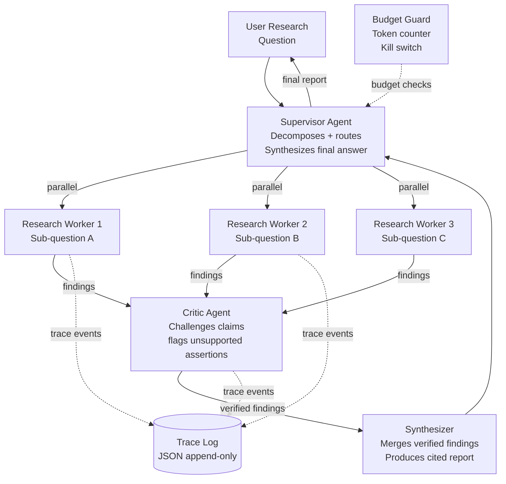

# Project 3 — Multi-Agent Research System

> **Phase 3 — Multi-Agent & Orchestration** | Builds on: [Project 02](project-02-rag-agent.md), [Module 09](../modules/09-multi-agent-systems.md), [Module 10](../modules/10-orchestration.md)

---

## Objective

Build a **Supervisor → Parallel Researcher Workers → Critic/Verifier → Synthesizer** multi-agent research pipeline that answers complex questions by fanning out to parallel specialists, verifying claims adversarially, and synthesizing a cited final report.

**Skills exercised:** Modules 08, 09, 10, 11, 12, 16

---

## Requirements

### Functional
1. Supervisor decomposes a research question into 3-5 sub-questions
2. Each sub-question is dispatched to a parallel research worker
3. Workers use web search and document retrieval tools to gather evidence
4. A critic/verifier agent challenges each worker's key claims
5. Synthesizer produces a final report with citations
6. The system enforces a configurable per-task token budget
7. All inter-agent messages are structured (JSON schema validated)
8. Trace log records every agent decision

### Non-functional
- Total task latency ≤ 120 seconds for a 3-worker task (workers run in parallel)
- Cost per research task ≤ $0.50
- Handles individual worker failure gracefully (continue with remaining workers)
- Output includes confidence level and evidence quality score

---

## Suggested Architecture



---

## Milestones

### Milestone 1: Supervisor + Serial Workers (acceptance: single worker produces a result)
- Supervisor decomposes question into sub-questions
- Single research worker with 2 tools (web_search stub, read_document stub)
- JSON schema for worker output: `{sub_question, findings: [{claim, source, confidence}], summary}`
- Turn + cost tracking per worker

### Milestone 2: Parallel Worker Execution (acceptance: 3 workers complete in <2× single worker time)
- `asyncio.gather` for parallel worker dispatch
- Worker timeout (30s per worker)
- Graceful handling of worker failures (continue with partial results)
- Worker budget allocation (total budget / number of workers)

### Milestone 3: Critic/Verifier Agent (acceptance: critic flags at least 1 unsupported claim in test case)
- Critic receives all worker findings
- For each high-confidence claim, critic attempts to find contradicting evidence
- Output: `{claim, verdict: "supported"|"unsupported"|"uncertain", reason, evidence}`
- Claims marked "unsupported" are excluded from synthesis

### Milestone 4: Synthesizer and Final Report (acceptance: produces structured report with citations)
- Synthesizer receives verified findings
- Output format: `{title, summary, sections: [{heading, content, citations}], confidence_score}`
- Citations link back to worker source evidence
- Quality metric: faithfulness (all claims in report supported by evidence)

### Milestone 5: Observability and Budget Controls (acceptance: trace replay and budget enforcement work)
- Append-only trace log: every agent, every decision, every tool call
- Budget hard limit: task fails gracefully when budget is exhausted
- Budget report in final output: `{total_cost_usd, workers_cost, critic_cost, synthesizer_cost}`
- Replay function: given a trace log, re-run the task step-by-step

---

## Starter Code

```python
"""
project-03: Multi-agent research system skeleton.
Fill in the TODOs to complete the implementation.
"""

import asyncio
import json
import time
import uuid
from dataclasses import dataclass, field
from typing import Optional
import anthropic

client = anthropic.Anthropic()

# ── Schemas ──────────────────────────────────────────────────────────────────

@dataclass
class Finding:
    claim: str
    source: str
    confidence: float  # 0.0 - 1.0

@dataclass
class WorkerResult:
    worker_id: str
    sub_question: str
    findings: list[Finding]
    summary: str
    cost_usd: float
    status: str  # "success" | "failed" | "timeout"

@dataclass
class CriticVerdict:
    claim: str
    verdict: str  # "supported" | "unsupported" | "uncertain"
    reason: str

@dataclass
class ResearchReport:
    title: str
    summary: str
    sections: list[dict]
    confidence_score: float
    cost_usd: float
    trace_id: str

# ── Tools (stubs — replace with real implementations) ──────────────────────

def web_search(query: str, num_results: int = 5) -> str:
    """TODO: Replace with real web search implementation."""
    return json.dumps([
        {"title": f"Result for {query}", "snippet": "Example content...", "url": f"https://example.com/{i}"}
        for i in range(num_results)
    ])

def read_document(url: str) -> str:
    """TODO: Replace with real document fetcher."""
    return f"Document content from {url}: [stub content]"

RESEARCH_TOOLS = [
    {
        "name": "web_search",
        "description": "Search the web for current information on a topic",
        "input_schema": {
            "type": "object",
            "properties": {
                "query": {"type": "string", "description": "Search query"},
                "num_results": {"type": "integer", "default": 5}
            },
            "required": ["query"]
        }
    },
    {
        "name": "read_document",
        "description": "Read the full content of a web page or document",
        "input_schema": {
            "type": "object",
            "properties": {
                "url": {"type": "string", "description": "URL to read"}
            },
            "required": ["url"]
        }
    }
]

TOOL_HANDLERS = {
    "web_search": web_search,
    "read_document": read_document,
}

# ── Budget Guard ─────────────────────────────────────────────────────────────

class BudgetGuard:
    def __init__(self, max_cost_usd: float):
        self.max_cost_usd = max_cost_usd
        self.spent_usd = 0.0
    
    def record(self, input_tokens: int, output_tokens: int) -> float:
        cost = (input_tokens * 3 + output_tokens * 15) / 1_000_000
        self.spent_usd += cost
        return cost
    
    def check(self) -> bool:
        """Returns True if budget is still available."""
        return self.spent_usd < self.max_cost_usd
    
    @property
    def remaining(self) -> float:
        return max(0.0, self.max_cost_usd - self.spent_usd)

# ── Trace Logger ─────────────────────────────────────────────────────────────

class TraceLog:
    def __init__(self, trace_id: str, log_path: str = "/tmp/agent_traces"):
        self.trace_id = trace_id
        self.events: list[dict] = []
    
    def log(self, agent: str, event_type: str, data: dict):
        event = {
            "timestamp": time.time(),
            "trace_id": self.trace_id,
            "agent": agent,
            "event": event_type,
            "data": data,
        }
        self.events.append(event)
    
    def to_json(self) -> str:
        return json.dumps(self.events, indent=2, default=str)

# ── Supervisor ────────────────────────────────────────────────────────────────

SUPERVISOR_SYSTEM = """You are a research supervisor. Break down research questions into specific sub-questions.

When given a research question, respond with a JSON object:
{
  "sub_questions": ["sub_question_1", "sub_question_2", ...],
  "rationale": "why these sub_questions cover the main question"
}

Generate 3-5 specific, answerable sub-questions that together fully address the main question."""

async def supervisor_decompose(question: str, budget: BudgetGuard, trace: TraceLog) -> list[str]:
    """TODO: Implement supervisor decomposition."""
    resp = client.messages.create(
        model="claude-sonnet-4-6",
        max_tokens=500,
        system=SUPERVISOR_SYSTEM,
        messages=[{"role": "user", "content": f"Research question: {question}"}],
    )
    budget.record(resp.usage.input_tokens, resp.usage.output_tokens)
    trace.log("supervisor", "decompose", {"question": question})
    
    try:
        result = json.loads(resp.content[0].text)
        return result.get("sub_questions", [])
    except json.JSONDecodeError:
        # Fallback: use the question as-is
        return [question]

# ── Research Worker ───────────────────────────────────────────────────────────

WORKER_SYSTEM = """You are a research specialist. Gather evidence to answer the given sub-question.
Use web search and document reading tools to find relevant information.
When you have enough evidence (3+ sources), produce a structured summary.

Final answer must be valid JSON:
{
  "findings": [
    {"claim": "specific factual claim", "source": "URL or source name", "confidence": 0.0-1.0}
  ],
  "summary": "2-3 sentence summary of findings"
}"""

async def run_research_worker(
    worker_id: str,
    sub_question: str,
    worker_budget: float,
    trace: TraceLog,
    timeout: float = 60.0,
) -> WorkerResult:
    """TODO: Implement a full research worker agent."""
    messages = [{"role": "user", "content": sub_question}]
    budget = BudgetGuard(max_cost_usd=worker_budget)
    
    try:
        async with asyncio.timeout(timeout):
            for _ in range(8):  # Max 8 turns per worker
                if not budget.check():
                    break
                
                resp = await asyncio.to_thread(
                    client.messages.create,
                    model="claude-sonnet-4-6",
                    max_tokens=1024,
                    system=WORKER_SYSTEM,
                    tools=RESEARCH_TOOLS,
                    messages=messages,
                )
                
                budget.record(resp.usage.input_tokens, resp.usage.output_tokens)
                messages.append({"role": "assistant", "content": resp.content})
                
                if resp.stop_reason == "end_turn":
                    try:
                        result = json.loads(resp.content[0].text)
                        findings = [
                            Finding(f["claim"], f["source"], f["confidence"])
                            for f in result.get("findings", [])
                        ]
                        return WorkerResult(
                            worker_id=worker_id,
                            sub_question=sub_question,
                            findings=findings,
                            summary=result.get("summary", ""),
                            cost_usd=budget.spent_usd,
                            status="success",
                        )
                    except (json.JSONDecodeError, KeyError):
                        pass
                
                if resp.stop_reason == "tool_use":
                    tool_results = []
                    for block in resp.content:
                        if block.type != "tool_use":
                            continue
                        handler = TOOL_HANDLERS.get(block.name)
                        try:
                            result = handler(**block.input) if handler else "Unknown tool"
                            is_error = handler is None
                        except Exception as e:
                            result = str(e); is_error = True
                        
                        tool_results.append({
                            "type": "tool_result",
                            "tool_use_id": block.id,
                            "content": str(result)[:3000],
                            "is_error": is_error,
                        })
                    messages.append({"role": "user", "content": tool_results})
    
    except asyncio.TimeoutError:
        return WorkerResult(worker_id=worker_id, sub_question=sub_question,
                           findings=[], summary="", cost_usd=budget.spent_usd, status="timeout")
    except Exception as e:
        return WorkerResult(worker_id=worker_id, sub_question=sub_question,
                           findings=[], summary=str(e), cost_usd=budget.spent_usd, status="failed")
    
    return WorkerResult(worker_id=worker_id, sub_question=sub_question,
                       findings=[], summary="Budget exhausted", cost_usd=budget.spent_usd, status="failed")

# ── Critic ────────────────────────────────────────────────────────────────────

CRITIC_SYSTEM = """You are a critical fact-checker. For each claim, determine if it's well-supported.
Respond with JSON: {"verdicts": [{"claim": "...", "verdict": "supported|unsupported|uncertain", "reason": "..."}]}"""

async def run_critic(
    worker_results: list[WorkerResult],
    budget: BudgetGuard,
    trace: TraceLog,
) -> list[CriticVerdict]:
    """TODO: Implement the critic agent."""
    all_claims = [
        f for wr in worker_results
        for f in wr.findings
        if wr.status == "success"
    ]
    
    if not all_claims:
        return []
    
    claims_text = json.dumps([
        {"claim": f.claim, "source": f.source, "confidence": f.confidence}
        for f in all_claims[:10]  # Limit to 10 claims to control cost
    ], indent=2)
    
    resp = await asyncio.to_thread(
        client.messages.create,
        model="claude-sonnet-4-6",
        max_tokens=1000,
        system=CRITIC_SYSTEM,
        messages=[{"role": "user", "content": f"Evaluate these claims:\n{claims_text}"}],
    )
    budget.record(resp.usage.input_tokens, resp.usage.output_tokens)
    trace.log("critic", "evaluate", {"num_claims": len(all_claims)})
    
    try:
        result = json.loads(resp.content[0].text)
        return [
            CriticVerdict(v["claim"], v["verdict"], v["reason"])
            for v in result.get("verdicts", [])
        ]
    except (json.JSONDecodeError, KeyError):
        return []

# ── Synthesizer ───────────────────────────────────────────────────────────────

SYNTH_SYSTEM = """You are a research synthesizer. Create a structured report from verified research findings.
Include only claims that are "supported" or "uncertain" — exclude "unsupported" claims.
Output JSON: {"title": "...", "summary": "...", "sections": [{"heading": "...", "content": "...", "citations": [...]}], "confidence_score": 0.0-1.0}"""

async def run_synthesizer(
    question: str,
    worker_results: list[WorkerResult],
    verdicts: list[CriticVerdict],
    budget: BudgetGuard,
    trace: TraceLog,
) -> ResearchReport:
    """TODO: Implement the synthesizer agent."""
    supported = {v.claim for v in verdicts if v.verdict in ("supported", "uncertain")}
    
    verified_findings = []
    for wr in worker_results:
        if wr.status == "success":
            for f in wr.findings:
                if f.claim in supported or not verdicts:  # If no verdicts, include all
                    verified_findings.append({"claim": f.claim, "source": f.source})
    
    synthesis_prompt = f"""Research question: {question}

Verified findings:
{json.dumps(verified_findings, indent=2)}

Create a structured research report."""
    
    resp = await asyncio.to_thread(
        client.messages.create,
        model="claude-sonnet-4-6",
        max_tokens=2000,
        system=SYNTH_SYSTEM,
        messages=[{"role": "user", "content": synthesis_prompt}],
    )
    budget.record(resp.usage.input_tokens, resp.usage.output_tokens)
    trace.log("synthesizer", "produce_report", {"findings_count": len(verified_findings)})
    
    try:
        result = json.loads(resp.content[0].text)
        return ResearchReport(
            title=result.get("title", question[:80]),
            summary=result.get("summary", ""),
            sections=result.get("sections", []),
            confidence_score=result.get("confidence_score", 0.5),
            cost_usd=budget.spent_usd,
            trace_id=trace.trace_id,
        )
    except (json.JSONDecodeError, KeyError):
        return ResearchReport(
            title=question[:80], summary="Synthesis failed", sections=[],
            confidence_score=0.0, cost_usd=budget.spent_usd, trace_id=trace.trace_id,
        )

# ── Main Orchestrator ─────────────────────────────────────────────────────────

async def research(question: str, max_cost_usd: float = 0.50) -> ResearchReport:
    """
    Run the full multi-agent research pipeline.
    """
    trace_id = str(uuid.uuid4())[:8]
    trace = TraceLog(trace_id)
    budget = BudgetGuard(max_cost_usd)
    
    trace.log("orchestrator", "start", {"question": question, "budget": max_cost_usd})
    
    # Step 1: Supervisor decomposes the question
    sub_questions = await supervisor_decompose(question, budget, trace)
    print(f"[{trace_id}] Decomposed into {len(sub_questions)} sub-questions")
    
    # Step 2: Workers run in parallel
    worker_budget = budget.remaining / (len(sub_questions) + 2)  # Reserve for critic + synth
    worker_tasks = [
        run_research_worker(
            worker_id=f"worker-{i}",
            sub_question=sq,
            worker_budget=worker_budget,
            trace=trace,
        )
        for i, sq in enumerate(sub_questions)
    ]
    worker_results = await asyncio.gather(*worker_tasks)
    print(f"[{trace_id}] Workers complete: {sum(1 for w in worker_results if w.status == 'success')}/{len(worker_results)} successful")
    
    # Step 3: Critic verifies claims
    verdicts = await run_critic(list(worker_results), budget, trace)
    print(f"[{trace_id}] Critic produced {len(verdicts)} verdicts")
    
    # Step 4: Synthesizer produces final report
    report = await run_synthesizer(question, list(worker_results), verdicts, budget, trace)
    trace.log("orchestrator", "complete", {"cost": budget.spent_usd, "confidence": report.confidence_score})
    
    return report


if __name__ == "__main__":
    question = "What are the key advantages and limitations of transformer-based language models compared to other AI architectures?"
    report = asyncio.run(research(question, max_cost_usd=0.30))
    print(f"\n=== Research Report ===")
    print(f"Title: {report.title}")
    print(f"Summary: {report.summary}")
    print(f"Confidence: {report.confidence_score:.0%}")
    print(f"Cost: ${report.cost_usd:.4f}")
    print(f"Trace ID: {report.trace_id}")
```

---

## Stretch Goals

1. **Add a replanner** — if >50% of workers fail, supervisor reformulates the sub-questions and reruns
2. **Confidence-weighted synthesis** — give higher weight to claims from workers with better track records
3. **Persistent trace store** — store traces in SQLite so you can replay any task
4. **Multi-round research** — synthesizer identifies gaps and requests additional research rounds
5. **Streaming output** — stream sections of the report as they're completed

---

## Grading Rubric

| Criterion | Novice | Competent | Expert |
|-----------|--------|-----------|--------|
| Parallelism | Workers run sequentially | Workers run in parallel with asyncio | Workers run in parallel with proper timeouts and partial failure handling |
| Critic design | No critic; all claims accepted | Critic checks claims; some are filtered | Critic uses adversarial search (attempts to find contradicting evidence) |
| Budget control | No budget tracking | Budget tracked; no enforcement | Hard limit enforced; graceful partial result on budget exhaustion |
| Trace quality | No tracing | Basic event log | Full trace with replay capability and structured schema |
| Error handling | Fails on any worker error | Worker failures logged and skipped | Partial results preserved; report quality score reflects missing workers |
| Output quality | Free-form text | Structured JSON output | Structured output with citations linking to specific source evidence |

---

## Common Pitfalls

- **Passing full conversation history between agents.** Workers should return compact JSON results, not their full conversation. The synthesizer's context should contain only final results.
- **Not limiting findings count.** Each worker can produce many findings. If 5 workers each produce 20 findings, the critic receives 100 claims — expensive and slow. Cap at 5-10 per worker.
- **Synthesis not grounded.** The synthesizer must only assert what's in the verified findings. Prompt it explicitly: "Only include claims from the provided findings list."
- **No worker failure handling.** `asyncio.gather` by default raises on first exception. Use `return_exceptions=True` and filter results.
