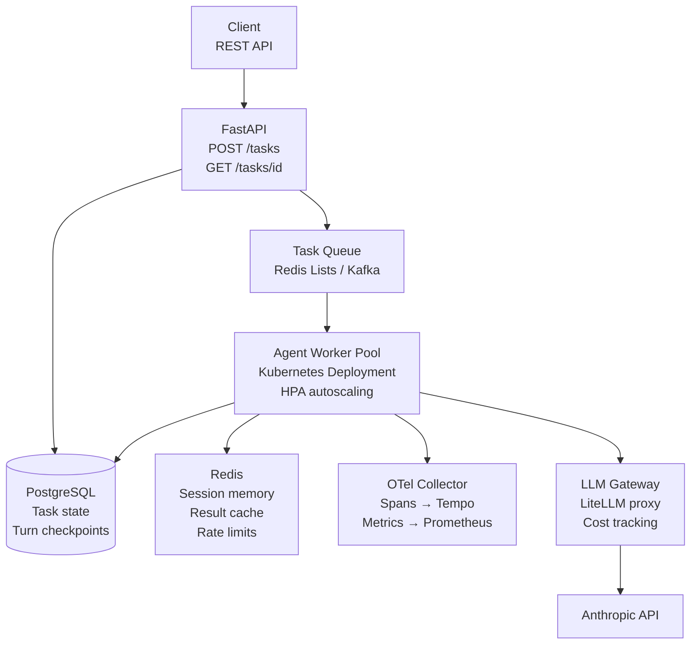

# Project 4 — Production Agent Platform

> **Phase 4 — Production Platform Engineering** | Builds on: [Project 03](project-03-multi-agent.md), Modules 13-16

---

## Objective

Wrap the Project 3 research system as a **production-grade API service** with Postgres checkpointing, Redis session memory, a worker pool backed by a task queue, OTel tracing, cost metering per request, an eval-gated CI pipeline, and Kubernetes deployment manifests.

**Skills exercised:** Modules 12, 13, 14, 15, 16

---

## Requirements

### Functional
1. REST API: `POST /tasks` (submit), `GET /tasks/{id}` (status/result), `DELETE /tasks/{id}` (cancel)
2. Async task execution via a worker pool (not synchronous HTTP)
3. Durable checkpoint: task survives worker crash and resumes from last completed turn
4. Redis: session working memory + per-task result cache
5. OTel spans for every LLM call and tool call
6. Cost metered per request; endpoint returns `cost_usd` in response
7. Eval gate in CI: run golden dataset before any deployment

### Non-functional
- API response to `POST /tasks` < 200ms (queue, don't block)
- Task pickup latency < 2s (time from submission to first agent turn)
- P95 task completion < 60s for a 3-question research task
- Zero-downtime deployment via rolling update
- 99.9% availability SLA design

---

## Suggested Architecture



---

## Milestones

### Milestone 1: FastAPI Service (acceptance: POST/GET/DELETE work; tasks queued)
- FastAPI app with Pydantic models for request/response
- `POST /tasks`: validates request, creates task record in Postgres, enqueues task ID
- `GET /tasks/{id}`: returns task status and result from Postgres
- `DELETE /tasks/{id}`: marks task as cancelled in Postgres
- Health check: `GET /health` with DB connectivity check

### Milestone 2: Worker Pool with Postgres Checkpointing (acceptance: worker crash → resume from last checkpoint)
- Async worker that pulls task IDs from the queue
- On each turn: saves messages array + turn number to Postgres before calling LLM
- On startup: loads checkpoint if task_id has an existing partial state
- Test: kill the worker mid-task; restart; verify task completes

### Milestone 3: Redis Integration (acceptance: cache hit reduces task latency by >50%)
- Working memory: store active task context in Redis with 24h TTL
- Semantic result cache: hash task goal; cache result for identical goals with 1h TTL
- Rate limiting: per-tenant request rate using Redis INCR + EXPIRE
- Test: submit identical task twice; verify second completes from cache

### Milestone 4: OTel Tracing and Cost Metering (acceptance: trace visible in Jaeger/Grafana Tempo)
- OTel SDK: tracer setup with service name "agent-platform"
- Span per LLM call: `gen_ai.usage.input_tokens`, `gen_ai.usage.output_tokens`, model
- Span per tool call: tool name, args_hash, duration, success/error
- Cost metered from spans: accumulated to task record in Postgres
- `GET /tasks/{id}` response includes `cost_usd`

### Milestone 5: CI Eval Gate + Kubernetes (acceptance: eval gate blocks bad deployment; k8s health probes work)
- GitHub Actions workflow: run 20-case golden dataset on PR; block if pass rate < 80%
- Dockerfile: multi-stage build; non-root user; no secrets in image
- Kubernetes: Deployment (2 replicas), Service, HPA (target CPU 60%), ConfigMap for non-secret config, ExternalSecret or SecretProviderClass for API keys
- Liveness probe: `/health`; readiness probe: can connect to Postgres + Redis

---

## Starter Code

```python
# main.py — FastAPI application
from fastapi import FastAPI, HTTPException, BackgroundTasks
from pydantic import BaseModel
import asyncio
import asyncpg
import redis.asyncio as aioredis
import uuid
import time
from opentelemetry import trace
from opentelemetry.sdk.trace import TracerProvider
from opentelemetry.sdk.trace.export import BatchSpanProcessor
from opentelemetry.exporter.otlp.proto.grpc.trace_exporter import OTLPSpanExporter

# OTel setup
provider = TracerProvider()
provider.add_span_processor(
    BatchSpanProcessor(OTLPSpanExporter(endpoint="http://otel-collector:4317"))
)
trace.set_tracer_provider(provider)
tracer = trace.get_tracer("agent-platform")

app = FastAPI(title="Agent Platform")

# ── Request/Response Models ────────────────────────────────────────────────

class TaskRequest(BaseModel):
    goal: str
    max_cost_usd: float = 0.50
    tenant_id: str = "default"

class TaskResponse(BaseModel):
    task_id: str
    status: str
    result: str | None = None
    cost_usd: float | None = None
    error: str | None = None
    created_at: float
    finished_at: float | None = None

# ── DB Pool ─────────────────────────────────────────────────────────────────

_db_pool: asyncpg.Pool | None = None
_redis: aioredis.Redis | None = None

async def get_db() -> asyncpg.Pool:
    global _db_pool
    if not _db_pool:
        import os
        _db_pool = await asyncpg.create_pool(os.environ["POSTGRES_DSN"])
    return _db_pool

async def get_redis() -> aioredis.Redis:
    global _redis
    if not _redis:
        import os
        _redis = aioredis.from_url(os.environ.get("REDIS_URL", "redis://localhost:6379"))
    return _redis

# ── Endpoints ────────────────────────────────────────────────────────────────

@app.post("/tasks", response_model=TaskResponse, status_code=202)
async def create_task(req: TaskRequest):
    with tracer.start_as_current_span("api.create_task") as span:
        task_id = str(uuid.uuid4())
        span.set_attribute("task.id", task_id)
        span.set_attribute("task.tenant", req.tenant_id)

        db = await get_db()
        await db.execute(
            """INSERT INTO agent_tasks (task_id, tenant_id, agent_type, status, goal_hash)
               VALUES ($1, $2, $3, 'created', $4)""",
            task_id, req.tenant_id, "research", req.goal[:32]
        )

        # Enqueue
        r = await get_redis()
        import json
        await r.lpush("task_queue", json.dumps({
            "task_id": task_id,
            "goal": req.goal,
            "max_cost_usd": req.max_cost_usd,
            "tenant_id": req.tenant_id,
        }))

        return TaskResponse(
            task_id=task_id,
            status="created",
            created_at=time.time(),
        )

@app.get("/tasks/{task_id}", response_model=TaskResponse)
async def get_task(task_id: str):
    db = await get_db()
    row = await db.fetchrow(
        "SELECT * FROM agent_tasks WHERE task_id = $1", task_id
    )
    if not row:
        raise HTTPException(status_code=404, detail="Task not found")
    
    return TaskResponse(
        task_id=row["task_id"],
        status=row["status"],
        result=None,  # TODO: fetch from agent_artifacts table
        cost_usd=float(row["total_cost_usd"]),
        error=row["error_message"],
        created_at=row["started_at"].timestamp(),
        finished_at=row["finished_at"].timestamp() if row["finished_at"] else None,
    )

@app.delete("/tasks/{task_id}", status_code=204)
async def cancel_task(task_id: str):
    db = await get_db()
    result = await db.execute(
        "UPDATE agent_tasks SET status='cancelled' WHERE task_id=$1 AND status IN ('created','running')",
        task_id
    )
    if result == "UPDATE 0":
        raise HTTPException(status_code=404, detail="Task not found or already completed")

@app.get("/health")
async def health():
    try:
        db = await get_db()
        await db.fetchval("SELECT 1")
        r = await get_redis()
        await r.ping()
        return {"status": "healthy"}
    except Exception as e:
        raise HTTPException(status_code=503, detail=str(e))


# worker.py — background worker
import asyncio, json, os
import redis.asyncio as aioredis
import asyncpg

async def run_worker():
    """Pull tasks from the queue and execute them."""
    r = aioredis.from_url(os.environ.get("REDIS_URL", "redis://localhost:6379"))
    db = await asyncpg.create_pool(os.environ["POSTGRES_DSN"])
    
    print("Worker started; listening on task_queue")
    while True:
        # BRPOP blocks up to 5 seconds waiting for a task
        item = await r.brpop("task_queue", timeout=5)
        if not item:
            continue
        
        _, payload_bytes = item
        task = json.loads(payload_bytes)
        task_id = task["task_id"]
        
        print(f"Processing task {task_id}")
        await db.execute(
            "UPDATE agent_tasks SET status='running' WHERE task_id=$1", task_id
        )
        
        try:
            # TODO: import and run the research pipeline from project 03
            # result = await research(task["goal"], task["max_cost_usd"])
            result_text = f"[TODO: implement agent execution for task {task_id}]"
            cost = 0.0
            
            await db.execute(
                """UPDATE agent_tasks SET status='succeeded', total_cost_usd=$2, finished_at=NOW()
                   WHERE task_id=$1""",
                task_id, cost
            )
            # TODO: write result to agent_artifacts table
            
        except Exception as e:
            await db.execute(
                "UPDATE agent_tasks SET status='failed', error_message=$2, finished_at=NOW() WHERE task_id=$1",
                task_id, str(e)[:500]
            )

if __name__ == "__main__":
    asyncio.run(run_worker())
```

### Kubernetes Manifests

```yaml
# k8s/deployment.yaml
apiVersion: apps/v1
kind: Deployment
metadata:
  name: agent-worker
spec:
  replicas: 2
  selector:
    matchLabels:
      app: agent-worker
  template:
    metadata:
      labels:
        app: agent-worker
    spec:
      containers:
      - name: worker
        image: agent-platform:latest
        command: ["python", "worker.py"]
        resources:
          requests:
            cpu: "500m"
            memory: "512Mi"
          limits:
            cpu: "2000m"
            memory: "2Gi"
        env:
        - name: POSTGRES_DSN
          valueFrom:
            secretKeyRef:
              name: agent-secrets
              key: postgres-dsn
        - name: REDIS_URL
          valueFrom:
            secretKeyRef:
              name: agent-secrets
              key: redis-url
        - name: ANTHROPIC_API_KEY
          valueFrom:
            secretKeyRef:
              name: agent-secrets
              key: anthropic-api-key
        livenessProbe:
          exec:
            command: ["python", "-c", "import redis; redis.from_url('redis://localhost').ping()"]
          initialDelaySeconds: 10
          periodSeconds: 30
---
apiVersion: autoscaling/v2
kind: HorizontalPodAutoscaler
metadata:
  name: agent-worker-hpa
spec:
  scaleTargetRef:
    apiVersion: apps/v1
    kind: Deployment
    name: agent-worker
  minReplicas: 2
  maxReplicas: 20
  metrics:
  - type: External
    external:
      metric:
        name: redis_queue_depth
        selector:
          matchLabels:
            queue: task_queue
      target:
        type: AverageValue
        averageValue: "10"  # Scale up when avg queue depth per pod > 10
```

---

## Stretch Goals

1. **Multi-tenant billing**: per-tenant monthly budget enforcement at the API gateway
2. **Streaming results**: WebSocket or SSE endpoint streaming partial results as sections complete
3. **Canary deployment**: deploy new agent version to 10% of workers via traffic routing
4. **Replay API**: `POST /tasks/{id}/replay` — re-runs a completed task step-by-step for debugging
5. **Cost forecast**: `POST /tasks/estimate` — estimate cost before running a task

---

## Grading Rubric

| Criterion | Novice | Competent | Expert |
|-----------|--------|-----------|--------|
| Async architecture | Synchronous HTTP blocking | FastAPI async, tasks queued | Worker pool with backpressure; queue depth monitoring |
| Crash recovery | No checkpointing | Checkpoint after task | Checkpoint after each turn; verified resume test |
| Observability | Print statements | Structured logging | Full OTel trace tree with cost attribution per span |
| CI/CD | No CI | Tests in CI | Eval gate blocks deployment; canary config ready |
| Kubernetes | No k8s | Basic Deployment + Service | HPA, readiness/liveness probes, secrets management |
| Cost metering | No tracking | Total cost tracked | Per-tenant cost attribution; cost returned in API response |

---

## Common Pitfalls

- **Blocking the API thread on agent execution.** The `POST /tasks` endpoint must return immediately. Never run agent logic synchronously in a FastAPI handler.
- **Sharing the asyncpg pool across worker processes.** Pools are not shareable across OS processes. Each worker process creates its own pool.
- **Not implementing readiness probe correctly.** The readiness probe must check DB connectivity. A pod that can receive requests but not write to DB will cause silent failures.
- **Storing the full messages array per turn.** This can grow large. Store the incremental new messages from each turn, not the full accumulated array.
